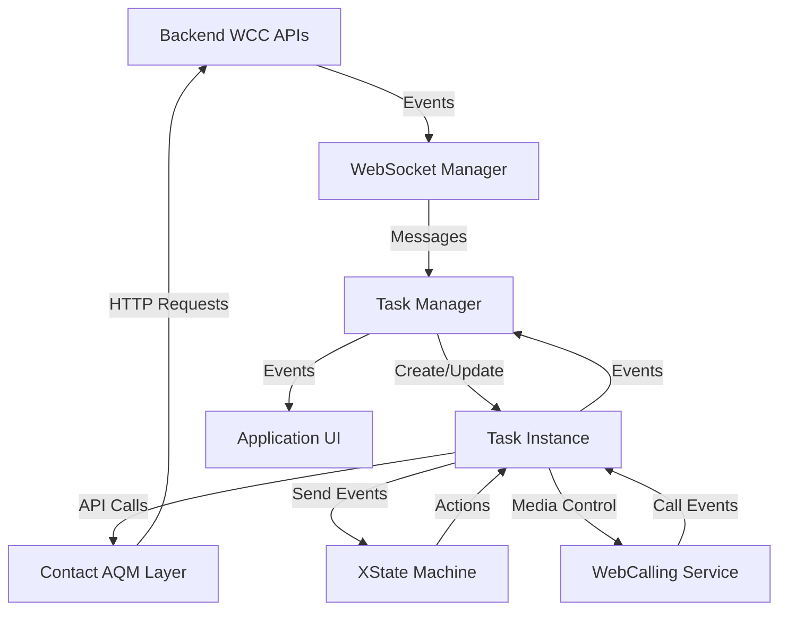
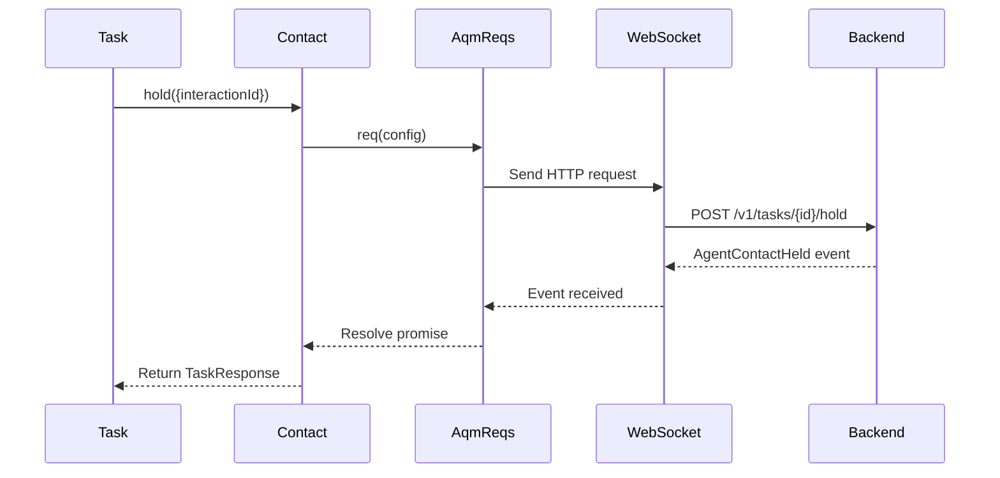

# Integration Specification

> **Purpose**: Define all integration points, event mappings, and data flows between system components.

---

## Integration Overview



---

## 1. Event Mapping Implementation

### TaskManager Event Mapper

```typescript
// TaskManager.ts
private static mapEventToTaskStateMachineEvent(
  ccEvent: CC_EVENTS,
  payload: WebSocketPayload,
  agentId?: string
): TaskEventPayload | null {
  const mediaResourceId =
    payload.mediaResourceId ||
    payload.interaction?.media?.[payload.interactionId]?.mediaResourceId;

  switch (ccEvent) {
    case CC_EVENTS.AGENT_CONTACT_RESERVED:
      return {type: TaskEvent.TASK_INCOMING, taskData: payload};

    case CC_EVENTS.AGENT_OFFER_CONTACT:
      return {type: TaskEvent.TASK_OFFERED, taskData: payload};

    case CC_EVENTS.AGENT_CONTACT:
      return {type: TaskEvent.HYDRATE, taskData: payload, agentId};

    case CC_EVENTS.AGENT_CONTACT_ASSIGNED:
      return {type: TaskEvent.ASSIGN, taskData: payload};

    case CC_EVENTS.AGENT_CONTACT_HELD:
      return {
        type: TaskEvent.HOLD_SUCCESS,
        mediaResourceId: mediaResourceId || '',
        taskData: payload
      };

    case CC_EVENTS.AGENT_CONTACT_UNHELD:
      return {
        type: TaskEvent.UNHOLD_SUCCESS,
        mediaResourceId: mediaResourceId || '',
        taskData: payload
      };

    case CC_EVENTS.AGENT_OFFER_CONSULT:
      return {
        type: TaskEvent.OFFER_CONSULT,
        taskData: {...payload, isConsulted: true}
      };

    case CC_EVENTS.AGENT_CONSULT_CREATED:
      return {
        type: TaskEvent.CONSULT_CREATED,
        taskData: {...payload, isConsulted: false}
      };

    case CC_EVENTS.AGENT_CONSULTING:
      return {
        type: TaskEvent.CONSULTING_ACTIVE,
        consultDestinationAgentJoined: true,
        taskData: payload
      };

    case CC_EVENTS.AGENT_CONSULT_ENDED:
      return {type: TaskEvent.CONSULT_END, taskData: payload};

    case CC_EVENTS.AGENT_CONSULT_FAILED:
    case CC_EVENTS.AGENT_CTQ_FAILED:
      return {type: TaskEvent.CONSULT_FAILED, reason: payload.reason, taskData: payload};

    case CC_EVENTS.AGENT_CTQ_CANCELLED:
      return {type: TaskEvent.CTQ_CANCEL, taskData: payload};

    case CC_EVENTS.AGENT_BLIND_TRANSFERRED:
    case CC_EVENTS.AGENT_CONSULT_TRANSFERRED:
    case CC_EVENTS.AGENT_VTEAM_TRANSFERRED:
      return {type: TaskEvent.TRANSFER_SUCCESS, taskData: payload};

    case CC_EVENTS.CONTACT_ENDED:
      return {
        type: TaskEvent.CONTACT_ENDED,
        taskData: {
          ...payload,
          wrapUpRequired: payload.interaction?.state !== 'new'
        }
      };

    case CC_EVENTS.AGENT_WRAPUP:
      return {type: TaskEvent.TASK_WRAPUP, taskData: {...payload, wrapUpRequired: true}};

    case CC_EVENTS.AGENT_WRAPPEDUP:
      return {type: TaskEvent.WRAPUP_COMPLETE, taskData: payload};

    case CC_EVENTS.AGENT_CONSULT_CONFERENCED:
    case CC_EVENTS.PARTICIPANT_JOINED_CONFERENCE:
      return {type: TaskEvent.CONFERENCE_START, taskData: payload};

    case CC_EVENTS.AGENT_CONSULT_CONFERENCE_ENDED:
      return {type: TaskEvent.CONFERENCE_END, taskData: payload};

    case CC_EVENTS.PARTICIPANT_LEFT_CONFERENCE:
      return {
        type: TaskEvent.PARTICIPANT_LEAVE,
        taskData: payload,
        participantId: payload?.participantId
      };

    case CC_EVENTS.CONTACT_RECORDING_STARTED:
      return {type: TaskEvent.RECORDING_STARTED, taskData: payload};

    case CC_EVENTS.CONTACT_RECORDING_PAUSED:
      return {type: TaskEvent.PAUSE_RECORDING, taskData: payload};

    case CC_EVENTS.CONTACT_RECORDING_RESUMED:
      return {type: TaskEvent.RESUME_RECORDING, taskData: payload};

    case CC_EVENTS.AGENT_CONTACT_OFFER_RONA:
      return {type: TaskEvent.RONA, taskData: payload, reason: payload.reason};

    case CC_EVENTS.AGENT_OUTBOUND_FAILED:
      return {type: TaskEvent.OUTBOUND_FAILED, reason: payload.reason};

    case CC_EVENTS.AGENT_INVITE_FAILED:
      return {type: TaskEvent.INVITE_FAILED, reason: payload.reason};

    case CC_EVENTS.AGENT_CONTACT_ASSIGN_FAILED:
      return {type: TaskEvent.ASSIGN_FAILED, reason: payload.reason};

    default:
      return null; // Not all events need state machine mapping
  }
}
```

---

## 2. WebSocket Message Processing Pipeline

```typescript
// TaskManager.ts
private registerTaskListeners() {
  this.webSocketManager.on('message', (event) => {
    // Step 1: Parse and validate message
    const message = TaskManager.parseWebSocketMessage(event);
    if (!message) return;

    // Step 2: Prepare event context
    const eventContext = this.prepareEventContext(message);
    if (!eventContext) return;

    // Step 3: Handle task lifecycle (create/update tasks)
    const actions = this.handleTaskLifecycleEvent(eventContext);
    const {task} = actions;
    if (!task) return;

    const {payload, stateMachineEvent} = eventContext;

    // Step 4: Update task data
    if (payload) {
      this.updateTaskData(task, payload);
    }

    // Step 5: Send event to state machine
    if (stateMachineEvent) {
      task.sendStateMachineEvent(stateMachineEvent);
    }
  });
}
```

### Message Parsing

```typescript
private static parseWebSocketMessage(event: string): WebSocketMessage | null {
  try {
    const payload = JSON.parse(event) as WebSocketMessage;

    // Filter out keepalive messages
    if (payload?.keepalive === 'true' || payload?.keepalive === true) {
      return null;
    }

    // Normalize task data if present
    if (payload?.data?.interaction) {
      payload.data = normalizeTaskData(payload.data);
    }

    return payload;
  } catch (error) {
    LoggerProxy.error('Failed to parse WebSocket message', {error});
    return null;
  }
}
```

---

## 3. AQM Request Integration

### Contact Service Request Builder

```typescript
// contact.ts
export default function routingContact(routing: AqmReqs) {
  return {
    accept: routing.req((params: {interactionId: string; data?: object}) => ({
      url: `/v1/tasks/${params.interactionId}/accept`,
      type: TASK_API.ACCEPT_TASK,
      method: 'POST',
      resource: WCC_API_GATEWAY,
      data: params.data,
      notifSuccess: {
        bind: {type: CC_EVENTS.AGENT_CONTACT_ASSIGNED},
        correlationId: params.interactionId
      },
      notifFail: {
        bind: {type: CC_EVENTS.AGENT_CONTACT_ASSIGN_FAILED},
        correlationId: params.interactionId
      }
    })),

    hold: routing.req((params) => ({
      url: `/v1/tasks/${params.interactionId}/hold`,
      type: TASK_API.HOLD_TASK,
      method: 'POST',
      resource: WCC_API_GATEWAY,
      data: params.data,
      notifSuccess: {
        bind: {type: CC_EVENTS.AGENT_CONTACT_HELD},
        correlationId: params.interactionId
      }
    })),

    consult: routing.req((params) => {
      const config = {
        url: `/v1/tasks/${params.interactionId}/consult`,
        type: TASK_API.CONSULT_TASK,
        method: 'POST',
        resource: WCC_API_GATEWAY,
        data: params.data,
        notifSuccess: [
          {bind: {type: CC_EVENTS.AGENT_CONSULT_CREATED}},
          {bind: {type: CC_EVENTS.AGENT_CONSULTING}}
        ],
        notifFail: [
          {bind: {type: CC_EVENTS.AGENT_CONSULT_FAILED}},
          {bind: {type: CC_EVENTS.AGENT_CTQ_FAILED}}
        ]
      };

      // Queue consults disable timeout
      if (params.data?.destinationType === DESTINATION_TYPE.QUEUE) {
        config[TIMEOUT_REQ] = 'disabled';
      }

      return config;
    }),

    // ... more request builders
  };
}
```

### Request Flow



---

## 4. WebRTC Integration

### Call Mapping

```typescript
// TaskManager.ts
private handleIncomingWebCall = (call: ICall) => {
  const currentTask = Object.values(this.taskCollection).find(
    (t) => t.data.interaction.mediaType === MEDIA_CHANNEL.TELEPHONY
  );

  if (currentTask) {
    // Map WebCalling call ID to task interaction ID
    this.webCallingService.mapCallToTask(
      call.getCallId(),
      currentTask.data.interactionId
    );

    // Send TASK_INCOMING to state machine
    const eventPayload = TaskManager.mapEventToTaskStateMachineEvent(
      CC_EVENTS.AGENT_CONTACT_RESERVED,
      currentTask.data
    );

    if (eventPayload) {
      currentTask.sendStateMachineEvent(eventPayload);
    }
  }

  this.call = call;
};

public registerIncomingCallEvent() {
  this.webCallingService.on(LINE_EVENTS.INCOMING_CALL, this.handleIncomingWebCall);
}
```

### WebRTC Task Operations

```typescript
// WebRTC.ts
export default class WebRTC extends Voice {
  public async accept(): Promise<TaskResponse> {
    // Step 1: Answer WebCalling call
    await this.webCallingService.answer();

    // Step 2: Get call ID
    const callId = this.webCallingService.getCallId();

    // Step 3: Call AQM accept
    const response = await this.contact.accept({
      interactionId: this.data.interactionId,
      data: {callId}
    });

    return response;
  }

  public async decline(): Promise<TaskResponse> {
    // Decline WebCalling call (no AQM call needed)
    await this.webCallingService.decline();
    return {success: true};
  }

  public async toggleMute(): Promise<void> {
    await this.webCallingService.toggleMute();
  }
}
```

---


## 8. Metrics Integration

### Metric Tracking Points

```typescript
// Task.ts - Example from transfer method
public async transfer(transferPayload: TransferPayLoad): Promise<TaskResponse> {
  try {
    // Start timer
    this.metricsManager.timeEvent([
      METRIC_EVENT_NAMES.TASK_TRANSFER_SUCCESS,
      METRIC_EVENT_NAMES.TASK_TRANSFER_FAILED
    ]);

    const result = await this.contact.blindTransfer({...});

    // Track success
    this.metricsManager.trackEvent(
      METRIC_EVENT_NAMES.TASK_TRANSFER_SUCCESS,
      {
        taskId: this.data.interactionId,
        destination: transferPayload.to,
        destinationType: transferPayload.destinationType,
        isConsultTransfer: false,
        ...MetricsManager.getCommonTrackingFieldForAQMResponse(result)
      },
      ['operational', 'behavioral', 'business']
    );

    return result;
  } catch (error) {
    // Track failure
    this.metricsManager.trackEvent(
      METRIC_EVENT_NAMES.TASK_TRANSFER_FAILED,
      {
        taskId: this.data.interactionId,
        destination: transferPayload.to,
        destinationType: transferPayload.destinationType,
        error: error.toString(),
        ...MetricsManager.getCommonTrackingFieldForAQMResponseFailed(error.details || {})
      },
      ['operational', 'behavioral', 'business']
    );
    throw error;
  }
}
```

---

## 5. Task Cleanup Integration

### Cleanup Decision Logic

```typescript
// TaskManager.ts
private handleTaskCleanup(task: ITask) {
  // WebRTC cleanup
  if (
    this.webCallingService.loginOption === LoginOption.BROWSER &&
    task.data.interaction.mediaType === MEDIA_CHANNEL.TELEPHONY &&
    task instanceof WebRTC
  ) {
    task.unregisterWebCallListeners();
    this.webCallingService.cleanUpCall();
  }

  const isOutdial = task.data.interaction.outboundType === 'OUTDIAL';
  const isNew = task.data.interaction.state === 'new';
  const needsWrapUp = task.data.agentsPendingWrapUp?.length > 0;

  // Decision: Remove from collection?
  if ((isNew && !(isOutdial && needsWrapUp)) || isSecondaryEpDnAgent(task.data.interaction)) {
    this.removeTaskFromCollection(task);
  }
}
```

---

## Related Files

- [TaskManager.ts](../TaskManager.ts) - Event processing pipeline
- [contact.ts](../contact.ts) - AQM request integration
- [state-machine/TaskStateMachine.ts](../state-machine/TaskStateMachine.ts) - State transitions
- [state-machine/uiControlsComputer.ts](../state-machine/uiControlsComputer.ts) - UI controls
- [TaskUtils.ts](../TaskUtils.ts) - Utility functions
- [taskDataNormalizer.ts](../taskDataNormalizer.ts) - Data normalization
