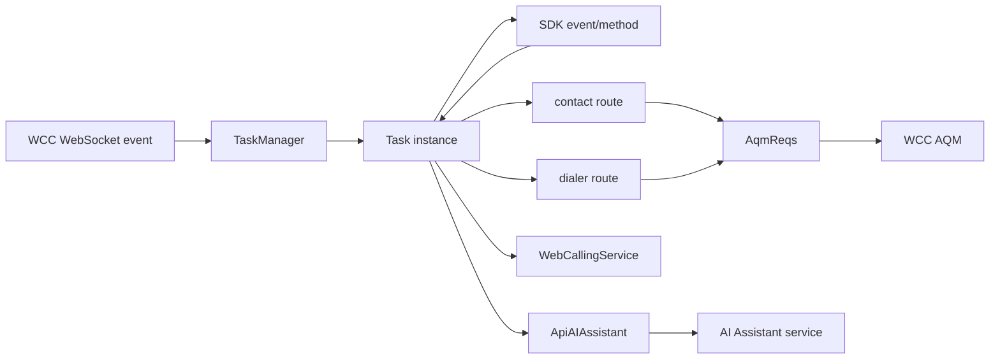
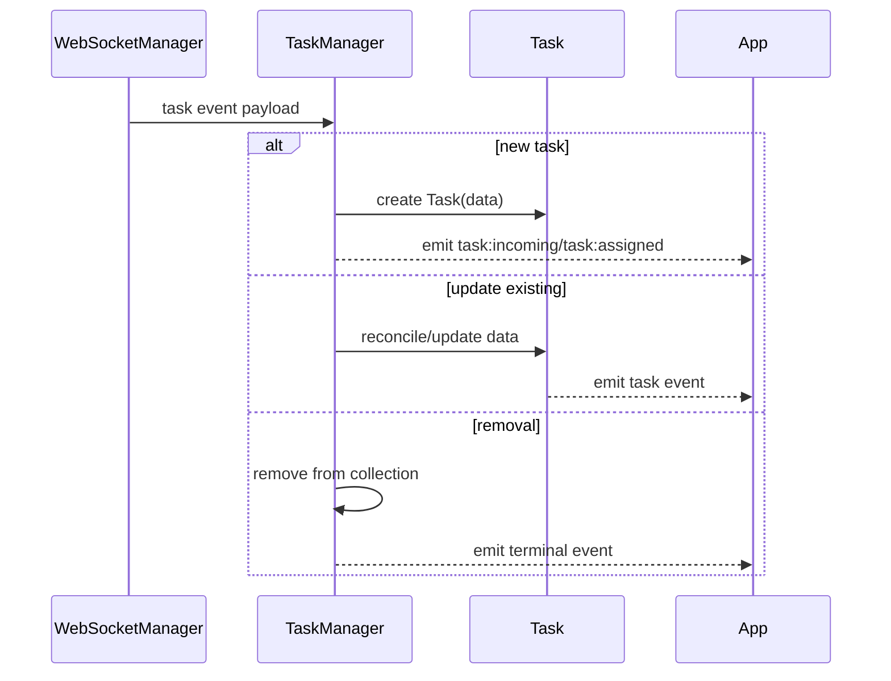
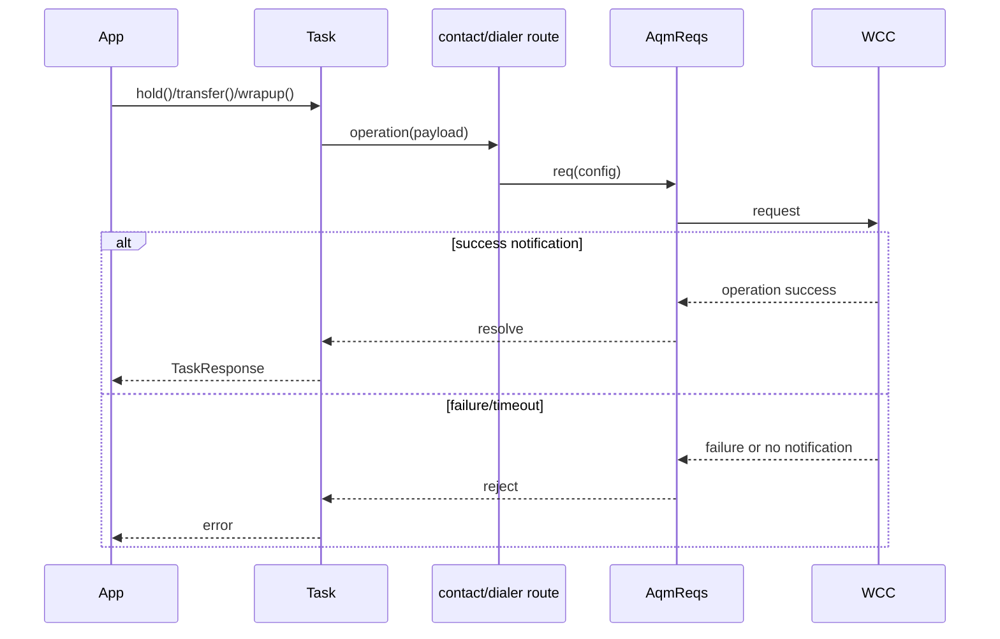
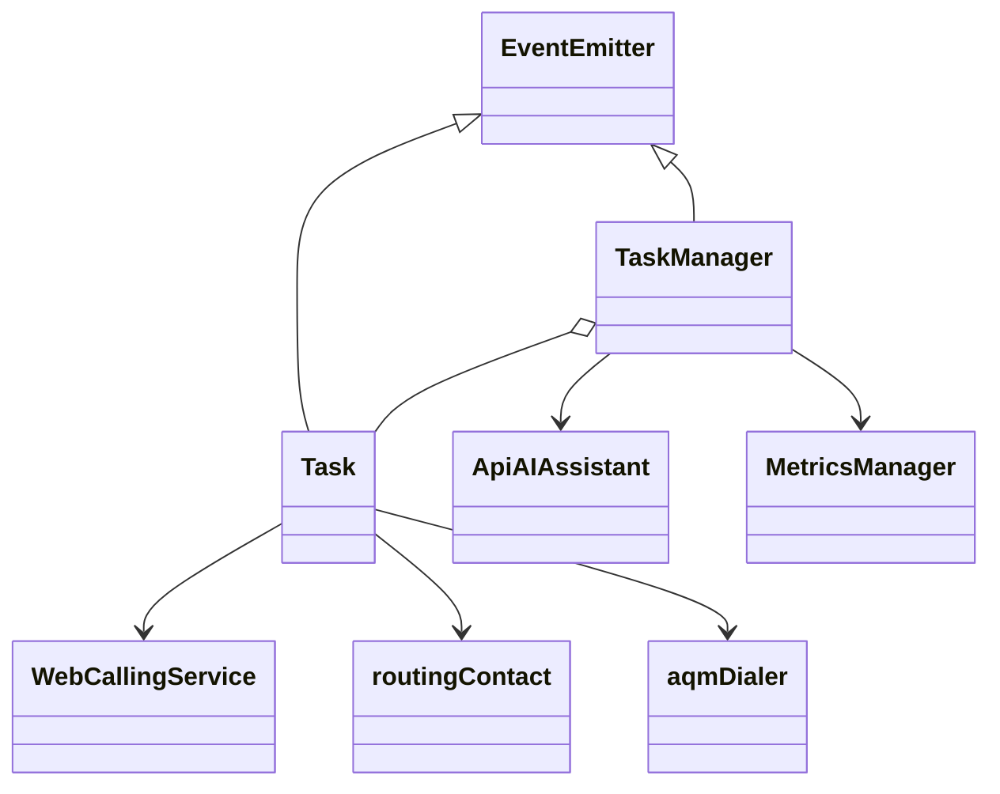
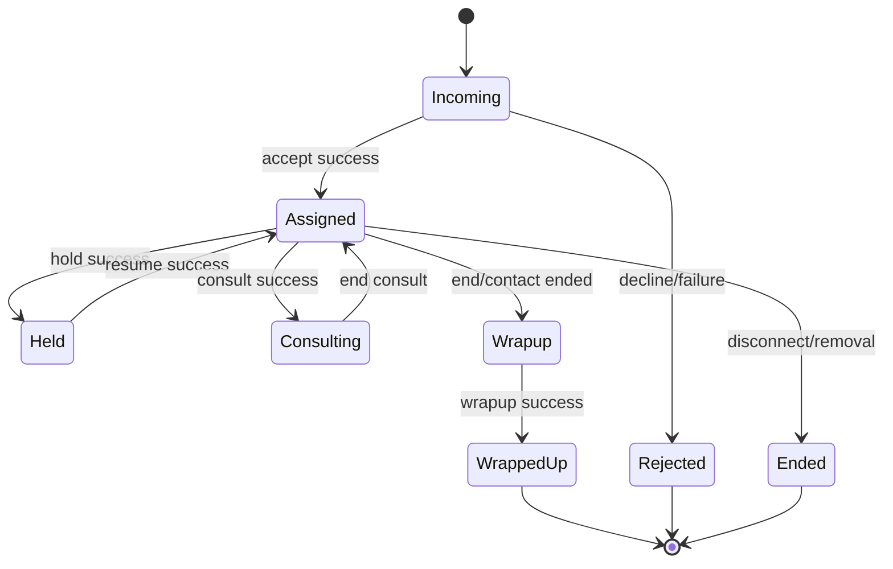

# Task Lifecycle - SPEC

> Canonical spec for `src/services/task/`. Router: [SPEC_INDEX.md](../../../../ai-docs/SPEC_INDEX.md).

## Metadata
| Field | Value |
|---|---|
| Module id | `task-lifecycle` |
| Source path(s) | `src/services/task/`; `src/cc.ts`; `src/services/WebCallingService.ts` |
| Doc kind | Module spec |
| Coverage score | 88%; bootstrap coverage review |
| Generated from | `module-spec` @ SDLC template library `0.2.0` |
| generated_by / approved_by / updated_at | Codex / user questionnaire / 2026-06-30 |
| Validation status | local conformance pass; independent validator not-run |

## Evidence Rules
Task requirements must cite source/test files because this is the highest-blast-radius module. Commit history can support WHY for recent bug fixes, but source/tests remain primary.

## Source Material Register
| Source doc | Scope | Decision | Detail location or disposition |
|---|---|---|---|
| `typedoc.md` | Task API examples | reference-only | public methods indexed here and in `CONTRACTS.md` |

## Overview
The task module owns client-side task objects, task collection management, contact control route builders, dialer/campaign routes, task event taxonomy, and task-data reconciliation. `TaskManager` consumes realtime WCC task notifications and creates/updates/removes `Task` instances. `Task` exposes consumer methods for accepting, declining, holding, resuming, ending, wrapping up, recording, consulting, transferring, conferencing, generated handoff summary request/response, and media mute/unmute behavior.

Task operations are asynchronous and usually combine an HTTP/AQM request with a later WebSocket notification. Voice tasks also integrate with `WebCallingService` for browser calling behavior.

## Purpose / Responsibility
Own Contact Center task lifecycle behavior in the SDK. It does not own backend interaction state or WebRTC internals.

## Stack
TypeScript EventEmitter classes and route factories; Jest tests under `test/unit/spec/services/task/`.

## Folder / Package Structure
```text
src/services/task/
|- index.ts        # Task class and public task methods
|- TaskManager.ts  # task collection and realtime event routing
|- TaskUtils.ts    # task helpers
|- AutoWrapup.ts   # auto-wrapup timer helper
|- contact.ts      # contact operation route factory
|- dialer.ts       # outdial and campaign preview route factory
|- constants.ts    # task constants and timeouts
`- types.ts        # task public types and TASK_EVENTS enum
```

## Key Files
| File | Holds |
|---|---|
| `src/services/task/index.ts` | `Task` class, task methods, data reconciliation, Web Calling listener hooks |
| `src/services/task/TaskManager.ts` | task collection, event hydration/update/removal, transcript event requests |
| `src/services/task/contact.ts` | contact control AQM routes |
| `src/services/task/dialer.ts` | outdial and campaign preview routes |
| `src/services/task/types.ts` | public task event enum and task types |
| `src/services/task/constants.ts` | timeouts and task constants |
| `test/unit/spec/services/task/` | task module tests |

## Public Surface
| Contract ID | Type | Surface | Purpose | Compatibility / deprecation | Schema / detail link | Root index |
|---|---|---|---|---|---|---|
| `task.class` | SDK class | `Task` | client-side task object | public export; method semantics are compatibility-sensitive | `src/services/task/index.ts` | `../../../../ai-docs/CONTRACTS.md` |
| `task.methods` | SDK methods | `accept`, `decline`, `hold`, `resume`, `end`, `wrapup`, `pauseRecording`, `resumeRecording`, `consult`, `endConsult`, `transfer`, `consultTransfer`, `consultConference`, `exitConference`, `transferConference`, `toggleMute` | task controls | breaking if renamed/removed or completion semantics change | `src/services/task/index.ts` | `../../../../ai-docs/CONTRACTS.md` |
| `task.events` | events | `TASK_EVENTS` enum | SDK task event names | enum renames/removals are breaking | `src/services/task/types.ts` | `../../../../ai-docs/CONTRACTS.md` |
| `task.handoffSummary` | SDK methods/events | `requestHandoffSummary`, `respondToHandoffSummary`, `TASK_HANDOFF_SUMMARY`, `TASK_HANDOFF_SUMMARY_RESPONSE`, `TASK_HANDOFF_SUMMARY_FEATURE_ENABLEMENT` | request, receive, and respond to generated consult/transfer handoff summaries | additive public surface; payload schema is backend-owned and passed through | `src/services/task/index.ts`; `src/services/task/types.ts`; `../../../../features/cai-7974-agent-handoff-summary/design/contracts/handoff-summary-task-api.md` | `../../../../ai-docs/CONTRACTS.md` |
| `task.manager` | internal surface | `TaskManager` | creates/updates/removes task instances | internal but behavior-visible through emitted events | `src/services/task/TaskManager.ts` | `../../../../ai-docs/CONTRACTS.md` |
| `cc.dialer` | facade methods | `startOutdial`, `acceptPreviewContact`, `skipPreviewContact`, `removePreviewContact` | dialer/campaign preview flows | public facade | `src/cc.ts`; `src/services/task/dialer.ts` | `../../../../ai-docs/CONTRACTS.md` |

## Requires
- `AqmReqs` and WebSocket notifications from `src/services/core/`.
- Web Calling behavior from `src/services/WebCallingService.ts`.
- Config profile/wrapup data from config types and `ContactCenter`.
- MetricsManager for task lifecycle metrics.
- WCC contact/dialer AQM backend.

## Requirements
| ID | WHAT | WHY | Source Evidence | Test / Example Evidence | Assumptions / Gaps | Confidence |
|---|---|---|---|---|---|---|
| TSK-R-001 | `TaskManager` must create, hydrate, update, emit, and remove task objects from WCC realtime events. | Consumer task state is driven by realtime notifications. | `src/services/task/TaskManager.ts`; `src/services/task/types.ts` | `test/unit/spec/services/task/TaskManager.ts` | exact WCC payload variants are service-owned | PRESENT |
| TSK-R-002 | `Task` public methods must delegate to contact/dialer/Web Calling services and return caller-visible success/failure. | Consumers rely on method promises for task controls. | `src/services/task/index.ts`; `src/services/task/contact.ts`; `src/services/task/dialer.ts` | `test/unit/spec/services/task/index.ts`; `test/unit/spec/services/task/contact.ts`; `test/unit/spec/services/task/dialer.ts` | none | PRESENT |
| TSK-R-003 | Task data reconciliation must preserve existing nested interaction/media fields when incoming updates omit them. | Partial WCC updates can otherwise erase data needed by later operations. | `src/services/task/index.ts`; `src/services/task/TaskManager.ts` | `test/unit/spec/services/task/index.ts`; `test/unit/spec/services/task/TaskManager.ts` | none | PRESENT |
| TSK-R-004 | Hold/resume and transfer logic must use the correct media resource and destination type helpers. | Recent fixes show mismatched media resource or destination type breaks task operations. | `src/services/task/index.ts`; `src/services/core/Utils.ts`; `src/services/task/TaskUtils.ts` | `test/unit/spec/services/task/index.ts`; `test/unit/spec/services/core/Utils.ts`; commit `741003b705` | none | PRESENT |
| TSK-R-005 | Campaign preview accept/skip/remove flows must have dedicated route handling and failure events, including the extended accept timeout. | Preview campaign actions are separate user-visible flows. | `src/cc.ts`; `src/services/task/dialer.ts`; `src/services/task/constants.ts`; `src/services/task/types.ts` | `test/unit/spec/services/task/dialer.ts`; commits `84e9dea766`, `46f03565d8` | none | PRESENT |
| TSK-R-006 | Task events must preserve `TASK_EVENTS` enum values and CC task event mapping. | Downstream consumers subscribe to event strings. | `src/services/task/types.ts`; `src/services/config/types.ts`; `src/services/task/TaskManager.ts` | `test/unit/spec/services/task/TaskManager.ts` | none | PRESENT |
| TSK-R-007 | Voice task media behavior must coordinate with WebCallingService call mapping and event listeners. | Browser calling tasks need call answer/decline/mute/media event behavior. | `src/services/task/index.ts`; `src/services/WebCallingService.ts` | `test/unit/spec/services/WebCallingService.ts`; `test/unit/spec/services/task/index.ts` | Calling SDK internals external | PRESENT |
| TSK-R-008 | Real-time transcript requests must be triggered only for mapped task events and valid interaction identifiers. | Avoids unnecessary or wrong transcript calls. | `src/services/task/TaskManager.ts`; `src/services/ApiAiAssistant.ts` | `test/unit/spec/services/task/TaskManager.ts`; `test/unit/spec/services/ApiAiAssistant.ts` | AI backend contract external | PRESENT |
| TSK-R-009 | Handoff summary helpers must use `ApiAIAssistant`, require `generatedSummaries.consultTransferSummariesEnabled === true` for requests, and route backend summary/response/enablement websocket events to the owning task. | SDK consumers need one supported task-level path for generated consult/transfer summaries without bypassing task event conventions. | `src/services/task/index.ts`; `src/services/task/TaskManager.ts`; `src/services/task/types.ts`; `src/services/config/types.ts` | `test/unit/spec/services/task/index.ts`; `test/unit/spec/services/task/TaskManager.ts`; `test/unit/spec/services/ApiAiAssistant.ts` | exact backend summary payload fields are external; SDK passes payload records through | PRESENT |

## Design Overview
`TaskManager` is the event and collection owner; `Task` is the consumer-facing per-interaction object. This split keeps collection-level routing and individual operation methods separate. Route factories in `contact.ts` and `dialer.ts` define AQM details so the Task class stays close to consumer operations.

The module favors preserving current observable behavior over normalizing every backend payload. That is why reconciliation and event mapping logic is explicit and test-backed.

## Data Flow


## Sequence Diagrams
| Operation group | Diagram | Failure / recovery coverage |
|---|---|---|
| incoming task hydration | event-to-task sequence | unknown event and removal cases |
| task method operation | method-to-AQM sequence | failure notification and timeout |





## Class / Component Relationships


## Use Cases
- UC-1 Accept incoming task: WCC event creates Task; consumer calls `accept()`; route waits for success/failure. Evidence: `src/services/task/TaskManager.ts`, `src/services/task/index.ts`, `src/services/task/contact.ts`.
- UC-2 Control voice contact: consumer holds/resumes/mutes/ends voice task; Task coordinates contact route and WebCallingService. Evidence: `src/services/task/index.ts`, `src/services/WebCallingService.ts`.
- UC-3 Transfer/consult/conference: consumer invokes consult/transfer/conference methods; helper logic derives destination details. Evidence: `src/services/task/index.ts`, `src/services/core/Utils.ts`.
- UC-4 Campaign preview: consumer accepts/skips/removes preview reservation through `ContactCenter` facade. Evidence: `src/cc.ts`, `src/services/task/dialer.ts`.
- UC-5 Handoff summary: consumer calls `requestHandoffSummary()` when generated consult-transfer summaries are enabled, listens for `TASK_HANDOFF_SUMMARY`/`TASK_HANDOFF_SUMMARY_RESPONSE`, and calls `respondToHandoffSummary()` with a typed action. Evidence: `src/services/task/index.ts`, `src/services/task/TaskManager.ts`, `src/services/task/types.ts`.

## State Model
- `TaskManager` holds active task collection and agent/webRTC context.
- `Task` holds task data snapshot and operation listeners/timers.
- `AutoWrapup` controls wrapup timer behavior.
- Web Calling call id to task id mapping is owned by WebCallingService but consumed by Task.

## Business Rules & Invariants
- Task event enum strings are public.
- A task update must not delete preserved task data solely because the backend omitted a nested field.
- Terminal/removal events must remove tasks from collection.
- Campaign preview failure events are separate for accept, skip, and remove.

## Concurrency & Reactive Flow
- WCC events and user task operations can interleave.
- Task handlers must tolerate duplicate or late notifications and cleanup idempotently.
- Timers and Web Calling listeners must be registered/unregistered to prevent leaks.

## State Machine


## Protocol / Wire Format
- The module consumes WCC routing messages through TaskManager and route builders.
- SDK-facing events are `TASK_EVENTS`.
- WCC bridge events are `CC_TASK_EVENTS`/`CC_EVENTS`.
- Handoff summary bridge events are `MID_CALL_SUMMARY`, `MID_CALL_SUMMARY_RESPONSE_SUBSEQUENT_AGENT`, and optional `FEATURE_ENABLEMENT`; SDK task events are `task:handoffSummary`, `task:handoffSummaryResponse`, and `task:handoffSummaryFeatureEnablement`.

## Data Model
- Task data includes interaction identifiers, media, participants, destination details, wrapup requirements, and campaign preview data.
- The package caches active tasks in memory only; WCC remains system-of-record.

## Error Handling & Failure Modes
| Condition | Signal | Caller recovery |
|---|---|---|
| contact operation failure | rejected promise and/or failure event | show failure and retry if operation is safe |
| missing media resource | operation-specific error | inspect task data and avoid destructive retry |
| Web Calling failure | call event/error or method failure | cleanup call mapping and surface media error |
| no AQM notification | timeout rejection | retry after connection health check |
| unknown task event | logged/ignored or generic handling | add mapping only with tests |
| handoff summary disabled | rejected helper promise and no AI Assistant send | hide or disable summary affordance until config/enablement changes |

## Pitfalls
- Do not replace task data wholesale on partial events.
- Do not add raw task event strings without updating `TASK_EVENTS`, tests, contracts, and this spec.
- Do not assume every task is voice; Web Calling behavior is conditional.
- Do not shorten campaign preview timeout without confirming UX/backend contract.

## Key Design Trade-off
- The module keeps rich client-side task state to provide ergonomic SDK events and methods, even though WCC owns authoritative task state. This reduces consumer complexity but makes reconciliation and cleanup correctness critical.

## Test-Case Strategy
Tests should cover event mapping, create/update/remove behavior, positive and failure route responses, task-data preservation, campaign preview failure events, and Web Calling integration boundaries.

| Behavior / Requirement | Existing test evidence | Gap |
|---|---|---|
| TSK-R-001 | `test/unit/spec/services/task/TaskManager.ts` | realtime backend variants need validator sampling |
| TSK-R-002 | `test/unit/spec/services/task/index.ts`; `test/unit/spec/services/task/contact.ts`; `test/unit/spec/services/task/dialer.ts` | none |
| TSK-R-003 | `test/unit/spec/services/task/index.ts`; `test/unit/spec/services/task/TaskManager.ts` | none |
| TSK-R-004 | `test/unit/spec/services/core/Utils.ts`; `test/unit/spec/services/task/index.ts` | none |
| TSK-R-005 | `test/unit/spec/services/task/dialer.ts` | none |
| TSK-R-009 | `test/unit/spec/services/task/index.ts`; `test/unit/spec/services/task/TaskManager.ts`; `test/unit/spec/services/ApiAiAssistant.ts` | backend payload schema remains external |

## Traceability
- Repo architecture: `../../../../ai-docs/ARCHITECTURE.md`
- Registry: `../../../../ai-docs/SPEC_INDEX.md`
- Coverage state and contracts baseline: package SDD baseline.
