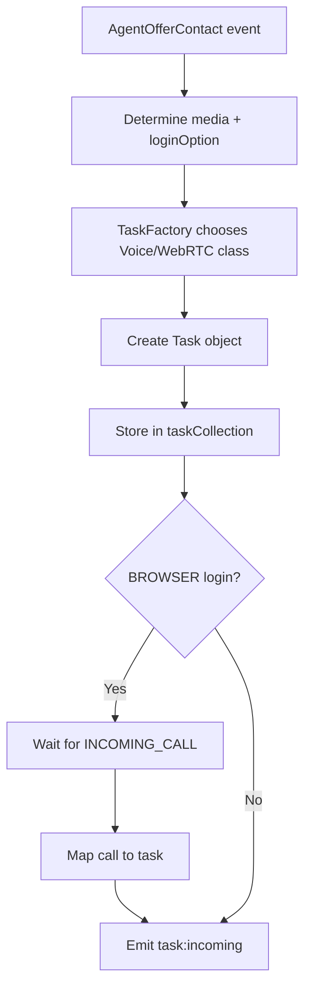
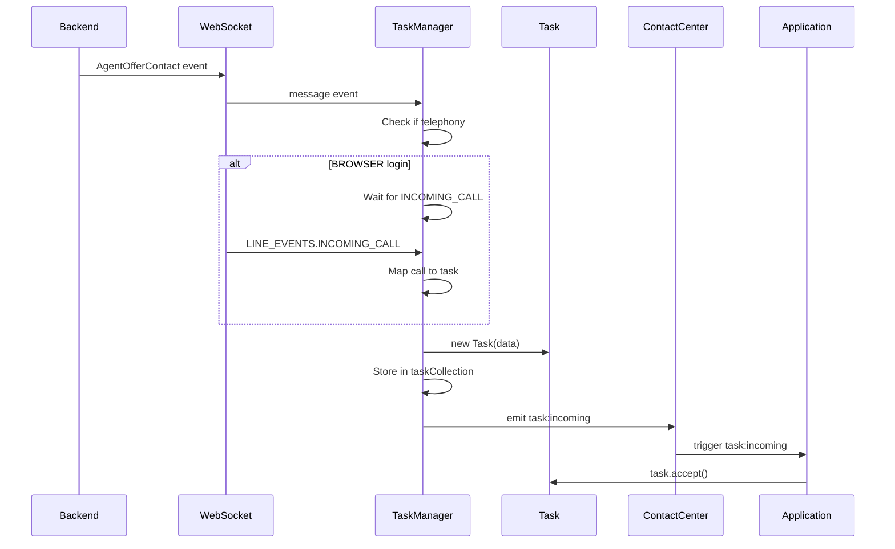
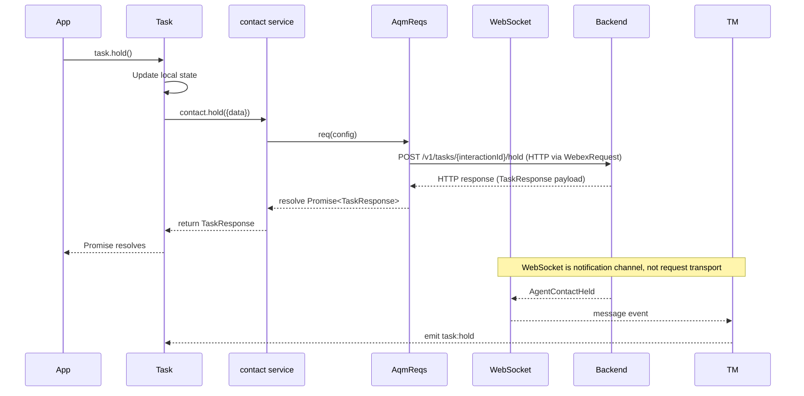
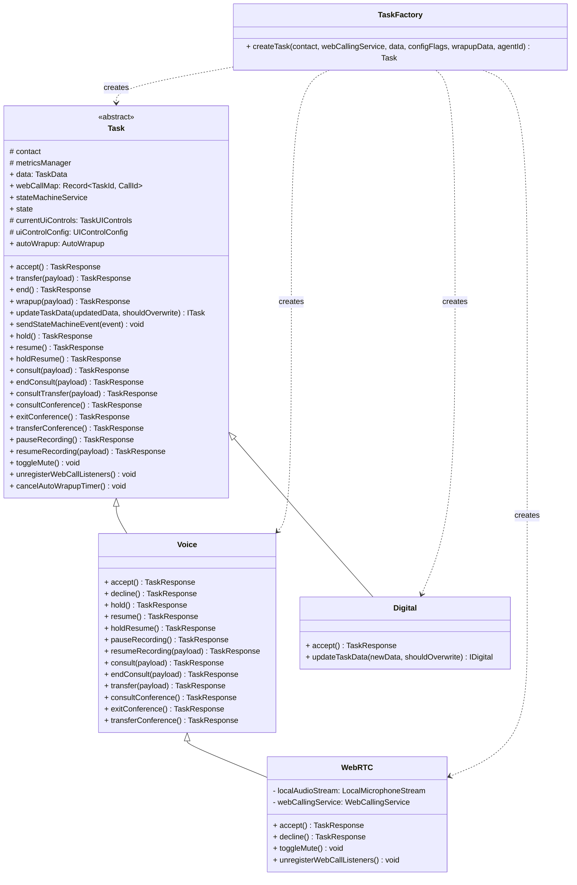
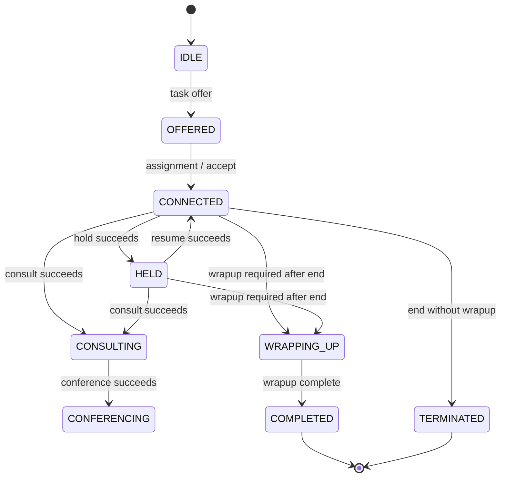

# Task — SPEC

> Start here → root [`AGENTS.md`](../../../../AGENTS.md) · router [`SPEC_INDEX.md`](../../../../ai-docs/SPEC_INDEX.md) · system [`ARCHITECTURE.md`](../../../../ai-docs/ARCHITECTURE.md). This is the module's canonical specification.

## Metadata

| Field | Value |
|---|---|
| Module id | `task` |
| Source path(s) | `src/services/task` |
| Doc kind | Module spec |
| Coverage score | 100% assessed 2026-07-07; 15/15 mandatory fields present; no applicability gaps |
| Generated from | `module-spec` @ SDLC template library `0.2.1` |
| generated_by / approved_by / updated_at | Codex generator / developer-approved residual warning and coverage completion / 2026-07-07 |
| Validation status | pass; validator claude-code; assessed 2026-07-07; 0 Blocking, 0 warnings; clean independent revalidation complete |

## Evidence Rules
Every requirement cites stable source and test file paths. Code/tests are the behavioral referee; routed source text supplies explicit intent and rationale. Missing or contradictory evidence blocks promotion.

## Source Material Register
| Source material | Scope | Decision | Detail location or disposition |
|---|---|---|---|
| Reviewed prior module guides and architecture material | overview / architecture / API / tests | used and code-checked | Content is placed by meaning throughout this specification; exact routing remains in the manifest. |

## Overview
Task is one of nine confirmed Contact Center SDK modules. Own task creation, media-specific behavior, call-control operations, lifecycle orchestration, task events, and integration with the task state machine. Existing reviewed documentation is migrated by meaning and code/tests remain the behavioral referee.

Manage task lifecycle including inbound/outbound calls, hold/resume, consult, transfer, conference, and wrapup.

- **Task Creation by Channel**: `TaskFactory.ts` chooses `WebRTC`, `Voice`, or `Digital` based on `MEDIA_CHANNEL` and `webCallingService.loginOption`, so each task class exposes the correct capabilities for the media type.

- **Task Orchestration**: `TaskManager.ts` owns task lifecycle wiring—initializes listeners, receives task events, creates/updates tasks, emits SDK events, and exposes task collections for consumers.

- **Event Emission and Public APIs**: Task objects register listeners, update context, emit SDK events (e.g., `task:*`), and expose public methods that delegate to `contact.ts` for call control and to the state machine for transition validation.

- **AQM Contact Operations**: `contact.ts` builds the AQM request surface for call control (accept, hold, consult, transfer, wrapup, end) and is the primary bridge from `Task`/`Voice`/`WebRTC`/`Digital` methods to WCC task APIs.

- **Outbound Dialing**: `dialer.ts` exposes the AQM dialer request (`startOutdial`) used by `cc.startOutdial()` to create outbound voice tasks with success/failure event mapping.

- **State Machine Driven UI Controls**: The `state-machine/` folder provides the XState engine (`TaskStateMachine.ts`) plus `actions.ts`, `guards.ts`, `uiControlsComputer.ts`, `constants.ts`, and `types.ts` to compute valid transitions and UI control state. Capability-level details live in `state-machine/ai-docs/task-state-machine-spec.md`.

This section describes how the task layer constructs tasks, initializes the state machine, and wires AQM calls to task methods. It provides context for how the state machine fits into the end-to-end flow.

- **Listener Setup**: Registers WebSocket listeners to receive CC events and map them to `TaskEvent` payloads.

- **Task Registry**: Creates tasks via `TaskFactory`, stores them in the task collection, and updates task data on incoming events.

- **Event Emission**: Re-emits `task:*` events on the task or `cc` object for SDK consumers.

- **Hydration/Recovery**: Handles state updates and transitions during reconnect/hydrate flows.

Example (backend event to state machine):

```typescript
const payload = TaskManager.mapEventToTaskStateMachineEvent(event, taskData);
if (payload) {
  task.sendStateMachineEvent(payload);
}
```

- **`contact.ts`**: Builds the AQM request surface for call control (hold, consult, transfer, wrapup, end). Task methods delegate to these calls, then drive state transitions based on success/failure events.

- **`dialer.ts`**: Exposes the `startOutdial` AQM request used by `cc.startOutdial()` to create outbound tasks.

Example (task method delegating to AQM):

```typescript
// task.hold() -> contact.hold(...) -> stateMachine events on response
await contact.hold({interactionId});
stateMachineService.send({type: TaskEvent.HOLD_INITIATED, mediaResourceId});
```

## Purpose / Responsibility
Own task creation, media-specific behavior, call-control operations, lifecycle orchestration, task events, and integration with the task state machine.

## Stack
TypeScript 5.4, EventEmitter, XState 5, @webex/calling, AQM/WebSocket integrations, Jest 27.

## Folder / Package Structure
```text
src/services/task/
├── AutoWrapup.ts
├── Task.ts
├── TaskFactory.ts
├── TaskManager.ts
├── TaskUtils.ts
├── constants.ts
├── contact.ts
├── dialer.ts
├── digital/
├── state-machine/
├── taskDataNormalizer.ts
├── types.ts
├── voice/
```

```text
services/task/
├── Task.ts                # Task class (ITask implementation)
├── TaskManager.ts         # Singleton task manager
├── contact.ts             # Contact operations (AQM)
├── dialer.ts              # Outbound dialing (AQM)
├── AutoWrapup.ts          # Auto wrapup handler
├── TaskUtils.ts           # Helper functions
├── types.ts               # Task types and events
├── constants.ts           # Task constants
├── TaskFactory.ts         # Task factory
├── taskDataNormalizer.ts  # Task data normalization helpers
├── digital/               # Digital task implementations
│   └── Digital.ts
├── voice/                 # Voice task implementations
│   ├── Voice.ts
│   └── WebRTC.ts
├── state-machine/         # XState task lifecycle engine
│   ├── TaskStateMachine.ts
│   ├── actions.ts
│   ├── guards.ts
│   ├── uiControlsComputer.ts
│   ├── constants.ts
│   ├── types.ts
│   └── ai-docs/
│       ├── AGENTS.md
│       └── ARCHITECTURE.md
└── ai-docs/
    ├── AGENTS.md          # Usage documentation
    └── ARCHITECTURE.md    # Task service architecture
```

## Key Files (source of truth)
| File | Holds |
|---|---|
| `src/services/task/Task.ts` | Authoritative Task implementation or contract source. |
| `src/services/task/TaskManager.ts` | Authoritative Task implementation or contract source. |
| `src/services/task/TaskFactory.ts` | Authoritative Task implementation or contract source. |
| `src/services/task/contact.ts` | Authoritative Task implementation or contract source. |
| `src/services/task/dialer.ts` | Authoritative Task implementation or contract source. |
| `src/services/task/types.ts` | Authoritative Task implementation or contract source. |

## Public Surface
| Contract ID | Type | Surface | Purpose | Compatibility / deprecation | Schema / detail link | Root index |
|---|---|---|---|---|---|---|
| `task.surface` | SDK / event / internal API | Exported Task/types/events plus application-facing task instances and call-control methods. | Stable module consumption boundary. | Additive changes by default; breaking package exports require a major-version transition. | `src/services/task/Task.ts` | `../../../../ai-docs/CONTRACTS.md` |

Compatibility notes:
- Do not remove or reinterpret exported symbols/events without a documented consumer migration.

- `TASK_EVENTS` enum (`types.ts`)

- `TaskData`, `TaskId`, `TaskResponse`, `TaskUIControls` (`types.ts`)

- `ITask`, `IVoice`, `IWebRTC`, `IDigital` (`types.ts`)

- `MEDIA_CHANNEL`, `TASK_CHANNEL_TYPE`, `VOICE_VARIANT` (`types.ts`)

- State machine: `TaskState`, `TaskEvent` (`state-machine/constants.ts`)

| Event           | When Emitted                 |
|---|---|
| `task:incoming` | New task offered to agent    |

| Event           | When Emitted                 |
|---|---|
| `task:hydrate`  | Task data updated            |

| Event           | When Emitted                 |
|---|---|
| `task:merged`   | Tasks merged (EPDN transfer) |

| Event                                                                       | When Emitted                                     |
|---|---|
| `task:assigned`                                                             | Task assigned to agent                           |

| Event                                                                       | When Emitted                                     |
|---|---|
| `task:media`                                                                | Media stream/track updates are available         |

| Event                                                                       | When Emitted                                     |
|---|---|
| `task:unassigned`                                                           | Task is unassigned from agent                    |

| Event                                                                       | When Emitted                                     |
|---|---|
| `task:offerContact`                                                         | Contact offer received/updated                   |

| Event                                                                       | When Emitted                                     |
|---|---|
| `task:offerConsult`                                                         | Consult offer received                           |

| Event                                                                       | When Emitted                                     |
|---|---|
| `task:hold`                                                                 | Task placed on hold                              |

| Event                                                                       | When Emitted                                     |
|---|---|
| `task:resume`                                                               | Task resumed from hold                           |

| Event                                                                       | When Emitted                                     |
|---|---|
| `task:end`                                                                  | Task ended                                       |

| Event                                                                       | When Emitted                                     |
|---|---|
| `task:rejected`                                                             | Task rejected / failure path emitted             |

| Event                                                                       | When Emitted                                     |
|---|---|
| `task:wrapup`                                                               | Task entering wrapup                             |

| Event                                                                       | When Emitted                                     |
|---|---|
| `task:wrappedup`                                                            | Wrapup completed                                 |

| Event                                                                       | When Emitted                                     |
|---|---|
| `task:consulting`                                                           | Consult is in progress                           |

| Event                                                                       | When Emitted                                     |
|---|---|
| `task:consultAccepted`                                                      | Consult accepted by destination party            |

| Event                                                                       | When Emitted                                     |
|---|---|
| `task:consultCreated`                                                       | Consultation started                             |

| Event                                                                       | When Emitted                                     |
|---|---|
| `task:consultEnd`                                                           | Consultation ended                               |

| Event                                                                       | When Emitted                                     |
|---|---|
| `task:autoAnswered`                                                         | Task was auto-answered                           |

| Event                                                                       | When Emitted                                     |
|---|---|
| `task:recordingStarted` / `task:recordingPaused` / `task:recordingResumed`  | Recording lifecycle updates                      |

| Event                                                                       | When Emitted                                     |
|---|---|
| `task:conferenceStarted` / `task:conferenceEnded` / `task:conferenceFailed` | Conference lifecycle updates                     |

| Event                                                                       | When Emitted                                     |
|---|---|
| `task:participantJoined` / `task:participantLeft`                           | Conference participant updates                   |

| Event                                                                       | When Emitted                                     |
|---|---|
| `task:switchCall`                                                           | Switched between consult and main call           |

| Event                                                                       | When Emitted                                     |
|---|---|
| `task:outdialFailed`                                                        | Outdial operation failed                         |

| Event                                                                       | When Emitted                                     |
|---|---|
| `task:ui-controls-updated`                                                  | UI controls changed due to state transition      |

| Event                                                                       | When Emitted                                     |
|---|---|
| `task:cleanup`                                                              | Internal cleanup signal emitted by state machine |

> Full list is defined in `TASK_EVENTS` (`types.ts`).

| Event | When Emitted |
|---|---|
| `REAL_TIME_TRANSCRIPTION` | A realtime transcript payload is received for the task interaction |

| Event | When Emitted |
|---|---|
| `SUGGESTED_RESPONSE` | A final AI Assistant suggestion payload is received for the task interaction |

Initiate outbound call.

**Parameters**:

- `destination` (string): Phone number to call

- `origin` (string): Outbound ANI/caller ID

**Returns**: `Promise<TaskResponse>` (AQM response, not a Task instance)

**Example**:

```typescript
const response = await cc.startOutdial('+14155551234', '+18005551000');

// Outdial task object is created asynchronously via TaskManager.
// Listen on cc/task events instead of treating startOutdial response as an ITask.
cc.on('task:incoming', (task) => {
  task.on('task:assigned', () => {
    console.log('Call connected');
  });

  task.on('task:end', () => {
    console.log('Call ended');
  });
});
```

Accept an incoming task.

**Returns**: `Promise<TaskResponse>`

**Example**:

```typescript
cc.on('task:incoming', async (task) => {
  await task.accept();
});
```

Put task on hold or resume.

**Parameters**:

- Concrete `Task.hold()` / `Voice.hold()` and `Task.resume()` / `Voice.resume()` accept no parameters. The optional `mediaResourceId` exists only on the broader `ITask` compatibility declaration; the implementations derive the active media resource from task state.

**Returns**: `Promise<TaskResponse>`

**Example**:

```typescript
// Put on hold
await task.hold();

// Resume
await task.resume();
```

End the current task.

**Returns**: `Promise<TaskResponse>`

**Example**:

```typescript
await task.end();
```

Complete task with wrapup code.

**Parameters**:

- `wrapUpReason` (string, required): Wrapup reason text

- `auxCodeId` (string, required): Wrapup code ID

**Returns**: `Promise<TaskResponse>`

**Example**:

```typescript
await task.wrapup({
  wrapUpReason: 'Customer issue resolved',
  auxCodeId: 'resolved-code',
});
```

Transfer task to another destination.

**Parameters**:

- `to` (string): Agent ID, queue ID, or phone number

- `destinationType` ('queue' | 'agent' | 'dialNumber'): Destination type

**Returns**: `Promise<TaskResponse>`

**Example**:

```typescript
// Transfer to queue
await task.transfer({
  to: 'queue-123',
  destinationType: 'queue',
});

// Transfer to agent
await task.transfer({
  to: 'agent-456',
  destinationType: 'agent',
});
```

Start consultation.

**Parameters**:

- `to` (string): Agent/queue/phone to consult

- `destinationType` ('queue' | 'agent' | 'dialNumber' | 'entryPoint'): Type

**Returns**: `Promise<TaskResponse>`

**Example**:

```typescript
await task.consult({
  to: 'agent-456',
  destinationType: 'agent',
});

// Later: complete transfer (consulting voice flow uses transfer())
await task.transfer({
  to: 'queue-123',
  destinationType: 'queue',
});
// Or end consult
await task.endConsult();
```

End consultation without transfer.

**Parameters**:

- `consultEndPayload` (optional `ConsultEndPayload`)

**Returns**: `Promise<TaskResponse>`

### Complete TASK_EVENTS inventory

The public `TASK_EVENTS` enum contains 49 members; every member is listed below from `src/services/task/types.ts`.

| Constant | Event string |
|---|---|
| `TASK_INCOMING` | `task:incoming` |
| `TASK_ASSIGNED` | `task:assigned` |
| `TASK_MEDIA` | `task:media` |
| `TASK_UNASSIGNED` | `task:unassigned` |
| `TASK_HOLD` | `task:hold` |
| `TASK_RESUME` | `task:resume` |
| `TASK_CONSULT_END` | `task:consultEnd` |
| `TASK_CONSULT_QUEUE_CANCELLED` | `task:consultQueueCancelled` |
| `TASK_CONSULT_QUEUE_FAILED` | `task:consultQueueFailed` |
| `TASK_UI_CONTROLS_UPDATED` | `task:ui-controls-updated` |
| `TASK_CONSULT_ACCEPTED` | `task:consultAccepted` |
| `TASK_CONSULTING` | `task:consulting` |
| `TASK_CONSULT_CREATED` | `task:consultCreated` |
| `TASK_OFFER_CONSULT` | `task:offerConsult` |
| `TASK_END` | `task:end` |
| `TASK_WRAPUP` | `task:wrapup` |
| `TASK_WRAPPEDUP` | `task:wrappedup` |
| `TASK_CLEANUP` | `task:cleanup` |
| `TASK_RECORDING_STARTED` | `task:recordingStarted` |
| `TASK_RECORDING_PAUSED` | `task:recordingPaused` |
| `TASK_RECORDING_PAUSE_FAILED` | `task:recordingPauseFailed` |
| `TASK_RECORDING_RESUMED` | `task:recordingResumed` |
| `TASK_RECORDING_RESUME_FAILED` | `task:recordingResumeFailed` |
| `TASK_REJECT` | `task:rejected` |
| `TASK_OUTDIAL_FAILED` | `task:outdialFailed` |
| `TASK_HYDRATE` | `task:hydrate` |
| `TASK_OFFER_CONTACT` | `task:offerContact` |
| `TASK_AUTO_ANSWERED` | `task:autoAnswered` |
| `TASK_CONFERENCE_ESTABLISHING` | `task:conferenceEstablishing` |
| `TASK_CONFERENCE_STARTED` | `task:conferenceStarted` |
| `TASK_CONFERENCE_FAILED` | `task:conferenceFailed` |
| `TASK_CONFERENCE_ENDED` | `task:conferenceEnded` |
| `TASK_PARTICIPANT_JOINED` | `task:participantJoined` |
| `TASK_PARTICIPANT_LEFT` | `task:participantLeft` |
| `TASK_CONFERENCE_TRANSFERRED` | `task:conferenceTransferred` |
| `TASK_CONFERENCE_TRANSFER_FAILED` | `task:conferenceTransferFailed` |
| `TASK_CONFERENCE_END_FAILED` | `task:conferenceEndFailed` |
| `TASK_PARTICIPANT_LEFT_FAILED` | `task:participantLeftFailed` |
| `TASK_EXIT_CONFERENCE` | `task:exitConference` |
| `TASK_TRANSFER_CONFERENCE` | `task:transferConference` |
| `TASK_SWITCH_CALL` | `task:switchCall` |
| `TASK_MERGED` | `task:merged` |
| `TASK_POST_CALL_ACTIVITY` | `task:postCallActivity` |
| `TASK_MULTI_LOGIN_HYDRATE` | `task:multiLoginHydrate` |
| `TASK_CAMPAIGN_PREVIEW_RESERVATION` | `task:campaignPreviewReservation` |
| `TASK_CAMPAIGN_PREVIEW_ACCEPT_FAILED` | `task:campaignPreviewAcceptFailed` |
| `TASK_CAMPAIGN_PREVIEW_SKIP_FAILED` | `task:campaignPreviewSkipFailed` |
| `TASK_CAMPAIGN_PREVIEW_REMOVE_FAILED` | `task:campaignPreviewRemoveFailed` |
| `TASK_CAMPAIGN_CONTACT_UPDATED` | `task:campaignContactUpdated` |

## Requires (dependencies)
- Services contact/dialer AQM factories
- WebSocket and RTD WebSocket managers
- WebCallingService, MetricsManager, and task state machine

## Requirements
| ID | WHAT | WHY | Source Evidence | Test / Example Evidence | Assumptions / Gaps | Confidence |
|---|---|---|---|---|---|---|
| TASK-R-001 | Create only supported Voice/Digital Task implementations and throw `Unknown media type` for unsupported media. | Returning a generic task for unsupported channels would advertise controls the implementation cannot perform. | `src/services/task/TaskFactory.ts` | `test/unit/spec/services/task/TaskFactory.ts` | Independent clean revalidation pending after residual cleanup. | PRESENT |
| TASK-R-002 | Concrete Task/Voice `hold()` and `resume()` implementations remain parameterless while `ITask` retains its optional compatibility parameter. | Documentation must distinguish the broad public interface from concrete runtime signatures. | `src/services/task/Task.ts` | `test/unit/spec/services/task/Task.ts` | Independent clean revalidation pending after residual cleanup. | PRESENT |
| TASK-R-003 | Task and media subclasses must route contact/calling operations into typed state-machine events and emit the complete TASK_EVENTS contract. | Consumers coordinate UI and interaction lifecycle from those events. | `src/services/task/Task.ts` | `test/unit/spec/services/task/Task.ts` | Independent clean revalidation pending after residual cleanup. | PRESENT |
| TASK-R-004 | TaskManager must consume primary/RTD streams and manage task creation, hydration, cleanup, campaign, and AI-assistant flows. | A single task owner prevents duplicate instances and inconsistent state across realtime sources. | `src/services/task/TaskManager.ts` | `test/unit/spec/services/task/TaskManager.ts` | Independent clean revalidation pending after residual cleanup. | PRESENT |
| TASK-R-005 | The contact dependency belongs to Task/TaskFactory-created tasks; dialer is an AqmReqs request factory without that constructor. | Misattributing constructor dependencies causes invalid instantiation examples. | `src/services/task/TaskFactory.ts` | `test/unit/spec/services/task/dialer.ts` | Independent clean revalidation pending after residual cleanup. | PRESENT |
| TASK-R-006 | Keep credentials and authentication outside Task; remote operations delegate through contact/dialer routing, AqmReqs, and Core/WebexRequest. | Task lifecycle objects should never duplicate host token handling or leak authentication state into interaction data. | `src/services/task/Task.ts`, `src/services/task/contact.ts`, `src/services/core/WebexRequest.ts` | `test/unit/spec/services/task/Task.ts`, `test/unit/spec/services/task/contact.ts` | None; authentication ownership is explicit. | PRESENT |

## Design Overview
Task separates its stable consumption boundary from collaborators so ownership and failure behavior stay explicit. A shared Task base preserves a stable API while media-specific subclasses and a separate state engine enforce capability differences.

| Channel     | Description        |
|---|---|
| `telephony` | Voice calls        |

| Channel     | Description        |
|---|---|
| `chat`      | Web chat           |

| Channel     | Description        |
|---|---|
| `email`     | Email interactions |

| Channel     | Description        |
|---|---|
| `social`    | Social media       |

| Channel     | Description        |
|---|---|
| `sms` | Unsupported by TaskFactory; throws `Unknown media type` |

| Channel     | Description        |
|---|---|
| `facebook` | Unsupported by TaskFactory; throws `Unknown media type` |

| Channel     | Description        |
|---|---|
| `whatsapp` | Unsupported by TaskFactory; throws `Unknown media type` |

If enabled in agent profile, wrapup completes automatically after timeout:

```typescript
task.on('task:wrappedup', () => {
  console.log('Task wrapup completed');
});
```

> **Purpose**: Technical documentation for task lifecycle management.

TaskManager is a singleton that:

1. Listens for WebSocket task events

2. Creates/manages Task objects

3. Routes events to appropriate tasks

4. Handles WebRTC call mapping

```typescript
// Singleton access
const taskManager = TaskManager.getTaskManager(contact, webCallingService, webSocketManager);
```

Returns an object of AQM request methods wired to `TASK_API` and `TASK_MESSAGE_TYPE`.

**Methods**

- `accept`

- `hold`

- `unHold`

- `pauseRecording`

- `resumeRecording`

- `consult`

- `consultEnd`

- `consultAccept`

- `blindTransfer`

- `vteamTransfer`

- `consultTransfer`

- `end`

- `wrapup`

- `cancelTask`

- `cancelCtq`

- `consultConference`

- `exitConference`

- `conferenceTransfer`

**Notes**

- Uses `WCC_API_GATEWAY`.

- Consult with `DESTINATION_TYPE.QUEUE` uses `TIMEOUT_REQ` = `'disabled'` for the request timeout.

Returns an object of AQM request methods for outbound dialing.

**Methods**

- `startOutdial` (success: `CC_EVENTS.AGENT_OFFER_CONTACT`, failure: `CC_EVENTS.AGENT_OUTBOUND_FAILED`)

- Task/TaskFactory-created task instances receive `contact: ReturnType<typeof routingContact>`; `dialer.ts` has no such constructor and is an AqmReqs factory.

- Uses:

- `contact.vteamTransfer` / `contact.blindTransfer` in `transfer(...)`.

- While in consulting state, `transfer(...)` internally routes through consult-transfer behavior.

- `contact.end` in `end()`.

- `contact.wrapup` in `wrapup(...)`.

Uses `contact` for:

- `hold`, `unHold`

- `pauseRecording`, `resumeRecording`

- `consult`, `consultEnd`, `consultTransfer`

- `consultConference`, `exitConference`, `conferenceTransfer`

Uses `contact.accept` in `accept()`.

TaskManager maintains a map of active tasks:

```typescript
private taskCollection: Record<TaskId, ITask> = {};

// Tasks indexed by interactionId
this.taskCollection[interactionId] = task;

// Retrieve task
const task = this.taskCollection[interactionId];
```

TaskManager uses a staged pipeline in `registerTaskListeners()`:

```typescript
this.webSocketManager.on('message', (event) => {
  // 1) Parse and validate message
  const message = TaskManager.parseWebSocketMessage(event);
  if (!message) return;

  // 2) Build event context (task, payload, mapped state-machine event)
  const eventContext = this.prepareEventContext(message);
  if (!eventContext) return;

  // 3) Handle lifecycle changes (create/update/remove task)
  const actions = this.handleTaskLifecycleEvent(eventContext);
  const {task} = actions;
  if (!task) return;

  // 4) Keep task.data synchronized
  const {payload, stateMachineEvent} = eventContext;
  if (payload) this.updateTaskData(task, payload);

  // 5) Drive state machine (which emits TASK_EVENTS)
  if (stateMachineEvent) {
    task.sendStateMachineEvent(stateMachineEvent);
  }
});
```

`TaskManager.handleRealtimeWebsocketEvent()` handles payloads arriving on the realtime subscription socket used for AI features. It:

1. Normalizes the websocket envelope (`payload.data` vs direct payload form)

2. Resolves the owning task via `conversationId`

3. Emits `REAL_TIME_TRANSCRIPTION` on the task for transcript payloads

4. Emits `SUGGESTED_RESPONSE` on the task only when the backend payload is a final suggestion (`data.type === 'SUGGESTION'`)

5. Ignores `SUGGESTED_RESPONSE_ACKNOWLEDGE` for public SDK emission

This keeps transcript and suggestion delivery aligned on the same per-task event surface.

For BROWSER login, TaskManager integrates with WebCalling:



```typescript
// WebCallingService maps call IDs to interaction IDs
this.webCallingService.mapCallToTask(callId, interactionId);

// Task uses call for media operations
this.webCallingService.answerCall(localAudioStream: LocalMicrophoneStream, taskId: string);
```

AutoWrapup handles automatic task completion:

```typescript
// AutoWrapup.ts
export default class AutoWrapup {
  private timer: ReturnType<typeof setTimeout> | null = null;
  private readonly interval: number;

  start(onComplete: () => void) {
    this.timer = setTimeout(onComplete, this.interval);
  }

  clear() {
    if (this.timer) {
      clearTimeout(this.timer);
      this.timer = null;
    }
  }

  getTimeLeft() {}
  isRunning() {}
  getTimeLeftSeconds() {}
}
```

Each task operation maps to an AQM request:

```typescript
// contact.ts
export default function routingContact(routing: AqmReqs) {
  return {
    accept: routing.req((p) => ({
      url: '/v1/tasks/.../accept',
      notifSuccess: { bind: { type: CC_EVENTS.AGENT_CONTACT_ASSIGNED }},
      notifFail: { bind: { type: CC_EVENTS.AGENT_CONTACT_ASSIGN_FAILED }},
    })),

    hold: routing.req((p) => ({...})),
    unHold: routing.req((p) => ({...})),
    consultAccept: routing.req((p) => ({...})),
    cancelTask: routing.req((p) => ({...})),
    cancelCtq: routing.req((p) => ({...})),
    end: routing.req((p) => ({...})),
    wrapup: routing.req((p) => ({...})),
    blindTransfer: routing.req((p) => ({...})),
    consult: routing.req((p) => ({...})),
    consultTransfer: routing.req((p) => ({...})),
    // ... more operations
  };
}
```

Helper functions for task state analysis:

```typescript
// TaskUtils.ts

// Check if participant is in main interaction
isParticipantInMainInteraction(task, agentId);

// Check if conference is in progress
getIsConferenceInProgress(taskData);

// Check if agent is primary
isPrimary(task, agentId);

// Check if secondary EPDN agent
isSecondaryEpDnAgent(interaction);
```

| Metric                  | Type                 | When Tracked       |
|---|---|---|
| `TASK_ACCEPT_SUCCESS`   | behavioral, business | Task accepted      |

| Metric                  | Type                 | When Tracked       |
|---|---|---|
| `TASK_HOLD_SUCCESS`     | operational          | Hold succeeded     |

| Metric                  | Type                 | When Tracked       |
|---|---|---|
| `TASK_END_SUCCESS`      | behavioral, business | Task ended         |

| Metric                  | Type                 | When Tracked       |
|---|---|---|
| `TASK_WRAPUP_SUCCESS`   | operational          | Wrapup completed   |

| Metric                  | Type                 | When Tracked       |
|---|---|---|
| `TASK_TRANSFER_SUCCESS` | behavioral, business | Transfer completed |

| Metric                  | Type                 | When Tracked       |
|---|---|---|
| `TASK_OUTDIAL_SUCCESS`  | behavioral, business | Outdial completed  |

## Data Flow
1. **WebSocket event arrives** → `TaskManager` maps CC event to `TaskEvent`.

2. **Task creation** (if new) → `TaskFactory` builds `Voice`/`WebRTC`/`Digital`.

3. **State machine actor starts** → `Task` wires emitters + UI control updates.

4. **Task method called** (e.g., hold/transfer) → delegates to `contact.ts` or `dialer.ts`.

5. **State transitions** → guards/actions update context and emit `task:*` events.

6. **SDK consumers update UI** → `TaskUIControls` reflect the latest state.

```mermaid
flowchart TD
  A[WebSocket event arrives] --> B[TaskManager maps CC event to TaskEvent]
  B --> C{Task exists?}
  C -- No --> D[TaskFactory creates Voice/WebRTC/Digital]
  C -- Yes --> E[Use existing task]
  D --> F[Task initializes state machine actor]
  E --> F
  F --> G[Task method called (hold/transfer/etc)]
  G --> H[contact.ts or dialer.ts API call]
  H --> I[State machine transition]
  I --> J[Actions + guards update context]
  J --> K[Emit task:* events]
  K --> L[TaskUIControls updated for SDK UI]
```





## Sequence Diagram(s)
Sequence coverage:

| Operation group | Diagram | Failure / recovery coverage |
|---|---|---|
| Incoming task creation | TaskManager maps the backend event, TaskFactory creates the supported media class, and ContactCenter emits `TASK_INCOMING`. | Construction/mapping failure prevents publication of a partial task. |
| Accept/hold/resume | Task method sends the corresponding state-machine event and delegates the AQM request to contact routing. | Failure events return the actor to the documented stable state and emit the matching `TASK_EVENTS` failure. |
| Consult/transfer/conference | Voice coordinates contact routing and the task actor through initiating and stable states. | Backend failure notifications drive explicit failure actions/events. |
| Wrapup/end | Task maps wrapup/end notifications into actor transitions and public events. | `WRAPPING_UP`, `COMPLETED`, and `TERMINATED` remain distinct terminal paths. |
| WebRTC and digital behavior | TaskFactory selects `WebRTC` or `Digital`; subclasses own channel-specific accept/media work. | Unsupported media values throw `Unknown media type`. |

```mermaid
sequenceDiagram
  participant Backend
  participant TM as TaskManager
  participant TF as TaskFactory
  participant Task
  participant Actor as Task state-machine actor
  participant CC as ContactCenter
  Backend-->>TM: mapped Contact Center event
  alt task is new and media is supported
    TM->>TF: createTask(data, dependencies)
    TF-->>TM: Voice / WebRTC / Digital
    TM->>Task: initialize and store
    Task->>Actor: start / send mapped TaskEvent
    TM-->>CC: emit typed TASK_EVENTS notification
  else unsupported media
    TF-->>TM: throw Unknown media type
  end
```

## Class / Component Relationships
- **Hierarchy**: `Task` (base) → `Voice` → `WebRTC`; `Digital` extends `Task`.

- **`Task` (base)**: Holds task data, emits SDK events, and provides default (unsupported) implementations for call control APIs.

- **`Voice`**: Adds hold/resume and consult-related capabilities for telephony tasks.

- **`WebRTC`**: Overrides `accept/decline` for WebRTC calls and hooks media events.

- **`Digital`**: Implements `accept` and refreshes digital task data/UI controls.

| Component            | File                         | Responsibility                                             |
|---|---|---|
| `TaskManager`        | `task/TaskManager.ts`        | Task lifecycle coordination                                |

| Component            | File                         | Responsibility                                             |
|---|---|---|
| `Task`               | `task/Task.ts`               | Individual task operations                                 |

| Component            | File                         | Responsibility                                             |
|---|---|---|
| `contact`            | `task/contact.ts`            | AQM request definitions                                    |

| Component            | File                         | Responsibility                                             |
|---|---|---|
| `dialer`             | `task/dialer.ts`             | Outbound call initiation                                   |

| Component            | File                         | Responsibility                                             |
|---|---|---|
| `AutoWrapup`         | `task/AutoWrapup.ts`         | Auto wrapup timer                                          |

| Component            | File                         | Responsibility                                             |
|---|---|---|
| `taskDataNormalizer` | `task/taskDataNormalizer.ts` | Normalizes backend task payloads                           |

| Component            | File                         | Responsibility                                             |
|---|---|---|
| `TaskUtils`          | `task/TaskUtils.ts`          | Utility functions                                          |

| Component            | File                         | Responsibility                                             |
|---|---|---|
| `state-machine`      | `task/state-machine/*`       | Task state transitions, guards, and UI control computation |

**File:** `Task.ts`

**Properties**

- `data: TaskData`

- `webCallMap: Record<TaskId, CallId>`

- `stateMachineService?: ActorRefFrom<TaskStateMachine>`

- `state?: SnapshotFrom<TaskStateMachine>`

- `autoWrapup?: AutoWrapup`

- `uiControls: TaskUIControls` (getter)

**Methods**

- `accept(): Promise<TaskResponse>` (abstract)

- `decline(): Promise<TaskResponse>` (default: unsupportedMethodError)

- `pauseRecording(): Promise<TaskResponse>` (default: unsupportedMethodError)

- `resumeRecording(resumeRecordingPayload: ResumeRecordingPayload): Promise<TaskResponse>` (default: unsupportedMethodError)

- `consult(consultPayload: ConsultPayload): Promise<TaskResponse>` (default: unsupportedMethodError)

- `endConsult(consultEndPayload?: ConsultEndPayload): Promise<TaskResponse>` (default: unsupportedMethodError)

- `consultTransfer(consultTransferPayload?: ConsultTransferPayLoad): Promise<TaskResponse>` (default: unsupportedMethodError)

- `consultConference(): Promise<TaskResponse>` (default: unsupportedMethodError)

- `exitConference(): Promise<TaskResponse>` (default: unsupportedMethodError)

- `transferConference(): Promise<TaskResponse>` (default: unsupportedMethodError)

- `switchCall(): Promise<TaskResponse>` (default: unsupportedMethodError)

- `toggleMute(): Promise<void>` (default: unsupportedMethodError)

- `unregisterWebCallListeners(): void` (default: no-op + log)

- `cancelAutoWrapupTimer(): void`

- Concrete `Task.hold()` / `Voice.hold()` are parameterless; the `ITask` compatibility interface permits `hold(mediaResourceId?: string)`.

- Concrete `Task.resume()` / `Voice.resume()` are parameterless; the `ITask` compatibility interface permits `resume(mediaResourceId?: string)`.

- `holdResume(): Promise<TaskResponse>` (default: unsupportedMethodError)

- `sendStateMachineEvent(event: TaskEventPayload): void`

- `updateTaskData(updatedData: TaskData, shouldOverwrite = false): ITask`

- `transfer(transferPayload: TransferPayLoad): Promise<TaskResponse>`

- `end(): Promise<TaskResponse>`

- `wrapup(wrapupPayload: WrapupPayLoad): Promise<TaskResponse>`

**File:** `voice/Voice.ts`

**Notes**

- Extends `Task`.

- Provides `hold()` and `resume()` that delegate to `holdResume()`.

- Explicitly overrides `accept()` and `decline()` to throw `unsupportedMethodError`.

- `WebRTC` then overrides these methods with concrete implementations.

**File:** `voice/WebRTC.ts`

**Notes**

- Extends `Voice`.

- Overrides `accept()` and `decline()` for WebRTC calls.

- Emits `TASK_EVENTS.TASK_MEDIA` on remote media (`CALL_EVENT_KEYS.REMOTE_MEDIA`).

- Overrides `unregisterWebCallListeners()`.

**File:** `digital/Digital.ts`

**Notes**

- Extends `Task`.

- Implements `accept()`.

- Overrides `updateTaskData()` to refresh digital task data and UI controls.

**File:** `TaskFactory.ts`

**API**

- `createTask(contact, webCallingService, data, configFlags, wrapupData?, agentId?): Task`

**Behavior**

- Chooses `WebRTC` vs `Voice` for `MEDIA_CHANNEL.TELEPHONY` based on `webCallingService.loginOption`.

- Chooses `Digital` for `MEDIA_CHANNEL.CHAT`, `MEDIA_CHANNEL.EMAIL`, `MEDIA_CHANNEL.SOCIAL`.

- Throws `Error` for unknown media types.



## Use Cases
- **UC-1 Incoming task creation:** TaskManager maps a backend offer/reservation, TaskFactory creates a supported Voice/WebRTC/Digital task, and ContactCenter emits the typed incoming event. Evidence: `src/services/task/TaskManager.ts`, `src/services/task/TaskFactory.ts`, `test/unit/spec/services/task`.
- **UC-2 Accept/hold/resume:** the Task or Voice method delegates the remote operation and sends the matching typed event to its actor; concrete hold/resume implementations are parameterless. Evidence: `src/services/task/Task.ts`, `src/services/task/voice/Voice.ts`, `test/unit/spec/services/task`.
- **UC-3 Consult/transfer/conference:** Voice coordinates contact routing with initiating/stable actor states and emits the corresponding complete `TASK_EVENTS` contract. Evidence: `src/services/task/voice/Voice.ts`, `src/services/task/types.ts`, `test/unit/spec/services/task`.
- **UC-4 Wrapup/end:** backend end/wrapup notifications drive WRAPPING_UP and final COMPLETED/TERMINATED outcomes without collapsing them into one result. Evidence: `src/services/task/Task.ts`, `src/services/task/state-machine/TaskStateMachine.ts`, `test/unit/spec/services/task`.
- **UC-5 WebRTC and digital behavior:** TaskFactory selects channel-specific subclasses; unsupported SMS/Facebook/WhatsApp values throw `Unknown media type`. Evidence: `src/services/task/TaskFactory.ts`, `test/unit/spec/services/task/TaskFactory.ts`.

```typescript
// Listen for incoming tasks
cc.on('task:incoming', async (task) => {
  console.log('Incoming task:', task.data.interactionId);

  // Accept the task
  await task.accept();

  // Task operations
  await task.hold();
  await task.resume();
  await task.end();
  await task.wrapup({
    wrapUpReason: 'Resolved',
    auxCodeId: 'wrapup-code',
  });
});
```

## State Model
Each Task owns an XState actor and current task data. TaskManager maps backend notifications into actor events; backend task data remains authoritative for hydration. Stable interaction states and initiating/terminal states are defined by the nested task-state-machine module.

## Business Rules & Invariants
- TaskFactory creates only implemented media subclasses and throws for unsupported media values.
- Concrete Task/Voice `hold()` and `resume()` methods are parameterless even though the broader `ITask` declaration retains an optional media-resource parameter.
- Task event names come from `TASK_EVENTS`; actor transition names come from `TaskEvent`, and callers must not substitute raw strings.
- Task owns no credentials or authentication policy; contact/dialer factories delegate authenticated requests through AqmReqs and Core/WebexRequest.

## Concurrency & Reactive Flow
- Remote contact/dialer operations complete asynchronously through AQM correlation. Backend WebSocket notifications are separately mapped by TaskManager and delivered to the owning actor in arrival order.

## State Machine


- **Factory**: `TaskFactory.ts` selects `WebRTC`, `Voice`, or `Digital` based on `MEDIA_CHANNEL` and `webCallingService.loginOption`.

- **Initialization**: `Task.ts` creates a state machine actor using `createTaskStateMachine(...)`, wires action overrides (emitters), and starts the actor.

- **Task State**: The task holds `stateMachineService` and uses it to send `TaskEvent` payloads.

Example (state machine init inside a task object):

```typescript
const machine = createTaskStateMachine(uiControlConfig, {
  actions: {
    emitTaskIncoming: ({event}) => task.emit('task:incoming', task),
  },
});
const actor = createActor(machine);
actor.start();
```

`Task` delegates lifecycle transitions and control-state derivation to the state machine:

- Transition graph: `state-machine/TaskStateMachine.ts`

- Transition conditions: `state-machine/guards.ts`

- Context mutation and integration hooks: `state-machine/actions.ts`

- UI control derivation: `state-machine/uiControlsComputer.ts`

For state-machine-specific implementation guidance, use:

- `../state-machine/ai-docs/task-state-machine-spec.md`

- `../state-machine/ai-docs/task-state-machine-spec.md`

- **Active lifecycle + intermediate states**:

- `IDLE`, `OFFERED`, `CONNECTED`

- `HOLD_INITIATING`, `HELD`, `RESUME_INITIATING`

- `CONSULT_INITIATING`, `CONSULTING`, `CONF_INITIATING`

- `CONFERENCING`, `WRAPPING_UP`, `COMPLETED`, `TERMINATED`

- **Future placeholders (defined, not currently implemented in transitions)**:

- `CONSULT_INITIATED`, `CONSULT_COMPLETED`, `POST_CALL`, `PARKED`, `MONITORING`

### Signature and ownership clarifications

- `Task.endConsult(consultEndPayload)` requires a payload at the base class; `Voice.endConsult(consultEndPayload?)` accepts it optionally.
- `ITask.hold(mediaResourceId?)` and `ITask.resume(mediaResourceId?)` are compatibility-interface shapes; current concrete Task/Voice methods accept no argument.
- TaskFactory supports the media implementations present in its switch and throws for unsupported media values rather than silently constructing a generic task.

## Protocol / Wire Format
- Request, response, and event payload ownership is anchored in `src/services/task/Task.ts`. HTTP initiates backend work where applicable; WebSocket messages provide realtime events and, for AQM flows, correlated completion.

## Error Handling & Failure Modes
| Condition | Signal (error/code/result) | Caller recovery |
|---|---|---|
| Dependency rejection | Typed/rethrown error or failure event | Inspect structured details, preserve tracking id, and retry only when the operation is safe. |
| Timeout or missing async completion | Timeout/recovery state | Follow the module-specific recovery path; never synthesize success. |

```typescript
try {
  await task.transfer({
    to: 'queue-123',
    destinationType: 'queue',
  });
} catch (error) {
  console.error('Transfer failed:', error.message);
  // error.data contains structured error info
}
```

**Cause**: Agent not available or TaskManager not initialized

**Solution**:

1. Ensure `cc.register()` completed

2. Ensure `cc.stationLogin()` completed

3. Ensure agent state is Available

**Cause**: Task state doesn't allow operation

**Solution**: Check task state before operation:

```typescript
if (task.uiControls.hold.isEnabled) {
  await task.hold();
}
```

**Cause**: Call not mapped to task

**Solution**: Ensure BROWSER login and mercury connected:

```typescript
await webex.internal.mercury.connect();
await cc.stationLogin({ loginOption: 'BROWSER', ... });
```

## Pitfalls
- Do not bypass the Task ownership boundary or duplicate its constants/events; doing so breaks correlation, compatibility, or state invariants.

## Module Do's / Don'ts
- DO use the authoritative files and typed constants listed above.
- DON'T use raw event strings, swallow errors, or infer backend behavior.

## Key Design Trade-off
- A shared Task base preserves a stable API while media-specific subclasses and a separate state engine enforce capability differences.

## Test-Case Strategy (module)
Use `test/unit/spec/services/task/Task.ts`, `TaskFactory.ts`, `TaskManager.ts`, media-specific suites, contact/dialer suites, and state-machine suites. Cover concrete-versus-interface method signatures, every TASK_EVENTS group, unsupported media rejection, primary/RTD event ownership, injected state actions, and success/failure/timeout paths.

## Traceability
- Repo architecture: `../../../../ai-docs/ARCHITECTURE.md` · Registry: `../../../../ai-docs/SPEC_INDEX.md`
- Coverage state and contracts baseline: `../../../../.sdd/manifest.json`

- Task creation: `TaskFactory.ts`

- Task APIs and behavior: `Task.ts`, `voice/Voice.ts`, `voice/WebRTC.ts`, `digital/Digital.ts`

- Task management: `TaskManager.ts`

- Shared task types: `types.ts`, `constants.ts`

- Task lifecycle state machine: `state-machine/TaskStateMachine.ts`

- State machine types/events: `state-machine/constants.ts`, `state-machine/types.ts`

- [ARCHITECTURE.md](ARCHITECTURE.md) - Technical deep-dive

- [TaskManager.ts](../TaskManager.ts) - Manager implementation

- [types.ts](../types.ts) - Type definitions

- [../state-machine/ai-docs/task-state-machine-spec.md](../state-machine/ai-docs/task-state-machine-spec.md) - State machine implementation guide

- [../state-machine/ai-docs/task-state-machine-spec.md](../state-machine/ai-docs/task-state-machine-spec.md) - State machine internals

- [cc.ts](../../../cc.ts) - Main plugin

- [TaskManager.ts](../TaskManager.ts) - Manager

- [contact.ts](../contact.ts) - Contact operations

- [types.ts](../types.ts) - Type definitions

- [../state-machine/ai-docs/task-state-machine-spec.md](../state-machine/ai-docs/task-state-machine-spec.md) - State machine guide

- [../state-machine/ai-docs/task-state-machine-spec.md](../state-machine/ai-docs/task-state-machine-spec.md) - State machine architecture
