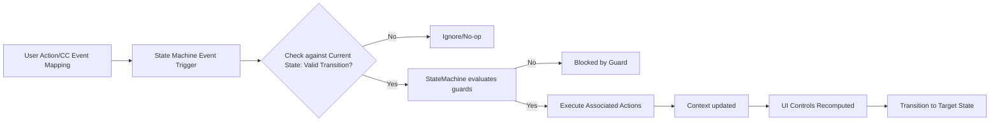
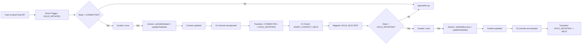
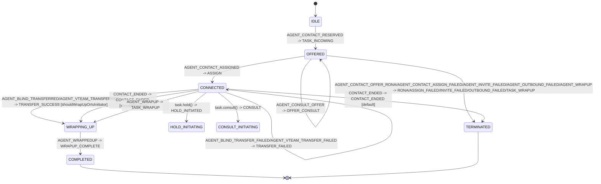
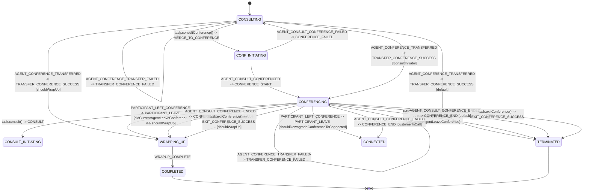

# Task State Machine - Architecture

## Purpose
Technical reference for the complete state machine using XState to drive state transitions and UI control behavior. It orchestrates state transitions, guards, and actions for task lifecycle management.

---

## Architecture Overview

The task state machine is built with `xstate` and organized into:
- **State graph** (`TaskStateMachine.ts`)
- **Context mutators** (`actions.ts`)
- **Guard predicates** (`guards.ts`)
- **UI control derivation** (`uiControlsComputer.ts`)
- **Event/context contracts** (`types.ts`)

It is instantiated by `Task` and receives mapped backend/user events through `sendStateMachineEvent(...)`.

---

## Runtime Integration

`Task` bootstraps and owns the actor lifecycle:

1. `createTaskStateMachine(uiControlConfig, {actions: overrides})`
2. `createActor(machine).start()`
3. `TaskManager` and task APIs map external signals to `TaskEvent`
4. Actor transitions update context and execute action overrides
5. `Task` recomputes UI controls and emits task-level events

---

## States

### IDLE
**Description**: Initial state before any interaction.

**Entry Actions**: None

**Valid Transitions**:
- `TASK_INCOMING` → OFFERED
- `CONSULTING_ACTIVE` → CONSULTING (early consult case)
- `HYDRATE` → Various (state restoration on reconnect)

**Context**: Empty

---

### OFFERED
**Description**: Task offered to agent, awaiting acceptance.

**Entry Actions**:
- `initializeTask`
- `emitTaskIncoming`

**Valid Transitions**:
- `TASK_OFFERED` → Stay in OFFERED (updates data)
- `ASSIGN` → CONNECTED or CONSULTING (based on guard)
- `RONA` → TERMINATED
- `INVITE_FAILED` → TERMINATED
- `ASSIGN_FAILED` → TERMINATED
- `OUTBOUND_FAILED` → WRAPPING_UP or TERMINATED (based on shouldWrapUp guard)
- `CONSULTING_ACTIVE` → CONSULTING

**Guards**:
- `isConsultingAssignment`: Check if this is a consult acceptance

**Context Updates**:
- Task data initialization
- Auto-answer flag

---

### CONNECTED
**Description**: Active interaction with customer.

**Entry Actions**:
- `updateTaskData`
- `emitTaskAssigned`

**Valid Transitions**:
- `HOLD_INITIATED` → HELD
- `CONSULT_INITIATED` → CONSULTING
- `CONFERENCE_START` → CONFERENCING
- `CONTACT_ENDED` → WRAPPING_UP or TERMINATED (based on wrapUpRequired)
- `TRANSFER_SUCCESS` → WRAPPING_UP or TERMINATED

**Guards**:
- `shouldWrapUp`: Check if wrapup is required
- `canHold`: Check if hold is allowed
- `canConsult`: Check if consult is allowed

**Context Updates**:
- Hold state
- Media resource tracking

---

### HELD
**Description**: Task on hold.

**Entry Actions**:
- `markHeld`
- `emitTaskHold`

**Valid Transitions**:
- `UNHOLD_INITIATED` → CONNECTED
- `CONSULT_INITIATED` → CONSULTING
- `CONTACT_ENDED` → WRAPPING_UP or TERMINATED

**Guards**:
- `canUnhold`: Check if resume is allowed

**Context Updates**:
- Hold timestamp
- Media resource state

---

### CONSULTING
**Description**: In consultation with another agent/queue.

**Entry Actions**:
- `setConsultInitiator`
- `setConsultFromConference`
- `emitTaskConsulting`

**Valid Transitions**:
- `CONSULT_END` → CONNECTED or HELD (return to previous state)
- `CONFERENCE_START` → CONFERENCING
- `TRANSFER_SUCCESS` → WRAPPING_UP or TERMINATED (based on isConsulted flag)
- `CONSULTING_ACTIVE` → Stay (update agent joined state)
- `CONSULT_FAILED` → CONNECTED
- `CTQ_CANCEL` → CONNECTED

**Guards**:
- `isConsultInitiator`: Check if current agent started consult
- `isConsultedAgent`: Check if current agent received consult
- `canEndConsult`: Check if consult can be ended
- `canTransferConsult`: Check if consult transfer is allowed

**Context Updates**:
- `consultInitiator`: Agent who initiated
- `consultDestinationAgentJoined`: Whether destination agent joined
- `consultFromConference`: If consult came from conference

---

### CONFERENCING
**Description**: Multi-party conference call.

**Entry Actions**:
- `markConferenceStarted`
- `emitTaskConferenceStart`

**Valid Transitions**:
- `CONFERENCE_END` → CONNECTED
- `PARTICIPANT_LEAVE` → Stay (track participants) or CONNECTED (if last participant)
- `CONTACT_ENDED` → WRAPPING_UP
- `TRANSFER_CONFERENCE_SUCCESS` → TERMINATED

**Guards**:
- `isLastParticipant`: Check if only one participant remains
- `canExitConference`: Check if agent can exit
- `canTransferConference`: Check if conference can be transferred

**Context Updates**:
- `activeParticipants`: List of participant IDs
- `conferenceStartTime`: Timestamp

---

### WRAPPING_UP
**Description**: Post-interaction work (After Call Work / ACW).

**Entry Actions**:
- `markEnded`
- `emitTaskWrapup`

**Valid Transitions**:
- `WRAPUP_COMPLETE` → WRAPPED_UP

**Guards**: None

**Context Updates**:
- End timestamp
- Wrapup start time

---

### WRAPPED_UP
**Description**: Wrapup completed, ready for cleanup.

**Entry Actions**:
- `emitTaskWrappedup`
- `cleanupResources`

**Valid Transitions**:
- Auto-transition → TERMINATED

**Guards**: None

**Context**: Cleanup flags

---

### TERMINATED
**Description**: Final state, task ended.

**Entry Actions**:
- `requestCleanup`

**Valid Transitions**: None (terminal state)

**Guards**: None

**Context**: Preserved for historical reference

---

## Events

### Task Lifecycle Events

| Event | Payload | Description |
|-------|---------|-------------|
| `TASK_INCOMING` | `{taskData}` | New task offered to agent |
| `TASK_OFFERED` | `{taskData}` | Backend confirmed offer |
| `ASSIGN` | `{taskData}` | Task assigned to agent |
| `CONTACT_ENDED` | `{taskData}` | Interaction terminated |
| `HYDRATE` | `{taskData, agentId}` | State restoration from backend |

### Hold/Resume Events

| Event | Payload | Description |
|-------|---------|-------------|
| `HOLD_INITIATED` | `{mediaResourceId}` | User initiated hold |
| `HOLD_SUCCESS` | `{mediaResourceId, taskData}` | Hold confirmed |
| `UNHOLD_INITIATED` | `{mediaResourceId}` | User initiated resume |
| `UNHOLD_SUCCESS` | `{mediaResourceId, taskData}` | Resume confirmed |

### Consult Events

| Event | Payload | Description |
|-------|---------|-------------|
| `OFFER_CONSULT` | `{taskData}` | Consult offered to agent |
| `CONSULT_INITIATED` | `{destination, destinationType}` | User started consult |
| `CONSULT_CREATED` | `{taskData}` | Consult created on backend |
| `CONSULTING_ACTIVE` | `{consultDestinationAgentJoined, taskData}` | Consult agent joined |
| `CONSULT_END` | `{taskData}` | Consult ended |
| `CONSULT_FAILED` | `{reason, taskData}` | Consult failed |
| `CTQ_CANCEL` | `{taskData}` | Consult to queue cancelled |

### Conference Events

| Event | Payload | Description |
|-------|---------|-------------|
| `CONFERENCE_START` | `{taskData}` | Conference began |
| `CONFERENCE_END` | `{taskData}` | Conference ended |
| `PARTICIPANT_LEAVE` | `{participantId, taskData}` | Participant left |
| `CONFERENCE_FAILED` | `{reason, taskData}` | Conference failed |

### Transfer Events

| Event | Payload | Description |
|-------|---------|-------------|
| `TRANSFER_INITIATED` | `{destination, destinationType}` | User initiated transfer |
| `TRANSFER_SUCCESS` | `{taskData}` | Transfer completed |
| `TRANSFER_FAILED` | `{taskData}` | Transfer failed |
| `TRANSFER_CONFERENCE_SUCCESS` | `{taskData}` | Conference transfer completed |

### Recording Events

| Event | Payload | Description |
|-------|---------|-------------|
| `RECORDING_STARTED` | `{taskData}` | Recording began |
| `PAUSE_RECORDING` | `{taskData}` | Recording paused |
| `RESUME_RECORDING` | `{taskData}` | Recording resumed |

### Wrapup Events

| Event | Payload | Description |
|-------|---------|-------------|
| `TASK_WRAPUP` | `{taskData}` | Entering wrapup state |
| `WRAPUP_COMPLETE` | `{taskData}` | Wrapup finished |

### Error Events

| Event | Payload | Description |
|-------|---------|-------------|
| `RONA` | `{reason, taskData}` | Redirection on no answer |
| `INVITE_FAILED` | `{reason}` | Invite failed |
| `ASSIGN_FAILED` | `{reason}` | Assignment failed |
| `OUTBOUND_FAILED` | `{reason}` | Outbound call failed |

---


## Single Transition Flow
The flow below shows a single transition in the requested form:



### Example: Hold Flow (Concrete)


---

## State Pattern (via XState)

### Purpose
Manage complex task lifecycle with clear states, transitions, guards, and actions.

### Implementation

```typescript
// Task.ts
export default abstract class Task extends EventEmitter {
  public stateMachineService?: ActorRefFrom<TaskStateMachine>;

  private initializeStateMachine(): void {
    const machine: TaskStateMachine = createTaskStateMachine(
      this.uiControlConfig,
      {
        actions: this.getStateMachineActionOverrides()
      }
    );

    this.stateMachineService = createActor(machine);

    // Subscribe to state changes
    this.stateMachineService.subscribe((snapshot) => {
      const currentState = snapshot.value as TaskState;
      this.state = snapshot;
      this.updateUiControls(previousState !== currentState);
    });

    this.stateMachineService.start();
  }

  public sendStateMachineEvent(event: TaskEventPayload): void {
    this.stateMachineService?.send(event);
  }
}
```

### State Machine Architecture

```typescript
// state-machine/TaskStateMachine.ts
export function getTaskStateMachineConfig(uiControlConfig: UIControlConfig) {
  return {
    id: 'taskStateMachine',
    initial: TaskState.IDLE,
    context: createInitialContext(uiControlConfig, TaskState.IDLE),
    states: {
      [TaskState.IDLE]: {
        on: {
          [TaskEvent.TASK_INCOMING]: {
            target: TaskState.OFFERED,
            actions: ['initializeTask', 'emitTaskIncoming']
          }
        }
      },
      [TaskState.OFFERED]: {
        on: {
          [TaskEvent.ASSIGN]: [
            {
              guard: 'isConsultingAssignment',
              target: TaskState.CONSULTING,
              actions: ['updateTaskData', 'emitTaskConsulting']
            },
            {
              target: TaskState.CONNECTED,
              actions: ['updateTaskData', 'emitTaskAssigned']
            }
          ]
        }
      },
      // ... more states
    }
  };
}
```

## Backend CC Event Mapping Reference (CC_EVENTS -> TaskEvent -> Transition)
Complete mapping from backend CC_EVENTS to internal TaskEvent types.

| Backend CC Event | TaskEvent | Typical From State(s) | Target State | Notes / Guards |
|---|---|---|---|---|
| `AGENT_CONTACT_RESERVED` | `TASK_INCOMING` | `IDLE` | `OFFERED` | Incoming task entry |
| `AGENT_OFFER_CONTACT` | `TASK_OFFERED` | `OFFERED` | `OFFERED` | Offer payload refresh |
| `AGENT_CONTACT` | `HYDRATE` | `IDLE` | `WRAPPING_UP` / `CONSULTING` / `HELD` / `CONNECTED` / `CONFERENCING` / `IDLE` | Guard-based restore |
| `CONTACT_UPDATED` | `CONTACT_UPDATED` | any | same | Context sync |
| `CONTACT_OWNER_CHANGED` | `CONTACT_OWNER_CHANGED` | any | same | Context sync |
| `AGENT_OFFER_CONSULT` | `OFFER_CONSULT` | `OFFERED` | `OFFERED` | Receiver-side consult offer |
| `AGENT_CONTACT_ASSIGNED` | `ASSIGN` | `OFFERED` / `CONNECTED` / `CONSULTING` | `CONNECTED` | Assign/reassign |
| `AGENT_CONTACT_HELD` | `HOLD_SUCCESS` | `HOLD_INITIATING` | `HELD` | Includes `mediaResourceId` |
| `AGENT_CONTACT_UNHELD` | `UNHOLD_SUCCESS` | `RESUME_INITIATING` | `CONNECTED` | Includes `mediaResourceId` |
| `AGENT_CONSULT_CREATED` | `CONSULT_CREATED` | varies | same | Context + emitter action |
| `AGENT_CONSULTING` | `CONSULTING_ACTIVE` | `OFFERED` / `CONSULTING` | `CONSULTING` | Sets consult joined flag |
| `AGENT_CONSULT_ENDED` | `CONSULT_END` | `CONSULTING` | `CONFERENCING` / `HELD` / `TERMINATED` | Depends on initiator flags |
| `AGENT_CONSULT_FAILED` | `CONSULT_FAILED` | `CONSULT_INITIATING` | `CONFERENCING` / `HELD` / `CONNECTED` | Guard-based fallback |
| `AGENT_CTQ_FAILED` | `CONSULT_FAILED` | `CONSULT_INITIATING` | `CONFERENCING` / `HELD` / `CONNECTED` | Same as consult failed |
| `AGENT_CTQ_CANCELLED` | `CTQ_CANCEL` | `CONSULT_INITIATING` | `HELD` / `CONNECTED` | Guarded by hold state |
| `AGENT_CTQ_CANCEL_FAILED` | `CTQ_CANCEL_FAILED` | varies | same | No transition mapping |
| `AGENT_BLIND_TRANSFERRED` | `TRANSFER_SUCCESS` | `CONNECTED` / `HELD` / `CONSULTING` | `WRAPPING_UP` / `CONNECTED` | `shouldWrapUpOrIsInitiator` |
| `AGENT_CONSULT_TRANSFERRED` | `TRANSFER_SUCCESS` | `CONNECTED` / `HELD` / `CONSULTING` | `WRAPPING_UP` / `CONNECTED` | Same path |
| `AGENT_VTEAM_TRANSFERRED` | `TRANSFER_SUCCESS` | `CONNECTED` / `HELD` / `CONSULTING` | `WRAPPING_UP` / `CONNECTED` | Same path |
| `AGENT_WRAPUP` | `TASK_WRAPUP` | `OFFERED` / `CONNECTED` / `HELD` / `CONSULTING` | `TERMINATED` / `WRAPPING_UP` | `OFFERED` terminates; others wrap |
| `AGENT_BLIND_TRANSFER_FAILED` | `TRANSFER_FAILED` | `CONNECTED` / `HELD` / `CONSULTING` | same | Context update |
| `AGENT_VTEAM_TRANSFER_FAILED` | `TRANSFER_FAILED` | `CONNECTED` / `HELD` / `CONSULTING` | same | Context update |
| `AGENT_CONSULT_TRANSFER_FAILED` | `TRANSFER_FAILED` | `CONNECTED` / `HELD` / `CONSULTING` | same | Context update |
| `AGENT_CONFERENCE_TRANSFER_FAILED` | `TRANSFER_FAILED` | `CONNECTED` / `HELD` / `CONSULTING` | same | Context update |
| `CONTACT_ENDED` | `CONTACT_ENDED` | `CONNECTED` / `HELD` / `CONSULTING` / `CONFERENCING` | `CONFERENCING` / `WRAPPING_UP` / `TERMINATED` / same | Guard-driven branch |
| `AGENT_INVITE_FAILED` | `INVITE_FAILED` | `OFFERED` | `TERMINATED` | Reject path |
| `AGENT_CONTACT_ASSIGN_FAILED` | `ASSIGN_FAILED` | `OFFERED` | `TERMINATED` | Reject path |
| `AGENT_CONTACT_OFFER_RONA` | `RONA` | `OFFERED` | `TERMINATED` | Timeout path |
| `AGENT_OUTBOUND_FAILED` | `OUTBOUND_FAILED` | `OFFERED` | `TERMINATED` | Outbound failure |
| `CONTACT_RECORDING_STARTED` | `RECORDING_STARTED` | any | same | Recording state update |
| `CONTACT_RECORDING_PAUSED` | `PAUSE_RECORDING` | `CONNECTED` | same | Recording state update |
| `CONTACT_RECORDING_RESUMED` | `RESUME_RECORDING` | `CONNECTED` | same | Recording state update |
| `AGENT_WRAPPEDUP` | `WRAPUP_COMPLETE` | `WRAPPING_UP` | `COMPLETED` | Final completion |
| `AGENT_CONSULT_CONFERENCED` | `CONFERENCE_START` | `CONSULTING` / `CONF_INITIATING` / `CONFERENCING` | `CONFERENCING` / same | Conference established |
| `PARTICIPANT_JOINED_CONFERENCE` | `CONFERENCE_START` | `CONSULTING` / `CONF_INITIATING` / `CONFERENCING` | `CONFERENCING` / same | Conference participant joined |
| `AGENT_CONSULT_CONFERENCE_FAILED` | `CONFERENCE_FAILED` | `CONF_INITIATING` | `CONSULTING` | Merge fail fallback |
| `AGENT_CONSULT_CONFERENCE_ENDED` | `CONFERENCE_END` | `CONFERENCING` | `WRAPPING_UP` / `CONNECTED` / `TERMINATED` | Guard-driven |
| `PARTICIPANT_LEFT_CONFERENCE` | `PARTICIPANT_LEAVE` | `CONFERENCING` | `WRAPPING_UP` / `TERMINATED` / `CONNECTED` / same | Ownership + downgrade guards |
| `AGENT_CONFERENCE_TRANSFERRED` | `TRANSFER_CONFERENCE_SUCCESS` | `CONSULTING` / `CONFERENCING` | `WRAPPING_UP` / `CONFERENCING` / `TERMINATED` / same | Initiator/receiver dependent |

### Explicitly not mapped to state machine

- `AGENT_CONTACT_UNASSIGNED` -> returns `null` in mapper (`TaskManager.mapEventToTaskStateMachineEvent`)


### Contact Lifecycle Mappings

| Backend Event | TaskEvent | State Transition | Notes |
|--------------|-----------|------------------|-------|
| `AgentContactReserved` | `TASK_INCOMING` | IDLE → OFFERED | New task offered |
| `AgentOfferContact` | `TASK_OFFERED` | Stay in OFFERED | Offer confirmation |
| `AgentContact` | `HYDRATE` | Various | State restoration |
| `AgentContactAssigned` | `ASSIGN` | OFFERED → CONNECTED/CONSULTING | Task accepted |
| `ContactUpdated` | `CONTACT_UPDATED` | No change | Data update only |
| `ContactOwnerChanged` | `CONTACT_OWNER_CHANGED` | No change | Owner update only |
| `ContactEnded` | `CONTACT_ENDED` | → WRAPPING_UP/TERMINATED | Interaction ended |
| `AgentContactUnassigned` | None | N/A | Handled by other events |

### Hold/Resume Mappings

| Backend Event | TaskEvent | State Transition | Context Update |
|--------------|-----------|------------------|----------------|
| `AgentContactHeld` | `HOLD_SUCCESS` | CONNECTED → HELD | `isHeld = true`, store mediaResourceId |
| `AgentContactUnheld` | `UNHOLD_SUCCESS` | HELD → CONNECTED | `isHeld = false`, clear mediaResourceId |

### Consult Mappings

| Backend Event | TaskEvent | State Transition | Context Update |
|--------------|-----------|------------------|----------------|
| `AgentOfferConsult` | `OFFER_CONSULT` | → CONSULTING | Mark as consulted task |
| `AgentConsultCreated` | `CONSULT_CREATED` | CONNECTED → CONSULTING | Store consult interaction ID |
| `AgentConsulting` | `CONSULTING_ACTIVE` | OFFERED/CONNECTED → CONSULTING | Set `consultDestinationAgentJoined = true` |
| `AgentConsultEnded` | `CONSULT_END` | CONSULTING → CONNECTED/HELD | Clear consult context |
| `AgentConsultFailed` | `CONSULT_FAILED` | CONSULTING → CONNECTED | Emit failure event |
| `AgentCtqCancelled` | `CTQ_CANCEL` | CONSULTING → CONNECTED | Queue consult cancelled |
| `AgentCtqFailed` | `CONSULT_FAILED` | CONSULTING → CONNECTED | Queue consult failed |

### Transfer Mappings

| Backend Event | TaskEvent | State Transition | Wrapup Logic |
|--------------|-----------|------------------|--------------|
| `AgentBlindTransferred` | `TRANSFER_SUCCESS` | → WRAPPING_UP/TERMINATED | Based on wrapUpRequired |
| `AgentVTeamTransferred` | `TRANSFER_SUCCESS` | → WRAPPING_UP/TERMINATED | Queue transfer success |
| `AgentConsultTransferred` | `TRANSFER_SUCCESS` | CONSULTING → WRAPPING_UP/TERMINATED | Initiator wraps up, consulted gets task |
| `AgentBlindTransferFailed` | `TRANSFER_FAILED` | No change | Emit failure, stay in current state |
| `AgentVTeamTransferFailed` | `TRANSFER_FAILED` | No change | Queue transfer failed |
| `AgentConsultTransferFailed` | `TRANSFER_FAILED` | No change | Consult transfer failed |

### Conference Mappings

| Backend Event | TaskEvent | State Transition | Context Update |
|--------------|-----------|------------------|----------------|
| `AgentConsultConferenced` | `CONFERENCE_START` | CONSULTING → CONFERENCING | Mark conference active |
| `ParticipantJoinedConference` | `CONFERENCE_START` | → CONFERENCING | Add participant to list |
| `ParticipantLeftConference` | `PARTICIPANT_LEAVE` | Check if last → CONNECTED | Remove participant from list |
| `AgentConsultConferenceEnded` | `CONFERENCE_END` | CONFERENCING → CONNECTED | Clear conference context |
| `AgentConsultConferenceFailed` | `CONFERENCE_FAILED` | CONFERENCING → CONNECTED | Emit failure |
| `AgentConferenceTransferred` | `TRANSFER_CONFERENCE_SUCCESS` | CONFERENCING → TERMINATED | Transfer entire conference |
| `AgentConferenceTransferFailed` | `TRANSFER_FAILED` | No change | Stay in CONFERENCING |

### Recording Mappings

| Backend Event | TaskEvent | State Transition | Context Update |
|--------------|-----------|------------------|----------------|
| `ContactRecordingStarted` | `RECORDING_STARTED` | No change | Update recording state |
| `ContactRecordingPaused` | `PAUSE_RECORDING` | No change | Mark recording paused |
| `ContactRecordingResumed` | `RESUME_RECORDING` | No change | Mark recording active |

### Wrapup Mappings

| Backend Event | TaskEvent | State Transition | Notes |
|--------------|-----------|------------------|-------|
| `AgentWrapup` | `TASK_WRAPUP` | → WRAPPING_UP | Enter ACW |
| `AgentWrappedup` | `WRAPUP_COMPLETE` | WRAPPING_UP → WRAPPED_UP → TERMINATED | Complete wrapup |

### Error Mappings

| Backend Event | TaskEvent | State Transition | Notes |
|--------------|-----------|------------------|-------|
| `AgentContactOfferRona` | `RONA` | OFFERED → TERMINATED | Redirection on no answer |
| `AgentInviteFailed` | `INVITE_FAILED` | OFFERED → TERMINATED | Invite failed |
| `AgentContactAssignFailed` | `ASSIGN_FAILED` | OFFERED → TERMINATED | Assignment failed |
| `AgentOutboundFailed` | `OUTBOUND_FAILED` | OFFERED → WRAPPING_UP/TERMINATED | Outdial failed |


---

## State Transition Diagrams

This diagram represents state-to-state lifecycle transitions for the task state machine.

```mermaid
stateDiagram-v2
    [*] --> IDLE

    %% IDLE
    IDLE --> OFFERED: AGENT_CONTACT_RESERVED (CC Event) -> TASK_INCOMING (State Machine Event)

    %% OFFERED
    OFFERED --> OFFERED: AGENT_OFFER_CONTACT (CC Event) -> TASK_OFFERED (State Machine Event)
    OFFERED --> OFFERED: AGENT_OFFER_CONSULT (CC Event) -> OFFER_CONSULT (State Machine Event)
    OFFERED --> CONNECTED: AGENT_CONTACT_ASSIGNED (CC Event) -> ASSIGN (State Machine Event)
    OFFERED --> CONSULTING: AGENT_CONSULTING (CC Event) -> CONSULTING_ACTIVE (State Machine Event)
    OFFERED --> TERMINATED: AGENT_CONTACT_OFFER_RONA (CC Event) -> RONA (State Machine Event)
    OFFERED --> TERMINATED: AGENT_CONTACT_ASSIGN_FAILED (CC Event) -> ASSIGN_FAILED (State Machine Event)
    OFFERED --> TERMINATED: AGENT_INVITE_FAILED (CC Event) -> INVITE_FAILED (State Machine Event)
    OFFERED --> TERMINATED: AGENT_OUTBOUND_FAILED (CC Event) -> OUTBOUND_FAILED (State Machine Event)
    OFFERED --> TERMINATED: AGENT_WRAPUP (CC Event) -> TASK_WRAPUP (State Machine Event)

    %% CONNECTED
    CONNECTED --> HOLD_INITIATING: API hold() -> HOLD_INITIATED (State Machine Event)
    CONNECTED --> CONSULT_INITIATING: API consult() -> CONSULT (State Machine Event)
    CONNECTED --> WRAPPING_UP: AGENT_*TRANSFERRED (CC Event) -> TRANSFER_SUCCESS (State Machine Event) [shouldWrapUpOrIsInitiator]
    CONNECTED --> CONNECTED: AGENT_*TRANSFERRED (CC Event) -> TRANSFER_SUCCESS (State Machine Event) [receiver]
    CONNECTED --> CONNECTED: AGENT_*TRANSFER_FAILED (CC Event) -> TRANSFER_FAILED (State Machine Event)
    CONNECTED --> CONFERENCING: CONTACT_ENDED (CC Event) -> CONTACT_ENDED (State Machine Event) [conferenceInProgressFromEvent]
    CONNECTED --> WRAPPING_UP: CONTACT_ENDED (CC Event) -> CONTACT_ENDED (State Machine Event) [shouldWrapUp]
    CONNECTED --> TERMINATED: CONTACT_ENDED (CC Event) -> CONTACT_ENDED (State Machine Event) [default]
    CONNECTED --> WRAPPING_UP: AGENT_WRAPUP (CC Event) -> TASK_WRAPUP (State Machine Event)

    %% HOLD_INITIATING
    HOLD_INITIATING --> HELD: HOLD_SUCCESS (State Machine Event)
    HOLD_INITIATING --> CONNECTED: HOLD_FAILED (State Machine Event)

    %% HELD
    HELD --> RESUME_INITIATING: UNHOLD_INITIATED (State Machine Event)
    HELD --> CONSULT_INITIATING: CONSULT (State Machine Event)
    HELD --> WRAPPING_UP: TRANSFER_SUCCESS (State Machine Event) [shouldWrapUpOrIsInitiator]
    HELD --> CONNECTED: TRANSFER_SUCCESS (State Machine Event) [receiver]
    HELD --> CONFERENCING: CONTACT_ENDED (CC Event) -> CONTACT_ENDED (State Machine Event) [conferenceInProgressFromEvent]
    HELD --> WRAPPING_UP: CONTACT_ENDED (CC Event) -> CONTACT_ENDED (State Machine Event) [shouldWrapUp]
    HELD --> TERMINATED: CONTACT_ENDED (CC Event) -> CONTACT_ENDED (State Machine Event) [default]
    HELD --> WRAPPING_UP: TASK_WRAPUP (State Machine Event)
    HELD --> HELD: TRANSFER_FAILED (State Machine Event)

    %% RESUME_INITIATING
    RESUME_INITIATING --> CONNECTED: UNHOLD_SUCCESS (State Machine Event)
    RESUME_INITIATING --> HELD: UNHOLD_FAILED (State Machine Event)

    %% CONSULT_INITIATING
    CONSULT_INITIATING --> CONSULTING: CONSULT_SUCCESS (State Machine Event)
    CONSULT_INITIATING --> CONFERENCING: CONSULT_FAILED (State Machine Event) [consultFromConference]
    CONSULT_INITIATING --> HELD: CONSULT_FAILED / CTQ_CANCEL (State Machine Event) [isPrimaryMediaOnHold]
    CONSULT_INITIATING --> CONNECTED: HOLD_FAILED / CONSULT_FAILED / CTQ_CANCEL (State Machine Event) [default]
    CONSULT_INITIATING --> CONSULT_INITIATING: HOLD_SUCCESS (State Machine Event)

    %% CONSULTING
    CONSULTING --> CONFERENCING: CONSULT_END (State Machine Event) [consultInitiator && consultFromConference]
    CONSULTING --> HELD: CONSULT_END (State Machine Event) [consultInitiator]
    CONSULTING --> TERMINATED: CONSULT_END (State Machine Event) [consulted agent]
    CONSULTING --> WRAPPING_UP: TRANSFER_SUCCESS (State Machine Event) [shouldWrapUpOrIsInitiator]
    CONSULTING --> CONNECTED: TRANSFER_SUCCESS (State Machine Event) [receiver]
    CONSULTING --> WRAPPING_UP: CONTACT_ENDED (CC Event) -> CONTACT_ENDED (State Machine Event) / TASK_WRAPUP (State Machine Event)
    CONSULTING --> CONNECTED: ASSIGN (State Machine Event)
    CONSULTING --> CONF_INITIATING: MERGE_TO_CONFERENCE (State Machine Event)
    CONSULTING --> CONFERENCING: CONFERENCE_START (State Machine Event)
    CONSULTING --> CONFERENCING: TRANSFER_CONFERENCE_SUCCESS (State Machine Event) [!consultInitiator]
    CONSULTING --> WRAPPING_UP: TRANSFER_CONFERENCE_SUCCESS (State Machine Event) [shouldWrapUp]
    CONSULTING --> TERMINATED: TRANSFER_CONFERENCE_SUCCESS (State Machine Event) [default]
    CONSULTING --> CONSULTING: CONSULTING_ACTIVE / HOLD_SUCCESS / UNHOLD_SUCCESS / TRANSFER_FAILED / TRANSFER_CONFERENCE / TRANSFER_CONFERENCE_FAILED (State Machine Event)

    %% CONF_INITIATING
    CONF_INITIATING --> CONFERENCING: CONFERENCE_START (State Machine Event)
    CONF_INITIATING --> CONSULTING: CONFERENCE_FAILED (State Machine Event)

    %% CONFERENCING
    CONFERENCING --> CONSULT_INITIATING: CONSULT (State Machine Event)
    CONFERENCING --> WRAPPING_UP: PARTICIPANT_LEAVE (CC Event) -> PARTICIPANT_LEAVE (State Machine Event) [didCurrentAgentLeaveConference && shouldWrapUp]
    CONFERENCING --> TERMINATED: PARTICIPANT_LEAVE (CC Event) -> PARTICIPANT_LEAVE (State Machine Event) [didCurrentAgentLeaveConference]
    CONFERENCING --> CONNECTED: PARTICIPANT_LEAVE (CC Event) -> PARTICIPANT_LEAVE (State Machine Event) [shouldDowngradeConferenceToConnected]
    CONFERENCING --> WRAPPING_UP: CONFERENCE_END (CC Event) -> CONFERENCE_END (State Machine Event) [shouldWrapUp]
    CONFERENCING --> CONNECTED: CONFERENCE_END (CC Event) -> CONFERENCE_END (State Machine Event) [customerInCall]
    CONFERENCING --> TERMINATED: CONFERENCE_END (CC Event) -> CONFERENCE_END (State Machine Event) [default]
    CONFERENCING --> CONFERENCING: CONFERENCE_START / CONSULT_END / HOLD_SUCCESS / UNHOLD_SUCCESS / PARTICIPANT_LEAVE(other) / TRANSFER_CONFERENCE / TRANSFER_CONFERENCE_SUCCESS / TRANSFER_CONFERENCE_FAILED / CONTACT_ENDED (State Machine Event)

    %% WRAPPING_UP / FINAL
    WRAPPING_UP --> COMPLETED: WRAPUP_COMPLETE (State Machine Event)
    COMPLETED --> [*]
    TERMINATED --> [*]
```



---

## Focused Transition Diagrams

The full diagram above is the source of truth. The diagrams below split above flows based on each feature.

### 1) Initial Task Assign Flow



### 2) Hold/Resume Flow


### 3) Consult Flow

```mermaid
stateDiagram-v2
   stateDiagram-v2
    [*] --> CONNECTED
    CONNECTED --> CONSULT_INITIATING: task.consult() -> CONSULT
    HELD --> CONSULT_INITIATING: task.consult() -> CONSULT
    CONFERENCING --> CONSULT_INITIATING: task.consult() -> CONSULT

    CONSULT_INITIATING --> CONSULT_INITIATING: AGENT_CONTACT_HELD  -> HOLD_SUCCESS
    CONSULT_INITIATING --> CONNECTED: AGENT_CONTACT_HOLD_FAILED -> HOLD_FAILED
    CONSULT_INITIATING --> CONSULTING: AGENT_CONSULTING -> CONSULT_SUCCESS
    CONSULT_INITIATING --> HELD: AGENT_CONSULT_FAILED/AGENT_CTQ_FAILED -> CONSULT_FAILED [isPrimaryMediaOnHold]
    CONSULT_INITIATING --> CONNECTED: AGENT_CONSULT_FAILED/AGENT_CTQ_FAILED -> CONSULT_FAILED [default]
    CONSULT_INITIATING --> CONFERENCING: AGENT_CONSULT_FAILED -> CONSULT_FAILED [consultFromConference]
    CONSULT_INITIATING --> HELD: AGENT_CTQ_CANCELLED -> CTQ_CANCEL [isPrimaryMediaOnHold]
    CONSULT_INITIATING --> CONNECTED: AGENT_CTQ_CANCELLED -> CTQ_CANCEL [default]
   
    CONSULTING --> HELD: AGENT_CONSULT_ENDED -> CONSULT_END [consultInitiator]
    CONSULTING --> TERMINATED: AGENT_CONSULT_ENDED -> CONSULT_END [consulted agent]
    CONSULTING --> CONFERENCING: AGENT_CONSULT_ENDED -> CONSULT_END [consultInitiator && consultFromConference]
    CONSULTING --> CONNECTED: AGENT_CONSULT_TRANSFERRED/AGENT_CONTACT_ASSIGNED -> TRANSFER_SUCCESS/ASSIGN 
    CONSULTING --> WRAPPING_UP: AGENT_CONSULT_TRANSFERRED -> TRANSFER_SUCCESS [shouldWrapUpOrIsInitiator]
    CONSULTING --> CONSULTING: AGENT_CONSULT_TRANSFER_FAILED -> TRANSFER_FAILED 
    CONSULTING --> CONF_INITIATING: task.consultConference() -> MERGE_TO_CONFERENCE
    CONSULTING --> WRAPPING_UP: AGENT_CONTACT_ENDED -> CONTACT_ENDED 
    
    WRAPPING_UP --> COMPLETED: AGENT_WRAPPEDUP -> WRAPUP_COMPLETE
    COMPLETED --> [*]
    TERMINATED --> [*]
```

### 4) Conference Flow



---

## State Machine Configuration Example

```typescript
import {setup, assign} from 'xstate';

const taskStateMachine = setup({
  types: {
    context: {} as TaskContext,
    events: {} as TaskEventPayload,
  },
  guards: {
    isInteractionTerminated,
    isConsultingAssignment,
    shouldWrapUp,
    // ... all guards
  },
  actions: {
    updateTaskData: assign({
      taskData: ({event}) => event.taskData,
    }),
    markHeld: assign({
      isHeld: true,
      mediaResourceId: ({event}) => event.mediaResourceId,
    }),
    // ... all actions
  },
}).createMachine({
  id: 'taskStateMachine',
  initial: TaskState.IDLE,
  context: createInitialContext(uiControlConfig, TaskState.IDLE),
  states: {
    [TaskState.IDLE]: {
      on: {
        [TaskEvent.TASK_INCOMING]: {
          target: TaskState.OFFERED,
          actions: ['initializeTask', 'emitTaskIncoming'],
        },
        [TaskEvent.HYDRATE]: [
          {
            guard: 'isInteractionTerminated',
            target: TaskState.WRAPPING_UP,
            actions: ['updateTaskData', 'markEnded', 'emitTaskHydrate'],
          },
          // ... more hydrate cases
        ],
      },
    },
    [TaskState.OFFERED]: {
      on: {
        [TaskEvent.ASSIGN]: [
          {
            guard: 'isConsultingAssignment',
            target: TaskState.CONSULTING,
            actions: ['updateTaskData', 'emitTaskConsulting'],
          },
          {
            target: TaskState.CONNECTED,
            actions: ['updateTaskData', 'emitTaskAssigned'],
          },
        ],
        // ... more transitions
      },
    },
    // ... more states
  },
});
```

---

## State Restoration (HYDRATE)

The HYDRATE event restores state machine state after page refresh or reconnection.

**Algorithm**:
1. Receive HYDRATE event with full task data
2. Check interaction state and flags in order of precedence:
   - If `state === 'terminated'` → WRAPPING_UP
   - If consulting flags set → CONSULTING
   - If `isOnHold === true` → HELD
   - If `state === 'connected'` → CONNECTED
   - If conference participants > 2 → CONFERENCING
   - Default → Stay in IDLE
3. Update context with hydrated data
4. Emit TASK_HYDRATE event

---

## Related Files

- `../Task.ts` - actor lifecycle, action overrides, event emission
- `../TaskManager.ts` - maps backend events to state-machine events
- `../types.ts` - shared task data structures
- `../../ai-docs/ARCHITECTURE.md` - broader task service architecture
- [TaskStateMachine.ts](../state-machine/TaskStateMachine.ts) - Implementation
- [guards.ts](../state-machine/guards.ts) - Guard functions
- [actions.ts](../state-machine/actions.ts) - Action functions
- [constants.ts](../state-machine/constants.ts) - State and event enums