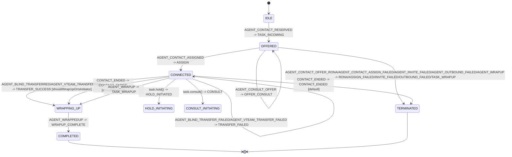
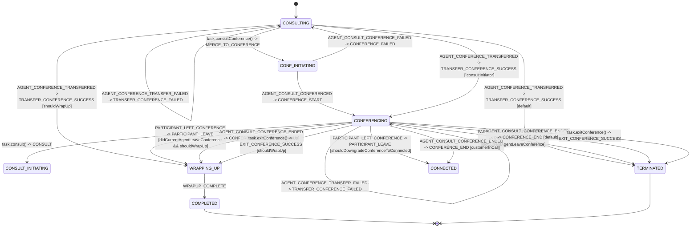

# Task State Machine - Architecture

> **Purpose**: Technical reference for the XState task state machine used by `Task` to drive lifecycle transitions and UI control behavior.

---

## Architecture Overview

The task state machine is built with `xstate` and organized into:
- **State graph** (`TaskStateMachine.ts`)
- **Context mutators** (`actions.ts`)
- **Guard predicates** (`guards.ts`)
- **UI control derivation** (`uiControlsComputer.ts`)
- **Event/context contracts** (`types.ts`)

It is instantiated by `Task` and receives mapped backend/user events through `sendStateMachineEvent(...)`.

---

## Directory Structure

```text
state-machine/
├── TaskStateMachine.ts      # State graph and transition configuration
├── actions.ts               # Assign actions and emitter placeholders
├── guards.ts                # Pure guard predicates
├── uiControlsComputer.ts    # Voice/Digital UI control computation
├── constants.ts             # TaskState, TaskEvent, machine constants
├── types.ts                 # Context and typed event payload map
├── index.ts                 # Public exports
└── ai-docs/
    ├── AGENTS.md            # AI coding guide
    └── ARCHITECTURE.md      # This file
```

---

## Runtime Integration

`Task` bootstraps and owns the actor lifecycle:

1. `createTaskStateMachine(uiControlConfig, {actions: overrides})`
2. `createActor(machine).start()`
3. `TaskManager` and task APIs map external signals to `TaskEvent`
4. Actor transitions update context and execute action overrides
5. `Task` recomputes UI controls and emits task-level events

---

## State Model

Primary states:
- `IDLE`
- `OFFERED`
- `CONNECTED`
- `HELD`
- `CONSULTING`
- `CONFERENCING`
- `WRAPPING_UP`
- terminal: `COMPLETED`, `TERMINATED`

Intermediate async states:
- `HOLD_INITIATING`
- `RESUME_INITIATING`
- `CONSULT_INITIATING`
- `CONF_INITIATING`

---

## Event Model

Events are strongly typed via `TaskEventPayloadMap` and include:
- Offer/assign/hydrate: `TASK_INCOMING`, `TASK_OFFERED`, `ASSIGN`, `HYDRATE`
- Hold/resume: `HOLD_*`, `UNHOLD_*`
- Consult/conference: `CONSULT_*`, `CONFERENCE_*`, `MERGE_TO_CONFERENCE`, `PARTICIPANT_LEAVE`
- Recording: `RECORDING_STARTED`, `PAUSE_RECORDING`, `RESUME_RECORDING`
- Transfer/wrap/end: `TRANSFER_*`, `TASK_WRAPUP`, `WRAPUP_COMPLETE`, `CONTACT_ENDED`

---

## Guard Design

`guards.ts` centralizes transition predicates:
- hydrate restoration guards (`isInteractionHeld`, `isInteractionConnected`, etc.)
- ownership and wrap-up decisions (`shouldWrapUpForThisAgent`)
- conference downgrade checks (`shouldDowngradeConferenceToConnected`)
- consult and participant-leave ownership checks

Design constraints:
- guards are pure
- no context mutation
- resilient to partial/missing `taskData`

---

## Action Design

`actions.ts` contains:
- context synchronization (`updateTaskData`, `setHoldState`, consult flags)
- lifecycle mutations (`clearConsultState`, `markEnded`)
- integration hooks (`requestAutoAnswer`, `requestCleanup`, emitter placeholders)

Emitter actions are intentionally no-op defaults and overridden by `Task` to bridge machine transitions to SDK events.

---

## UI Controls Computation

`uiControlsComputer.ts` computes `TaskUIControls` from:
- current machine state
- current context
- channel type (voice vs digital)
- call/participant metadata from `taskData`
- config flags (`isEndTaskEnabled`, recording toggles, voice variant)

This keeps all control enablement/visibility logic centralized and testable.

---

## Extension Guidelines

When adding behavior:
1. Add constants (`TaskEvent`/`TaskState`) only when needed
2. Extend payload type map before wiring transitions
3. Keep transition conditions in guards, not inline
4. Keep context mutations in assign actions
5. Update machine-level tests and Task integration tests

---

## Backend Event Mapping Reference (CC_EVENTS -> TaskEvent -> Transition)

| Backend CC Event | TaskEvent | Typical From State(s) | Target State | Notes / Guards |
|---|---|---|---|---|
| `AGENT_CONTACT_RESERVED` | `TASK_INCOMING` | `IDLE` | `OFFERED` | Incoming task entry |
| `AGENT_OFFER_CONTACT` | `TASK_OFFERED` | `OFFERED` | `OFFERED` | Offer payload refresh |
| `AGENT_CONTACT` | `HYDRATE` | `IDLE` | `WRAPPING_UP` / `CONSULTING` / `HELD` / `CONNECTED` / `CONFERENCING` / `IDLE` | Guard-based restore |
| `CONTACT_UPDATED` | `CONTACT_UPDATED` | any | same | Context sync |
| `CONTACT_OWNER_CHANGED` | `CONTACT_OWNER_CHANGED` | any | same | Context sync |
| `AGENT_OFFER_CONSULT` | `OFFER_CONSULT` | `OFFERED` | `OFFERED` | Receiver-side consult offer |
| `AGENT_CONTACT_ASSIGNED` | `ASSIGN` | `OFFERED` / `CONNECTED` / `CONSULTING` | `CONNECTED` | Assign/reassign |
| `AGENT_CONTACT_HELD` | `HOLD_SUCCESS` | `HOLD_INITIATING` | `HELD` | Includes `mediaResourceId` |
| `AGENT_CONTACT_UNHELD` | `UNHOLD_SUCCESS` | `RESUME_INITIATING` | `CONNECTED` | Includes `mediaResourceId` |
| `AGENT_CONSULT_CREATED` | `CONSULT_CREATED` | varies | same | Context + emitter action |
| `AGENT_CONSULTING` | `CONSULTING_ACTIVE` | `OFFERED` / `CONSULTING` | `CONSULTING` | Sets consult joined flag |
| `AGENT_CONSULT_ENDED` | `CONSULT_END` | `CONSULTING` | `CONFERENCING` / `HELD` / `TERMINATED` | Depends on initiator flags |
| `AGENT_CONSULT_FAILED` | `CONSULT_FAILED` | `CONSULT_INITIATING` | `CONFERENCING` / `HELD` / `CONNECTED` | Guard-based fallback |
| `AGENT_CTQ_FAILED` | `CONSULT_FAILED` | `CONSULT_INITIATING` | `CONFERENCING` / `HELD` / `CONNECTED` | Same as consult failed |
| `AGENT_CTQ_CANCELLED` | `CTQ_CANCEL` | `CONSULT_INITIATING` | `HELD` / `CONNECTED` | Guarded by hold state |
| `AGENT_CTQ_CANCEL_FAILED` | `CTQ_CANCEL_FAILED` | varies | same | No transition mapping |
| `AGENT_BLIND_TRANSFERRED` | `TRANSFER_SUCCESS` | `CONNECTED` / `HELD` / `CONSULTING` | `WRAPPING_UP` / `CONNECTED` | `shouldWrapUpOrIsInitiator` |
| `AGENT_CONSULT_TRANSFERRED` | `TRANSFER_SUCCESS` | `CONNECTED` / `HELD` / `CONSULTING` | `WRAPPING_UP` / `CONNECTED` | Same path |
| `AGENT_VTEAM_TRANSFERRED` | `TRANSFER_SUCCESS` | `CONNECTED` / `HELD` / `CONSULTING` | `WRAPPING_UP` / `CONNECTED` | Same path |
| `AGENT_WRAPUP` | `TASK_WRAPUP` | `OFFERED` / `CONNECTED` / `HELD` / `CONSULTING` | `TERMINATED` / `WRAPPING_UP` | `OFFERED` terminates; others wrap |
| `AGENT_BLIND_TRANSFER_FAILED` | `TRANSFER_FAILED` | `CONNECTED` / `HELD` / `CONSULTING` | same | Context update |
| `AGENT_VTEAM_TRANSFER_FAILED` | `TRANSFER_FAILED` | `CONNECTED` / `HELD` / `CONSULTING` | same | Context update |
| `AGENT_CONSULT_TRANSFER_FAILED` | `TRANSFER_FAILED` | `CONNECTED` / `HELD` / `CONSULTING` | same | Context update |
| `AGENT_CONFERENCE_TRANSFER_FAILED` | `TRANSFER_FAILED` | `CONNECTED` / `HELD` / `CONSULTING` | same | Context update |
| `CONTACT_ENDED` | `CONTACT_ENDED` | `CONNECTED` / `HELD` / `CONSULTING` / `CONFERENCING` | `CONFERENCING` / `WRAPPING_UP` / `TERMINATED` / same | Guard-driven branch |
| `AGENT_INVITE_FAILED` | `INVITE_FAILED` | `OFFERED` | `TERMINATED` | Reject path |
| `AGENT_CONTACT_ASSIGN_FAILED` | `ASSIGN_FAILED` | `OFFERED` | `TERMINATED` | Reject path |
| `AGENT_CONTACT_OFFER_RONA` | `RONA` | `OFFERED` | `TERMINATED` | Timeout path |
| `AGENT_OUTBOUND_FAILED` | `OUTBOUND_FAILED` | `OFFERED` | `TERMINATED` | Outbound failure |
| `CONTACT_RECORDING_STARTED` | `RECORDING_STARTED` | any | same | Recording state update |
| `CONTACT_RECORDING_PAUSED` | `PAUSE_RECORDING` | `CONNECTED` | same | Recording state update |
| `CONTACT_RECORDING_RESUMED` | `RESUME_RECORDING` | `CONNECTED` | same | Recording state update |
| `AGENT_WRAPPEDUP` | `WRAPUP_COMPLETE` | `WRAPPING_UP` | `COMPLETED` | Final completion |
| `AGENT_CONSULT_CONFERENCED` | `CONFERENCE_START` | `CONSULTING` / `CONF_INITIATING` / `CONFERENCING` | `CONFERENCING` / same | Conference established |
| `PARTICIPANT_JOINED_CONFERENCE` | `CONFERENCE_START` | `CONSULTING` / `CONF_INITIATING` / `CONFERENCING` | `CONFERENCING` / same | Conference participant joined |
| `AGENT_CONSULT_CONFERENCE_FAILED` | `CONFERENCE_FAILED` | `CONF_INITIATING` | `CONSULTING` | Merge fail fallback |
| `AGENT_CONSULT_CONFERENCE_ENDED` | `CONFERENCE_END` | `CONFERENCING` | `WRAPPING_UP` / `CONNECTED` / `TERMINATED` | Guard-driven |
| `PARTICIPANT_LEFT_CONFERENCE` | `PARTICIPANT_LEAVE` | `CONFERENCING` | `WRAPPING_UP` / `TERMINATED` / `CONNECTED` / same | Ownership + downgrade guards |
| `AGENT_CONFERENCE_TRANSFERRED` | `TRANSFER_CONFERENCE_SUCCESS` | `CONSULTING` / `CONFERENCING` | `WRAPPING_UP` / `CONFERENCING` / `TERMINATED` / same | Initiator/receiver dependent |

### Explicitly not mapped to state machine

- `AGENT_CONTACT_UNASSIGNED` -> returns `null` in mapper (`TaskManager.mapEventToTaskStateMachineEvent`)

---

## State Transition Diagram

This diagram represents state-to-state lifecycle transitions for the task state machine.

```mermaid
stateDiagram-v2
    [*] --> IDLE

    %% IDLE
    IDLE --> OFFERED: AGENT_CONTACT_RESERVED (CC Event) -> TASK_INCOMING (State Machine Event)

    %% OFFERED
    OFFERED --> OFFERED: AGENT_OFFER_CONTACT (CC Event) -> TASK_OFFERED (State Machine Event)
    OFFERED --> OFFERED: AGENT_OFFER_CONSULT (CC Event) -> OFFER_CONSULT (State Machine Event)
    OFFERED --> CONNECTED: AGENT_CONTACT_ASSIGNED (CC Event) -> ASSIGN (State Machine Event)
    OFFERED --> CONSULTING: AGENT_CONSULTING (CC Event) -> CONSULTING_ACTIVE (State Machine Event)
    OFFERED --> TERMINATED: AGENT_CONTACT_OFFER_RONA (CC Event) -> RONA (State Machine Event)
    OFFERED --> TERMINATED: AGENT_CONTACT_ASSIGN_FAILED (CC Event) -> ASSIGN_FAILED (State Machine Event)
    OFFERED --> TERMINATED: AGENT_INVITE_FAILED (CC Event) -> INVITE_FAILED (State Machine Event)
    OFFERED --> TERMINATED: AGENT_OUTBOUND_FAILED (CC Event) -> OUTBOUND_FAILED (State Machine Event)
    OFFERED --> TERMINATED: AGENT_WRAPUP (CC Event) -> TASK_WRAPUP (State Machine Event)

    %% CONNECTED
    CONNECTED --> HOLD_INITIATING: API hold() -> HOLD_INITIATED (State Machine Event)
    CONNECTED --> CONSULT_INITIATING: API consult() -> CONSULT (State Machine Event)
    CONNECTED --> WRAPPING_UP: AGENT_*TRANSFERRED (CC Event) -> TRANSFER_SUCCESS (State Machine Event) [shouldWrapUpOrIsInitiator]
    CONNECTED --> CONNECTED: AGENT_*TRANSFERRED (CC Event) -> TRANSFER_SUCCESS (State Machine Event) [receiver]
    CONNECTED --> CONNECTED: AGENT_*TRANSFER_FAILED (CC Event) -> TRANSFER_FAILED (State Machine Event)
    CONNECTED --> CONFERENCING: CONTACT_ENDED (CC Event) -> CONTACT_ENDED (State Machine Event) [conferenceInProgressFromEvent]
    CONNECTED --> WRAPPING_UP: CONTACT_ENDED (CC Event) -> CONTACT_ENDED (State Machine Event) [shouldWrapUp]
    CONNECTED --> TERMINATED: CONTACT_ENDED (CC Event) -> CONTACT_ENDED (State Machine Event) [default]
    CONNECTED --> WRAPPING_UP: AGENT_WRAPUP (CC Event) -> TASK_WRAPUP (State Machine Event)

    %% HOLD_INITIATING
    HOLD_INITIATING --> HELD: HOLD_SUCCESS (State Machine Event)
    HOLD_INITIATING --> CONNECTED: HOLD_FAILED (State Machine Event)

    %% HELD
    HELD --> RESUME_INITIATING: UNHOLD_INITIATED (State Machine Event)
    HELD --> CONSULT_INITIATING: CONSULT (State Machine Event)
    HELD --> WRAPPING_UP: TRANSFER_SUCCESS (State Machine Event) [shouldWrapUpOrIsInitiator]
    HELD --> CONNECTED: TRANSFER_SUCCESS (State Machine Event) [receiver]
    HELD --> CONFERENCING: CONTACT_ENDED (CC Event) -> CONTACT_ENDED (State Machine Event) [conferenceInProgressFromEvent]
    HELD --> WRAPPING_UP: CONTACT_ENDED (CC Event) -> CONTACT_ENDED (State Machine Event) [shouldWrapUp]
    HELD --> TERMINATED: CONTACT_ENDED (CC Event) -> CONTACT_ENDED (State Machine Event) [default]
    HELD --> WRAPPING_UP: TASK_WRAPUP (State Machine Event)
    HELD --> HELD: TRANSFER_FAILED (State Machine Event)

    %% RESUME_INITIATING
    RESUME_INITIATING --> CONNECTED: UNHOLD_SUCCESS (State Machine Event)
    RESUME_INITIATING --> HELD: UNHOLD_FAILED (State Machine Event)

    %% CONSULT_INITIATING
    CONSULT_INITIATING --> CONSULTING: CONSULT_SUCCESS (State Machine Event)
    CONSULT_INITIATING --> CONFERENCING: CONSULT_FAILED (State Machine Event) [consultFromConference]
    CONSULT_INITIATING --> HELD: CONSULT_FAILED / CTQ_CANCEL (State Machine Event) [isPrimaryMediaOnHold]
    CONSULT_INITIATING --> CONNECTED: HOLD_FAILED / CONSULT_FAILED / CTQ_CANCEL (State Machine Event) [default]
    CONSULT_INITIATING --> CONSULT_INITIATING: HOLD_SUCCESS (State Machine Event)

    %% CONSULTING
    CONSULTING --> CONFERENCING: CONSULT_END (State Machine Event) [consultInitiator && consultFromConference]
    CONSULTING --> HELD: CONSULT_END (State Machine Event) [consultInitiator]
    CONSULTING --> TERMINATED: CONSULT_END (State Machine Event) [consulted agent]
    CONSULTING --> WRAPPING_UP: TRANSFER_SUCCESS (State Machine Event) [shouldWrapUpOrIsInitiator]
    CONSULTING --> CONNECTED: TRANSFER_SUCCESS (State Machine Event) [receiver]
    CONSULTING --> WRAPPING_UP: CONTACT_ENDED (CC Event) -> CONTACT_ENDED (State Machine Event) / TASK_WRAPUP (State Machine Event)
    CONSULTING --> CONNECTED: ASSIGN (State Machine Event)
    CONSULTING --> CONF_INITIATING: MERGE_TO_CONFERENCE (State Machine Event)
    CONSULTING --> CONFERENCING: CONFERENCE_START (State Machine Event)
    CONSULTING --> CONFERENCING: TRANSFER_CONFERENCE_SUCCESS (State Machine Event) [!consultInitiator]
    CONSULTING --> WRAPPING_UP: TRANSFER_CONFERENCE_SUCCESS (State Machine Event) [shouldWrapUp]
    CONSULTING --> TERMINATED: TRANSFER_CONFERENCE_SUCCESS (State Machine Event) [default]
    CONSULTING --> CONSULTING: CONSULTING_ACTIVE / HOLD_SUCCESS / UNHOLD_SUCCESS / TRANSFER_FAILED / TRANSFER_CONFERENCE / TRANSFER_CONFERENCE_FAILED (State Machine Event)

    %% CONF_INITIATING
    CONF_INITIATING --> CONFERENCING: CONFERENCE_START (State Machine Event)
    CONF_INITIATING --> CONSULTING: CONFERENCE_FAILED (State Machine Event)

    %% CONFERENCING
    CONFERENCING --> CONSULT_INITIATING: CONSULT (State Machine Event)
    CONFERENCING --> WRAPPING_UP: PARTICIPANT_LEAVE (CC Event) -> PARTICIPANT_LEAVE (State Machine Event) [didCurrentAgentLeaveConference && shouldWrapUp]
    CONFERENCING --> TERMINATED: PARTICIPANT_LEAVE (CC Event) -> PARTICIPANT_LEAVE (State Machine Event) [didCurrentAgentLeaveConference]
    CONFERENCING --> CONNECTED: PARTICIPANT_LEAVE (CC Event) -> PARTICIPANT_LEAVE (State Machine Event) [shouldDowngradeConferenceToConnected]
    CONFERENCING --> WRAPPING_UP: CONFERENCE_END (CC Event) -> CONFERENCE_END (State Machine Event) [shouldWrapUp]
    CONFERENCING --> CONNECTED: CONFERENCE_END (CC Event) -> CONFERENCE_END (State Machine Event) [customerInCall]
    CONFERENCING --> TERMINATED: CONFERENCE_END (CC Event) -> CONFERENCE_END (State Machine Event) [default]
    CONFERENCING --> CONFERENCING: CONFERENCE_START / CONSULT_END / HOLD_SUCCESS / UNHOLD_SUCCESS / PARTICIPANT_LEAVE(other) / TRANSFER_CONFERENCE / TRANSFER_CONFERENCE_SUCCESS / TRANSFER_CONFERENCE_FAILED / CONTACT_ENDED (State Machine Event)

    %% WRAPPING_UP / FINAL
    WRAPPING_UP --> COMPLETED: WRAPUP_COMPLETE (State Machine Event)
    COMPLETED --> [*]
    TERMINATED --> [*]
```



---

## Focused Transition Diagrams

The full diagram above is the source of truth. The diagrams below split above flows based on each feature.

### 1) Initial Task Assign Flow



### 2) Hold/Resume Flow


### 3) Consult Flow

```mermaid
stateDiagram-v2
   stateDiagram-v2
    [*] --> CONNECTED
    CONNECTED --> CONSULT_INITIATING: task.consult() -> CONSULT
    HELD --> CONSULT_INITIATING: task.consult() -> CONSULT
    CONFERENCING --> CONSULT_INITIATING: task.consult() -> CONSULT

    CONSULT_INITIATING --> CONSULT_INITIATING: AGENT_CONTACT_HELD  -> HOLD_SUCCESS
    CONSULT_INITIATING --> CONNECTED: AGENT_CONTACT_HOLD_FAILED -> HOLD_FAILED
    CONSULT_INITIATING --> CONSULTING: AGENT_CONSULTING -> CONSULT_SUCCESS
    CONSULT_INITIATING --> HELD: AGENT_CONSULT_FAILED/AGENT_CTQ_FAILED -> CONSULT_FAILED [isPrimaryMediaOnHold]
    CONSULT_INITIATING --> CONNECTED: AGENT_CONSULT_FAILED/AGENT_CTQ_FAILED -> CONSULT_FAILED [default]
    CONSULT_INITIATING --> CONFERENCING: AGENT_CONSULT_FAILED -> CONSULT_FAILED [consultFromConference]
    CONSULT_INITIATING --> HELD: AGENT_CTQ_CANCELLED -> CTQ_CANCEL [isPrimaryMediaOnHold]
    CONSULT_INITIATING --> CONNECTED: AGENT_CTQ_CANCELLED -> CTQ_CANCEL [default]
   
    CONSULTING --> HELD: AGENT_CONSULT_ENDED -> CONSULT_END [consultInitiator]
    CONSULTING --> TERMINATED: AGENT_CONSULT_ENDED -> CONSULT_END [consulted agent]
    CONSULTING --> CONFERENCING: AGENT_CONSULT_ENDED -> CONSULT_END [consultInitiator && consultFromConference]
    CONSULTING --> CONNECTED: AGENT_CONSULT_TRANSFERRED/AGENT_CONTACT_ASSIGNED -> TRANSFER_SUCCESS/ASSIGN 
    CONSULTING --> WRAPPING_UP: AGENT_CONSULT_TRANSFERRED -> TRANSFER_SUCCESS [shouldWrapUpOrIsInitiator]
    CONSULTING --> CONSULTING: AGENT_CONSULT_TRANSFER_FAILED -> TRANSFER_FAILED 
    CONSULTING --> CONF_INITIATING: task.consultConference() -> MERGE_TO_CONFERENCE
    CONSULTING --> WRAPPING_UP: AGENT_CONTACT_ENDED -> CONTACT_ENDED 
    
    WRAPPING_UP --> COMPLETED: AGENT_WRAPPEDUP -> WRAPUP_COMPLETE
    COMPLETED --> [*]
    TERMINATED --> [*]
```

### 4) Conference Flow



---

## Related Files

- `../Task.ts` - actor lifecycle, action overrides, event emission
- `../TaskManager.ts` - maps backend events to state-machine events
- `../types.ts` - shared task data structures
- `../../ai-docs/ARCHITECTURE.md` - broader task service architecture