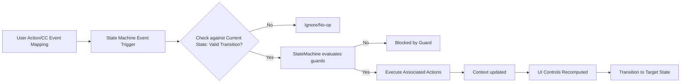
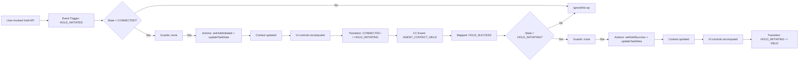
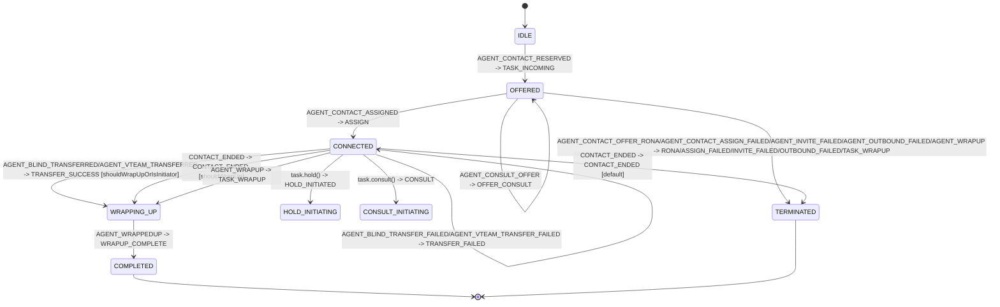
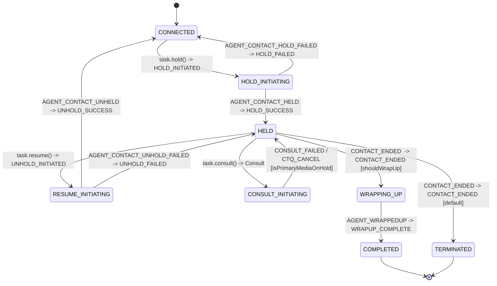
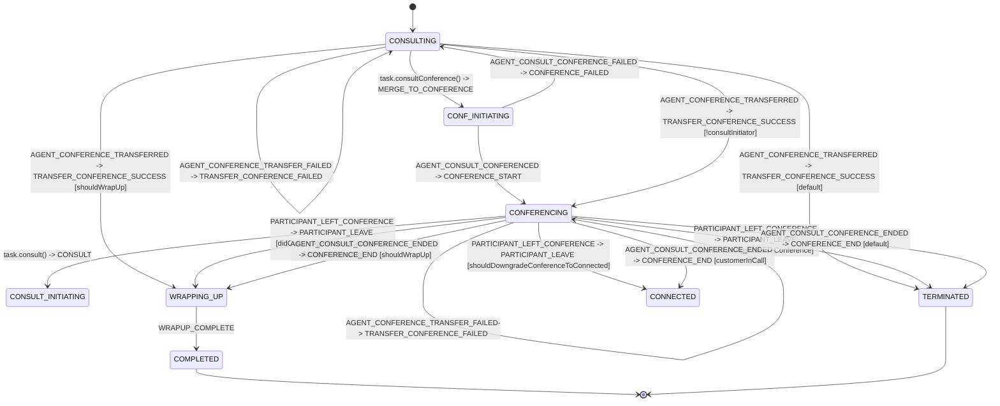

# Task State Machine - Architecture

## Purpose

Technical reference for the complete state machine using XState to drive state transitions and UI control behavior. It orchestrates state transitions, guards, and actions for task lifecycle management.

---

## Architecture Overview

The task state machine is built with `xstate` and organized into:

- **State graph** (`TaskStateMachine.ts`)
- **Context mutators** (`actions.ts`)
- **Guard predicates** (`guards.ts`)
- **UI control derivation** (`uiControlsComputer.ts`)
- **Event/context contracts** (`types.ts`)

It is instantiated by `Task` and receives mapped backend/user events through `sendStateMachineEvent(...)`.

---

## Runtime Integration

`Task` bootstraps and owns the actor lifecycle:

1. `createTaskStateMachine(uiControlConfig, {actions: overrides})`
2. `createActor(machine).start()`
3. `TaskManager` and task APIs map external signals to `TaskEvent`
4. Actor transitions update context and execute action overrides
5. `Task` recomputes UI controls and emits task-level events

---

## States

### IDLE

**Description**: Initial state before a task is offered or restored.

**How this state is reached (incoming transitions)**:

- Machine start -> `IDLE` (no event, no actions)

**Valid transitions from `IDLE` state**:

- `TASK_INCOMING` -> `OFFERED`
  - Guard: none
  - Actions: `initializeTask`, `emitTaskIncoming`
- `HYDRATE` -> `WRAPPING_UP`
  - Guard: `guards.isInteractionTerminated`
  - Actions: `updateTaskData`, `markEnded`, `emitTaskHydrate`
- `HYDRATE` -> `CONSULTING`
  - Guard: `guards.isInteractionConsulting`
  - Actions: `updateTaskData`, `emitTaskHydrate`
- `HYDRATE` -> `HELD`
  - Guard: `guards.isInteractionHeld`
  - Actions: `updateTaskData`, `emitTaskHydrate`
- `HYDRATE` -> `CONNECTED`
  - Guard: `guards.isInteractionConnected`
  - Actions: `updateTaskData`, `emitTaskHydrate`
- `HYDRATE` -> `CONFERENCING`
  - Guard: `guards.isConferencingByParticipants`
  - Actions: `updateTaskData`, `emitTaskHydrate`
- `HYDRATE` -> stay `IDLE` (default hydrate branch)
  - Guard: default
  - Actions: `updateTaskData`, `emitTaskHydrate`

---

### OFFERED

**Description**: Task has been offered/reserved and is waiting for assignment or termination paths.

**How this state is reached (incoming transitions)**:

- `IDLE --TASK_INCOMING--> OFFERED`
  - Guard: none
  - Actions: `initializeTask`, `emitTaskIncoming`

**Valid transitions from `OFFERED`**:

- `TASK_OFFERED` -> Stay `OFFERED`
  - Guard: none
  - Actions: `updateTaskData`, `emitTaskOfferContact`, `requestAutoAnswer`
- `OFFER_CONSULT` -> Stay `OFFERED`
  - Guard: none
  - Actions: `updateTaskData`, `emitTaskOfferConsult`, `requestAutoAnswer`
- `ASSIGN` -> `CONNECTED`
  - Guard: none
  - Actions: `updateTaskData`, `emitTaskAssigned`
- `CONSULTING_ACTIVE` -> `CONSULTING`
  - Guard: none
  - Actions: `updateTaskData`, `setConsultAgentJoined`, `emitTaskConsultAccepted`, `emitTaskConsulting`
- `TASK_WRAPUP` -> `TERMINATED`
  - Guard: none
  - Actions: `updateTaskData`, `markEnded`, `emitTaskEnd`
- `RONA` / `ASSIGN_FAILED` / `INVITE_FAILED` / `OUTBOUND_FAILED` -> `TERMINATED`
  - Guard: none
  - Actions: `updateTaskData`, `markEnded`, `emitTaskReject`

---

### CONNECTED

**Description**: Agent is connected on the main customer interaction leg.

**How this state is reached (incoming transitions)**:

- `OFFERED --ASSIGN--> CONNECTED`
  - Guard: none
  - Actions: `updateTaskData`, `emitTaskAssigned`
- `IDLE --HYDRATE--> CONNECTED`
  - Guard: `guards.isInteractionConnected`
  - Actions: `updateTaskData`, `emitTaskHydrate`
- `RESUME_INITIATING --UNHOLD_SUCCESS--> CONNECTED`
  - Guard: none
  - Actions: `updateTaskData`, `setHoldState`, `emitTaskResume`
- `HELD --TRANSFER_SUCCESS--> CONNECTED` (receiver/default branch)
  - Guard: default branch when `guards.shouldWrapUpOrIsInitiator` is false
  - Actions: `updateTaskData`, `clearConsultState`
- `CONSULTING --ASSIGN--> CONNECTED`
  - Guard: none
  - Actions: `updateTaskData`, `emitTaskAssigned`

**Valid transitions from `CONNECTED`**:

- `ASSIGN` -> `CONNECTED` (self-transition)
  - Guard: none
  - Actions: `updateTaskData`, `emitTaskAssigned`
- `HOLD_INITIATED` -> `HOLD_INITIATING`
  - Guard: none
  - Actions: none
- `CONSULT` -> `CONSULT_INITIATING`
  - Guard: none
  - Actions: `setConsultInitiator`, `setConsultDestination`
- `CONSULTING_ACTIVE` -> `CONSULTING`
  - Guard: none
  - Actions: `updateTaskData`, `setConsultAgentJoined`, `emitTaskConsultAccepted`, `emitTaskConsulting`
- `TRANSFER_SUCCESS` -> `WRAPPING_UP`
  - Guard: `guards.shouldWrapUpOrIsInitiator`
  - Actions: `updateTaskData`, `markEnded`, `emitTaskWrapup`
- `TRANSFER_SUCCESS` -> Stay `CONNECTED` (receiver/default branch)
  - Guard: default
  - Actions: `updateTaskData`, `clearConsultState`
- `TRANSFER_FAILED` -> Stay `CONNECTED`
  - Guard: none
  - Actions: `updateTaskData`
- `CONTACT_ENDED` -> `CONFERENCING`
  - Guard: `guards.conferenceInProgressFromEvent`
  - Actions: `updateTaskData`, `emitTaskConferenceStarted`, `requestCleanup`
- `CONTACT_ENDED` -> `WRAPPING_UP`
  - Guard: `guards.shouldWrapUp`
  - Actions: `updateTaskData`, `markEnded`, `emitTaskWrapup`, `requestCleanup`
- `CONTACT_ENDED` -> `TERMINATED` (default branch)
  - Guard: default
  - Actions: `updateTaskData`, `markEnded`, `emitTaskEnd`
- `TASK_WRAPUP` -> `WRAPPING_UP`
  - Guard: none
  - Actions: `updateTaskData`, `markEnded`, `emitTaskWrapup`
- `PAUSE_RECORDING` / `RESUME_RECORDING` -> Stay `CONNECTED`
  - Guard: none
  - Actions: `updateTaskData`, `setRecordingState`, `emitTaskRecordingPaused` / `emitTaskRecordingResumed`

---

### HELD

**Description**: Main call is on hold.

**How this state is reached (incoming transitions)**:

- `IDLE --HYDRATE--> HELD`
  - Guard: `guards.isInteractionHeld`
  - Actions: `updateTaskData`, `emitTaskHydrate`
- `HOLD_INITIATING --HOLD_SUCCESS--> HELD`
  - Guard: none
  - Actions: `updateTaskData`, `setHoldState`, `emitTaskHold`
- `RESUME_INITIATING --UNHOLD_FAILED--> HELD`
  - Guard: none
  - Actions: none
- `CONSULTING --CONSULT_END--> HELD`
  - Guard: inline `context.consultInitiator === true`
  - Actions: `updateTaskData`, `clearConsultState`, `emitTaskConsultEnd`
- `CONSULT_INITIATING --CONSULT_FAILED--> HELD`
  - Guard: `guards.isPrimaryMediaOnHold`
  - Actions: `updateTaskData`, `handleConsultFailed`
- `CONSULT_INITIATING --CTQ_CANCEL--> HELD`
  - Guard: `guards.isPrimaryMediaOnHold`
  - Actions: `updateTaskData`, `clearConsultState`

**Valid transitions from `HELD`**:

- `UNHOLD_INITIATED` -> `RESUME_INITIATING`
  - Guard: none
  - Actions: none
- `CONSULT` -> `CONSULT_INITIATING`
  - Guard: none
  - Actions: `setConsultInitiator`, `setConsultDestination`
- `TRANSFER_SUCCESS` -> `WRAPPING_UP`
  - Guard: `guards.shouldWrapUpOrIsInitiator`
  - Actions: `updateTaskData`, `markEnded`, `emitTaskWrapup`
- `TRANSFER_SUCCESS` -> `CONNECTED` (receiver/default branch)
  - Guard: default
  - Actions: `updateTaskData`, `clearConsultState`
- `TRANSFER_FAILED` -> stay `HELD`
  - Guard: none
  - Actions: `updateTaskData`
- `CONTACT_ENDED` -> `CONFERENCING`
  - Guard: `guards.conferenceInProgressFromEvent`
  - Actions: `updateTaskData`, `emitTaskConferenceStarted`, `requestCleanup`
- `CONTACT_ENDED` -> `WRAPPING_UP`
  - Guard: `guards.shouldWrapUp`
  - Actions: `updateTaskData`, `markEnded`, `emitTaskWrapup`, `requestCleanup`
- `CONTACT_ENDED` -> `TERMINATED` (default branch)
  - Guard: default
  - Actions: `updateTaskData`, `markEnded`, `emitTaskEnd`
- `TASK_WRAPUP` -> `WRAPPING_UP`
  - Guard: none
  - Actions: `updateTaskData`, `markEnded`, `emitTaskWrapup`

---

### HOLD_INITIATING

**Description**: Hold request has been sent and is awaiting backend confirmation.

**How this state is reached (incoming transitions)**:

- `CONNECTED --HOLD_INITIATED--> HOLD_INITIATING`
  - Guard: none
  - Actions: none

**Valid transitions from `HOLD_INITIATING`**:

- `HOLD_SUCCESS` -> `HELD`
  - Guard: none
  - Actions: `updateTaskData`, `setHoldState`, `emitTaskHold`
- `HOLD_FAILED` -> `CONNECTED`
  - Guard: none
  - Actions: `updateTaskData`

---

### RESUME_INITIATING

**Description**: Resume/unhold request has been sent and is awaiting backend confirmation.

**How this state is reached (incoming transitions)**:

- `HELD --UNHOLD_INITIATED--> RESUME_INITIATING`
  - Guard: none
  - Actions: none

**Valid transitions from `RESUME_INITIATING`**:

- `UNHOLD_SUCCESS` -> `CONNECTED`
  - Guard: none
  - Actions: `updateTaskData`, `setHoldState`, `emitTaskResume`
- `UNHOLD_FAILED` -> `HELD`
  - Guard: none
  - Actions: none

---

### CONSULT_INITIATING

**Description**: Consult request is in-flight.

**How this state is reached (incoming transitions)**:

- `CONNECTED --CONSULT--> CONSULT_INITIATING`
  - Guard: none
  - Actions: `setConsultInitiator`, `setConsultDestination`
- `HELD --CONSULT--> CONSULT_INITIATING`
  - Guard: none
  - Actions: `setConsultInitiator`, `setConsultDestination`
- `CONFERENCING --CONSULT--> CONSULT_INITIATING`
  - Guard: none
  - Actions: `setConsultInitiator`, `setConsultDestination`, `setConsultFromConference`

**Valid transitions from `CONSULT_INITIATING`**:

- `CONSULT_SUCCESS` -> `CONSULTING`
  - Guard: none
  - Actions: `updateTaskData`, `setConsultInitiator`
- `CONSULT_FAILED` -> `CONFERENCING`
  - Guard: inline `context.consultFromConference === true`
  - Actions: `updateTaskData`, `handleConsultFailed`
- `CONSULT_FAILED` -> `HELD`
  - Guard: `guards.isPrimaryMediaOnHold`
  - Actions: `updateTaskData`, `handleConsultFailed`
- `CONSULT_FAILED` -> `CONNECTED` (default branch)
  - Guard: default
  - Actions: `updateTaskData`, `handleConsultFailed`
- `CTQ_CANCEL` -> `HELD`
  - Guard: `guards.isPrimaryMediaOnHold`
  - Actions: `updateTaskData`, `clearConsultState`
- `CTQ_CANCEL` -> `CONNECTED` (default branch)
  - Guard: default
  - Actions: `updateTaskData`, `clearConsultState`
- `HOLD_SUCCESS` -> stay `CONSULT_INITIATING`
  - Guard: none
  - Actions: `updateTaskData`
- `HOLD_FAILED` -> `CONNECTED`
  - Guard: none
  - Actions: `updateTaskData`, `handleConsultFailed`

---

### CONSULTING

**Description**: Agent is in active consult leg.

**How this state is reached (incoming transitions)**:

- `IDLE --HYDRATE--> CONSULTING`
  - Guard: `guards.isInteractionConsulting`
  - Actions: `updateTaskData`, `emitTaskHydrate`
- `OFFERED --CONSULTING_ACTIVE--> CONSULTING`
  - Guard: none
  - Actions: `updateTaskData`, `setConsultAgentJoined`, `emitTaskConsultAccepted`, `emitTaskConsulting`
- `CONSULT_INITIATING --CONSULT_SUCCESS--> CONSULTING`
  - Guard: none
  - Actions: `updateTaskData`, `setConsultInitiator`
- `CONF_INITIATING --CONFERENCE_FAILED--> CONSULTING`
  - Guard: none
  - Actions: none

**Valid transitions from `CONSULTING`**:

- `CONSULTING_ACTIVE` -> stay `CONSULTING`
  - Guard: none
  - Actions: `updateTaskData`, `setConsultAgentJoined`, `emitTaskConsulting`
- `CONSULT_END` -> `CONFERENCING`
  - Guard: inline `context.consultInitiator === true && context.consultFromConference === true`
  - Actions: `updateTaskData`, `clearConsultState`, `emitTaskConsultEnd`
- `CONSULT_END` -> `HELD`
  - Guard: inline `context.consultInitiator === true`
  - Actions: `updateTaskData`, `clearConsultState`, `emitTaskConsultEnd`
- `CONSULT_END` -> `TERMINATED` (default branch)
  - Guard: default
  - Actions: `updateTaskData`
- `HOLD_SUCCESS` -> stay `CONSULTING`
  - Guard: none
  - Actions: `updateTaskData`, `setHoldState`, `setConsultCallHeld`
- `UNHOLD_SUCCESS` -> stay `CONSULTING`
  - Guard: none
  - Actions: `updateTaskData`, `setHoldState`, `clearConsultCallHeld`
- `TRANSFER_SUCCESS` -> `WRAPPING_UP`
  - Guard: `guards.shouldWrapUpOrIsInitiator`
  - Actions: `updateTaskData`, `markEnded`, `emitTaskWrapup`
- `TRANSFER_SUCCESS` -> `CONNECTED` (receiver/default branch)
  - Guard: default
  - Actions: `updateTaskData`, `clearConsultState`
- `TRANSFER_FAILED` -> stay `CONSULTING`
  - Guard: none
  - Actions: `updateTaskData`
- `TRANSFER_CONFERENCE` -> stay `CONSULTING`
  - Guard: none
  - Actions: `setTransferConferenceRequested`, `emitTaskTransferConference`
- `TRANSFER_CONFERENCE_SUCCESS` -> stay `CONSULTING`
  - Guard: inline `context.transferConferenceRequested !== true`
  - Actions: `updateTaskData`, `handleTransferConferenceSuccess`, `clearTransferConferenceRequested`
- `TRANSFER_CONFERENCE_SUCCESS` -> `WRAPPING_UP`
  - Guard: `guards.shouldWrapUp`
  - Actions: `updateTaskData`, `markEnded`, `clearConsultState`, `handleTransferConferenceSuccess`, `clearTransferConferenceRequested`, `emitTaskWrapup`
- `TRANSFER_CONFERENCE_SUCCESS` -> `CONFERENCING`
  - Guard: inline `!context.consultInitiator`
  - Actions: `updateTaskData`, `clearConsultState`, `handleTransferConferenceSuccess`, `clearTransferConferenceRequested`
- `TRANSFER_CONFERENCE_SUCCESS` -> `TERMINATED` (default branch)
  - Guard: default
  - Actions: `updateTaskData`, `markEnded`, `clearConsultState`, `handleTransferConferenceSuccess`, `clearTransferConferenceRequested`, `emitTaskEnd`
- `TRANSFER_CONFERENCE_FAILED` -> stay `CONSULTING`
  - Guard: none
  - Actions: `clearTransferConferenceRequested`
- `ASSIGN` -> `CONNECTED`
  - Guard: none
  - Actions: `updateTaskData`, `emitTaskAssigned`
- `CONTACT_ENDED` -> `WRAPPING_UP`
  - Guard: none
  - Actions: `updateTaskData`, `markEnded`, `clearConsultState`, `emitTaskWrapup`, `requestCleanup`
- `TASK_WRAPUP` -> `WRAPPING_UP`
  - Guard: none
  - Actions: `updateTaskData`, `markEnded`, `clearConsultState`, `emitTaskWrapup`
- `MERGE_TO_CONFERENCE` -> `CONF_INITIATING`
  - Guard: none
  - Actions: none
- `CONFERENCE_START` -> `CONFERENCING`
  - Guard: none
  - Actions: `handleConferenceStarted`, `clearConsultState`

---

### CONF_INITIATING

**Description**: Conference merge is being established.

**How this state is reached (incoming transitions)**:

- `CONSULTING --MERGE_TO_CONFERENCE--> CONF_INITIATING`
  - Guard: none
  - Actions: none

**Valid transitions from `CONF_INITIATING`**:

- `CONFERENCE_START` -> `CONFERENCING`
  - Guard: none
  - Actions: `handleConferenceStarted`
- `CONFERENCE_FAILED` -> `CONSULTING`
  - Guard: none
  - Actions: none

---

### CONFERENCING

**Description**: Active conference call state.

**How this state is reached (incoming transitions)**:

- `IDLE --HYDRATE--> CONFERENCING`
  - Guard: `guards.isConferencingByParticipants`
  - Actions: `updateTaskData`, `emitTaskHydrate`
- `CONNECTED --CONTACT_ENDED--> CONFERENCING`
  - Guard: `guards.conferenceInProgressFromEvent`
  - Actions: `updateTaskData`, `emitTaskConferenceStarted`, `requestCleanup`
- `HELD --CONTACT_ENDED--> CONFERENCING`
  - Guard: `guards.conferenceInProgressFromEvent`
  - Actions: `updateTaskData`, `emitTaskConferenceStarted`, `requestCleanup`
- `CONSULTING --CONFERENCE_START--> CONFERENCING`
  - Guard: none
  - Actions: `handleConferenceStarted`, `clearConsultState`
- `CONF_INITIATING --CONFERENCE_START--> CONFERENCING`
  - Guard: none
  - Actions: `handleConferenceStarted`
- `CONSULTING --TRANSFER_CONFERENCE_SUCCESS--> CONFERENCING`
  - Guard: inline `!context.consultInitiator`
  - Actions: `updateTaskData`, `clearConsultState`, `handleTransferConferenceSuccess`, `clearTransferConferenceRequested`

**Valid transitions from `CONFERENCING`**:

- `CONSULT` -> `CONSULT_INITIATING`
  - Guard: none
  - Actions: `setConsultInitiator`, `setConsultDestination`, `setConsultFromConference`
- `CONFERENCE_START` -> stay `CONFERENCING`
  - Guard: none
  - Actions: `updateTaskData`, `clearConsultState`, `emitTaskConferenceStarted`
- `CONSULT_END` -> stay `CONFERENCING`
  - Guard: none
  - Actions: `updateTaskData`, `clearConsultState`
- `HOLD_SUCCESS` / `UNHOLD_SUCCESS` -> stay `CONFERENCING`
  - Guard: none
  - Actions: `updateTaskData`, `setHoldState`, `emitTaskHold` / `emitTaskResume`
- `TRANSFER_CONFERENCE` -> stay `CONFERENCING`
  - Guard: none
  - Actions: `setTransferConferenceRequested`, `emitTaskTransferConference`
- `TRANSFER_CONFERENCE_SUCCESS` -> stay `CONFERENCING`
  - Guard: inline `context.transferConferenceRequested !== true`
  - Actions: `updateTaskData`, `handleTransferConferenceSuccess`, `clearTransferConferenceRequested`
- `TRANSFER_CONFERENCE_FAILED` -> stay `CONFERENCING`
  - Guard: none
  - Actions: `clearTransferConferenceRequested`
- `PARTICIPANT_LEAVE` -> `WRAPPING_UP`
  - Guard: `guards.didCurrentAgentLeaveConference && guards.shouldWrapUp`
  - Actions: `updateTaskData`, `handleParticipantLeft`, `markEnded`, `clearConsultState`, `emitTaskParticipantLeft`, `emitTaskWrapup`
- `PARTICIPANT_LEAVE` -> `TERMINATED`
  - Guard: `guards.didCurrentAgentLeaveConference`
  - Actions: `updateTaskData`, `handleParticipantLeft`, `markEnded`, `clearConsultState`, `emitTaskParticipantLeft`, `emitTaskEnd`
- `PARTICIPANT_LEAVE` -> `CONNECTED`
  - Guard: `guards.shouldDowngradeConferenceToConnected`
  - Actions: `updateTaskData`, `handleParticipantLeft`, `clearConsultState`, `emitTaskParticipantLeft`, `emitTaskConferenceEnded`
- `PARTICIPANT_LEAVE` -> stay `CONFERENCING` (default)
  - Guard: default
  - Actions: `updateTaskData`, `handleParticipantLeft`, `emitTaskParticipantLeft`
- `CONFERENCE_END` -> `WRAPPING_UP`
  - Guard: `guards.shouldWrapUp`
  - Actions: `updateTaskData`, `markEnded`, `clearConsultState`, `emitTaskWrapup`
- `CONFERENCE_END` -> `CONNECTED`
  - Guard: inline `!context.exitingConference && customerInCall`
  - Actions: `updateTaskData`, `clearConsultState`, `emitTaskConferenceEnded`
- `CONFERENCE_END` -> `TERMINATED` (default branch)
  - Guard: default
  - Actions: `updateTaskData`, `markEnded`, `clearConsultState`, `emitTaskEnd`
- `CONTACT_ENDED` -> stay `CONFERENCING`
  - Guard: none
  - Actions: `updateTaskData`, `requestCleanup`

---

### WRAPPING_UP

**Description**: Post-interaction work (ACW) is in progress.

**How this state is reached (incoming transitions)**:

- Reached from `CONNECTED`, `HELD`, `CONSULTING`, or `CONFERENCING` via `CONTACT_ENDED`, `TASK_WRAPUP`, `TRANSFER_SUCCESS`, `TRANSFER_CONFERENCE_SUCCESS`, `PARTICIPANT_LEAVE`, or `CONFERENCE_END` branches
- Entry always emits wrapup event after transition

**Entry Actions**:

- `emitTaskWrapup`

**Valid transitions from `WRAPPING_UP`**:

- `WRAPUP_COMPLETE` -> `COMPLETED`
  - Guard: none
  - Actions: `updateTaskData`

**Guards**: None

### COMPLETED

**Description**: Final wrapped-up terminal state.

**Entry Actions**:

- `emitTaskWrappedup`
- `cleanupResources`

**How this state is reached (incoming transitions)**:

- `WRAPPING_UP --WRAPUP_COMPLETE--> COMPLETED`
  - Guard: none
  - Actions: `updateTaskData`

**Valid transitions from `COMPLETED`**: None (final state)

**Guards**: None

---

### TERMINATED

**Description**: Final terminated terminal state.

**Entry Actions**:

- `cleanupResources`

**How this state is reached (incoming transitions)**:

- Reached from `OFFERED`, `CONNECTED`, `HELD`, `CONSULTING`, and `CONFERENCING` via terminating branches (`TASK_WRAPUP`, failure paths, and default end-of-contact/conference branches)

**Valid transitions from `TERMINATED`**: None (final state)

**Guards**: None

---

## Events

Event names below are from `TaskEvent` in `constants.ts`.

### Core lifecycle and sync

- `TASK_INCOMING`, `TASK_OFFERED`, `HYDRATE`
- `CONTACT_UPDATED`, `CONTACT_OWNER_CHANGED`
- `ASSIGN`, `CONTACT_ENDED`, `TASK_WRAPUP`, `WRAPUP_COMPLETE`

### Hold/resume

- `HOLD_INITIATED`, `HOLD_SUCCESS`, `HOLD_FAILED`
- `UNHOLD_INITIATED`, `UNHOLD_SUCCESS`, `UNHOLD_FAILED`

### Consult

- `OFFER_CONSULT`, `CONSULT`, `CONSULT_SUCCESS`, `CONSULT_CREATED`
- `CONSULTING_ACTIVE`, `CONSULT_END`, `CONSULT_FAILED`
- `CTQ_CANCEL`, `CTQ_CANCEL_FAILED`

### Conference and conference-transfer

- `MERGE_TO_CONFERENCE`, `CONFERENCE_START`, `CONFERENCE_FAILED`, `CONFERENCE_END`
- `PARTICIPANT_LEAVE`
- `TRANSFER_CONFERENCE`, `TRANSFER_CONFERENCE_SUCCESS`, `TRANSFER_CONFERENCE_FAILED`
- `EXIT_CONFERENCE`, `EXIT_CONFERENCE_SUCCESS`, `EXIT_CONFERENCE_FAILED`

### Transfer

- `TRANSFER_SUCCESS`, `TRANSFER_FAILED`

### Recording

- `RECORDING_STARTED`, `PAUSE_RECORDING`, `RESUME_RECORDING`

### Failure/end events

- `RONA`, `INVITE_FAILED`, `ASSIGN_FAILED`, `OUTBOUND_FAILED`

---

## Single Transition Flow

The flow below shows a single transition in the requested form:



### Example: Hold Flow (Concrete)



---

## State Pattern (via XState)

### Purpose

Manage complex task lifecycle with clear states, transitions, guards, and actions.

### Implementation

```typescript
// Task.ts
export default abstract class Task extends EventEmitter {
  public stateMachineService?: ActorRefFrom<TaskStateMachine>;

  private initializeStateMachine(): void {
    const machine: TaskStateMachine = createTaskStateMachine(this.uiControlConfig, {
      actions: this.getStateMachineActionOverrides(),
    });

    this.stateMachineService = createActor(machine);

    // Subscribe to state changes
    this.stateMachineService.subscribe((snapshot) => {
      const currentState = snapshot.value as TaskState;
      this.state = snapshot;
      this.updateUiControls(previousState !== currentState);
    });

    this.stateMachineService.start();
  }

  public sendStateMachineEvent(event: TaskEventPayload): void {
    this.stateMachineService?.send(event);
  }
}
```

### State Machine Architecture

```typescript
// state-machine/TaskStateMachine.ts
export function getTaskStateMachineConfig(uiControlConfig: UIControlConfig) {
  return {
    id: 'taskStateMachine',
    initial: TaskState.IDLE,
    context: createInitialContext(uiControlConfig, TaskState.IDLE),
    states: {
      [TaskState.IDLE]: {
        on: {
          [TaskEvent.TASK_INCOMING]: {
            target: TaskState.OFFERED,
            actions: ['initializeTask', 'emitTaskIncoming'],
          },
        },
      },
      [TaskState.OFFERED]: {
        on: {
          [TaskEvent.ASSIGN]: {
            target: TaskState.CONNECTED,
            actions: ['updateTaskData', 'emitTaskAssigned'],
          },
          [TaskEvent.TASK_WRAPUP]: {
            target: TaskState.TERMINATED,
            actions: ['updateTaskData', 'markEnded', 'emitTaskEnd'],
          },
        },
      },
      // ... more states
    },
  };
}
```

## Backend CC Event Mapping Reference (CC_EVENTS -> TaskEvent -> Transition)

Complete mapping from backend CC_EVENTS to internal TaskEvent types.

| Backend CC Event                   | TaskEvent                     | Typical From State(s)                                | Target State                                                                  | Notes / Guards                    |
| ---------------------------------- | ----------------------------- | ---------------------------------------------------- | ----------------------------------------------------------------------------- | --------------------------------- |
| `AGENT_CONTACT_RESERVED`           | `TASK_INCOMING`               | `IDLE`                                               | `OFFERED`                                                                     | Incoming task entry               |
| `AGENT_OFFER_CONTACT`              | `TASK_OFFERED`                | `OFFERED`                                            | `OFFERED`                                                                     | Offer payload refresh             |
| `AGENT_CONTACT`                    | `HYDRATE`                     | `IDLE`                                               | `WRAPPING_UP` / `CONSULTING` / `HELD` / `CONNECTED` / `CONFERENCING` / `IDLE` | Guard-based restore               |
| `CONTACT_UPDATED`                  | `CONTACT_UPDATED`             | any                                                  | same                                                                          | Context sync                      |
| `CONTACT_OWNER_CHANGED`            | `CONTACT_OWNER_CHANGED`       | any                                                  | same                                                                          | Context sync                      |
| `AGENT_OFFER_CONSULT`              | `OFFER_CONSULT`               | `OFFERED`                                            | `OFFERED`                                                                     | Receiver-side consult offer       |
| `AGENT_CONTACT_ASSIGNED`           | `ASSIGN`                      | `OFFERED` / `CONNECTED` / `CONSULTING`               | `CONNECTED`                                                                   | Assign/reassign                   |
| `AGENT_CONTACT_HELD`               | `HOLD_SUCCESS`                | `HOLD_INITIATING`                                    | `HELD`                                                                        | Includes `mediaResourceId`        |
| `AGENT_CONTACT_UNHELD`             | `UNHOLD_SUCCESS`              | `RESUME_INITIATING`                                  | `CONNECTED`                                                                   | Includes `mediaResourceId`        |
| `AGENT_CONSULT_CREATED`            | `CONSULT_CREATED`             | varies                                               | same                                                                          | Context + emitter action          |
| `AGENT_CONSULTING`                 | `CONSULTING_ACTIVE`           | `OFFERED` / `CONSULTING`                             | `CONSULTING`                                                                  | Sets consult joined flag          |
| `AGENT_CONSULT_ENDED`              | `CONSULT_END`                 | `CONSULTING`                                         | `CONFERENCING` / `HELD` / `TERMINATED`                                        | Depends on initiator flags        |
| `AGENT_CONSULT_FAILED`             | `CONSULT_FAILED`              | `CONSULT_INITIATING`                                 | `CONFERENCING` / `HELD` / `CONNECTED`                                         | Guard-based fallback              |
| `AGENT_CTQ_FAILED`                 | `CONSULT_FAILED`              | `CONSULT_INITIATING`                                 | `CONFERENCING` / `HELD` / `CONNECTED`                                         | Same as consult failed            |
| `AGENT_CTQ_CANCELLED`              | `CTQ_CANCEL`                  | `CONSULT_INITIATING`                                 | `HELD` / `CONNECTED`                                                          | Guarded by hold state             |
| `AGENT_CTQ_CANCEL_FAILED`          | `CTQ_CANCEL_FAILED`           | varies                                               | same                                                                          | No transition mapping             |
| `AGENT_BLIND_TRANSFERRED`          | `TRANSFER_SUCCESS`            | `CONNECTED` / `HELD` / `CONSULTING`                  | `WRAPPING_UP` / `CONNECTED`                                                   | `shouldWrapUpOrIsInitiator`       |
| `AGENT_CONSULT_TRANSFERRED`        | `TRANSFER_SUCCESS`            | `CONNECTED` / `HELD` / `CONSULTING`                  | `WRAPPING_UP` / `CONNECTED`                                                   | Same path                         |
| `AGENT_VTEAM_TRANSFERRED`          | `TRANSFER_SUCCESS`            | `CONNECTED` / `HELD` / `CONSULTING`                  | `WRAPPING_UP` / `CONNECTED`                                                   | Same path                         |
| `AGENT_WRAPUP`                     | `TASK_WRAPUP`                 | `OFFERED` / `CONNECTED` / `HELD` / `CONSULTING`      | `TERMINATED` / `WRAPPING_UP`                                                  | `OFFERED` terminates; others wrap |
| `AGENT_BLIND_TRANSFER_FAILED`      | `TRANSFER_FAILED`             | `CONNECTED` / `HELD` / `CONSULTING`                  | same                                                                          | Context update                    |
| `AGENT_VTEAM_TRANSFER_FAILED`      | `TRANSFER_FAILED`             | `CONNECTED` / `HELD` / `CONSULTING`                  | same                                                                          | Context update                    |
| `AGENT_CONSULT_TRANSFER_FAILED`    | `TRANSFER_FAILED`             | `CONNECTED` / `HELD` / `CONSULTING`                  | same                                                                          | Context update                    |
| `AGENT_CONFERENCE_TRANSFER_FAILED` | `TRANSFER_FAILED`             | `CONNECTED` / `HELD` / `CONSULTING`                  | same                                                                          | Context update                    |
| `CONTACT_ENDED`                    | `CONTACT_ENDED`               | `CONNECTED` / `HELD` / `CONSULTING` / `CONFERENCING` | `CONFERENCING` / `WRAPPING_UP` / `TERMINATED` / same                          | Guard-driven branch               |
| `AGENT_INVITE_FAILED`              | `INVITE_FAILED`               | `OFFERED`                                            | `TERMINATED`                                                                  | Reject path                       |
| `AGENT_CONTACT_ASSIGN_FAILED`      | `ASSIGN_FAILED`               | `OFFERED`                                            | `TERMINATED`                                                                  | Reject path                       |
| `AGENT_CONTACT_OFFER_RONA`         | `RONA`                        | `OFFERED`                                            | `TERMINATED`                                                                  | Timeout path                      |
| `AGENT_OUTBOUND_FAILED`            | `OUTBOUND_FAILED`             | `OFFERED`                                            | `TERMINATED`                                                                  | Outbound failure                  |
| `CONTACT_RECORDING_STARTED`        | `RECORDING_STARTED`           | any                                                  | same                                                                          | Recording state update            |
| `CONTACT_RECORDING_PAUSED`         | `PAUSE_RECORDING`             | `CONNECTED`                                          | same                                                                          | Recording state update            |
| `CONTACT_RECORDING_RESUMED`        | `RESUME_RECORDING`            | `CONNECTED`                                          | same                                                                          | Recording state update            |
| `AGENT_WRAPPEDUP`                  | `WRAPUP_COMPLETE`             | `WRAPPING_UP`                                        | `COMPLETED`                                                                   | Final completion                  |
| `AGENT_CONSULT_CONFERENCED`        | `CONFERENCE_START`            | `CONSULTING` / `CONF_INITIATING` / `CONFERENCING`    | `CONFERENCING` / same                                                         | Conference established            |
| `PARTICIPANT_JOINED_CONFERENCE`    | `CONFERENCE_START`            | `CONSULTING` / `CONF_INITIATING` / `CONFERENCING`    | `CONFERENCING` / same                                                         | Conference participant joined     |
| `AGENT_CONSULT_CONFERENCE_FAILED`  | `CONFERENCE_FAILED`           | `CONF_INITIATING`                                    | `CONSULTING`                                                                  | Merge fail fallback               |
| `AGENT_CONSULT_CONFERENCE_ENDED`   | `CONFERENCE_END`              | `CONFERENCING`                                       | `WRAPPING_UP` / `CONNECTED` / `TERMINATED`                                    | Guard-driven                      |
| `PARTICIPANT_LEFT_CONFERENCE`      | `PARTICIPANT_LEAVE`           | `CONFERENCING`                                       | `WRAPPING_UP` / `TERMINATED` / `CONNECTED` / same                             | Ownership + downgrade guards      |
| `AGENT_CONFERENCE_TRANSFERRED`     | `TRANSFER_CONFERENCE_SUCCESS` | `CONSULTING` / `CONFERENCING`                        | `WRAPPING_UP` / `CONFERENCING` / `TERMINATED` / same                          | Initiator/receiver dependent      |

### Explicitly not mapped to state machine

- `AGENT_CONTACT_UNASSIGNED` -> returns `null` in mapper (`TaskManager.mapEventToTaskStateMachineEvent`)

### Contact Lifecycle Mappings

| Backend Event            | TaskEvent               | State Transition                                              | Notes                                          |
| ------------------------ | ----------------------- | ------------------------------------------------------------- | ---------------------------------------------- |
| `AgentContactReserved`   | `TASK_INCOMING`         | IDLE → OFFERED                                                | New task offered                               |
| `AgentOfferContact`      | `TASK_OFFERED`          | Stay in OFFERED                                               | Offer confirmation                             |
| `AgentContact`           | `HYDRATE`               | Various                                                       | State restoration                              |
| `AgentContactAssigned`   | `ASSIGN`                | OFFERED → CONNECTED (also CONNECTED/CONSULTING refresh paths) | Task accepted/reassigned                       |
| `ContactUpdated`         | `CONTACT_UPDATED`       | No change                                                     | Data update only                               |
| `ContactOwnerChanged`    | `CONTACT_OWNER_CHANGED` | No change                                                     | Owner update only                              |
| `ContactEnded`           | `CONTACT_ENDED`         | Guard-based branch                                            | CONFERENCING / WRAPPING_UP / TERMINATED / stay |
| `AgentContactUnassigned` | None                    | N/A                                                           | Handled by other events                        |

### Hold/Resume Mappings

| Backend Event              | TaskEvent        | State Transition              | Context Update                                                                      |
| -------------------------- | ---------------- | ----------------------------- | ----------------------------------------------------------------------------------- |
| `AgentContactHeld`         | `HOLD_SUCCESS`   | HOLD_INITIATING → HELD        | `setHoldState` updates `taskData.interaction.media[mediaResourceId].isHold = true`  |
| `AgentContactUnheld`       | `UNHOLD_SUCCESS` | RESUME_INITIATING → CONNECTED | `setHoldState` updates `taskData.interaction.media[mediaResourceId].isHold = false` |
| `AgentContactHoldFailed`   | `HOLD_FAILED`    | HOLD_INITIATING → CONNECTED   | Context refreshed                                                                   |
| `AgentContactUnholdFailed` | `UNHOLD_FAILED`  | RESUME_INITIATING → HELD      | No transition action                                                                |

### Consult Mappings

| Backend Event / API                     | TaskEvent           | State Transition                                     | Context Update                                                                        |
| --------------------------------------- | ------------------- | ---------------------------------------------------- | ------------------------------------------------------------------------------------- |
| API `task.consult(...)`                 | `CONSULT`           | CONNECTED/HELD/CONFERENCING → CONSULT_INITIATING     | Sets consult initiator + destination (and `consultFromConference` in conference flow) |
| `AgentOfferConsult`                     | `OFFER_CONSULT`     | OFFERED → OFFERED                                    | Offer-only path                                                                       |
| `AgentConsultCreated`                   | `CONSULT_CREATED`   | No state transition wiring                           | Event exists but not consumed by transition table                                     |
| `AgentConsulting`                       | `CONSULTING_ACTIVE` | OFFERED → CONSULTING, CONSULTING → CONSULTING        | Sets `consultDestinationAgentJoined`                                                  |
| `AgentConsultEnded`                     | `CONSULT_END`       | CONSULTING → CONFERENCING / HELD / TERMINATED        | Depends on initiator and consult-from-conference                                      |
| `AgentConsultFailed` / `AgentCtqFailed` | `CONSULT_FAILED`    | CONSULT_INITIATING → CONFERENCING / HELD / CONNECTED | Guard-based fallback                                                                  |
| `AgentCtqCancelled`                     | `CTQ_CANCEL`        | CONSULT_INITIATING → HELD / CONNECTED                | Guarded by `isPrimaryMediaOnHold`                                                     |
| `AgentCtqCancelFailed`                  | `CTQ_CANCEL_FAILED` | No state transition wiring                           | Event mapped but not consumed                                                         |

### Transfer Mappings

| Backend Event                | TaskEvent          | State Transition                   | Wrapup Logic                                                              |
| ---------------------------- | ------------------ | ---------------------------------- | ------------------------------------------------------------------------- |
| `AgentBlindTransferred`      | `TRANSFER_SUCCESS` | → WRAPPING_UP/CONNECTED            | Guard `shouldWrapUpOrIsInitiator` decides wrapup vs receiver/default path |
| `AgentVTeamTransferred`      | `TRANSFER_SUCCESS` | → WRAPPING_UP/CONNECTED            | Same transition logic as blind transfer                                   |
| `AgentConsultTransferred`    | `TRANSFER_SUCCESS` | CONSULTING → WRAPPING_UP/CONNECTED | Initiator/wrapup path vs receiver/default path                            |
| `AgentBlindTransferFailed`   | `TRANSFER_FAILED`  | No change                          | Emit failure, stay in current state                                       |
| `AgentVTeamTransferFailed`   | `TRANSFER_FAILED`  | No change                          | Queue transfer failed                                                     |
| `AgentConsultTransferFailed` | `TRANSFER_FAILED`  | No change                          | Consult transfer failed                                                   |

### Conference Mappings

| Backend Event / API              | TaskEvent                     | State Transition                                           | Context Update                                                                                |
| -------------------------------- | ----------------------------- | ---------------------------------------------------------- | --------------------------------------------------------------------------------------------- |
| API `task.consultConference()`   | `MERGE_TO_CONFERENCE`         | CONSULTING → CONF_INITIATING                               | Starts merge flow                                                                             |
| `AgentConsultConferenced`        | `CONFERENCE_START`            | CONSULTING/CONF_INITIATING → CONFERENCING                  | `handleConferenceStarted` path                                                                |
| `ParticipantJoinedConference`    | `CONFERENCE_START`            | CONFERENCING → CONFERENCING                                | Refresh + emit conference started                                                             |
| `ParticipantLeftConference`      | `PARTICIPANT_LEAVE`           | CONFERENCING → WRAPPING_UP / TERMINATED / CONNECTED / stay | Uses `didCurrentAgentLeaveConference`, `shouldWrapUp`, `shouldDowngradeConferenceToConnected` |
| `AgentConsultConferenceEnded`    | `CONFERENCE_END`              | CONFERENCING → WRAPPING_UP / CONNECTED / TERMINATED        | Guard-based branch                                                                            |
| `AgentConsultConferenceFailed`   | `CONFERENCE_FAILED`           | CONF_INITIATING → CONSULTING                               | Merge failed fallback                                                                         |
| `AgentConferenceTransferred`     | `TRANSFER_CONFERENCE_SUCCESS` | CONSULTING/CONFERENCING branch logic                       | Initiator/receiver dependent                                                                  |
| API/SDK conference transfer fail | `TRANSFER_CONFERENCE_FAILED`  | CONSULTING/CONFERENCING stay                               | Clears transfer request flag                                                                  |

### Recording Mappings

| Backend Event             | TaskEvent           | State Transition | Context Update         |
| ------------------------- | ------------------- | ---------------- | ---------------------- |
| `ContactRecordingStarted` | `RECORDING_STARTED` | No change        | Update recording state |
| `ContactRecordingPaused`  | `PAUSE_RECORDING`   | No change        | Mark recording paused  |
| `ContactRecordingResumed` | `RESUME_RECORDING`  | No change        | Mark recording active  |

### Wrapup Mappings

| Backend Event    | TaskEvent         | State Transition        | Notes           |
| ---------------- | ----------------- | ----------------------- | --------------- |
| `AgentWrapup`    | `TASK_WRAPUP`     | → WRAPPING_UP           | Enter ACW       |
| `AgentWrappedup` | `WRAPUP_COMPLETE` | WRAPPING_UP → COMPLETED | Complete wrapup |

### Error Mappings

| Backend Event              | TaskEvent         | State Transition     | Notes                    |
| -------------------------- | ----------------- | -------------------- | ------------------------ |
| `AgentContactOfferRona`    | `RONA`            | OFFERED → TERMINATED | Redirection on no answer |
| `AgentInviteFailed`        | `INVITE_FAILED`   | OFFERED → TERMINATED | Invite failed            |
| `AgentContactAssignFailed` | `ASSIGN_FAILED`   | OFFERED → TERMINATED | Assignment failed        |
| `AgentOutboundFailed`      | `OUTBOUND_FAILED` | OFFERED → TERMINATED | Outdial failed           |

---

## State Transition Diagrams

This diagram represents state-to-state lifecycle transitions for the task state machine.

```mermaid
stateDiagram-v2
    [*] --> IDLE

    %% IDLE
    IDLE --> OFFERED: AGENT_CONTACT_RESERVED (CC Event) -> TASK_INCOMING (State Machine Event)

    %% OFFERED
    OFFERED --> OFFERED: AGENT_OFFER_CONTACT (CC Event) -> TASK_OFFERED (State Machine Event)
    OFFERED --> OFFERED: AGENT_OFFER_CONSULT (CC Event) -> OFFER_CONSULT (State Machine Event)
    OFFERED --> CONNECTED: AGENT_CONTACT_ASSIGNED (CC Event) -> ASSIGN (State Machine Event)
    OFFERED --> CONSULTING: AGENT_CONSULTING (CC Event) -> CONSULTING_ACTIVE (State Machine Event)
    OFFERED --> TERMINATED: AGENT_CONTACT_OFFER_RONA (CC Event) -> RONA (State Machine Event)
    OFFERED --> TERMINATED: AGENT_CONTACT_ASSIGN_FAILED (CC Event) -> ASSIGN_FAILED (State Machine Event)
    OFFERED --> TERMINATED: AGENT_INVITE_FAILED (CC Event) -> INVITE_FAILED (State Machine Event)
    OFFERED --> TERMINATED: AGENT_OUTBOUND_FAILED (CC Event) -> OUTBOUND_FAILED (State Machine Event)
    OFFERED --> TERMINATED: AGENT_WRAPUP (CC Event) -> TASK_WRAPUP (State Machine Event)

    %% CONNECTED
    CONNECTED --> HOLD_INITIATING: API hold() -> HOLD_INITIATED (State Machine Event)
    CONNECTED --> CONSULT_INITIATING: API consult() -> CONSULT (State Machine Event)
    CONNECTED --> WRAPPING_UP: AGENT_*TRANSFERRED (CC Event) -> TRANSFER_SUCCESS (State Machine Event) [shouldWrapUpOrIsInitiator]
    CONNECTED --> CONNECTED: AGENT_*TRANSFERRED (CC Event) -> TRANSFER_SUCCESS (State Machine Event) [receiver]
    CONNECTED --> CONNECTED: AGENT_*TRANSFER_FAILED (CC Event) -> TRANSFER_FAILED (State Machine Event)
    CONNECTED --> CONFERENCING: CONTACT_ENDED (CC Event) -> CONTACT_ENDED (State Machine Event) [conferenceInProgressFromEvent]
    CONNECTED --> WRAPPING_UP: CONTACT_ENDED (CC Event) -> CONTACT_ENDED (State Machine Event) [shouldWrapUp]
    CONNECTED --> TERMINATED: CONTACT_ENDED (CC Event) -> CONTACT_ENDED (State Machine Event) [default]
    CONNECTED --> WRAPPING_UP: AGENT_WRAPUP (CC Event) -> TASK_WRAPUP (State Machine Event)

    %% HOLD_INITIATING
    HOLD_INITIATING --> HELD: HOLD_SUCCESS (State Machine Event)
    HOLD_INITIATING --> CONNECTED: HOLD_FAILED (State Machine Event)

    %% HELD
    HELD --> RESUME_INITIATING: UNHOLD_INITIATED (State Machine Event)
    HELD --> CONSULT_INITIATING: CONSULT (State Machine Event)
    HELD --> WRAPPING_UP: TRANSFER_SUCCESS (State Machine Event) [shouldWrapUpOrIsInitiator]
    HELD --> CONNECTED: TRANSFER_SUCCESS (State Machine Event) [receiver]
    HELD --> CONFERENCING: CONTACT_ENDED (CC Event) -> CONTACT_ENDED (State Machine Event) [conferenceInProgressFromEvent]
    HELD --> WRAPPING_UP: CONTACT_ENDED (CC Event) -> CONTACT_ENDED (State Machine Event) [shouldWrapUp]
    HELD --> TERMINATED: CONTACT_ENDED (CC Event) -> CONTACT_ENDED (State Machine Event) [default]
    HELD --> WRAPPING_UP: TASK_WRAPUP (State Machine Event)
    HELD --> HELD: TRANSFER_FAILED (State Machine Event)

    %% RESUME_INITIATING
    RESUME_INITIATING --> CONNECTED: UNHOLD_SUCCESS (State Machine Event)
    RESUME_INITIATING --> HELD: UNHOLD_FAILED (State Machine Event)

    %% CONSULT_INITIATING
    CONSULT_INITIATING --> CONSULTING: CONSULT_SUCCESS (State Machine Event)
    CONSULT_INITIATING --> CONFERENCING: CONSULT_FAILED (State Machine Event) [consultFromConference]
    CONSULT_INITIATING --> HELD: CONSULT_FAILED / CTQ_CANCEL (State Machine Event) [isPrimaryMediaOnHold]
    CONSULT_INITIATING --> CONNECTED: HOLD_FAILED / CONSULT_FAILED / CTQ_CANCEL (State Machine Event) [default]
    CONSULT_INITIATING --> CONSULT_INITIATING: HOLD_SUCCESS (State Machine Event)

    %% CONSULTING
    CONSULTING --> CONFERENCING: CONSULT_END (State Machine Event) [consultInitiator && consultFromConference]
    CONSULTING --> HELD: CONSULT_END (State Machine Event) [consultInitiator]
    CONSULTING --> TERMINATED: CONSULT_END (State Machine Event) [consulted agent]
    CONSULTING --> WRAPPING_UP: TRANSFER_SUCCESS (State Machine Event) [shouldWrapUpOrIsInitiator]
    CONSULTING --> CONNECTED: TRANSFER_SUCCESS (State Machine Event) [receiver]
    CONSULTING --> WRAPPING_UP: CONTACT_ENDED (CC Event) -> CONTACT_ENDED (State Machine Event) / TASK_WRAPUP (State Machine Event)
    CONSULTING --> CONNECTED: ASSIGN (State Machine Event)
    CONSULTING --> CONF_INITIATING: MERGE_TO_CONFERENCE (State Machine Event)
    CONSULTING --> CONFERENCING: CONFERENCE_START (State Machine Event)
    CONSULTING --> CONFERENCING: TRANSFER_CONFERENCE_SUCCESS (State Machine Event) [!consultInitiator]
    CONSULTING --> WRAPPING_UP: TRANSFER_CONFERENCE_SUCCESS (State Machine Event) [shouldWrapUp]
    CONSULTING --> TERMINATED: TRANSFER_CONFERENCE_SUCCESS (State Machine Event) [default]
    CONSULTING --> CONSULTING: CONSULTING_ACTIVE / HOLD_SUCCESS / UNHOLD_SUCCESS / TRANSFER_FAILED / TRANSFER_CONFERENCE / TRANSFER_CONFERENCE_FAILED (State Machine Event)

    %% CONF_INITIATING
    CONF_INITIATING --> CONFERENCING: CONFERENCE_START (State Machine Event)
    CONF_INITIATING --> CONSULTING: CONFERENCE_FAILED (State Machine Event)

    %% CONFERENCING
    CONFERENCING --> CONSULT_INITIATING: CONSULT (State Machine Event)
    CONFERENCING --> WRAPPING_UP: PARTICIPANT_LEAVE (CC Event) -> PARTICIPANT_LEAVE (State Machine Event) [didCurrentAgentLeaveConference && shouldWrapUp]
    CONFERENCING --> TERMINATED: PARTICIPANT_LEAVE (CC Event) -> PARTICIPANT_LEAVE (State Machine Event) [didCurrentAgentLeaveConference]
    CONFERENCING --> CONNECTED: PARTICIPANT_LEAVE (CC Event) -> PARTICIPANT_LEAVE (State Machine Event) [shouldDowngradeConferenceToConnected]
    CONFERENCING --> WRAPPING_UP: CONFERENCE_END (CC Event) -> CONFERENCE_END (State Machine Event) [shouldWrapUp]
    CONFERENCING --> CONNECTED: CONFERENCE_END (CC Event) -> CONFERENCE_END (State Machine Event) [customerInCall]
    CONFERENCING --> TERMINATED: CONFERENCE_END (CC Event) -> CONFERENCE_END (State Machine Event) [default]
    CONFERENCING --> CONFERENCING: CONFERENCE_START / CONSULT_END / HOLD_SUCCESS / UNHOLD_SUCCESS / PARTICIPANT_LEAVE(other) / TRANSFER_CONFERENCE / TRANSFER_CONFERENCE_SUCCESS / TRANSFER_CONFERENCE_FAILED / CONTACT_ENDED (State Machine Event)

    %% WRAPPING_UP / FINAL
    WRAPPING_UP --> COMPLETED: WRAPUP_COMPLETE (State Machine Event)
    COMPLETED --> [*]
    TERMINATED --> [*]
```



---

## Focused Transition Diagrams

The full diagram above is the source of truth. The diagrams below split above flows based on each feature.

### 1) Initial Task Assign Flow



### 2) Hold/Resume Flow



### 3) Consult Flow

```mermaid
stateDiagram-v2
   stateDiagram-v2
    [*] --> CONNECTED
    CONNECTED --> CONSULT_INITIATING: task.consult() -> CONSULT
    HELD --> CONSULT_INITIATING: task.consult() -> CONSULT
    CONFERENCING --> CONSULT_INITIATING: task.consult() -> CONSULT

    CONSULT_INITIATING --> CONSULT_INITIATING: AGENT_CONTACT_HELD  -> HOLD_SUCCESS
    CONSULT_INITIATING --> CONNECTED: AGENT_CONTACT_HOLD_FAILED -> HOLD_FAILED
    CONSULT_INITIATING --> CONSULTING: API consult success -> CONSULT_SUCCESS
    CONSULT_INITIATING --> HELD: AGENT_CONSULT_FAILED/AGENT_CTQ_FAILED -> CONSULT_FAILED [isPrimaryMediaOnHold]
    CONSULT_INITIATING --> CONNECTED: AGENT_CONSULT_FAILED/AGENT_CTQ_FAILED -> CONSULT_FAILED [default]
    CONSULT_INITIATING --> CONFERENCING: AGENT_CONSULT_FAILED -> CONSULT_FAILED [consultFromConference]
    CONSULT_INITIATING --> HELD: AGENT_CTQ_CANCELLED -> CTQ_CANCEL [isPrimaryMediaOnHold]
    CONSULT_INITIATING --> CONNECTED: AGENT_CTQ_CANCELLED -> CTQ_CANCEL [default]

    CONSULTING --> HELD: AGENT_CONSULT_ENDED -> CONSULT_END [consultInitiator]
    CONSULTING --> TERMINATED: AGENT_CONSULT_ENDED -> CONSULT_END [consulted agent]
    CONSULTING --> CONFERENCING: AGENT_CONSULT_ENDED -> CONSULT_END [consultInitiator && consultFromConference]
    CONSULTING --> CONNECTED: AGENT_CONSULT_TRANSFERRED/AGENT_CONTACT_ASSIGNED -> TRANSFER_SUCCESS/ASSIGN
    CONSULTING --> WRAPPING_UP: AGENT_CONSULT_TRANSFERRED -> TRANSFER_SUCCESS [shouldWrapUpOrIsInitiator]
    CONSULTING --> CONSULTING: AGENT_CONSULT_TRANSFER_FAILED -> TRANSFER_FAILED
    CONSULTING --> CONF_INITIATING: task.consultConference() -> MERGE_TO_CONFERENCE
    CONSULTING --> WRAPPING_UP: AGENT_CONTACT_ENDED -> CONTACT_ENDED

    WRAPPING_UP --> COMPLETED: AGENT_WRAPPEDUP -> WRAPUP_COMPLETE
    COMPLETED --> [*]
    TERMINATED --> [*]
```

### 4) Conference Flow



---

## State Machine Configuration Example

```typescript
import {setup} from 'xstate';
import {actions} from './actions';
import {guards} from './guards';

const taskStateMachine = setup({
  types: {
    context: {} as TaskContext,
    events: {} as TaskEventPayload,
  },
})
  .createMachine({
    id: 'taskStateMachine',
    initial: TaskState.IDLE,
    context: createInitialContext(uiControlConfig, TaskState.IDLE),
    states: {
      [TaskState.IDLE]: {
        on: {
          [TaskEvent.TASK_INCOMING]: {
            target: TaskState.OFFERED,
            actions: ['initializeTask', 'emitTaskIncoming'],
          },
          [TaskEvent.HYDRATE]: [
            {
              guard: guards.isInteractionTerminated,
              target: TaskState.WRAPPING_UP,
              actions: ['updateTaskData', 'markEnded', 'emitTaskHydrate'],
            },
            // ... more hydrate cases
          ],
        },
      },
      [TaskState.OFFERED]: {
        on: {
          [TaskEvent.ASSIGN]: {
            target: TaskState.CONNECTED,
            actions: ['updateTaskData', 'emitTaskAssigned'],
          },
          [TaskEvent.TASK_WRAPUP]: {
            target: TaskState.TERMINATED,
            actions: ['updateTaskData', 'markEnded', 'emitTaskEnd'],
          },
          // ... more transitions
        },
      },
      // ... more states
    },
  })
  .provide({actions});
```

---

## State Restoration (HYDRATE)

The HYDRATE event restores state machine state after page refresh or reconnection.

**Algorithm**:

1. Receive HYDRATE event with full task data
2. Check interaction state and flags in order of precedence:
   - If `taskData.interaction.isTerminated === true` -> WRAPPING_UP
   - If `taskData.interaction.state === 'consulting'` -> CONSULTING
   - If `taskData.interaction.state === 'hold'` -> HELD
   - If `taskData.interaction.state === 'connected'` -> CONNECTED
   - If conferencing-by-participants guard passes (`agentCount >= 2` in main call) -> CONFERENCING
   - Default → Stay in IDLE
3. Update context with hydrated data
4. Emit TASK_HYDRATE event

---

## Related Files

- `../Task.ts` - actor lifecycle, action overrides, event emission
- `../TaskManager.ts` - maps backend events to state-machine events
- `../types.ts` - shared task data structures
- `../../ai-docs/ARCHITECTURE.md` - broader task service architecture
- [TaskStateMachine.ts](../state-machine/TaskStateMachine.ts) - Implementation
- [guards.ts](../state-machine/guards.ts) - Guard functions
- [actions.ts](../state-machine/actions.ts) - Action functions
- [constants.ts](../state-machine/constants.ts) - State and event enums
