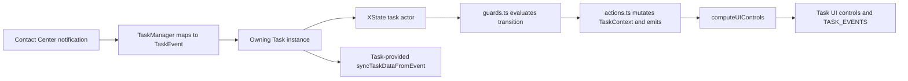
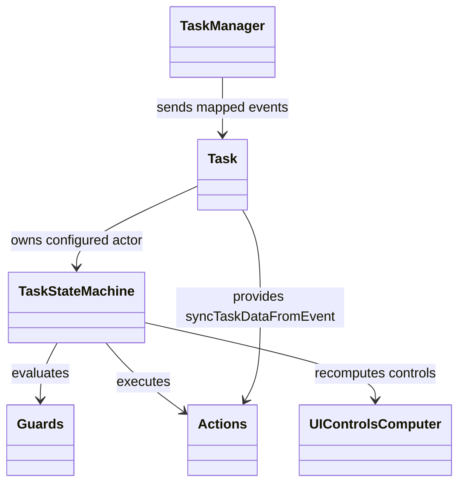
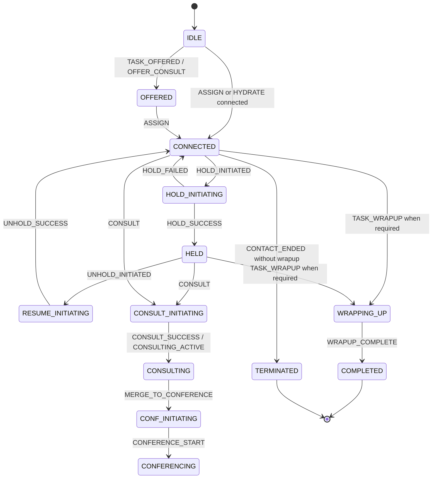
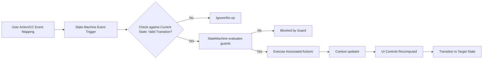
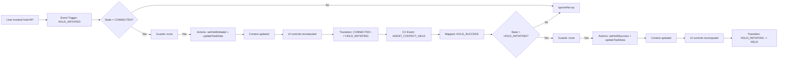
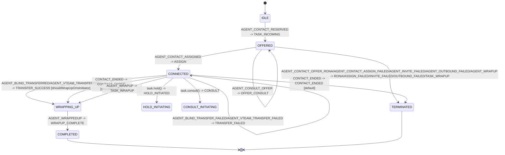
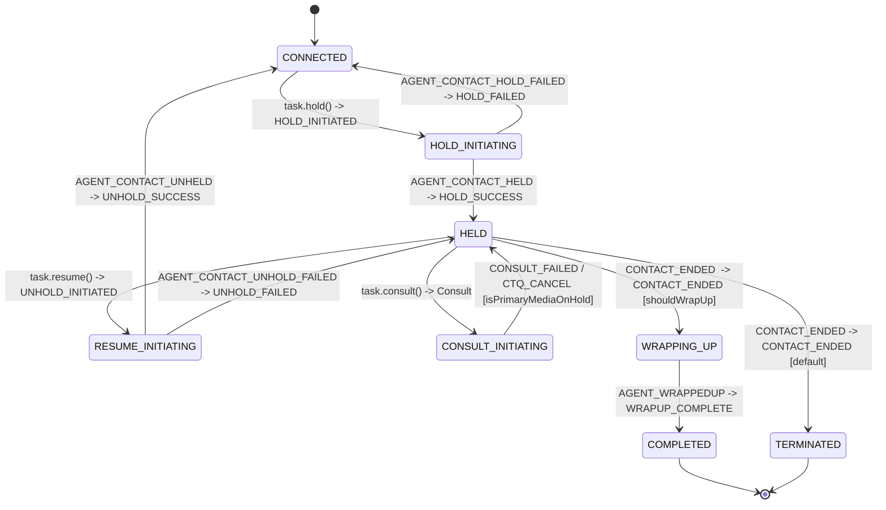
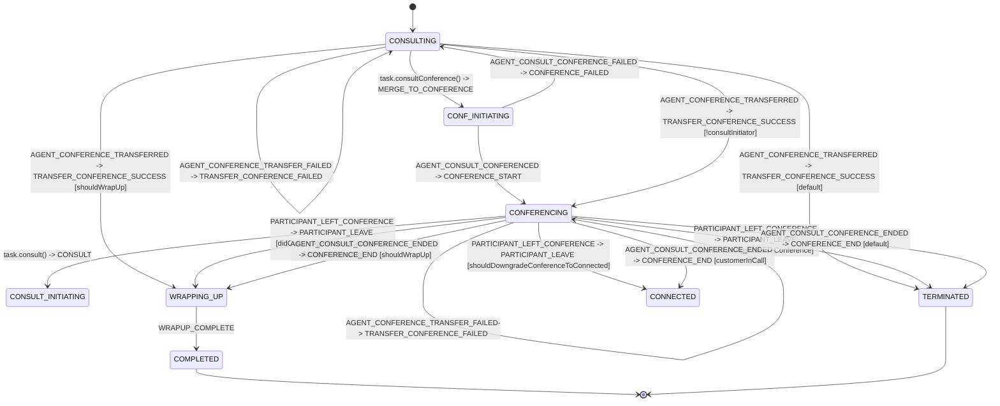

# Task State Machine — SPEC

> Start here → root [`AGENTS.md`](../../../../../AGENTS.md) · router [`SPEC_INDEX.md`](../../../../../ai-docs/SPEC_INDEX.md) · system [`ARCHITECTURE.md`](../../../../../ai-docs/ARCHITECTURE.md). This is the module's canonical specification.

## Metadata

| Field | Value |
|---|---|
| Module id | `task-state-machine` |
| Source path(s) | `src/services/task/state-machine` |
| Doc kind | Module spec |
| Coverage score | Partial (manifest-authoritative); 15/15 required document fields present |
| Generated from | `module-spec` @ SDLC template library `0.2.1` |
| generated_by / approved_by / updated_at | Codex generator / developer-approved follow-up review remediation / 2026-07-21 |
| Validation status | Follow-up validation passed (independent Claude fallback, 2026-07-21); coverage remains Partial |

## Evidence Rules
Every requirement cites stable source and test file paths. Code/tests are the behavioral referee; routed source text supplies explicit intent and rationale. Missing or contradictory evidence blocks promotion.

## Source Material Register
| Source material | Scope | Decision | Detail location or disposition |
|---|---|---|---|
| Reviewed prior module guides and architecture material | overview / architecture / API / tests | used and code-checked | Content is placed by meaning throughout this specification; exact routing remains in the manifest. |

## Overview
Task State Machine is one of nine confirmed Contact Center SDK modules. Own deterministic task lifecycle states, transition guards/actions, typed internal events, and state-derived UI-control availability. Existing reviewed documentation is migrated by meaning and code/tests remain the behavioral referee.

## Purpose / Responsibility
Own deterministic task lifecycle states, transition guards/actions, typed internal events, and state-derived UI-control availability.

## Stack
TypeScript 5.4, XState 5 actors, pure guards, assign actions, Jest 27.

## Folder / Package Structure
```text
src/services/task/state-machine/
├── TaskStateMachine.ts
├── actions.ts
├── constants.ts
├── guards.ts
├── index.ts
├── types.ts
├── uiControlsComputer.ts
```

## Key Files (source of truth)
| File | Holds |
|---|---|
| `src/services/task/state-machine/TaskStateMachine.ts` | Authoritative Task State Machine implementation or contract source. |
| `src/services/task/state-machine/constants.ts` | Authoritative Task State Machine implementation or contract source. |
| `src/services/task/state-machine/types.ts` | Authoritative Task State Machine implementation or contract source. |
| `src/services/task/state-machine/guards.ts` | Authoritative Task State Machine implementation or contract source. |
| `src/services/task/state-machine/actions.ts` | Authoritative Task State Machine implementation or contract source. |
| `src/services/task/state-machine/uiControlsComputer.ts` | Authoritative Task State Machine implementation or contract source. |

## Public Surface
| Contract | Availability | Source |
|---|---|---|
| Task state-machine factory/types | module-internal Task integration | `src/services/task/state-machine/index.ts`, `src/services/task/state-machine/TaskStateMachine.ts` |
| Guards/actions | internal state-graph implementations | `src/services/task/state-machine/guards.ts`, `src/services/task/state-machine/actions.ts` |
| `getDefaultUIControls` | exported from `uiControlsComputer.ts` and re-exported directly by package root; not exported by `state-machine/index.ts` | `src/services/task/state-machine/uiControlsComputer.ts`, `src/index.ts` |
| `computeVoiceInteractionUIControls` / `computeDigitalInteractionUIControls` | private helpers; not public APIs | `src/services/task/state-machine/uiControlsComputer.ts` |

See root `CONTRACTS.md` for the package-level state-control export.

## Requires (dependencies)
- XState
- TaskData and task-event contracts
- Task and TaskManager event/action integration

## Requirements
| ID | WHAT | WHY | Source Evidence | Test / Example Evidence | Assumptions / Gaps | Confidence |
|---|---|---|---|---|---|---|
| TASK_STATE_MACHINE-R-001 | Map typed Task events through the XState graph and preserve guards/actions for offer, assignment, consult, conference, transfer, wrapup, termination, and hydration. | A deterministic event vocabulary isolates lifecycle policy from transport payloads. | `src/services/task/state-machine/TaskStateMachine.ts` | `test/unit/spec/services/task/state-machine/TaskStateMachine.ts` | None; source and test evidence rechecked during the 2026-07-09 remediation; independent document revalidation pending. | PRESENT |
| TASK_STATE_MACHINE-R-002 | Keep `handleConferenceFailed`, `handleSwitchToMainCall`, and `handleSwitchToConsult` wired where the graph invokes them; retain `forceConsultInitiator` as defined-but-currently-unwired. | Incorrect absence/wiring claims cause maintainers to duplicate or remove real actions. | `src/services/task/state-machine/actions.ts` | `test/unit/spec/services/task/state-machine/TaskStateMachine.ts` | None; source and test evidence rechecked during the 2026-07-09 remediation; independent document revalidation pending. | PRESENT |
| TASK_STATE_MACHINE-R-003 | Treat `syncTaskDataFromEvent` as a Task-supplied machine implementation, not a default action in `actions.ts`. | The reusable graph declares the action name while Task owns integration-specific data synchronization. | `src/services/task/Task.ts` | `test/unit/spec/services/task/Task.ts` | None; source and test evidence rechecked during the 2026-07-09 remediation; independent document revalidation pending. | PRESENT |
| TASK_STATE_MACHINE-R-004 | Compute per-leg action controls and ordered `consultTransferDestinations.consult`/`.transfer` arrays through `uiControlsComputer`, preserving the public `getDefaultUIControls` shape with empty destination arrays. Voice queue rules use Consult profile enablement or Transfer direction plus `callProcessingDetails.outdialTransferToQueueEnabled`; digital supports agent/queue only; profile `NONE` removes the matching category. | Applications depend on one deterministic Task control surface, Agent Desktop order (`agent`, `queue`, `dialNumber`, `entryPoint`), and correct action/media/profile gating. | `src/services/task/state-machine/uiControlsComputer.ts` | `test/unit/spec/services/task/state-machine/uiControlsComputer.ts` | Consumers may further hide allowed categories but must not infer or enable omitted categories. | PRESENT |
| TASK_STATE_MACHINE-R-005 | Keep authentication and credentials outside the state-machine layer; it receives typed Task data/events and never invokes authenticated transport. | Pure transition logic remains reusable and cannot leak or mutate host authentication state. | `src/services/task/state-machine/TaskStateMachine.ts`, `src/services/task/state-machine/types.ts` | `test/unit/spec/services/task/state-machine/TaskStateMachine.ts` | None; security/auth applicability is explicitly N/A. | PRESENT |
| TASK_STATE_MACHINE-R-006 | Treat `UIControlConfig` values as Task-supplied capability configuration, not rollout flags evaluated or owned by the state machine. | Rollout and profile policy must be resolved before actor construction so transitions remain deterministic. | `src/services/task/state-machine/types.ts`, `src/services/task/Task.ts` | `test/unit/spec/services/task/Task.ts` | None; rollout ownership is explicit. | PRESENT |
| TASK_STATE_MACHINE-R-007 | Keep logging and metrics in Task/TaskManager integration; the state-machine implementation has no LoggerProxy or MetricsManager dependency. | Separating observability side effects from guards/actions preserves deterministic transition tests. | `src/services/task/state-machine/TaskStateMachine.ts`, `src/services/task/Task.ts` | `test/unit/spec/services/task/state-machine/TaskStateMachine.ts`, `test/unit/spec/services/task/Task.ts` | None; observability ownership is explicit. | PRESENT |

## Design Overview
TaskManager maps Contact Center notifications to `TaskEvent` values. Each Task sends those events to its XState actor built by `createTaskStateMachine()`. The configuration applies guards and named actions, updates `TaskContext`, and computes UI controls. Task supplies the integration-specific `syncTaskDataFromEvent` implementation through machine options; it is not a default action in `actions.ts`.

## Data Flow


## Sequence Diagram(s)
Sequence coverage:

| Operation group | Diagram | Failure / recovery coverage |
|---|---|---|
| Offer and assignment | `TASK_INCOMING` enters OFFERED; `TASK_OFFERED` updates that state and `ASSIGN` selects CONNECTED or CONSULTING. | RONA/invite/assign failures terminate the offered task; outbound failure may wrap up instead. |
| Hold/resume | `HOLD_INITIATED`/`UNHOLD_INITIATED` enter intermediate states; success/failure selects HELD or CONNECTED. | Failure transitions update task data and restore the stable state; Voice owns the thrown error and failure metric. |
| Consult | `CONSULT` enters `CONSULT_INITIATING`; local and backend success/failure/end events select CONSULTING, HELD, CONNECTED, CONFERENCING, WRAPPING_UP, or TERMINATED. | Consult failure/end actions update and clear consult context according to guards. |
| Conference/transfer | `MERGE_TO_CONFERENCE` and `CONFERENCE_START` use `CONF_INITIATING`/`CONFERENCING`; transfer uses the `TRANSFER_*` events. | `handleConferenceFailed` and transfer failure paths preserve or clear the relevant conference context. |
| Wrapup/termination | End/wrapup events select `WRAPPING_UP`, `COMPLETED`, or `TERMINATED`. | Terminal states are final and cannot accept normal interaction transitions. |
| Hydrate/recovery | IDLE `HYDRATE` guards restore WRAPPING_UP, CONSULTING, HELD, CONNECTED, or CONFERENCING; otherwise remain IDLE. | Root-level HYDRATE on an active task updates data without incorrectly re-entering a child state. |

### Offer and assignment

```mermaid
sequenceDiagram
  participant TM as TaskManager
  participant Task
  participant Actor as XState actor
  participant Guard as guards.ts
  participant Action as actions.ts / Task override
  TM->>Task: AgentContactReserved mapping
  Task->>Actor: send(TASK_INCOMING)
  Actor->>Action: initializeTask + emit incoming/reservation
  Actor-->>Task: OFFERED
  alt offer update then assignment
    Task->>Actor: TASK_OFFERED then ASSIGN
    Actor->>Action: update data + emit offer/assignment
    Actor-->>Task: CONNECTED or guarded CONSULTING
  else RONA/invite/assign failure
    Actor->>Action: failure cleanup/event
    Actor-->>Task: TERMINATED
  end
```

### Hold and resume

```mermaid
sequenceDiagram
  participant Task
  participant Actor as XState actor
  participant Action as actions.ts
  participant UI as uiControlsComputer
  Task->>Actor: HOLD_INITIATED or UNHOLD_INITIATED
  Actor-->>Task: HOLD_INITIATING or RESUME_INITIATING
  alt success event
    Task->>Actor: HOLD_SUCCESS or UNHOLD_SUCCESS
    Actor->>Action: update media hold state; emit task event
    Actor->>UI: compute controls for HELD/CONNECTED
    Actor-->>Task: HELD or CONNECTED
  else failure event
    Task->>Actor: HOLD_FAILED or UNHOLD_FAILED
    Actor->>Action: update task data
    Actor-->>Task: CONNECTED or HELD
  end
```

### Consult

```mermaid
sequenceDiagram
  participant Task
  participant Actor as XState actor
  participant Guard as guards.ts
  participant Action as actions.ts / Task override
  Task->>Actor: CONSULT
  Actor->>Guard: validate consult capability/state
  Actor-->>Task: CONSULT_INITIATING
  alt local request or backend consult succeeds
    Task->>Actor: CONSULT_SUCCESS / CONSULT_CREATED / CONSULTING_ACTIVE
    Actor->>Action: syncTaskDataFromEvent + consult context actions
    Actor-->>Task: CONSULTING
  else consult failed/ended/cancelled
    Task->>Actor: failure/end event
    Actor->>Action: clear/update consult context
    Actor-->>Task: HELD, CONNECTED, or termination path
  end
```

### Conference and transfer

```mermaid
sequenceDiagram
  participant Task
  participant Actor as XState actor
  participant Action as actions.ts
  Task->>Actor: MERGE_TO_CONFERENCE or TRANSFER_CONFERENCE
  Actor-->>Task: CONF_INITIATING
  alt conference/transfer succeeds
    Task->>Actor: CONFERENCE_START / TRANSFER_CONFERENCE_SUCCESS
    Actor->>Action: handleSwitchToMainCall or handleSwitchToConsult where wired
    Actor-->>Task: CONFERENCING or final transferred context
  else conference/transfer fails
    Task->>Actor: CONFERENCE_FAILED / TRANSFER_CONFERENCE_FAILED
    Actor->>Action: handleConferenceFailed / matching failure action
    Actor-->>Task: preserve correct main/consult call and stable state
  end
```

### Wrapup and termination

```mermaid
sequenceDiagram
  participant TM as TaskManager
  participant Task
  participant Actor as XState actor
  TM->>Task: end/wrapup/backend terminal event
  Task->>Actor: mapped TaskEvent
  alt wrapup required
    Actor-->>Task: WRAPPING_UP
    Task->>Actor: WRAPUP_COMPLETE
    Actor-->>Task: COMPLETED
  else contact terminated/no wrapup
    Actor-->>Task: TERMINATED or COMPLETED
  end
  Note over Actor: terminal states do not accept normal interaction transitions
```

### Hydrate and recovery

```mermaid
sequenceDiagram
  participant TM as TaskManager
  participant Task
  participant Actor as XState actor
  participant Guard as guards.ts
  participant Action as Task sync override
  TM->>Task: HYDRATE(taskData)
  Task->>Actor: send(HYDRATE)
  alt actor is IDLE
    Actor->>Guard: choose backend-represented state
    Guard-->>Actor: WRAPPING_UP/CONSULTING/HELD/CONNECTED/CONFERENCING or default IDLE
    Actor->>Action: initialize synchronized task data
  else actor already active
    Actor->>Action: syncTaskDataFromEvent
    Actor-->>Task: retain current child state with updated context
  end
```

## Class / Component Relationships


## Use Cases
- **UC-1 Offer and assignment:** map reserved/offer/assigned notifications to typed events and enter OFFERED or CONNECTED with updated task data. Evidence: `src/services/task/state-machine/TaskStateMachine.ts`, `test/unit/spec/services/task/state-machine`.
- **UC-2 Hold/resume:** represent the initiating operation separately, then settle into HELD or CONNECTED from success/failure events. Evidence: `src/services/task/state-machine/TaskStateMachine.ts`, `test/unit/spec/services/task/state-machine`.
- **UC-3 Consult:** retain main/consult context while moving through CONSULT_INITIATING and CONSULTING; use the Task-supplied synchronization action for ownership changes. Evidence: `src/services/task/Task.ts`, `test/unit/spec/services/task/Task.ts`.
- **UC-4 Conference/transfer:** execute conference and switch actions only where the graph wires them; `forceConsultInitiator` remains defined but unwired. Evidence: `src/services/task/state-machine/actions.ts`, `src/services/task/state-machine/TaskStateMachine.ts`.
- **UC-5 Wrapup/termination:** select WRAPPING_UP, COMPLETED, or TERMINATED from backend state and wrapup requirements. Evidence: `src/services/task/state-machine/TaskStateMachine.ts`, `test/unit/spec/services/task/state-machine`.
- **UC-6 Hydrate/recovery:** use IDLE HYDRATE guards to restore backend state while active-task hydration updates context without a child-state transition. Evidence: `src/services/task/state-machine/TaskStateMachine.ts`, `test/unit/spec/services/task/state-machine`.

## State Model
The actor starts at `IDLE`. Normal interaction paths cover `OFFERED`, `CONNECTED`, `HELD`, `CONSULTING`, and `CONFERENCING`, with explicit initiating states for hold, resume, consult, and conference. `WRAPPING_UP` precedes final `COMPLETED` or `TERMINATED` outcomes. Backend task data remains authoritative for HYDRATE recovery.

## Business Rules & Invariants
- Every transition event is a declared `TaskEvent`; raw Contact Center messages are mapped by TaskManager before actor delivery.
- `syncTaskDataFromEvent` is supplied by Task machine options; it must not be claimed as a default `actions.ts` implementation.
- `handleConferenceFailed`, `handleSwitchToMainCall`, and `handleSwitchToConsult` are wired actions. `forceConsultInitiator` is defined but currently unwired.
- `didInitiateConsult` is defined but currently unwired and must not be described as an active guard.
- Security/auth applicability is N/A inside the pure state-machine layer: it has no credential or transport dependency.
- `UIControlConfig` is supplied by Task as resolved capability configuration; the state machine owns no rollout/feature-flag evaluation.
- Observability is owned by Task/TaskManager; state-machine guards/actions remain free of LoggerProxy and MetricsManager dependencies.

## Concurrency & Reactive Flow
- TaskManager serially maps each backend notification to a Task event; the actor applies guards/actions synchronously for that event, while remote operation completion arrives as later mapped events.
- UI controls are recomputed from the resulting context/state and emitted only through the owning Task integration.

## State Machine


Guide AI agents working on task lifecycle transitions, guard logic, executable actions and UI control computation in the XState-based task state machine.

This guide is for internal state management for the task lifecycle in:

- State machine configuration: `TaskStateMachine.ts`

- Actions and context mutation: `actions.ts`

- Guard logic: `guards.ts`

- UI control computation: `uiControlsComputer.ts`

- Event types and payloads: `constants.ts`, `types.ts`

Use this doc when implementing:

- new state transitions

- event mapping and payload extensions

- guard/action fixes

- UI control behavior changes tied to task state

```text
state-machine/
├── TaskStateMachine.ts      # State graph and transition configuration
├── actions.ts               # Assign actions and emitter placeholders
├── guards.ts                # Pure guard predicates
├── uiControlsComputer.ts    # Voice/Digital UI control computation
├── constants.ts             # TaskState, TaskEvent, machine constants
├── types.ts                 # Context and typed event payload map
├── index.ts                 # Public exports
└── ai-docs/
    ├── AGENTS.md            # AI coding guide
    └── ARCHITECTURE.md      # State machine architecture guide
```

- **State Graph and Transition Rules**: `TaskStateMachine.ts` defines all states, transition tables, and event handlers that drive the task lifecycle.

- **Deterministic Context Updates**: `actions.ts` implements XState actions for task context mutation and provides emitter placeholders that `Task` overrides to surface SDK events.

- **Transition Eligibility**: `guards.ts` contains pure predicates that gate transitions based on current context, task data, and backend state.

- **UI Controls Computation**: `uiControlsComputer.ts` derives `TaskUIControls` from state and context for voice/digital channels, keeping UI enablement centralized.

- **Typed Event Contracts**: `constants.ts` and `types.ts` define `TaskState`, `TaskEvent`, and the `TaskEventPayloadMap` so transitions and payloads stay type-safe.

- **Public Exports**: `index.ts` exposes the state machine factory, event enums, and types for consumption by the task layer.

**Transition Source**: `getTaskStateMachineConfig()` in `TaskStateMachine.ts`

API-driven transition from `voice/Voice.ts`:

```typescript
// task.hold() / task.resume() -> holdResume()
stateMachineService.send({type: TaskEvent.HOLD_INITIATED, mediaResourceId});
// ... backend call succeeds
stateMachineService.send({type: TaskEvent.HOLD_SUCCESS, mediaResourceId});
```

Backend-driven transition from `TaskManager.ts`:

```typescript
const eventPayload = TaskManager.mapEventToTaskStateMachineEvent(
  CC_EVENTS.AGENT_CONTACT_RESERVED,
  taskData
);
if (eventPayload) {
  task.sendStateMachineEvent(eventPayload);
}
```

Backend CC events from WebSocket are mapped to `TaskEvent` in `TaskManager.mapEventToTaskStateMachineEvent`.
The state machine consumes only `TaskEvent` and never raw CC events.

Source of truth: `TaskEventPayloadMap` in `types.ts`.
All new events must add a typed payload entry in `TaskEventPayloadMap`.

- API contracts for external services.

- Mercury or CC WebSocket protocols (see `TaskManager.ts` mapping).

Guards are boolean conditions that determine determine if a state transition is allowed. These functions validate the current context before allowing transitions.

- Guards must be pure and must return boolean only

- No mutation or side-effects.

- Reuse helper accessors (e.g., `getTaskDataFromEvent`).

```typescript
// Check if interaction is in terminated state
isInteractionTerminated(context, event) {
  return event.taskData?.interaction?.isTerminated === true;
}

// Check if interaction is consulting
isInteractionConsulting(context, event) {
  return event.taskData?.interaction?.state === 'consulting';
}

// Check if interaction is held
isInteractionHeld(context, event) {
  return event.taskData?.interaction?.state === 'hold';
}

// Check if interaction is connected
isInteractionConnected(context, event) {
  return event.taskData?.interaction?.state === 'connected';
}
```

```typescript
// Check if current agent initiated consult
didInitiateConsult(context, event) {
  if (event.taskData?.isConsulted === true) return false;
  return event.taskData?.consultingAgentId
    ? isSelfConsultingAgent(context, event.taskData)
    : context.consultInitiator === true;
}
```

```typescript
// Check if conference is in progress from event taskData
conferenceInProgressFromEvent(context, event) {
  const taskData = event.taskData;
  if (!taskData?.interaction) return false;
  return getIsConferenceInProgress(taskData);
}

// Check if conference is in progress by participants
isConferencingByParticipants(context, event) {
  const taskData = event.taskData;
  if (!taskData) return false;

  const mainCallId = taskData.interaction?.mainInteractionId || taskData.interactionId;
  const media = taskData.interaction?.media?.[mainCallId];
  const participants = taskData.interaction?.participants;
  if (!media?.participants || !participants) return false;

  let agentCount = 0;
  for (const pId of media.participants) {
    const p = participants[pId];
    if (p && p.pType !== 'Customer' && p.pType !== 'Supervisor' && !p.hasLeft) {
      agentCount += 1;
    }
  }

  return agentCount >= 2;
}

// Check if conference should downgrade to connected
shouldDowngradeConferenceToConnected(context, event) {
  const taskData = event.taskData ?? context.taskData;
  if (!taskData?.interaction) return false;

  const selfAgentId = getSelfAgentId(context, taskData);
  if (!selfAgentId) return false;

  const mainCallId = taskData?.interaction?.mainInteractionId || taskData?.interactionId;
  if (!mainCallId) return false;

  // Do not downgrade while backend still reports active conference state
  if (taskData.interaction.state === 'conference') return false;

  const agentParticipantsCount = getConferenceParticipantsCount(taskData?.interaction, mainCallId);
  if (agentParticipantsCount >= 2) return false;

  const customerInCall = getIsCustomerInCall(taskData?.interaction, mainCallId);
  if (!customerInCall) return false;

  const selfInMainCall = Boolean(
    taskData?.interaction?.media?.[mainCallId]?.participants?.includes(selfAgentId)
  );
  return selfInMainCall;
}
```

```typescript
// Check if this agent should move to wrapup
shouldWrapUp(context, event) {
  const taskData = event.taskData;
  if (!taskData) return false;

  if (event.type === TaskEvent.CONFERENCE_END) {
    const selfAgentId = getSelfAgentId(context, taskData);
    if (!selfAgentId) return false;

    const pending = taskData.agentsPendingWrapUp;
    if (Array.isArray(pending) && pending.length > 0) {
      return pending.includes(selfAgentId);
    }

    const participantWrapUp = taskData.interaction?.participants?.[selfAgentId]?.isWrapUp === true;
    const wrapUpRequired = taskData.wrapUpRequired === true;
    return wrapUpRequired || participantWrapUp;
  }

  return shouldWrapUpForThisAgent(context, taskData);
}

// Check if wrapup is required OR current agent is consult initiator
shouldWrapUpOrIsInitiator(context, event) {
  return Boolean(event.taskData?.wrapUpRequired || context.consultInitiator);
}

// Check whether the leaving participant is the current agent
didCurrentAgentLeaveConference(context, event) {
  const selfAgentId = getSelfAgentId(context, event.taskData);
  if (!selfAgentId) return false;

  const participantIdFromEvent = 'participantId' in event ? event.participantId : undefined;
  const participantId = participantIdFromEvent ?? event.taskData?.participantId;
  return Boolean(participantId) && participantId === selfAgentId;
}

// True when this agent initiated the conference transfer (widgets or desktop).
// Mirrors determineConsultInitiator — consultingAgentId === self only (not consultState).
isSelfConferenceTransferInitiator(context, event) {
  if (context.transferConferenceRequested === true) return true;
  if (context.consultInitiator === true) return true;

  const taskData = event.taskData;
  const selfAgentId = getSelfAgentId(context, taskData);
  if (!selfAgentId || !taskData) return false;

  return taskData.consultingAgentId === selfAgentId;
}

// Passive observer: another agent transferred; refresh data only.
isPassiveConferenceTransferObserver(context, event) {
  if (isSelfConferenceTransferInitiator(context, event)) return false;

  const taskData = event.taskData;
  const selfAgentId = getSelfAgentId(context, taskData);
  if (selfAgentId && taskData?.interaction?.participants) {
    if (!(selfAgentId in taskData.interaction.participants)) return false;
    if (taskData.interaction.participants[selfAgentId]?.hasLeft === true) return false;
  }
  return true;
}
```

```typescript
// Check if primary media leg is on hold
isPrimaryMediaOnHold(context, event) {
  const taskData = event.taskData;
  if (!taskData || !taskData.mediaResourceId) return false;

  return taskData.interaction?.media?.[taskData.mediaResourceId]?.isHold === true;
}
```

Actions are side effects executed during state machine transitions from current state to target state(next state).
Actions contain:

- Context synchronization (`initializeTask`, `updateTaskData`, `syncTaskDataFromEvent`)

- Lifecycle mutations (`clearConsultState`, `markEnded`, consult/conference flags)

- Integration hooks (`requestAutoAnswer`, `requestCleanup`, emitter placeholders)

- Context mutations should be centralized in `assign(...)` actions

- Emitter actions intentionally no-op defaults and overridden by `Task` to bridge machine transitions to SDK events.

- Deterministic updates from `taskData`.

```typescript
// Initialize context for incoming task
initializeTask(context, event) {
  return {
    consultInitiator: false,
    exitingConference: false,
    consultDestinationType: null,
    consultDestinationAgentJoined: false,
    ...deriveTaskDataUpdates(context, event.taskData),
  };
}

// Update taskData + derived recording/consult fields
updateTaskData(context, event) {
  return deriveTaskDataUpdates(context, event.taskData);
}

// Keep Task instance data in sync (Task.ts action override)
syncTaskDataFromEvent(event) {
  this.updateTaskFromEvent(event);
}

// Update hold flag on specific media leg in context.taskData.interaction.media
setHoldState(context, event) {
  // Handles HOLD_SUCCESS and UNHOLD_SUCCESS for event.mediaResourceId
}

// Conference/consult lifecycle mutators
handleConferenceStarted() { return {consultInitiator: false}; }
handleConsultFailed() { return {consultDestinationAgentJoined: false, consultInitiator: false}; }
handleParticipantLeft(event) { return event.taskData ? {taskData: event.taskData} : {}; }
handleTransferConferenceSuccess(event) { return event.taskData ? {taskData: event.taskData} : {}; }

// Consult destination and mode flags
setConsultDestination(event) { /* sets consultDestinationType and resets consult flags */ }
setConsultFromConference() { return {consultFromConference: true}; }
setConsultAgentJoined(event) { /* sets consultDestinationAgentJoined on CONSULTING_ACTIVE */ }
setExitingConference() { return {exitingConference: true}; }

// Conference transfer flags
setTransferConferenceRequested() { return {transferConferenceRequested: true}; }
clearTransferConferenceRequested() { return {transferConferenceRequested: false}; }

// Consult call hold flags
setConsultCallHeld() { return {consultCallHeld: true}; }
clearConsultCallHeld() { return {consultCallHeld: false}; }

// Recording state mutator for pause/resume events
setRecordingState(event) {
  // PAUSE_RECORDING => recordingInProgress false
  // RESUME_RECORDING => recordingInProgress true
}

// Reset consult/conference-related context
clearConsultState() {
  return {
    consultDestinationType: null,
    consultDestinationAgentJoined: false,
    consultInitiator: false,
    exitingConference: false,
    consultCallHeld: false,
    consultFromConference: false,
    transferConferenceRequested: false,
  };
}

// End-of-task cleanup for recording flags
markEnded() {
  return {recordingControlsAvailable: false, recordingInProgress: false};
}
```

> `handleConferenceFailed`, `handleSwitchToMainCall`, and `handleSwitchToConsult` are defined in `actions.ts` and wired by `TaskStateMachine.ts`. `forceConsultInitiator` is defined in `actions.ts` but is not wired in the current graph.

```typescript
// Emit task incoming
emitTaskIncoming(context, event) {
  task.emit(TASK_EVENTS.TASK_INCOMING, task);
}

// Emit task assigned
emitTaskAssigned(context, event) {
  task.emit(TASK_EVENTS.TASK_ASSIGNED, task);
}

// Emit task hold
emitTaskHold(context, event) {
  task.emit(TASK_EVENTS.TASK_HOLD, task);
}

// Emit task wrapup
emitTaskWrapup(context, event) {
  if (context.taskData.wrapUpRequired) {
    task.emit(TASK_EVENTS.TASK_WRAPUP, task);
  }
}

// ... more emission actions for each event type
```

```typescript
// NOTE: These are no-op placeholders in actions.ts and are overridden in Task.ts.

// Request cleanup (remove from collection, keep task object)
requestCleanup(context, event) {
  task.emit(TASK_EVENTS.TASK_CLEANUP, task, {removeFromCollection: false});
}

// Cleanup resources (remove from collection)
cleanupResources(context, event) {
  task.emit(TASK_EVENTS.TASK_CLEANUP, task, {removeFromCollection: true});
}
```

```typescript
// NOTE: requestAutoAnswer is a placeholder in actions.ts and is overridden in Task.ts.

// Request auto-answer
requestAutoAnswer(context, event) {
  if (event.taskData?.isAutoAnswering) {
    // Trigger accept() method
    autoAnswerIfNeeded();
  }
}
```

`uiControlsComputer.ts` computes `TaskUIControls` from:

- current machine state

- current context

- channel type (voice vs digital)

- call/participant metadata from `taskData`

- config flags (`isEndTaskEnabled`, recording toggles, voice variant)

This keeps all control enablement/visibility logic centralized and testable.

- `TaskState`

- `TaskContext` (including `taskData`)

- `UIControlConfig` (channel type, agentId, voice variant, recording flags)

- `TaskUIControls` with per-control visibility and enabled state.

1. Add event in `TaskEvent` (`constants.ts`)

2. Add typed payload in `TaskEventPayloadMap` (`types.ts`)

3. Wire transitions in `TaskStateMachine.ts`

4. Add/adjust actions in `actions.ts`

5. Add guard(s) in `guards.ts` if needed

6. Update `TaskManager` event mapping and unit tests

1. Implement pure guard in `guards.ts`

2. Use guard in `TaskStateMachine.ts` transition array

3. Keep side-effects in actions only (no side-effects in guards)

4. Add tests for positive and negative transition paths

1. Update control logic in `computeVoiceInteractionUIControls()` or `computeDigitalInteractionUIControls()`

2. Preserve `getDefaultUIControls()` shape compatibility

3. Verify behavior across `CONNECTED`, `HELD`, `CONSULTING`, `CONFERENCING`, `WRAPPING_UP`

4. Add or update UI-control unit coverage

Technical reference for the complete state machine using XState to drive state transitions and UI control behavior. It orchestrates state transitions, guards, and actions for task lifecycle management.

The task state machine is built with `xstate` and organized into:

- **State graph** (`TaskStateMachine.ts`)

- **Context mutators** (`actions.ts`)

- **Guard predicates** (`guards.ts`)

- **UI control derivation** (`uiControlsComputer.ts`)

- **Event/context contracts** (`types.ts`)

It is instantiated by `Task` and receives mapped backend/user events through `sendStateMachineEvent(...)`.

`Task` bootstraps and owns the actor lifecycle:

1. `createTaskStateMachine(uiControlConfig, {actions: overrides})`

2. `createActor(machine).start()`

3. `TaskManager` and task APIs map external signals to `TaskEvent`

4. Actor transitions update context and execute action overrides

5. `Task` recomputes UI controls and emits task-level events

**Description**: Initial state before a task is offered or restored.

**How this state is reached (incoming transitions)**:

- Machine start -> `IDLE` (no event, no actions)

**Valid transitions from `IDLE` state**:

- `TASK_INCOMING` -> `OFFERED`

- Guard: none

- Actions: `initializeTask`, `emitTaskIncoming`

- `HYDRATE` -> `WRAPPING_UP`

- Guard: `guards.isInteractionTerminated`

- Actions: `updateTaskData`, `markEnded`, `emitTaskHydrate`

- `HYDRATE` -> `CONSULTING`

- Guard: `guards.isInteractionConsulting`

- Actions: `updateTaskData`, `emitTaskHydrate`

- `HYDRATE` -> `HELD`

- Guard: `guards.isInteractionHeld`

- Actions: `updateTaskData`, `emitTaskHydrate`

- `HYDRATE` -> `CONNECTED`

- Guard: `guards.isInteractionConnected`

- Actions: `updateTaskData`, `emitTaskHydrate`

- `HYDRATE` -> `CONFERENCING`

- Guard: `guards.isConferencingByParticipants`

- Actions: `updateTaskData`, `emitTaskHydrate`

- `HYDRATE` -> stay `IDLE` (default hydrate branch)

- Guard: default

- Actions: `updateTaskData`, `emitTaskHydrate`

**Description**: Task has been offered/reserved and is waiting for assignment or termination paths.

**How this state is reached (incoming transitions)**:

- `IDLE --TASK_INCOMING--> OFFERED`

- Guard: none

- Actions: `initializeTask`, `emitTaskIncoming`

**Valid transitions from `OFFERED`**:

- `TASK_OFFERED` -> Stay `OFFERED`

- Guard: none

- Actions: `updateTaskData`, `emitTaskOfferContact`, `requestAutoAnswer`

- `OFFER_CONSULT` -> Stay `OFFERED`

- Guard: none

- Actions: `updateTaskData`, `emitTaskOfferConsult`, `requestAutoAnswer`

- `ASSIGN` -> `CONNECTED`

- Guard: none

- Actions: `updateTaskData`, `emitTaskAssigned`

- `CONSULTING_ACTIVE` -> `CONSULTING`

- Guard: none

- Actions: `updateTaskData`, `setConsultAgentJoined`, `emitTaskConsultAccepted`, `emitTaskConsulting`

- `TASK_WRAPUP` -> `TERMINATED`

- Guard: none

- Actions: `updateTaskData`, `markEnded`, `emitTaskEnd`

- `RONA` / `ASSIGN_FAILED` / `INVITE_FAILED` / `OUTBOUND_FAILED` -> `TERMINATED`

- Guard: none

- Actions: `updateTaskData`, `markEnded`, `emitTaskReject`

**Description**: Agent is connected on the main customer interaction leg.

**How this state is reached (incoming transitions)**:

- `OFFERED --ASSIGN--> CONNECTED`

- Guard: none

- Actions: `updateTaskData`, `emitTaskAssigned`

- `IDLE --HYDRATE--> CONNECTED`

- Guard: `guards.isInteractionConnected`

- Actions: `updateTaskData`, `emitTaskHydrate`

- `RESUME_INITIATING --UNHOLD_SUCCESS--> CONNECTED`

- Guard: none

- Actions: `updateTaskData`, `setHoldState`, `emitTaskResume`

- `HELD --TRANSFER_SUCCESS--> CONNECTED` (receiver/default branch)

- Guard: default branch when `guards.shouldWrapUpOrIsInitiator` is false

- Actions: `updateTaskData`, `clearConsultState`

- `CONSULTING --ASSIGN--> CONNECTED`

- Guard: none

- Actions: `updateTaskData`, `emitTaskAssigned`

**Valid transitions from `CONNECTED`**:

- `ASSIGN` -> `CONNECTED` (self-transition)

- Guard: none

- Actions: `updateTaskData`, `emitTaskAssigned`

- `HOLD_INITIATED` -> `HOLD_INITIATING`

- Guard: none

- Actions: none

- `CONSULT` -> `CONSULT_INITIATING`

- Guard: none

- Actions: `setConsultInitiator`, `setConsultDestination`

- `CONSULTING_ACTIVE` -> `CONSULTING`

- Guard: none

- Actions: `updateTaskData`, `setConsultAgentJoined`, `emitTaskConsultAccepted`, `emitTaskConsulting`

- `TRANSFER_SUCCESS` -> `WRAPPING_UP`

- Guard: `guards.shouldWrapUpOrIsInitiator`

- Actions: `updateTaskData`, `markEnded`, `emitTaskWrapup`

- `TRANSFER_SUCCESS` -> Stay `CONNECTED` (receiver/default branch)

- Guard: default

- Actions: `updateTaskData`, `clearConsultState`

- `TRANSFER_FAILED` -> Stay `CONNECTED`

- Guard: none

- Actions: `updateTaskData`

- `CONTACT_ENDED` -> `CONFERENCING`

- Guard: `guards.conferenceInProgressFromEvent`

- Actions: `updateTaskData`, `emitTaskConferenceStarted`, `requestCleanup`

- `CONTACT_ENDED` -> `WRAPPING_UP`

- Guard: `guards.shouldWrapUp`

- Actions: `updateTaskData`, `markEnded`, `emitTaskWrapup`, `requestCleanup`

- `CONTACT_ENDED` -> `TERMINATED` (default branch)

- Guard: default

- Actions: `updateTaskData`, `markEnded`, `emitTaskEnd`

- `TASK_WRAPUP` -> `WRAPPING_UP`

- Guard: none

- Actions: `updateTaskData`, `markEnded`, `emitTaskWrapup`

- `PAUSE_RECORDING` / `RESUME_RECORDING` -> Stay `CONNECTED`

- Guard: none

- Actions: `updateTaskData`, `setRecordingState`, `emitTaskRecordingPaused` / `emitTaskRecordingResumed`

**Description**: Main call is on hold.

**How this state is reached (incoming transitions)**:

- `IDLE --HYDRATE--> HELD`

- Guard: `guards.isInteractionHeld`

- Actions: `updateTaskData`, `emitTaskHydrate`

- `HOLD_INITIATING --HOLD_SUCCESS--> HELD`

- Guard: none

- Actions: `updateTaskData`, `setHoldState`, `emitTaskHold`

- `RESUME_INITIATING --UNHOLD_FAILED--> HELD`

- Guard: none

- Actions: none

- `CONSULTING --CONSULT_END--> HELD`

- Guard: inline `context.consultInitiator === true`

- Actions: `updateTaskData`, `clearConsultState`, `emitTaskConsultEnd`

- `CONSULT_INITIATING --CONSULT_FAILED--> HELD`

- Guard: `guards.isPrimaryMediaOnHold`

- Actions: `updateTaskData`, `handleConsultFailed`

- `CONSULT_INITIATING --CTQ_CANCEL--> HELD`

- Guard: `guards.isPrimaryMediaOnHold`

- Actions: `updateTaskData`, `clearConsultState`

**Valid transitions from `HELD`**:

- `UNHOLD_INITIATED` -> `RESUME_INITIATING`

- Guard: none

- Actions: none

- `CONSULT` -> `CONSULT_INITIATING`

- Guard: none

- Actions: `setConsultInitiator`, `setConsultDestination`

- `TRANSFER_SUCCESS` -> `WRAPPING_UP`

- Guard: `guards.shouldWrapUpOrIsInitiator`

- Actions: `updateTaskData`, `markEnded`, `emitTaskWrapup`

- `TRANSFER_SUCCESS` -> `CONNECTED` (receiver/default branch)

- Guard: default

- Actions: `updateTaskData`, `clearConsultState`

- `TRANSFER_FAILED` -> stay `HELD`

- Guard: none

- Actions: `updateTaskData`

- `CONTACT_ENDED` -> `CONFERENCING`

- Guard: `guards.conferenceInProgressFromEvent`

- Actions: `updateTaskData`, `emitTaskConferenceStarted`, `requestCleanup`

- `CONTACT_ENDED` -> `WRAPPING_UP`

- Guard: `guards.shouldWrapUp`

- Actions: `updateTaskData`, `markEnded`, `emitTaskWrapup`, `requestCleanup`

- `CONTACT_ENDED` -> `TERMINATED` (default branch)

- Guard: default

- Actions: `updateTaskData`, `markEnded`, `emitTaskEnd`

- `TASK_WRAPUP` -> `WRAPPING_UP`

- Guard: none

- Actions: `updateTaskData`, `markEnded`, `emitTaskWrapup`

**Description**: Hold request has been sent and is awaiting backend confirmation.

**How this state is reached (incoming transitions)**:

- `CONNECTED --HOLD_INITIATED--> HOLD_INITIATING`

- Guard: none

- Actions: none

**Valid transitions from `HOLD_INITIATING`**:

- `HOLD_SUCCESS` -> `HELD`

- Guard: none

- Actions: `updateTaskData`, `setHoldState`, `emitTaskHold`

- `HOLD_FAILED` -> `CONNECTED`

- Guard: none

- Actions: `updateTaskData`

**Description**: Resume/unhold request has been sent and is awaiting backend confirmation.

**How this state is reached (incoming transitions)**:

- `HELD --UNHOLD_INITIATED--> RESUME_INITIATING`

- Guard: none

- Actions: none

**Valid transitions from `RESUME_INITIATING`**:

- `UNHOLD_SUCCESS` -> `CONNECTED`

- Guard: none

- Actions: `updateTaskData`, `setHoldState`, `emitTaskResume`

- `UNHOLD_FAILED` -> `HELD`

- Guard: none

- Actions: none

**Description**: Consult request is in-flight.

**How this state is reached (incoming transitions)**:

- `CONNECTED --CONSULT--> CONSULT_INITIATING`

- Guard: none

- Actions: `setConsultInitiator`, `setConsultDestination`

- `HELD --CONSULT--> CONSULT_INITIATING`

- Guard: none

- Actions: `setConsultInitiator`, `setConsultDestination`

- `CONFERENCING --CONSULT--> CONSULT_INITIATING`

- Guard: none

- Actions: `setConsultInitiator`, `setConsultDestination`, `setConsultFromConference`

**Valid transitions from `CONSULT_INITIATING`**:

- `CONSULT_SUCCESS` -> `CONSULTING`

- Guard: none

- Actions: `updateTaskData`, `setConsultInitiator`

- `CONSULT_FAILED` -> `CONFERENCING`

- Guard: inline `context.consultFromConference === true`

- Actions: `updateTaskData`, `handleConsultFailed`

- `CONSULT_FAILED` -> `HELD`

- Guard: `guards.isPrimaryMediaOnHold`

- Actions: `updateTaskData`, `handleConsultFailed`

- `CONSULT_FAILED` -> `CONNECTED` (default branch)

- Guard: default

- Actions: `updateTaskData`, `handleConsultFailed`

- `CTQ_CANCEL` -> `HELD`

- Guard: `guards.isPrimaryMediaOnHold`

- Actions: `updateTaskData`, `clearConsultState`

- `CTQ_CANCEL` -> `CONNECTED` (default branch)

- Guard: default

- Actions: `updateTaskData`, `clearConsultState`

- `HOLD_SUCCESS` -> stay `CONSULT_INITIATING`

- Guard: none

- Actions: `updateTaskData`

- `HOLD_FAILED` -> `CONNECTED`

- Guard: none

- Actions: `updateTaskData`, `handleConsultFailed`

**Description**: Agent is in active consult leg.

**How this state is reached (incoming transitions)**:

- `IDLE --HYDRATE--> CONSULTING`

- Guard: `guards.isInteractionConsulting`

- Actions: `updateTaskData`, `emitTaskHydrate`

- `OFFERED --CONSULTING_ACTIVE--> CONSULTING`

- Guard: none

- Actions: `updateTaskData`, `setConsultAgentJoined`, `emitTaskConsultAccepted`, `emitTaskConsulting`

- `CONSULT_INITIATING --CONSULT_SUCCESS--> CONSULTING`

- Guard: none

- Actions: `updateTaskData`, `setConsultInitiator`

- `CONF_INITIATING --CONFERENCE_FAILED--> CONSULTING`

- Guard: none

- Actions: none

**Valid transitions from `CONSULTING`**:

- `CONSULTING_ACTIVE` -> stay `CONSULTING`

- Guard: none

- Actions: `updateTaskData`, `setConsultAgentJoined`, `emitTaskConsulting`

- `CONSULT_END` -> `CONFERENCING`

- Guard: inline `context.consultInitiator === true && context.consultFromConference === true`

- Actions: `updateTaskData`, `clearConsultState`, `emitTaskConsultEnd`

- `CONSULT_END` -> `HELD`

- Guard: inline `context.consultInitiator === true`

- Actions: `updateTaskData`, `clearConsultState`, `emitTaskConsultEnd`

- `CONSULT_END` -> `TERMINATED` (default branch)

- Guard: default

- Actions: `updateTaskData`

- `HOLD_SUCCESS` -> stay `CONSULTING`

- Guard: none

- Actions: `updateTaskData`, `setHoldState`, `setConsultCallHeld`

- `UNHOLD_SUCCESS` -> stay `CONSULTING`

- Guard: none

- Actions: `updateTaskData`, `setHoldState`, `clearConsultCallHeld`

- `TRANSFER_SUCCESS` -> `WRAPPING_UP`

- Guard: `guards.shouldWrapUpOrIsInitiator`

- Actions: `updateTaskData`, `markEnded`, `emitTaskWrapup`

- `TRANSFER_SUCCESS` -> `CONNECTED` (receiver/default branch)

- Guard: default

- Actions: `updateTaskData`, `clearConsultState`

- `TRANSFER_FAILED` -> stay `CONSULTING`

- Guard: none

- Actions: `updateTaskData`

- `TRANSFER_CONFERENCE` -> stay `CONSULTING`

- Guard: none

- Actions: `setTransferConferenceRequested`, `emitTaskTransferConference`

- `TRANSFER_CONFERENCE_SUCCESS` -> `WRAPPING_UP`

- Guard: `guards.shouldWrapUp`

- Actions: `updateTaskData`, `markEnded`, `clearConsultState`, `handleTransferConferenceSuccess`, `clearTransferConferenceRequested`, `emitTaskWrapup`

- `TRANSFER_CONFERENCE_SUCCESS` -> `CONFERENCING`

- Guard: `!guards.isSelfConferenceTransferInitiator`

- Actions: `updateTaskData`, `clearConsultState`, `handleTransferConferenceSuccess`, `clearTransferConferenceRequested`

- `TRANSFER_CONFERENCE_SUCCESS` -> `TERMINATED` (default branch)

- Guard: default

- Actions: `updateTaskData`, `markEnded`, `clearConsultState`, `handleTransferConferenceSuccess`, `clearTransferConferenceRequested`, `emitTaskEnd`

- `TRANSFER_CONFERENCE_FAILED` -> stay `CONSULTING`

- Guard: none

- Actions: `clearTransferConferenceRequested`

- `PARTICIPANT_LEAVE` -> `WRAPPING_UP`

- Guard: `guards.didCurrentAgentLeaveConference && guards.shouldWrapUp`

- Actions: `updateTaskData`, `handleParticipantLeft`, `markEnded`, `clearConsultState`, `emitTaskParticipantLeft`, `emitTaskWrapup`

- `PARTICIPANT_LEAVE` -> `TERMINATED`

- Guard: `guards.didCurrentAgentLeaveConference`

- Actions: `updateTaskData`, `handleParticipantLeft`, `markEnded`, `clearConsultState`, `emitTaskParticipantLeft`, `emitTaskEnd`

- `PARTICIPANT_LEAVE` -> `CONNECTED`

- Guard: `!guards.didCurrentAgentLeaveConference && guards.shouldDowngradeConferenceToConnected`

- Actions: `updateTaskData`, `handleParticipantLeft`, `clearConsultState`, `emitTaskParticipantLeft`, `emitTaskConferenceEnded`

- `PARTICIPANT_LEAVE` -> stay `CONSULTING` (default)

- Guard: default

- Actions: `updateTaskData`, `handleParticipantLeft`, `emitTaskParticipantLeft`

- `ASSIGN` -> `CONNECTED`

- Guard: none

- Actions: `updateTaskData`, `emitTaskAssigned`

- `CONTACT_ENDED` -> `WRAPPING_UP`

- Guard: none

- Actions: `updateTaskData`, `markEnded`, `clearConsultState`, `emitTaskWrapup`, `requestCleanup`

- `TASK_WRAPUP` -> `WRAPPING_UP`

- Guard: none

- Actions: `updateTaskData`, `markEnded`, `clearConsultState`, `emitTaskWrapup`

- `MERGE_TO_CONFERENCE` -> `CONF_INITIATING`

- Guard: none

- Actions: none

- `CONFERENCE_START` -> `CONFERENCING`

- Guard: none

- Actions: `handleConferenceStarted`, `clearConsultState`

**Description**: Conference merge is being established.

**How this state is reached (incoming transitions)**:

- `CONSULTING --MERGE_TO_CONFERENCE--> CONF_INITIATING`

- Guard: none

- Actions: none

**Valid transitions from `CONF_INITIATING`**:

- `CONFERENCE_START` -> `CONFERENCING`

- Guard: none

- Actions: `handleConferenceStarted`

- `CONFERENCE_FAILED` -> `CONSULTING`

- Guard: none

- Actions: none

**Description**: Active conference call state.

**How this state is reached (incoming transitions)**:

- `IDLE --HYDRATE--> CONFERENCING`

- Guard: `guards.isConferencingByParticipants`

- Actions: `updateTaskData`, `emitTaskHydrate`

- `CONNECTED --CONTACT_ENDED--> CONFERENCING`

- Guard: `guards.conferenceInProgressFromEvent`

- Actions: `updateTaskData`, `emitTaskConferenceStarted`, `requestCleanup`

- `HELD --CONTACT_ENDED--> CONFERENCING`

- Guard: `guards.conferenceInProgressFromEvent`

- Actions: `updateTaskData`, `emitTaskConferenceStarted`, `requestCleanup`

- `CONSULTING --CONFERENCE_START--> CONFERENCING`

- Guard: none

- Actions: `handleConferenceStarted`, `clearConsultState`

- `CONF_INITIATING --CONFERENCE_START--> CONFERENCING`

- Guard: none

- Actions: `handleConferenceStarted`

- `CONSULTING --TRANSFER_CONFERENCE_SUCCESS--> CONFERENCING`

- Guard: `!guards.isSelfConferenceTransferInitiator`

- Actions: `updateTaskData`, `clearConsultState`, `handleTransferConferenceSuccess`, `clearTransferConferenceRequested`

**Valid transitions from `CONFERENCING`**:

- `CONSULT` -> `CONSULT_INITIATING`

- Guard: none

- Actions: `setConsultInitiator`, `setConsultDestination`, `setConsultFromConference`

- `CONFERENCE_START` -> stay `CONFERENCING`

- Guard: none

- Actions: `updateTaskData`, `clearConsultState`, `emitTaskConferenceStarted`

- `CONSULT_END` -> stay `CONFERENCING`

- Guard: none

- Actions: `updateTaskData`, `clearConsultState`

- `HOLD_SUCCESS` / `UNHOLD_SUCCESS` -> stay `CONFERENCING`

- Guard: none

- Actions: `updateTaskData`, `setHoldState`, `emitTaskHold` / `emitTaskResume`

- `TRANSFER_CONFERENCE` -> stay `CONFERENCING`

- Guard: none

- Actions: `setTransferConferenceRequested`, `emitTaskTransferConference`

- `TRANSFER_CONFERENCE_SUCCESS` -> stay `CONFERENCING`

- Guard: `guards.isPassiveConferenceTransferObserver`

- Actions: `updateTaskData`, `handleTransferConferenceSuccess`, `clearTransferConferenceRequested`

- `TRANSFER_CONFERENCE_SUCCESS` -> `WRAPPING_UP`

- Guard: `guards.shouldWrapUp`

- Actions: `updateTaskData`, `markEnded`, `clearConsultState`, `handleTransferConferenceSuccess`, `clearTransferConferenceRequested`, `emitTaskWrapup`

- `TRANSFER_CONFERENCE_SUCCESS` -> `CONFERENCING`

- Guard: `!guards.isSelfConferenceTransferInitiator`

- Actions: `updateTaskData`, `clearConsultState`, `handleTransferConferenceSuccess`, `clearTransferConferenceRequested`

- `TRANSFER_CONFERENCE_SUCCESS` -> `TERMINATED` (default branch)

- Guard: default

- Actions: `updateTaskData`, `markEnded`, `clearConsultState`, `handleTransferConferenceSuccess`, `clearTransferConferenceRequested`, `emitTaskEnd`

- `TRANSFER_CONFERENCE_FAILED` -> stay `CONFERENCING`

- Guard: none

- Actions: `clearTransferConferenceRequested`

- `PARTICIPANT_LEAVE` -> `WRAPPING_UP`

- Guard: `guards.didCurrentAgentLeaveConference && guards.shouldWrapUp`

- Actions: `updateTaskData`, `handleParticipantLeft`, `markEnded`, `clearConsultState`, `emitTaskParticipantLeft`, `emitTaskWrapup`

- `PARTICIPANT_LEAVE` -> `TERMINATED`

- Guard: `guards.didCurrentAgentLeaveConference`

- Actions: `updateTaskData`, `handleParticipantLeft`, `markEnded`, `clearConsultState`, `emitTaskParticipantLeft`, `emitTaskEnd`

- `PARTICIPANT_LEAVE` -> `CONNECTED`

- Guard: `guards.shouldDowngradeConferenceToConnected`

- Actions: `updateTaskData`, `handleParticipantLeft`, `clearConsultState`, `emitTaskParticipantLeft`, `emitTaskConferenceEnded`

- `PARTICIPANT_LEAVE` -> stay `CONFERENCING` (default)

- Guard: default

- Actions: `updateTaskData`, `handleParticipantLeft`, `emitTaskParticipantLeft`

- `CONFERENCE_END` -> `WRAPPING_UP`

- Guard: `guards.shouldWrapUp`

- Actions: `updateTaskData`, `markEnded`, `clearConsultState`, `emitTaskWrapup`

- `CONFERENCE_END` -> `CONNECTED`

- Guard: inline `!context.exitingConference && customerInCall`

- Actions: `updateTaskData`, `clearConsultState`, `emitTaskConferenceEnded`

- `CONFERENCE_END` -> `TERMINATED` (default branch)

- Guard: default

- Actions: `updateTaskData`, `markEnded`, `clearConsultState`, `emitTaskEnd`

- `CONTACT_ENDED` -> stay `CONFERENCING`

- Guard: none

- Actions: `updateTaskData`, `requestCleanup`

**Description**: Post-interaction work (ACW) is in progress.

**How this state is reached (incoming transitions)**:

- Reached from `CONNECTED`, `HELD`, `CONSULTING`, or `CONFERENCING` via `CONTACT_ENDED`, `TASK_WRAPUP`, `TRANSFER_SUCCESS`, `TRANSFER_CONFERENCE_SUCCESS`, `PARTICIPANT_LEAVE`, or `CONFERENCE_END` branches

- Entry always emits wrapup event after transition

**Entry Actions**:

- `emitTaskWrapup`

**Valid transitions from `WRAPPING_UP`**:

- `WRAPUP_COMPLETE` -> `COMPLETED`

- Guard: none

- Actions: `updateTaskData`

**Guards**: None

**Description**: Final wrapped-up terminal state.

**Entry Actions**:

- `emitTaskWrappedup`

- `cleanupResources`

**How this state is reached (incoming transitions)**:

- `WRAPPING_UP --WRAPUP_COMPLETE--> COMPLETED`

- Guard: none

- Actions: `updateTaskData`

**Valid transitions from `COMPLETED`**: None (final state)

**Guards**: None

**Description**: Final terminated terminal state.

**Entry Actions**:

- `cleanupResources`

**How this state is reached (incoming transitions)**:

- Reached from `OFFERED`, `CONNECTED`, `HELD`, `CONSULTING`, and `CONFERENCING` via terminating branches (`TASK_WRAPUP`, failure paths, and default end-of-contact/conference branches)

**Valid transitions from `TERMINATED`**: None (final state)

**Guards**: None

Event names below are from `TaskEvent` in `constants.ts`.

- `TASK_INCOMING`, `TASK_OFFERED`, `HYDRATE`

- `CONTACT_UPDATED`, `CONTACT_OWNER_CHANGED`

- `ASSIGN`, `CONTACT_ENDED`, `TASK_WRAPUP`, `WRAPUP_COMPLETE`

- `HOLD_INITIATED`, `HOLD_SUCCESS`, `HOLD_FAILED`

- `UNHOLD_INITIATED`, `UNHOLD_SUCCESS`, `UNHOLD_FAILED`

- `OFFER_CONSULT`, `CONSULT`, `CONSULT_SUCCESS`, `CONSULT_CREATED`

- `CONSULTING_ACTIVE`, `CONSULT_END`, `CONSULT_FAILED`

- `CTQ_CANCEL`, `CTQ_CANCEL_FAILED`

- `MERGE_TO_CONFERENCE`, `CONFERENCE_START`, `CONFERENCE_FAILED`, `CONFERENCE_END`

- `PARTICIPANT_LEAVE`

- `TRANSFER_CONFERENCE`, `TRANSFER_CONFERENCE_SUCCESS`, `TRANSFER_CONFERENCE_FAILED`

- `EXIT_CONFERENCE`, `EXIT_CONFERENCE_SUCCESS`, `EXIT_CONFERENCE_FAILED`

- `TRANSFER_SUCCESS`, `TRANSFER_FAILED`

- `RECORDING_STARTED`, `PAUSE_RECORDING`, `RESUME_RECORDING`

The flow below shows a single transition in the requested form:





Manage complex task lifecycle with clear states, transitions, guards, and actions.

```typescript
// Task.ts
export default abstract class Task extends EventEmitter {
  public stateMachineService?: ActorRefFrom<TaskStateMachine>;

  private initializeStateMachine(): void {
    const machine: TaskStateMachine = createTaskStateMachine(this.uiControlConfig, {
      actions: this.getStateMachineActionOverrides(),
    });

    this.stateMachineService = createActor(machine);

    // Subscribe to state changes
    this.stateMachineService.subscribe((snapshot) => {
      const currentState = snapshot.value as TaskState;
      this.state = snapshot;
      this.updateUiControls(previousState !== currentState);
    });

    this.stateMachineService.start();
  }

  public sendStateMachineEvent(event: TaskEventPayload): void {
    this.stateMachineService?.send(event);
  }
}
```

```typescript
// state-machine/TaskStateMachine.ts
export function getTaskStateMachineConfig(uiControlConfig: UIControlConfig) {
  return {
    id: 'taskStateMachine',
    initial: TaskState.IDLE,
    context: createInitialContext(uiControlConfig, TaskState.IDLE),
    states: {
      [TaskState.IDLE]: {
        on: {
          [TaskEvent.TASK_INCOMING]: {
            target: TaskState.OFFERED,
            actions: ['initializeTask', 'emitTaskIncoming'],
          },
        },
      },
      [TaskState.OFFERED]: {
        on: {
          [TaskEvent.ASSIGN]: {
            target: TaskState.CONNECTED,
            actions: ['updateTaskData', 'emitTaskAssigned'],
          },
          [TaskEvent.TASK_WRAPUP]: {
            target: TaskState.TERMINATED,
            actions: ['updateTaskData', 'markEnded', 'emitTaskEnd'],
          },
        },
      },
      // ... more states
    },
  };
}
```

Complete mapping from backend CC_EVENTS to internal TaskEvent types.

| Backend CC Event                   | TaskEvent                     | Typical From State(s)                                | Target State                                                                  | Notes / Guards                    |
|---|---|---|---|---|
| `AGENT_CONTACT_RESERVED`           | `TASK_INCOMING`               | `IDLE`                                               | `OFFERED`                                                                     | Incoming task entry               |
| `AGENT_OFFER_CONTACT`              | `TASK_OFFERED`                | `OFFERED`                                            | `OFFERED`                                                                     | Offer payload refresh             |
| `AGENT_CONTACT`                    | `HYDRATE`                     | `IDLE`                                               | `WRAPPING_UP` / `CONSULTING` / `HELD` / `CONNECTED` / `CONFERENCING` / `IDLE` | Guard-based restore               |
| `CONTACT_UPDATED`                  | `CONTACT_UPDATED`             | any                                                  | same                                                                          | Context sync                      |
| `CONTACT_OWNER_CHANGED`            | `CONTACT_OWNER_CHANGED`       | any                                                  | same                                                                          | Context sync                      |
| `AGENT_OFFER_CONSULT`              | `OFFER_CONSULT`               | `OFFERED`                                            | `OFFERED`                                                                     | Receiver-side consult offer       |
| `AGENT_CONTACT_ASSIGNED`           | `ASSIGN`                      | `OFFERED` / `CONNECTED` / `CONSULTING`               | `CONNECTED`                                                                   | Assign/reassign                   |
| `AGENT_CONTACT_HELD`               | `HOLD_SUCCESS`                | `HOLD_INITIATING`                                    | `HELD`                                                                        | Includes `mediaResourceId`        |
| `AGENT_CONTACT_UNHELD`             | `UNHOLD_SUCCESS`              | `RESUME_INITIATING`                                  | `CONNECTED`                                                                   | Includes `mediaResourceId`        |
| `AGENT_CONSULT_CREATED`            | `CONSULT_CREATED`             | varies                                               | same                                                                          | Context + emitter action          |
| `AGENT_CONSULTING`                 | `CONSULTING_ACTIVE`           | `OFFERED` / `CONSULTING`                             | `CONSULTING`                                                                  | Sets consult joined flag          |
| `AGENT_CONSULT_ENDED`              | `CONSULT_END`                 | `CONSULTING`                                         | `CONFERENCING` / `HELD` / `TERMINATED`                                        | Depends on initiator flags        |
| `AGENT_CONSULT_FAILED`             | `CONSULT_FAILED`              | `CONSULT_INITIATING`                                 | `CONFERENCING` / `HELD` / `CONNECTED`                                         | Guard-based fallback              |
| `AGENT_CTQ_FAILED`                 | `CONSULT_FAILED`              | `CONSULT_INITIATING`                                 | `CONFERENCING` / `HELD` / `CONNECTED`                                         | Same as consult failed            |
| `AGENT_CTQ_CANCELLED`              | `CTQ_CANCEL`                  | `CONSULT_INITIATING`                                 | `HELD` / `CONNECTED`                                                          | Guarded by hold state             |
| `AGENT_CTQ_CANCEL_FAILED`          | `CTQ_CANCEL_FAILED`           | varies                                               | same                                                                          | No transition mapping             |
| `AGENT_BLIND_TRANSFERRED`          | `TRANSFER_SUCCESS`            | `CONNECTED` / `HELD` / `CONSULTING`                  | `WRAPPING_UP` / `CONNECTED`                                                   | `shouldWrapUpOrIsInitiator`       |
| `AGENT_CONSULT_TRANSFERRED`        | `TRANSFER_SUCCESS`            | `CONNECTED` / `HELD` / `CONSULTING`                  | `WRAPPING_UP` / `CONNECTED`                                                   | Same path                         |
| `AGENT_VTEAM_TRANSFERRED`          | `TRANSFER_SUCCESS`            | `CONNECTED` / `HELD` / `CONSULTING`                  | `WRAPPING_UP` / `CONNECTED`                                                   | Same path                         |
| `AGENT_WRAPUP`                     | `TASK_WRAPUP`                 | `OFFERED` / `CONNECTED` / `HELD` / `CONSULTING`      | `TERMINATED` / `WRAPPING_UP`                                                  | `OFFERED` terminates; others wrap |
| `AGENT_BLIND_TRANSFER_FAILED`      | `TRANSFER_FAILED`             | `CONNECTED` / `HELD` / `CONSULTING`                  | same                                                                          | Context update                    |
| `AGENT_VTEAM_TRANSFER_FAILED`      | `TRANSFER_FAILED`             | `CONNECTED` / `HELD` / `CONSULTING`                  | same                                                                          | Context update                    |
| `AGENT_CONSULT_TRANSFER_FAILED`    | `TRANSFER_FAILED`             | `CONNECTED` / `HELD` / `CONSULTING`                  | same                                                                          | Context update                    |
| `AGENT_CONFERENCE_TRANSFER_FAILED` | `TRANSFER_FAILED`             | `CONNECTED` / `HELD` / `CONSULTING`                  | same                                                                          | Context update                    |
| `CONTACT_ENDED`                    | `CONTACT_ENDED`               | `CONNECTED` / `HELD` / `CONSULTING` / `CONFERENCING` | `CONFERENCING` / `WRAPPING_UP` / `TERMINATED` / same                          | Guard-driven branch               |
| `AGENT_INVITE_FAILED`              | `INVITE_FAILED`               | `OFFERED`                                            | `TERMINATED`                                                                  | Reject path                       |
| `AGENT_CONTACT_ASSIGN_FAILED`      | `ASSIGN_FAILED`               | `OFFERED`                                            | `TERMINATED`                                                                  | Reject path                       |
| `AGENT_CONTACT_OFFER_RONA`         | `RONA`                        | `OFFERED`                                            | `TERMINATED`                                                                  | Timeout path                      |
| `AGENT_OUTBOUND_FAILED`            | `OUTBOUND_FAILED`             | `OFFERED`                                            | `TERMINATED`                                                                  | Outbound failure                  |
| `CONTACT_RECORDING_STARTED`        | `RECORDING_STARTED`           | any                                                  | same                                                                          | Recording state update            |
| `CONTACT_RECORDING_PAUSED`         | `PAUSE_RECORDING`             | `CONNECTED`                                          | same                                                                          | Recording state update            |
| `CONTACT_RECORDING_RESUMED`        | `RESUME_RECORDING`            | `CONNECTED`                                          | same                                                                          | Recording state update            |
| `AGENT_WRAPPEDUP`                  | `WRAPUP_COMPLETE`             | `WRAPPING_UP`                                        | `COMPLETED`                                                                   | Final completion                  |
| `AGENT_CONSULT_CONFERENCED`        | `CONFERENCE_START`            | `CONSULTING` / `CONF_INITIATING` / `CONFERENCING`    | `CONFERENCING` / same                                                         | Conference established            |
| `PARTICIPANT_JOINED_CONFERENCE`    | `CONFERENCE_START`            | `CONSULTING` / `CONF_INITIATING` / `CONFERENCING`    | `CONFERENCING` / same                                                         | Conference participant joined     |
| `AGENT_CONSULT_CONFERENCE_FAILED`  | `CONFERENCE_FAILED`           | `CONF_INITIATING`                                    | `CONSULTING`                                                                  | Merge fail fallback               |
| `AGENT_CONSULT_CONFERENCE_ENDED`   | `CONFERENCE_END`              | `CONFERENCING`                                       | `WRAPPING_UP` / `CONNECTED` / `TERMINATED`                                    | Guard-driven                      |
| `PARTICIPANT_LEFT_CONFERENCE`      | `PARTICIPANT_LEAVE`           | `CONSULTING` / `CONFERENCING`                        | `WRAPPING_UP` / `TERMINATED` / `CONNECTED` / same                             | Ownership + downgrade guards      |
| `AGENT_CONFERENCE_TRANSFERRED`     | `TRANSFER_CONFERENCE_SUCCESS` | `CONSULTING` / `CONFERENCING`                        | `WRAPPING_UP` / `CONFERENCING` / `TERMINATED` / same                          | Initiator/receiver dependent      |

- `AGENT_CONTACT_UNASSIGNED` -> returns `null` in mapper (`TaskManager.mapEventToTaskStateMachineEvent`)

| Backend Event            | TaskEvent               | State Transition                                              | Notes                                          |
|---|---|---|---|
| `AgentContactReserved`   | `TASK_INCOMING`         | IDLE → OFFERED                                                | New task offered                               |
| `AgentOfferContact`      | `TASK_OFFERED`          | Stay in OFFERED                                               | Offer confirmation                             |
| `AgentContact`           | `HYDRATE`               | Various                                                       | State restoration                              |
| `AgentContactAssigned`   | `ASSIGN`                | OFFERED → CONNECTED (also CONNECTED/CONSULTING refresh paths) | Task accepted/reassigned                       |
| `ContactUpdated`         | `CONTACT_UPDATED`       | No change                                                     | Data update only                               |
| `ContactOwnerChanged`    | `CONTACT_OWNER_CHANGED` | No change                                                     | Owner update only                              |
| `ContactEnded`           | `CONTACT_ENDED`         | Guard-based branch                                            | CONFERENCING / WRAPPING_UP / TERMINATED / stay |
| `AgentContactUnassigned` | None                    | N/A                                                           | Handled by other events                        |

| Backend Event              | TaskEvent        | State Transition              | Context Update                                                                      |
|---|---|---|---|
| `AgentContactHeld`         | `HOLD_SUCCESS`   | HOLD_INITIATING → HELD        | `setHoldState` updates `taskData.interaction.media[mediaResourceId].isHold = true`  |
| `AgentContactUnheld`       | `UNHOLD_SUCCESS` | RESUME_INITIATING → CONNECTED | `setHoldState` updates `taskData.interaction.media[mediaResourceId].isHold = false` |
| `AgentContactHoldFailed`   | `HOLD_FAILED`    | HOLD_INITIATING → CONNECTED   | Context refreshed                                                                   |
| `AgentContactUnholdFailed` | `UNHOLD_FAILED`  | RESUME_INITIATING → HELD      | No transition action                                                                |

| Backend Event / API                     | TaskEvent           | State Transition                                     | Context Update                                                                        |
|---|---|---|---|
| API `task.consult(...)`                 | `CONSULT`           | CONNECTED/HELD/CONFERENCING → CONSULT_INITIATING     | Sets consult initiator + destination (and `consultFromConference` in conference flow) |
| `AgentOfferConsult`                     | `OFFER_CONSULT`     | OFFERED → OFFERED                                    | Offer-only path                                                                       |
| `AgentConsultCreated`                   | `CONSULT_CREATED`   | No state transition wiring                           | Event exists but not consumed by transition table                                     |
| `AgentConsulting`                       | `CONSULTING_ACTIVE` | OFFERED → CONSULTING, CONSULTING → CONSULTING        | Sets `consultDestinationAgentJoined`                                                  |
| `AgentConsultEnded`                     | `CONSULT_END`       | CONSULTING → CONFERENCING / HELD / TERMINATED        | Depends on initiator and consult-from-conference                                      |
| `AgentConsultFailed` / `AgentCtqFailed` | `CONSULT_FAILED`    | CONSULT_INITIATING → CONFERENCING / HELD / CONNECTED | Guard-based fallback                                                                  |
| `AgentCtqCancelled`                     | `CTQ_CANCEL`        | CONSULT_INITIATING → HELD / CONNECTED                | Guarded by `isPrimaryMediaOnHold`                                                     |
| `AgentCtqCancelFailed`                  | `CTQ_CANCEL_FAILED` | No state transition wiring                           | Event mapped but not consumed                                                         |

| Backend Event                | TaskEvent          | State Transition                   | Wrapup Logic                                                              |
|---|---|---|---|
| `AgentBlindTransferred`      | `TRANSFER_SUCCESS` | → WRAPPING_UP/CONNECTED            | Guard `shouldWrapUpOrIsInitiator` decides wrapup vs receiver/default path |
| `AgentVTeamTransferred`      | `TRANSFER_SUCCESS` | → WRAPPING_UP/CONNECTED            | Same transition logic as blind transfer                                   |
| `AgentConsultTransferred`    | `TRANSFER_SUCCESS` | CONSULTING → WRAPPING_UP/CONNECTED | Initiator/wrapup path vs receiver/default path                            |
| `AgentBlindTransferFailed`   | `TRANSFER_FAILED`  | No change                          | Emit failure, stay in current state                                       |
| `AgentVTeamTransferFailed`   | `TRANSFER_FAILED`  | No change                          | Queue transfer failed                                                     |
| `AgentConsultTransferFailed` | `TRANSFER_FAILED`  | No change                          | Consult transfer failed                                                   |

| Backend Event / API              | TaskEvent                     | State Transition                                           | Context Update                                                                                |
|---|---|---|---|
| API `task.consultConference()`   | `MERGE_TO_CONFERENCE`         | CONSULTING → CONF_INITIATING                               | Starts merge flow                                                                             |
| `AgentConsultConferenced`        | `CONFERENCE_START`            | CONSULTING/CONF_INITIATING → CONFERENCING                  | `handleConferenceStarted` path                                                                |
| `ParticipantJoinedConference`    | `CONFERENCE_START`            | CONFERENCING → CONFERENCING                                | Refresh + emit conference started                                                             |
| `ParticipantLeftConference`      | `PARTICIPANT_LEAVE`           | CONSULTING / CONFERENCING → WRAPPING_UP / TERMINATED / CONNECTED / stay | Uses `didCurrentAgentLeaveConference`, `shouldWrapUp`, `shouldDowngradeConferenceToConnected` |
| `AgentConsultConferenceEnded`    | `CONFERENCE_END`              | CONFERENCING → WRAPPING_UP / CONNECTED / TERMINATED        | Guard-based branch                                                                            |
| `AgentConsultConferenceFailed`   | `CONFERENCE_FAILED`           | CONF_INITIATING → CONSULTING                               | Merge failed fallback                                                                         |
| `AgentConferenceTransferred`     | `TRANSFER_CONFERENCE_SUCCESS` | CONSULTING/CONFERENCING branch logic                       | Initiator/receiver dependent                                                                  |
| API/SDK conference transfer fail | `TRANSFER_CONFERENCE_FAILED`  | CONSULTING/CONFERENCING stay                               | Clears transfer request flag                                                                  |

| Backend Event             | TaskEvent           | State Transition | Context Update         |
|---|---|---|---|
| `ContactRecordingStarted` | `RECORDING_STARTED` | No change        | Update recording state |
| `ContactRecordingPaused`  | `PAUSE_RECORDING`   | No change        | Mark recording paused  |
| `ContactRecordingResumed` | `RESUME_RECORDING`  | No change        | Mark recording active  |

| Backend Event    | TaskEvent         | State Transition        | Notes           |
|---|---|---|---|
| `AgentWrapup`    | `TASK_WRAPUP`     | → WRAPPING_UP           | Enter ACW       |
| `AgentWrappedup` | `WRAPUP_COMPLETE` | WRAPPING_UP → COMPLETED | Complete wrapup |

This diagram represents state-to-state lifecycle transitions for the task state machine.

```mermaid
stateDiagram-v2
    [*] --> IDLE

    %% IDLE
    IDLE --> OFFERED: AGENT_CONTACT_RESERVED (CC Event) -> TASK_INCOMING (State Machine Event)

    %% OFFERED
    OFFERED --> OFFERED: AGENT_OFFER_CONTACT (CC Event) -> TASK_OFFERED (State Machine Event)
    OFFERED --> OFFERED: AGENT_OFFER_CONSULT (CC Event) -> OFFER_CONSULT (State Machine Event)
    OFFERED --> CONNECTED: AGENT_CONTACT_ASSIGNED (CC Event) -> ASSIGN (State Machine Event)
    OFFERED --> CONSULTING: AGENT_CONSULTING (CC Event) -> CONSULTING_ACTIVE (State Machine Event)
    OFFERED --> TERMINATED: AGENT_CONTACT_OFFER_RONA (CC Event) -> RONA (State Machine Event)
    OFFERED --> TERMINATED: AGENT_CONTACT_ASSIGN_FAILED (CC Event) -> ASSIGN_FAILED (State Machine Event)
    OFFERED --> TERMINATED: AGENT_INVITE_FAILED (CC Event) -> INVITE_FAILED (State Machine Event)
    OFFERED --> TERMINATED: AGENT_OUTBOUND_FAILED (CC Event) -> OUTBOUND_FAILED (State Machine Event)
    OFFERED --> TERMINATED: AGENT_WRAPUP (CC Event) -> TASK_WRAPUP (State Machine Event)

    %% CONNECTED
    CONNECTED --> HOLD_INITIATING: API hold() -> HOLD_INITIATED (State Machine Event)
    CONNECTED --> CONSULT_INITIATING: API consult() -> CONSULT (State Machine Event)
    CONNECTED --> WRAPPING_UP: AGENT_*TRANSFERRED (CC Event) -> TRANSFER_SUCCESS (State Machine Event) [shouldWrapUpOrIsInitiator]
    CONNECTED --> CONNECTED: AGENT_*TRANSFERRED (CC Event) -> TRANSFER_SUCCESS (State Machine Event) [receiver]
    CONNECTED --> CONNECTED: AGENT_*TRANSFER_FAILED (CC Event) -> TRANSFER_FAILED (State Machine Event)
    CONNECTED --> CONFERENCING: CONTACT_ENDED (CC Event) -> CONTACT_ENDED (State Machine Event) [conferenceInProgressFromEvent]
    CONNECTED --> WRAPPING_UP: CONTACT_ENDED (CC Event) -> CONTACT_ENDED (State Machine Event) [shouldWrapUp]
    CONNECTED --> TERMINATED: CONTACT_ENDED (CC Event) -> CONTACT_ENDED (State Machine Event) [default]
    CONNECTED --> WRAPPING_UP: AGENT_WRAPUP (CC Event) -> TASK_WRAPUP (State Machine Event)

    %% HOLD_INITIATING
    HOLD_INITIATING --> HELD: HOLD_SUCCESS (State Machine Event)
    HOLD_INITIATING --> CONNECTED: HOLD_FAILED (State Machine Event)

    %% HELD
    HELD --> RESUME_INITIATING: UNHOLD_INITIATED (State Machine Event)
    HELD --> CONSULT_INITIATING: CONSULT (State Machine Event)
    HELD --> WRAPPING_UP: TRANSFER_SUCCESS (State Machine Event) [shouldWrapUpOrIsInitiator]
    HELD --> CONNECTED: TRANSFER_SUCCESS (State Machine Event) [receiver]
    HELD --> CONFERENCING: CONTACT_ENDED (CC Event) -> CONTACT_ENDED (State Machine Event) [conferenceInProgressFromEvent]
    HELD --> WRAPPING_UP: CONTACT_ENDED (CC Event) -> CONTACT_ENDED (State Machine Event) [shouldWrapUp]
    HELD --> TERMINATED: CONTACT_ENDED (CC Event) -> CONTACT_ENDED (State Machine Event) [default]
    HELD --> WRAPPING_UP: TASK_WRAPUP (State Machine Event)
    HELD --> HELD: TRANSFER_FAILED (State Machine Event)

    %% RESUME_INITIATING
    RESUME_INITIATING --> CONNECTED: UNHOLD_SUCCESS (State Machine Event)
    RESUME_INITIATING --> HELD: UNHOLD_FAILED (State Machine Event)

    %% CONSULT_INITIATING
    CONSULT_INITIATING --> CONSULTING: CONSULT_SUCCESS (State Machine Event)
    CONSULT_INITIATING --> CONFERENCING: CONSULT_FAILED (State Machine Event) [consultFromConference]
    CONSULT_INITIATING --> HELD: CONSULT_FAILED / CTQ_CANCEL (State Machine Event) [isPrimaryMediaOnHold]
    CONSULT_INITIATING --> CONNECTED: HOLD_FAILED / CONSULT_FAILED / CTQ_CANCEL (State Machine Event) [default]
    CONSULT_INITIATING --> CONSULT_INITIATING: HOLD_SUCCESS (State Machine Event)

    %% CONSULTING
    CONSULTING --> CONFERENCING: CONSULT_END (State Machine Event) [consultInitiator && consultFromConference]
    CONSULTING --> HELD: CONSULT_END (State Machine Event) [consultInitiator]
    CONSULTING --> TERMINATED: CONSULT_END (State Machine Event) [consulted agent]
    CONSULTING --> WRAPPING_UP: TRANSFER_SUCCESS (State Machine Event) [shouldWrapUpOrIsInitiator]
    CONSULTING --> CONNECTED: TRANSFER_SUCCESS (State Machine Event) [receiver]
    CONSULTING --> WRAPPING_UP: CONTACT_ENDED (CC Event) -> CONTACT_ENDED (State Machine Event) / TASK_WRAPUP (State Machine Event)
    CONSULTING --> CONNECTED: ASSIGN (State Machine Event)
    CONSULTING --> CONF_INITIATING: MERGE_TO_CONFERENCE (State Machine Event)
    CONSULTING --> CONFERENCING: CONFERENCE_START (State Machine Event)
    CONSULTING --> CONFERENCING: TRANSFER_CONFERENCE_SUCCESS (State Machine Event) [!consultInitiator]
    CONSULTING --> WRAPPING_UP: TRANSFER_CONFERENCE_SUCCESS (State Machine Event) [shouldWrapUp]
    CONSULTING --> TERMINATED: TRANSFER_CONFERENCE_SUCCESS (State Machine Event) [default]
    CONSULTING --> CONSULTING: CONSULTING_ACTIVE / HOLD_SUCCESS / UNHOLD_SUCCESS / TRANSFER_FAILED / TRANSFER_CONFERENCE / TRANSFER_CONFERENCE_FAILED (State Machine Event)

    %% CONF_INITIATING
    CONF_INITIATING --> CONFERENCING: CONFERENCE_START (State Machine Event)
    CONF_INITIATING --> CONSULTING: CONFERENCE_FAILED (State Machine Event)

    %% CONFERENCING
    CONFERENCING --> CONSULT_INITIATING: CONSULT (State Machine Event)
    CONFERENCING --> WRAPPING_UP: PARTICIPANT_LEAVE (CC Event) -> PARTICIPANT_LEAVE (State Machine Event) [didCurrentAgentLeaveConference && shouldWrapUp]
    CONFERENCING --> TERMINATED: PARTICIPANT_LEAVE (CC Event) -> PARTICIPANT_LEAVE (State Machine Event) [didCurrentAgentLeaveConference]
    CONFERENCING --> CONNECTED: PARTICIPANT_LEAVE (CC Event) -> PARTICIPANT_LEAVE (State Machine Event) [shouldDowngradeConferenceToConnected]
    CONFERENCING --> WRAPPING_UP: CONFERENCE_END (CC Event) -> CONFERENCE_END (State Machine Event) [shouldWrapUp]
    CONFERENCING --> CONNECTED: CONFERENCE_END (CC Event) -> CONFERENCE_END (State Machine Event) [customerInCall]
    CONFERENCING --> TERMINATED: CONFERENCE_END (CC Event) -> CONFERENCE_END (State Machine Event) [default]
    CONFERENCING --> CONFERENCING: CONFERENCE_START / CONSULT_END / HOLD_SUCCESS / UNHOLD_SUCCESS / PARTICIPANT_LEAVE(other) / TRANSFER_CONFERENCE / TRANSFER_CONFERENCE_SUCCESS / TRANSFER_CONFERENCE_FAILED / CONTACT_ENDED (State Machine Event)

    %% WRAPPING_UP / FINAL
    WRAPPING_UP --> COMPLETED: WRAPUP_COMPLETE (State Machine Event)
    COMPLETED --> [*]
    TERMINATED --> [*]
```



The full diagram above is the source of truth. The diagrams below split above flows based on each feature.





```mermaid
stateDiagram-v2
   stateDiagram-v2
    [*] --> CONNECTED
    CONNECTED --> CONSULT_INITIATING: task.consult() -> CONSULT
    HELD --> CONSULT_INITIATING: task.consult() -> CONSULT
    CONFERENCING --> CONSULT_INITIATING: task.consult() -> CONSULT

    CONSULT_INITIATING --> CONSULT_INITIATING: AGENT_CONTACT_HELD  -> HOLD_SUCCESS
    CONSULT_INITIATING --> CONNECTED: AGENT_CONTACT_HOLD_FAILED -> HOLD_FAILED
    CONSULT_INITIATING --> CONSULTING: API consult success -> CONSULT_SUCCESS
    CONSULT_INITIATING --> HELD: AGENT_CONSULT_FAILED/AGENT_CTQ_FAILED -> CONSULT_FAILED [isPrimaryMediaOnHold]
    CONSULT_INITIATING --> CONNECTED: AGENT_CONSULT_FAILED/AGENT_CTQ_FAILED -> CONSULT_FAILED [default]
    CONSULT_INITIATING --> CONFERENCING: AGENT_CONSULT_FAILED -> CONSULT_FAILED [consultFromConference]
    CONSULT_INITIATING --> HELD: AGENT_CTQ_CANCELLED -> CTQ_CANCEL [isPrimaryMediaOnHold]
    CONSULT_INITIATING --> CONNECTED: AGENT_CTQ_CANCELLED -> CTQ_CANCEL [default]

    CONSULTING --> HELD: AGENT_CONSULT_ENDED -> CONSULT_END [consultInitiator]
    CONSULTING --> TERMINATED: AGENT_CONSULT_ENDED -> CONSULT_END [consulted agent]
    CONSULTING --> CONFERENCING: AGENT_CONSULT_ENDED -> CONSULT_END [consultInitiator && consultFromConference]
    CONSULTING --> CONNECTED: AGENT_CONSULT_TRANSFERRED/AGENT_CONTACT_ASSIGNED -> TRANSFER_SUCCESS/ASSIGN
    CONSULTING --> WRAPPING_UP: AGENT_CONSULT_TRANSFERRED -> TRANSFER_SUCCESS [shouldWrapUpOrIsInitiator]
    CONSULTING --> CONSULTING: AGENT_CONSULT_TRANSFER_FAILED -> TRANSFER_FAILED
    CONSULTING --> CONF_INITIATING: task.consultConference() -> MERGE_TO_CONFERENCE
    CONSULTING --> WRAPPING_UP: AGENT_CONTACT_ENDED -> CONTACT_ENDED

    WRAPPING_UP --> COMPLETED: AGENT_WRAPPEDUP -> WRAPUP_COMPLETE
    COMPLETED --> [*]
    TERMINATED --> [*]
```



```typescript
import {setup} from 'xstate';
import {actions} from './actions';
import {guards} from './guards';

const taskStateMachine = setup({
  types: {
    context: {} as TaskContext,
    events: {} as TaskEventPayload,
  },
})
  .createMachine({
    id: 'taskStateMachine',
    initial: TaskState.IDLE,
    context: createInitialContext(uiControlConfig, TaskState.IDLE),
    states: {
      [TaskState.IDLE]: {
        on: {
          [TaskEvent.TASK_INCOMING]: {
            target: TaskState.OFFERED,
            actions: ['initializeTask', 'emitTaskIncoming'],
          },
          [TaskEvent.HYDRATE]: [
            {
              guard: guards.isInteractionTerminated,
              target: TaskState.WRAPPING_UP,
              actions: ['updateTaskData', 'markEnded', 'emitTaskHydrate'],
            },
            // ... more hydrate cases
          ],
        },
      },
      [TaskState.OFFERED]: {
        on: {
          [TaskEvent.ASSIGN]: {
            target: TaskState.CONNECTED,
            actions: ['updateTaskData', 'emitTaskAssigned'],
          },
          [TaskEvent.TASK_WRAPUP]: {
            target: TaskState.TERMINATED,
            actions: ['updateTaskData', 'markEnded', 'emitTaskEnd'],
          },
          // ... more transitions
        },
      },
      // ... more states
    },
  })
  .provide({actions});
```

The HYDRATE event restores state machine state after page refresh or reconnection.

**Algorithm**:

1. Receive HYDRATE event with full task data

2. Check interaction state and flags in order of precedence:

- If `taskData.interaction.isTerminated === true` -> WRAPPING_UP

- If `taskData.interaction.state === 'consulting'` -> CONSULTING

- If `taskData.interaction.state === 'hold'` -> HELD

- If `taskData.interaction.state === 'connected'` -> CONNECTED

- If conferencing-by-participants guard passes (`agentCount >= 2` in main call) -> CONFERENCING

- Default → Stay in IDLE

3. Update context with hydrated data

4. Emit TASK_HYDRATE event

### Action implementation ownership

- `syncTaskDataFromEvent` appears in the reusable graph but its implementation is supplied in Task's machine options in `src/services/task/Task.ts`; it is intentionally absent from the default `actions.ts` map.
- `didInitiateConsult` exists in `guards.ts` but is not referenced by the current graph. Treat it as defined-but-unwired.
- `getDefaultUIControls` is package-public through `src/index.ts`; the voice/digital computation helpers are private implementation details.

## Pitfalls
- `syncTaskDataFromEvent` is declared by the graph but implemented by Task; adding a competing default action loses integration-owned normalization.
- `handleConferenceFailed`, `handleSwitchToMainCall`, and `handleSwitchToConsult` are wired actions, while `forceConsultInitiator` remains defined but unwired.
- Guards/actions must remain deterministic and transport-free; logging, metrics, authentication, and request side effects belong to Task/TaskManager.

- `RONA`, `INVITE_FAILED`, `ASSIGN_FAILED`, `OUTBOUND_FAILED`

| Backend Event              | TaskEvent         | State Transition     | Notes                    |
|---|---|---|---|
| `AgentContactOfferRona`    | `RONA`            | OFFERED → TERMINATED | Redirection on no answer |
| `AgentInviteFailed`        | `INVITE_FAILED`   | OFFERED → TERMINATED | Invite failed            |
| `AgentContactAssignFailed` | `ASSIGN_FAILED`   | OFFERED → TERMINATED | Assignment failed        |
| `AgentOutboundFailed`      | `OUTBOUND_FAILED` | OFFERED → TERMINATED | Outdial failed           |

## Module Do's / Don'ts
- DO map backend notifications to typed `TaskEvent` values before sending them to the actor.
- DO preserve initiating states separately from success/failure stable states.
- DON'T invoke WebexRequest, LoggerProxy, or MetricsManager from the state-machine layer.
- DON'T document private UI-control helpers as public APIs or claim an action is absent without checking graph wiring.

## Key Design Trade-off
- Backend events are mapped into a typed internal event vocabulary before transition evaluation, isolating the state graph from transport details.

## Test-Case Strategy (module)
Use `test/unit/spec/services/task/state-machine/TaskStateMachine.ts`, `guards.ts`, and `uiControlsComputer.ts` to cover every documented transition/action/guard/control claim. Use `test/unit/spec/services/task/Task.ts` for injected `syncTaskDataFromEvent` behavior. Explicitly assert defined-but-unwired status for `forceConsultInitiator` and `didInitiateConsult` until source wiring changes.

| Behavior / Requirement | Existing test evidence | Gap |
|---|---|---|
| `TASK_STATE_MACHINE-R-001` | `test/unit/spec/services/task/state-machine/TaskStateMachine.ts` | Keep transition coverage synchronized with all mapped TaskEvent groups. |
| `TASK_STATE_MACHINE-R-002` | `test/unit/spec/services/task/state-machine/TaskStateMachine.ts` | Retain explicit wired/unwired assertions. |
| `TASK_STATE_MACHINE-R-003` | `test/unit/spec/services/task/Task.ts` | None. |
| `TASK_STATE_MACHINE-R-004` | `test/unit/spec/services/task/state-machine/uiControlsComputer.ts` | None. |
| `TASK_STATE_MACHINE-R-005` | `test/unit/spec/services/task/state-machine/TaskStateMachine.ts` | Transport/auth absence is also verified from imports. |
| `TASK_STATE_MACHINE-R-006` | `test/unit/spec/services/task/Task.ts` | None. |
| `TASK_STATE_MACHINE-R-007` | `test/unit/spec/services/task/state-machine/TaskStateMachine.ts`, `test/unit/spec/services/task/Task.ts` | Observability absence is also verified from imports. |

## Traceability
- Repo architecture: `../../../../../ai-docs/ARCHITECTURE.md` · Registry: `../../../../../ai-docs/SPEC_INDEX.md`
- Coverage state and contracts baseline: `../../../../../.sdd/manifest.json`

- Task lifecycle state machine: `TaskStateMachine.ts`

- State machine types/events: `constants.ts`, `types.ts`

- Guard logic: `guards.ts`

- Actions and context mutation: `actions.ts`

- UI control computation: `uiControlsComputer.ts`

`computeUIControls()` in `uiControlsComputer.ts`.

- [../../ai-docs/task-spec.md](../../ai-docs/task-spec.md) - Task service usage guide

- [../../ai-docs/task-spec.md](../../ai-docs/task-spec.md) - Task service architecture

- `../Task.ts` - actor lifecycle, action overrides, event emission

- `../TaskManager.ts` - maps backend events to state-machine events

- `../types.ts` - shared task data structures

- `../../ai-docs/task-spec.md` - broader task service architecture

- [TaskStateMachine.ts](../TaskStateMachine.ts) - Implementation

- [guards.ts](../guards.ts) - Guard functions

- [actions.ts](../actions.ts) - Action functions

- [constants.ts](../constants.ts) - State and event enums
