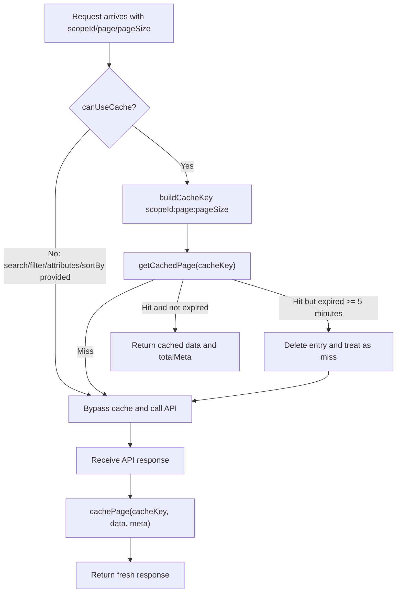
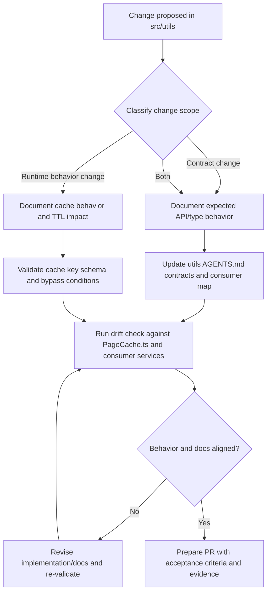

# Utils

> **This is the authoritative documentation for the `src/utils` scope.** It covers shared pagination/cache contracts used by data services. For task routing and cross-service conventions, see the [root orchestrator AGENTS.md](../../AGENTS.md).

---

## Key Capabilities

The utils scope currently provides shared pagination and cache behavior for contact-center data services:

- **Typed Pagination Contracts**: Reusable interfaces for response metadata and query params
- **Generic In-Memory Page Caching**: `PageCache<T>` utility for simple pagination reuse
- **Cache Safety Rules**: Explicit bypass behavior for search/filter/sort scenarios
- **Spec-Driven Utility Workflow**: Utility-specific implementation and validation flow documented inline in this file

| Component             | File                             | Description                                                                                                                                     |
| --------------------- | -------------------------------- | ----------------------------------------------------------------------------------------------------------------------------------------------- |
| `PageCache`           | [`PageCache.ts`](./PageCache.ts) | Generic in-memory cache utility for paginated API responses with TTL expiry and helper methods for key generation and cache eligibility checks. |
| `Pagination Types`    | [`PageCache.ts`](./PageCache.ts) | `PaginationMeta`, `PaginatedResponse<T>`, `BaseSearchParams`, and `PageCacheEntry<T>` shared across data services.                              |
| `Pagination Defaults` | [`PageCache.ts`](./PageCache.ts) | `PAGINATION_DEFAULTS` (`PAGE`, `PAGE_SIZE`) used by services for consistent request defaults.                                                   |
| `Specs Workflow`      | `AGENTS.md` (inline)             | Mermaid flow for specs-driven utility changes, acceptance criteria, and drift checks.                                                           |

---

## File Structure

```
src/utils/
├── AGENTS.md          # This file: utils scope guide
└── PageCache.ts       # Generic cache + pagination contracts/defaults
```

---

## PageCache Utility

`PageCache<T>` provides a consistent caching model for paginated list APIs. It is optimized for simple page browsing and intentionally bypasses cache for parameterized query cases (`search`, `filter`, `attributes`, `sortBy`).

### Reference Usage

```typescript
import PageCache, {PAGINATION_DEFAULTS} from '../utils/PageCache';

const cache = new PageCache<MyItem>('MyService');

const page = PAGINATION_DEFAULTS.PAGE;
const pageSize = PAGINATION_DEFAULTS.PAGE_SIZE;
const cacheKey = cache.buildCacheKey(scopeId, page, pageSize);

// Include sortBy only for services that support sorting.
const canUseCache = cache.canUseCache({search, filter, attributes, sortBy});

if (canUseCache) {
  const cachedEntry = cache.getCachedPage(cacheKey);
  if (cachedEntry) {
    return {
      data: cachedEntry.data,
      meta: {
        page,
        pageSize,
        ...cachedEntry.totalMeta,
      },
    };
  }
}

const response = await fetchPageFromApi();

if (canUseCache && response.data) {
  cache.cachePage(cacheKey, response.data, response.meta);
}

return response;
```

### Cache Lifecycle



---

## Public Contracts

All public contracts for utils are defined in [`PageCache.ts`](./PageCache.ts).

### `PaginationMeta`

Common pagination metadata used across list APIs.

| Field                         | Type                     | Notes                   |
| ----------------------------- | ------------------------ | ----------------------- |
| `orgid`                       | `string`                 | Organization identifier |
| `page` / `currentPage`        | `number`                 | Current page aliases    |
| `pageSize`                    | `number`                 | Items per page          |
| `totalPages`                  | `number`                 | Total page count        |
| `totalRecords` / `totalItems` | `number`                 | Total item aliases      |
| `links`                       | `Record<string, string>` | Pagination link map     |

### `PaginatedResponse<T>`

Canonical paginated response type:

```typescript
interface PaginatedResponse<T> {
  data: T[];
  meta: PaginationMeta;
}
```

### `PageCacheEntry<T>`

Shape of a cached page entry returned by `getCachedPage()`:

- `data: T[]`
- `timestamp: number` (epoch milliseconds)
- `totalMeta?: { totalPages?: number; totalRecords?: number }`

### `CacheValidationParams`

Contract passed to `canUseCache()`:

- `search?: string`
- `filter?: string`
- `attributes?: string`
- `sortBy?: string`

Behavior note:

- Cache bypass is triggered by `sortBy`, not by `sortOrder` alone.
- If a new service treats `sortOrder` as meaningful without `sortBy`, extend `CacheValidationParams` and `canUseCache()` together.

### `BaseSearchParams`

Common query parameter contract with pagination and sorting:

- `search`, `filter`, `attributes`
- `page`, `pageSize`
- `sortBy`, `sortOrder`

### `PAGINATION_DEFAULTS`

Standard defaults exported for callers:

- `PAGE: 0`
- `PAGE_SIZE: 100`

---

## PageCache API

### `constructor(apiName: string)`

Creates a typed cache instance and stores `apiName` for `LoggerProxy` context.

### `canUseCache(params: CacheValidationParams): boolean`

Returns `true` only when all of these are absent:

- `search`
- `filter`
- `attributes`
- `sortBy`

`sortOrder` alone does not trigger cache bypass because `CacheValidationParams` currently keys bypass on fields that materially change the query result set in existing consumers.

### `buildCacheKey(scopeId: string, page: number, pageSize: number): string`

Builds deterministic cache key format:

```text
${scopeId}:${page}:${pageSize}
```

### `getCachedPage(cacheKey: string): PageCacheEntry<T> | null`

Behavior:

1. Returns `null` if key not found
2. Computes cache age in minutes
3. If age is `>= 5`, logs expiry, deletes entry, returns `null`
4. Otherwise returns cached entry

### `cachePage(cacheKey: string, data: T[], meta?: any): void`

Stores entry with:

- `data`
- `timestamp`
- `totalMeta.totalPages`
- `totalMeta.totalRecords` mapped from `meta.totalRecords || meta.totalItems`

### `clearCache(): void`

Clears all entries and logs cleared entry count.

### `getCacheSize(): number`

Returns current in-memory entry count.

Note: `clearCache()` and `getCacheSize()` are available for future use and are not currently called by existing consumers.

---

## Consumer Map

Current consumers of `PageCache` and defaults:

| Consumer                | File                                                       | Usage                                                        |
| ----------------------- | ---------------------------------------------------------- | ------------------------------------------------------------ |
| `AddressBook`           | [`../services/AddressBook.ts`](../services/AddressBook.ts) | Caches paged address-book responses                          |
| `EntryPoint`            | [`../services/EntryPoint.ts`](../services/EntryPoint.ts)   | Caches paged entry-point responses                           |
| `Queue`                 | [`../services/Queue.ts`](../services/Queue.ts)             | Caches paged queue responses                                 |
| `Public type contracts` | [`../types.ts`](../types.ts)                               | Re-exports pagination/search contracts into SDK-facing types |

Cross-scope mention:

- Services-layer docs reference utils caching contracts at [`../services/ai-docs/AGENTS.md`](../services/ai-docs/AGENTS.md).

---

## Spec-Driven Utility Changes

When changing `src/utils` behavior or contracts:

1. Follow the workflow diagram below
2. Define acceptance criteria for contract and runtime behavior
3. Verify cache TTL, bypass rules, and key schema
4. Validate no spec drift before shipping



---

## Validation Checklist

- [ ] Public types remain backward-compatible or migration is documented
- [ ] `PAGINATION_DEFAULTS` changes are intentional and propagated to consumers
- [ ] Cache TTL behavior remains explicit and covered by tests
- [ ] `canUseCache()` bypass conditions are unchanged or intentionally updated
- [ ] `totalRecords`/`totalItems` mapping behavior is preserved
- [ ] Logging still uses `LoggerProxy` with `module` and `method`
- [ ] AddressBook/EntryPoint/Queue integration behavior remains correct

---

## Related

- [Root orchestrator AGENTS.md](../../AGENTS.md) - Task routing and critical package rules
- [PageCache implementation](./PageCache.ts)
