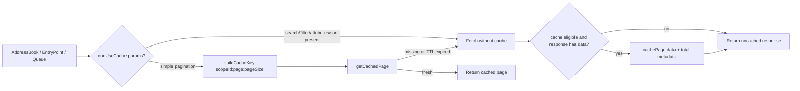
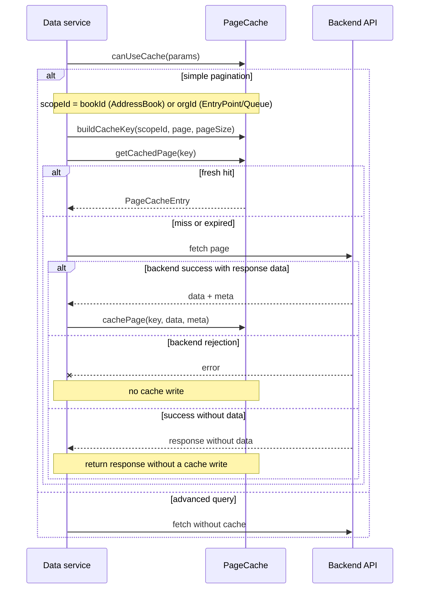
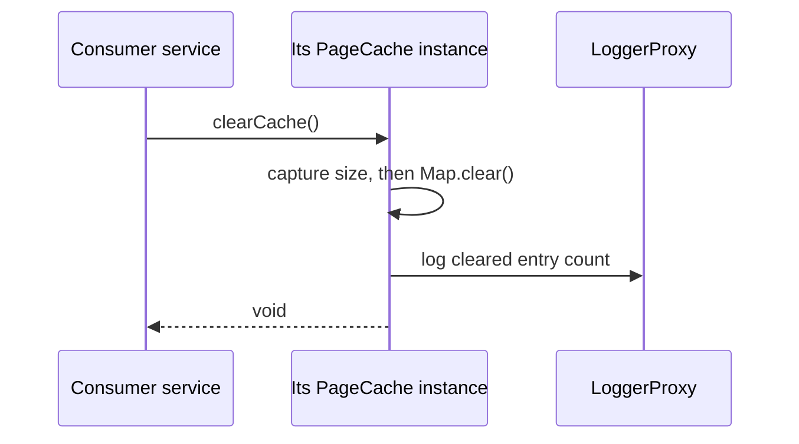
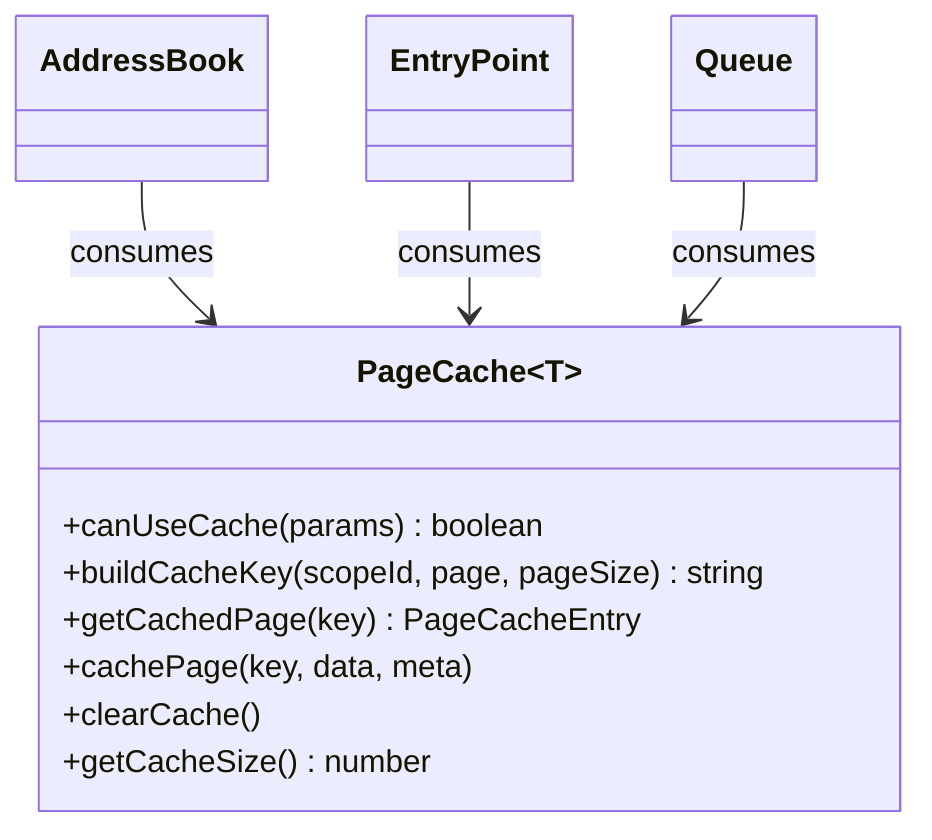
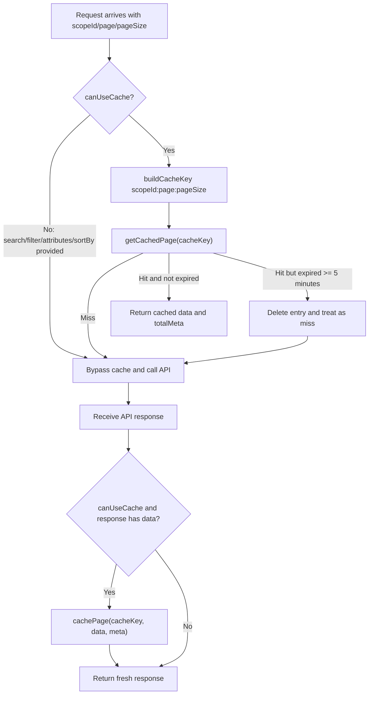
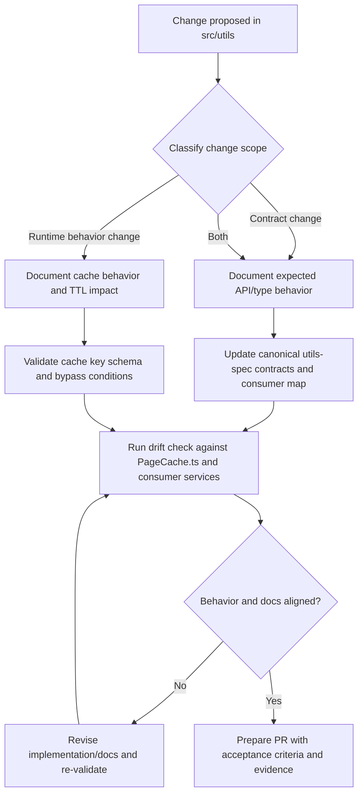

# Utils — SPEC

> Start here → root [`AGENTS.md`](../../../AGENTS.md) · router [`SPEC_INDEX.md`](../../../ai-docs/SPEC_INDEX.md) · system [`ARCHITECTURE.md`](../../../ai-docs/ARCHITECTURE.md). This is the module's canonical specification.

## Metadata

| Field | Value |
|---|---|
| Module id | `utils` |
| Source path(s) | `src/utils` |
| Doc kind | Module spec |
| Coverage score | Partial (manifest-authoritative); 15/15 required document fields present |
| Generated from | `module-spec` @ SDLC template library `0.2.1` |
| generated_by / approved_by / updated_at | Codex generator / developer-approved follow-up review remediation / 2026-07-21 |
| Validation status | Follow-up validation passed (independent Claude fallback, 2026-07-21); coverage remains Partial |

## Evidence Rules
Every requirement cites stable source and test file paths. Code/tests are the behavioral referee; routed source text supplies explicit intent and rationale. Missing or contradictory evidence blocks promotion.

## Source Material Register
| Source material | Scope | Decision | Detail location or disposition |
|---|---|---|---|
| Reviewed prior module guides and architecture material | overview / architecture / API / tests | used and code-checked | Content is placed by meaning throughout this specification; exact routing remains in the manifest. |

## Overview
Utils is one of nine confirmed Contact Center SDK modules. Own shared pagination contracts and the bounded in-memory page cache used by Contact Center data services. Existing reviewed documentation is migrated by meaning and code/tests remain the behavioral referee.

The utils scope currently provides shared pagination and cache behavior for contact-center data services:

- **Typed Pagination Contracts**: Reusable interfaces for response metadata and query params

- **Generic In-Memory Page Caching**: `PageCache<T>` utility for simple pagination reuse

- **Cache Safety Rules**: Explicit bypass behavior for search/filter/sort scenarios

- **Spec-Driven Utility Workflow**: Utility-specific implementation and validation flow documented inline in this file

| Component             | File                             | Description                                                                                                                                     |
|---|---|---|
| `PageCache`           | [`PageCache.ts`](../PageCache.ts) | Generic in-memory cache utility for paginated API responses with TTL expiry and helper methods for key generation and cache eligibility checks. |
| `Pagination Types`    | [`PageCache.ts`](../PageCache.ts) | `PaginationMeta`, `PaginatedResponse<T>`, `BaseSearchParams`, and `PageCacheEntry<T>` shared across data services.                              |
| `Pagination Defaults` | [`PageCache.ts`](../PageCache.ts) | `PAGINATION_DEFAULTS` (`PAGE`, `PAGE_SIZE`) used by services for consistent request defaults.                                                   |
| `Specs Workflow`      | `ai-docs/utils-spec.md`          | Canonical flow for spec-driven utility changes, acceptance criteria, and drift checks.                                                          |

## Purpose / Responsibility
Own shared pagination contracts and the bounded in-memory page cache used by Contact Center data services.

## Stack
TypeScript 5.4 generics, in-memory Map/clock, LoggerProxy, Jest consumer tests.

## Folder / Package Structure
```text
src/utils/
├── AGENTS.md
├── PageCache.ts
```

```text
src/utils/
├── AGENTS.md          # Preserved legacy, noncanonical utils guide
└── PageCache.ts       # Generic cache + pagination contracts/defaults
```

## Key Files (source of truth)
| File | Holds |
|---|---|
| `src/utils/PageCache.ts` | Authoritative PageCache implementation plus pagination/cache contracts and defaults. |
| `src/types.ts` | Package-wide public response/search types that consume PageCache contracts; not a Utils implementation. |
| `src/services/AddressBook.ts` | Services-layer PageCache consumer. |
| `src/services/EntryPoint.ts` | Services-layer PageCache consumer. |
| `src/services/Queue.ts` | Services-layer PageCache consumer. |

## Public Surface
| Surface | Availability | Source |
|---|---|---|
| `PageCache<T>` | exported from the Utils module file for internal service use; not re-exported by package root | `src/utils/PageCache.ts` |
| `PaginationMeta`, `PaginatedResponse<T>`, `BaseSearchParams` | exported by PageCache module and consumed by package-wide types | `src/utils/PageCache.ts`, `src/types.ts` |
| `PAGINATION_DEFAULTS`, `PageCacheEntry<T>`, `CacheValidationParams` | PageCache module exports; not package-root exports | `src/utils/PageCache.ts` |
| AddressBook/EntryPoint/Queue public response/search aliases | package-root exports whose definitions indirectly use PageCache contracts | `src/types.ts`, `src/index.ts` |

No claim is made that `src/types.ts`, AddressBook, EntryPoint, or Queue is implemented by Utils.

## Requires (dependencies)
- LoggerProxy
- In-memory Map and wall clock
- AddressBook, EntryPoint, and Queue consumers

## Requirements
| ID | WHAT | WHY | Source Evidence | Test / Example Evidence | Assumptions / Gaps | Confidence |
|---|---|---|---|---|---|---|
| UTILS-R-001 | Use cache only for simple pagination requests without search, filter, attributes, or sortBy. | Parameterized queries cannot safely reuse a page keyed only by scope/page/pageSize. | `src/utils/PageCache.ts` | `test/unit/spec/services/AddressBook.ts` | None; source and test evidence rechecked during the 2026-07-09 remediation; independent document revalidation pending. | PRESENT |
| UTILS-R-002 | Build cache keys from a caller-defined `scopeId` plus `page:pageSize`: `orgId` for EntryPoint/Queue and `bookId` for AddressBook. | Consumer scope and page boundaries prevent cross-scope or cross-page reuse. | `src/utils/PageCache.ts`, `src/services/AddressBook.ts`, `src/services/EntryPoint.ts`, `src/services/Queue.ts` | `test/unit/spec/services/AddressBook.ts`, `test/unit/spec/services/EntryPoint.ts`, `test/unit/spec/services/Queue.ts` | `PageCache.buildCacheKey` names its first implementation parameter `orgId`, but runtime callers establish the broader `scopeId` semantics. | PRESENT |
| UTILS-R-003 | Expire entries after the configured five-minute TTL and delete them on stale lookup. | Bounded staleness prevents indefinite reuse of remote service data. | `src/utils/PageCache.ts` | None | Direct fake-clock expiration coverage is absent from current consumer tests. | PRESENT |
| UTILS-R-004 | Cache data with total-page/record metadata and allow owning consumers to clear the cache. | Paginated services need consistent metadata without transferring ownership of remote records to the SDK. | `src/utils/PageCache.ts` | `test/unit/spec/services/AddressBook.ts` | Cache hit/miss and metadata are exercised through consumers; `clearCache()` has no direct assertion. | PRESENT |
| UTILS-R-005 | Accept already-fetched page values from consuming services and never store or process credentials; use the consumer's scope value only as part of the in-memory key. | Authentication remains in Services/Core and scope-separated keys prevent unrelated pages from colliding. | `src/utils/PageCache.ts`, `src/services/core/WebexRequest.ts`, `src/services/AddressBook.ts`, `src/services/EntryPoint.ts`, `src/services/Queue.ts` | `test/unit/spec/services/AddressBook.ts` | None; security/auth ownership is explicit. | PRESENT |
| UTILS-R-006 | Keep PageCache free of rollout flags; consuming services decide whether to invoke it and query parameters determine cache eligibility. | Cache correctness must depend on request shape, not hidden deployment state. | `src/utils/PageCache.ts` | `test/unit/spec/services/AddressBook.ts`, `test/unit/spec/services/Queue.ts` | None; rollout applicability is explicitly N/A. | PRESENT |

## Design Overview
Utils separates its stable consumption boundary from collaborators so ownership and failure behavior stay explicit. Caching is intentionally limited to simple page browsing; search/filter/sort requests bypass cache to prevent incorrect reuse.

> **This is the authoritative documentation for the `src/utils` scope.** It covers shared pagination/cache contracts used by data services. For task routing and cross-service conventions, see the [root orchestrator AGENTS.md](../../../AGENTS.md).

Current consumers of `PageCache` and defaults:

| Consumer                | File                                                       | Usage                                                        |
|---|---|---|
| `AddressBook`           | [`../../services/AddressBook.ts`](../../services/AddressBook.ts) | Caches paged address-book responses                          |
| `EntryPoint`            | [`../../services/EntryPoint.ts`](../../services/EntryPoint.ts)   | Caches paged entry-point responses                           |
| `Queue`                 | [`../../services/Queue.ts`](../../services/Queue.ts)             | Caches paged queue responses                                 |
| `Public type contracts` | [`../../types.ts`](../../types.ts)                               | Re-exports pagination/search contracts into SDK-facing types |

Cross-scope mention:

- Services-layer docs reference utils caching contracts at [`../../services/ai-docs/services-spec.md`](../../services/ai-docs/services-spec.md).

## Data Flow


## Sequence Diagram(s)
Sequence coverage:

| Operation group | Diagram | Failure / recovery coverage |
|---|---|---|
| Eligible lookup, fetch, and store | Cache lifecycle | Advanced queries bypass cache; misses and expired entries fetch from the backend; failed backend calls never reach `cachePage`. |
| Explicit cache clearing | Clear all entries | `clearCache` removes all entries from that consumer-owned PageCache instance and logs the prior size. |

### Cache lifecycle



### Clear all entries



## Class / Component Relationships


## Use Cases
- **UC-1 Cache eligibility:** AddressBook, EntryPoint, or Queue bypasses cache whenever search, filter, attributes, or sort is supplied. Evidence: `src/utils/PageCache.ts`, `test/unit/spec/services/AddressBook.ts`.
- **UC-2 Cache-key construction:** a simple page lookup uses `<scopeId>:page:pageSize`; AddressBook supplies `bookId`, while EntryPoint and Queue supply `orgId`. Evidence: `src/utils/PageCache.ts`, `src/services/AddressBook.ts`, `src/services/EntryPoint.ts`, `src/services/Queue.ts`.
- **UC-3 TTL lookup/expiry:** a fresh cached entry is returned; an expired entry is deleted and treated as a miss. Evidence: `src/utils/PageCache.ts`; no direct expiration test currently exists.
- **UC-4 Page insertion and clearing:** successful page data and normalized totals are cached, while `clearCache()` removes all entries for that service instance. Evidence: `src/utils/PageCache.ts`; consumer tests cover insertion/hit behavior, but not direct clearing.

## State Model
Utils retains only in-memory runtime state. Durable domain records remain owned by remote Webex services. State changes are driven by explicit calls, events, timers, or actor transitions documented below.

`PageCache<T>` provides a consistent caching model for paginated list APIs. It is optimized for simple page browsing and intentionally bypasses cache for parameterized query cases (`search`, `filter`, `attributes`, `sortBy`).

```typescript
import PageCache, {PAGINATION_DEFAULTS} from '../utils/PageCache';

const cache = new PageCache<MyItem>('MyService');

const page = PAGINATION_DEFAULTS.PAGE;
const pageSize = PAGINATION_DEFAULTS.PAGE_SIZE;
// AddressBook uses bookId; EntryPoint and Queue use orgId.
const scopeId = bookIdOrOrgId;
const cacheKey = cache.buildCacheKey(scopeId, page, pageSize);

// Include sortBy only for services that support sorting.
const canUseCache = cache.canUseCache({search, filter, attributes, sortBy});

if (canUseCache) {
  const cachedEntry = cache.getCachedPage(cacheKey);
  if (cachedEntry) {
    return {
      data: cachedEntry.data,
      meta: {
        page,
        pageSize,
        ...cachedEntry.totalMeta,
      },
    };
  }
}

const response = await fetchPageFromApi();

if (canUseCache && response.data) {
  cache.cachePage(cacheKey, response.data, response.meta);
}

return response;
```



Creates a typed cache instance and stores `apiName` for `LoggerProxy` context.

Returns `true` only when all of these are absent:

- `search`

- `filter`

- `attributes`

- `sortBy`

`sortOrder` alone does not trigger cache bypass because `CacheValidationParams` currently keys bypass on fields that materially change the query result set in existing consumers.

Builds deterministic cache key format:

```text
${scopeId}:${page}:${pageSize}
```

The implementation parameter is named `orgId`, but its value is the caller-defined `scopeId`: `bookId` in AddressBook and `orgId` in EntryPoint/Queue.

Behavior:

1. Returns `null` if key not found

2. Computes cache age in minutes

3. If age is `>= 5`, logs expiry, deletes entry, returns `null`

4. Otherwise returns cached entry

Stores entry with:

- `data`

- `timestamp`

- `totalMeta.totalPages`

- `totalMeta.totalRecords` mapped from `meta.totalRecords || meta.totalItems`

Clears all entries and logs cleared entry count.

Returns current in-memory entry count.

Note: `clearCache()` and `getCacheSize()` are available for future use and are not currently called by existing consumers.

## Business Rules & Invariants
- Utils must preserve its typed public/event contracts and must not invent backend states or responses. Enforced in `src/utils/PageCache.ts`.
- Security/auth applicability is limited to scope separation: PageCache receives already-fetched values, owns no credentials, and includes its caller-supplied scope value in cache keys.
- Rollout applicability is N/A: PageCache has no feature flag; consumers choose whether to use it and `canUseCache` decides eligibility from query parameters.

## Pitfalls
- Do not describe the first cache-key field as universally `orgId`: AddressBook passes `bookId`, while EntryPoint and Queue pass `orgId`.
- Do not cache queries containing `search`, `filter`, `attributes`, or `sortBy`; their result set is not represented in the key.
- Do not treat an expired entry as usable data. `getCachedPage` deletes it and returns `null`.
- Do not cache a rejected request or a response without data; only the consuming service owns the backend request and decides when to call `cachePage`.

## Module Do's / Don'ts
- DO create a separate `PageCache` instance per consuming service and pass that consumer's stable scope value into `buildCacheKey`.
- DO preserve the five-minute `>=` expiry boundary and the `totalRecords || totalItems` compatibility mapping.
- DO keep credentials, request execution, and backend-error handling in the consuming service/Core layers.
- DON'T add query dimensions without either extending the cache key or making `canUseCache` bypass them.
- DON'T claim `clearCache()` or TTL expiry is directly unit-tested until dedicated assertions exist.

When changing `src/utils` behavior or contracts:

1. Follow the workflow diagram below

2. Define acceptance criteria for contract and runtime behavior

3. Verify cache TTL, bypass rules, and key schema

4. Validate no spec drift before shipping



## Key Design Trade-off
- Caching is intentionally limited to simple page browsing; search/filter/sort requests bypass cache to prevent incorrect reuse.

## Test-Case Strategy (module)
PageCache has no dedicated unit file; current consumer tests in `test/unit/spec/services/AddressBook.ts`, `EntryPoint.ts`, and `Queue.ts` cover request shaping plus cache hit/miss behavior. Add direct PageCache tests for the five-minute expiry boundary, entry deletion, metadata normalization, clearing, and key construction with both `bookId` and `orgId` scope values.

| Behavior / Requirement | Existing test evidence | Gap |
|---|---|---|
| `UTILS-R-001` | AddressBook, EntryPoint, and Queue consumer tests exercise advanced query parameters and simple pagination. | Add a direct `canUseCache` table test for each bypass field and `sortOrder` alone. |
| `UTILS-R-002` | AddressBook repeat/miss tests exercise `bookId`-scoped caching; EntryPoint and Queue miss tests exercise `orgId` consumers. | Add direct key-string assertions for both runtime scope kinds. |
| `UTILS-R-003` | None. | Add fake-clock tests at just below and exactly five minutes, including deletion. |
| `UTILS-R-004` | AddressBook verifies a repeat-call hit and response metadata; all three consumers verify misses. | Add direct metadata fallback and `clearCache`/`getCacheSize` assertions. |
| `UTILS-R-005` | Source inspection confirms PageCache has no credential or request dependency. | No runtime credential test is needed; retain the static ownership check. |
| `UTILS-R-006` | Source inspection confirms no feature-flag dependency; consumer tests cover invocation choices. | No direct rollout test is applicable. |

## Traceability
- Repo architecture: `../../../ai-docs/ARCHITECTURE.md` · Registry: `../../../ai-docs/SPEC_INDEX.md`
- Coverage state and contracts baseline: `../../../.sdd/manifest.json`

- [Root orchestrator AGENTS.md](../../../AGENTS.md) - Task routing and critical package rules

- [PageCache implementation](../PageCache.ts)
