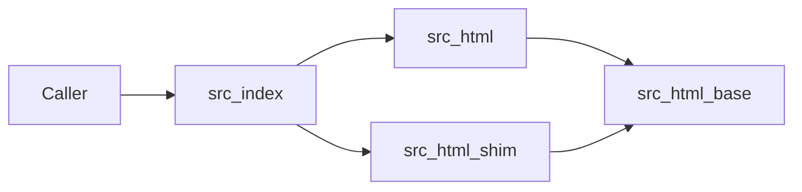
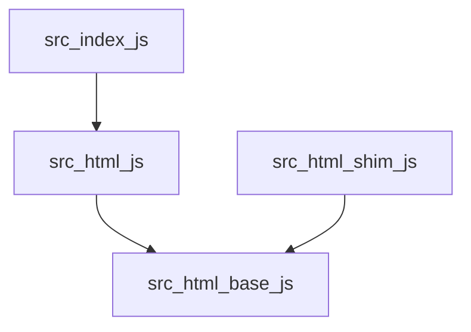

<!-- sdd-generated-metadata
doc_kind: standing-doc
generated_from: architecture@0.3.0
generated_by: cursor
approved_by: repository user
updated_at: 2026-10-01T11:15:00Z
validation_status: not-run
-->

# @webex/helper-html architecture

Canonical architecture for this package. Behavior of the filter lives in the [module specification](../src/docs/README.md). This page owns package boundaries, the Node versus browser split, and the published contract.

Related context: [specification registry](specs/README.md) · [package agent instructions](../AGENTS.md)

## Applicability

| Condition ID                         | Status      | Evidence or reason | Owned section                       |
| ------------------------------------ | ----------- | ------------------ | ----------------------------------- |
| `repo.owns_datastore`                | N/A         | No database, file store, or migration in `src/` | Repository data and schema          |
| `repo.holds_client_state`            | N/A         | Functions return strings or promises of strings. No client store. | Client state model                  |
| `repo.components_interact`           | Applicable  | `src/index.js` re-exports `src/html.js`, which re-exports `src/html-base.js`. The browser field swaps in `src/html.shim.js`. | Dependency and interaction topology |
| `repo.domain_data_across_components` | N/A         | One module owns the HTML string. There is no shared domain record. | Object and data ownership           |
| `repo.caches_data`                   | N/A         | No cache in `src/` | Caching catalog                     |
| `repo.observability_convention`      | N/A         | No logger, metric, or trace call in `src/` | Observability patterns              |
| `repo.deploys_to_infra`              | N/A         | Library published to npm. No service runtime. | Runtime and infrastructure          |
| `repo.shared_base_libs`              | Applicable  | `lodash` is the only runtime dependency in `package.json` | Shared and base libraries           |
| `repo.is_monorepo`                   | N/A         | This SDD root is one package. The workspace around it is out of scope. | Package map and dependencies        |
| `repo.multi_platform`                | Applicable  | `package.json` `browser` maps `html.js` to `html.shim.js` | Platform matrix                     |
| `repo.published_package`             | Applicable  | `package.json` `name` is `@webex/helper-html` and `deploy:npm` publishes it | Release and versioning              |
| `repo.embedded_in_host`              | N/A         | No host theme or embed API | Host integration and theming        |
| `repo.exposes_commands_or_artifacts` | Applicable  | `build:src` writes `dist/`. Scripts are listed in `package.json`. | Commands and generated artifacts    |
| `repo.cross_repo_deps_material`      | N/A         | Consumers are workspace packages or npm dependents, not a second repository contract | Cross-repository topology           |
| `repo.security_arch_warranted`       | Applicable  | The browser filter exists to drop unsafe tags and URL schemes | Security architecture               |

## Design overview

`@webex/helper-html` is a small published library. Callers pass an HTML string and an allow-list. In the browser, disallowed tags, attributes, styles, and URL schemes are removed or escaped. In Node, the same filter names return the original string, because the implementation does not use DOM APIs. Text escaping of `<`, `>`, and `&` is real in both environments.

The package does not start a server, open a network connection, or persist data.

## Resource inventory and responsibilities

| Resource | Kind    | Responsibility | Owner | Source | Detailed specification |
| -------- | ------- | -------------- | ----- | ------ | ---------------------- |
| HTML helper module | module | Allow-list filtering and text escaping | @webex/web-client | `src/` | `src/docs/README.md` |
| Published package | package | npm entry points and browser swap | @webex/web-client | `package.json` | `docs/architecture.md` |

## Interaction and execution flows

The bundler, not a runtime branch inside `src/index.js`, chooses the implementation. `package.json` `browser` maps both `./src/html.js` and `./dist/html.js` to the shim.

| From | To | Interaction or transport | Purpose | Failure or compatibility behavior |
| ---- | -- | ------------------------ | ------- | --------------------------------- |
| Caller | `src/index.js` | package import | Public API | Removing an export breaks importers, including conversation |
| `src/index.js` | `src/html.js` or `src/html.shim.js` | static re-export, swapped by the browser field | Select Node or browser behavior | Node filter returns the input string |
| Either implementation | `src/html-base.js` | named re-export | Shared escape | Same replacement in both environments |
| Browser filter | `DOMParser` | browser DOM API | Parse the fragment | Absent in Node, which is why the Node file does not parse |

## Dependency topology

Runtime dependencies declared by this package:

| Dependency | Role |
| ---------- | ---- |
| `lodash@^4.17.21` | `curry` on both implementations. The shim also uses `forEach`, `includes`, and `reduce`. |

Dev dependencies supply babel, eslint, legacy tools, and the Mocha/chai test helpers. They are not imported from `src/`.

## Public and consumer surfaces

| Contract id | Publication | Kind | Canonical source | Owning spec |
| ----------- | ----------- | ---- | ---------------- | ----------- |
| `helper-html-sdk` | published | sdk | `package.json` | `src/docs/README.md` |
| `lodash` | published | sdk | npm package `lodash` | external |

`helper-html-sdk` entry points:

- `main`: `dist/index.js`
- `devMain`: `src/index.js`
- `browser`: `./dist/html.js` and `./src/html.js` resolve to the matching shim

No HTTP surface exists, so `api-specs/openapi.yaml` is omitted.

Known in-repo consumer: `packages/@webex/internal-plugin-conversation/src/index.js` imports `filter` and `filterEscape`.

## Cross-cutting architecture

### Security

The browser implementation is the security control. It drops tags that are not in `allowedTags`, strips attributes and style declarations that are not allowed, and rejects `href` and `src` values whose scheme is not allowed. `javascript`, `vbscript`, and `data` cannot be added back through `additionalAllowedUrlSchemes`. Details and the error strings are in the module spec.

The Node implementation does not apply that control. Callers that need sanitizing must run the browser build.

The package does not authenticate users, store secrets, or verify certificates.

### Observability and operations

N/A. `src/` does not log, emit metrics, or trace. Failures are thrown `Error` values or a `TypeError` from property access, as described in the module spec.

### Quality attributes

- Compatibility: the seven barrel exports are the public surface.
- Platform split: behavior differs between Node and the browser on purpose.
- Test gap: the unit spec does not run in Node, so the noop path is specified from `src/html.js` rather than from an executed Node case.

## Dependency and interaction topology

One module. Files inside it:

`src/html.shim.js` is not imported by `src/index.js`. The browser field substitutes it for `src/html.js`.

## Shared and base libraries

| Library | Used for | Source |
| ------- | -------- | ------ |
| lodash | curry, forEach, includes, reduce | `package.json` dependencies |

No other `@webex/*` package is imported from `src/`.

## Platform matrix

| Platform | Implementation | Filter behavior | Escape behavior |
| -------- | -------------- | --------------- | --------------- |
| Node | `src/html.js` | Returns the `html` argument | Encodes `<`, `>`, and `&` |
| Browser | `src/html.shim.js` via the `browser` field | DOM allow-list filter | Same encoding, re-exported from `src/html-base.js` |

## Release and versioning

The package is published with `yarn workspace @webex/helper-html deploy:npm`, which runs `yarn npm publish`. The license field is `MIT`. There is no package-local changelog. Workspace release tooling owns changelog generation, which is why `CHANGELOG.md` is omitted here.

Export stability is the barrel in `src/index.js`. The module spec lists each export.

## Commands and generated artifacts

| Command | Produces |
| ------- | -------- |
| `yarn workspace @webex/helper-html build:src` | `dist/` from `src/` via `webex-legacy-tools build` |
| `yarn workspace @webex/helper-html test:browser` | karma run of the unit spec; no committed artifact |
| `yarn workspace @webex/helper-html test:style` | eslint result; no committed artifact |
| `yarn install` | workspace `node_modules` |
| `yarn workspace @webex/helper-html deploy:npm` | npm publish |

`dist/` is generated. Do not edit it by hand.

## Security architecture

Threat the browser filter addresses: unsafe HTML from message content, including scriptable URL schemes and unexpected tags.

Controls in `src/html.shim.js`:

- Allow-list of tag names and, per tag, attribute names.
- Allow-list of CSS property names inside `style`.
- Scheme check for `href` and `src` after stripping leading and trailing C0 controls and whitespace, and after removing tab, newline, and carriage return inside the scheme portion.
- Hard block of `javascript`, `vbscript`, and `data`.
- A failed scheme check removes the element and keeps its children (`reparent`), which the unit spec shows for `javascript:` links.

Controls that are absent:

- The Node file does not parse or strip.
- The package does not set a Content-Security-Policy. That belongs to the host page.

## Domain language

| Term | Meaning |
| ---- | ------- |
| allowedTags | Object whose keys are tag names and whose values are arrays of allowed attribute names |
| allowedStyles | Array of CSS property names that may remain inside a `style` attribute |
| processCallback | Function invoked with the parsed `body` after filtering |
| additionalAllowedUrlSchemes | Optional extra schemes merged into the default set, except the blocked three |
| reparent | Move an element's children to its parent and remove the element |
| escape | Replace `<`, `>`, and `&` with entities. Also the name of the export that does that for a whole string |

## References and maintenance

- Module spec: `src/docs/README.md`
- Product readme decision: `docs/adr/0001-retain-product-readme.md`
- Owner: `@webex/web-client` in `.github/CODEOWNERS`
- Manifest: `.sdd/manifest.json`
