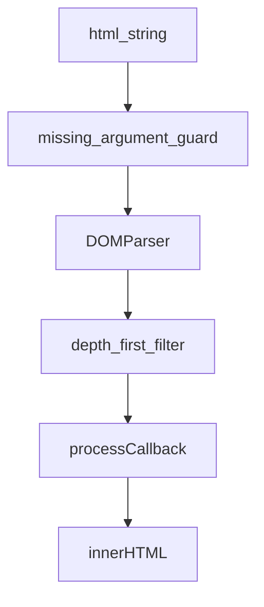

<!-- sdd-generated-metadata
doc_kind: module-spec
generated_from: module-spec@0.3.0
generated_by: cursor
approved_by: repository user
updated_at: 2026-10-01T11:15:00Z
validation_status: pass-with-warnings
-->

# HTML helper

This source-local document at `src/docs/README.md` owns the stable specification for **the HTML helper**. Ground every claim in repository evidence and link to the [repository architecture](../../docs/architecture.md) instead of repeating broader facts.

Related context: [documentation index](../../docs/index.md) · [package agent instructions](../../AGENTS.md)

## Metadata

| Field         | Value                                                        |
| ------------- | ------------------------------------------------------------ |
| Owner         | @webex/web-client                                            |
| Source path   | `src`                                                        |
| Resource kind | package                                                      |
| Status        | Active                                                       |
| Last verified | 2026-10-01                                                   |
| Module id     | `helper-html`                                                |
| Parent spec   | —                                                            |
| Doc kind      | Module spec                                                  |
| Coverage score | 93.3% assessed 2026-10-01 — 14 of 15 mandatory fields PRESENT; test strategy is WEAK because the unit spec is skipped in Node |
| Validation status | pass-with-warnings |

## Applicability

| Condition ID                         | Status      | Evidence or reason | Owned section                 |
| ------------------------------------ | ----------- | ------------------ | ----------------------------- |
| `module.has_tiers`                   | N/A         | No tier policy in this package | Tier                          |
| `module.has_ui`                      | N/A         | No view or screen. The module transforms strings. | UI use-case flow              |
| `module.crosses_service_boundaries`  | N/A         | No network or service call in `src/` | Cross-boundary use-case flow  |
| `module.holds_client_state`          | N/A         | No stored client state | Client state model            |
| `module.enforces_domain_rules`       | Applicable  | Tag, attribute, style, and URL-scheme allow-lists in `src/html.shim.js` | Business rules and invariants |
| `module.is_concurrent_async`         | Applicable  | `escape`, `filter`, and `filterEscape` return promises | Concurrency and reactive flow |
| `module.owns_persistence`            | N/A         | No schema, store, or migration | Data, schema, and migration   |
| `module.stateful_transitions`        | N/A         | No state machine | State machine                 |
| `module.exposes_wire_protocol`       | N/A         | No wire protocol | Protocol and wire format      |
| `module.ui_multi_screen`             | N/A         | No UI | UI flow                       |
| `module.large_data_model`            | N/A         | Inputs are strings and plain allow-list objects | Data model                    |
| `module.returns_caller_errors`       | Applicable  | `src/html.shim.js` throws `Error` for missing arguments and for an unremovable node | Caller-visible failure modes  |
| `module.module_specific_conventions` | Applicable  | Node file must stay a noop filter; blocked schemes stay blocked | Module-specific rules         |
| `module.published_package`           | Applicable  | Barrel in `src/index.js` is the published surface | Export stability              |
| `module.embedded_in_host`            | N/A         | No host integration API | Host integration and theming  |
| `module.has_design_tradeoff`         | Applicable  | Node returns the original string so the package can load without DOM APIs | Key design trade-off          |
| `module.has_submodules`              | N/A         | Computed false. `src/html-base.js` is a helper file, not a child module. | Sub-modules                   |

## Evidence register

| Evidence         | What it establishes |
| ---------------- | ------------------- |
| `src/index.js` | Public re-exports |
| `src/html-base.js` | `escape` and `escapeSync` entity replacement |
| `src/html.js` | Node filter no-ops and the same default scheme list |
| `src/html.shim.js` | Browser filter, escape-filter, URL scheme rules, and thrown errors |
| `package.json` | Name, browser field, and scripts |
| `test/unit/spec/html.js` | Browser cases for filter, filterEscape, escape, and extra schemes |
| `docs/adr/0001-retain-product-readme.md` | README is retained and is not the behavioral authority |

## Purpose and boundary

- Responsibility: turn an HTML string into a filtered or escaped string, and escape `<`, `>`, and `&` in plain text.
- In scope: the seven barrel exports, the Node versus browser split, allow-lists, and the two `Error` messages in `src/html.shim.js`.
- Out of scope: message parsing, mention business rules, Content-Security-Policy, and the product wording in `README.md`.
- Consumers: importers of `@webex/helper-html`. In this workspace, `packages/@webex/internal-plugin-conversation/src/index.js` imports `filter` and `filterEscape`.

## Structure and key files

| Path     | Responsibility                     |
| -------- | ---------------------------------- |
| `src/index.js` | Re-exports the public surface from `./html` |
| `src/html.js` | Node implementation. Filter exports return the `html` argument. |
| `src/html.shim.js` | Browser implementation selected by the `package.json` `browser` field |
| `src/html-base.js` | `escape` and `escapeSync` |
| `test/unit/spec/html.js` | Mocha spec skipped in Node |

## Public surface

Declarations live in `src/index.js`. Do not copy a second signature here. The curried shape is implemented in `src/html.js` and `src/html.shim.js` with `curry(..., 4)`.

| Surface  | Consumer   | Compatibility commitment | Source   |
| -------- | ---------- | ------------------------ | -------- |
| `escape`, `escapeSync` | any importer | Stable encoding of `<`, `>`, and `&` | `src/html-base.js` |
| `filter`, `filterSync` | conversation and other importers | Browser removes disallowed tags and keeps their text. Node returns the input string. | `src/html.shim.js` and `src/html.js` |
| `filterEscape`, `filterEscapeSync` | conversation and other importers | Browser escapes disallowed tags. Node returns the input string. | `src/html.shim.js` and `src/html.js` |
| `DEFAULT_ALLOWED_URL_SCHEMES` | callers that need the default set | The array is `http`, `https`, `mailto`, `tel`, `sip`, `webexteams` in both files | `src/html.shim.js` and `src/html.js` |

Contract id `helper-html-sdk` is published. `package.json` is the ecosystem-native artifact. Contract id `lodash` is required and external.

Call shape for the four filter exports, from the `function` parameter lists in `src/html.shim.js`:

1. `processCallback`
2. `allowedTags`
3. `allowedStyles`
4. `html`
5. optional `additionalAllowedUrlSchemes` on the sync browser functions

`curry(..., 4)` means the first four arguments can be supplied one at a time. The unit spec partially applies `filter(noop, allowedTags, allowedStyles)` and then passes the HTML string. It also calls `filterSync` with five arguments when it passes `['teams']`.

`escape(html)` returns `Promise.resolve(escapeSync(html))`. `escapeSync` replaces `<` with `&lt;`, `>` with `&gt;`, and `&` with `&amp;` using the regex `/(<|>|&)/g`. Other characters are unchanged.

## Dependencies

| Dependency | Why |
| ---------- | --- |
| `lodash` | Curry the filter exports. The shim also iterates attributes and schemes. |
| Browser `DOMParser` and `document` | Used only by `src/html.shim.js` |
| `@webex/test-helper-chai`, `@webex/test-helper-mocha` | Test-only |

## Requirements

| ID | What | Why | Evidence | Verification |
| -- | ---- | --- | -------- | ------------ |
| MOD-001 | The barrel exports `escape`, `escapeSync`, `filter`, `filterSync`, `filterEscape`, `filterEscapeSync`, and `DEFAULT_ALLOWED_URL_SCHEMES`. | Consumers import those names from the package root. | `src/index.js` | Inspect the barrel. The unit spec imports the same names. |
| MOD-002 | `escapeSync` replaces only `<`, `>`, and `&`. `escape` resolves to that string. | Callers share one encoder in Node and the browser. | `src/html-base.js` | Unit cases `escapes html` on `This is an <b>invalid</b> tag`. |
| MOD-003 | In Node, `filter`, `filterSync`, `filterEscape`, and `filterEscapeSync` return the `html` argument and do not parse it. | The package must load where DOM APIs are absent. | `src/html.js` | Source inspection. The unit spec does not run in Node. |
| MOD-004 | In the browser, `filter` and `filterSync` drop elements whose tag is not a key of `allowedTags` and keep their descendant text. | Disallowed markup should not remain as tags, and visible text should remain. | `src/html.shim.js` `reparent` | Unit case `filters tags`. |
| MOD-005 | In the browser, `filterEscape` and `filterEscapeSync` replace a disallowed element with text for its start and end tag names and keep children. | Some callers need the removed tag to stay visible as text. | `src/html.shim.js` `escapeNode` | Unit case `escapes invalid tags`. |
| MOD-006 | Attributes not listed for an allowed tag are removed. `style` keeps only declarations whose property name is in `allowedStyles`. | Allow-lists are per tag and per style property. | `src/html.shim.js` | Unit cases `filters attributes` and `filters styles`. |
| MOD-007 | `href` and `src` that fail the scheme check cause the element to be removed and its children kept. | A scriptable URL should not remain on an element. | `src/html.shim.js` `isAllowedUrlAttribute` and `reparent` | Unit cases that expect `javascript:` links to become plain text. |
| MOD-008 | `javascript`, `vbscript`, and `data` are never added from `additionalAllowedUrlSchemes`. Other schemes that match the scheme pattern are added. | Callers must not reopen those three schemes by config. | `src/html.shim.js` `BLOCKED_URL_SCHEMES` | Unit cases `blocks javascript: even when listed` and `allows a custom URL scheme from config`. |
| MOD-009 | An empty `html` string returns an empty string without throwing the missing-argument `Error`. | The unit spec requires blank input to be accepted. | `src/html.shim.js` | Unit case `accepts blank strings`. |
| MOD-010 | When `html` is a non-empty string and `allowedTags` or `allowedStyles` is missing, the browser sync functions throw `Error` with message `` `allowedTags`, `allowedStyles`, and `html` must be provided ``. | Callers need a stable failure instead of a partial parse. A null or undefined `html` throws `TypeError` on `html.length` and is listed under caller-visible failure modes. An empty string is `MOD-009`. | `src/html.shim.js` | Source inspection. The unit spec does not assert this throw. |

## Design overview

Both platforms export the same names. The browser field chooses the file. Filtering walks the parsed body depth-first, then calls `processCallback` with `doc.body`. If the input string has `body` at index 1, the result is wrapped in a `body` element. Otherwise the result is `doc.body.innerHTML`.

`filter` and `filterEscape` schedule the sync function on a resolved promise. They do not do extra async I/O.

## Data flow and sequence coverage

Node skips this flow and returns `html` from `noopSync`.

## Class and component relationships

There are no classes. The relationships are file-level:

| File | Calls | Does not call |
| ---- | ----- | ------------- |
| `src/index.js` | re-exports `./html` | DOM APIs |
| `src/html.js` | `escape` from `src/html-base.js`, `curry` from lodash | `DOMParser` |
| `src/html.shim.js` | `escape` from `src/html-base.js`, DOM APIs, lodash | network |
| `src/html-base.js` | `String.prototype.replace` | lodash and DOM |

## Use cases and flows

1. Sanitize message HTML in the browser with `filter` or `filterSync`, passing a callback, an allow-list of tags, an allow-list of styles, and the HTML string.
2. Escape disallowed tags instead of deleting them, using `filterEscape` or `filterEscapeSync`, which conversation imports alongside `filter`.
3. Escape a plain string with `escape` or `escapeSync` without parsing tags.
4. Allow an extra scheme such as `teams` by passing it as `additionalAllowedUrlSchemes`.
5. Load the package in Node and receive the original HTML from the filter exports.

## Business rules and invariants

- INV-001: Default schemes are `http`, `https`, `mailto`, `tel`, `sip`, and `webexteams`.
- INV-002: `javascript`, `vbscript`, and `data` are blocked even when listed in the additional-scheme argument.
- INV-003: A scheme-less value, an empty `href`, a value starting with `/`, `?`, or `#`, and a relative value whose colon is not a scheme are kept. The unit spec covers `./asset:name`, a query string containing `http://`, and `release notes:latest`.
- INV-004: Leading and trailing characters with code points at or below U+0020 are stripped before the scheme check. Tab, newline, and carriage return are removed only inside the scheme portion. The unit spec covers a leading U+001F, a tab inside `javascript`, and a newline inside `javascript`.
- INV-005: `escapeSync` never parses HTML. It only replaces `<`, `>`, and `&`.
- INV-006: Node filter functions return the `html` argument unchanged, including when that argument contains tags.

`trim` in `src/html.shim.js` uses `/^\s|\s$/g`, which removes one leading whitespace character and one trailing whitespace character from a style property name.

## Concurrency and reactive flow

`escape`, `filter`, and `filterEscape` return a promise that resolves with the sync result. They do not await I/O, and they do not share mutable module state across calls. Overlapping calls are independent because the parsed document is local to the call. The unit spec asserts that `filter` with four arguments returns a thenable.

The sync exports return a string directly.

## Caller-visible failure modes

| Condition | Result | Source |
| --------- | ------ | ------ |
| Browser sync filter called with a non-empty `html` while `allowedTags` or `allowedStyles` is missing | throws `Error` `` `allowedTags`, `allowedStyles`, and `html` must be provided `` | `src/html.shim.js` |
| Browser sync filter called with `html === ''` | returns `''` | `src/html.shim.js` |
| `removeNode` cannot call `remove`, has no `parentElement`, and the value has no `length` | throws `Error` `Could not find a way to remove node` | `src/html.shim.js` |
| `html` is null or undefined when the missing-argument branch evaluates `html.length` | throws `TypeError` from the property read. This is what the source does. It is not a separate named error. | `src/html.shim.js` |
| `processCallback` is not a function when the browser sync path finishes parsing | throws when the callback is invoked | `src/html.shim.js` |
| Node filter exports | return `html`. They do not throw the missing-argument `Error`. | `src/html.js` |

There is no retry. There is no error code enum.

## Pitfalls and constraints

- `README.md` documents a different `filter` parameter order. Follow `src/html.shim.js` and the unit spec. See `docs/adr/0001-retain-product-readme.md`.
- A Node test run does not execute `test/unit/spec/html.js` because of `skipInNode`.
- `package.json` does not define `test:unit`. The browser script is the unit runner.
- Passing `['javascript']` as extra schemes does not keep a `javascript:` URL. The unit spec expects the anchor to be removed.
- Disallowed `href` or `src` removes the whole element, not only the attribute.
- `depthFirstForEach` starts at `list.length`, so the callback also sees an empty slot. `isElement` returns false for that slot.

## Module-specific rules

- Keep `src/html.js` filter exports as no-ops that return `html`. Do not copy the DOM filter into the Node file.
- Keep the blocked scheme set as `javascript`, `vbscript`, and `data`.
- Keep the default scheme array identical in `src/html.js` and `src/html.shim.js`.
- When adding an allowed tag or style, update the fixture objects in `test/unit/spec/html.js` only if the new case needs them. The fixtures there are test input, not the package default allow-list. The package does not export a default tag list.

## Export stability

The published names are the seven bindings in `src/index.js`. Adding a name is backward compatible. Removing or renaming a name breaks importers, including conversation.

`package.json` `main` and `devMain` stay the package entry. The `browser` map must continue to point `html.js` at `html.shim.js` for both `src` and `dist`.

## Key design trade-off

The Node build returns unsanitized HTML from the filter exports so the module can be imported without DOM APIs. The trade-off is that a Node caller does not get the browser security behavior. The product README states that the package relies on DOM APIs and largely returns no-ops in Node. That sentence matches `src/html.js`. The README's parameter list does not match the code, and that mismatch stays in the retained README.

An alternative, parsing HTML in Node with a DOM library, is not what the code does.

## Verification

| Check | How to run it | Covers |
| ----- | ------------------- | ------ |
| Browser unit | `yarn workspace @webex/helper-html test:browser` | `test/unit/spec/html.js` |
| Lint | `yarn workspace @webex/helper-html test:style` | `src/` |
| Node behavior | Source inspection of `src/html.js` | MOD-003. No executed Node case. |

The spec's test strategy is WEAK for the Node path because the only spec file is skipped in Node and no `test:unit` script exists. Browser cases cover tag filtering, attribute and style filtering, scheme blocking, extra schemes, escape, and filterEscape.

Characterization baseline for the browser path is `test/unit/spec/html.js`. There is no separate characterization file for Node.
