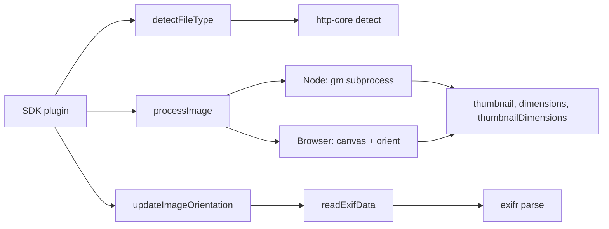

<!-- sdd-generated-metadata
doc_kind: standing-doc
generated_from: architecture@0.3.0
generated_by: claude-opus-5
approved_by: rarajes2@cisco.com
updated_at: 2026-09-28T14:57:53Z
validation_status: pass-with-warnings
-->

# @webex/helper-image architecture

Canonical repository-wide architecture. This document owns facts that span
multiple services, packages, modules, applications, or repositories. Link to
the owning service, module, feature, ADR, or native contract instead of
duplicating owner-local detail.

Related context: [specification registry](specs/README.md) ·
[repository agent instructions](../AGENTS.md)

## Applicability

Sections preceded by an `Include if` comment are conditional. Retain a
conditional section only when repository evidence satisfies its condition.
Record `Unresolved` while the evidence or developer answer is still missing;
do not infer an answer from the repository type alone.

| Condition ID                         | Status | Evidence or reason | Owned section                       |
| ------------------------------------ | ------ | ------------------ | ----------------------------------- |
| `repo.owns_datastore`                | N/A    | No migration, ORM, or database dependency is declared in `package.json` | Repository data and schema          |
| `repo.holds_client_state`            | N/A    | No store library; every export in `src/index.js` is a stateless function | Client state model                  |
| `repo.components_interact`           | N/A    | One module only; the representative flow below covers all internal calls | Dependency and interaction topology |
| `repo.domain_data_across_components` | N/A    | One module, so no domain data spans resources | Object and data ownership           |
| `repo.caches_data`                   | N/A    | No cache in any path through `src/process-image.js` or `src/index.js` | Caching catalog                     |
| `repo.observability_convention`      | Applicable | Logger injection is used consistently across `src/detect-filetype.js`, `src/process-image.js`, and `src/process-image.browser.js` | Observability patterns              |
| `repo.deploys_to_infra`              | N/A    | Published library; `package.json` declares publishing only, with no deployment descriptor | Runtime and infrastructure          |
| `repo.shared_base_libs`              | Applicable | Lint, Babel, Jest, and build tooling are inherited via `.eslintrc.js`, `babel.config.js`, `jest.config.js`, and `package.json` | Shared and base libraries           |
| `repo.is_monorepo`                   | N/A    | This specification root is one package and contains no sub-packages | Package map and dependencies        |
| `repo.multi_platform`                | Applicable | Separate Node and browser implementations selected by the `browser` field in `package.json` | Platform matrix                     |
| `repo.published_package`             | Applicable | Published to npm per `package.json` and `README.md` | Release and versioning              |
| `repo.embedded_in_host`              | N/A    | Consumed as an ordinary library dependency per `package.json`, not mounted into a host | Host integration and theming        |
| `repo.exposes_commands_or_artifacts` | N/A    | No CLI or generator; `package.json` declares no `bin`, and the published artifact is covered by release and versioning | Commands and generated artifacts    |
| `repo.cross_repo_deps_material`      | Applicable | The Node path requires a host image toolchain and degrades when it is absent, per `src/process-image.js` and `package.json` | Cross-repository topology           |
| `repo.security_arch_warranted`       | N/A    | No identity flow or token boundary in `src/`; untrusted-input handling is owned by the module spec | Security architecture               |

## Design overview

This package exists to keep image inspection out of the Webex SDK plugins that upload files. Three
concerns are bundled behind one entry point because they are always used together at an upload
boundary: determine what a file is, read its EXIF orientation so it can be displayed the right way
up, and produce a measured thumbnail for it.

The defining architectural choice is that one of those three concerns cannot be implemented the same
way on both targets. In Node, measuring and thumbnailing an image means shelling out to a
GraphicsMagick or ImageMagick binary; in a browser it means decoding into an `Image`, drawing onto a
canvas, and reading the canvas back. Rather than branching at runtime, the package ships two files
and lets the bundler pick one through the `browser` field in `package.json`, so a browser bundle
never carries the Node toolchain path and Node never carries canvas code. Everything else in the
package is runtime-neutral and shared.

The second shaping decision is that the package owns no state and allocates no infrastructure. It
takes a file and a logger, and either returns a value or mutates the file object it was handed. That
is why there is no datastore, cache, client state, or service surface in this architecture.

## Resource inventory and responsibilities

| Resource | Kind    | Responsibility | Owner | Source | Detailed specification |
| -------- | ------- | -------------- | ----- | ------ | ---------------------- |
| Image helpers | module | Reads EXIF orientation onto a file, resolves its MIME type, and measures and thumbnails it through separate Node and browser implementations | `@webex/web-client` | `src/index.js` | `src/docs/README.md` |

## Interaction and execution flows

The representative flow is an SDK plugin preparing a user-selected file for upload: resolve its type,
then measure and thumbnail it. EXIF orientation is read on a separate path, when a file is downloaded
or when a client wants orientation metadata attached before display.

| From       | To         | Interaction or transport | Purpose  | Failure or compatibility behavior |
| ---------- | ---------- | ------------------------ | -------- | --------------------------------- |
| SDK plugin | `detectFileType` | Function call | Resolve a MIME type before upload | Returns an existing `type` or `mimeType` untouched; otherwise sniffs bytes and may resolve `null` when the extension is unknown |
| `detectFileType` | `@webex/http-core` `detect` | Function call | Magic-byte sniffing | Rejects when the argument is not a Blob, ArrayBuffer, or Uint8Array; generic results fall back to extension lookup |
| SDK plugin | `processImage` | Function call | Measure and thumbnail | Resolves undefined for non-image input; the Node path also resolves undefined when the host toolchain is missing or the bytes are undecodable |
| `processImage` (Node) | host GraphicsMagick or ImageMagick | Child process over stdio | Size measurement and thumbnail encoding | EPIPE is treated as a missing binary and logged as a warning, then resolved undefined |
| `processImage` (browser) | DOM decode and canvas | In-process platform calls | Size measurement and thumbnail encoding | Rejects when the image fails to load |
| SDK plugin | `updateImageOrientation` | Function call | Attach EXIF orientation before display | Never rejects; a read failure leaves the promise unsettled because no error handler is registered |
| `readExifData` | `exifr` `parse` | Function call | Read EXIF tags from JPEG bytes | Non-JPEG input and absent EXIF data both leave the file unmodified |

Exact per-operation sequences, including the orientation transform table, live in
[`src/docs/README.md`](../src/docs/README.md).

## Dependency topology

| Dependency | Type     | Used by | Purpose | Version, failure, or fallback policy |
| ---------- | -------- | ------- | ------- | ------------------------------------ |
| `@webex/http-core` | Internal | Image helpers | Magic-byte MIME sniffing | Workspace-resolved sibling; rejects on unsupported argument types |
| `exifr` | External | Image helpers | EXIF tag reading, imported as the lite UMD build | Declared in `package.json`; absent EXIF data is tolerated |
| `gm` | External | Image helpers (Node only) | Wrapper around the host image toolchain | Declared in `package.json`; a missing host binary degrades to an undefined result rather than a rejection |
| `mime` | External | Image helpers | Extension-to-type lookup fallback | Declared in `package.json`; may return `null` for an unknown extension |
| `lodash` | External | Image helpers | Dimension picking | Declared in `package.json` |
| `safe-buffer` | External | Image helpers | Buffer construction from an ArrayBuffer | Declared in `package.json` |
| DOM platform APIs | Peer | Image helpers (browser only) | FileReader, Blob, Image, canvas, and base64 decoding | Assumed present; there is no feature detection or fallback |

There are no dependency cycles and no ordering constraints. Exact versions stay in `package.json`
rather than being copied here.

## Public and consumer surfaces

| Surface | Type | Owner | Consumers | Compatibility policy | Source |
| ------- | ---- | ----- | --------- | -------------------- | ------ |
| Package export surface (`helper-image-package-api`) | SDK | Image helpers | Webex SDK plugins for conversation share and avatar upload, plus external npm consumers | Published; renaming, removing, or reshaping an export is breaking | `package.json` |
| Thumbnail result triple (`image-thumbnail-png`) | File | Image helpers | Same consumers | Published; the positional array shape and PNG encoding are the contract | `src/process-image.js` |

Both surfaces are `published` in `.sdd/manifest.json`, which remains authoritative for publication
state and canonical source. The four exported functions are declared in `src/index.js`; the entry
points and the browser substitution are declared in `package.json`. Per-function behavior, including
where the two `processImage` implementations differ, is owned by
[`src/docs/README.md`](../src/docs/README.md).

## Cross-cutting architecture

### Security

- Trust boundaries and identity flow: none. The package performs no authentication or authorization
  and handles no credentials or tokens.
- Sensitive surfaces and data classes: caller-supplied image bytes, which are untrusted input. In
  Node they are passed to a host image toolchain subprocess through `gm`; in the browser they are
  decoded by the platform and rasterized onto a canvas. The package does not parse image containers
  itself, so container-level parsing risk sits with `exifr`, the platform decoder, and the host
  toolchain.
- Encryption and secret boundaries: none owned here. Encryption of uploaded bytes happens in the
  consuming SDK plugin after this package returns.

### Observability and operations

- Logging and correlation: the logger is always injected by the caller rather than imported, so
  package logs are emitted through the host client's logger and inherit its correlation context.
- Metrics, traces, and audit signals: none. The package emits no metrics, spans, or audit events.
- Ownership and operational entry points: owned by `@webex/web-client`. There are no dashboards,
  alerts, or runbooks, because the package has no runtime of its own.

### Quality attributes

As a published SDK dependency, the relevant quality boundaries are compatibility and footprint
rather than latency or availability:

- The export surface in `src/index.js` is the compatibility boundary for external consumers.
- Browser bundles must not pull in the Node image toolchain path. The `browser` field substitution in
  `package.json` is what enforces that, and it applies to both `src/` and `dist/` paths.
- Node's floor is declared as `>=18` in `package.json`.

## Observability patterns

| Signal  | Convention or required fields | Propagation or naming rule | Primary evidence |
| ------- | ----------------------------- | -------------------------- | ---------------- |
| Logs    | The logger is received as a parameter or option, never imported. Messages state the decision taken and the value that drove it, and no image bytes are logged. | Caller-supplied logger, so correlation and level policy are the host client's | `src/detect-filetype.js` |
| Logs (degradation) | A missing host toolchain is a warning; undecodable or empty input is debug. Both are followed by an undefined result rather than a rejection. | Same injected logger | `src/process-image.js` |
| Logs (browser) | Avatar sizing and disabled thumbnails are announced at info level before returning | Same injected logger | `src/process-image.browser.js` |
| Metrics | None emitted | Not applicable | `src/index.js` |
| Traces  | None emitted | Not applicable | `src/index.js` |
| Audit   | None emitted | Not applicable | `src/index.js` |

## Shared and base libraries

| Library | Inherited responsibility | Consumers | Version floor | Compatibility rule |
| ------- | ------------------------ | --------- | ------------- | ------------------ |
| `@webex/eslint-config-legacy` | Lint and formatting rules | Image helpers | Workspace-resolved | Extended as the sole root config in `.eslintrc.js` |
| `@webex/babel-config-legacy` | Transpilation targets | Image helpers | Workspace-resolved | Re-exported unchanged from `babel.config.js` |
| `@webex/jest-config-legacy` | Jest defaults, including the unit test match pattern | Image helpers | Workspace-resolved | Re-exported unchanged from `jest.config.js` |
| `@webex/legacy-tools` | Build and test runner (`webex-legacy-tools`) | Image helpers | Workspace-resolved | Drives every build and test script in `package.json` |
| `@webex/test-helper-chai`, `@webex/test-helper-mocha`, `@webex/test-helper-file` | Assertions, runner gating, and fixture fetching | Unit suite | Workspace-resolved | Used by `test/unit/spec/index.js` |

All five are consumed as-is. This package authors no parallel lint, Babel, Jest, or runner
configuration.

## Platform matrix

| Platform | Shared versus platform-specific boundary | Entry or build | Support and compatibility constraints |
| -------- | ---------------------------------------- | -------------- | ------------------------------------- |
| Node | Shared: the entry, EXIF reading, and MIME detection. Platform-specific: image measurement and thumbnailing. | `src/process-image.js` | Requires a GraphicsMagick or ImageMagick binary on the host; ignores the `isAvatar` option; falls back to `file.type` when no explicit type is passed |
| Browser | Shared: the same entry, EXIF reading, and MIME detection. Platform-specific: measurement, thumbnailing, and the orientation transform. | `src/process-image.browser.js` | Requires FileReader, Blob, URL.createObjectURL, Image, canvas, and `atob`; honors `isAvatar`; requires an explicit `type` argument |

`updateImageOrientation` is shared code that is nonetheless browser-only in practice, because it
constructs a `FileReader`. The substitution that selects the platform-specific file is declared by
the `browser` field in `package.json` and covers both the source and built paths. The `process` file
declares `{browser: true}` for legacy bundlers that resolve `process` to a repository-local module.

The behavioral differences between the two implementations are consumer-visible and are enumerated in
[`src/docs/README.md`](../src/docs/README.md).

## Release and versioning

| Artifact | Publish target | Versioning rule | Deprecation window | Changelog or migration obligation |
| -------- | -------------- | --------------- | ------------------ | --------------------------------- |
| `@webex/helper-image` | Public npm registry, via the `deploy:npm` script in `package.json` | Version and release are coordinated at the workspace level; this package declares no independent version policy | Not declared in this package | No package-level changelog; release notes are produced at the workspace level |

The published artifact is the `dist/` output of `build:src`, referenced by `main` in `package.json`.
`devMain` points at `src/index.js` for workspace-internal development.

## Cross-repository topology

| Repository or external system | Relationship | Exchanged contract or artifact | Owner | Sequencing constraint |
| ----------------------------- | ------------ | ------------------------------ | ----- | --------------------- |
| Host GraphicsMagick or ImageMagick installation | Consumes | Child-process invocation through the `gm` wrapper for size measurement and PNG thumbnail encoding | Host environment, not this repository | Must be installed before the Node thumbnail path can succeed; absence is detected at call time and degrades to an undefined result |
| `@webex/http-core` | Consumes | Its `detect` export, for magic-byte MIME sniffing | `@webex/web-client` and `@webex/web-sdk` | Must be built before this package's tests run under the workspace build order |
| Consuming Webex SDK plugins | Provides | The package export surface and the thumbnail result triple | `@webex/web-client` and `@webex/web-sdk` | A breaking export change must land with its consumers |
| Public npm registry | Provides | The published `@webex/helper-image` package | `@webex/web-client` | Published from the workspace release flow |

The host image toolchain is the material cross-boundary dependency: it is not declared by any package
manifest, it is required only on Node, and its absence changes the result of `processImage` rather
than failing the call. `src/process-image.js` detects it indirectly, by matching an EPIPE error
string.

## Domain language

| Term | Repository-specific meaning | Authoritative source |
| ---- | --------------------------- | -------------------- |
| EXIF orientation | An integer from 1 to 8 describing how a JPEG must be rotated or flipped for correct display. Value 1 means no transform is needed. | `src/orient.js` |
| File | A caller-supplied object carrying image bytes plus loosely typed metadata. It may be a DOM File or Blob, or a plain object; the type may appear as `type` or as `mimeType`, and this package writes orientation results back onto it. | `src/index.js` |
| Thumbnail dimensions | The computed target size of the thumbnail, which is swapped relative to the file dimensions when the orientation is greater than 4. | `src/process-image.browser.js` |
| Avatar | An image treated as a profile picture, whose reported dimensions are squared to its larger side. Honored only by the browser implementation. | `src/process-image.browser.js` |
| Result triple | The positional array `[thumbnail, fileDimensions, thumbnailDimensions]` returned by `processImage`. | `src/process-image.js` |

## References and maintenance

- Decisions: [adr/](adr/)
- Instantiated specifications and routing: [specs/README.md](specs/README.md)
- Repository rules and patterns: inherited from the shared workspace configs listed under
  [Shared and base libraries](#shared-and-base-libraries); this package defines none of its own
- Update this document in the same change that alters repository boundaries,
  resource ownership, cross-resource interaction, or cross-cutting
  architecture.
