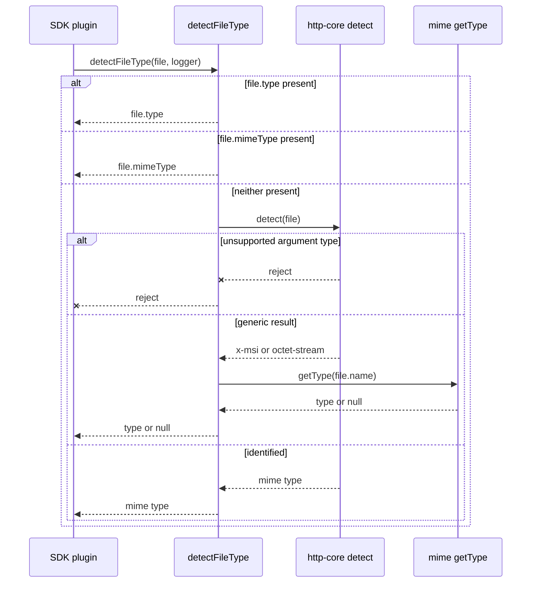
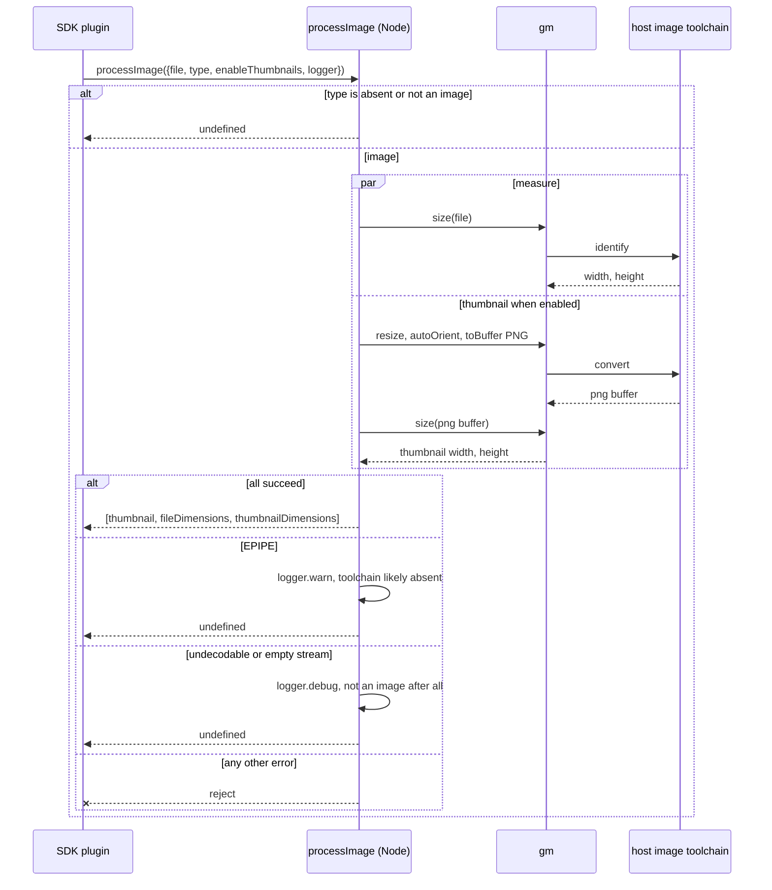
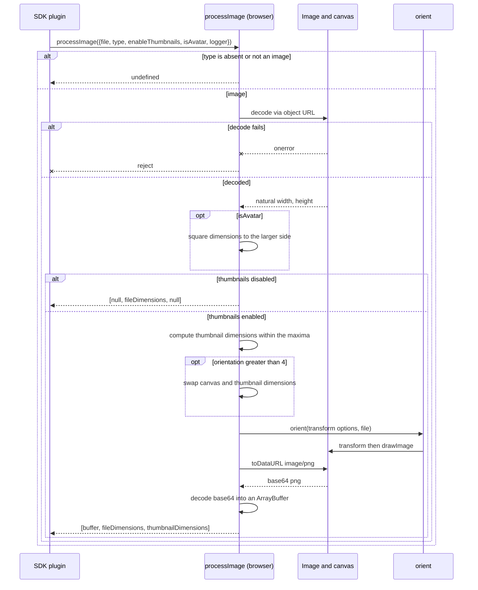
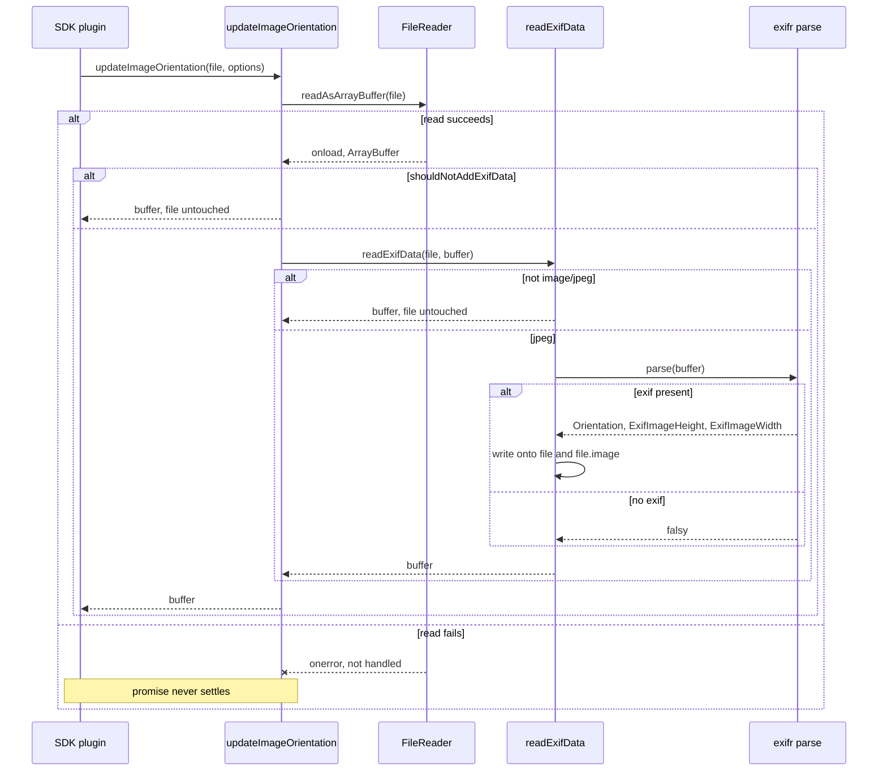
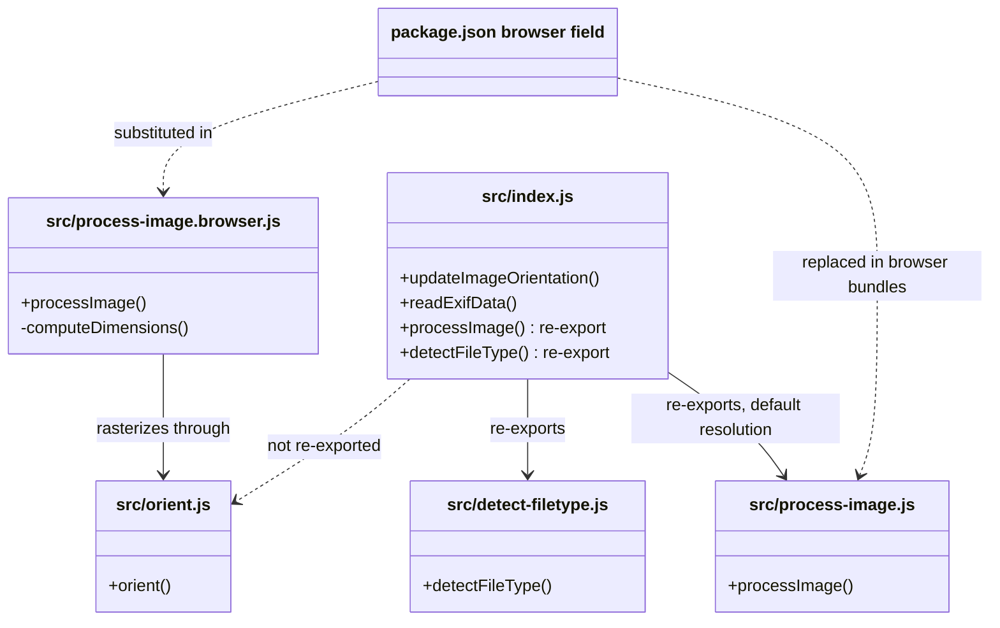

<!-- sdd-generated-metadata
doc_kind: module-spec
generated_from: module-spec@0.3.0
generated_by: claude-opus-5
approved_by: rarajes2@cisco.com
updated_at: 2026-09-28T14:57:53Z
validation_status: pass-with-warnings
-->

# Image helpers

This source-local document at `src/docs/README.md` owns the stable
specification for **the image helpers module**. Ground every claim in repository evidence
and link to the
[repository architecture](../../docs/architecture.md) instead of repeating broader facts. No service
specification applies: this package is a published library with no deployable service surface.

Related context: [documentation index](../../docs/index.md) ·
[repository agent instructions](../../AGENTS.md) ·
[specification registry](../../docs/specs/README.md)

## Metadata

| Field         | Value                                                        |
| ------------- | ------------------------------------------------------------ |
| Owner         | `@webex/web-client`                                          |
| Source path   | `src/`                                                       |
| Resource kind | module, and the whole of a published npm package             |
| Status        | Active                                                       |
| Last verified | 2026-09-28 at `a9bd3e8928`                                   |
| Module id     | `src/`                                                       |
| Parent spec   | —                                                            |
| Doc kind      | Module spec                                                  |
| Coverage score | 93% assessed 2026-09-28; all critical fields present, the one remaining gap is the absent characterization baseline |
| Validation status | pass-with-warnings: 1 Important warning (Yarn and host image-tool prerequisites not listed in manifest); assessed 2026-09-28 by validator runtime `current-session` |

## Applicability

Sections preceded by an `Include if` comment are conditional. Retain a
conditional section only when source evidence or a confirmed developer answer
satisfies its condition. Record `Unresolved` instead of guessing.

| Condition ID                         | Status | Evidence or reason | Owned section                 |
| ------------------------------------ | ------ | ------------------ | ----------------------------- |
| `module.has_tiers`                   | N/A    | No operational or review tier is recorded for this module in `package.json` | Tier                          |
| `module.has_ui`                      | N/A    | No components or screens; the browser path uses a detached canvas that is never mounted, per `src/process-image.browser.js` | UI use-case flow              |
| `module.crosses_service_boundaries`  | N/A    | No network call. MIME sniffing is local byte inspection and thumbnailing is a local subprocess, per `src/detect-filetype.js` and `src/process-image.js` | Cross-boundary use-case flow  |
| `module.holds_client_state`          | N/A    | Every export is a stateless function; the module retains nothing between calls, per `src/index.js` | Client state model            |
| `module.enforces_domain_rules`       | Applicable | Non-image short-circuit, identity-orientation guard, and avatar squaring are enforced in `src/process-image.js`, `src/orient.js`, and `src/process-image.browser.js` | Business rules and invariants |
| `module.is_concurrent_async`         | Applicable | Promise-based surface with concurrent measurement and thumbnail work in `src/process-image.js` and a callback-wrapped read in `src/index.js` | Concurrency and reactive flow |
| `module.owns_persistence`            | N/A    | No store, schema, or migration; `package.json` declares no persistence dependency | Data, schema, and migration   |
| `module.stateful_transitions`        | N/A    | No state machine; the functions in `src/index.js` have no transition logic | State machine                 |
| `module.exposes_wire_protocol`       | Applicable | Callers depend on EXIF orientation values 1–8 and on PNG-encoded thumbnail bytes, per `src/orient.js`, `src/process-image.js`, and `src/process-image.browser.js` | Protocol and wire format      |
| `module.ui_multi_screen`             | N/A    | Gated on the user-interface condition above, which is N/A | UI flow                       |
| `module.large_data_model`            | N/A    | Gated on the persistence condition above, which is N/A | Data model                    |
| `module.returns_caller_errors`       | Applicable | Rejections on unrecognized toolchain failures and on image load failure, per `src/process-image.js` and `src/process-image.browser.js` | Caller-visible failure modes  |
| `module.module_specific_conventions` | Applicable | Logger injection and bundler-driven file substitution, per `src/detect-filetype.js`, `package.json`, and `process` | Module-specific rules         |
| `module.published_package`           | Applicable | Published to npm; entry points and the browser substitution are declared in `package.json` | Export stability              |
| `module.embedded_in_host`            | N/A    | Consumed as an ordinary library dependency per `package.json`, not mounted into a host | Host integration and theming  |
| `module.has_design_tradeoff`         | Applicable | Dual-runtime split, in-place file mutation, and silent degradation, per `package.json`, `src/index.js`, and `src/process-image.js` | Key design trade-off          |
| `module.has_submodules`              | N/A    | Computed by the module-tree resolver from the accepted module tree; the module has no child modules, and `src/index.js` is its only entry | Sub-modules                   |

## Evidence register

List the code, tests, schemas, configuration, and prior decisions used to
verify this specification. Mark any unresolved statement explicitly as needing human input rather
than inferring missing behavior; nothing in this specification is unresolved at the verified commit.

| Evidence | What it establishes |
| -------- | ------------------- |
| `src/index.js` | The four exported functions, the EXIF read path, and that `readExifData` mutates the caller's file and returns the buffer unchanged |
| `src/detect-filetype.js` | The three-step MIME resolution order and the extension-lookup fallback for generic sniff results |
| `src/process-image.js` | The Node measurement and thumbnail path, the positional result triple, and the three tolerated toolchain failures |
| `src/process-image.browser.js` | The browser measurement and thumbnail path, avatar squaring, dimension computation, and the orientation-driven canvas swap |
| `src/orient.js` | The EXIF orientation transform table for values 2–8 and the identity guard |
| `test/unit/spec/index.js` | Verified transform matrix for all eight orientation values, and that the EXIF cases are currently disabled |
| `package.json` | Entry points, the `browser` field substitution, dependencies, the Node floor, and every build and test command |
| `process` | The legacy `{browser: true}` declaration for bundlers that resolve `process` to a repository-local module |
| `README.md` | Reference-only consumer documentation. It is the only source for the stated rationale of `shouldNotAddExifData`, and it is incomplete and partly inaccurate about the public surface |
| `jest.config.js` | That a Jest configuration is present although no script invokes it |

Prior documentation basis: one reference-only consumer readme was reviewed as context under the
`keep-separate` source policy. Nothing was migrated from it, and it remains unchanged.

## Purpose and boundary

- Responsibility: given an image file and a logger, determine what the file is, read its EXIF
  orientation onto it, and measure and thumbnail it for the runtime in use.
- In scope: MIME type resolution; EXIF orientation and EXIF dimension extraction for JPEGs; image
  size measurement; PNG thumbnail generation; the EXIF orientation transform applied when rasterizing
  a browser thumbnail.
- Out of scope: reading or writing files, network transfer, encryption, upload session management, and
  retry policy. All of those belong to the consuming SDK plugin. The module also does not decode image
  containers itself; it delegates to `exifr`, the platform decoder, or the host image toolchain.
- Consumers: Webex SDK plugins that prepare files for upload — the conversation share activity and the
  avatar upload path — plus external consumers who install the published package. `orient` is internal:
  it is not re-exported from `src/index.js`, and only the browser implementation and the unit suite
  import it.
- Configuration and rollout: none. The module reads no environment variable, configuration file, or
  feature flag, so it has no rollout surface of its own. Behavior varies along exactly two axes:
  per-call options the caller passes (`shouldNotAddExifData`, `enableThumbnails`, `isAvatar`, and the
  thumbnail maxima), and the implementation the bundler selects at build time through the `browser`
  field in `package.json`.

## Structure and key files

| Path | Responsibility |
| ---- | -------------- |
| `src/index.js` | The package entry. Declares `updateImageOrientation` and `readExifData`, and re-exports `processImage` and `detectFileType` as the package's public surface. |
| `src/detect-filetype.js` | Resolves a file's MIME type, preferring metadata the caller already has over byte inspection. |
| `src/process-image.js` | The Node implementation of `processImage`. Authoritative for the result shape and for which toolchain failures are tolerated. |
| `src/process-image.browser.js` | The browser implementation of `processImage`. Authoritative for thumbnail dimension computation, avatar squaring, and the canvas orientation swap. |
| `src/orient.js` | The EXIF orientation transform table. Authoritative for how each orientation value maps to a canvas transform. |
| `test/unit/spec/index.js` | The whole unit suite, executed by both the Mocha and Karma runners. |
| `package.json` | Declares the entry points and the `browser` field substitution that selects between the two `processImage` implementations, so it is part of the public contract rather than only build configuration. |
| `process` | Declares `{browser: true}` for legacy bundlers that resolve `process` to a repository-local module. |

## Public surface

Describe exported APIs, events, commands, files, or UI boundaries. Link exact
schemas or declarations instead of copying them.

| Surface | Consumer | Compatibility commitment | Source |
| ------- | -------- | ------------------------ | ------ |
| `updateImageOrientation` | SDK plugins and external npm consumers | Published. Takes a file and an options object; resolves to the file's bytes as a Buffer. Browser-only in practice, because it constructs a `FileReader`. | `src/index.js` |
| `readExifData` | SDK plugins and external npm consumers | Published. Takes a file and its buffer; mutates the file in place and resolves the same buffer. The mutation is the contract. | `src/index.js` |
| `processImage` | SDK plugins and external npm consumers | Published. Takes one options object; resolves to a positional triple or to undefined. Two implementations, substituted by the bundler. | `src/process-image.js` |
| `detectFileType` | SDK plugins and external npm consumers | Published. Takes a file and a logger; resolves to a MIME type string, or `null` when neither sniffing nor extension lookup yields one. | `src/detect-filetype.js` |
| Entry points and browser substitution | Bundlers and consumers | Published. `main`, `devMain`, and the `browser` map are the resolution contract; changing the map changes which implementation a browser consumer receives. | `package.json` |
| `orient` | Internal to this module | Not published. Not re-exported from the package entry; imported by the browser implementation and, through a relative path, by the unit suite. | `src/orient.js` |

Exact parameter and return declarations stay in the linked sources and their JSDoc. Note that
`README.md` documents `orient` as though it were part of the package surface; it is not.

## Dependencies

| Dependency | Why it is required | Failure behavior |
| ---------- | ------------------ | ---------------- |
| `@webex/http-core` (`detect`) | Magic-byte MIME sniffing when the caller supplied no type | Rejects when handed anything other than a Blob, ArrayBuffer, or Uint8Array; the rejection propagates to the caller of `detectFileType` |
| `exifr` (lite UMD build) | Reads EXIF orientation and dimensions from JPEG bytes | Absent EXIF data yields a falsy result and the file is left unmodified; a parse rejection propagates |
| `gm` plus a host GraphicsMagick or ImageMagick binary | Node-side size measurement and PNG thumbnail encoding | A missing binary surfaces as an EPIPE error string, is logged as a warning, and resolves undefined instead of rejecting |
| `mime` (`getType`) | Extension-based fallback when sniffing returns a generic type | Returns `null` for an unrecognized extension, and that `null` becomes the resolved value |
| `lodash` (`pick`) | Extracts width and height from measurement results | No failure path |
| `safe-buffer` | Constructs a Buffer from the ArrayBuffer produced by `FileReader` | No failure path |
| DOM platform APIs | Browser-side byte reading, decoding, rasterization, and base64 conversion | Assumed present, with no feature detection. A decode failure rejects through `img.onerror`; a `FileReader` failure is not handled at all |

## Requirements

Separate source evidence, test/example evidence, assumptions, and gaps so a
future contributor can distinguish verified behavior from approved unknowns.

| ID | WHAT | WHY | Source evidence | Test or example evidence | Assumptions or gaps | Confidence |
| --- | --- | --- | --- | --- | --- | --- |
| `MOD-001` | The package exposes exactly four functions: `updateImageOrientation`, `readExifData`, `processImage`, `detectFileType` | This is the published compatibility boundary; external consumers install the package and compile against these names | `src/index.js` | `test/unit/spec/index.js` imports two of the four from the package entry | `processImage` and `detectFileType` have no test that imports them from the package entry | Present |
| `MOD-002` | `detectFileType` returns an existing `type`, then an existing `mimeType`, and only sniffs bytes when neither is present | Callers frequently already hold authoritative metadata; re-sniffing would be slower and could disagree with the caller | `src/detect-filetype.js` | none found | No test covers any branch of this function | Weak |
| `MOD-003` | When sniffing yields `application/x-msi` or `application/octet-stream`, the type is resolved from the filename extension instead | Those two results mean the sniffer could not identify the bytes, so the extension is better evidence than a generic answer | `src/detect-filetype.js` | none found | The fallback can resolve `null`, and that `null` is returned to the caller as the type | Weak |
| `MOD-004` | EXIF data is read only when the file reports `image/jpeg`, through either `type` or `mimeType` | Only JPEGs carry the EXIF orientation this module acts on, and the two property names occur in different SDK paths: avatars set `type` while activity files set `mimeType` | `src/index.js` | none found; the covering cases are disabled | The dual-property check is explained by a comment in the source, not by a test | Present |
| `MOD-005` | `readExifData` writes `orientation`, `exifHeight`, and `exifWidth` onto the file, mirrors `orientation` onto `file.image` when present, and resolves the buffer unchanged | Downstream code reads orientation from the file object rather than from a return value, so the side effect is the interface | `src/index.js` | `test/unit/spec/index.js` asserts the mutation and the unchanged buffer, but those cases are disabled | The EXIF path has no executing test | Present |
| `MOD-006` | `updateImageOrientation` skips EXIF attachment when `options.shouldNotAddExifData` is set | Some clients run in browsers that already auto-orient images, so attaching orientation would double-apply it | `src/index.js` | `test/unit/spec/index.js` asserts orientation stays undefined when the flag is set | The rationale is stated only in `README.md`, not in code | Present |
| `MOD-007` | `processImage` resolves undefined when the file is not an image | The function is called on every upload regardless of type, so non-images must pass through cheaply rather than error | `src/process-image.js` | none found | Neither implementation has a test for this branch. The two disagree on how the type is determined: see `MOD-014` | Present |
| `MOD-008` | `processImage` resolves the positional triple `[thumbnail, fileDimensions, thumbnailDimensions]` | Consumers index this array directly, so its order and arity are the contract | `src/process-image.js` | none found | Consumers index position 0 for the thumbnail buffer. The empty-slot value differs between implementations: see `MOD-009` | Present |
| `MOD-009` | Thumbnails are produced only when `enableThumbnails` is set; otherwise the thumbnail and its dimensions are empty | Thumbnail generation is the expensive part of the call and not every upload surface displays one | `src/process-image.js` | none found | The empty value differs by runtime: Node leaves both slots `undefined`, the browser sets them to `null`. A consumer distinguishing the two would behave differently per runtime | Present |
| `MOD-010` | The Node path tolerates exactly three failures — a missing host toolchain seen as EPIPE, an undecodable format, and an empty stream — resolving undefined; every other error rejects | An image helper must not break an upload because the host lacks an optional binary or the file was mislabeled, but genuine faults must still surface | `src/process-image.js` | none found | Detection is by substring match on the error text, so a wording change in the toolchain or wrapper would turn a tolerated case into a rejection | Present |
| `MOD-011` | `orient` applies a transform only when the file declares an orientation other than 1, and always draws the image | Orientation 1 means no transform is required, and the draw must happen either way or the canvas would stay blank | `src/orient.js` | `test/unit/spec/index.js` asserts the exact transform matrix for all eight values and the draw for each | The guard reads `file.orientation` while the transform switches on `options.orientation`; see `INV-004` | Present |
| `MOD-012` | In the browser, a thumbnail whose orientation exceeds 4 swaps the canvas and reported thumbnail dimensions | Orientations 5 to 8 rotate by 90 degrees, so width and height exchange roles | `src/process-image.browser.js` | none found | The draw still uses the pre-swap width and height captured before the swap; see `INV-005` | Present |
| `MOD-013` | `isAvatar` squares the reported file dimensions to the larger side | Avatars are rendered in a square frame, so both dimensions are reported as the longer side | `src/process-image.browser.js` | none found | Honored only by the browser implementation; the Node implementation does not accept the option at all | Present |
| `MOD-014` | A browser bundle receives the browser implementation of `processImage` through the `browser` field, covering both source and built paths | Canvas code cannot run in Node and the image toolchain cannot run in a browser, so the choice is made at bundle time rather than at runtime | `package.json` | none found | No test asserts the substitution. The two implementations also differ in type resolution: Node falls back to `file.type` when no `type` argument is passed, the browser does not | Present |

## Design overview

The module is a flat set of functions behind one entry file. There is no class, no container, and no
retained state: `src/index.js` declares two functions and re-exports two more, and every call is
self-contained.

Two structural decisions explain the rest of the shape.

The first is the runtime split. Measuring and thumbnailing is the only concern that cannot be written
once for both targets, so it is the only concern that exists twice. `src/process-image.js` drives a
host binary through `gm`; `src/process-image.browser.js` decodes into an `Image`, draws onto a
detached canvas, and reads the canvas back as base64 before converting it to an `ArrayBuffer` byte by
byte. The `browser` field in `package.json` selects between them, which keeps each bundle free of the
other's machinery but also means the two files can drift apart without any build or test failing.
They have: the differences are recorded in `MOD-007`, `MOD-009`, `MOD-013`, and `MOD-014`, and treated
as a trade-off below.

The second is that orientation results travel on the caller's object rather than in a return value.
`readExifData` writes `orientation`, `exifHeight`, and `exifWidth` onto the file it is given and hands
back the same buffer it received. `src/process-image.browser.js` then reads `file.orientation` back
off that object when it rasterizes. So the two halves of the orientation feature communicate through a
mutated caller-owned object, which is why the module can stay stateless while still behaving as though
it remembers something.

State ownership is therefore entirely external. The module owns the transform table in `src/orient.js`
and the dimension arithmetic in `src/process-image.browser.js`; everything else it touches belongs to
the caller.

## Data flow and sequence coverage

The transport is in-process function calls in every case but one: the Node thumbnail path, which
crosses into a child process over stdio through `gm`. There are three major operation groups, kept
separate because their actors, ordering, and failure behavior all differ.

| Operation group | Entry and outcome | Diagram or evidence | Failure and recovery coverage |
| --------------- | ----------------- | ------------------- | ----------------------------- |
| Type resolution | `detectFileType` in, a MIME type string or `null` out | `src/detect-filetype.js` | Sniffer rejection on an unsupported argument type propagates; a generic sniff result falls back to extension lookup, which may yield `null` |
| Measure and thumbnail | `processImage` in, a positional triple or undefined out | `src/process-image.js` and `src/process-image.browser.js` | Node: three tolerated failures resolve undefined, all others reject. Browser: a decode failure rejects |
| EXIF orientation | `updateImageOrientation` or `readExifData` in, a buffer out and the file mutated | `src/index.js` | Non-JPEG and absent EXIF leave the file unmodified; a `FileReader` error leaves the promise unsettled |

Type resolution, showing both fallbacks:

Measure and thumbnail on Node, including the degradation branches:

Measure and thumbnail in the browser, including the orientation swap and the decode failure:

EXIF orientation, including the unsettled-promise path:

## Class and component relationships

There are no classes. The relationships that matter are which module owns which function and which
selection happens at bundle time rather than at runtime.

`src/index.js` statically re-exports `./process-image`, so the Node file is the default resolution and
the browser file reaches consumers only through the `browser` field substitution. `orient` is reachable
from the browser implementation and from the unit suite's relative import, never from the package
entry.

## Use cases and flows

| Use case | Actor or caller | Primary steps and outcome | Failure or boundary behavior | Evidence |
| --- | --- | --- | --- | --- |
| `UC-001` | SDK plugin preparing a shared file | Resolve the MIME type, then measure and thumbnail the file; pass the triple on to encryption and upload | A non-image resolves undefined, and the caller proceeds without image metadata | `src/detect-filetype.js`, `src/process-image.js` |
| `UC-002` | SDK plugin uploading an avatar | Resolve the type, then call with `isAvatar` so reported dimensions are squared | Squaring is applied in the browser only; under Node the option is ignored and unsquared dimensions are returned | `src/process-image.browser.js` |
| `UC-003` | Client displaying a downloaded JPEG | Read the file's bytes, then attach EXIF orientation to the file object so it can be displayed upright | Non-JPEG or absent EXIF leaves the file unmodified; a read failure leaves the promise unsettled | `src/index.js` |
| `UC-004` | Client in a browser that auto-orients images | Read the bytes with `shouldNotAddExifData` so orientation is not applied twice | The file is returned unmutated and no EXIF parse occurs | `src/index.js`, `test/unit/spec/index.js` |
| `UC-005` | Browser thumbnailing a rotated photo | Compute thumbnail dimensions, swap them when the orientation exceeds 4, apply the transform, and read back a PNG | The draw uses the pre-swap dimensions, so a rotated thumbnail's drawn region and its reported dimensions are derived differently | `src/process-image.browser.js`, `src/orient.js` |
| `UC-006` | Node host without an image toolchain | Call `processImage` and receive undefined after a warning | Degradation is silent to the caller beyond the log line; uploads continue without a thumbnail | `src/process-image.js` |
| `UC-007` | Caller passing a non-Blob buffer in the browser | The buffer is wrapped in a Blob before decoding | A caller relying on Node's `type || file.type` fallback gets undefined instead, because the browser path requires an explicit `type` | `src/process-image.browser.js` |

## Business rules and invariants

| ID | Invariant | WHY | Enforcement source | Test evidence |
| --- | --- | --- | --- | --- |
| `INV-001` | A file that is not an image never reaches measurement or thumbnailing | The helper is called on every upload, so non-images must be cheap and side-effect free | `src/process-image.js` | none found |
| `INV-002` | EXIF is parsed only for `image/jpeg`, recognized through either `type` or `mimeType` | Only JPEGs carry the orientation tag, and the two property names occur in different SDK paths | `src/index.js` | `test/unit/spec/index.js`, currently disabled |
| `INV-003` | Orientation 1 applies no transform, and every orientation still draws the image | Orientation 1 is the identity case; skipping the draw would leave the canvas blank | `src/orient.js` | `test/unit/spec/index.js` |
| `INV-004` | The transform is applied only when the file declares a non-identity orientation, but the transform chosen is the one named in the options | The guard and the selector read different objects, so a caller that sets them inconsistently gets a transform from one and permission from the other | `src/orient.js` | `test/unit/spec/index.js` sets both to the same value, so the divergence is unexercised |
| `INV-005` | Thumbnail dimensions reported for an orientation above 4 are swapped relative to the computed fit | A 90-degree rotation exchanges width and height | `src/process-image.browser.js` | none found |
| `INV-006` | A tolerated Node toolchain failure resolves undefined and never rejects | An upload must not fail because an optional host binary is missing or a file was mislabeled | `src/process-image.js` | none found |
| `INV-007` | `readExifData` returns the buffer it was given, unchanged | Callers chain on the buffer while reading orientation from the mutated file, so the buffer must pass through untouched | `src/index.js` | `test/unit/spec/index.js`, currently disabled |

## Concurrency and reactive flow

- Execution model: promise-based on the host event loop. The Node path additionally runs one child
  process per image operation through `gm`; the browser path uses platform callbacks (`FileReader.onload`,
  `Image.onload`) wrapped into promises.
- Ordering guarantees: on Node, size measurement and thumbnail generation are started together and
  awaited as a group, so they run concurrently and their relative completion order is unspecified. The
  thumbnail's own dimension measurement is chained after the thumbnail buffer, so that pair is ordered.
  In the browser everything is strictly sequential after the single decode.
- Idempotency and retry: every function is idempotent for a given input, with one exception —
  `readExifData` mutates the file it is given, so calling it twice rewrites the same properties rather
  than accumulating. The module performs no retry; the consuming plugin owns retry policy.
- Shared-state protection: none is needed inside the module, because it holds no shared state. The one
  mutable object it writes to is the caller's file, which is unsynchronized: two concurrent
  `readExifData` calls on the same file object would race on `orientation`, `exifHeight`, and
  `exifWidth`.
- Blocking restrictions: the browser path runs decode, canvas rasterization, and a byte-by-byte base64
  conversion on the main thread, and the conversion is linear in the thumbnail's byte length. It must
  not be called on large images in a latency-sensitive frame. The Node path does no synchronous work of
  consequence, because the toolchain runs out of process.

## Protocol and wire format

| Message or frame | Version | Producer or serializer | Consumer or parser | Compatibility and ordering rule |
| --- | --- | --- | --- | --- |
| EXIF orientation value | EXIF orientation tag, values 1 through 8 | The camera or authoring tool that wrote the JPEG | `src/index.js` reads it; `src/orient.js` maps it to a canvas transform | Values 2 through 8 map to fixed transforms and 1 is the identity. Any other value falls through the switch and applies no transform while still drawing |
| Thumbnail bytes | PNG | `src/process-image.js` encodes through the host toolchain; `src/process-image.browser.js` encodes through a canvas data URL | The consuming SDK plugin, which encrypts and uploads the bytes | PNG in both runtimes, but the carrier type differs: Node yields a Buffer and the browser an ArrayBuffer |
| Result triple | Positional array of three elements | Both `processImage` implementations | The consuming SDK plugin, which indexes position 0 for the thumbnail | Order and arity are fixed. Empty slots are `undefined` on Node and `null` in the browser, so a consumer must not distinguish the two |

The EXIF transform matrix in `src/orient.js` is the module's most precise wire-format commitment, and
it is the one part of the module that `test/unit/spec/index.js` verifies exhaustively: all eight values
are asserted against their exact transform arguments.

## Caller-visible failure modes

| Condition | Signal or result | Caller behavior | Retry or recovery | Evidence |
| --- | --- | --- | --- | --- |
| Input is not an image | Resolves undefined | Proceed without image metadata or a thumbnail | None; the outcome is deterministic | `src/process-image.js` |
| Host image toolchain missing on Node | Resolves undefined, after a warning naming GraphicsMagick | Proceed without a thumbnail | Install the toolchain; the module does not retry | `src/process-image.js` |
| Bytes are undecodable or the stream is empty on Node | Resolves undefined, after a debug log | Treat the file as a non-image | None | `src/process-image.js` |
| Any other Node toolchain error | Rejects with the underlying error | Handle or propagate | Caller's choice | `src/process-image.js` |
| Image fails to decode in the browser | Rejects with the `Image` error event | Handle or propagate | Caller's choice | `src/process-image.browser.js` |
| Sniffing receives an unsupported argument type | Rejects from the sniffer | Fix the argument type at the call site | None | `src/detect-filetype.js` |
| Extension is unrecognized after a generic sniff | Resolves `null` as the type | Must tolerate a null type, since it is not an error | None | `src/detect-filetype.js` |
| `FileReader` fails in `updateImageOrientation` | Neither resolves nor rejects | The awaiting promise hangs | No recovery inside the module; the caller needs its own timeout | `src/index.js` |

## Pitfalls and constraints

- The two `processImage` implementations differ in ways no test or build catches, and every difference
  is caller-visible. The Node path falls back to `file.type` when no `type` argument is given and the
  browser path does not; the browser honors `isAvatar` and Node ignores it; disabled thumbnails leave
  `undefined` slots on Node and `null` slots in the browser. Change one file and you have changed the
  package on one runtime only.
- `readExifData` mutates the object it is handed. Passing a shared or frozen object, or calling it
  concurrently on the same file, is unsafe. The return value is the buffer, not the file, so code that
  expects the mutated file back gets bytes instead.
- `updateImageOrientation` registers no `FileReader` error handler, so a read failure leaves its promise
  permanently unsettled rather than rejecting. Callers that must not hang need their own timeout.
- The Node degradation branches match on substrings of error text. A wording change in `gm` or in the
  host toolchain would silently convert a tolerated failure into a rejection.
- `orient` guards on `file.orientation` but switches on `options.orientation`. The browser caller passes
  the same value into both, and the unit suite does too, so the divergence is invisible today and would
  only surface for a direct caller that set them differently.
- `detectFileType` can resolve `null`, because the extension fallback returns `null` for an unknown
  extension. Treat a null type as a normal outcome, not an error.
- In the browser, the base64-to-`ArrayBuffer` conversion copies one byte at a time on the main thread,
  so its cost grows with thumbnail size.
- Do not run the package's `test` script: it chains `yarn test:integration`, which `package.json` does
  not define, so the aggregate fails before reaching the browser tier. Run `test:unit`, `test:style`,
  and `test:browser` individually.
- `test:unit` alone does not execute the whole suite. The `updateImageOrientation` cases are gated to
  `browserOnly` and the `readExifData` cases are disabled with `xdescribe`, so the EXIF path has no
  executing coverage in either runner.
- `jest.config.js` is present and would match the unit spec, but no script invokes Jest. Mocha and Karma
  through `@webex/legacy-tools` are the real runners.
- The log line in the `mimeType` branch of `detectFileType` interpolates `file.type`, which is falsy on
  that branch, so it reports the mime type as `undefined`. The returned value is correct; only the log
  text is wrong.

## Module-specific rules

- Do: accept the logger as a parameter or option and use only that instance. Every logging site in the
  module does this, which is what lets the SDK route package logs through the host client's logger.
  Evidence: `src/detect-filetype.js`, `src/process-image.js`, `src/process-image.browser.js`.
- Do: keep any runtime-specific work inside `src/process-image.js` or `src/process-image.browser.js`,
  and keep the shared files free of platform globals. `package.json` selects between those two files and
  nothing else, so platform code anywhere else escapes the substitution.
- Do: when changing one `processImage` implementation, change the other in the same edit or record
  deliberately why the behavior now differs.
- Do not: import a logger into this module, or log image bytes or file contents.
- Do not: add a runtime `typeof window` or similar environment check to pick a behavior. The `browser`
  field in `package.json` is the mechanism, and a runtime check would bypass it and ship both paths into
  every bundle.
- Do not: re-export `orient` from `src/index.js`. It is internal, and exporting it would widen the
  published surface to a canvas-specific helper. Note that `README.md` already describes it as public;
  that readme is reference-only and wrong on this point.
- Do not: edit the `process` file's `{browser: true}` declaration without checking legacy bundler
  resolution, since it exists to satisfy bundlers that resolve `process` to a repository-local module.

## Export stability

| Export or entry point | Consumer | Stability | Versioning and deprecation rule | Declaration or API report |
| --- | --- | --- | --- | --- |
| `updateImageOrientation` | SDK plugins and external npm consumers | Published and stable | Breaking change requires a coordinated workspace release | `src/index.js` |
| `readExifData` | SDK plugins and external npm consumers | Published and stable, including its in-place mutation | Breaking change requires a coordinated workspace release | `src/index.js` |
| `processImage` | SDK plugins and external npm consumers | Published and stable in name and result shape; behavior differs by runtime | A change to one implementation alone still changes the published behavior on that runtime | `src/process-image.js` |
| `detectFileType` | SDK plugins and external npm consumers | Published and stable, including the possibility of a `null` result | Breaking change requires a coordinated workspace release | `src/detect-filetype.js` |
| `main` and `devMain` | Bundlers and consumers | Published | `main` serves the built artifact and `devMain` the sources for workspace development | `package.json` |
| `browser` field map | Bundlers and browser consumers | Published | Part of the contract, not build configuration: it decides which `processImage` a browser consumer receives, for both source and built paths | `package.json` |
| `orient` | Internal only | Not published | May change without a release note; it is not re-exported from the package entry | `src/orient.js` |

The package ships no `.d.ts` and no API report, so `package.json` together with the JSDoc in
`src/index.js` is the ecosystem-native declaration of this surface.

## Key design trade-off

| Chosen trade-off | Preserved invariant or benefit | Cost or limitation | Decision evidence |
| --- | --- | --- | --- |
| Two `processImage` implementations selected by the bundler rather than one with a runtime branch | Browser bundles carry no image-toolchain code and Node carries no canvas code; each path can use the idioms natural to its runtime | The two can drift with no build or test failure, and they have: type fallback, `isAvatar` support, and the empty-slot value all differ | `package.json`, `src/process-image.js`, `src/process-image.browser.js` |
| EXIF results are written onto the caller's file object rather than returned | The orientation read and the later rasterization can communicate without the module holding state, and callers already treat the file as the carrier for metadata | The public contract includes mutating an argument, which makes the functions unsafe on shared or frozen objects and unsafe to call concurrently on one file | `src/index.js`, `src/process-image.browser.js` |
| A missing host image toolchain degrades to an undefined result rather than a rejection | A file upload is never broken by the absence of an optional host binary | The failure is nearly silent — one warning line — so a misconfigured host can go unnoticed while every thumbnail is quietly skipped, and detection relies on matching error text | `src/process-image.js` |
| `shouldNotAddExifData` lets callers opt out of orientation attachment | Browsers that already auto-orient images do not apply the rotation twice | A second, caller-selected code path through the same function, whose rationale is recorded only in the consumer readme | `src/index.js`, `README.md` |

None of these four is recorded as an accepted decision. All four are consumer-visible, and the first and
third are listed in [`../../docs/adr/index.md`](../../docs/adr/index.md) as candidates for the package's
first ADRs.

## Verification

| Requirement or invariant | Test level | Positive evidence | Negative or boundary evidence | Gap |
| --- | --- | --- | --- | --- |
| `MOD-001` | Unit | `test/unit/spec/index.js` imports two exports from the package entry | none found | `processImage` and `detectFileType` are never imported from the package entry in a test |
| `MOD-002` | Unit | none found | none found | No test exercises any branch of `detectFileType` |
| `MOD-003` | Unit | none found | none found | The generic-sniff fallback and its `null` result are untested |
| `MOD-004`, `INV-002` | Unit | `test/unit/spec/index.js` asserts orientation is read for a JPEG | none found | The cases are disabled with `xdescribe`, so nothing executes; no non-JPEG case exists |
| `MOD-005`, `INV-007` | Unit | `test/unit/spec/index.js` asserts the mutation and the unchanged buffer | none found | Disabled with `xdescribe`; the absent-EXIF branch is untested |
| `MOD-006` | Unit, browser runner only | `test/unit/spec/index.js` asserts orientation stays undefined when the flag is set, and is attached when it is not | none found | Executes only under `test:browser`; no case covers a `FileReader` failure |
| `MOD-007`, `INV-001` | Unit | none found | none found | The non-image short-circuit is untested in both implementations |
| `MOD-008`, `MOD-009` | Unit | none found | none found | Neither the triple's shape nor the differing empty-slot values are tested |
| `MOD-010`, `INV-006` | Unit | none found | none found | None of the three tolerated failures, nor the rejecting default, is tested |
| `MOD-011`, `INV-003` | Unit | `test/unit/spec/index.js` asserts the exact transform arguments for orientations 2 through 8 and the draw for each | `test/unit/spec/index.js` asserts orientation 1 applies no transform and still draws | None; this is the module's fully covered behavior |
| `INV-004` | Unit | none found | none found | The suite sets `options.orientation` and `file.orientation` to the same value, so the guard-versus-selector divergence is unexercised |
| `MOD-012`, `INV-005` | Unit | none found | none found | The canvas and dimension swap above orientation 4 is untested |
| `MOD-013` | Unit | none found | none found | Avatar squaring is untested, and its absence from the Node implementation is unguarded |
| `MOD-014` | Build | none found | none found | No test or build assertion covers the `browser` field substitution or the divergence between the two implementations |

Record coverage gaps explicitly and link follow-up work. A module specification
is complete only when its public surface, invariants, failure modes, and test
evidence agree with the implementation.

The gaps above are concentrated rather than scattered: `src/orient.js` is exhaustively verified, and
almost nothing else is. The EXIF path has assertions that do not run, and `detectFileType` and both
`processImage` implementations have no tests at all. A characterization baseline pinning the current
behavior of `processImage` on both runtimes, and of `detectFileType`, is required before any risky
modification to this module.
