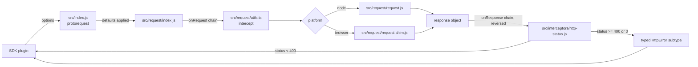
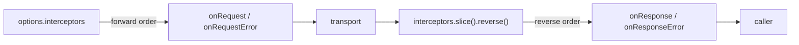
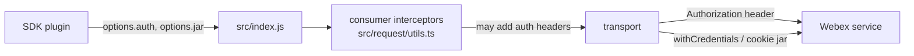

<!-- sdd-generated-metadata
doc_kind: standing-doc
generated_from: architecture@0.3.0
generated_by: claude-code
approved_by: pending
updated_at: 2026-09-23T06:29:48Z
validation_status: pass-with-warnings
-->

# @webex/http-core architecture

Canonical repository-wide architecture for the core HTTP client of the Webex JS SDK. This document
owns facts that span the package's modules. Link to the owning module, ADR, or native contract
instead of duplicating owner-local detail.

Related context: [specification registry](specs/README.md) ·
[repository agent instructions](../AGENTS.md)

## Applicability

Sections preceded by an `Include if` comment are conditional. Retain a
conditional section only when repository evidence satisfies its condition.

| Condition ID                         | Status     | Evidence or reason                                                                 | Owned section                       |
| ------------------------------------ | ---------- | ---------------------------------------------------------------------------------- | ----------------------------------- |
| `repo.owns_datastore`                | N/A        | No datastore, ORM, migration directory, or connection configuration; `package.json` declares no database dependency | Repository data and schema          |
| `repo.holds_client_state`            | N/A        | No state-store library; the only stateful objects are per-request emitters created in `src/request/index.js` and discarded with the request | Client state model                  |
| `repo.components_interact`           | Applicable | `src/index.js` composes the interceptor chain executed in `src/request/utils.ts`, and transports emit progress on caller-held emitters | Dependency and interaction topology |
| `repo.domain_data_across_components` | N/A        | The package owns no domain entities; it transports caller-supplied payloads        | Object and data ownership           |
| `repo.caches_data`                   | N/A        | No cache layer, TTL, or memoization exists in `src/`                               | Caching catalog                     |
| `repo.observability_convention`      | Applicable | Injectable logger plus the `ENABLE_VERBOSE_NETWORK_LOGGING` gate in `src/lib/interceptor.js`, and the level-differentiated logging in `src/request/request.shim.js` | Observability patterns              |
| `repo.deploys_to_infra`              | N/A        | Published library with no deployment descriptor, container, or runtime entry point; `package.json` exposes only build, test, and publish scripts | Runtime and infrastructure          |
| `repo.shared_base_libs`              | Applicable | ESLint, Babel, and Jest configuration are all inherited from workspace config packages via `.eslintrc.js`, `babel.config.js`, `jest.config.js` | Shared and base libraries           |
| `repo.is_monorepo`                   | N/A        | The onboarding scope is this single package with one build root; the surrounding workspace is external context | Package map and dependencies        |
| `repo.multi_platform`                | Applicable | `package.json` swaps the Node transport for the browser shim; `src/request/request.js` and `src/request/request.shim.js` | Platform matrix                     |
| `repo.published_package`             | Applicable | `package.json` declares `main`, `browser`, and a `deploy:npm` script                | Release and versioning              |
| `repo.embedded_in_host`              | N/A        | Consumed as a dependency, not mounted into a host application                       | Host integration and theming        |
| `repo.exposes_commands_or_artifacts` | N/A        | No CLI binary, generator, or stable file output; `package.json` declares no `bin`   | Commands and generated artifacts    |
| `repo.cross_repo_deps_material`      | N/A        | Every internal dependency resolves inside the same workspace; the rest are public npm packages per `package.json` | Cross-repository topology           |
| `repo.security_arch_warranted`       | Applicable | The package constructs `Authorization` headers and controls cookie credentials in `src/request/request.shim.js` and `src/request/request.js` | Security architecture               |

## Design overview

`@webex/http-core` is the single network boundary for the Webex JS SDK. Every other SDK plugin that
talks to a Webex service does so through the `request` client this package exports from
`src/index.js`. Its architectural job is to take a loosely-typed options object, run it through an
ordered chain of caller-supplied interceptors, hand it to whichever transport is correct for the
current platform, and run the result back through the same chain in reverse.

Three decisions shape everything else:

**The public API deliberately mirrors the `request` npm library.** `src/request/request.js` passes
its options object to that library largely unchanged, which is why option names such as `qs`, `jar`,
`auth`, `form`, and `formData` appear on the public surface. The browser transport in
`src/request/request.shim.js` then has to reproduce that same option vocabulary on top of
`XMLHttpRequest` by hand — `setAuth`, `setCookies`, `setQs`, and `setPayload` exist to translate it.
This keeps one API across platforms at the cost of a translation layer that must be kept in sync.

**Client configuration is built by currying, not by class construction.** `src/index.js` curries
`protorequest` so that `defaults(options)` returns a new client with those options baked in, and the
package's own `request` export is simply `protorequest` pre-applied with `json: true` and a default
`HttpStatusInterceptor`. A consumer layering its own defaults gets a plain function, not an object
to configure.

**Failures are normalized into responses before they are turned into errors.** Neither transport
rejects on a network failure; both resolve a synthetic response carrying `statusCode: 0`. Rejection
happens in exactly one place, `src/interceptors/http-status.js`, which selects a typed error class
from the status code. That keeps every failure — transport-level, CORS, or HTTP status — flowing
through the same interceptor path, so an interceptor's `onResponseError` handler sees all of them.

## Resource inventory and responsibilities

| Resource      | Kind    | Responsibility                                                                                     | Owner                        | Source            | Detailed specification      |
| ------------- | ------- | -------------------------------------------------------------------------------------------------- | ---------------------------- | ----------------- | --------------------------- |
| `src`         | Module  | The package surface: client construction, the interceptor extension contract, the HTTP error taxonomy, progress payloads, and MIME detection | Cisco Webex for Developers   | `src/index.js`    | `src/docs/README.md`        |
| `src/request` | Module  | Request execution: applies interceptors around a platform-specific transport and emits progress     | Cisco Webex for Developers   | `src/request/index.js` | `src/request/docs/README.md` |

Ownership is recorded from `README.md`, which names Cisco Webex for Developers as the maintainer.

## Interaction and execution flows

| From                              | To                                | Interaction or transport | Purpose                                                        | Failure or compatibility behavior                                              |
| --------------------------------- | --------------------------------- | ------------------------ | -------------------------------------------------------------- | ------------------------------------------------------------------------------ |
| SDK plugin                        | `src/index.js`                    | Function call            | Obtain a configured client or issue a request                   | Caller-supplied `options.logger` falls back to `this.logger`, then `console`    |
| `src/index.js`                    | `src/request/index.js`            | Import                   | Execute the request after defaults are merged                   | Propagates the returned promise unchanged                                       |
| `src/request/index.js`            | `src/request/utils.ts`            | Function call            | Fold the interceptor chain over the options and the response    | An interceptor rejection short-circuits to the next `onRequestError` handler    |
| `src/request/index.js`            | `src/request/request.js` or `.shim.js` | Import (build-time swap) | Perform the actual network I/O                             | Network failure resolves `statusCode: 0` rather than rejecting                  |
| `src/request/index.js`            | `options.request`                 | Caller-supplied function | Let a consumer substitute its own transport entirely            | Bypasses both built-in transports; the interceptor chain still runs             |
| Transports                        | `options.download` / `options.upload` | EventEmitter `progress` | Report byte progress to the caller                          | Emitters are created per request and discarded with it                          |
| `src/interceptors/http-status.js` | Caller                            | Promise rejection        | Convert a failing status into a typed error                     | Two 404 redirect bodies resolve as successes instead                            |

## Dependency topology

| Dependency         | Type     | Used by       | Purpose                                                    | Version, failure, or fallback policy                                          |
| ------------------ | -------- | ------------- | ---------------------------------------------------------- | ------------------------------------------------------------------------------ |
| `@webex/common`    | Internal | `src`, `src/request` | `Exception` base class for `HttpError`; `isBuffer` predicate | `workspace:*` in `package.json` — versioned with the workspace                |
| `request`          | External | `src/request` | The Node transport                                          | `^2.88.0` in `package.json`; an unmaintained library, which constrains upgrades |
| `file-type`        | External | `src`         | MIME detection from a buffer in `src/lib/detect.js`         | `^16.0.1` in `package.json`                                                     |
| `lodash`           | External | `src`, `src/request` | Option merging, currying, and picking                | `^4.17.21` in `package.json`                                                    |
| `qs`               | External | `src/request` | Query-string and form-body serialization in the browser shim | `^6.7.3` in `package.json`                                                     |
| `safe-buffer`      | External | `src/request` | Buffer reconstruction in the Node transport                 | `^5.2.0` in `package.json`                                                      |
| `global`, `is-function`, `parse-headers`, `xtend` | External | `src` | Runtime dependencies of the vendored XHR fork | Pinned in `package.json`; upgrading them means re-checking `src/lib/xhr.js`  |

No dependency cycles exist between the two modules: `src/request` is imported by `src`, and never the
reverse. There is one ordering constraint worth recording — `src/index.js` constructs a default
`HttpStatusInterceptor` at module load, so importing the package instantiates that interceptor.

## Public and consumer surfaces

| Surface                          | Type  | Owner         | Consumers                                                             | Compatibility policy                                                                  | Source                  |
| -------------------------------- | ----- | ------------- | --------------------------------------------------------------------- | -------------------------------------------------------------------------------------- | ----------------------- |
| `http-core-sdk`                  | SDK   | `src`         | `@webex/webex-core`, `@webex/internal-plugin-device`, `@webex/internal-plugin-encryption`, `@webex/internal-plugin-scheduler`, `@webex/test-users`, `@webex/helper-image` | Published npm surface; export removal or error-subtype renaming is breaking            | `package.json`          |
| `http-core-progress-events`      | Event | `src`         | Any caller that subscribes to `options.download` / `options.upload`    | Payload shape (`loaded`, `total`, `lengthComputable`) is a published contract           | `src/progress-event.js` |
| `http-core-request-transport`    | SDK   | `src/request` | `src` only                                                             | Internal; not exported from the package entry point                                      | `src/request/index.js`  |
| `http-core-xhr-fork`             | SDK   | `src`         | `src/request` browser transport only                                   | Internal; deliberately held close to its upstream original                               | `src/lib/xhr.js`        |

Exact export names and signatures stay in the native source declared by `package.json`; the owning
module specification at `src/docs/README.md` summarizes them per export.

## Cross-cutting architecture

### Security

- Trust boundaries and identity flow: the package is the point where caller credentials become wire
  headers. `src/request/request.shim.js` builds `Authorization: Bearer …` from `options.auth.bearer`
  and `Authorization: Basic …` via `btoa()` from `options.auth.user`/`options.auth.pass`. The Node
  transport delegates the equivalent handling to the `request` library.
- Sensitive surfaces and data classes: bearer tokens and basic credentials pass through
  `options.auth`; cookies are controlled by `options.jar`, which the browser shim translates into
  `withCredentials`. `src/index.js` marks `download`, `interceptors`, `logger`, and `upload`
  non-enumerable specifically so they do not land in logs.
- Encryption and secret boundaries: transport security is delegated to the platform (TLS via the
  underlying `request` library or `XMLHttpRequest`). The package stores no secrets and has no
  key material of its own.

### Observability and operations

- Logging and correlation: every request carries an injected `options.logger`, defaulted in
  `src/index.js` to `this.logger` and then to `console`. Correlation identifiers such as tracking ids
  are contributed by interceptors owned by consuming packages, not by this package.
- Metrics, traces, and audit signals: none are emitted by this package. Upload and download progress
  is surfaced as caller-facing events rather than as metrics.
- Ownership and operational entry points: `README.md` names Cisco Webex for Developers as maintainer.
  There is no dashboard, alert, or runbook owned inside this package.

### Quality attributes

This is a published SDK dependency, so its quality boundary is compatibility and footprint rather
than availability:

- **Cross-platform behavioral parity.** The Node and browser transports must produce the same
  observable result for the same options. This is the package's primary quality constraint and the
  one most easily broken; see the platform matrix below.
- **Error-type stability.** Consumers branch on subtype identity from `src/http-error-subtypes.js`.
  The taxonomy is a compatibility surface, not an implementation detail.
- **Node floor.** `package.json` declares `engines.node >= 18`.
- No coverage or performance threshold is enforced for this package; the repository owner confirmed
  no coverage gate applies.

<!-- Include if: repository resources call, import, or exchange events with one another. [condition-id: repo.components_interact] -->

## Dependency and interaction topology

The interceptor chain is the interaction that cannot be understood from the request flow alone,
because it runs twice per request in opposite directions.

| From                   | To                                | Kind   | Purpose                                                    | Ordering or failure boundary                                                                   |
| ---------------------- | --------------------------------- | ------ | ---------------------------------------------------------- | ----------------------------------------------------------------------------------------------- |
| `src/request/index.js` | `src/request/utils.ts`            | Call   | Apply `onRequest` handlers before dispatch                  | Forward array order; a rejection routes to the next interceptor's `onRequestError`              |
| `src/request/index.js` | `src/request/utils.ts`            | Call   | Apply `onResponse` handlers after dispatch                  | Reverse array order, so the outermost interceptor sees the response last                         |
| Transports             | `options.download` / `options.upload` | Event | Report progress                                          | Emitted during the request; no ordering guarantee relative to the response promise               |
| `src`                  | `src/request`                     | Import | Execute requests                                            | One direction only — `src/request` never imports the package entry point                         |

<!-- Include if: the repository has logging, metrics, tracing, or audit conventions worth standardizing. [condition-id: repo.observability_convention] -->

## Observability patterns

| Signal  | Convention or required fields                                                                                | Propagation or naming rule                                                        | Primary evidence                 |
| ------- | ------------------------------------------------------------------------------------------------------------ | ---------------------------------------------------------------------------------- | -------------------------------- |
| Logs    | An injected `logger` is required on every request; interceptor option dumps are gated behind `ENABLE_VERBOSE_NETWORK_LOGGING` | `options.logger`, falling back to `this.logger` then `console`                 | `src/lib/interceptor.js`, `src/index.js` |
| Logs    | Browser transport logs request start at `debug`, a `>= 400` result at `warn`, and a successful result at `debug` | Message text embeds method and URI                                              | `src/request/request.shim.js`    |
| Logs    | Node transport logs transport errors at `warn` before normalizing them into a `statusCode: 0` response         | —                                                                                  | `src/request/request.js`         |
| Metrics | None emitted by this package                                                                                  | N/A                                                                                | `src/`                            |
| Traces  | None emitted by this package; correlation headers are added by consumer-owned interceptors                     | N/A                                                                                | `src/request/utils.ts`           |
| Audit   | None owned by this package                                                                                    | N/A                                                                                | `src/`                            |

Verbose logging prints the full options object. Because `src/index.js` makes `logger`,
`interceptors`, `download`, and `upload` non-enumerable, those are excluded — but request bodies and
headers are not, so the flag must stay off outside debugging.

<!-- Include if: modules inherit a shared or base library stack. [condition-id: repo.shared_base_libs] -->

## Shared and base libraries

| Library                        | Inherited responsibility                                          | Consumers      | Version floor      | Compatibility rule                                                     |
| ------------------------------ | ------------------------------------------------------------------ | -------------- | ------------------ | ------------------------------------------------------------------------ |
| `@webex/eslint-config-legacy`  | Lint rules; re-exported wholesale by `.eslintrc.js` with `root: true` | Both modules   | `workspace:*`      | Rule changes land workspace-wide; local `eslint-disable` marks intentional exceptions |
| `@webex/babel-config-legacy`   | Transpilation config; re-exported by `babel.config.js`              | Both modules   | `workspace:*`      | Determines the syntax the package may use, including class fields in `src/http-error.js` |
| `@webex/jest-config-legacy`    | Unit test config; re-exported by `jest.config.js`                   | Both modules   | `workspace:*`      | Sets `testMatch` to `test/unit/**`, so unit specs must live there to run |
| `@webex/legacy-tools`          | The `webex-legacy-tools` build and test runner used by every script | Both modules   | `workspace:*`      | Owns the `--targets` convention and the `dist/` output layout            |
| `@webex/common`                | `Exception` base class and the `isBuffer` predicate                 | Both modules   | `workspace:*`      | `HttpError` inherits its serialization behavior from `Exception`         |

All four configuration packages are consumed by re-export, not by copying — each local config file is
a two-line passthrough. Change them upstream, not here.

<!-- Include if: the repository targets multiple runtime or host platforms. [condition-id: repo.multi_platform] -->

## Platform matrix

| Platform | Shared versus platform-specific boundary                                                                                          | Entry or build                                              | Support and compatibility constraints                                                                       |
| -------- | ----------------------------------------------------------------------------------------------------------------------------------- | ------------------------------------------------------------ | ------------------------------------------------------------------------------------------------------------- |
| Node     | Everything except the transport is shared. The Node transport wraps the `request` library.                                        | `src/request/request.js`; default resolution of `main` in `package.json` | `engines.node >= 18`. Buffer bodies get a detected `content-type`; `options.jar` becomes cookie-jar handling |
| Browser  | Same shared pipeline; the transport is replaced at build time and re-implements the option vocabulary over `XMLHttpRequest`         | `src/request/request.shim.js`, selected by the `browser` field in `package.json` | `options.jar` becomes `withCredentials`; CORS is enabled by default; upload progress is bound only for PATCH, POST, and PUT |

The swap is declared in packaging, not chosen at runtime: `package.json` maps both
`./dist/request/request.js` and `./src/request/request.js` to their `.shim.js` counterparts. A
bundler honoring the `browser` field therefore never includes the Node transport. `process` at the
package root exports `{browser: true}` for bundlers that inline it.

Because the boundary is a file swap rather than a runtime branch, the two transports can diverge
without any test failing on the platform you happen to be running. Changes to one must be mirrored.

<!-- Include if: the repository publishes a package or consumer artifact. [condition-id: repo.published_package] -->

## Release and versioning

| Artifact           | Publish target | Versioning rule                                       | Deprecation window | Changelog or migration obligation                                     |
| ------------------ | -------------- | ------------------------------------------------------- | ------------------ | ----------------------------------------------------------------------- |
| `@webex/http-core` | npm, via `yarn workspace @webex/http-core deploy:npm` (`package.json`) | Versioned with the surrounding SDK workspace release process | Not defined within this package | Changelog is owned at the workspace root, not per package |

The published entry point is `dist/index.js` (`main`), built by `build:src`. `devMain` points at
`src/index.js` for in-workspace development. Removing an export, renaming an `HttpError` subtype, or
changing the `ProgressEvent` payload shape are the breaking changes consumers would notice first.

<!-- Include if: trust boundaries or identity flows warrant a dedicated architectural view. [condition-id: repo.security_arch_warranted] -->

## Security architecture

This package is the last place a caller's credentials exist as SDK data and the first place they
exist as wire format. It makes no authorization decisions of its own: it serializes whatever the
caller supplies.

| Boundary                    | Control                                                                                                      | Evidence                        |
| --------------------------- | -------------------------------------------------------------------------------------------------------------- | ------------------------------- |
| Credential to header        | `options.auth.bearer` becomes a `Bearer` header; user/pass becomes a base64 `Basic` header                    | `src/request/request.shim.js`   |
| Cookie transmission         | `options.jar` enables cookie handling; in the browser it sets `withCredentials`, which otherwise defaults to `false` even though CORS defaults to `true` | `src/request/request.js`, `src/request/request.shim.js` |
| Credential leakage into logs | `logger`, `interceptors`, `download`, and `upload` are made non-enumerable before logging                     | `src/index.js`                  |
| Verbose logging             | Full option dumps are gated behind `ENABLE_VERBOSE_NETWORK_LOGGING` and off by default                        | `src/lib/interceptor.js`        |
| Token acquisition           | Out of scope — owned by the consuming authorization plugins, which inject headers through interceptors        | `src/request/utils.ts`          |

No security policy document is owned by this package; see the workspace root for repository-wide
governance.

## Domain language

| Term                | Repository-specific meaning                                                                                                          | Authoritative source              |
| ------------------- | -------------------------------------------------------------------------------------------------------------------------------------- | --------------------------------- |
| Interceptor         | An object with any of `onRequest`, `onRequestError`, `onResponse`, `onResponseError`, folded over each request in both directions      | `src/lib/interceptor.js`          |
| Transport           | The platform-specific function that performs network I/O; one of two files selected by the `browser` field                            | `src/request/request.js`          |
| `options`           | The single mutable object carrying request configuration, injected services, and per-request emitters through the whole pipeline       | `src/request/index.js`            |
| `statusCode: 0`     | Not an HTTP status — the package's normalized representation of a transport, network, or CORS failure                                 | `src/http-error-subtypes.js`      |
| Subtype             | An `HttpError` descendant selected by status code; `select()` falls back to the category default such as `400` for an unmapped `4xx`  | `src/http-error-subtypes.js`      |
| `defaults()`        | A curried client factory, not an options object — calling it returns a new request function                                           | `src/index.js`                    |
| Prepared options    | Options run through the request-interceptor chain and shaped for `fetch`, without being sent                                          | `src/request/utils.ts`            |

## References and maintenance

- Decisions: [adr/](adr/)
- Instantiated specifications and routing: [specs/README.md](specs/README.md)
- Repository rules and patterns: [AGENTS.md](../AGENTS.md)
- Update this document in the same change that alters repository boundaries,
  resource ownership, cross-resource interaction, or cross-cutting
  architecture.
