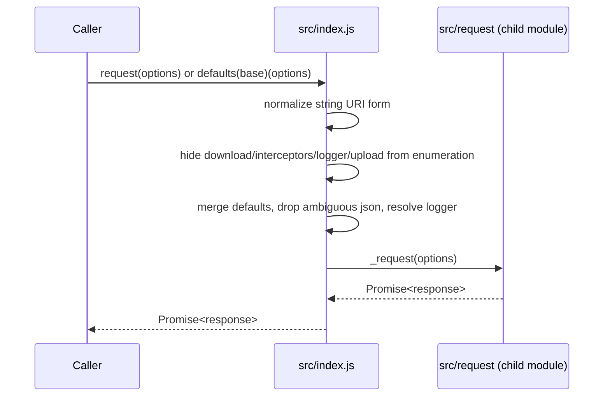
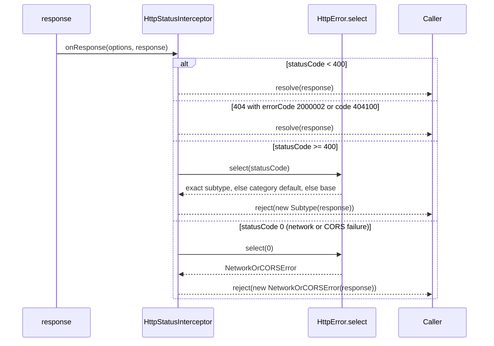
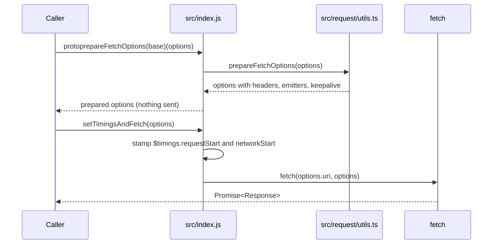
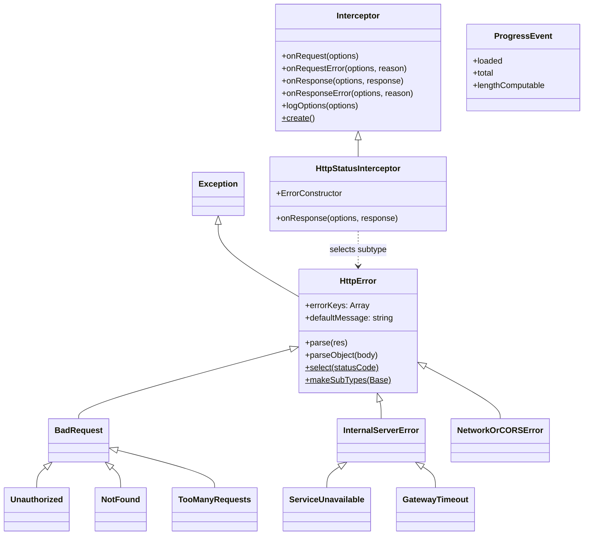

<!-- sdd-generated-metadata
doc_kind: module-spec
generated_from: module-spec@0.3.0
generated_by: claude-code
approved_by: pending
updated_at: 2026-09-23T06:29:48Z
validation_status: pass-with-warnings
-->

# http-core package surface

This source-local document at `src/docs/README.md` owns the stable specification for the
**`@webex/http-core` package surface**: client construction, the interceptor extension contract, the
HTTP error taxonomy, the progress payload, and MIME detection.

Request execution itself belongs to the `src/request` sub-module and is specified there; this
document references it by contract rather than restating it.

Related context: [repository architecture](../../docs/architecture.md) ·
[documentation index](../../docs/index.md) · [agent instructions](../../AGENTS.md) ·
[specification registry](../../docs/specs/README.md)

## Metadata

| Field             | Value                                                                    |
| ----------------- | ------------------------------------------------------------------------- |
| Owner             | Cisco Webex for Developers                                                |
| Source path       | `src`                                                                     |
| Resource kind     | Package surface module                                                    |
| Status            | Active                                                                    |
| Last verified     | 2026-09-23                                                                |
| Module id         | `src`                                                                     |
| Parent spec       | —                                                                         |
| Doc kind          | Module spec                                                               |
| Coverage score    | 93.3% assessed 2026-09-23; 14 of 15 mandatory fields present — a characterization baseline is the one outstanding gap                                               |
| Validation status | pass-with-warnings; validator `codex` assessed 2026-09-23; 0 Blocking, 1 Important, 1 Medium at repository scope — no Blocking finding against this module; characterization baseline still required for promotion |

## Applicability

| Condition ID                         | Status     | Evidence or reason                                                                                     | Owned section                 |
| ------------------------------------ | ---------- | -------------------------------------------------------------------------------------------------------- | ----------------------------- |
| `module.has_tiers`                   | N/A        | The repository assigns no operational or review tiers                                                   | Tier                          |
| `module.has_ui`                      | N/A        | No components or rendering; the module is a transport library                                           | UI use-case flow              |
| `module.crosses_service_boundaries`  | Applicable | The exported clients issue network requests through `src/request/index.js`                              | Cross-boundary use-case flow  |
| `module.holds_client_state`          | N/A        | No state store; `src/index.js` builds clients by currying, holding no mutable state between calls        | Client state model            |
| `module.enforces_domain_rules`       | N/A        | No domain entities or invariants; payloads are opaque to this module                                    | Business rules and invariants |
| `module.is_concurrent_async` | Applicable | Every public operation is promise-returning; `src/lib/detect.js` is async and `src/index.js` wraps fetch | Concurrency and reactive flow |
| `module.owns_persistence`            | N/A        | No store, schema, or migration                                                                          | Data, schema, and migration   |
| `module.stateful_transitions`        | N/A        | Stateless per call; no lifecycle to transition through                                                  | State machine                 |
| `module.exposes_wire_protocol`       | N/A        | Speaks standard HTTP; defines no protocol or binary format of its own                                   | Protocol and wire format      |
| `module.ui_multi_screen` | N/A | Gated by module.has_ui, which is N/A | UI flow |
| `module.large_data_model` | N/A | Gated by module.owns_persistence, which is N/A | Data model |
| `module.returns_caller_errors`       | Applicable | `src/interceptors/http-status.js` rejects with subtypes from `src/http-error-subtypes.js`               | Caller-visible failure modes  |
| `module.module_specific_conventions` | Applicable | `src/lib/xhr.js` is a vendored fork held to upstream style with a whole-file eslint-disable | Module-specific rules |
| `module.published_package` | Applicable | `package.json` declares main, browser, and deploy:npm | Export stability |
| `module.embedded_in_host`            | N/A        | Consumed as a dependency, not mounted into a host                                                        | Host integration and theming  |
| `module.has_design_tradeoff`         | Applicable | Curried client construction and failure-as-response normalization are both non-obvious                   | Key design trade-off          |
| `module.has_submodules` | Applicable | `src/request/index.js` roots a child module that owns its own specification | Sub-modules |

## Evidence register

| Evidence                                     | What it establishes                                                                            |
| -------------------------------------------- | ------------------------------------------------------------------------------------------------ |
| `src/index.js`                               | The export surface, curried client construction, default options, and the `fetch` helpers      |
| `src/http-error.js`                          | `HttpError` body parsing, message extraction, and non-enumerable response metadata             |
| `src/http-error-subtypes.js`                 | The subtype tree, the status-to-class map, and `select()` category fallback                    |
| `src/interceptors/http-status.js`            | Where a failing status becomes a rejection, and the two 404 bodies that do not                 |
| `src/lib/interceptor.js`                     | The interceptor extension contract and the verbose-logging gate                                |
| `src/lib/detect.js`                          | Accepted buffer types, the Blob shortcut, and the octet-stream fallback                        |
| `src/lib/xhr.js`                             | The vendored fork and its stated requirement to diverge minimally from upstream                |
| `src/progress-event.js`                      | The readonly progress payload and the `lengthComputable` rule                                  |
| `package.json`                               | Published entry points, the browser swap, dependencies, and every command                      |
| `test/integration/spec/http-error.js`        | Subtype existence, status mapping, `select()`, and all message-parsing branches                |
| `test/integration/spec/progress-event.js`    | Progress payload fields and computability                                                      |
| `test/integration/spec/interceptor.js`       | `logOptions` delegating to the resolved logger                                                 |
| `test/integration/spec/request.js`           | End-to-end behavior including the network-error-to-`NetworkOrCORSError` path                   |
| `test/unit/spec/index.js`                    | `protoprepareFetchOptions` output shape and `setTimingsAndFetch` timing writes                 |
| `test/unit/spec/interceptors/http-status.js` | Both redirect passthroughs and both matching rejections                                        |

## Purpose and boundary

- **Responsibility:** present one HTTP client API to the rest of the SDK, and own everything about
  that API except the act of sending a request — client construction and defaults, the extension
  point consumers plug into, the error types they catch, and the payload shapes they observe.
- **In scope:** the exported surface of `src/index.js`; the `HttpError` taxonomy and its parsing;
  the `Interceptor` base class; status-to-error conversion; `ProgressEvent`; MIME detection; the
  vendored XHR fork consumed by the browser transport.
- **Out of scope:** request execution, interceptor chain folding, and the two platform transports.
  Those belong to [`src/request`](../request/docs/README.md) and are referenced here as the
  `http-core-request-transport` contract. Authentication token acquisition, retry policy, and
  correlation headers are all owned by consuming packages through interceptors.
- **Consumers:** `@webex/webex-core`, `@webex/internal-plugin-device`,
  `@webex/internal-plugin-encryption`, `@webex/internal-plugin-scheduler`, `@webex/test-users`, and
  `@webex/helper-image`, each declaring the dependency in its own `package.json`.

## Structure and key files

| Path                              | Responsibility                                                                                                     |
| --------------------------------- | -------------------------------------------------------------------------------------------------------------------- |
| `src/index.js`                    | Package entry point. Curries `protorequest` into `defaults` and `request`, hides noisy option keys from logs, resolves the logger, and exports the public surface |
| `src/http-error.js`               | `HttpError` base: parses a response body into a message and attaches response metadata non-enumerably                |
| `src/http-error-subtypes.js`      | Builds the subtype tree onto the base class and installs the `select()` status resolver. Authoritative for error identity |
| `src/interceptors/http-status.js` | The one place a response becomes a rejection. Also encodes the two 404 bodies treated as successes                  |
| `src/lib/interceptor.js`          | The `Interceptor` base class: four pass-through lifecycle hooks, the `logOptions` helper, and an abstract `create()` |
| `src/lib/detect.js`               | MIME detection for `Blob`, `ArrayBuffer`, and `Uint8Array` inputs                                                    |
| `src/lib/xhr.js`                  | Vendored fork of `naugtur/xhr`, used only by the browser transport. See [ADR-0001](../../docs/adr/0001-fork-xhr-for-frozen-object-environments.md) |
| `src/progress-event.js`           | Constructs the readonly progress payload emitted during upload and download                                          |
| `src/request/index.js` | Entry point of the `src/request` child module — see [Sub-modules](#sub-modules) |

## Sub-modules

| Sub-module    | Responsibility                                                                             | Specification                |
| ------------- | -------------------------------------------------------------------------------------------- | ---------------------------- |
| `src/request` | Applies the interceptor chain around a platform-specific transport and emits progress events | `src/request/docs/README.md` |

`src/request` provides the `http-core-request-transport` contract, which this module requires. Its
transports, option translation, and failure normalization are specified in
[its own document](../request/docs/README.md) and are not restated here.

## Public surface

| Surface | Contract | Consumer | Compatibility commitment | Source |
| --- | --- | --- | --- | --- |
| `request` | `http-core-sdk` | All SDK plugins | Primary client. Pre-applied with `json: true` and a default `HttpStatusInterceptor` | `src/index.js` |
| `defaults` | `http-core-sdk` | Plugins building own clients | Curried factory; `defaults(options)` returns a new request function | `src/index.js` |
| `protoprepareFetchOptions` | `http-core-sdk` | Metrics submission paths | Curried; runs request interceptors and returns fetch-ready options without sending | `src/index.js` |
| `setTimingsAndFetch` | `http-core-sdk` | Metrics submission paths | Stamps `$timings.requestStart`/`networkStart` with the current time, then calls `fetch` | `src/index.js` |
| `Interceptor` | `http-core-sdk` | Plugins adding interceptors | Extension base class; the four hook names are a stable contract | `src/lib/interceptor.js` |
| `HttpStatusInterceptor` | `http-core-sdk` | Plugins overriding defaults | Accepts a custom error constructor via `options.error` or `options.ErrorConstructor` | `src/interceptors/http-status.js` |
| `HttpError` | `http-core-sdk` | Every caller handling errors | Base class plus the full subtype tree and `select()`, attached as static members | `src/http-error.js` |
| `ProgressEvent` | `http-core-progress-events` | Progress subscribers | Readonly `loaded`, `total`, `lengthComputable` | `src/progress-event.js` |
| `detect` | `http-core-sdk` | Callers detecting MIME types | `async`; accepts `Blob`, `ArrayBuffer`, or `Uint8Array` | `src/lib/detect.js` |

Every row routes to a stable contract id in `contract_catalog.definitions`. This module provides
`http-core-sdk`, `http-core-progress-events`, and the internal `http-core-xhr-fork`; it requires
`http-core-request-transport` and `webex-common-sdk`, both recorded in the Dependencies table below.
The repository-wide index of the same ids is
[Public and consumer surfaces](../../docs/architecture.md#public-and-consumer-surfaces).

Exact signatures stay in the native source declared by `package.json`. Note that the package exports
no TypeScript declarations, so consumers read these from the source rather than from a `.d.ts`.

## Dependencies

| Dependency                              | Why it is required                                                             | Failure behavior                                                        |
| --------------------------------------- | -------------------------------------------------------------------------------- | -------------------------------------------------------------------------- |
| `src/request` (`http-core-request-transport`) | Executes the request the curried client builds                              | Its promise is returned unchanged; failures surface as a `statusCode: 0` response |
| `@webex/common` (`Exception`)           | Base class `HttpError` extends, providing SDK-wide error serialization           | A load-time dependency; failure would prevent the module from importing      |
| `file-type`                             | Buffer MIME detection in `src/lib/detect.js`                                     | An unrecognized buffer yields `application/octet-stream` rather than an error |
| `lodash`                                | `curry`, `defaults`, `assign`, `isString`, `pick`, `isNumber` across the module   | Load-time dependency                                                         |
| `global`, `is-function`, `parse-headers`, `xtend` | Runtime dependencies of the vendored fork in `src/lib/xhr.js`          | Used only on the browser transport path                                      |

## Requirements

| ID        | WHAT                                                                                                                    | WHY                                                                                                     | Source evidence                   | Test or example evidence                          | Assumptions or gaps                                            | Confidence |
| --------- | ------------------------------------------------------------------------------------------------------------------------- | ----------------------------------------------------------------------------------------------------- | --------------------------------- | ------------------------------------------------- | -------------------------------------------------------------- | ---------- |
| `MOD-001` | `request` is `protorequest` pre-applied with `json: true` and one `HttpStatusInterceptor`                                | Gives every SDK caller JSON handling and typed errors without configuring anything                       | `src/index.js`                    | `test/integration/spec/request.js`                | none                                                           | Present    |
| `MOD-002` | `defaults(options)` returns a new client function with those options merged underneath per-call options                   | Lets a plugin layer its own defaults without re-implementing the pipeline                                | `src/index.js`                    | none found                                        | Gap: no test exercises `defaults()` directly                    | Present    |
| `MOD-003` | A string first argument is treated as the URI, with options read from the third argument                                  | Matches the `request` library's calling convention so callers can migrate unchanged                      | `src/index.js`                    | `test/integration/spec/request.js`                | none                                                           | Present    |
| `MOD-004` | `download`, `interceptors`, `logger`, and `upload` are redefined non-enumerable before defaults are merged                | Keeps injected services and emitters out of serialized logs of the options object                       | `src/index.js`                    | none found                                        | Gap: no test asserts these stay out of a serialized dump        | Present    |
| `MOD-005` | `options.json` is deleted when it is neither truthy nor explicitly `false`                                                 | Distinguishes "no opinion" from an explicit opt-out so the transport's own default applies               | `src/index.js`                    | none found                                        | Gap: no direct test                                            | Present    |
| `MOD-006` | The logger resolves as `options.logger`, then `this.logger`, then `console`                                                | Guarantees every request has a logger without forcing callers to supply one                              | `src/index.js`                    | `test/integration/spec/interceptor.js`            | none                                                           | Present    |
| `MOD-007` | An `HttpError` subtype exists for each standard status code, plus `429` and `0`                                            | Consumers branch on error class rather than parsing status codes                                         | `src/http-error-subtypes.js`      | `test/integration/spec/http-error.js`             | none                                                           | Present    |
| `MOD-008` | `select(statusCode)` returns the exact subtype, else the category default (`400`/`500`), else the base class              | An unmapped status still produces a meaningful class instead of a bare `Error`                           | `src/http-error-subtypes.js`      | `test/integration/spec/http-error.js`             | none                                                           | Present    |
| `MOD-009` | `4xx` subtypes descend from `BadRequest`, `5xx` from `InternalServerError`, and `NetworkOrCORSError` from the base         | Lets a caller catch a whole class of failures with one `instanceof`                                      | `src/http-error-subtypes.js`      | `test/integration/spec/http-error.js`             | none                                                           | Present    |
| `MOD-010` | `parse()` extracts a message from the body by scanning `errorKeys`, recursing into nested objects, and stringifying otherwise | Webex services report errors under several different key names                                       | `src/http-error.js`               | `test/integration/spec/http-error.js`             | none                                                           | Present    |
| `MOD-011` | When no message can be extracted, `defaultMessage` is used                                                                 | An error is never constructed with an empty message                                                      | `src/http-error.js`               | `test/integration/spec/http-error.js`             | none                                                           | Present    |
| `MOD-012` | Response metadata is attached to the error as non-enumerable properties                                                    | Keeps full diagnostics reachable without making errors serialize enormous payloads                       | `src/http-error.js`               | none found                                        | Gap: no test asserts non-enumerability                          | Present    |
| `MOD-013` | `HttpStatusInterceptor.onResponse` resolves below `400` and rejects at or above it with the selected subtype               | Centralizes status-to-error conversion in exactly one place                                              | `src/interceptors/http-status.js` | `test/unit/spec/interceptors/http-status.js`, `test/integration/spec/request.js` | none                              | Present    |
| `MOD-014` | A `404` carrying `body.errorCode === 2000002` or `body.code === 404100` resolves as a success                              | Those bodies are redirect instructions the caller must act on, not failures                              | `src/interceptors/http-status.js` | `test/unit/spec/interceptors/http-status.js`      | none                                                           | Present    |
| `MOD-015` | `HttpStatusInterceptor` uses a constructor supplied via `options.error` or `options.ErrorConstructor`, defaulting to `HttpError` | Lets a plugin substitute a richer error type while reusing the status logic                         | `src/interceptors/http-status.js` | none found                                        | Gap: neither option name is exercised by a test                 | Present    |
| `MOD-016` | `Interceptor`'s four hooks default to pass-through, and `create()` throws unless overridden                                | A subclass implements only the hooks it needs, but cannot be instantiated without a factory              | `src/lib/interceptor.js`          | none found                                        | Gap: no test asserts the `create()` throw or the pass-throughs  | Present    |
| `MOD-017` | `logOptions` logs only when `ENABLE_VERBOSE_NETWORK_LOGGING` is set and a logger resolves                                  | Full option dumps include headers and bodies, so they must stay off by default                           | `src/lib/interceptor.js`          | `test/integration/spec/interceptor.js`            | none                                                           | Present    |
| `MOD-018` | `ProgressEvent` exposes readonly `loaded`, `total`, and `lengthComputable`, the last true only when both are numbers, neither is `NaN`, and `total > 0` | Mirrors the browser `ProgressEvent` so callers write one handler for both platforms | `src/progress-event.js`           | `test/integration/spec/progress-event.js`         | none                                                           | Present    |
| `MOD-019` | `detect()` rejects anything that is not a `Blob`, `ArrayBuffer`, or `Uint8Array`; returns `blob.type` for a `Blob`; falls back to `application/octet-stream` | Content-type inference must never guess wrongly or throw on an unknown format            | `src/lib/detect.js`               | none found                                        | Gap: no direct test; exercised only indirectly through request tests | Present |
| `MOD-020` | `protoprepareFetchOptions` runs the request-interceptor chain and returns fetch-ready options without sending              | Metrics paths need to build a request now and send it later                                              | `src/index.js`                    | `test/unit/spec/index.js`                         | none                                                           | Present    |
| `MOD-021` | `setTimingsAndFetch` overwrites `$timings.requestStart` and `networkStart` with the current time, then calls `fetch`       | Timings captured when options were built would misreport latency at send time                            | `src/index.js`                    | `test/unit/spec/index.js`                         | none                                                           | Present    |

## Design overview

The module is organized around a single idea: **the options object is the program.** There is no
client class and no connection state. `src/index.js` curries `protorequest`, so a "client" is a
function with an options object already bound to it. `request` is that same function with the
package's own defaults applied; `defaults()` is the public way to make another one.

Three consequences follow. Configuration is merged with `lodash.defaults`, which fills absent keys
only — a per-call option always wins over a client default. There is nothing to construct or tear
down. And because the same object is threaded through interceptors and the transport and is mutated
along the way, `src/index.js` takes explicit care to mark `download`, `interceptors`, `logger`, and
`upload` non-enumerable before anything can serialize it.

**Error identity is built, not declared.** `src/http-error-subtypes.js` exports a function that
constructs the subtype classes and assigns them onto whatever base it is given, keyed by both status
code and class name. `src/http-error.js` calls it on `HttpError` at module load and re-exposes it as
`HttpError.makeSubTypes`, so a consumer can build a parallel tree on its own base class and hand it
to `HttpStatusInterceptor` through `options.error`. That is the mechanism behind `MOD-015`, and it is
why the taxonomy lives in a factory rather than in static class declarations.

**Message extraction is deliberately forgiving.** `parse()` in `src/http-error.js` accepts a string
body, a parsed object, or a string containing JSON, and searches a fixed list of candidate keys —
`error`, `errorString`, `response`, `errorResponse`, `message`, `msg` — recursing when the winning
candidate is itself an object. Webex services do not agree on one error-body shape, so the module
absorbs that variance rather than pushing it onto every caller.

`src/lib/xhr.js` is the one file that does not follow the module's conventions, by design. It is a
vendored fork carrying its own style and a whole-file lint exemption; see
[ADR-0001](../../docs/adr/0001-fork-xhr-for-frozen-object-environments.md).

## Data flow and sequence coverage

The transport is HTTP, reached through a promise-returning function call. This module has three
distinct operation groups, which differ in actors and outcome and so are diagrammed separately:
client construction, error conversion, and the prepared-options path used for metrics.

| Operation group        | Entry and outcome                                                                     | Diagram or evidence               | Failure and recovery coverage                                          |
| ---------------------- | ----------------------------------------------------------------------------------------- | --------------------------------- | ------------------------------------------------------------------------ |
| Client construction    | `defaults(opts)` or `request(opts)` → a promise for a response                            | Diagram below                     | Defaults merging cannot fail; downstream failures surface as responses    |
| Error conversion       | A response reaches `HttpStatusInterceptor` → resolve, or reject with a typed subtype       | Diagram below                     | Covers `< 400`, the two 404 redirect bodies, `>= 400`, and `statusCode: 0` |
| Prepared fetch options | `protoprepareFetchOptions(opts)` → fetch-ready options; later `setTimingsAndFetch` sends   | Diagram below                     | Request-interceptor rejection propagates; no send is attempted            |

**Client construction and dispatch**

**Error conversion**

**Prepared fetch options**

## Class and component relationships

Subtypes are abbreviated; `src/http-error-subtypes.js` is authoritative for the full tree.

## Use cases and flows

| Use case | Actor or caller              | Primary steps and outcome                                                                                              | Failure or boundary behavior                                                        | Evidence                                                              |
| -------- | ---------------------------- | ------------------------------------------------------------------------------------------------------------------------ | -------------------------------------------------------------------------------------- | --------------------------------------------------------------------- |
| `UC-001` | SDK plugin                   | Call `request({uri, method})`; receive a response whose JSON body is already parsed                                      | A failing status rejects with a typed subtype instead of resolving                       | `src/index.js`, `test/integration/spec/request.js`                    |
| `UC-002` | Plugin with its own defaults | Call `defaults({...})` once, keep the returned function, and call it per request                                          | Per-call options override client defaults; client defaults override nothing set per call | `src/index.js`                                                        |
| `UC-003` | Plugin adding behavior       | Subclass `Interceptor`, implement `create()` and the needed hooks, pass it in `options.interceptors`                     | Omitting `create()` throws; unimplemented hooks pass through untouched                   | `src/lib/interceptor.js`                                              |
| `UC-004` | Caller handling failures     | `catch` a rejection and branch with `instanceof HttpError.NotFound` or a parent such as `BadRequest`                      | An unmapped status still yields the category default, so the branch never misses         | `src/http-error-subtypes.js`, `test/integration/spec/http-error.js`   |
| `UC-005` | Metrics submission           | Build options with `protoprepareFetchOptions`, hold them, then send later with `setTimingsAndFetch`                       | Timings are re-stamped at send so latency is measured from dispatch, not from build      | `src/index.js`, `test/unit/spec/index.js`                             |
| `UC-006` | Caller uploading a buffer    | Pass a buffer body; `detect()` resolves its MIME type and the transport sets `content-type`                              | An unrecognized buffer becomes `application/octet-stream`; a wrong type is never guessed | `src/lib/detect.js`                                                   |

### Cross-boundary use-case flow

| Boundary                          | Transport           | Ordering                                                                 | Compatibility                                                               | Timeout and retry                                                                  | Recovery                                                                     |
| --------------------------------- | ------------------- | ------------------------------------------------------------------------- | ------------------------------------------------------------------------------ | ------------------------------------------------------------------------------------ | ------------------------------------------------------------------------------ |
| SDK plugin → Webex service        | HTTP, via `src/request` | Request interceptors run in array order; response interceptors in reverse | Option vocabulary follows the `request` library, so it is stable across platforms | This module sets no timeout and performs no retry; `options.timeout` is honored by the transport, and retry belongs to callers | Failures arrive as rejections carrying the full response on the error object |
| Caller → `fetch` (metrics path)   | HTTP, via `setTimingsAndFetch` | Request interceptors run at prepare time, not at send time         | Returns the raw `fetch` promise, not a normalized response                       | No timeout, no retry, and no status-to-error conversion on this path                  | The caller handles the `fetch` rejection itself                              |

The metrics path is the important asymmetry: it bypasses `HttpStatusInterceptor` entirely, so a
`4xx` there resolves rather than rejects.

## Concurrency and reactive flow

- **Execution model:** promise-based on the host event loop. There are no threads, workers, or
  background jobs. `detect()` is `async`; every other public function returns a promise created by
  the layer beneath it.
- **Ordering guarantees:** within one request, request interceptors run in array order and response
  interceptors in reverse, as folded by `src/request/utils.ts`. Across concurrent requests there is
  no ordering guarantee and none is needed — no state is shared between them.
- **Idempotency and retry:** neither is implemented here. The module retries nothing and deduplicates
  nothing; a caller that needs either owns it. This matters because `MOD-013` converts a `429` into
  a `TooManyRequests` rejection but does not act on it.
- **Shared-state protection:** none is required. Each call owns its options object and its two
  emitters. The only module-level mutable state is the subtype map installed onto `HttpError` at
  load time, which is written once and read thereafter.
- **Blocking restrictions:** interceptor hooks are awaited in sequence, so a slow hook delays every
  request that uses that interceptor. Hooks must not block the event loop.

## Caller-visible failure modes

| Condition                                     | Signal or result                                    | Caller behavior                                              | Retry or recovery                                        | Evidence                                                              |
| --------------------------------------------- | --------------------------------------------------- | ------------------------------------------------------------ | -------------------------------------------------------- | --------------------------------------------------------------------- |
| Status `>= 400` with a mapped subtype         | Rejection with that subtype, e.g. `NotFound`         | Branch on the class; read `statusCode`, `headers`, `body`     | Caller-owned; nothing is retried here                      | `src/interceptors/http-status.js`, `test/integration/spec/request.js` |
| Status `>= 400` with no exact subtype         | Rejection with the category default (`400`/`500`)    | The broader `instanceof` still matches                        | Caller-owned                                               | `src/http-error-subtypes.js`, `test/integration/spec/http-error.js`   |
| Network, DNS, or CORS failure                 | Rejection with `NetworkOrCORSError` (`statusCode: 0`) | Treat as unreachable, not as a server response                | Caller-owned                                               | `test/integration/spec/request.js`                                    |
| `404` with a Locus or App API redirect body   | **Resolves** as a success                            | Must inspect the body and follow the redirect                 | Not a failure                                              | `test/unit/spec/interceptors/http-status.js`                          |
| Error body in an unrecognized shape           | Message is the stringified body                      | Message remains useful, though not concise                    | None needed                                                | `src/http-error.js`, `test/integration/spec/http-error.js`            |
| No extractable message                        | `defaultMessage` is used                             | Error is never empty                                          | None needed                                                | `src/http-error.js`                                                   |
| `detect()` given an unsupported type          | Rejects with a plain `Error`                         | Not an `HttpError`; do not catch it with a subtype branch     | Pass a supported buffer type                               | `src/lib/detect.js`                                                   |
| `Interceptor.create()` not overridden         | Throws at call time                                  | Fix the subclass                                              | None                                                       | `src/lib/interceptor.js`                                              |

## Pitfalls and constraints

- **A `404` is not always a failure.** Two body shapes resolve as successes. Code that assumes every
  `404` rejects will silently mis-handle Locus and App API redirects.
- **`statusCode: 0` is not an HTTP status.** It is this module's encoding of a transport-level
  failure. Do not compare it numerically against real statuses or treat it as a server response.
- **Error subtype names are a published contract.** Consumers branch on `NotFound`,
  `TooManyRequests`, and the rest. Renaming one, removing it, or changing its parent is breaking.
- **Response metadata on an error is non-enumerable.** `Object.keys(err)` and `JSON.stringify(err)`
  will not show `statusCode`, `headers`, or `body`. Access them directly.
- **The options object is mutated in place.** `src/index.js` rewrites the caller's object rather
  than copying it. Reusing one options object across two requests will carry state between them.
- **`ENABLE_VERBOSE_NETWORK_LOGGING` logs request bodies and headers.** The non-enumerable trick
  hides injected services, not payloads. Keep it off outside debugging.
- **The metrics path skips status-to-error conversion.** `setTimingsAndFetch` calls `fetch`
  directly, so no `HttpError` is ever produced on that path.
- **No timeout is applied by default.** `setDefaults` in the browser transport sets `timeout: 0`.
  A caller that needs one must pass `options.timeout`.

## Module-specific rules

- **Do:** keep `src/lib/xhr.js` as close to its upstream original as possible. Its header states the
  rule, its `/* eslint-disable */` enforces it, and [ADR-0001](../../docs/adr/0001-fork-xhr-for-frozen-object-environments.md)
  records why. Port upstream changes as discrete, reviewable diffs.
- **Do:** add new error subtypes through the factory in `src/http-error-subtypes.js`, registering
  them under both the numeric status and the class name, so `select()` and the named static both work.
- **Do:** mark any new injected-service or emitter option non-enumerable in `src/index.js` alongside
  the existing four, or it will leak into logged option dumps.
- **Do not:** re-enable repository lint rules on `src/lib/xhr.js` or reformat it to local style.
- **Do not:** add retry, backoff, or timeout policy to this module. It converts failures into typed
  errors; reacting to them belongs to callers.
- **Do not:** reject from a transport for a network failure. Resolve a `statusCode: 0` response so
  `HttpStatusInterceptor` remains the only place rejections originate.

## Export stability

| Export or entry point      | Consumer                     | Stability | Versioning and deprecation rule                                                       | Declaration or API report |
| -------------------------- | ---------------------------- | --------- | ---------------------------------------------------------------------------------------- | ------------------------- |
| `request`                  | All consuming SDK packages   | Stable    | Signature follows the `request` library convention; removing an option shape is breaking | `package.json`            |
| `defaults`                 | Plugins building own clients | Stable    | Must keep returning a callable client, not a configuration object                        | `package.json`            |
| `HttpError` and subtypes   | Every error-handling caller  | Stable    | Class names and parents are contract; add subtypes freely, never rename or reparent      | `package.json`            |
| `Interceptor`              | Plugins adding interceptors  | Stable    | The four hook names and `create()` are contract; adding an optional hook is compatible   | `package.json`            |
| `HttpStatusInterceptor`    | Plugins overriding defaults  | Stable    | Both `options.error` and `options.ErrorConstructor` are accepted and must stay accepted  | `package.json`            |
| `ProgressEvent`            | Progress subscribers         | Stable    | Field names mirror the browser API; changing them breaks shared handlers                 | `package.json`            |
| `detect`                   | Callers detecting MIME types | Stable    | Must stay `async` and keep the octet-stream fallback rather than throwing                | `package.json`            |
| `protoprepareFetchOptions`, `setTimingsAndFetch` | Metrics paths | Stable  | Narrow-purpose exports; `$timings` key names are relied on by metrics consumers          | `package.json`            |
| `dist/index.js`            | npm consumers                | Stable    | The published entry point declared by `main`; `browser` swaps the transport              | `package.json`            |

The package ships no TypeScript declarations, so there is no `.d.ts` or API report to diff against.
Export changes are only visible by reading `src/index.js`, which makes review the sole gate.

## Key design trade-off

| Chosen trade-off                                                              | Preserved invariant or benefit                                                                                     | Cost or limitation                                                                                                              | Decision evidence                 |
| ----------------------------------------------------------------------------- | -------------------------------------------------------------------------------------------------------------------- | ---------------------------------------------------------------------------------------------------------------------------------- | --------------------------------- |
| Normalize transport failures into a `statusCode: 0` response instead of rejecting | Exactly one place creates rejections, so every failure flows through the interceptor chain and reaches `onResponseError` | `0` is not a real status; callers who compare numerically, or who log status codes, see a value HTTP never produces              | `src/interceptors/http-status.js` |
| Build clients by currying rather than constructing a class                     | A client is a plain function — nothing to instantiate, configure, or dispose, and defaults compose by merging         | There is no object to introspect, so a client's effective configuration cannot be read back after it is built                    | `src/index.js`                    |
| Build the error taxonomy with a factory assigned onto a base class             | A consumer can generate a parallel tree on its own base and inject it via `options.error`                             | Subtypes are invisible to static analysis and to editors, since they exist only after `makeSubTypes` runs                        | `src/http-error-subtypes.js`      |
| Mirror the `request` library's option vocabulary on the public API             | One API works on both platforms, and callers migrating from that library need no changes                              | The vocabulary of an unmaintained library is now a published contract, and the browser transport must reimplement it by hand     | `package.json`                    |
| Treat two `404` bodies as successes                                            | Locus and App API redirects reach the caller intact instead of being destroyed by status handling                     | A general-purpose HTTP client carries two service-specific magic numbers, and callers must know a `404` may resolve              | `src/interceptors/http-status.js` |
| Vendor `naugtur/xhr` rather than depend on it | Browser requests work where the object graph is fully frozen | Third-party code is maintained in-repo, excluded from lint, and receives no upstream fixes automatically | `src/lib/xhr.js`, `docs/adr/0001-fork-xhr-for-frozen-object-environments.md` |

## Verification

| Requirement or invariant | Test level  | Positive evidence                                                       | Negative or boundary evidence                                     | Gap                                                                    |
| ------------------------ | ----------- | ------------------------------------------------------------------------- | -------------------------------------------------------------------- | ------------------------------------------------------------------------ |
| `MOD-001`                | Integration | `test/integration/spec/request.js`                                        | `test/integration/spec/request.js` (subtyped error on failure)       | none                                                                     |
| `MOD-002`                | —           | none found                                                                | none found                                                           | `defaults()` is untested; a regression in currying would not be caught    |
| `MOD-003` | Integration | `test/integration/spec/request.js` | `test/integration/spec/request.js` (options.url normalized to uri) | none |
| `MOD-004`                | —           | none found                                                                | none found                                                           | Non-enumerability is unasserted; a log-leak regression would be silent    |
| `MOD-005`                | —           | none found                                                                | none found                                                           | The three-way `json` branch is untested                                   |
| `MOD-006`                | Integration | `test/integration/spec/interceptor.js`                                    | none found                                                           | The `console` fallback branch is uncovered                                |
| `MOD-007`                | Integration | `test/integration/spec/http-error.js`                                     | `test/integration/spec/http-error.js` (network/CORS subtype)         | none                                                                     |
| `MOD-008` | Integration | `test/integration/spec/http-error.js` | `test/integration/spec/http-error.js` (.select() fallback) | none |
| `MOD-009`                | Integration | `test/integration/spec/http-error.js`                                     | none found                                                           | none                                                                     |
| `MOD-010`                | Integration | `test/integration/spec/http-error.js` (string, JSON, stringified JSON)    | `test/integration/spec/http-error.js` (recursive candidates)         | none                                                                     |
| `MOD-011`                | Integration | `test/integration/spec/http-error.js`                                     | `test/integration/spec/http-error.js`                                | none                                                                     |
| `MOD-012`                | —           | none found                                                                | none found                                                           | Non-enumerability of response metadata is unasserted                      |
| `MOD-013`                | Unit + Integration | `test/unit/spec/interceptors/http-status.js`                       | `test/integration/spec/request.js`                                   | none                                                                     |
| `MOD-014`                | Unit        | `test/unit/spec/interceptors/http-status.js` (both redirect codes)        | `test/unit/spec/interceptors/http-status.js` (both near-miss codes)  | none                                                                     |
| `MOD-015`                | —           | none found                                                                | none found                                                           | Neither `options.error` nor `options.ErrorConstructor` is exercised        |
| `MOD-016`                | —           | none found                                                                | none found                                                           | The abstract `create()` throw and the pass-through hooks are untested      |
| `MOD-017`                | Integration | `test/integration/spec/interceptor.js`                                    | none found                                                           | The env-var-off branch is not asserted                                    |
| `MOD-018`                | Integration | `test/integration/spec/progress-event.js`                                 | `test/integration/spec/progress-event.js` (computability)            | none                                                                     |
| `MOD-019`                | —           | none found                                                                | none found                                                           | No direct test; the type-guard rejection path is entirely uncovered        |
| `MOD-020`                | Unit        | `test/unit/spec/index.js`                                                 | none found                                                           | none                                                                     |
| `MOD-021`                | Unit        | `test/unit/spec/index.js`                                                 | none found                                                           | none                                                                     |

**Coverage gaps worth acting on.** Seven requirements have no test at all: `MOD-002`, `MOD-004`,
`MOD-005`, `MOD-012`, `MOD-015`, `MOD-016`, and `MOD-019`. Two of them guard behavior that fails
silently rather than loudly — `MOD-004` and `MOD-012` both concern non-enumerability, so a
regression leaks credentials or bloats logs without any test turning red. `MOD-019` leaves
`detect()`'s type guard uncovered even though it is the module's only input-validation path.

Generator-side field measurement is complete for this module and every critical field is present.
What remains is not measurement: independent semantic validation by `codex` ran on 2026-09-23 and
returned `pass-with-warnings` with no Blocking finding against this module. Promotion from `Partial`
to `Specced` remains held because a characterization baseline should be recorded before any risky
modification.
