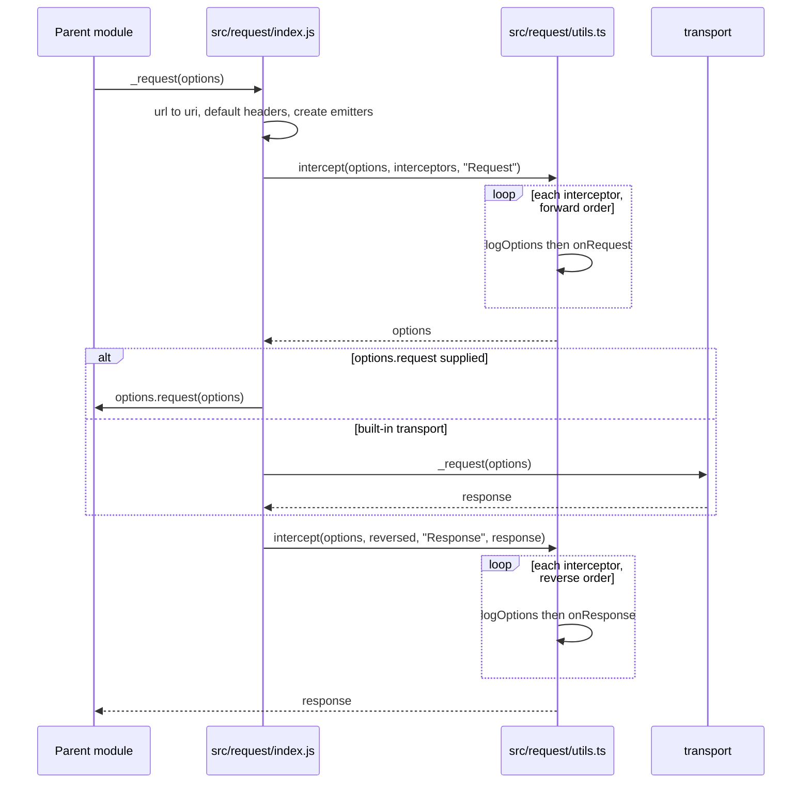
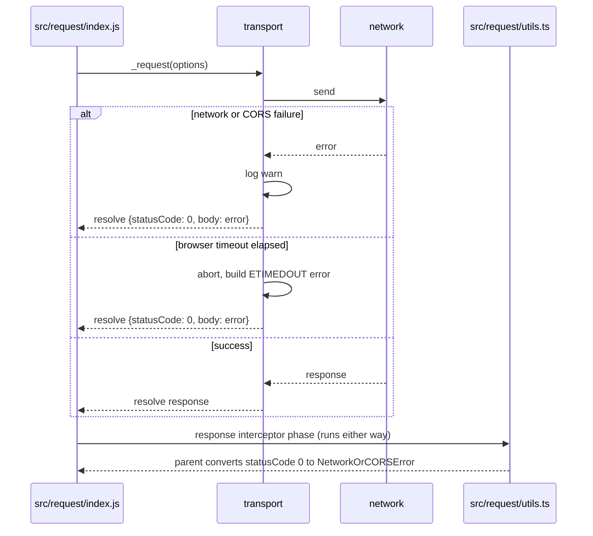
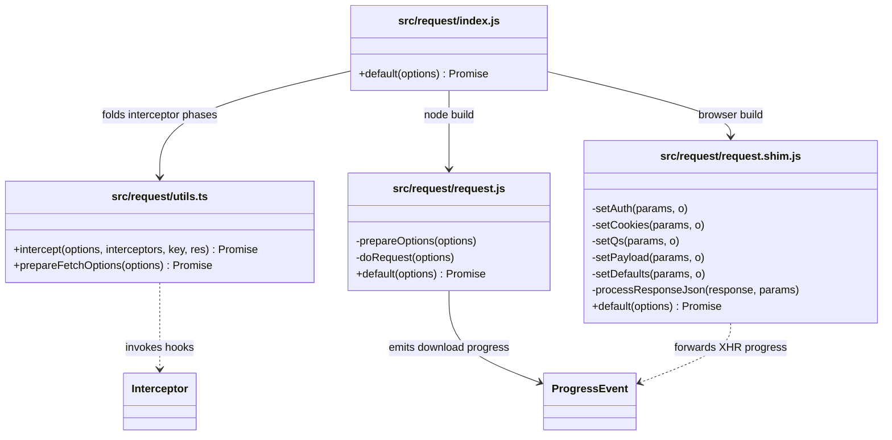

<!-- sdd-generated-metadata
doc_kind: module-spec
generated_from: module-spec@0.3.0
generated_by: claude-code
approved_by: pending
updated_at: 2026-09-23T06:29:48Z
validation_status: pass-with-warnings
-->

# request pipeline

This source-local document at `src/request/docs/README.md` owns the stable specification for the
**request pipeline**: applying the interceptor chain around a platform-specific transport, and the
two transports themselves.

The export surface, error taxonomy, and interceptor base class belong to the parent module and are
specified in [`src/docs/README.md`](../../docs/README.md).

Related context: [repository architecture](../../../docs/architecture.md) ·
[documentation index](../../../docs/index.md) · [agent instructions](../../../AGENTS.md) ·
[specification registry](../../../docs/specs/README.md)

## Metadata

| Field             | Value                                     |
| ----------------- | ------------------------------------------- |
| Owner             | Cisco Webex for Developers                 |
| Source path       | `src/request`                              |
| Resource kind     | Capability module                          |
| Status            | Active                                     |
| Last verified     | 2026-09-23                                 |
| Module id         | `src/request`                              |
| Parent spec       | [`src/docs/README.md`](../../docs/README.md) |
| Doc kind          | Module spec                                |
| Coverage score    | 93.3% assessed 2026-09-23; 14 of 15 mandatory fields present — a characterization baseline is the one outstanding gap                |
| Validation status | pass-with-warnings; validator `codex` assessed 2026-09-23; prior B1 `options.sync` and B2 transport-loading findings resolved; current result has 0 Blocking, 1 Important, 1 Medium at repository scope; characterization baseline still required |

## Applicability

| Condition ID                         | Status     | Evidence or reason                                                                                      | Owned section                 |
| ------------------------------------ | ---------- | --------------------------------------------------------------------------------------------------------- | ----------------------------- |
| `module.has_tiers`                   | N/A        | The repository assigns no operational or review tiers                                                    | Tier                          |
| `module.has_ui`                      | N/A        | No components or rendering                                                                               | UI use-case flow              |
| `module.crosses_service_boundaries`  | Applicable | This module performs the network I/O, in `src/request/request.js` and `src/request/request.shim.js`      | Cross-boundary use-case flow  |
| `module.holds_client_state`          | N/A        | Emitters and options are per-request and discarded with the request                                      | Client state model            |
| `module.enforces_domain_rules`       | N/A        | Payloads are opaque; no domain entities or invariants                                                    | Business rules and invariants |
| `module.is_concurrent_async`         | Applicable | Promise-based dispatch with an interceptor fold in `src/request/utils.ts` and streaming progress events   | Concurrency and reactive flow |
| `module.owns_persistence`            | N/A        | No store, schema, or migration                                                                           | Data, schema, and migration   |
| `module.stateful_transitions`        | N/A        | A request is a single dispatch, not a lifecycle with states                                              | State machine                 |
| `module.exposes_wire_protocol`       | N/A        | Speaks standard HTTP; defines no protocol or binary format of its own                                    | Protocol and wire format      |
| `module.ui_multi_screen` | N/A | Gated by module.has_ui, which is N/A | UI flow |
| `module.large_data_model` | N/A | Gated by module.owns_persistence, which is N/A | Data model |
| `module.returns_caller_errors` | Applicable | Both transports normalize failures into a statusCode: 0 response the parent converts into an error | Caller-visible failure modes |
| `module.module_specific_conventions` | Applicable | The browser field in `package.json` swaps transports at build time, so changes must be mirrored | Module-specific rules |
| `module.published_package`           | N/A        | Not published independently; it ships inside the parent package                                          | Export stability              |
| `module.embedded_in_host`            | N/A        | Not mounted into a host application                                                                      | Host integration and theming  |
| `module.has_design_tradeoff`         | Applicable | Failure-as-response normalization and the build-time transport swap are both non-obvious                  | Key design trade-off          |
| `module.has_submodules`              | N/A        | No child modules; computed from the manifest module tree                                                 | Sub-modules                   |

## Evidence register

| Evidence                                   | What it establishes                                                                              |
| ------------------------------------------ | -------------------------------------------------------------------------------------------------- |
| `src/request/index.js`                     | Option normalization, emitter creation, the two interceptor passes, and custom-transport dispatch |
| `src/request/utils.ts`                     | The interceptor fold, its error routing, and fetch-option preparation                            |
| `src/request/request.js`                   | The Node transport: option preparation, failure normalization, and download progress             |
| `src/request/request.shim.js`              | The browser transport: option translation onto XHR, auth, payloads, and logging                  |
| `package.json`                             | The build-time transport swap and every dependency the transports use                            |
| `test/unit/spec/request/index.js`          | Option normalization, emitter creation, both interceptor passes, and custom-transport dispatch   |
| `test/unit/spec/request/utils.js`          | Interceptor folding and three `prepareFetchOptions` header and body cases                        |
| `test/unit/spec/request/request.shim.js`   | Basic auth header construction                                                                   |
| `test/integration/spec/request.js`         | End-to-end behavior across methods, payload forms, auth, cookies, progress, and network failure  |

The `Configuration surface` subsection under `Public surface` is a repo-specific extension. It is
retained because this module's entire configuration surface is per-request option keys rather than
environment variables or a config file, and those keys behave differently on each platform — a fact
scattered across `src/request/request.js`, `src/request/request.shim.js`, and `src/lib/xhr.js` with
no canonical home in the source template. It adds no claim not already evidenced by those three
files and duplicates no other section's content.

## Purpose and boundary

- **Responsibility:** turn a prepared options object into a response. That means folding the
  interceptor chain over it in both directions, choosing and invoking a transport, and normalizing
  whatever comes back into a uniform response shape.
- **In scope:** interceptor application order and error routing; per-request emitter creation;
  `options.url` to `options.uri` normalization; the Node transport over the `request` library; the
  browser transport over the vendored XHR fork; the option-vocabulary translation the browser
  transport performs; failure normalization to `statusCode: 0`; progress emission; fetch-option
  preparation for the metrics path.
- **Out of scope:** the public export surface, default option values, the `HttpError` taxonomy, the
  `Interceptor` base class, and status-to-error conversion — all owned by the parent module. The
  vendored XHR fork itself is owned by the parent as `http-core-xhr-fork`; this module consumes it.
- **Consumers:** the parent module only. Nothing outside the package imports `src/request` directly.

## Structure and key files

| Path                          | Responsibility                                                                                                                  |
| ----------------------------- | --------------------------------------------------------------------------------------------------------------------------------- |
| `src/request/index.js`        | The pipeline. Normalizes options, creates the progress emitters, runs request interceptors, dispatches, runs response interceptors in reverse |
| `src/request/utils.ts`        | `intercept()`, the fold that applies one interceptor phase; and `prepareFetchOptions()`, which shapes options for `fetch` without sending |
| `src/request/request.js`      | Node transport. Delegates to the `request` library and normalizes its callback into a resolved promise                           |
| `src/request/request.shim.js` | Browser transport. Reimplements the same option vocabulary over `XMLHttpRequest` via the vendored fork                            |

`src/request/utils.ts` is the module's only TypeScript file; everything else is JavaScript.

## Public surface

| Surface | Contract | Consumer | Compatibility commitment | Source |
| --- | --- | --- | --- | --- |
| `default` (the pipeline) | `http-core-request-transport` | Parent module only | Internal. Takes an options object, returns a promise for a response | `src/request/index.js` |
| `intercept` | `http-core-request-transport` | Parent module, own transports | Internal. `(options, interceptors, key, res?)` folds one interceptor phase | `src/request/utils.ts` |
| `prepareFetchOptions` | `http-core-request-transport` | Parent module | Internal. Returns the same mutated options object, fetch-ready | `src/request/utils.ts` |
| `default` (transports) | `http-core-request-transport` | The pipeline only | Internal. Both transports must resolve — never reject — and must accept the same option vocabulary | `src/request/request.js`, `src/request/request.shim.js` |
| `options.request` hook | `http-core-request-transport` | Any caller | **Caller-visible.** Supplying it replaces the built-in transport entirely while the interceptor chain still runs | `src/request/index.js` |

Everything here is internal except the `options.request` hook, which is reachable by any caller of
the parent's `request` export and is therefore a published behavior. Every row routes to
`http-core-request-transport` in `contract_catalog.definitions`, the single contract this module
provides. It requires `http-core-sdk`, `http-core-progress-events`, `http-core-xhr-fork`,
`webex-common-sdk`, and `nodejs-request-library`, all recorded in the Dependencies table below. The
repository-wide index of the same ids is
[Public and consumer surfaces](../../../docs/architecture.md#public-and-consumer-surfaces).

### Configuration surface

The module reads no environment variables and owns no config file. Its entire configuration surface
is per-request option keys, and there are no rollout or feature flags gating any of its behavior.

| Option | Platform | Effect | Default |
| --- | --- | --- | --- |
| `options.timeout` | Both | Node passes it to the underlying client; the browser starts a timer that aborts the request and raises `ETIMEDOUT` | `0` in the browser, meaning no timeout |
| `options.withCredentials` | Both | Becomes a cookie jar in Node and the XHR credentials flag in the browser | `false`, set explicitly so it is not inferred from CORS |
| `options.jar` | Both | The alias callers actually use for the same cookie behavior | unset |
| `options.cors` | Browser | Enables cross-origin mode on the XHR wrapper | `true` |
| `options.responseType` | Both | `buffer` and `blob` switch the response to binary handling | unset |
| `options.request` | Both | Replaces the transport entirely | unset |
| `options.interceptors` | Both | The chain folded around the dispatch | supplied by the parent module |

## Dependencies

| Dependency                                     | Why it is required                                                    | Failure behavior                                                            |
| ---------------------------------------------- | ----------------------------------------------------------------------- | ------------------------------------------------------------------------------ |
| `request` (npm)                                | The Node transport                                                     | Its callback error is caught and normalized into a `statusCode: 0` response     |
| `src/lib/xhr.js` (`http-core-xhr-fork`)        | The browser transport's XHR wrapper                                    | Its error callback produces a `statusCode: 0` response                          |
| `src/lib/interceptor.js` (`http-core-interceptor-extension`) | Type and `logOptions` contract for the fold in `utils.ts` | Compile-time dependency in TypeScript; `logOptions` is called per interceptor |
| `src/progress-event.js` (`http-core-progress-events`) | The payload emitted for download progress                       | Emitted on the caller's emitter; no effect on the response promise              |
| `src/lib/detect.js`                            | MIME detection for buffer and blob bodies before sending                | Falls back to `application/octet-stream` rather than failing                    |
| `@webex/common` (`isBuffer`)                   | Buffer detection for request and response bodies in the Node transport | Load-time dependency                                                            |
| `qs`                                           | Query-string and urlencoded-form serialization in the browser          | Load-time dependency                                                            |
| `safe-buffer`                                  | Reconstructs buffers the `request` library returns in a degraded form  | Load-time dependency                                                            |
| `events` (`EventEmitter`)                      | The per-request download and upload emitters                           | Node built-in, polyfilled by bundlers for the browser                           |

## Requirements

| ID        | WHAT                                                                                                                       | WHY                                                                                                         | Source evidence               | Test or example evidence                     | Assumptions or gaps                                                        | Confidence |
| --------- | ---------------------------------------------------------------------------------------------------------------------------- | ----------------------------------------------------------------------------------------------------------- | ----------------------------- | -------------------------------------------- | ---------------------------------------------------------------------------- | ---------- |
| `MOD-001` | `options.url` is copied to `options.uri` and then set to `null`                                                              | Callers may use either name; the transports read only `uri`                                                  | `src/request/index.js`        | `test/unit/spec/request/index.js`            | none                                                                         | Present    |
| `MOD-002` | `options.headers` defaults to an empty object                                                                                | Downstream code assigns into it unconditionally and would throw on `undefined`                               | `src/request/index.js`        | `test/unit/spec/request/index.js`            | none                                                                         | Present    |
| `MOD-003` | A fresh `download` and `upload` `EventEmitter` is created on every request                                                   | Progress must be scoped to one request; a shared emitter would cross-report between concurrent requests      | `src/request/index.js`        | `test/unit/spec/request/index.js`            | none                                                                         | Present    |
| `MOD-004` | Request interceptors run in array order before dispatch; response interceptors run in reverse order after it                 | Gives interceptors proper nesting, so the outermost sees the request first and the response last             | `src/request/index.js`        | `test/unit/spec/request/index.js`            | none                                                                         | Present    |
| `MOD-005` | A caller-supplied `options.request` replaces the built-in transport, while the interceptor chain still runs                  | Lets a consumer route through a channel this package does not know about, such as an iframe `postMessage`    | `src/request/index.js`        | `test/unit/spec/request/index.js`            | none                                                                         | Present    |
| `MOD-006` | `intercept()` folds a phase over the chain, routing a rejection to the next interceptor's `on<Key>Error` handler             | An interceptor can observe and recover from a failure raised by an earlier one                               | `src/request/utils.ts`        | `test/unit/spec/request/utils.js`            | Gap: the rejection-routing branch itself is not directly asserted             | Present    |
| `MOD-007` | `intercept()` calls `logOptions` on every interceptor in both phases                                                         | Verbose network logging must show the options as each interceptor sees them                                  | `src/request/utils.ts`        | `test/integration/spec/interceptor.js`       | none                                                                         | Present    |
| `MOD-008` | `prepareFetchOptions` sets `accept` and `content-type` to `application/json` without overriding headers the caller set       | Caller intent wins; the default only fills a gap                                                             | `src/request/utils.ts`        | `test/unit/spec/request/utils.js`            | none                                                                         | Present    |
| `MOD-009` | `prepareFetchOptions` skips the `content-type` header and body serialization for `GET` and `HEAD`                            | Those methods carry no body, and sending the header would misrepresent the request                           | `src/request/utils.ts`        | none found                                   | Gap: the existing tests pass no `method`, so this branch is never taken       | Present    |
| `MOD-010` | `prepareFetchOptions` sets `keepalive: true` and creates the two emitters                                                    | Metrics submissions must survive page unload, which `keepalive` enables                                      | `src/request/utils.ts`        | `test/unit/spec/request/utils.js`            | none                                                                         | Present    |
| `MOD-011` | The Node transport sets `encoding: null` when `responseType` is `buffer` or `blob`                                           | The `request` library otherwise returns a decoded string and corrupts binary payloads                        | `src/request/request.js`      | `test/integration/spec/request.js`           | none                                                                         | Present    |
| `MOD-012` | The Node transport maps `withCredentials` to the library's `jar` option                                                      | Keeps one cookie option name across both platforms                                                           | `src/request/request.js`      | `test/integration/spec/request.js`           | none                                                                         | Present    |
| `MOD-013` | The Node transport detects and sets `content-type` for a buffer request body before sending                                  | A buffer carries no type, and sending the wrong one causes the service to reject the upload                  | `src/request/request.js`      | `test/integration/spec/request.js`           | none                                                                         | Present    |
| `MOD-014` | Both transports **resolve** a synthetic `{statusCode: 0, options, headers, method, url, body: error}` on transport failure    | Keeps rejection in one place — the parent's status interceptor — so every failure flows the same path        | `src/request/request.js`, `src/request/request.shim.js` | `test/integration/spec/request.js` | Gap: the browser branch is untested and the test file says so explicitly | Present |
| `MOD-015` | The Node transport emits `progress` on `options.download` per response chunk, sized from `content-length`                     | Callers downloading large payloads need incremental progress                                                 | `src/request/request.js`      | `test/integration/spec/request.js`           | none                                                                         | Present    |
| `MOD-016` | The browser transport builds `Authorization: Bearer …` from `options.auth.bearer`, or `Basic …` via `btoa` from user and pass | The `request` library does this natively in Node, so the browser must reproduce it to keep one API           | `src/request/request.shim.js` | `test/unit/spec/request/request.shim.js`, `test/integration/spec/request.js` | none                                     | Present    |
| `MOD-017` | The browser transport defaults `cors: true`, `withCredentials: false`, and `timeout: 0`                                      | The XHR wrapper would otherwise imply credentials from `cors`, sending cookies the caller never requested    | `src/request/request.shim.js` | none found                                   | Gap: the defaulting logic is untested despite its security relevance          | Present    |
| `MOD-018` | The browser transport maps `responseType: 'buffer'` to `'arraybuffer'`                                                       | `buffer` is this package's cross-platform name; the browser only knows `arraybuffer`                         | `src/request/request.shim.js` | `test/integration/spec/request.js`           | none                                                                         | Present    |
| `MOD-019` | The browser transport serializes `qs` onto the URI, `form` as urlencoded, and `formData` as `FormData`, converting `ArrayBuffer` entries to `Blob` | Reproduces the `request` library's payload vocabulary on top of XHR                     | `src/request/request.shim.js` | `test/integration/spec/request.js`           | none                                                                         | Present    |
| `MOD-020` | The browser transport binds upload progress only for `PATCH`, `POST`, and `PUT`                                              | Only those methods carry a body worth reporting progress for                                                 | `src/request/request.shim.js` | none found                                   | Gap: neither the bound nor the unbound case is tested                         | Present    |
| `MOD-021` | The browser transport attempts a JSON parse of the response body when `params.json` was not set                              | The XHR wrapper will not deserialize without that flag, and services reply with JSON regardless              | `src/request/request.shim.js` | none found                                   | Gap: untested, including the swallowed parse failure                          | Present    |
| `MOD-022` | The browser transport logs the request at `debug`, a `>= 400` result with its body at `warn`, and a success at `debug`       | Gives operators a failure signal without logging every successful body                                       | `src/request/request.shim.js` | none found                                   | Gap: log levels are unasserted                                                | Present    |
| `MOD-023` | The transport file is selected at build time by the `browser` field, not by a runtime check                                  | Bundlers exclude the Node transport and the `request` library from browser builds entirely                   | `package.json`                | none found                                   | Gap: no test asserts the mapping stays correct                                | Present    |

## Design overview

The pipeline is deliberately thin. `src/request/index.js` is about thirty lines and does four
things: normalize two option aliases, attach the emitters, and run the interceptor chain on each
side of a single dispatch call. Everything genuinely difficult lives either in `utils.ts` or in the
transports.

**The fold is the whole interceptor mechanism.** `intercept()` in `src/request/utils.ts` reduces the
interceptor array into a promise chain, attaching both a success and a failure handler at each step.
That single structure produces the behavior callers rely on: handlers run in sequence, each one sees
the previous one's output, and a rejection anywhere skips forward to the next `on<Key>Error` handler
rather than abandoning the chain. Reverse order for the response phase is achieved not in the fold
but at the call site, with `options.interceptors.slice().reverse()` — the copy matters, because
reversing in place would corrupt the caller's array for the next request.

**The two transports are the same contract implemented twice.** Both accept the option vocabulary of
the `request` library and both must resolve rather than reject. In Node that is nearly free, since
the library already speaks that vocabulary — the transport mostly translates a callback into a
promise and patches up buffers the library returns in a degraded form. In the browser none of it is
free: `setAuth`, `setCookies`, `setQs`, `setPayload`, `setResponseType`, and `setDefaults` in
`src/request/request.shim.js` exist purely to rebuild that vocabulary on top of XHR. This asymmetry
is the module's main maintenance burden and the reason parity is its central constraint.

**`prepareFetchOptions` is a third, partial path.** It shares the request-interceptor phase and the
emitter setup with the main pipeline, then stops short of sending. It exists for metrics submission,
where options are built at one moment and dispatched at another. It notably does not share the
response phase, so nothing on that path converts a status into an error.

## Data flow and sequence coverage

The transport is HTTP. Three operation groups differ in actors, ordering, and outcome, so each is
diagrammed separately: the standard dispatch, a failure dispatch, and the prepare-only path.

| Operation group        | Entry and outcome                                                                | Diagram or evidence                         | Failure and recovery coverage                                                    |
| ---------------------- | ------------------------------------------------------------------------------------ | ------------------------------------------- | ---------------------------------------------------------------------------------- |
| Standard dispatch      | `request(options)` → resolved response after both interceptor phases                 | Diagram below                               | Interceptor rejection routed to `onRequestError`/`onResponseError`                 |
| Failure dispatch       | Transport error → resolved `statusCode: 0` response, not a rejection                 | Diagram below                               | Covers Node and browser transport errors, plus the browser timeout path            |
| Prepared fetch options | `prepareFetchOptions(options)` → mutated options, nothing sent                       | `src/request/utils.ts`, `test/unit/spec/request/utils.js` | Request-phase rejection propagates; no response phase exists on this path |

**Standard dispatch**

**Failure dispatch**

The second diagram is the one that explains the module's most surprising behavior: the response
interceptor phase runs identically whether the request succeeded or the network was unreachable.

## Class and component relationships

`NodeTransport` and `BrowserTransport` are never both present in one bundle — the `browser` field in
`package.json` substitutes one for the other at build time.

## Use cases and flows

| Use case | Actor or caller       | Primary steps and outcome                                                                                   | Failure or boundary behavior                                                        | Evidence                                                              |
| -------- | --------------------- | --------------------------------------------------------------------------------------------------------------- | -------------------------------------------------------------------------------------- | --------------------------------------------------------------------- |
| `UC-001` | Parent module         | Dispatch a JSON `GET`; both interceptor phases run and a parsed response is returned                             | A `>= 400` status still returns here; the parent converts it                             | `src/request/index.js`, `test/integration/spec/request.js`            |
| `UC-002` | Caller uploading      | `POST` a file via `formData`; `ArrayBuffer` entries become `Blob`s and upload progress is emitted                | Progress binds only for `PATCH`, `POST`, `PUT`                                           | `src/request/request.shim.js`, `test/integration/spec/request.js`     |
| `UC-003` | Caller downloading    | `GET` with `responseType: 'buffer'`; the body arrives as a buffer and download progress is emitted per chunk      | Progress is unmeasurable when `content-length` is absent — `lengthComputable` is `false` | `src/request/request.js`, `test/integration/spec/request.js`          |
| `UC-004` | Any caller            | The host is unreachable; a `statusCode: 0` response is resolved and the parent rejects with `NetworkOrCORSError`  | No rejection originates in this module                                                   | `src/request/request.js`, `test/integration/spec/request.js`          |
| `UC-005` | Caller with own transport | Supply `options.request`; interceptors run and the custom function performs the exchange                      | The built-in transport is still imported and loaded by `src/request/index.js`; it is simply never invoked                                          | `src/request/index.js`, `test/unit/spec/request/index.js`             |
| `UC-006` | Metrics submission    | Call `prepareFetchOptions` to build options now, send them later                                                  | No response phase, so a `4xx` is never converted to an error on this path                | `src/request/utils.ts`, `test/unit/spec/request/utils.js`             |
| `UC-007` | Authenticated caller  | Pass `options.auth.bearer`; the transport builds the `Authorization` header                                       | With user and pass instead, a base64 `Basic` header is built                             | `src/request/request.shim.js`, `test/unit/spec/request/request.shim.js` |

### Cross-boundary use-case flow

| Boundary                           | Transport                              | Ordering                                                        | Compatibility                                                               | Timeout and retry                                                                 | Recovery                                                            |
| ---------------------------------- | -------------------------------------- | ----------------------------------------------------------------- | ------------------------------------------------------------------------------ | ----------------------------------------------------------------------------------- | ---------------------------------------------------------------------- |
| Node process → HTTP service        | `request` library over Node HTTP       | One dispatch per call; progress events interleave with the response | Option vocabulary is the library's own                                       | `options.timeout` passes through; no retry                                          | Errors become a `statusCode: 0` response after a `warn` log            |
| Browser → HTTP service             | `XMLHttpRequest` via the vendored fork | Same, plus an upload-progress stream for body-carrying methods      | Vocabulary is reimplemented by hand and must track the Node side              | `options.timeout` starts a timer that aborts and raises `ETIMEDOUT`; default is `0` (none) | Errors and timeouts both become a `statusCode: 0` response      |
| Either → caller-supplied transport | Whatever `options.request` implements  | Interceptor phases still bracket the call                           | The caller owns the contract; this module makes no guarantees about its result | Entirely caller-owned                                                                | Entirely caller-owned                                                   |

Cookie handling is the sharpest compatibility edge: `options.jar` means a cookie jar in Node and
`withCredentials` in the browser. They are not equivalent — the browser flag is subject to CORS
rules the Node jar is not.

## Concurrency and reactive flow

- **Execution model:** promise-based, on the host event loop. The Node transport wraps a callback
  API in a `Promise`; the browser transport wraps XHR event handlers the same way. Progress arrives
  as `EventEmitter` events, independent of the response promise.
- **Ordering guarantees:** interceptors are strictly sequential within a phase — forward for the
  request, reverse for the response. Progress events carry no ordering guarantee relative to the
  response promise and may still be emitted as it settles. Across requests there is no ordering.
- **Idempotency and retry:** neither is implemented. Every call performs exactly one dispatch. The
  browser transport's `cbOnce` guard ensures the callback fires once even if both `onload` and
  `onreadystatechange` trigger, which is a single-delivery guarantee rather than deduplication.
- **Shared-state protection:** none is needed; each request owns its options and emitters. The one
  hazard is the interceptor array, which belongs to the caller — hence the defensive `.slice()`
  before reversing in `src/request/index.js`.
- **Blocking restrictions:** interceptor hooks are awaited in sequence, so a slow hook delays the
  request. Browser requests are always asynchronous: the vendored fork supports a synchronous mode
  and guards its timeout path behind that flag, but this transport never forwards the option, so the
  timeout path is always reachable. See Pitfalls and constraints.

## Caller-visible failure modes

| Condition                                  | Signal or result                                                    | Caller behavior                                                | Retry or recovery              | Evidence                                                      |
| ------------------------------------------ | ------------------------------------------------------------------- | -------------------------------------------------------------- | ------------------------------ | ------------------------------------------------------------- |
| Network unreachable, DNS failure, or CORS  | Resolved `{statusCode: 0, body: <error>}`; parent rejects `NetworkOrCORSError` | Treat as unreachable, not as a server answer          | Caller-owned                   | `src/request/request.js`, `test/integration/spec/request.js`  |
| Browser timeout elapsed                    | Request aborted; `ETIMEDOUT` error becomes `statusCode: 0`           | Same handling as any transport failure                          | Caller-owned                   | `src/lib/xhr.js`, `src/request/request.shim.js`               |
| Request interceptor rejects                | Rejection routed to the next `onRequestError`; unhandled ones propagate | Handle in a later interceptor or at the call site            | Interceptor-owned              | `src/request/utils.ts`                                        |
| Response interceptor rejects               | Rejection routed to the next `onResponseError` in reverse order      | Same                                                            | Interceptor-owned              | `src/request/utils.ts`                                        |
| Custom `options.request` throws or rejects | Propagates; the response phase does not run                          | Caller owns the contract entirely                               | Caller-owned                   | `src/request/index.js`                                        |
| Response body is not valid JSON (browser)  | The parse failure is swallowed and the raw body is kept              | Inspect the body type before assuming an object                 | None needed                    | `src/request/request.shim.js`                                 |
| `content-length` absent on a download      | Progress still emits, with `lengthComputable: false`                 | Show indeterminate progress rather than a percentage            | None needed                    | `src/request/request.js`, `src/progress-event.js`             |

## Pitfalls and constraints

- **The two transports must be changed together.** The `browser` field in `package.json` swaps them
  at build time, so a change to one is invisible on the other platform until a user hits it. This is
  the single most likely source of defects in this module.
- **Neither transport may reject.** Resolving a `statusCode: 0` response is load-bearing: the
  parent's status interceptor is the only place rejections originate. A transport that rejects
  bypasses every `onResponseError` handler in the chain.
- **`options.interceptors` belongs to the caller.** `src/request/index.js` copies before reversing.
  Removing the `.slice()` would permanently reverse the caller's array.
- **The options object is mutated throughout.** `url` is nulled, `headers` filled, emitters attached.
  Reusing one options object across requests carries state between them.
- **`jar` is not the same thing on both platforms.** A cookie jar in Node, `withCredentials` in the
  browser — and the browser form is constrained by CORS in ways the jar is not.
- **CORS defaults on but credentials default off.** `setDefaults` in `src/request/request.shim.js`
  sets `withCredentials: false` explicitly because the underlying wrapper would otherwise infer it
  from `cors: true` and send cookies the caller never asked to send.
- **The prepared-fetch path has no response phase.** Nothing converts a status into an error there,
  so a `4xx` submitted via `setTimingsAndFetch` resolves normally.
- **The vendored fork's synchronous mode is unreachable from here.** `src/lib/xhr.js` implements a
  `sync` option and disables its timeout timer when that option is set, but the browser transport's
  `pick()` in `src/request/request.shim.js` does not copy `sync` into the params it passes, and
  `setDefaults` does not supply it either. A caller setting `options.sync` gets an ordinary
  asynchronous request. Treat that code path in the fork as dead unless the transport is
  deliberately changed to forward the option.
- **The Node transport rebuilds degraded buffers.** The `request` library sometimes returns objects
  shaped like buffers that are not buffers; the transport reconstructs them. Do not remove that
  branch without confirming the library's current behavior.

## Module-specific rules

- **Do:** mirror every behavioral change across `src/request/request.js` and
  `src/request/request.shim.js`, and add or extend tests on both sides. Parity is the module's
  primary constraint.
- **Do:** keep the option vocabulary aligned with the `request` library's names. New options should
  follow its conventions so the two transports can keep one surface.
- **Do:** resolve a `statusCode: 0` response for any transport-level failure, including new ones.
- **Do:** copy `options.interceptors` before reordering it.
- **Do not:** reject from a transport, or convert a status into an error here. That belongs to the
  parent's `HttpStatusInterceptor`.
- **Do not:** add retry, backoff, or circuit-breaking to this module. It performs exactly one
  dispatch per call by design.
- **Do not:** import from the parent's entry point. The dependency runs one way, parent to child.

## Key design trade-off

| Chosen trade-off                                                                    | Preserved invariant or benefit                                                                                     | Cost or limitation                                                                                                              | Decision evidence                                       |
| ----------------------------------------------------------------------------------- | -------------------------------------------------------------------------------------------------------------------- | ---------------------------------------------------------------------------------------------------------------------------------- | ------------------------------------------------------- |
| Transports resolve a synthetic failure response instead of rejecting                | Rejection originates in exactly one place, so every failure reaches `onResponseError` handlers uniformly             | A resolved promise may carry a failure, so no code may treat "resolved" as "succeeded"                                          | `src/request/request.js`, `src/request/request.shim.js` |
| Select the transport at build time via the `browser` field rather than at runtime   | Browser bundles exclude the Node transport and the `request` library entirely, keeping the shipped bundle smaller    | The two implementations can diverge without any test failing on the platform being developed on                                 | `package.json`                                          |
| Reimplement the `request` option vocabulary on top of XHR                           | One public API across platforms; callers migrating from that library need no changes                                 | An entire translation layer must be maintained by hand and kept in sync with an unmaintained library's semantics                | `src/request/request.shim.js`                           |
| Expose `options.request` as a transport escape hatch                                | A consumer can route over a channel this package does not know about, such as `postMessage` to a parent frame        | The result is unvalidated — it bypasses both transports while still flowing through the response interceptor phase              | `src/request/index.js`                                  |
| Reverse the response phase with a copy of the interceptor array                     | Proper nesting: the outermost interceptor sees the request first and the response last                               | An array copy per request, and a subtle bug waiting for anyone who removes the `.slice()`                                       | `src/request/index.js`                                  |
| Share the request phase but not the response phase with `prepareFetchOptions`        | Metrics can build a request now and send it later while still getting interceptor-applied headers                    | Two paths with different failure semantics; the prepared path never produces an `HttpError`                                     | `src/request/utils.ts`                                  |

## Verification

| Requirement or invariant | Test level          | Positive evidence                                                       | Negative or boundary evidence                                    | Gap                                                                             |
| ------------------------ | ------------------- | ------------------------------------------------------------------------- | ------------------------------------------------------------------- | --------------------------------------------------------------------------------- |
| `MOD-001`                | Unit + Integration  | `test/unit/spec/request/index.js`                                         | `test/integration/spec/request.js`                                  | none                                                                              |
| `MOD-002`                | Unit                | `test/unit/spec/request/index.js`                                         | none found                                                          | Pre-supplied headers are not asserted to survive                                   |
| `MOD-003`                | Unit                | `test/unit/spec/request/index.js`                                         | none found                                                          | none                                                                              |
| `MOD-004`                | Unit                | `test/unit/spec/request/index.js`                                         | none found                                                          | Order is inferred from a two-call count, not asserted directly                      |
| `MOD-005`                | Unit                | `test/unit/spec/request/index.js`                                         | `test/unit/spec/request/index.js` (built-in transport not called)   | none                                                                              |
| `MOD-006`                | Unit                | `test/unit/spec/request/utils.js`                                         | none found                                                          | The error-routing branch is uncovered                                              |
| `MOD-007`                | Integration         | `test/integration/spec/interceptor.js`                                    | none found                                                          | none                                                                              |
| `MOD-008`                | Unit                | `test/unit/spec/request/utils.js`                                         | `test/unit/spec/request/utils.js` (caller headers preserved)        | none                                                                              |
| `MOD-009`                | —                   | none found                                                                | none found                                                          | No test passes a `method`, so the `GET`/`HEAD` skip never executes                  |
| `MOD-010`                | Unit                | `test/unit/spec/request/utils.js`                                         | none found                                                          | none                                                                              |
| `MOD-011`                | Integration         | `test/integration/spec/request.js`                                        | none found                                                          | Node only; no browser equivalent                                                    |
| `MOD-012`                | Integration         | `test/integration/spec/request.js`                                        | none found                                                          | none                                                                              |
| `MOD-013`                | Integration         | `test/integration/spec/request.js`                                        | none found                                                          | The detection failure path is uncovered                                            |
| `MOD-014`                | Integration         | `test/integration/spec/request.js` (node only)                            | none found                                                          | The browser branch is untested, as the test file notes in a comment                 |
| `MOD-015`                | Integration         | `test/integration/spec/request.js`                                        | none found                                                          | The missing-`content-length` case is uncovered                                      |
| `MOD-016`                | Unit + Integration  | `test/unit/spec/request/request.shim.js` (basic), `test/integration/spec/request.js` (bearer and basic) | none found                            | none                                                                              |
| `MOD-017`                | —                   | none found                                                                | none found                                                          | The explicit `withCredentials: false` default is unasserted despite its security role |
| `MOD-018`                | Integration         | `test/integration/spec/request.js`                                        | none found                                                          | none                                                                              |
| `MOD-019`                | Integration         | `test/integration/spec/request.js` (qs, form, formData)                   | none found                                                          | `ArrayBuffer`-to-`Blob` conversion is not directly asserted                         |
| `MOD-020`                | —                   | none found                                                                | none found                                                          | Neither the bound nor the unbound method set is tested                              |
| `MOD-021`                | —                   | none found                                                                | none found                                                          | Including the deliberately swallowed parse failure                                  |
| `MOD-022`                | —                   | none found                                                                | none found                                                          | Log levels are unasserted                                                           |
| `MOD-023`                | —                   | none found                                                                | none found                                                          | No test would catch a broken `browser` mapping in `package.json`                    |

**Coverage gaps worth acting on.** The concentration is one-sided: the Node transport is reachable
by the Jest unit tier and the Mocha integration tier, while most browser-transport behavior is
verified only by the Karma tier, which runs the same integration specs. Seven requirements have no
test at all — `MOD-009`, `MOD-017`, and `MOD-020` through `MOD-023` — and all but one are
browser-side.

Two deserve attention beyond the count. `MOD-017` governs whether cookies are sent on a
cross-origin request, and it is entirely unasserted. `MOD-014`'s browser half is knowingly untested;
`test/integration/spec/request.js` says so in a comment and suggests moving the error-reformatting
logic out of the platform-specific implementations to make it testable — a refactor that would
reduce exactly the parity risk this module's constraints are built around.

Generator-side field measurement is complete for this module and every critical field is present.
What remains is not measurement: independent semantic validation by `codex` ran on 2026-09-23 and
returned `pass-with-warnings`; the prior B1 and B2 findings were resolved and no Blocking finding
remains. Promotion from `Partial` to `Specced` remains held because a characterization baseline
should be recorded before any risky modification.
