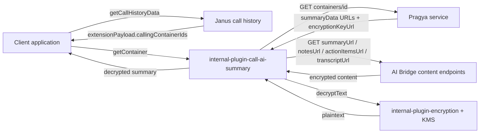
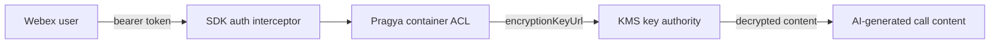

<!-- sdd-generated-metadata
doc_kind: standing-doc
generated_from: architecture@0.3.0
generated_by: claude-code
approved_by: "@riag"
updated_at: 2026-09-23T14:03:22Z
validation_status: pass
-->

# @webex/internal-plugin-call-ai-summary architecture

Canonical repository-wide architecture. This document owns facts that span
multiple services, packages, modules, applications, or repositories. Link to
the owning service, module, feature, ADR, or native contract instead of
duplicating owner-local detail.

Related context: [specification registry](specs/README.md) ·
[repository agent instructions](../AGENTS.md)

## Applicability

| Condition ID                         | Status | Evidence or reason | Owned section                       |
| ------------------------------------ | ------ | ------------------ | ----------------------------------- |
| `repo.owns_datastore`                | N/A    | The package persists nothing; all content is fetched per call from Pragya and AI Bridge. `src/ai-summary.ts` | Repository data and schema          |
| `repo.holds_client_state`            | N/A    | The WebexPlugin.extend object holds no session state between calls. `src/ai-summary.ts` | Client state model                  |
| `repo.components_interact`           | N/A    | Single module; interaction with upstream services is covered by Interaction and execution flows. `src/` | Dependency and interaction topology |
| `repo.domain_data_across_components` | N/A    | One module owns all domain data in this package. `src/types.ts` | Object and data ownership           |
| `repo.caches_data`                   | N/A    | No cache layer exists in the source. `src/ai-summary.ts` | Caching catalog                     |
| `repo.observability_convention`      | Applicable | Every public method logs failures through this.logger.error before rethrowing. `src/ai-summary.ts` | Observability patterns              |
| `repo.deploys_to_infra`              | N/A    | Published library; no deployment surface or infrastructure. `package.json` | Runtime and infrastructure          |
| `repo.shared_base_libs`              | Applicable | Inherits WebexPlugin, request handling, and the auth interceptor from @webex/webex-core. `package.json` | Shared and base libraries           |
| `repo.is_monorepo`                   | N/A    | The SDD root is one package; the surrounding monorepo is out of this scope. `package.json` | Package map and dependencies        |
| `repo.multi_platform`                | Applicable | Supports both browser and Node.js environments. `package.json` | Platform matrix                     |
| `repo.published_package`             | Applicable | Published to npm via the deploy:npm script. `package.json` | Release and versioning              |
| `repo.embedded_in_host`              | Applicable | Registers into a host Webex SDK instance as webex.internal.aisummary. `src/index.ts` | Host integration and theming        |
| `repo.exposes_commands_or_artifacts` | Applicable | Publishes a build artifact to dist/ and exposes documented yarn commands. `package.json` | Commands and generated artifacts    |
| `repo.cross_repo_deps_material`      | Applicable | Behavior depends on the externally owned Pragya, AI Bridge, Janus, and KMS services. `src/constants.ts` | Cross-repository topology           |
| `repo.security_arch_warranted`       | Applicable | All content is KMS-encrypted and every call is token-authenticated. `src/ai-summary.ts` | Security architecture               |

## Design overview

The Webex JS SDK will provide AI-generated call summary retrieval capabilities through a new **`internal-plugin-call-ai-summary`** internal plugin. This document describes the architecture for retrieving AI-generated notes, action items, and transcripts from completed calls.

AI summary content is discovered through a two-step lookup: **Janus** (call history) provides container IDs, and **Pragya** (AI container service) resolves those IDs into content URLs and an encryption key.

The package pursues these goals:

- Resolve AI summary container IDs from Janus call history via Pragya
- Retrieve AI-generated notes (full notes) for a call
- Retrieve AI-generated action items for a call
- Retrieve transcript download URLs for a call
- Handle encrypted content decryption via KMS
- Maintain consistency with existing Webex JS SDK internal plugin patterns
- Provide type-safe interfaces for all operations
- Support both browser and Node.js environments

The following are explicitly out of scope:

- Start/stop AI assistant during active calls (handled by Pragya start/stop APIs, out of scope)
- Generate or regenerate summaries (backend-managed during/after calls)
- Provide real-time in-call AI responses
- Handle recording storage or deletion
- Implement feedback UI components

Operation depends on two prerequisites:

1. Janus API already returns `extensionPayload.callingContainerIds` in the response
2. Testing environment with AI-enabled calls that generate summaries

The decisions that shape this structure are recorded in
[ADR-0001](adr/0001-flatten-container-response-and-prefer-single-request-summary.md).

## Resource inventory and responsibilities

| Component | Responsibility |
| --------- | -------------- |
| `internal-plugin-call-ai-summary` | Internal plugin; resolves Pragya containers, fetches and decrypts summary content |
| `internal-plugin-encryption` | KMS integration for decrypting AI-generated content using `encryptionKeyUrl` |
| `http-core` | HTTP transport; adds authorization headers, handles retries |
| Pragya Service | Container metadata; provides content URLs and encryption key |
| Summary Content Endpoints | Serve encrypted AI-generated content (notes, action items, transcripts) |

Only the first component is owned by this repository. Its source is `src/` and its canonical
specification is [`src/docs/README.md`](../src/docs/README.md); it is owned by the Webex JS SDK Team.
The encryption plugin and HTTP transport are sibling workspace packages, and the Pragya and summary
content services are externally owned.

## Interaction and execution flows

AI summary content is discovered in three steps.

**Step 1: Get container IDs from Janus call history**

The Janus `UserSession` response includes an `extensionPayload` field containing container IDs for AI artifacts related to a call:

The `extensionPayload.callingContainerIds` field is already present in the Janus API response but is not yet in the SDK's `UserSession` type definition, so consumers read it from the raw session payload. The exact session shape is owned by the Janus call-history type declaration rather than restated here.

**Step 2: Resolve container IDs via Pragya**

For each `containerId`, call the Pragya container API at `GET https://{pragya-host}/pragya/api/v1/containers/{containerId}`. The raw Pragya response nests summary URLs under `summaryData.data`. The plugin's `getContainer()` method flattens this so consumers can access `summaryData.summaryUrl` directly; the exact response body is owned by `src/types.ts`.

**Step 3: Fetch summary content from the URLs**

The `summaryData` object provides direct, region-correct URLs to each content type. The plugin fetches content from these URLs and decrypts it using the `encryptionKeyUrl` returned alongside them.

The component architecture places the client application above the SDK, the plugin beside the
encryption plugin and HTTP transport inside `webex.internal`, and the Pragya and summary-content
services outside the SDK boundary. The end-to-end retrieval flow runs call history, then container
resolution, then content fetch and decryption, in that order.

| From | To | Interaction or transport | Purpose | Failure or compatibility behavior |
| ---- | -- | ------------------------ | ------- | --------------------------------- |
| Client | Janus | HTTPS call | Get call history and container IDs | Owned by the call-history plugin |
| Plugin | Pragya | `webex.request` with `service: 'pragya'` | Resolve container metadata, content URLs, and encryption key | 401/403/404 normalized by `_handleError`; see the module spec |
| Plugin | AI Bridge | `webex.request` with an absolute `uri` | Fetch encrypted note, short note, action items, and transcript | 404 becomes `Summary content not available or expired` |
| Plugin | `internal-plugin-encryption` | In-process call to `decryptText` | Decrypt every `aiGeneratedContent` field | Rejection propagates through `_handleError` |

Get-container, get-notes and get-action-items each follow the same shape: validate input, issue one
request, then decrypt. Per-method sequence detail and failure branches are owned by
[the module specification](../src/docs/README.md).

## Dependency topology

Internal workspace dependencies, both declared `workspace:*` in `package.json` and both consumed by
`src/`:

| Package | Purpose |
| ------- | ------- |
| `@webex/webex-core` | Plugin infrastructure (`WebexPlugin`, `registerInternalPlugin`) |
| `@webex/internal-plugin-encryption` | Content decryption via `decryptText()` |

External service dependencies. A `webex-core` request rejection or a `decryptText` rejection
propagates to the caller through `_handleError`:

| Service | Purpose | Discovery |
| ------- | ------- | --------- |
| **Janus** | Call history; provides `extensionPayload.callingContainerIds` | U2C: `serviceName: "janus"` |
| **Pragya** | Container metadata; provides content URLs and encryption key | U2C: `serviceName: "pragya"` |
| **Summary Content Endpoints** | Serve encrypted AI-generated content | Direct URLs from Pragya response |
| **KMS** | Encryption key management | Via `encryptionKeyUrl` from Pragya |

Pragya is discoverable via U2C as `serviceName: "pragya"` (validated: e.g., load-us resolves to `https://pragya-loada.ciscospark.com/pragya/api/v1`). There are no dependency cycles: the package is
a leaf consumer of `webex-core` and the encryption plugin. Exact versions stay in `package.json`.

## Public and consumer surfaces

| Surface | Type | Owner | Consumers | Compatibility policy | Source |
| ------- | ---- | ----- | --------- | -------------------- | ------ |
| `aisummary-sdk` | SDK | `src/` | Webex SDK consumers via `webex.internal.aisummary` | Internal plugin; does not strictly adhere to semantic versioning | `src/ai-summary.ts` |
| `aisummary-package-entry` | SDK | `src/` | Anything importing the package | Internal; import performs registration | `src/index.ts` |
| `aisummary-types` | SDK | `src/` | TypeScript consumers | Internal; shipped as declarations with the package | `src/types.ts` |
| `pragya-containers-http` | API | Pragya service team | `src/` | Externally owned; consumed, not published here | External: Webex service catalog pragya. `src/constants.ts` |
| `ai-bridge-content-http` | API | AI Bridge service team | `src/` | Externally owned; URLs supplied at runtime by PragyaSummaryData | `src/types.ts` |
| `webex-encryption-sdk` | SDK | Webex JS SDK Team | `src/` | Workspace peer; decryptText contract from @webex/internal-plugin-encryption | `package.json` |

No repository-owned HTTP API exists, so no OpenAPI document is selected. See
`.sdd/manifest.json` `contract_catalog` for the authoritative registry.

## Cross-cutting architecture

### Security

- Trust boundaries and identity flow: all API calls (Pragya and content URLs) require a valid user bearer token, and the token is automatically attached by the SDK's HTTP layer.
- Sensitive surfaces and data classes: AI-generated call content — notes, short notes, action items, and transcripts — is personal meeting content and is never logged in plaintext.
- Encryption and secret boundaries: all AI-generated content is encrypted at rest with KMS, `encryptionKeyUrl` from Pragya container is the decryption key, and HTTPS required for all API calls.

### Observability and operations

- Logging and correlation: every public method catches failures and calls `this.logger.error` with a `AISummary->{method} failed` label before rethrowing a normalized error.
- Metrics, traces, and audit signals: none are emitted by this package; the host SDK owns transport-level telemetry.
- Ownership and operational entry points: Webex JS SDK Team; upstream availability is owned by the Pragya and AI Bridge service teams.

### Quality attributes

The package is an SDK, so its measurable boundaries are footprint and compatibility rather than
service SLOs: it adds two workspace dependencies and no transitive runtime services, supports both
browser and Node.js environments, and holds no state between calls. Content latency is dominated by
the upstream Pragya and AI Bridge calls plus per-field KMS decryption, which runs concurrently
through `Promise.all` for snippet collections.

## Observability patterns

| Signal | Convention or required fields | Propagation or naming rule | Primary evidence |
| ------ | ----------------------------- | -------------------------- | ---------------- |
| Logs | `this.logger.error` with the error and relevant identifiers | `AISummary->{methodName} failed` | `src/ai-summary.ts` |
| Metrics | None emitted by this package | N/A | `src/ai-summary.ts` |
| Traces | None emitted by this package | N/A | `src/ai-summary.ts` |
| Audit | None emitted by this package; access control is enforced upstream | N/A | `src/ai-summary.ts` |

## Shared and base libraries

| Library | Inherited responsibility | Consumers | Version floor | Compatibility rule |
| ------- | ------------------------ | --------- | ------------- | ------------------ |
| `@webex/webex-core` | Base plugin class, request handling, auth interceptor | `src/` | `workspace:*` | Follows the monorepo's synchronized workspace version |
| `@webex/internal-plugin-encryption` | KMS decryption via `decryptText` | `src/` | `workspace:*` | Follows the monorepo's synchronized workspace version |

## Platform matrix

| Platform | Shared versus platform-specific boundary | Entry or build | Support and compatibility constraints |
| -------- | ---------------------------------------- | -------------- | ------------------------------------- |
| Browser | Fully shared; no platform-specific source | `dist/index.js` via `yarn build` | Requires a registered device and Mercury connection for KMS |
| Node.js | Fully shared; no platform-specific source | `dist/index.js` via `yarn build` | `engines.node >=16` per `package.json` |

## Release and versioning

| Artifact | Publish target | Versioning rule | Deprecation window | Changelog or migration obligation |
| -------- | -------------- | --------------- | ------------------ | --------------------------------- |
| `@webex/internal-plugin-call-ai-summary` | npm via `yarn deploy:npm` | Internal plugin; does not strictly adhere to semantic versioning | None declared | Monorepo release tooling owns changelog generation |

## Host integration and theming

| Host or integration | Mount or entry contract | Required providers or peers | Theming and accessibility constraints |
| ------------------- | ----------------------- | --------------------------- | ------------------------------------- |
| Webex JS SDK instance | `registerInternalPlugin('aisummary', ...)` on import; reachable at `webex.internal.aisummary` | An authenticated SDK instance with a registered device, plus `@webex/internal-plugin-encryption` | N/A — no UI surface |

## Commands and generated artifacts

| Command or artifact | Owner | Inputs | Output or side effect | Compatibility boundary |
| ------------------- | ----- | ------ | --------------------- | ---------------------- |
| `yarn build` | `src/` | `src/**/*.ts` | Compiled JS, type declarations, and maps in `dist/` | `main` entry point `dist/index.js` |
| `yarn test:style` | `src/` | `src/**/*` | ESLint report | Repository lint configuration |
| `yarn test:unit` | `src/` | Unit test sources | Jest run | No test sources exist yet; see the module spec |

## Cross-repository topology

| Repository or external system | Relationship | Exchanged contract or artifact | Owner | Sequencing constraint |
| ----------------------------- | ------------ | ------------------------------ | ----- | --------------------- |
| Janus | Consumes | `extensionPayload.callingContainerIds` from call history | Janus service team | Must run before container resolution |
| Pragya | Consumes | Container metadata, content URLs, `encryptionKeyUrl` | Pragya service team | Must run before any content fetch |
| AI Bridge | Consumes | Encrypted note, short note, action items, transcript | AI Bridge service team | Requires URLs from Pragya |
| KMS | Consumes | Decryption keys addressed by `encryptionKeyUrl` | KMS service team | Requires device registration and Mercury |

## Security architecture

Authentication, authorization, and content protection are enforced across three boundaries. Only call participants or authorized users can access containers and summaries; org-level AI features must be enabled; and per-call consent means the AI assistant must have been enabled during the call. The package itself enforces none of these — it presents the user's bearer token and surfaces upstream 401/403 responses as normalized errors.

All AI-generated content is encrypted using KMS (Key Management Service). The **Encryption Key** is the `encryptionKeyUrl` from the Pragya container response (format: `kms://kms-{region}.wbx2.com/keys/{key-id}`); the **Encrypted Fields** are `aiGeneratedContent` in notes and action item snippets; and **Decryption** uses `@webex/internal-plugin-encryption` via `decryptText()`. The SDK uses the existing `@webex/internal-plugin-encryption` plugin rather than implementing key handling locally.

This is the same pattern used by existing plugins — the **AI Assistant Plugin** (`internal-plugin-ai-assistant/src/utils.ts`) and the **Task Plugin** (`internal-plugin-task/src/helpers/decrypt.helper.js`) both call `decryptText` with a key URL and ciphertext. The exact call shape is owned by `src/ai-summary.ts`.

## Domain language

| Term | Repository-specific meaning | Authoritative source |
| ---- | --------------------------- | -------------------- |
| Container | A Pragya-owned record grouping the AI artifacts for one call, addressed by `containerId` | `src/types.ts` |
| Pragya | The AI container service that resolves container IDs into content URLs and an encryption key | `src/constants.ts` |
| AI Bridge | The service behind `summaryUrl`, `notesUrl`, `actionItemsUrl`, and `transcriptUrl` that serves encrypted content | `src/types.ts` |
| Janus | The call-history service that surfaces `extensionPayload.callingContainerIds` | External |
| Note / short note | The long and condensed AI-generated summaries of a call | `src/types.ts` |
| Snippet | One action item or one timed transcript segment | `src/types.ts` |

## References and maintenance

- Decisions: [adr/](adr/)
- Instantiated specifications and routing: [specs/README.md](specs/README.md)
- Repository rules and patterns: [module specification](../src/docs/README.md)
- Update this document in the same change that alters repository boundaries,
  resource ownership, cross-resource interaction, or cross-cutting
  architecture.
