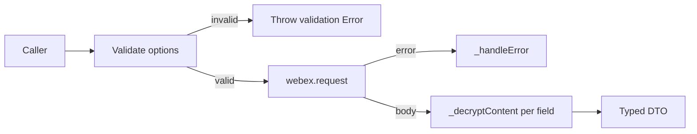
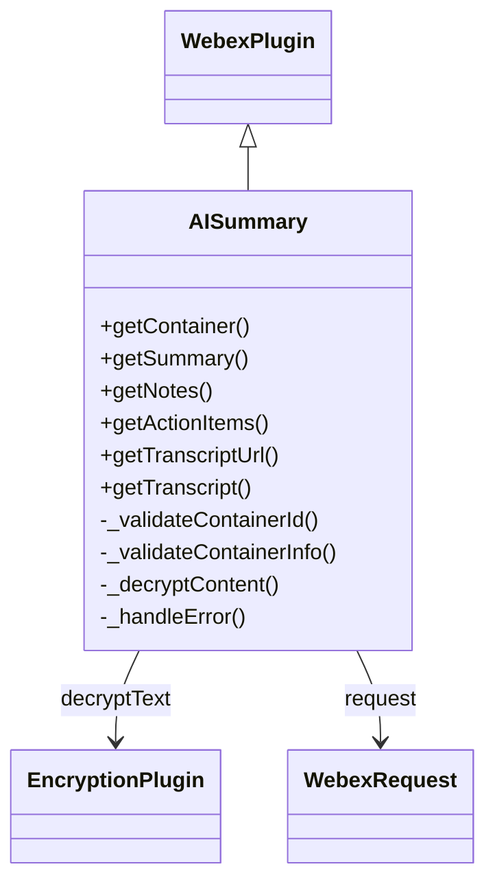

<!-- sdd-generated-metadata
doc_kind: module-spec
generated_from: module-spec@0.3.0
generated_by: claude-code
approved_by: "@riag"
updated_at: 2026-09-23T14:03:22Z
validation_status: pass
-->

# AI call summary plugin

This source-local document at `src/docs/README.md` owns the stable
specification for **the AI call summary plugin**. Ground every claim in repository evidence
and link to the
[repository architecture](../../docs/architecture.md)
instead of repeating broader facts.

Related context: [documentation index](../../docs/index.md) ·
[repository agent instructions](../../AGENTS.md)

## Metadata

| Field         | Value                                                        |
| ------------- | ------------------------------------------------------------ |
| Owner         | Webex JS SDK Team                                            |
| Source path   | `src/`                                                       |
| Resource kind | package                                                      |
| Status        | Active                                                       |
| Last verified | 2026-09-23 at `bc61c78ba5`                                   |
| Module id     | `src/`                                                       |
| Parent spec   | —                                                            |
| Doc kind      | Module spec                                                  |
| Coverage score | 100% assessed 2026-09-23 — six of six public methods and ten of ten exported types specced; independent validation found no drift |
| Validation status | pass, validator codex, assessed 2026-09-23                  |

## Applicability

| Condition ID                         | Status | Evidence or reason | Owned section                 |
| ------------------------------------ | ------ | ------------------ | ----------------------------- |
| `module.has_tiers`                   | N/A    | The repository assigns no operational tiers to packages. `package.json` | Tier                          |
| `module.has_ui`                      | N/A    | No UI surface; the module returns data only. `src/ai-summary.ts` | UI use-case flow              |
| `module.crosses_service_boundaries`  | Applicable | Calls the Pragya and AI Bridge services over HTTPS. `src/ai-summary.ts` | Cross-boundary use-case flow  |
| `module.holds_client_state`          | N/A    | No state is retained between method calls. `src/ai-summary.ts` | Client state model            |
| `module.enforces_domain_rules`       | N/A    | Validation is input checking, not domain-rule enforcement. `src/ai-summary.ts` | Business rules and invariants |
| `module.is_concurrent_async`         | Applicable | Snippet decryption runs concurrently via Promise.all. `src/ai-summary.ts` | Concurrency and reactive flow |
| `module.owns_persistence`            | N/A    | The module persists nothing. `src/ai-summary.ts` | Data, schema, and migration   |
| `module.stateful_transitions`        | N/A    | No state machine; each method is a single request-response. `src/ai-summary.ts` | State machine                 |
| `module.exposes_wire_protocol`       | N/A    | Consumes upstream HTTP; exposes no wire format of its own. `src/ai-summary.ts` | Protocol and wire format      |
| `module.ui_multi_screen`             | N/A    | No UI surface. `src/ai-summary.ts` | UI flow                       |
| `module.large_data_model`            | N/A    | Ten interfaces, all flat DTOs. `src/types.ts` | Data model                    |
| `module.returns_caller_errors`       | Applicable | The _handleError helper normalizes upstream failures into caller-facing Error messages. `src/ai-summary.ts` | Caller-visible failure modes  |
| `module.module_specific_conventions` | N/A    | Follows repository-wide plugin conventions only. `src/index.ts` | Module-specific rules         |
| `module.published_package`           | Applicable | Published to npm via the deploy:npm script. `package.json` | Export stability              |
| `module.embedded_in_host`            | Applicable | Registers into a host Webex SDK instance. `src/index.ts` | Host integration and theming  |
| `module.has_design_tradeoff`         | Applicable | Response flattening and single-request summary retrieval are deliberate trade-offs. `src/ai-summary.ts` | Key design trade-off          |
| `module.has_submodules`              | N/A    | Computed has_submodules false; the module is a flat set of files with no child module owning its own spec. `src/ai-summary.ts` | Sub-modules                   |

## Evidence register

| Evidence         | What it establishes |
| ---------------- | ------------------- |
| `src/ai-summary.ts` | The six public methods, their validation, request, decryption, and error-normalization behavior |
| `src/types.ts` | The ten exported request and response interfaces and their optionality |
| `src/index.ts` | Plugin registration as `aisummary` and the side-effect import of the encryption plugin |
| `src/constants.ts` | Service name, container resource path, and the exact caller-visible error message strings |
| `src/config.ts` | The plugin config namespace, currently empty |
| `package.json` | Published package identity, engines, dependencies, and the documented command set |
| `src/manual-pragya-api-test.js` | A manual script validating the Pragya container response structure |
| `src/manual-integration-test.js` | A manual script exercising the end-to-end flow against live services |

Prior source basis: repository design and agent-guidance documentation, reconciled under the
`reconcile` policy; three stale testing claims were corrected against the current tree and one
omitted method was restored from code.

## Purpose and boundary

- Responsibility: resolve a Pragya container for a call and return decrypted AI-generated summary, notes, action items, and transcript content.
- In scope: container resolution, content retrieval from Pragya-supplied URLs, KMS decryption of every content field, and normalization of upstream errors.
- Out of scope: starting or stopping the AI assistant during a call, generating or regenerating summaries, real-time in-call AI responses, recording storage or deletion, and feedback UI components.
- Consumers: Webex SDK applications reaching the module through `webex.internal.aisummary`.

This plugin provides methods to:

1. Resolve a **Pragya container** by ID (returns metadata, summary URLs, and encryption key)
2. Fetch and decrypt **AI-generated summaries** (note, short note, action items) in a single call
3. Fetch and decrypt **AI-generated notes** via a dedicated notes endpoint
4. Fetch and decrypt **AI-generated action items** via a dedicated action items endpoint
5. Retrieve the **transcript URL** for a call
6. Fetch and decrypt the full call **transcript**

This is an internal Cisco Webex plugin. As such, it does not strictly adhere to semantic versioning. Use at your own risk.

## Structure and key files

| File | Description |
| ---- | ----------- |
| `src/index.ts` | Entry point. Registers the plugin via `registerInternalPlugin('aisummary', ...)`. |
| `src/ai-summary.ts` | Main plugin class extending `WebexPlugin`. Contains all public and private methods. |
| `src/types.ts` | TypeScript interfaces for request/response DTOs. |
| `src/constants.ts` | Service name, resource path, and error message constants. |
| `src/config.ts` | Plugin configuration (currently empty). |
| `src/manual-pragya-api-test.js` | Manual script validating the Pragya container response structure. |
| `src/manual-integration-test.js` | Manual script exercising device registration through transcript fetch. |

Unit tests live at `test/unit/spec/ai-summary.ts` with upstream wire fixtures at `test/unit/fixture/responses.ts`. The two
manual scripts remain the only verification against live services.

## Public surface

All methods are accessible via `webex.internal.aisummary`. Exact declarations are authoritative in
the linked sources and are not restated here.

| Surface  | Consumer   | Compatibility commitment | Source   |
| -------- | ---------- | ------------------------ | -------- |
| `getContainer` | Webex SDK consumers | Internal; no semantic-versioning guarantee | `src/ai-summary.ts` |
| `getSummary` | Webex SDK consumers | Internal; recommended entry point for summary content | `src/ai-summary.ts` |
| `getNotes` | Webex SDK consumers | Internal; depends on optional `notesUrl` | `src/ai-summary.ts` |
| `getActionItems` | Webex SDK consumers | Internal; depends on optional `actionItemsUrl` | `src/ai-summary.ts` |
| `getTranscriptUrl` | Webex SDK consumers | Internal; synchronous, returns a string | `src/ai-summary.ts` |
| `getTranscript` | Webex SDK consumers | Internal; returns decrypted transcript snippets | `src/ai-summary.ts` |
| Request and response types | TypeScript consumers | Internal; shipped as declarations | `src/types.ts` |

Request shapes, all issued through `this.webex.request` with the SDK auth interceptor supplying
`Authorization: Bearer {user_access_token}` and `Accept: application/json`:

- `getContainer` — `GET /pragya/api/v1/containers/{containerId} HTTP/1.1`, resolved through the service catalog as `service: 'pragya'`.
- `getSummary` — `GET {summaryData.summaryUrl}?fields=note,shortnote,actionitems HTTP/1.1`, as an absolute URI.
- `getNotes` — `GET {summaryData.notesUrl} HTTP/1.1`, as an absolute URI.
- `getActionItems` — `GET {summaryData.actionItemsUrl} HTTP/1.1`, as an absolute URI.
- `getTranscript` — `GET {summaryData.transcriptUrl} HTTP/1.1`, as an absolute URI.

Behavior of each method, in current-code terms:

- `getContainer` resolves a Pragya container by ID. Returns container metadata including summary URLs and the KMS encryption key URL. The raw response nests URLs under `summaryData.data`. The plugin's `getContainer()` flattens this automatically. `summaryData` contains summary URLs (`summaryUrl`, `transcriptUrl`, `status`, `summarizeAfterCall`); `encryptionKeyUrl` is the KMS key URL for decrypting content; and the response also carries `kmsResourceObjectUrl`, `aclUrl`, `forkSessionId`, `callSessionId`, `ownerUserId`, `orgId`, `start`, `end`. **Returns:** `Promise<PragyaContainerResponse>`
- `getSummary` fetches all AI-generated summary content (note, short note, and action items) from a single request to the summary URL, and decrypts each field. It issues `GET {summaryUrl}?fields=note,shortnote,actionitems`. It returns `id` (summary identifier), `note` (decrypted full note, HTML string), `shortNote` (decrypted short note, HTML string), `actionItems` (array of `ActionItemSnippet` objects), and `feedbackUrl` extracted from the `links` array (`rel: "feedback"`), if available. This is the **recommended** method for retrieving summary content.
- `getNotes` fetches AI-generated notes from the dedicated notes endpoint and decrypts via KMS. It issues `GET {notesUrl}` and requires `notesUrl` to be present in the container's `summaryData`.
- `getActionItems` fetches AI-generated action items from the dedicated action items endpoint and decrypts each snippet via KMS. It issues `GET {actionItemsUrl}` and requires `actionItemsUrl` to be present. When the response array is empty it returns `{id: undefined, snippets: []}`.
- `getTranscriptUrl` returns the transcript URL from the container info. Does not fetch or decrypt content. It is synchronous and returns a plain `string`.
- `getTranscript` fetches and decrypts the full call transcript, returning `id`, `totalCount`, and decrypted `snippets` each carrying `startTime`, `endTime`, `content`, `audioCSI`, and `speaker`.

Private helpers `_validateContainerId`, `_validateContainerInfo`, `_decryptContent`, and
`_handleError` are not part of the public surface.

## Dependencies

| Dependency            | Why it is required | Failure behavior                    |
| --------------------- | ------------------ | ----------------------------------- |
| `@webex/webex-core` | Base plugin class, request handling, auth interceptor | Request rejections are normalized by `_handleError` |
| `@webex/internal-plugin-encryption` | KMS decryption | Decryption rejection propagates to the caller through `_handleError` |
| Pragya service | Container metadata; provides content URLs and encryption key | 401/403/404 mapped to normalized error messages |
| AI Bridge content endpoints | Serve encrypted AI-generated content | 404 becomes `Summary content not available or expired` |
| KMS | Encryption key management | Key fetch failure rejects the calling method |

The Pragya and AI Bridge APIs require a valid Webex access token. The SDK's auth interceptor automatically attaches the token for URLs in the service catalog and for the absolute content URLs returned by Pragya.

## Requirements

| ID        | WHAT                                           | WHY                            | Source evidence | Test or example evidence            | Assumptions or gaps | Confidence                        |
| --------- | ---------------------------------------------- | ------------------------------ | --------------- | ----------------------------------- | ------------------- | --------------------------------- |
| `MOD-001` | `getContainer` flattens `summaryData.data` onto `summaryData` before returning | Consumers access `summaryData.summaryUrl` directly without knowing the upstream nesting | `src/ai-summary.ts` | `test/unit/spec/ai-summary.ts` | none | Present |
| `MOD-002` | Every content field is decrypted before it is returned to the caller | Callers must never receive JWE ciphertext | `src/ai-summary.ts` | `test/unit/spec/ai-summary.ts` | none | Present |
| `MOD-003` | A per-response `keyUrl` takes precedence over `containerInfo.encryptionKeyUrl` | Content responses may be sealed under a different key than the container | `src/ai-summary.ts` | `test/unit/spec/ai-summary.ts` | none | Present |
| `MOD-004` | Invalid input throws synchronously before any request is issued | Callers get immediate, actionable validation errors | `src/ai-summary.ts` | `test/unit/spec/ai-summary.ts` | none | Present |
| `MOD-005` | Upstream 401, 403, and 404 responses are normalized to fixed caller-facing messages | Callers branch on stable messages rather than transport details | `src/constants.ts` | `test/unit/spec/ai-summary.ts` | none | Present |
| `MOD-006` | `getTranscriptUrl` is synchronous and performs no network or decryption work | Callers can obtain the URL for downstream processing without cost | `src/ai-summary.ts` | `test/unit/spec/ai-summary.ts` | none | Present |
| `MOD-007` | The plugin self-registers as `aisummary` on import with zero changes to other packages | Consumers import the package directly; no bundle edit is required | `src/index.ts` | `test/unit/spec/ai-summary.ts` | none | Present |

## Design overview

The module is a single `WebexPlugin.extend` object with six public methods, four private helpers, and
no retained state. Each public method follows the same three-step shape: validate the caller's input,
issue exactly one HTTP request through `this.webex.request`, then decrypt every content field before
returning a typed DTO. Configuration is an empty `aisummary` namespace, so behavior is fully
determined by the container passed in by the caller.

Two upstream services are involved and the split matters. Pragya owns container metadata and is the
source of truth for both the content URLs and the encryption key. Because Pragya returns
fully-qualified, region-correct URLs, the module performs no separate service discovery for the
content endpoints — it fetches whatever absolute URL the container supplies. Only the container
lookup itself resolves through the service catalog, as `service: 'pragya'`.

The module deliberately owns all of its types, constants, and logic rather than extending shared SDK
types, which keeps it self-contained; the rationale and its costs are recorded in
[ADR-0001](../../docs/adr/0001-flatten-container-response-and-prefer-single-request-summary.md).

The complete implementation — the per-method validate/request/decrypt bodies, the
`summaryData.data` flattening, the `Promise.all` snippet decryption and the `keyUrl` fallback — is
authoritative in `src/ai-summary.ts` and is linked rather than restated here, so this specification
does not become a second contract surface that drifts from the code.

## Data flow and sequence coverage

The transport is HTTPS via `this.webex.request`, once per public method.

| Operation group | Entry and outcome | Diagram or evidence | Failure and recovery coverage |
| --------------- | ----------------- | ------------------- | ----------------------------- |
| Container resolution | `getContainer({containerId})` → flattened `PragyaContainerResponse` | `src/ai-summary.ts` | Empty id throws; 401/403/404 normalized |
| Single-request summary | `getSummary({containerInfo})` → decrypted note, short note, action items | `src/ai-summary.ts` | Missing `summaryUrl` or key throws; 404 normalized |
| Standalone notes | `getNotes({containerInfo})` → decrypted note content | `src/ai-summary.ts` | Missing `notesUrl` throws before any request |
| Standalone action items | `getActionItems({containerInfo})` → decrypted snippets | `src/ai-summary.ts` | Empty array returns `{id: undefined, snippets: []}` |
| Transcript URL | `getTranscriptUrl({containerInfo})` → URL string | `src/ai-summary.ts` | Missing `transcriptUrl` throws; no network call |
| Transcript content | `getTranscript({containerInfo})` → decrypted snippets | `src/ai-summary.ts` | Missing `transcriptUrl` throws; 404 normalized |

Each operation group keeps its own sequence rather than being collapsed into the shape above.

**Get container info flow.** Client calls `webex.internal.aisummary.getContainer({ containerId })`;
Validate containerId (non-empty string); `webex.request` with `method: 'GET'`, `service: 'pragya'`,
`resource: containers/${containerId}`; Flatten: if body.summaryData.data exists, set
body.summaryData = body.summaryData.data; Return PragyaContainerResponse (with flat summaryData).

**Get notes flow.** Client calls `webex.internal.aisummary.getNotes(containerInfo)`; Validate
containerInfo has summaryData.notesUrl and encryptionKeyUrl; `webex.request` with `method: 'GET'`,
`uri: containerInfo.summaryData.notesUrl`; Response: `{ id, aiGeneratedContent: "<encrypted>",
feedbackUrl?, keyUrl }`; Decrypt aiGeneratedContent using containerInfo.encryptionKeyUrl; Return
decrypted SummaryNotes.

**Get action items flow.** Client calls `webex.internal.aisummary.getActionItems(containerInfo)`;
Validate containerInfo has summaryData.actionItemsUrl and encryptionKeyUrl; `webex.request` with
`method: 'GET'`, `uri: containerInfo.summaryData.actionItemsUrl`; Response: `[{ id, keyUrl,
snippets: [{ id, content, aiGeneratedContent }] }]`; Decrypt all aiGeneratedContent fields using
containerInfo.encryptionKeyUrl; Return decrypted SummaryActionItems.

## Class and component relationships

The module is registered onto the host SDK by `registerInternalPlugin('aisummary', AISummary, {config})` in `src/index.ts`, which also imports `@webex/internal-plugin-encryption` for its side effects and re-exports the plugin as the package default. Importing the package is what performs that registration; the exact entry-point declarations are authoritative in `src/index.ts`.

## Use cases and flows

| Use case | Actor or caller | Primary steps and outcome     | Failure or boundary behavior | Evidence                  |
| -------- | --------------- | ----------------------------- | ---------------------------- | ------------------------- |
| `UC-001` | SDK consumer | Read `extensionPayload.callingContainerIds` from call history, call `getContainer`, then `getSummary`; receive decrypted note, short note, and action items | Any upstream 401/403/404 surfaces as a normalized `Error` | `src/ai-summary.ts` |
| `UC-002` | SDK consumer | Call `getNotes` for note content only | Throws when `notesUrl` is absent from the container | `src/ai-summary.ts` |
| `UC-003` | SDK consumer | Call `getActionItems` for action items only | Returns an empty snippet list when the response array is empty | `src/ai-summary.ts` |
| `UC-004` | SDK consumer | Call `getTranscriptUrl` to hand the URL to downstream processing | Synchronous throw when `transcriptUrl` is absent | `src/ai-summary.ts` |
| `UC-005` | SDK consumer | Call `getTranscript` to obtain timed, decrypted transcript snippets | Throws when `transcriptUrl` or the key is absent | `src/ai-summary.ts` |

### Cross-boundary use-case flow

Every use case crosses a network boundary twice: once to Pragya through the service catalog, and once
to an AI Bridge URL supplied by that container. Ordering is strict — a container must be resolved
before any content call, because the content URLs and the encryption key both come from it. There is
no retry, timeout, or circuit-breaking logic in this module; those are inherited from the SDK HTTP
layer. Compatibility is loose by design: `notesUrl` and `actionItemsUrl` are optional, so the module
must tolerate their absence rather than assume a fixed upstream version.

Decryption depends on a prerequisite chain that the SDK satisfies automatically: a registered device (`webex.internal.device.register()`), a Mercury WebSocket connection (initiated automatically during KMS key fetch), an ECDHE key exchange with KMS, and key retrieval from KMS using the `encryptionKeyUrl`. The SDK handles these steps automatically when `decryptText` is called.

## Concurrency and reactive flow

- Execution model: promise-based async methods on a stateless plugin object; no workers, timers, or subscriptions.
- Ordering guarantees: container resolution must precede content retrieval; within a method, decryption follows the single request.
- Idempotency and retry: every method is a read and is therefore naturally idempotent; the module itself performs no retries.
- Shared-state protection: none required — the module holds no mutable state between calls.
- Blocking restrictions: snippet collections are decrypted concurrently with `Promise.all` rather than sequentially, so a large transcript does not serialize KMS round-trips.

## Caller-visible failure modes

The plugin normalizes HTTP errors into descriptive messages. Validation errors are thrown synchronously, before any request is issued.

| Error Type | HTTP Status | SDK Error Message | Recovery Action |
| ---------- | ----------- | ----------------- | --------------- |
| Invalid Container ID | N/A (client) | "containerId is required and must be a non-empty string" | Validate input |
| Invalid Container Info | N/A (client) | "containerInfo with valid summaryData and encryptionKeyUrl is required" | Ensure getContainer was called first |
| Authentication Failed | 401 | "Authentication failed: Invalid or expired token" | Re-authenticate user |
| Access Denied | 403 | "Access denied: User not authorized to view this summary" | Check user permissions |
| Container Not Found | 404 | "Container not found" | Verify containerId from Janus |
| Content Not Found | 404 (non-getContainer) | "Summary content not available or expired" | Content may have been deleted or expired |
| Summary Not Ready | N/A | summaryData.status !== "Active" | Retry after delay |
| Unmapped failure | Any other | "{methodName} failed: {error.message}" | Depends on the underlying cause |

The exact message strings are declared in `src/constants.ts` and the status mapping in
`_handleError` in `src/ai-summary.ts`; callers branch on these strings, so changing one is a
breaking change.

## Pitfalls and constraints

- The raw Pragya response nests URLs under `summaryData.data`; `getContainer` flattens it automatically, so code that re-reads `summaryData.data` after calling `getContainer` will find nothing there.
- `notesUrl` and `actionItemsUrl` may not be present in all API versions. Prefer `getSummary()`, which returns notes, short notes, and action items in one request.
- A per-response `keyUrl` overrides `containerInfo.encryptionKeyUrl`; code that decrypts with the container key alone can fail on content sealed under a different key.
- `getTranscriptUrl` is synchronous and returns a `string`, unlike every other public method — awaiting it yields the string, but treating it as a promise-returning API is a mistake.
- Summary availability is not guaranteed: `summaryData.status` must be `Active`, org-level AI features must be enabled, and the AI assistant must have been enabled during the call.
- Decryption requires a registered device and a working Mercury connection; calling the module on an unregistered SDK instance fails inside KMS key retrieval rather than at validation.

## Export stability

| Export or entry point | Consumer   | Stability | Versioning and deprecation rule | Declaration or API report |
| --------------------- | ---------- | --------- | ------------------------------- | ------------------------- |
| default export `AISummary` | Webex SDK consumers | Internal | Does not strictly adhere to semantic versioning | `src/index.ts` |
| `webex.internal.aisummary` namespace | Webex SDK consumers | Internal | Registered on import; renaming is a breaking change | `src/index.ts` |
| Request and response interfaces | TypeScript consumers | Internal | Shipped as declarations built to `dist/` | `src/types.ts` |

## Host integration and theming

- Mount or entry contract: importing `@webex/internal-plugin-call-ai-summary` calls `registerInternalPlugin('aisummary', ...)`, making the module reachable at `webex.internal.aisummary`.
- Required providers, peers, or host versions: an authenticated Webex SDK instance with a registered device, plus `@webex/internal-plugin-encryption`, which the entry point imports for its side effects.
- Theme and design-token contract: N/A — the module renders nothing.
- Accessibility and lifecycle obligations: N/A — no UI surface; note that `note` and `shortNote` are HTML strings, so consumers that render them own their own sanitization and accessibility.

## Key design trade-off

| Chosen trade-off | Preserved invariant or benefit | Cost or limitation | Decision evidence |
| ---------------- | ------------------------------ | ------------------ | ----------------- |
| Flatten `summaryData.data` onto `summaryData` inside `getContainer` | Consumers access `summaryData.summaryUrl` directly and are insulated from the upstream nesting | The returned object no longer matches the raw Pragya wire body, so wire-level debugging must account for the transform | `docs/adr/0001-flatten-container-response-and-prefer-single-request-summary.md` |
| Prefer one `getSummary` request over three standalone calls | One round trip returns note, short note, and action items, and tolerates optional URLs being absent | Callers wanting only one content type still pay for the combined response | `docs/adr/0001-flatten-container-response-and-prefer-single-request-summary.md` |
| Self-contained plugin owning its own types and constants | Zero changes to existing packages; the plugin can ship independently | Type definitions overlap conceptually with neighbouring plugins and must be maintained in parallel | `src/types.ts` |
| No separate service discovery for content URLs | Region correctness comes from Pragya for free | The module trusts absolute URLs supplied by an upstream response | `src/ai-summary.ts` |

## Verification

| Requirement or invariant | Test level                    | Positive evidence | Negative or boundary evidence | Gap                    |
| ------------------------ | ----------------------------- | ----------------- | ----------------------------- | ---------------------- |
| `MOD-001` | Unit | `test/unit/spec/ai-summary.ts` | `test/unit/spec/ai-summary.ts` (already-flat body left untouched) | none |
| `MOD-002` | Unit | `test/unit/spec/ai-summary.ts` | `test/unit/spec/ai-summary.ts` (decryption failure propagates) | none |
| `MOD-003` | Unit | `test/unit/spec/ai-summary.ts` | `test/unit/spec/ai-summary.ts` (falls back when the response keyUrl is absent) | none |
| `MOD-004` | Unit | `test/unit/spec/ai-summary.ts` | `test/unit/spec/ai-summary.ts` (empty, whitespace, undefined, non-string) | none |
| `MOD-005` | Unit | `test/unit/spec/ai-summary.ts` | `test/unit/spec/ai-summary.ts` (unmapped failure is method-prefixed) | none |
| `MOD-006` | Unit | `test/unit/spec/ai-summary.ts` | `test/unit/spec/ai-summary.ts` (throws when the transcriptUrl field is absent) | none |
| `MOD-007` | Unit | `test/unit/spec/ai-summary.ts` | `test/unit/spec/ai-summary.ts` (all six methods present on a real WebexCore instance) | none |

The module has an automated unit suite at `test/unit/spec/ai-summary.ts`: **38 tests**, run with `yarn test:unit`
(`webex-legacy-tools test --unit --runner jest`). Upstream wire fixtures live in
`test/unit/fixture/responses.ts`, which is the repository's only record of the externally owned
Pragya and AI Bridge response shapes.

All six public methods are covered, along with the `summaryData.data` flattening transform, the
`keyUrl` precedence rule, every validation branch, and each normalized error mapping. Two manual
scripts under `src/` remain the only end-to-end verification against live services, and both require
a token and container ID.

Registration (`MOD-007`) is covered too: because `registerInternalPlugin` runs as an import side
effect, those three cases assert against the internal-core plugin registry. They deliberately do
**not** construct a live `WebexCore` — doing so boots the service catalog, which fires asynchronous
U2C requests that outlive the test and make the runner exit nonzero even though every assertion
passes. Every documented requirement now has unit evidence.

The suite requires only `engines.node >=16` and is verified on Node 24.10 as well as the monorepo's
pinned 22.14, so it can be run without `nvm`.
