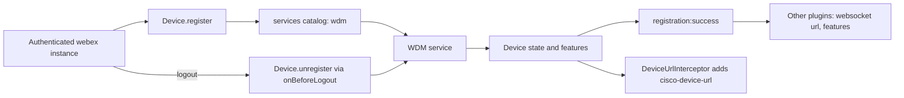
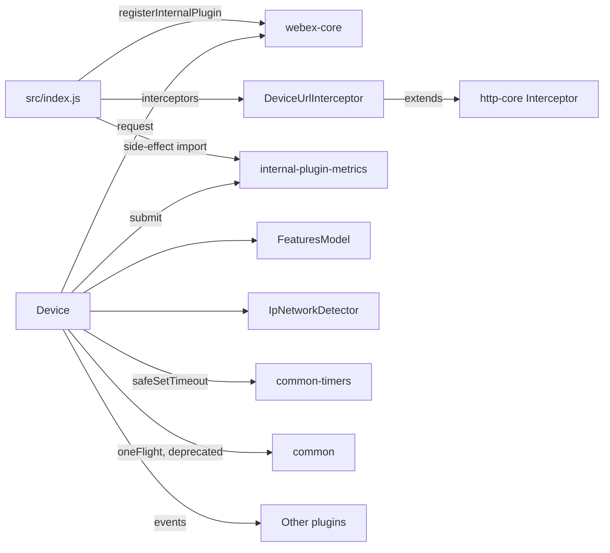

<!-- sdd-generated-metadata
doc_kind: standing-doc
generated_from: architecture@0.3.0
generated_by: claude-code
approved_by: pending
updated_at: 2026-10-07T05:05:58Z
validation_status: pass
-->

# @webex/internal-plugin-device architecture

Canonical architecture for the `@webex/internal-plugin-device` package, an internal plugin of the Webex JS SDK
monorepo. The SDD scope is this package only; the surrounding monorepo is a dependency context, not part of this
document. Owner-local detail lives in the [module specification](../src/docs/README.md).

Related context: [specification registry](specs/README.md) ·
[repository agent instructions](../AGENTS.md)

## Applicability

| Condition ID                         | Status     | Evidence or reason                                                                                     | Owned section                       |
| ------------------------------------ | ---------- | ------------------------------------------------------------------------------------------------------ | ----------------------------------- |
| `repo.owns_datastore`                | N/A        | No store, schema, or migration exists in src/; storage is delegated to @webex/webex-core            | Repository data and schema          |
| `repo.holds_client_state`            | Applicable | `src/device.js` keeps registration, session, and feature state in memory                                | Client state model                  |
| `repo.components_interact`           | Applicable | `src/index.js` wires the plugin, interceptor, and webex.internal collaborators together               | Dependency and interaction topology |
| `repo.domain_data_across_components` | N/A        | One writer: `src/device.js` owns the device data; other plugins only read it                            | Object and data ownership           |
| `repo.caches_data`                   | Applicable | Persisted device state and the etag-based feature cache in `src/device.js`                              | Caching catalog                     |
| `repo.observability_convention`      | Applicable | device:-prefixed logs, internal events, and client metrics in `src/device.js` and `src/metrics.js`     | Observability patterns              |
| `repo.deploys_to_infra`              | N/A        | A library; `package.json` defines no deployment target other than npm publication                       | Runtime and infrastructure          |
| `repo.shared_base_libs`              | N/A        | No base library stack is inherited by multiple resources inside this package                            | Shared and base libraries           |
| `repo.is_monorepo`                   | N/A        | The scoped repository is a single package with one module                                               | Package map and dependencies        |
| `repo.multi_platform`                | Applicable | Browser and Node targets: `src/config.js` branches on inBrowser, `package.json` has test:browser    | Platform matrix                     |
| `repo.published_package`             | Applicable | `package.json` declares main and deploy:npm                                                         | Release and versioning              |
| `repo.embedded_in_host`              | N/A        | A plugin of @webex/webex-core, not mounted into a host UI                                             | Host integration and theming        |
| `repo.exposes_commands_or_artifacts` | N/A        | No CLI, generator, or stable file output; `package.json` scripts are developer tooling                  | Commands and generated artifacts    |
| `repo.cross_repo_deps_material`      | N/A        | All dependencies resolve inside the same workspace or npm                                               | Cross-repository topology           |
| `repo.security_arch_warranted`       | N/A        | No credential, token, or encryption handling in src/; identity-header rule is covered under Security  | Security architecture               |

## Design overview

The package gives every Webex SDK instance one **registered device**: a server-side record at the WDM
(web device manager) service that other Webex services key on, plus the local state returned with it — device and
WebSocket URLs, feature toggles, and organization policy. It exists as a separate plugin because dozens of other
plugins need that registration before they can talk to the backend, but the registration itself is
independent of messaging, meetings, or calling.

Shape: one Ampersand model (`Device`) registered as `webex.internal.device`, owning two children (a
three-collection feature container and an IP-network detector) and one request interceptor that stamps
outbound requests with the device URL. Registration is request/response against WDM with three lifecycle
operations (register, refresh, unregister), a self-healing path for expired registrations (404 on refresh) and
for the per-user device limit (cleanup then retry). Local policy logic (inactivity logout and intranet
reachability) hangs off properties delivered in the same payload.

Key decisions evidenced in the code: callers need not know registration state because `register()` and `refresh()`
delegate to each other; concurrent calls share one in-flight request; unknown WDM fields are tolerated so backend
additions do not break clients; and responses arriving after a logout are discarded. Details are in the module
specification.

## Resource inventory and responsibilities

| Resource                       | Kind                      | Responsibility                                                                                                  | Owner                                  | Source | Detailed specification  |
| ------------------------------ | ------------------------- | --------------------------------------------------------------------------------------------------------------- | -------------------------------------- | ------ | ----------------------- |
| `@webex/internal-plugin-device` | package (single module `src`) | Device registration lifecycle, device-derived state, `cisco-device-url` header, IP network detection | Webex JS SDK maintainers               | src/ | `src/docs/README.md`    |

## Interaction and execution flows

Representative flow: a client authenticates, the device registers, other plugins use the device URL and
WebSocket URL, and logout unregisters.

| From                  | To                             | Interaction or transport                                         | Purpose                                         | Failure or compatibility behavior                                                  |
| --------------------- | ------------------------------ | ---------------------------------------------------------------- | ----------------------------------------------- | ---------------------------------------------------------------------------------- |
| Device                | WDM service                    | HTTP through `webex.request` (POST, PUT, GET, DELETE)             | Create, keep, list, and remove registrations     | 404 on refresh re-registers; excessive-registration error triggers cleanup and one retry |
| Device                | services plugin                | Promise calls for catalog readiness and priority-host mapping     | Resolve `wdm` and the WebSocket host             | Missing `wdm` rejects registration                                                  |
| DeviceUrlInterceptor  | services plugin                | `waitForService` and `getServiceFromUrl` on each request          | Decide whether to attach the header              | Not-found-after-waiting is swallowed; other errors reject the request              |
| Device                | metrics plugins                | Direct method calls                                               | Time and count registrations                     | Not guarded in this package                                                         |
| Other plugins         | Device                         | Property reads, events (`registration:success`, `change:features`) | Obtain device URL, WebSocket URL, feature toggles | Property names are relied on across the SDK                                       |

## Dependency topology

| Dependency                          | Type     | Used by             | Purpose                                                                  | Version, failure, or fallback policy                                       |
| ----------------------------------- | -------- | ------------------- | ------------------------------------------------------------------------ | -------------------------------------------------------------------------- |
| `@webex/webex-core`                 | Internal | Device, helpers     | Plugin base, storage decorators, request pipeline, services              | Workspace-linked (`workspace:*` in `package.json`); no fallback            |
| `@webex/internal-plugin-metrics`    | Internal | Device              | Internal events and client metrics                                       | Workspace-linked; imported for its side effects                            |
| `@webex/common`                     | Internal | Device, config      | `oneFlight`, `deprecated`, `inBrowser`, `deviceType`                     | Workspace-linked                                                           |
| `@webex/common-timers`              | Internal | Device              | `safeSetTimeout`                                                         | Workspace-linked                                                           |
| `@webex/http-core`                  | Internal | Interceptor         | `Interceptor` base class                                                 | Workspace-linked                                                           |
| `ampersand-state`, `ampersand-collection` | External | Device, features | Model and collection runtime                                            | Pinned by range in `package.json`                                          |
| `lodash`, `uuid`                    | External | Device, features, interceptor | Utilities and request-id generation                              | Pinned by range in `package.json`                                          |
| WDM service                         | External | Device              | Registration system of record                                            | Reached through the `wdm` catalog entry; no local fallback                 |
| Browser `RTCPeerConnection`         | External | IP network detector | ICE candidate gathering                                                  | Browser only; detection fails elsewhere                                    |

No dependency cycle exists inside the package. A runtime cycle exists across packages: the device plugin calls
the metrics plugin while the metrics plugin is handed the device through `setDeviceInfo`, a method added to avoid a
circular import (source comment in `@webex/internal-plugin-metrics`). Ordering constraint: `src/index.js` imports the
metrics plugin before registering the device plugin. Exact versions are in `package.json`.

## Public and consumer surfaces

Dependency specifications were used where present (`@webex/common`, `@webex/common-timers`, `@webex/http-core`);
`@webex/webex-core` and `@webex/internal-plugin-metrics` have none, so their source was used.

| Surface                                                                          | Type  | Owner                           | Consumers                                          | Compatibility policy                                                                                      | Source                           |
| -------------------------------------------------------------------------------- | ----- | ------------------------------- | -------------------------------------------------- | --------------------------------------------------------------------------------------------------------- | -------------------------------- |
| `device-plugin-sdk` (npm exports and `webex.internal.device` API)                | SDK   | `@webex/internal-plugin-device` | SDK plugins, calling and meetings packages, clients | Internal; semantic versioning not strictly followed (README); renames break dependent packages           | `package.json`                   |
| `device-registration-events` (`registration:success`, `change`, `change:features`, `change:<collection>`) | Event | `@webex/internal-plugin-device` | Plugins listening on the device                    | Names relied on internally; names are declared in `src/constants.js`, emitted from `src/device.js` and `src/features/features-model.js` | `src/device.js`                  |
| `cisco-device-url-header`                                                        | API   | `@webex/internal-plugin-device` | Webex backend services                             | Internal; excluded for `idbroker`, `oauth`, `saml`                                                        | `src/interceptors/device-url.js` |

The contract registry with publication state is `contract_catalog` in `.sdd/manifest.json`; the owning module
specification, [Public surface](../src/docs/README.md#public-surface), mirrors these entries.

## Client state model

| State or slice                  | Owner                       | Transition triggers                                                    | Persistence or reset boundary                                |
| ------------------------------- | --------------------------- | ---------------------------------------------------------------------- | ------------------------------------------------------------ |
| Registration and WDM DTO props  | `Device`                    | register, refresh, unregister, clear                                   | Persisted unless the device is ephemeral; cleared on logout  |
| Feature toggles                 | `FeaturesModel` collections | Registration responses, debug toggles                                  | Reset by `clear()`                                           |
| Inactivity and meeting session  | `Device` session props      | Setting changes, meeting events, user activity                         | Session only                                                 |
| IP detection results            | `IpNetworkDetector`         | `detect()`                                                             | Reset at the start of each detection                         |

## Cross-cutting architecture

### Security

- Trust boundaries and identity flow: authentication and tokens are handled by `@webex/webex-core`; this package
  forwards device identity only through the `cisco-device-url` header, which must not reach `idbroker`, `oauth`, or
  `saml` services (`src/interceptors/device-url.js`).
- Sensitive surfaces and data classes: the device URL and user/organization identifiers stored on the device;
  debug feature toggles are read from `sessionStorage` under a caller-configured key (`src/device.js`).
- Encryption and secret boundaries: no secrets or cryptography in this package; transport security belongs to the
  request pipeline.

### Observability and operations

- Logging and correlation: logs go through the plugin logger with a `device:` message prefix; registration
  request and response are timestamped through internal events for call diagnostics (`src/device.js`).
- Metrics, traces, and audit signals: client metrics for registration success and failure (`src/metrics.js`); no
  traces or audit events.
- Ownership and operational entry points: no dashboards, alerts, or runbooks are defined in this package.

### Quality attributes

- Footprint: timers use `safeSetTimeout` so refresh and logout timers do not keep a Node process alive.
- Compatibility: Node engine floor declared in `package.json`; browser behavior covered by a Karma target and the
  `process` file marks the package as browser-capable.
- Verification: unit and integration suites under `test/`; no coverage threshold is enforced in this package.

## Dependency and interaction topology

| From                 | To                        | Kind   | Purpose                                         | Ordering or failure boundary                                                     |
| -------------------- | ------------------------- | ------ | ----------------------------------------------- | -------------------------------------------------------------------------------- |
| `src/index.js`       | `@webex/webex-core`       | Call   | Register plugin, interceptor, logout hook       | At import time                                                                   |
| `src/index.js`       | metrics plugin            | Import | Make metrics available before registration      | Must precede plugin registration                                                 |
| Device               | Features, detector        | Import | Own child models                                 | Constructed with the device                                                      |
| Device               | Other plugins             | Event  | Announce registration and feature changes       | `registration:success` fires after state is stored                               |
| Interceptor          | Services plugin           | Call   | Resolve the target service of each request      | Waits for the catalog; errors other than not-found reject the request            |

## Caching catalog

| Cache                      | Owner    | Backend                         | Contents                                           | TTL or bound                                  | Invalidation trigger                                     | Failure behavior                          |
| -------------------------- | -------- | ------------------------------- | -------------------------------------------------- | --------------------------------------------- | -------------------------------------------------------- | ----------------------------------------- |
| Persisted device           | `Device` | `@webex/webex-core` bounded storage via `@persist` | Whole device model including `etag`      | None in this package                          | `clear()`; not written at all when ephemeral             | Missing storage means a fresh registration |
| Feature toggle etag cache  | `Device` | WDM conditional request (`If-None-Match`) | Developer feature toggles retained across refreshes | Until the etag changes                       | Etag mismatch, first `change:config` with debug toggles   | Mismatch falls back to full response       |

## Observability patterns

| Signal  | Convention or required fields                                              | Propagation or naming rule                                   | Primary evidence       |
| ------- | -------------------------------------------------------------------------- | ------------------------------------------------------------ | ---------------------- |
| Logs    | `device: <message>` through `this.logger`; errors logged with the error object | Logger supplied by the webex instance                        | `src/device.js`        |
| Metrics | `JS_SDK_WDM_REGISTRATION_SUCCESSFUL`, `JS_SDK_WDM_REGISTRATION_FAILED`      | Constants exported from one module                           | `src/metrics.js`       |
| Traces  | None                                                                       | N/A                                                          | `src/device.js`        |
| Audit   | None                                                                       | N/A                                                          | `src/device.js`        |

## Platform matrix

| Platform | Shared versus platform-specific boundary                                                          | Entry or build                            | Support and compatibility constraints                                                 |
| -------- | ------------------------------------------------------------------------------------------------- | ----------------------------------------- | ------------------------------------------------------------------------------------- |
| Browser  | Same sources; default device name falls back to `browser`; IP network detection works here only   | `package.json` scripts `test:browser`     | `RTCPeerConnection` required for detection                                            |
| Node     | Same sources; device name defaults to the process title                                           | `package.json` `main` and `test:unit`     | Engine floor in `package.json`; no WebRTC, so detection is unavailable                |

## Release and versioning

| Artifact                         | Publish target | Versioning rule                                                      | Deprecation window                | Changelog or migration obligation                    |
| -------------------------------- | -------------- | -------------------------------------------------------------------- | --------------------------------- | ---------------------------------------------------- |
| `@webex/internal-plugin-device`  | npm (`deploy:npm` script in `package.json`) | Internal plugin; README states semantic versioning is not strictly followed | None defined; deprecation via `@deprecated` decorator | None defined in this package               |

## Domain language

| Term       | Repository-specific meaning                                                              | Authoritative source                |
| ---------- | ---------------------------------------------------------------------------------------- | ----------------------------------- |
| WDM        | Web device manager: the Webex service that stores device registrations                    | `src/device.js`                     |
| Device     | This client's registration at WDM plus its local state, `webex.internal.device`          | `src/device.js`                     |
| Ephemeral  | Registration created with a TTL and refreshed on a timer instead of persisted             | `src/config.js`                     |
| Feature    | A named toggle from WDM in one of `developer`, `entitlement`, `user`, typed on parse     | `src/features/feature-model.js`     |
| Catalog    | The services catalog that maps service names to hosts; `wdm` must be present             | `src/device.js`                     |

## References and maintenance

- Decisions: [adr/](adr/index.md)
- Instantiated specifications and routing: [specs/README.md](specs/README.md)
- Repository rules and patterns: none approved for this package.
- Update this document in the same change that alters repository boundaries,
  resource ownership, cross-resource interaction, or cross-cutting
  architecture.
