<!-- sdd-generated-metadata
doc_kind: module-spec
generated_from: module-spec@0.3.0
generated_by: claude-code
approved_by: riag@cisco.com
updated_at: 2026-10-07T15:08:52Z
validation_status: pass
-->

# Device plugin

This source-local document at `src/docs/README.md` owns the stable
specification for the **device plugin** (`src/`). Ground every claim in repository evidence
and link to the [package architecture](../../docs/architecture.md) instead of repeating broader facts.

Related context: [documentation index](../../docs/index.md) ·
[specification registry](../../docs/specs/README.md) ·
[agent instructions](../../AGENTS.md)

## Metadata

| Field             | Value                                                                                  |
| ----------------- | -------------------------------------------------------------------------------------- |
| Owner             | Webex JS SDK maintainers (`webex/webex-js-sdk`), confirmed by riag@cisco.com |
| Source path       | `src/`                                                                                 |
| Resource kind     | package (internal Webex SDK plugin, registered as `webex.internal.device`)             |
| Status            | Draft                                                                                  |
| Last verified     | 2026-10-07 against the working tree                                                    |
| Module id         | `src`                                                                                  |
| Parent spec       | —                                                                                      |
| Doc kind          | Module spec                                                                            |
| Coverage score    | 80.0% assessed 2026-10-07: 12 of 15 mandatory fields present, critical 6 of 7; no characterization baseline |
| Validation status | pass — validator `01a114a2-39d4-73f2-b1b0-e0a3d977933d`, assessed 2026-10-07; 0 findings |

## Applicability

| Condition ID                         | Status     | Evidence or reason                                                                                              | Owned section                 |
| ------------------------------------ | ---------- | --------------------------------------------------------------------------------------------------------------- | ----------------------------- |
| `module.has_tiers`                   | N/A        | No tier or SLO policy is declared anywhere in `package.json` or src/                                          | Tier                          |
| `module.has_ui`                      | N/A        | No rendering code exists under src/; the module is headless                                                   | UI use-case flow              |
| `module.crosses_service_boundaries`  | Applicable | `src/device.js` issues HTTP requests to the WDM service and to the intranet inactivity-check URL                | Cross-boundary use-case flow  |
| `module.holds_client_state`          | Applicable | `src/device.js` keeps registration, session, and feature state in an Ampersand model                            | Client state model            |
| `module.enforces_domain_rules`       | Applicable | `src/device.js` and `src/interceptors/device-url.js` enforce guards listed under Business rules and invariants  | Business rules and invariants |
| `module.is_concurrent_async`         | Applicable | `src/device.js` uses oneFlight, waitForValue, timers, and event listeners                                   | Concurrency and reactive flow |
| `module.owns_persistence`            | N/A        | Storage is owned by the webex-core package; this module only opts in with @persist in `src/device.js` and defines no schema or migration | Data, schema, and migration   |
| `module.stateful_transitions`        | Applicable | Registration lifecycle in `src/device.js`; detection lifecycle in `src/ipNetworkDetector.ts`                    | State machine                 |
| `module.exposes_wire_protocol`       | N/A        | Only JSON over HTTP via the shared request pipeline; no module-owned frame or binary format                     | Protocol and wire format      |
| `module.ui_multi_screen`             | N/A        | No UI                                                                                                           | UI flow                       |
| `module.large_data_model`            | N/A        | The WDM payload is stored as a flat property bag plus three feature collections; no relational model            | Data model                    |
| `module.returns_caller_errors`       | Applicable | Public methods reject with errors callers must handle, see Caller-visible failure modes                          | Caller-visible failure modes  |
| `module.module_specific_conventions` | Applicable | Ampersand and decorator conventions documented in `src/device.js` comments                                      | Module-specific rules         |
| `module.published_package`           | Applicable | `package.json` declares main, deploy:npm, and the public barrel `src/index.js`                              | Export stability              |
| `module.embedded_in_host`            | N/A        | Consumed as a plugin of the webex-core package, not mounted into a host UI                                         | Host integration and theming  |
| `module.has_design_tradeoff`         | N/A        | No ADR or code comment records a consumer-facing trade-off; reviewed by the generator only                      | Key design trade-off          |
| `module.has_submodules`              | N/A        | Single module for the whole package; computed from the manifest module tree                                     | Sub-modules                   |

## Evidence register

| Evidence                                         | What it establishes                                                                                              |
| ------------------------------------------------ | ---------------------------------------------------------------------------------------------------------------- |
| `src/index.js`                                   | Plugin registration, interceptor wiring, logout hook, and the exported surface                                   |
| `src/device.js`                                  | Device model, registration lifecycle, cleanup, inactivity logic, event wiring                                    |
| `src/config.js`                                  | Default configuration under `webex.config.device`                                                                |
| `src/constants.js`                               | Feature collection names, event name, header name, cleanup thresholds                                            |
| `src/features/features-model.js`                 | Feature container and change propagation                                                                         |
| `src/features/feature-model.js`                  | Feature value typing and serialization                                                                           |
| `src/interceptors/device-url.js`                 | `cisco-device-url` header injection rules                                                                        |
| `src/ipNetworkDetector.ts`                       | IPv4/IPv6/mDNS detection through a WebRTC peer connection                                                        |
| `package.json`                                   | Entry points, scripts, dependencies, engines                                                                     |
| `test/unit/spec/device.js`                       | Behavioral unit coverage of registration, refresh, cleanup, feature handling                                     |
| `test/integration/spec/device.js`                | Behavioral coverage against a real Webex test user: reachability, websocket URL, logout timer, unregister        |
| Dependency specifications and source             | `@webex/common`, `@webex/common-timers`, and `@webex/http-core` are taken from their module specifications; `@webex/webex-core` and `@webex/internal-plugin-metrics` have no specification and are taken from their source |
| Prior documents and history                      | None: the package carried only a usage README, and commit history was deliberately not used as evidence         |

## Purpose and boundary

- Responsibility: Own this client's **device registration** with the Webex WDM (web device manager) service —
  register, refresh, unregister, stale-registration cleanup — and the local state derived from it: device URL,
  WebSocket URL, feature toggles, org branding and policy flags, and the inactivity/network-reachability logout timer.
  Also owns two small helpers that hang off the device: the `cisco-device-url` request header interceptor and the
  IPv4/IPv6 network detector.
- In scope: the `device` plugin registered on `webex.internal`; its configuration namespace `device`; the
  `registration:success` event; feature collections (`developer`, `entitlement`, `user`) and their change events;
  debug feature-toggle overrides from `sessionStorage`; ephemeral-device refresh timing; WDM device cleanup when
  the registration limit is hit.
- Out of scope: service-catalog resolution and request routing (`@webex/webex-core`), the HTTP stack
  (`@webex/http-core`), metrics transport (`@webex/internal-plugin-metrics`), WebSocket connection handling
  (Mercury plugin), reachability probing of media clusters (meetings plugin), and credential handling.
- Consumers: other SDK plugins reading `webex.internal.device` (`url`, `userId`, `webSocketUrl`, `features`,
  `ipNetworkDetector`), `@webex/webex-core` and its test helpers, the meetings and calling packages, and
  first-party Webex clients.

## Structure and key files

| Path                                | Responsibility                                                                                                                 |
| ----------------------------------- | ------------------------------------------------------------------------------------------------------------------------------ |
| `src/index.js`                      | Registers the plugin via `registerInternalPlugin`, attaches `DeviceUrlInterceptor`, wires `onBeforeLogout` to `unregister()`, and defines the export surface |
| `src/device.js`                     | The `Device` Ampersand model: properties, derived `registered`, session state, registration lifecycle, inactivity timer, listeners |
| `src/config.js`                     | Default `device` configuration (wait duration, default registration body, ephemeral, inactivity, debug key)                     |
| `src/constants.js`                  | Feature collection names, feature value types, `registration:success`, `cisco-device-url`, cleanup limits                      |
| `src/types.ts`                      | `CatalogDetails` enum and `DeviceRegistrationOptions` type                                                                      |
| `src/metrics.js`                    | Client-metric names for WDM registration success and failure                                                                    |
| `src/features/feature-model.js`     | One feature: parses the WDM string `val` into a typed `value`, serializes `lastModified` as ISO text                           |
| `src/features/feature-collection.js`| Collection of features keyed by `key`                                                                                           |
| `src/features/features-model.js`    | Container of the three collections; re-emits collection changes as `change:<collection>`                                       |
| `src/features/index.js`             | Barrel for the three feature classes                                                                                            |
| `src/interceptors/device-url.js`    | Request interceptor adding `cisco-device-url`                                                                                   |
| `src/ipNetworkDetector.ts`          | Peer-connection based IPv4/IPv6/mDNS detector exposed as `device.ipNetworkDetector`                                             |
| test/unit/spec/                   | Unit tests: `device.js`, `ipNetworkDetector.js`, `features/`, `interceptors/`, and the `wdm-dto.json` fixture                   |
| test/integration/spec/            | Integration tests against Webex test users: `device.js`, `webex.js`                                                             |

## Public surface

Exact declarations stay in the native sources; this table routes to them. Contract IDs resolve in `.sdd/manifest.json`.

| Surface                                                                   | Consumer                                      | Compatibility commitment                                                               | Source                         |
| ------------------------------------------------------------------------- | --------------------------------------------- | -------------------------------------------------------------------------------------- | ------------------------------ |
| `device-plugin-sdk`: default export `Device`, `config`, `constants`, `CatalogDetails`, `DeviceRegistrationOptions`, `DeviceUrlInterceptor`, `FeatureCollection`, `FeatureModel`, `FeaturesModel`, plus the `webex.internal.device` instance API and `webex.config.device` | SDK plugins and first-party clients           | Internal plugin; semantic versioning is not strictly followed (see Export stability)   | `src/index.js`                 |
| `device-registration-events`: `registration:success`, `change`, `change:features`, `change:<collection>` | Plugins listening on the device               | Names are stable in practice; consumers inside the SDK rely on `registration:success`; names are declared in `src/constants.js` and emitted from `src/device.js` and `src/features/features-model.js` | `src/device.js`                |
| `cisco-device-url-header`: request header carrying the registered device URL | Webex backend services                        | Internal; excluded for `idbroker`, `oauth`, `saml`                                      | `src/interceptors/device-url.js` |

The repository-wide index of these contracts is `Public and consumer surfaces` in the
[package architecture](../../docs/architecture.md).

## Dependencies

| Dependency                                  | Why it is required                                                                                                                                             | Failure behavior                                                                                           |
| ------------------------------------------- | -------------------------------------------------------------------------------------------------------------------------------------------------------------- | ---------------------------------------------------------------------------------------------------------- |
| `@webex/webex-core` (source; no spec)       | `WebexPlugin` base model, `persist` and `waitForValue` decorators, `registerInternalPlugin`, the request pipeline, and the `services` plugin (`waitForCatalog`, `get`, `waitForService`, `getServiceFromUrl`, `convertUrlToPriorityHostUrl`, `markFailedUrl`) | Catalog wait errors and request errors propagate to the caller unchanged                                    |
| WDM service (external)                      | System of record for device registrations; reached through the `wdm` catalog service, resource `devices`                                                       | Missing catalog entry rejects `canRegister()`; HTTP errors propagate; 404 on refresh re-registers          |
| `@webex/internal-plugin-metrics` (source; no spec) | `webex.internal.newMetrics` (`submitInternalEvent`, `callDiagnosticMetrics.setDeviceInfo`) and `webex.internal.metrics.submitClientMetrics`; imported for side effects in `src/index.js` | Not guarded: a missing plugin would throw at register time                              |
| `@webex/common` (module spec)               | `oneFlight`, `deprecated`, `inBrowser`, `deviceType` (the `WEB` default registration type)                                                                      | Decorator semantics as specified by that package                                                           |
| `@webex/common-timers` (module spec)        | `safeSetTimeout`, so refresh and logout timers do not keep Node alive                                                                                           | None: pass-through to `setTimeout`                                                                         |
| `@webex/http-core` (module spec)            | `Interceptor` base class extended by `DeviceUrlInterceptor`                                                                                                     | None                                                                                                       |
| `ampersand-state`, `ampersand-collection`   | Model and collection runtime for `Device` and the feature classes                                                                                               | None                                                                                                       |
| `lodash`, `uuid`                            | `orderBy`, `defaults`, `isObject`, `set`; `uuid.v4` for stale-response request ids                                                                              | None                                                                                                       |
| `RTCPeerConnection` (browser)               | Candidate gathering in `IpNetworkDetector.detect()`                                                                                                             | `detect()` rejects when offer creation fails; absent in plain Node                                         |

## Requirements

| ID        | WHAT                                                                                                                                                                                                       | WHY                                                                                                    | Source evidence      | Test or example evidence                                                       | Assumptions or gaps                                                                                  | Confidence |
| --------- | ---------------------------------------------------------------------------------------------------------------------------------------------------------------------------------------------------------- | ------------------------------------------------------------------------------------------------------ | -------------------- | ------------------------------------------------------------------------------ | ---------------------------------------------------------------------------------------------------- | ---------- |
| `MOD-001` | Importing the package registers an internal plugin `device` with its config, the `DeviceUrlInterceptor`, and an `onBeforeLogout` hook that calls `unregister()`                                             | Every SDK instance must register its device and release it on logout without per-plugin wiring          | `src/index.js`       | `test/integration/spec/webex.js`                                               | Integration only; needs test users                                                                    | Present    |
| `MOD-002` | `canRegister()` waits for the `postauth` catalog for `canRegisterWaitDuration` seconds (default 10) and rejects with `device: cannot register, 'wdm' service is not available from the postauth catalog` when `wdm` is absent | Registering without a resolvable WDM host would send the request to the wrong place                     | `src/device.js`      | `test/integration/spec/device.js`                                              | Unit tests stub `canRegister`; no unit coverage of the wait                                           | Present    |
| `MOD-003` | `register()` POSTs to service `wdm`, resource `devices`, with body = `config.defaults.body` overlaid by `config.body`, headers from `config.defaults.headers` and `config.headers`, and `ttl = ephemeralDeviceTTL` when ephemeral | The WDM contract requires a typed device description; consumers override it through config             | `src/device.js`, `src/config.js` | `test/unit/spec/device.js`, `test/integration/spec/device.js`        | Default body values come from `src/config.js` and are not asserted by a test                         | Present    |
| `MOD-004` | Both register and refresh send query `includeUpstreamServices=<includeDetails>` (default `all`, values from `CatalogDetails`), appending `,energyforecast` when `config.energyForecast` and `setEnergyForecastConfig(true)` are both set | Callers control payload size; energy forecast is fetched only on request to avoid over-fetching          | `src/device.js`, `src/types.ts` | `test/unit/spec/device.js`                                                | None                                                                                                 | Present    |
| `MOD-005` | `register()` on a registered device delegates to `refresh()`, and `refresh()` on an unregistered device delegates to `register()`, passing the options through                                           | Callers never need to know registration state before calling either method                              | `src/device.js`      | `test/unit/spec/device.js`                                                     | None                                                                                                 | Present    |
| `MOD-006` | `refresh()` PUTs to the device `url` with body = serialized device overlaid by `config.body`, and sends `If-None-Match: <etag>` when an etag is stored                                                       | Keeps the registration alive and lets WDM skip unchanged developer feature toggles                     | `src/device.js`      | `test/unit/spec/device.js`, `test/integration/spec/device.js`                   | None                                                                                                 | Present    |
| `MOD-007` | A 404 on refresh clears the device and registers a fresh one with the same options                                                                                                                         | The registration expired server-side; the client must self-heal instead of failing every request        | `src/device.js`      | `test/integration/spec/device.js`                                              | No unit test of the refresh-404 branch                                                               | Present    |
| `MOD-008` | When registration fails with body message `User has excessive device registrations`, `register()` runs `deleteDevices()` once and retries the registration once; any other error is rethrown untouched         | Users who hit the per-user device limit would otherwise be locked out until manual cleanup              | `src/device.js`      | `test/unit/spec/device.js`                                                     | The second failure is not retried and propagates                                                      | Present    |
| `MOD-009` | `deleteDevices()` lists WDM devices (`GET wdm/devices`) of the current `deviceType`, returns without action at or below 5 devices, otherwise deletes the oldest `ceil(n/3)` by `modificationTime` best-effort, then waits for the count to fall to `n - min(5, deleted)` | Frees registration slots while never emptying a user's device list                                     | `src/device.js`, `src/constants.js` | `test/unit/spec/device.js`                                                | Rejects only when the initial listing fails; individual delete failures are logged                    | Present    |
| `MOD-010` | After cleanup the module polls the device list up to 5 times at 3000 ms intervals and proceeds regardless once the target is reached, attempts run out, or a poll fails                                      | WDM deletion is eventually consistent; the retry must not fire before the slots are actually free        | `src/device.js`, `src/constants.js` | `test/unit/spec/device.js`                                                | The wait uses plain `setTimeout`, not `safeSetTimeout`                                                 | Present    |
| `MOD-011` | `unregister()` resolves immediately when unregistered; otherwise DELETEs the device `url` and clears local state on success; a 404 also clears local state but the call still rejects                        | Logout must not leave a stale local registration, and a missing remote device is treated as already gone | `src/device.js`      | `test/unit/spec/device.js`, `test/integration/spec/device.js`                   | The 404 path rejects even though the outcome is the desired one                                       | Present    |
| `MOD-012` | `processRegistrationSuccess()` stores the WDM body on the device without `services` and `serviceHostMap`, stores the `etag` response header, and emits `registration:success`                               | Services are owned by the catalog, and listeners (WebSocket, waiters) key off the event                  | `src/device.js`      | `test/unit/spec/device.js`, `test/integration/spec/device.js`                   | None                                                                                                 | Present    |
| `MOD-013` | When the response etag equals the stored etag, developer features are kept and only `user` and `entitlement` feature collections are reset from the response; otherwise all collections come from the response | WDM omits unchanged developer toggles when `If-None-Match` matches; discarding them would erase state    | `src/device.js`      | `test/unit/spec/device.js`                                                     | None                                                                                                 | Present    |
| `MOD-014` | With `config.debugFeatureTogglesKey` set, a changed-etag response has the toggles parsed from `sessionStorage[<key>]` appended to `features.developer` as mutable `true`/`false` strings, and the first `change:config` event unsets the etag when such toggles exist | Developers can force toggles locally; unsetting the etag guarantees developer toggles are fetched to merge into | `src/device.js`      | `test/unit/spec/device.js`                                                | Parse errors are logged and swallowed                                                                 | Present    |
| `MOD-015` | In ephemeral mode, a successful registration schedules `refresh()` after `ephemeralDeviceTTL / 2 + 60` seconds through `safeSetTimeout`                                                                    | Ephemeral registrations expire at the TTL; refreshing at half-life plus a minute keeps them alive         | `src/device.js`, `src/config.js` | `test/integration/spec/device.js`                                          | The timer handle is never cleared by `clear()` or `unregister()`                                      | Present    |
| `MOD-016` | Feature values are typed on parse: numeric strings become `number`, `true`/`false` (any case) become `boolean`, everything else stays `string`; `lastModified` serializes as an ISO string                  | WDM sends every toggle as text; consumers need typed values                                              | `src/features/feature-model.js` | `test/unit/spec/features/feature-model.js`                              | None                                                                                                 | Present    |
| `MOD-017` | Any add, remove, or `value` change in a feature collection raises `change:<collection>` on `features`, which the device re-emits as `change` and `change:features`                                         | Consumers subscribe to one device event instead of three collections                                     | `src/features/features-model.js`, `src/device.js` | `test/unit/spec/features/features-model.js`, `test/unit/spec/device.js` | None                                                                                                 | Present    |
| `MOD-018` | `getWebSocketUrl(wait)` resolves the stored `webSocketUrl` mapped to the priority host; with `wait` it first awaits registration (default 10 s); failures reject with `device: failed to get the current websocket url` or a not-registered message | Mercury must connect to the highest-priority host, and callers may ask before registration completes     | `src/device.js`      | `test/integration/spec/device.js`                                              | A non-service `webSocketUrl` makes the non-waiting path throw synchronously (see Pitfalls)           | Present    |
| `MOD-019` | `waitForRegistration(timeout)` resolves once registered or on the next `registration:success`, and rejects after `timeout` seconds (default 10) with `device: timeout occured while waiting for registration` | Lets dependents sequence on registration without polling                                                  | `src/device.js`      | `test/integration/spec/device.js`                                              | None                                                                                                 | Present    |
| `MOD-020` | Changes to `intranetInactivityCheckUrl`, `intranetInactivityDuration`, or `inNetworkInactivityDuration` call `checkNetworkReachability()`, which probes the check URL once per device lifetime to set `isInNetwork` and then resets the logout timer | Org policy can require logging out after inactivity, with a different duration when on the intranet       | `src/device.js`      | `test/unit/spec/device.js`, `test/integration/spec/device.js`                   | None                                                                                                 | Present    |
| `MOD-021` | The `meeting started` and `meeting ended` events on `webex` set `isInMeeting` and reset the logout timer; `meetingStarted()` and `meetingEnded()` emit them; `user-activity` stamps `lastUserActivityDate`, which re-arms the timer | A user in a meeting must not be logged out for inactivity; activity restarts the countdown                | `src/device.js`      | `test/integration/spec/device.js`, `test/unit/spec/device.js`                   | None                                                                                                 | Present    |
| `MOD-022` | `DeviceUrlInterceptor` sets `cisco-device-url` to the device URL on outbound requests that resolve to a catalog service                                                                                     | Backend services identify the calling device from this header                                            | `src/interceptors/device-url.js` | `test/unit/spec/interceptors/device-url.js`                              | None                                                                                                 | Present    |
| `MOD-023` | `ipNetworkDetector.detect(force)` gathers ICE candidates from a throwaway `RTCPeerConnection` and records first-candidate times for IPv4, IPv6, and mDNS; `supportsIpV4` and `supportsIpV6` are `true` on a candidate, `undefined` while unfinished or when only mDNS arrived, and `false` otherwise | Meetings need to know the network's IP families to pick media paths; mDNS-only results mean no permission, not no support | `src/ipNetworkDetector.ts` | `test/unit/spec/ipNetworkDetector.js`                                      | Resolves early when both IPv4 and IPv6 are seen; browser-only                                         | Present    |
| `MOD-024` | Registration reports `internal.register.device.request` and `internal.register.device.response` internal events, sets call-diagnostic device info, and submits `JS_SDK_WDM_REGISTRATION_SUCCESSFUL` or `JS_SDK_WDM_REGISTRATION_FAILED` client metrics | Latency and failure of device registration are measured for diagnostics                                   | `src/device.js`, `src/metrics.js` | `test/unit/spec/device.js`                                              | Refresh emits no metrics                                                                              | Present    |
| `MOD-025` | `markUrlFailedAndGetNew(url)` is deprecated and resolves with the result of `services.markFailedUrl(url)`                                                                                                  | Older callers keep working while moving to the services plugin                                           | `src/device.js`      | `test/integration/spec/device.js`                                              | None                                                                                                 | Present    |
| `MOD-026` | `webex.config.device` declares these options: `canRegisterWaitDuration` (10 s), `defaults.body` (name from the process title, else `browser`, else `javascript`; `deviceType` `WEB`; model `web-js-sdk`; localizedModel `webex-js-sdk`; systemName `WEBEX_JS_SDK`; systemVersion `1.0.0`), `enableInactivityEnforcement` (false), `ephemeral` (false), `ephemeralDeviceTTL` (1800 s), `energyForecast` (false), `debugFeatureTogglesKey` (unset), `installationId` (unset) | Defaults are the behavior every first-party client gets without configuration; overrides are the only tuning surface | `src/config.js` | none found | No test pins the defaults; `config.body`, `config.headers`, and `config.defaults.headers` are read by `src/device.js` but not declared in the defaults; `installationId` is declared but not read inside this package | Weak |

## Design overview

`Device` is a single Ampersand model (`WebexPlugin.extend`) that is at once the **state container** for the
registration and the **service object** that operates it. Its WDM data arrives as a flat DTO; declared props
cover the fields the SDK reads, and `extraProperties: 'allow'` lets the model absorb additional or renamed
fields so a WDM change does not break initialization. Two children hang off the model: `features`
(a `FeaturesModel` with three collections) and `ipNetworkDetector`. `registered` is derived purely from `url`.

Registration methods compose rather than duplicate: `register()` and `refresh()` each delegate to the other when
the state says the other applies, and the actual POST lives in `_registerInternal()`. Concurrency control is
declarative through decorators: `@waitForValue('@')` holds a call until persisted state has been loaded, and
`@oneFlight` makes concurrent `refresh()`, `_registerInternal()` and `unregister()` calls share one request.
Stale-response protection uses a per-call UUID stored on the model so that a logout during an in-flight request
cannot repopulate a cleared device.

The inactivity logic is event-driven rather than polled: property-change listeners on the three inactivity
settings trigger one reachability probe, and `resetLogoutTimer()` is the single place that decides whether a timer
exists. The two helpers are deliberately small and independent of the registration state: the interceptor only
reads `device.url`, and the detector only needs a peer connection.

State ownership: the model owns everything it stores; persistence mechanics belong to `@webex/webex-core`, which
writes the model through `@persist('@', decider)` unless the device is ephemeral. Evidence: `src/device.js`,
`src/index.js`, `src/features/features-model.js`, `src/interceptors/device-url.js`, `src/ipNetworkDetector.ts`.

## Data flow and sequence coverage

The module is call-and-event driven: promise-returning methods over HTTP through `webex.request`, Ampersand
change events, and `webex`-level events. Operation groups were inventoried from the public methods, listeners,
timers, and interceptor; groups sharing actors, ordering, and failure behavior are covered by one diagram.

| Operation group                          | Entry and outcome                                                                                       | Diagram or evidence                           | Failure and recovery coverage                                                  |
| ---------------------------------------- | ------------------------------------------------------------------------------------------------------- | --------------------------------------------- | ------------------------------------------------------------------------------ |
| Registration                             | `register()` posts to WDM and stores the DTO                                                            | Registration diagram; `src/device.js`         | Catalog failure, request failure, excessive-registrations branch, stale response |
| Stale-registration cleanup               | `deleteDevices()` removes the oldest third and confirms the count                                       | Cleanup diagram; `src/device.js`              | Listing failure, partial deletion failure, polling exhaustion                  |
| Refresh                                  | `refresh()` PUTs the device with etag and stores the response                                           | Refresh diagram; `src/device.js`              | 404 re-register, stale response, other errors propagate                        |
| Unregister and logout                    | `unregister()` DELETEs the device and clears state                                                      | Unregister diagram; `src/index.js`            | Not registered, 404, other failure                                             |
| Registration result processing           | `processRegistrationSuccess()` applies etag rules, features, and the ephemeral timer, then emits the event | Result-processing diagram; `src/device.js` | Etag match, debug-toggle parse error                                           |
| WebSocket URL retrieval                  | `getWebSocketUrl()` returns the priority-host URL                                                       | WebSocket diagram; `src/device.js`            | Not registered, wait timeout, unmappable URL                                   |
| Inactivity enforcement                   | Settings change probes the intranet URL and arms or re-arms the logout timer                            | Inactivity diagram; `src/device.js`           | Probe failure treated as off-network                                           |
| Request decoration                       | The interceptor adds `cisco-device-url`                                                                 | Interceptor diagram; `src/interceptors/device-url.js` | Unknown service, not-found-after-waiting swallowed, other errors rethrown |
| IP network detection                     | `detect()` fills IPv4/IPv6/mDNS timings                                                                 | Detection diagram; `src/ipNetworkDetector.ts` | Peer-connection failure rejects; concurrent call queued                        |

### Registration

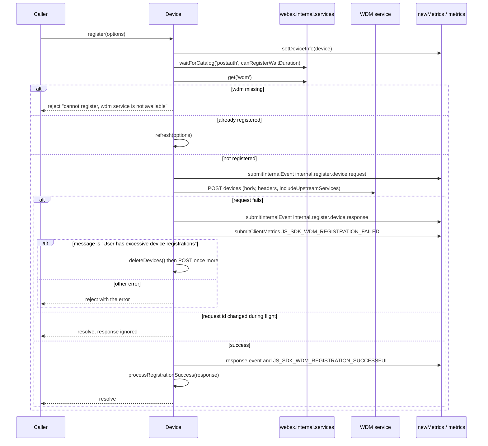

### Stale-registration cleanup

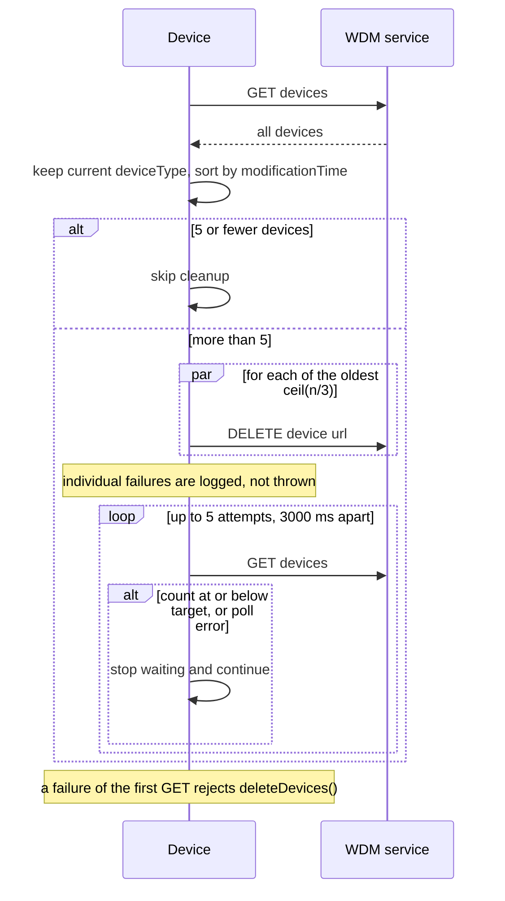

### Refresh

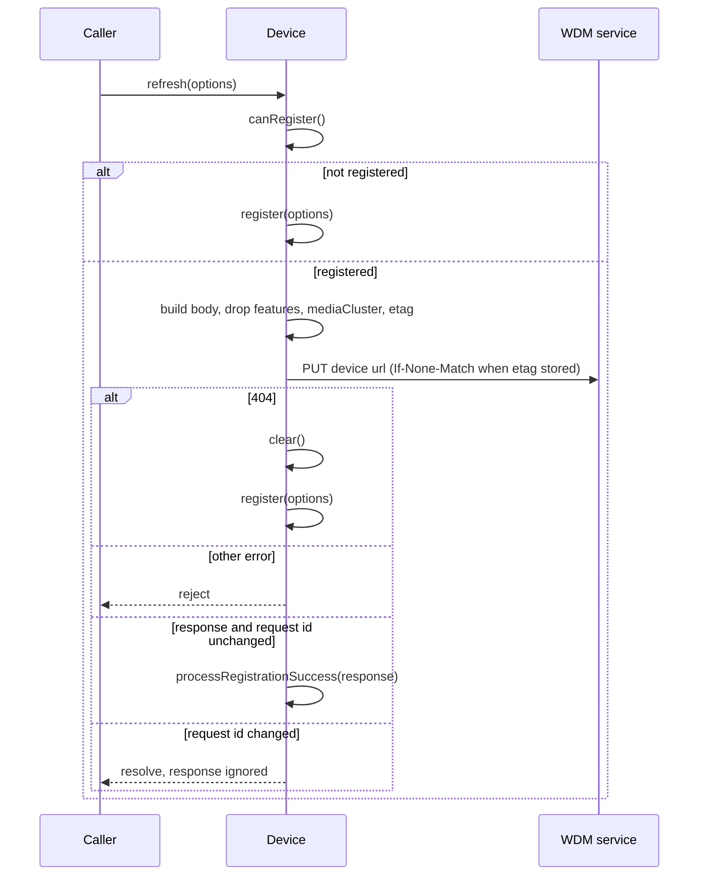

### Unregister and logout

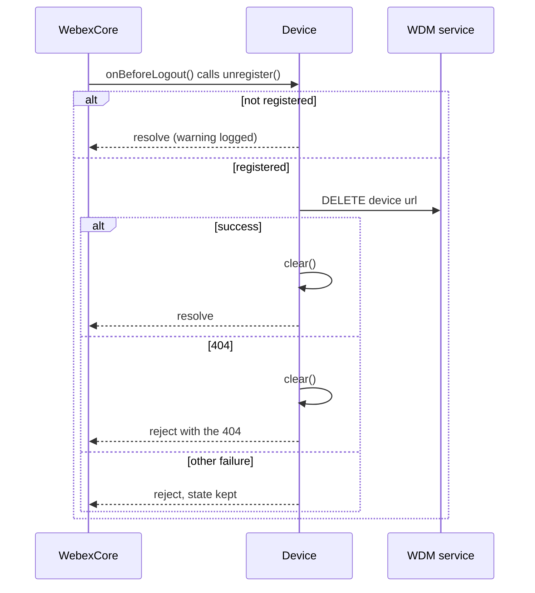

### Registration result processing

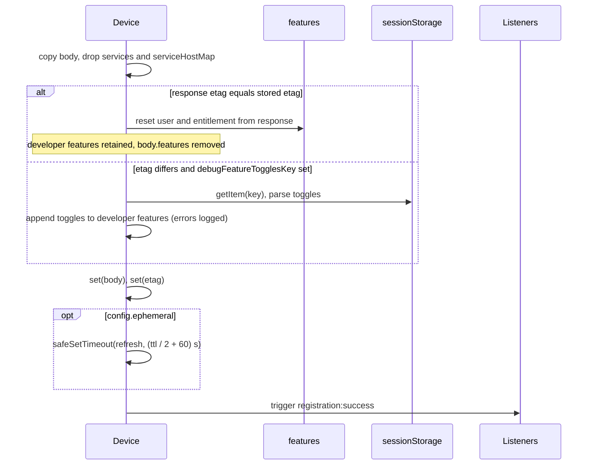

### WebSocket URL retrieval

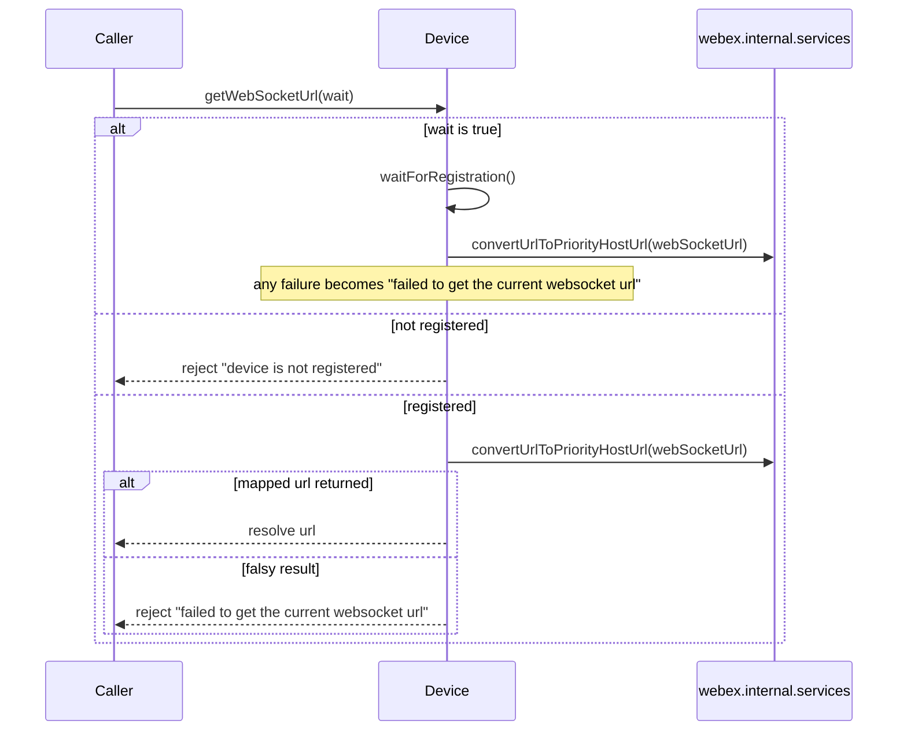

### Inactivity enforcement

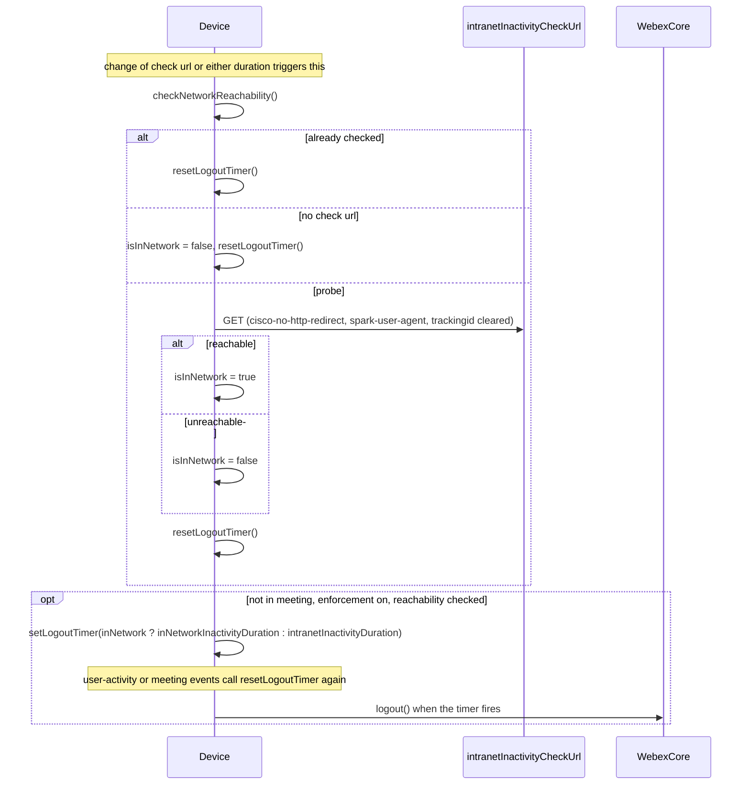

### Request decoration

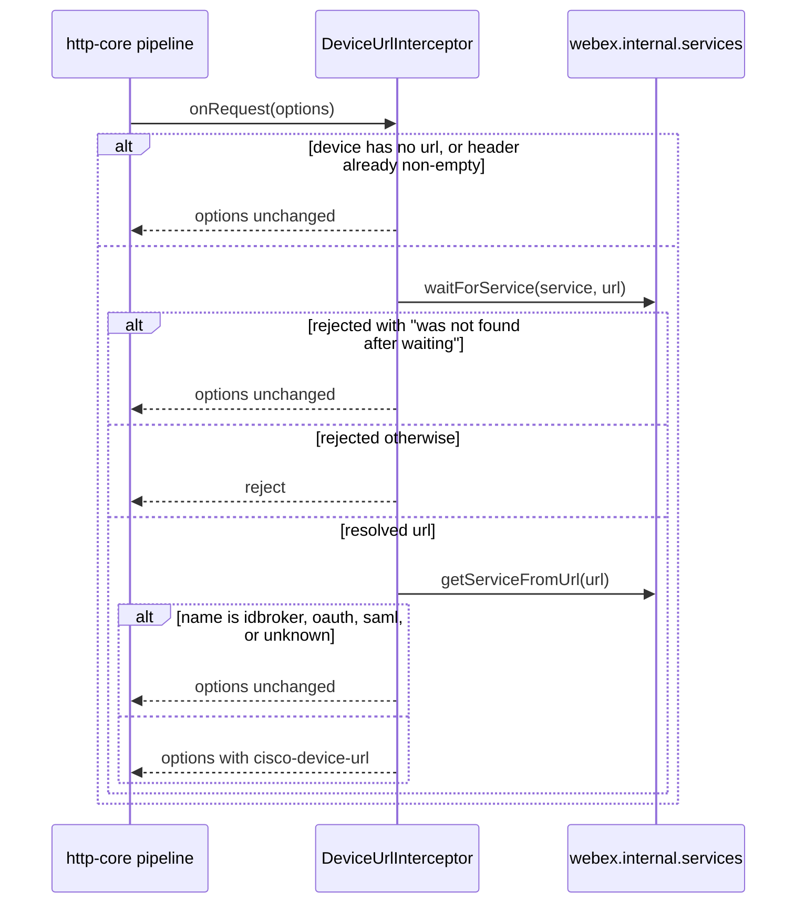

### IP network detection

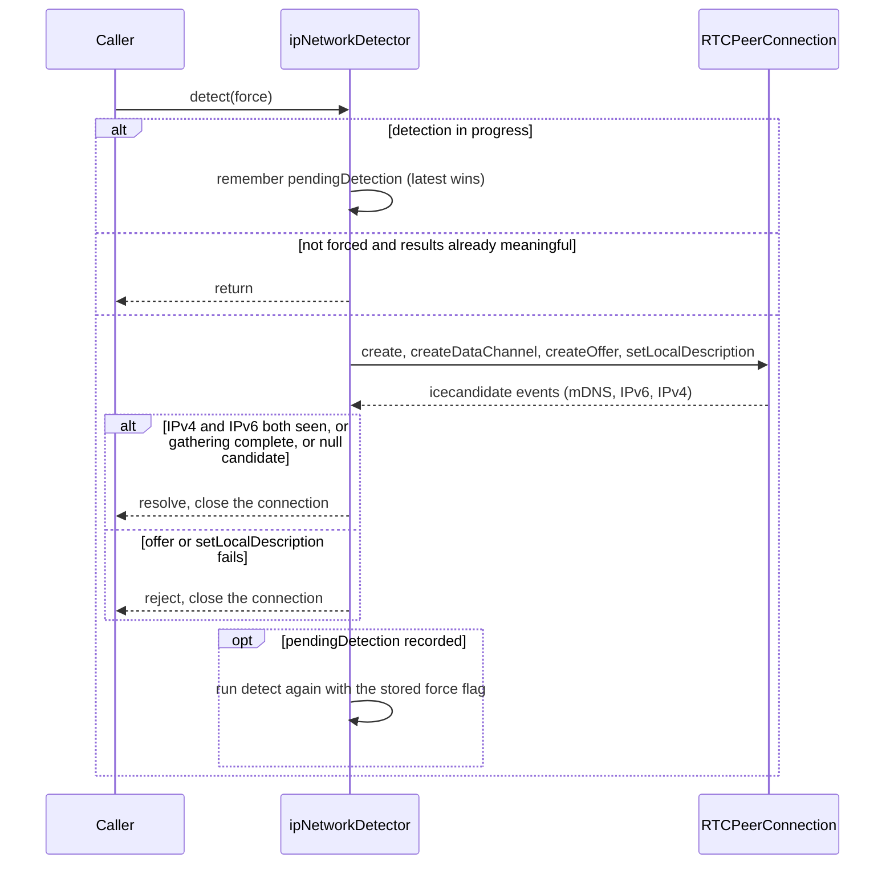

## Class and component relationships

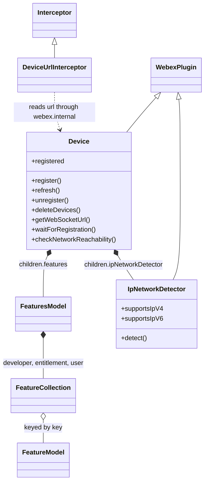

## Use cases and flows

| Use case | Actor or caller                | Primary steps and outcome                                                                                                          | Failure or boundary behavior                                                           | Evidence                                                                 |
| -------- | ------------------------------ | ---------------------------------------------------------------------------------------------------------------------------------- | -------------------------------------------------------------------------------------- | ------------------------------------------------------------------------ |
| `UC-001` | SDK client after authentication | Calls `register()`; the device is created at WDM, state stored, `registration:success` emitted, `registered` becomes true           | Catalog without `wdm` rejects; WDM errors propagate                                     | `src/device.js`, `test/unit/spec/device.js`                              |
| `UC-002` | Ephemeral client or any caller | Refresh keeps the registration alive on a timer or on demand; unchanged developer toggles are not re-sent                           | 404 re-registers; other errors reject                                                   | `src/device.js`, `test/integration/spec/device.js`                       |
| `UC-003` | Logging-out user               | `webex.logout()` triggers `unregister()`, deleting the device and clearing local state                                              | 404 clears and still rejects; other failures keep state                                 | `src/index.js`, `test/integration/spec/webex.js`                         |
| `UC-004` | User at the registration limit | Registration fails with the excessive-registrations message, the oldest third is deleted, registration is retried                   | Second failure propagates; deletion failures are tolerated                              | `src/device.js`, `test/unit/spec/device.js`                              |
| `UC-005` | Feature-flag consumer          | Reads typed `features.<collection>` values and subscribes to `change:features`                                                      | Unknown or non-numeric values stay strings                                              | `src/features/feature-model.js`, `test/unit/spec/features/features-model.js` |
| `UC-006` | Mercury connection code        | `getWebSocketUrl(true)` returns the priority-host WebSocket URL once registered                                                      | Timeout or mapping failure rejects with a generic message                               | `src/device.js`, `test/integration/spec/device.js`                       |
| `UC-007` | Managed-org user               | Org inactivity settings arrive with registration; the client probes the intranet URL and logs out after the matching duration without activity | Probe failure counts as off-network; in a meeting no timer is set          | `src/device.js`, `test/integration/spec/device.js`                       |
| `UC-008` | Meetings plugin                | Calls `ipNetworkDetector.detect()` and later reads `supportsIpV4` / `supportsIpV6`                                                  | Peer-connection failure rejects the detect call                                          | `src/ipNetworkDetector.ts`, `test/unit/spec/ipNetworkDetector.js`        |
| `UC-009` | Developer debugging features   | Sets a JSON object in `sessionStorage` under the configured key; developer toggles are overlaid at the next registration           | Invalid JSON is logged and ignored                                                      | `src/device.js`, `test/unit/spec/device.js`                              |

### Cross-boundary use-case flow

| Boundary                                       | Transport and ordering                                                                                                   | Compatibility                                                                   | Timeout, retry, recovery                                                                                         |
| ---------------------------------------------- | ------------------------------------------------------------------------------------------------------------------------ | ------------------------------------------------------------------------------- | ---------------------------------------------------------------------------------------------------------------- |
| WDM `devices` (POST, GET, DELETE) and device URL (PUT, DELETE) | JSON over `webex.request`; registration precedes any refresh because refresh needs `url`; cleanup runs only between two register attempts | Unknown DTO fields are kept (`extraProperties: 'allow'`)               | Catalog wait 10 s default; one cleanup-and-retry; 404 on refresh re-registers; no other retry in this module     |
| Services catalog (`postauth`, `wdm`, priority hosts) | Promise calls on `webex.internal.services` before each registration and URL mapping                                       | Depends on the webex-core services API                                         | Wait timeouts propagate as rejections                                                                            |
| Intranet inactivity check URL                  | One GET per device lifetime with correlation headers removed                                                              | URL supplied by WDM                                                             | Any failure means off-network; no retry                                                                          |
| Metrics plugins                                | Synchronous submit calls around the registration request                                                                  | Event names fixed in `src/device.js` and `src/metrics.js`                       | Calls are not wrapped in error handling here; a throw rejects registration                                                                  |
| Browser `RTCPeerConnection`                    | Offer then local description then ICE events                                                                              | Browser-only                                                                    | Rejects on failure; no retry                                                                                     |

## Client state model

| State or slice                                                                      | Owner                            | Initial state                    | Transition triggers                                                                                              | Reset or persistence boundary                                                              |
| ----------------------------------------------------------------------------------- | -------------------------------- | -------------------------------- | ---------------------------------------------------------------------------------------------------------------- | ------------------------------------------------------------------------------------------ |
| WDM DTO props (`url`, `webSocketUrl`, `userId`, branding, policy flags, ECM, etc.)  | `Device` props                   | Empty                            | `processRegistrationSuccess()` via `set(body)`                                                                    | Persisted unless ephemeral; cleared by `clear()`                                           |
| `etag` and request ids (`register-request-id`, `refresh-request-id`)               | `Device` extra attributes        | Unset                            | Registration and refresh responses; each call writes a fresh id                                                   | Cleared with the model; id change invalidates in-flight responses                          |
| `features.developer`, `features.entitlement`, `features.user`                       | `FeaturesModel` collections      | Empty collections                | Registration responses, debug toggles                                                                             | Reset by `clear()`                                                                         |
| Inactivity session (`isReachabilityChecked`, `isInNetwork`, `isInMeeting`, `lastUserActivityDate`, `logoutTimer`) | `Device` session props | Unset / `false` for reachability | Setting changes, `meeting started`/`ended`, `user-activity`                                                      | Ampersand session properties, which are not serialized with the declared props                                      |
| `energyForecastConfig`                                                              | `Device` session prop            | Unset                            | `setEnergyForecastConfig()`                                                                                       | Session only                                                                               |
| `refreshTimer`                                                                      | `Device` instance field          | Undefined                        | Ephemeral registration success                                                                                    | Never cleared by this module                                                               |
| Detection results (`firstIpV4`, `firstIpV6`, `firstMdns`, `totalTime`, `state`, `pendingDetection`) | `IpNetworkDetector` props | `-1` times, state `initial`     | `detect()`                                                                                                        | Reset at the start of each detection                                                       |

## Business rules and invariants

| ID        | Invariant                                                                                                                                  | WHY                                                                            | Enforcement source                      | Test evidence                                       |
| --------- | ------------------------------------------------------------------------------------------------------------------------------------------ | ------------------------------------------------------------------------------ | --------------------------------------- | --------------------------------------------------- |
| `INV-001` | `registered` is true exactly when `url` is non-empty                                                                                       | One source of truth for registration state                                      | `src/device.js`                         | `test/unit/spec/device.js`                          |
| `INV-002` | A register or refresh response whose stored request id no longer matches the call's id is dropped without changing state                  | A logout during an in-flight request must not resurrect the device             | `src/device.js`                         | `test/unit/spec/device.js`                          |
| `INV-003` | `services` and `serviceHostMap` from WDM are never stored on the device                                                                    | The service catalog is the single owner of service data                         | `src/device.js`                         | `test/integration/spec/device.js`                   |
| `INV-004` | A refresh body never contains `features`, `mediaCluster`, or `etag`                                                                        | Those are server-derived or transport-level and must not be echoed back         | `src/device.js`                         | none found                                          |
| `INV-005` | An ephemeral device is not persisted                                                                                                       | Ephemeral registrations must not outlive the session that created them          | `src/device.js`                         | none found                                          |
| `INV-006` | `cisco-device-url` is not added when the device is unregistered, the header is already non-empty, or the service is `idbroker`, `oauth`, `saml`, or unknown | Auth-related services must not receive device identity; existing values win    | `src/interceptors/device-url.js`        | `test/unit/spec/interceptors/device-url.js`         |
| `INV-007` | The logout timer is armed only when not in a meeting, inactivity enforcement is on, reachability has been checked, and the duration is positive | Prevents logging out active meeting participants or unconfigured orgs        | `src/device.js`                         | `test/unit/spec/device.js`, `test/integration/spec/device.js` |
| `INV-008` | Cleanup never deletes devices of another `deviceType`, and never runs at or below the minimum device count                                | A user's other clients must survive cleanup                                     | `src/device.js`, `src/constants.js`     | `test/unit/spec/device.js`                          |

## Concurrency and reactive flow

- Execution model: single-threaded JavaScript; every public operation returns a promise; state changes
  propagate through Ampersand `change` events and `webex`-level events; timers use `safeSetTimeout`, except the
  cleanup polling delay which uses `setTimeout`.
- Ordering guarantees: `@waitForValue('@')` delays `register`, `refresh`, `_registerInternal` and `unregister`
  until persisted state has been loaded; registration success always precedes `registration:success`; no
  ordering guarantee exists between `refresh()` and `unregister()` other than the stale-response guard.
- Idempotency and retry: `@oneFlight` on `refresh`, `_registerInternal` and `unregister` returns the in-flight
  promise to concurrent callers; `register()` itself is not de-duplicated but its POST is; the only automatic retries are the cleanup-and-retry
  once and the 404 re-registration.
- Shared-state protection: request ids guard against responses arriving after `clear()`; the single
  `pendingDetection` slot lets only the most recent queued `detect()` request survive.
- Blocking restrictions: `getDebugFeatures()` and its `JSON.parse` run synchronously during result processing;
  no other work in this module blocks on I/O synchronously.

## State machine

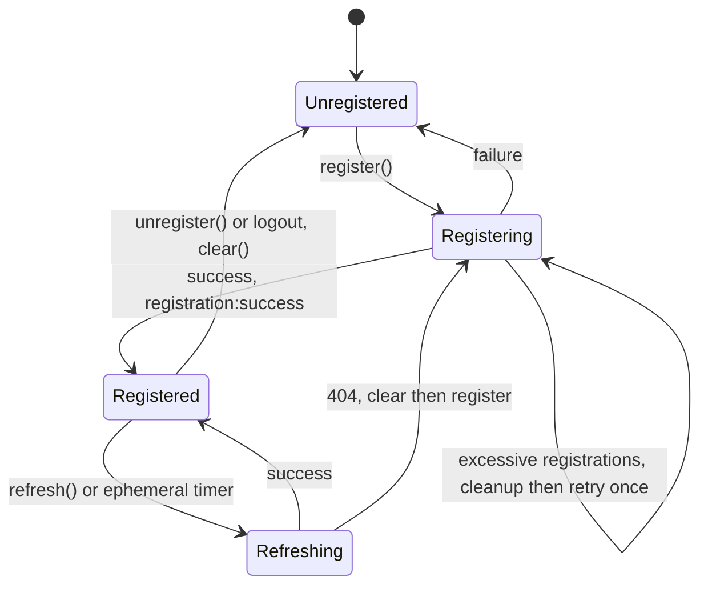

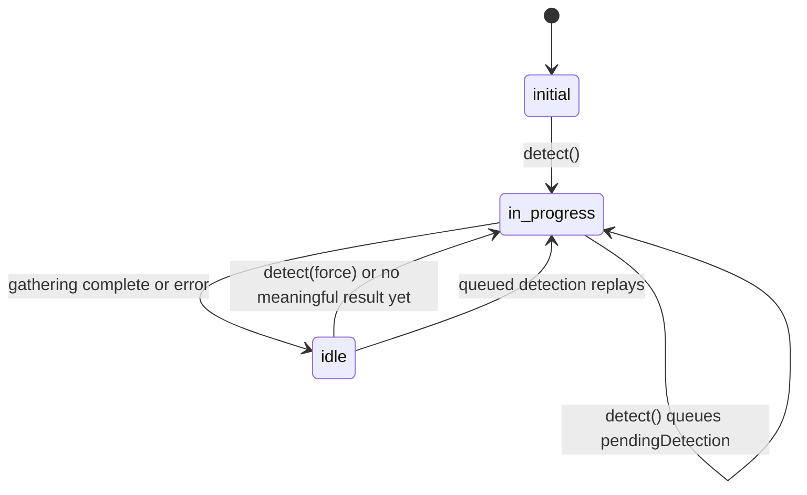

`in_progress` is the code value `in-progress`. A `detect(false)` call on `idle` with meaningful results returns
without a transition; `Registered` also ends when `clear()` is called directly.

## Caller-visible failure modes

| Condition                                                         | Signal or result                                                                    | Caller behavior                                                | Retry or recovery                                    | Evidence                                      |
| ----------------------------------------------------------------- | ----------------------------------------------------------------------------------- | -------------------------------------------------------------- | ---------------------------------------------------- | --------------------------------------------- |
| `wdm` absent from the `postauth` catalog                          | Rejects with `device: cannot register, 'wdm' service is not available from the postauth catalog` | Surface or retry after the catalog loads                | Caller retries                                       | `src/device.js`                               |
| Catalog wait times out                                            | Rejection from `services.waitForCatalog`                                            | Same                                                           | Caller retries                                       | `src/device.js`                               |
| WDM rejects registration other than the excessive-limit case      | The request error (HTTP error with status)                                          | Handle as a normal request error                               | None in module                                       | `src/device.js`                               |
| Excessive registrations persist after cleanup                     | The second registration error                                                       | Report to the user                                             | None in module                                       | `test/unit/spec/device.js`                    |
| `deleteDevices()` cannot list devices                             | Rejects with the listing error                                                      | Registration retry is abandoned                                | Caller retries                                       | `test/unit/spec/device.js`                    |
| Refresh fails with a non-404 error                                | The request error                                                                   | Caller decides                                                 | None in module                                       | `test/integration/spec/device.js`             |
| `unregister()` returns 404                                        | Rejects with the 404 after clearing local state                                     | Treat as done; local state is already cleared                  | None needed                                          | `test/unit/spec/device.js`                    |
| `unregister()` fails otherwise                                    | Rejects; state retained                                                             | Retry later                                                    | Caller retries                                       | `test/unit/spec/device.js`                    |
| `getWebSocketUrl()` with a non-registered device                  | Rejects `device: cannot get websocket url, device is not registered`               | Call with `wait` true or after registration                    | Caller retries                                       | `test/integration/spec/device.js`             |
| `getWebSocketUrl()` cannot map or wait times out                  | Rejects `device: failed to get the current websocket url`                           | Treat as no connection URL                                     | Caller retries                                       | `test/integration/spec/device.js`             |
| `waitForRegistration()` exceeds its timeout                       | Rejects `device: timeout occured while waiting for registration`                    | Treat as not registered                                        | Caller retries                                       | `test/integration/spec/device.js`             |
| `detect()` cannot create or apply the offer                       | Rejects with the underlying error                                                   | Fall back to unknown IP support                                | None in module                                       | `test/unit/spec/ipNetworkDetector.js`         |
| Interceptor wait rejects with anything but not-found-after-waiting | The rejection                                                                       | Request fails                                                  | None                                                 | `test/unit/spec/interceptors/device-url.js`   |

## Pitfalls and constraints

- `clear()` and `unregister()` never cancel `refreshTimer` (`src/device.js`): an ephemeral device that is cleared
  can still fire a scheduled `refresh()`, which will then register a new device.
- `getWebSocketUrl()` without `wait` calls `services.convertUrlToPriorityHostUrl`, which throws synchronously when
  `webSocketUrl` is not a catalog URL (`src/device.js`); only the falsy-result case becomes a rejection.
- `waitForRegistration()` does not return after resolving for an already-registered device, so it still arms a
  timeout timer and a one-time listener that become no-ops (`src/device.js`).
- `refresh()` builds its body from `serialize()` plus `config.body` and, unlike `register()`, does not overlay
  `config.defaults.body` (`src/device.js`).
- The response-timestamp ordering in `_registerInternal` matters: nothing may run before the
  `internal.register.device.response` event, or call-diagnostic latency is skewed (`src/device.js`).
- Compatibility: other packages read `webex.internal.device` property names directly, so renaming a prop or
  event is a breaking change for the whole SDK (see consumers in the architecture document).
- Security: the `cisco-device-url` header must never reach authentication services (`INV-006`); credentials are
  never handled here.
- Platform: `IpNetworkDetector` needs a browser `RTCPeerConnection`; in plain Node it rejects or throws.

## Module-specific rules

- Do: write Ampersand `derived` functions as `fn() {}` methods, not arrow functions, because Ampersand binds
  `this` (comment in `src/device.js`).
- Do: apply `@persist` only to `initialize` and keep `@waitForValue('@')` on any method that needs loaded
  persisted state (decorator contract enforced by `@webex/webex-core`).
- Do: keep `extraProperties: 'allow'` on `Device` so unknown WDM DTO fields never fail initialization.
- Do not: add processing above the `internal.register.device.response` event in `_registerInternal`.
- Do not: store `services` or `serviceHostMap` on the device (`INV-003`).
- Do not: change `MIN_DEVICES_FOR_CLEANUP`, `MAX_DELETION_CONFIRMATION_ATTEMPTS`, or
  `DELETION_CONFIRMATION_DELAY_MS` without updating the cleanup tests that depend on them.

## Export stability

| Export or entry point                                    | Consumer                          | Stability                                                | Versioning and deprecation rule                                                       | Declaration or API report |
| -------------------------------------------------------- | --------------------------------- | -------------------------------------------------------- | ------------------------------------------------------------------------------------- | ------------------------- |
| Default export `Device` and the `webex.internal.device` API | SDK plugins, first-party clients | Internal; used widely across the SDK                     | README states semantic versioning is not strictly followed; deprecate with `@deprecated` as done for `markUrlFailedAndGetNew` | `src/index.js`      |
| `config`, `constants`                                    | Same                              | Internal                                                  | Same                                                                                  | `src/index.js`            |
| `CatalogDetails`, `DeviceRegistrationOptions`            | Callers of `register`/`refresh`   | Internal; enum values are sent to WDM                    | Same                                                                                  | `src/types.ts`            |
| `DeviceUrlInterceptor`, `FeatureCollection`, `FeatureModel`, `FeaturesModel` | SDK internals and tests | Internal                                                 | Same                                                                                  | `src/index.js`            |

No API report or generated declaration is committed; `package.json` and the module sources are the native
artifacts.

## Verification

| Requirement or invariant                     | Test level                | Positive evidence                                                                       | Negative or boundary evidence                                            | Gap                                                                                           |
| -------------------------------------------- | ------------------------- | --------------------------------------------------------------------------------------- | ------------------------------------------------------------------------ | --------------------------------------------------------------------------------------------- |
| `MOD-001`                                    | Integration               | `test/integration/spec/webex.js`                                                        | none found                                                               | Needs Webex test users                                                                        |
| `MOD-002`                                    | Integration               | `test/integration/spec/device.js`                                                       | `test/integration/spec/device.js`                                        | No unit test                                                                                  |
| `MOD-003`, `MOD-004`, `MOD-005`              | Unit and integration      | `test/unit/spec/device.js`, `test/integration/spec/device.js`                            | `test/unit/spec/device.js`                                               | Default body values not asserted                                                              |
| `MOD-006`                                    | Unit and integration      | `test/unit/spec/device.js`                                                              | `test/unit/spec/device.js` (no etag case)                                | None                                                                                          |
| `MOD-007`                                    | Integration               | `test/integration/spec/device.js`                                                       | `test/integration/spec/device.js`                                        | No unit test                                                                                  |
| `MOD-008`, `MOD-009`, `MOD-010`, `INV-008`   | Unit                      | `test/unit/spec/device.js`                                                              | `test/unit/spec/device.js` (thresholds, partial failure, polling errors) | None                                                                                          |
| `MOD-011`                                    | Unit and integration      | `test/unit/spec/device.js`                                                              | `test/unit/spec/device.js` (404 and other failures)                      | None                                                                                          |
| `MOD-012`, `MOD-013`, `MOD-014`              | Unit                      | `test/unit/spec/device.js`                                                              | `test/unit/spec/device.js` (etag mismatch, debug toggles)                | None                                                                                          |
| `MOD-015`                                    | Integration               | `test/integration/spec/device.js`                                                       | none found                                                               | Timer never-cleared behavior untested                                                          |
| `MOD-016`, `MOD-017`                         | Unit                      | `test/unit/spec/features/feature-model.js`, `test/unit/spec/features/features-model.js` | `test/unit/spec/features/feature-model.js`                               | None                                                                                          |
| `MOD-018`, `MOD-019`                         | Integration               | `test/integration/spec/device.js`                                                       | `test/integration/spec/device.js`                                        | No unit test; synchronous-throw pitfall untested                                              |
| `MOD-020`, `MOD-021`, `INV-007`              | Unit and integration      | `test/unit/spec/device.js`, `test/integration/spec/device.js`                            | `test/integration/spec/device.js`                                        | None                                                                                          |
| `MOD-022`, `INV-006`                         | Unit                      | `test/unit/spec/interceptors/device-url.js`                                              | `test/unit/spec/interceptors/device-url.js`                              | None                                                                                          |
| `MOD-023`                                    | Unit                      | `test/unit/spec/ipNetworkDetector.js`                                                   | `test/unit/spec/ipNetworkDetector.js`                                    | None                                                                                          |
| `MOD-024`                                    | Unit                      | `test/unit/spec/device.js`                                                              | `test/unit/spec/device.js`                                               | Refresh path emits none                                                                       |
| `MOD-025`                                    | Integration               | `test/integration/spec/device.js`                                                       | none found                                                               | None                                                                                          |
| `MOD-026`                                    | —                         | none found                                                                              | none found                                                               | No test pins the defaults                                                                     |
| `INV-001`, `INV-002`, `INV-003`              | Unit and integration      | `test/unit/spec/device.js`, `test/integration/spec/device.js`                            | `test/unit/spec/device.js`                                               | None                                                                                          |
| `INV-004`, `INV-005`                         | —                         | none found                                                                              | none found                                                               | No test asserts the refresh body exclusions or ephemeral non-persistence                       |

Run unit tests with `yarn workspace @webex/internal-plugin-device test:unit`; integration and browser suites need Webex test
users and a built workspace. A specification is complete only when its public surface, invariants, failure modes,
and test evidence agree with the implementation.
