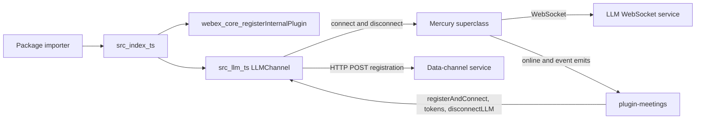
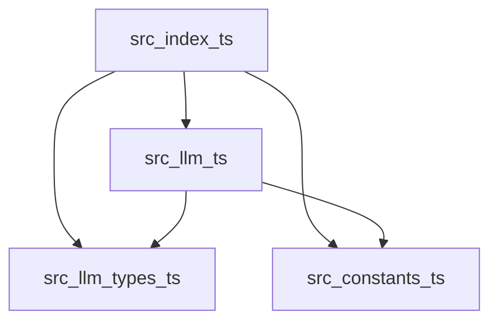
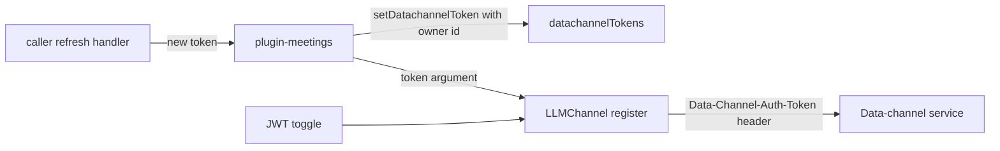

<!-- sdd-generated-metadata
doc_kind: standing-doc
generated_from: architecture@0.3.0
generated_by: claude-cowork
approved_by: akulakum@cisco.com
updated_at: 2026-10-07T07:23:05Z
validation_status: pass-with-warnings
-->

# @webex/internal-plugin-llm architecture

Canonical architecture for this package. LLM channel behavior lives in the
[LLM channel plugin specification](../src/docs/README.md). This page owns package boundaries, the
plugin registration, the contract index, and how the package meets the rest of the SDK.

Related context: [specification registry](specs/README.md) ·
[package agent instructions](../AGENTS.md)

## Applicability

| Condition ID                         | Status     | Evidence or reason | Owned section |
| ------------------------------------ | ---------- | ------------------ | ------------- |
| `repo.owns_datastore`                | N/A        | No database, file store, or migration in `src/` | Repository data and schema |
| `repo.holds_client_state`            | Applicable | `LLMChannel` keeps a per-session `connections` map in memory | Client state model |
| `repo.components_interact`           | Applicable | `src/index.ts` registers `src/llm.ts`, which imports `src/constants.ts` and `src/llm.types.ts` | Dependency and interaction topology |
| `repo.domain_data_across_components` | N/A        | One class owns all state; no record is shared across resources | Object and data ownership |
| `repo.caches_data`                   | Applicable | `datachannelTokens` in `src/llm.ts` caches data-channel tokens by key | Caching catalog |
| `repo.observability_convention`      | Applicable | `llm#<method> -->` log prefixes and latency timing returned to callers | Observability patterns |
| `repo.deploys_to_infra`              | N/A        | Library published to npm. No service runtime. | Runtime and infrastructure |
| `repo.shared_base_libs`              | Applicable | Inherits Mercury and the legacy build, lint, and test stack | Shared and base libraries |
| `repo.is_monorepo`                   | N/A        | This SDD root is one package. The workspace around it is out of scope. | Package map and inter-package dependencies |
| `repo.multi_platform`                | N/A        | No platform-specific file or `browser` field; platform WebSocket selection is in Mercury | Platform matrix |
| `repo.published_package`             | Applicable | `package.json` `name` is `@webex/internal-plugin-llm` and `deploy:npm` publishes it | Release and versioning |
| `repo.embedded_in_host`              | N/A        | No host theme or embed API | Host integration and theming |
| `repo.exposes_commands_or_artifacts` | Applicable | `build:src` writes `dist/` | Commands and generated artifacts |
| `repo.cross_repo_deps_material`      | Applicable | Behavior depends on the Mercury superclass and on callers in sibling packages | Cross-repository topology |
| `repo.security_arch_warranted`       | Applicable | Data-channel tokens cross to the data-channel service in a request header | Security architecture |

## Design overview

`@webex/internal-plugin-llm` is a published library with one module. Importing it registers
`LLMChannel` as the internal plugin `llm`, so every webex instance has `webex.internal.llm`. A
meeting calls `registerAndConnect` with its locus and data-channel URLs, then listens on
`webex.internal.llm` for `online` and `event:<type>` events.

`LLMChannel` adds an HTTP registration step, per-session metadata, an ownership model, and a token
cache on top of the Mercury plugin it extends. Mercury owns the socket, retries, keepalive, and event
emission. Keeping the subclass thin means LLM sockets behave like every other Mercury socket.

The package makes outbound HTTP and WebSocket calls only. It serves no routes and persists nothing.

## Resource inventory and responsibilities

| Resource | Kind | Responsibility | Owner | Source | Detailed specification |
| -------- | ---- | -------------- | ----- | ------ | ---------------------- |
| LLM channel plugin | module | Registration, session metadata, ownership, tokens, URL lookup | @webex/web-client, @webex/web-sdk | `src/` | `src/docs/README.md` |
| Published package | package | npm entry points and the registration side effect | @webex/web-client, @webex/web-sdk | `package.json` | `docs/architecture.md` |

## Interaction and execution flows

| From | To | Interaction or transport | Purpose | Failure or compatibility behavior |
| ---- | -- | ------------------------ | ------- | --------------------------------- |
| Importer | `src/index.ts` | package import | Register the plugin | Without the import, `webex.internal.llm` is absent |
| plugin-meetings | `webex.internal.llm` | method calls and event listeners | Connect sessions, manage tokens and ownership | See the module spec failure modes |
| `src/llm.ts` | Data-channel service | HTTP POST | Obtain socket URL and binding | Request errors reject `registerAndConnect` |
| `src/llm.ts` | Mercury superclass | inherited method calls | Open and close sockets | Connect errors reject with `timing` |
| Mercury superclass | plugin-meetings | events on `webex.internal.llm` | Deliver online state and envelopes | Default session unsuffixed; others suffixed |

## Dependency topology

| Dependency | Type | Used by | Purpose | Version, failure, or fallback policy |
| ---------- | ---- | ------- | ------- | ------------------------------------ |
| `@webex/internal-plugin-mercury` | Internal | `src` | Superclass; inherited behavior is under Shared and base libraries | `workspace:*` in `package.json` |
| `@webex/webex-core` | Internal | `src` | Plugin registration, request, logger, config | Resolved through the workspace; not listed in `package.json` |
| `@webex/internal-plugin-device` | Internal | `src` | `device.url` for the registration body | Loaded by Mercury's barrel |
| `@webex/internal-plugin-feature` | Internal | `src` | JWT data-channel toggle | Loaded by Mercury's barrel |

Ordering constraint: Mercury's barrel imports the device, feature, and metrics plugins first, and
`src/llm.ts` imports Mercury, so those plugins are registered before `llm`. No dependency cycle exists
inside the package.

## Public and consumer surfaces

| Surface | Type | Owner | Consumers | Compatibility policy | Source |
| ------- | ---- | ----- | --------- | -------------------- | ------ |
| `llm-sdk` (published) | SDK | LLM channel plugin | plugin-meetings, internal-plugin-voicea | Internal plugin; README says semver is not strictly followed | `package.json` |
| `llm-plugin-events` (published) | Event | LLM channel plugin | plugin-meetings | Inherited Mercury event names; renaming is breaking | `src/llm.ts` |
| `llm-datachannel-protocol` (internal) | RPC | LLM channel plugin | Data-channel service | Must match the service request and response | `src/llm.ts` |
| `mercury-plugin-base` (required) | SDK | sibling package internal-plugin-mercury | LLM channel plugin | Superclass; method changes ship together | `@webex/internal-plugin-mercury` |
| `webex-core-plugin-host` (required) | RPC | sibling package webex-core | LLM channel plugin | External | `@webex/webex-core` |
| `webex-device-registration` (required) | SDK | sibling package internal-plugin-device | LLM channel plugin | External | `@webex/internal-plugin-device` |
| `webex-feature-toggles` (required) | SDK | sibling package internal-plugin-feature | LLM channel plugin | External | `@webex/internal-plugin-feature` |

`llm-sdk` entry points: `main` `dist/index.js` and `devMain` `src/index.ts`. No HTTP surface is
served, so `api-specs/openapi.yaml` is omitted.

## Client state model

| State or slice | Owner | Transition triggers | Persistence or reset boundary |
| -------------- | ----- | ------------------- | ----------------------------- |
| Session map `connections` | LLM channel plugin | register, owner and handler setters, disconnect | In memory per webex instance; cleared by `disconnectAllLLM` |
| Sockets per session | Mercury superclass | connect, close, disconnect | Owned by Mercury |

Slice detail is in the module spec.

## Cross-cutting architecture

### Security

- Trust boundaries and identity flow: see Security architecture.
- Sensitive surfaces and data classes: data-channel tokens and envelope content; controls and gaps
  are in Security architecture.
- Encryption and secret boundaries: transport encryption is whatever scheme the caller-supplied and
  service-returned URLs use; tokens are held only in memory.

### Observability and operations

- Logging and correlation: conventions are under Observability patterns.
- Metrics, traces, and audit signals: listed under Observability patterns.
- Ownership and operational entry points: no runtime to deploy or monitor; owners are listed in
  References and maintenance.

### Quality attributes

- Availability: sockets reconnect through Mercury; registration is not retried here.
- Compatibility: session ids, token keys, and event names are relied on by plugin-meetings.
- Isolation: ownership checks keep one meeting from tearing down another meeting's session.

## Dependency and interaction topology

| From | To | Kind | Purpose | Ordering or failure boundary |
| ---- | -- | ---- | ------- | ---------------------------- |
| `src/index.ts` | `src/llm.ts` | Import | Register the class and its `config` | Registration runs at import time |
| `src/llm.ts` | `src/constants.ts` | Import | Namespace, session ids, toggle and query names | Load-time only |
| `src/llm.ts` | `src/llm.types.ts` | Import | Token enum and interface | Load-time only |

## Caching catalog

| Cache | Owner | Backend | Contents | TTL or bound | Invalidation trigger | Failure behavior |
| ----- | ----- | ------- | -------- | ------------ | -------------------- | ---------------- |
| `datachannelTokens` | LLM channel plugin | In-memory object | Data-channel token per token key | No TTL; unbounded keys | `clearDatachannelToken` by the owner only; disconnects do not clear it | A miss or non-owner read returns `undefined` |

## Observability patterns

| Signal | Convention or required fields | Propagation or naming rule | Primary evidence |
| ------ | ----------------------------- | -------------------------- | ---------------- |
| Logs | `llm#<method> -->` prefix with the session id; inherited Mercury lines use the `llm` namespace | Through `this.logger`; tokens are not logged | `src/llm.ts` |
| Metrics | N/A — no metric is submitted here; `registerAndConnect` returns latency fields that callers report | Field names are in the module spec | `src/llm.ts` |
| Traces | N/A — no spans | — | `src/llm.ts` |
| Audit | N/A — no audited actions | — | `src/llm.ts` |

## Shared and base libraries

| Library | Inherited responsibility | Consumers | Version floor | Compatibility rule |
| ------- | ------------------------ | --------- | ------------- | ------------------ |
| Mercury from `@webex/internal-plugin-mercury` | Socket lifecycle, retries, keepalive, event emission | `src/llm.ts` | workspace | Change socket behavior in Mercury |
| `WebexPlugin` from `@webex/webex-core` (through Mercury) | `this.config` bound to `config.llm`, `this.request`, `this.logger` | `src/llm.ts` | workspace | Follow webex-core plugin conventions |
| `@webex/babel-config-legacy`, `@webex/eslint-config-legacy`, `@webex/jest-config-legacy` | Build, lint, and Jest config passthroughs | `babel.config.js`, `.eslintrc.js`, `jest.config.js` | workspace | Change upstream, not in the passthrough files |
| `@webex/legacy-tools` | `webex-legacy-tools` build and test runners | `package.json` scripts | workspace | Scripts call it; do not replace locally |

## Release and versioning

| Artifact | Publish target | Versioning rule | Deprecation window | Changelog or migration obligation |
| -------- | -------------- | --------------- | ------------------ | --------------------------------- |
| `@webex/internal-plugin-llm` | npm, through the `deploy:npm` script, which wraps Yarn's npm publish | Workspace release tooling; README says the internal plugin does not strictly follow semver | None declared in code | No package-local changelog; workspace tooling owns it |

## Commands and generated artifacts

| Command or artifact | Owner | Inputs | Output or side effect | Compatibility boundary |
| ------------------- | ----- | ------ | --------------------- | ---------------------- |
| `yarn install` | workspace | root `package.json` and lockfile | workspace `node_modules` | Run from the workspace root |
| `yarn workspace @webex/internal-plugin-llm build` | package | `src/` | `dist/` through `build:src` | `dist/` is never edited by hand |
| `yarn workspace @webex/internal-plugin-llm build:src` | package | `src/` (`.js` and `.ts`) | `dist/` with source maps | Markdown under `src/` is not processed |
| `yarn workspace @webex/internal-plugin-llm test:unit` | package | `test/unit/spec/` | jest result | — |
| `yarn workspace @webex/internal-plugin-llm test:browser` | package | integration files only | karma result; no files today | See Getting started |
| `yarn workspace @webex/internal-plugin-llm test:style` | package | files under `src/` | eslint result | Markdown is reported as ignored |
| `yarn workspace @webex/internal-plugin-llm deploy:npm` | package | `dist/`, `package.json` | npm publish | Release pipeline only |

## Cross-repository topology

| Repository or external system | Relationship | Exchanged contract or artifact | Owner | Sequencing constraint |
| ----------------------------- | ------------ | ------------------------------ | ----- | --------------------- |
| Sibling package internal-plugin-mercury | Consumes | `mercury-plugin-base` | @webex/web-client, @webex/web-sdk | Superclass changes ship with LLM checks |
| Sibling package webex-core | Consumes | `webex-core-plugin-host` | @webex/web-client, @webex/web-sdk | Plugin host must exist before registration |
| Sibling package internal-plugin-device | Consumes | `webex-device-registration` | @webex/web-client, @webex/web-sdk | Device URL must exist before registration |
| Sibling package internal-plugin-feature | Consumes | `webex-feature-toggles` | @webex/web-sdk (CODEOWNERS default rule) | Toggle read on each call |
| Sibling package plugin-meetings | Provides | `llm-sdk`, `llm-plugin-events` | @webex/web-client, @webex/web-sdk | Method and session-id changes ship with meetings changes |
| Sibling package internal-plugin-voicea | Provides | `llm-sdk` (`LLM_PRACTICE_SESSION`) | @webex/web-client, @webex/web-sdk | Constant changes ship together |
| Data-channel service | Coordinates | `llm-datachannel-protocol` | External Webex service; owner not recorded in this repository | Request and response fields must match |

These are sibling workspace packages and an external service outside this package-scoped SDD root.

## Security architecture

Threats addressed: data-channel token leakage across meetings, and tokens reaching the network
outside the JWT flow.

Controls in this package:

- The token is sent only as a request header, and only when the JWT toggle is on (module spec
  `INV-004`). It is never added to a URL or a log line.
- Owner-meeting checks guard token reads and writes, refresh-handler writes, and single-session
  disconnect (module spec `INV-002`).
- Token refresh is delegated to the caller's handler; this package does not request tokens itself.

Known gaps are recorded where the code lives: the omitted-owner path, the unguarded
`disconnectAllLLM`, and token-key ownership in the module spec Pitfalls.

The workspace root `SECURITY.md` is the security policy; this package adds none.

## Domain language

| Term | Repository-specific meaning | Authoritative source |
| ---- | --------------------------- | -------------------- |
| LLM channel | The data-channel WebSocket a meeting uses, opened by `LLMChannel` | `src/llm.ts` |
| Session | One connection keyed by session id; default `llm-default-session` | `src/constants.ts` |
| Data-channel URL | The registration URL a meeting supplies; also the key for request lookup | `src/llm.ts` |
| Binding | The value returned by registration and kept per session | `src/llm.ts` |
| Owner meeting | The meeting id allowed to change or close a session | `src/llm.ts` |
| Token key | The key in the token cache; the built-in keys are the `DataChannelTokenType` values | `src/llm.types.ts` |
| Subscription-aware subchannel | A subchannel named in the `subscriptionAwareSubchannels` query | `src/constants.ts` |

## References and maintenance

- Decisions: [adr/](adr/), including [ADR 0001](adr/0001-retain-product-readme.md)
- Instantiated specifications and routing: [specs/README.md](specs/README.md)
- Module spec: `src/docs/README.md`
- Owner: `@webex/web-client @webex/web-sdk` in the monorepo `.github/CODEOWNERS`
- Manifest: `.sdd/manifest.json`
- Update this document in the same change that alters package boundaries, contracts, or
  cross-cutting behavior.
