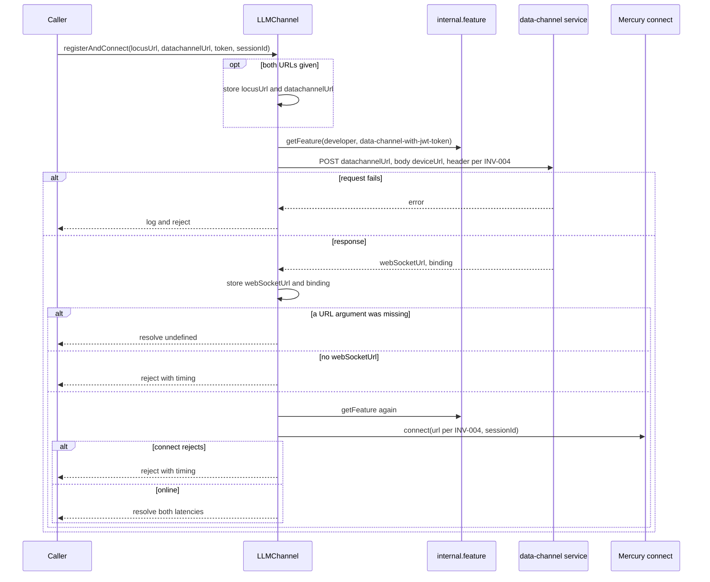
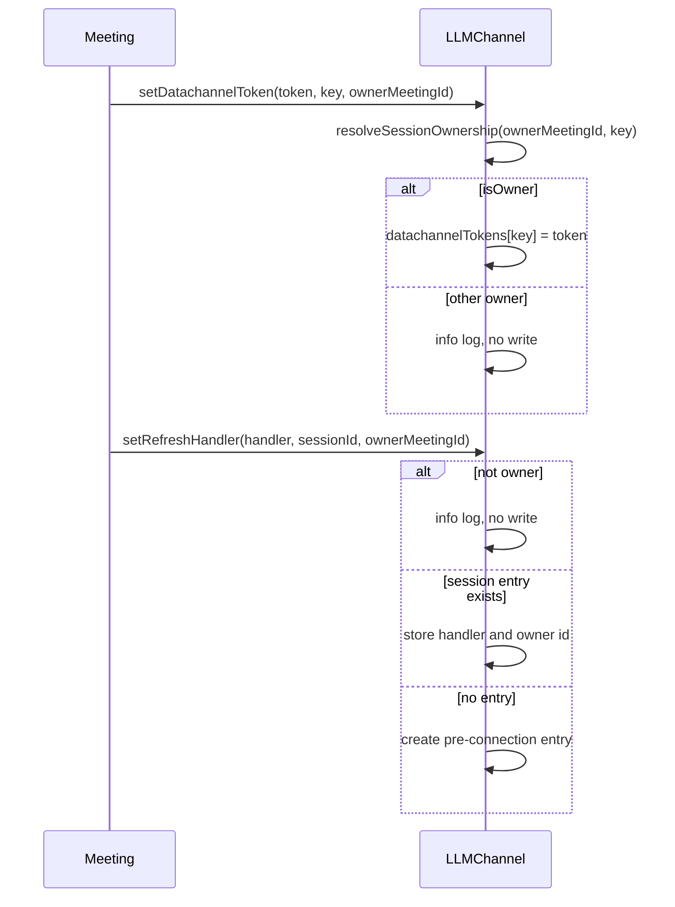
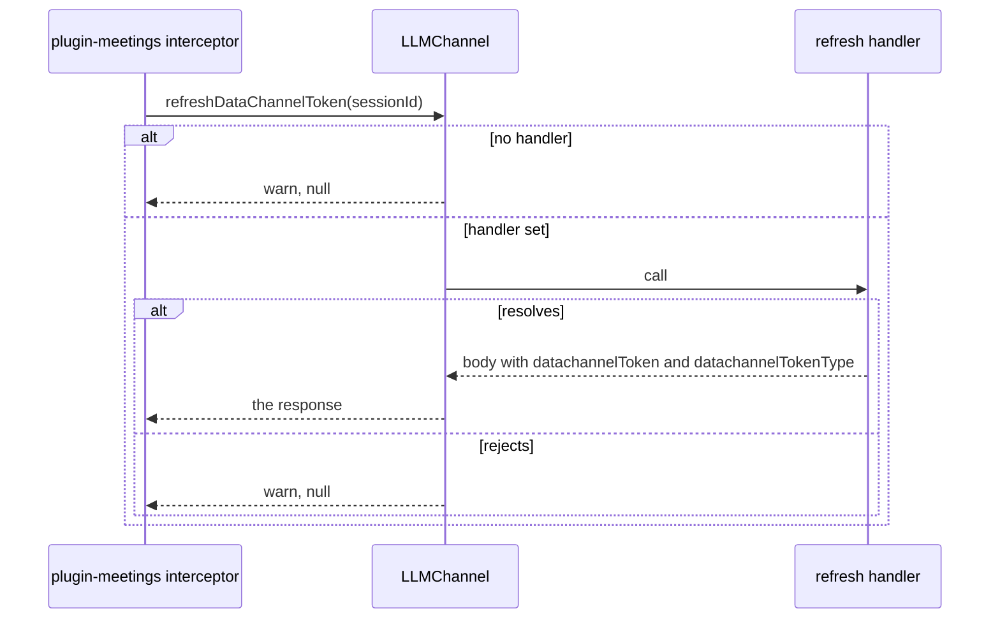
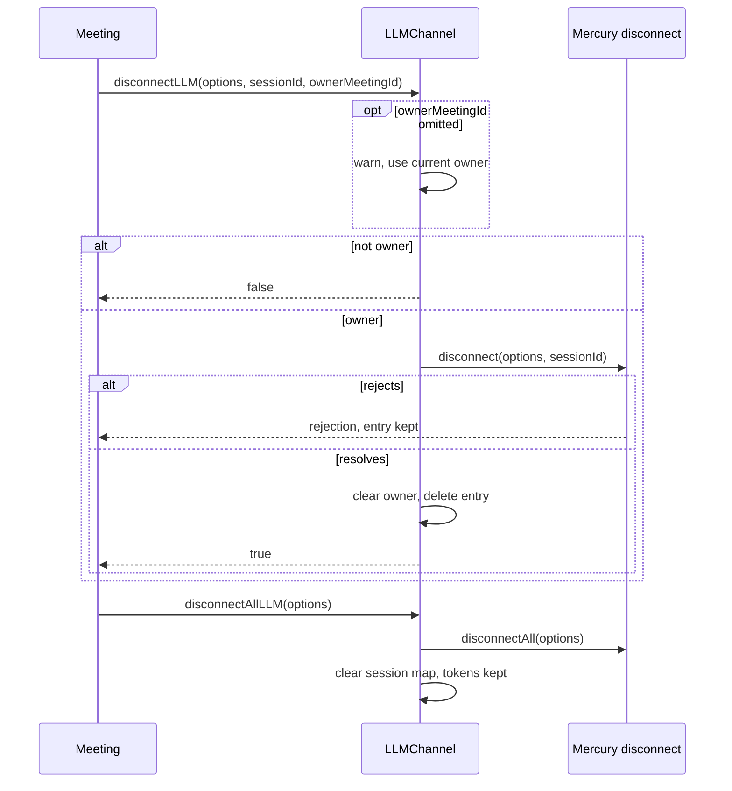
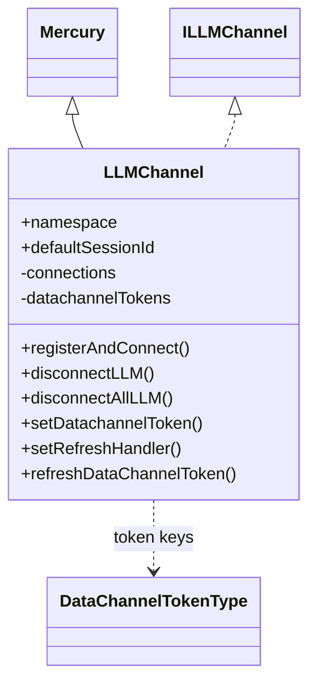
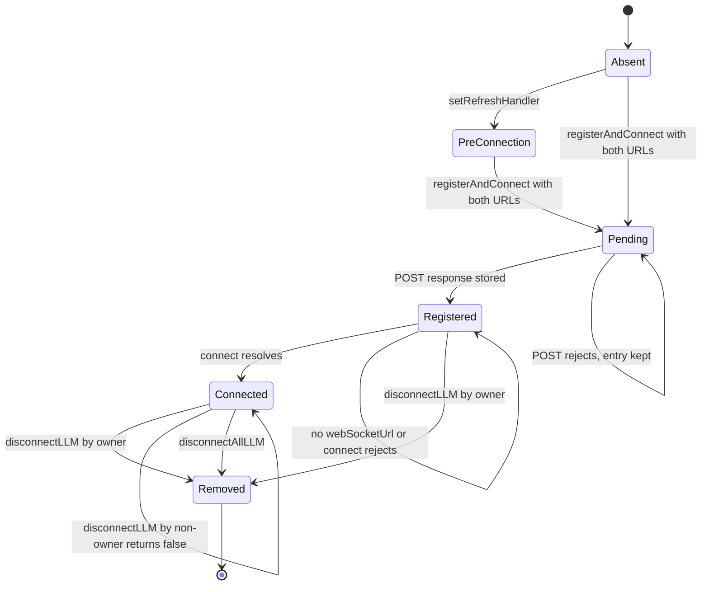

<!-- sdd-generated-metadata
doc_kind: module-spec
generated_from: module-spec@0.3.0
generated_by: claude-cowork
approved_by: akulakum@cisco.com
updated_at: 2026-10-07T07:05:22Z
validation_status: pass-with-warnings
-->

# LLM channel plugin

This source-local document at `src/docs/README.md` owns the stable specification for **the LLM
channel plugin**: the `webex.internal.llm` data-channel connection manager. Ground every claim in
package evidence and link to the [package architecture](../../docs/architecture.md) instead of
repeating broader facts. No service specification exists because this package is a library.

Related context: [documentation index](../../docs/index.md) ·
[package agent instructions](../../AGENTS.md)

## Metadata

| Field             | Value |
| ----------------- | ----- |
| Owner             | @webex/web-client, @webex/web-sdk |
| Source path       | `src` |
| Resource kind     | package |
| Status            | Draft |
| Last verified     | 2026-10-07 at `d2e34dabee` |
| Module id         | `internal-plugin-llm` |
| Parent spec       | — |
| Doc kind          | Module spec |
| Coverage score    | 93.3% assessed 2026-10-07 — 14 of 15 mandatory fields PRESENT, critical 8 of 8; test strategy is WEAK because registration, `clearDatachannelToken`, refused-owner token and handler calls, `INV-003`, `INV-005`, and suffixed events are untested, two disconnect cases use a stand-in object, and no characterization baseline exists |
| Validation status | pass-with-warnings; assessed 2026-10-07 by current-session |

## Applicability

| Condition ID                         | Status     | Evidence or reason | Owned section |
| ------------------------------------ | ---------- | ------------------ | ------------- |
| `module.has_tiers`                   | N/A        | No tier policy exists in this package or its `package.json` | Tier |
| `module.has_ui`                      | N/A        | No view or screen. The module manages sockets and session records. | UI use-case flow |
| `module.crosses_service_boundaries`  | Applicable | `register` sends an HTTP POST to the data-channel URL and the inherited Mercury `connect` opens a WebSocket, both in `src/llm.ts` | Cross-boundary use-case flow |
| `module.holds_client_state`          | Applicable | The private `connections` map and `datachannelTokens` record in `src/llm.ts` | Client state model |
| `module.enforces_domain_rules`       | Applicable | Session-ownership checks guard token, refresh-handler, and disconnect operations in `src/llm.ts` | Business rules and invariants |
| `module.is_concurrent_async`         | Applicable | Promise-based register and connect, async refresh handlers, and feature-toggle reads in `src/llm.ts` | Concurrency and reactive flow |
| `module.owns_persistence`            | N/A        | Nothing is written to storage. All state is in memory. | Data, schema, and migration discipline |
| `module.stateful_transitions`        | Applicable | Each session entry moves from absent to pre-connection, registered, connected, and removed | State machine |
| `module.exposes_wire_protocol`       | Applicable | Registration request and response fields, the auth header, and the `subscriptionAwareSubchannels` query in `src/llm.ts` and `src/constants.ts` | Protocol and wire format |
| `module.ui_multi_screen`             | N/A        | No UI | UI flow |
| `module.large_data_model`            | N/A        | One session record type and one token record; see `src/llm.types.ts` | Data model |
| `module.returns_caller_errors`       | Applicable | `registerAndConnect` rejects and attaches `timing`; other methods return `false`, `null`, or `undefined` on refusal | Caller-visible failure modes |
| `module.module_specific_conventions` | Applicable | `llm#<method> -->` log prefix, the ownership-check pattern, and default-session arguments | Module-specific rules |
| `module.published_package`           | Applicable | `package.json` names the package @webex/internal-plugin-llm and `deploy:npm` publishes it | Export stability |
| `module.embedded_in_host`            | N/A        | No host theme or embed API | Host integration and theming |
| `module.has_design_tradeoff`         | Applicable | The token cache is decoupled from the connection lifecycle, and omitted owner ids are accepted for backward compatibility | Key design trade-off |
| `module.has_submodules`              | N/A        | Computed false by the Repo Annotation module_tree.py script: `src` has no child module | Sub-modules |

## Evidence register

| Evidence | What it establishes |
| -------- | ------------------- |
| `src/index.ts` | Internal plugin registration as `llm` with `config`, and the public exports |
| `src/llm.ts` | `LLMChannel`: config defaults, session map, register and connect, accessors, ownership, token cache, refresh handler, disconnect, and URL lookup |
| `src/llm.types.ts` | `DataChannelTokenType`, `RegisterAndConnectTiming`, and the `ILLMChannel` interface |
| `src/constants.ts` | Namespace, session ids, feature-toggle name, query parameter name, and the subscription-aware subchannel list |
| `package.json` | Name, entry points, the Mercury dependency, and scripts |
| `process` | Package-root module exporting `{browser: true}`; nothing in `src/` imports it |
| `test/unit/spec/llm.js` | Unit cases for register and connect, timing, accessors, ownership, refresh handler, disconnect, multi-session, and URL lookup |
| Sibling package internal-plugin-mercury, files src/mercury.js and src/index.js | Superclass behavior: `connect`, `disconnect`, `disconnectAll`, `getSocket`, session-suffixed events, retries, and the `onBeforeLogout` hook registered only for `mercury` |
| Sibling package webex-core, file src/lib/webex-plugin.js | `this.config` is read from `webex.config[namespace]`, so `config.llm` reaches `LLMChannel` |
| Sibling package plugin-meetings, files src/meeting/index.ts, src/webinar/index.ts, and src/interceptors/dataChannelAuthToken.ts | Main consumer of registration, ownership, token, and refresh-handler methods |
| Sibling package internal-plugin-voicea, file src/constants.ts | Re-exports `LLM_PRACTICE_SESSION` |
| Product README | Retained product documentation, not the behavioral authority. See ADR 0001. |

## Purpose and boundary

- Responsibility: open and track the LLM data-channel connections a meeting uses. For each session
  id the module registers with the data-channel service over HTTP, opens the returned WebSocket
  through the inherited Mercury connection logic, and keeps the session's URLs, binding, owner
  meeting, and token-refresh handler.
- In scope: `LLMChannel` in `src/llm.ts`, its `config.llm` defaults, the session-keyed token cache,
  ownership checks, data-channel URL lookup, the registration side effect in `src/index.ts`, and the
  exported constants and types.
- Out of scope: the WebSocket lifecycle, authorization frame, keepalive, close-code reconnect policy,
  and event routing, which `LLMChannel` inherits from sibling package internal-plugin-mercury;
  obtaining or refreshing data-channel tokens, which callers supply through tokens and refresh
  handlers; device registration and feature toggles, owned by sibling plugins.
- Consumers: sibling package plugin-meetings (meeting, webinar, and the data-channel auth-token
  interceptor), and sibling package internal-plugin-voicea through `LLM_PRACTICE_SESSION`.

## Structure and key files

| Path | Responsibility |
| ---- | -------------- |
| `src/index.ts` | Calls `registerInternalPlugin('llm', LLMChannel, {config})` and re-exports the default class, `DataChannelTokenType`, `LLM_DEFAULT_SESSION`, `LLM_PRACTICE_SESSION`, and the `RegisterAndConnectTiming` type |
| `src/llm.ts` | `config` object and the `LLMChannel` class, which extends Mercury |
| `src/llm.types.ts` | Token type enum, timing type, and the `ILLMChannel` interface that `LLMChannel` implements |
| `src/constants.ts` | String constants used by `src/llm.ts`, including `DATA_CHNANEL_TYPE` (spelled that way in code) |
| `test/unit/spec/llm.js` | The only test file; Mocha-style suites run by Jest |

## Public surface

Declarations live in `src/index.ts`, `src/llm.ts`, and `src/llm.types.ts`. This section summarises
them and does not restate signatures. Session-id arguments default to the default session
(`INV-001`) unless noted.

| Surface | Consumer | Compatibility commitment | Source |
| ------- | -------- | ------------------------ | ------ |
| Registration side effect | Every importer | Importing the package installs `webex.internal.llm` (`MOD-001`) | `src/index.ts` |
| `registerAndConnect(locusUrl, datachannelUrl, datachannelToken, sessionId)` | plugin-meetings | Register over HTTP, then connect; resolves timing or `undefined` (`MOD-002` to `MOD-004`) | `src/llm.ts` |
| `isConnected`, `getBinding`, `getLocusUrl`, `getDatachannelUrl`, `getWebSocketUrl` | plugin-meetings | Read one session (`MOD-005`) | `src/llm.ts` |
| `setOwnerMeetingId`, `getOwnerMeetingId`, `resolveSessionOwnership` | plugin-meetings | Ownership per `INV-002` (`MOD-006`) | `src/llm.ts` |
| `getDatachannelToken`, `setDatachannelToken`, `clearDatachannelToken` | plugin-meetings | Token cache keyed by token key, guarded by ownership (`MOD-007`) | `src/llm.ts` |
| `setRefreshHandler`, `refreshDataChannelToken` | plugin-meetings and its interceptor | Store and call a caller-supplied refresh function (`MOD-008`, `MOD-009`) | `src/llm.ts` |
| `disconnectLLM(options, sessionId, ownerMeetingId)`, `disconnectAllLLM(options)` | plugin-meetings | Close one session when owner, or all sessions (`MOD-010`, `MOD-011`) | `src/llm.ts` |
| `getAllConnections()` | plugin-meetings | Shallow copy of the session map (`MOD-012`) | `src/llm.ts` |
| `getLocusUrlByDatachannelUrl`, `getSessionIdByDatachannelUrl`, static `matchesDatachannelRequestUrl` | data-channel auth-token interceptor | Map a request URL to its session (`MOD-013`) | `src/llm.ts` |
| `isDataChannelTokenEnabled()`, static `buildUrlWithAwareSubchannels` | Internal callers and tests | `MOD-014`, `MOD-015` | `src/llm.ts` |
| Inherited Mercury methods (`connect`, `disconnect`, `disconnectAll`, `getSocket`, and others) | Tests and advanced callers | Behavior owned by sibling package internal-plugin-mercury | `src/llm.ts` |
| Events on `webex.internal.llm` | plugin-meetings | Contract `llm-plugin-events`; naming rule `INV-001` | `src/llm.ts` |
| `config.llm` keys | SDK integrators | Defaults in `INV-005` | `src/llm.ts` |
| `DataChannelTokenType`, `LLM_DEFAULT_SESSION`, `LLM_PRACTICE_SESSION`, `RegisterAndConnectTiming` | plugin-meetings, internal-plugin-voicea | Values in `INV-001` | `src/index.ts` |

Contract `llm-sdk` is published with native artifact `package.json`. Contract `llm-plugin-events` is
published with source `src/llm.ts`. Contract `llm-datachannel-protocol` is internal with source
`src/llm.ts`. Required contracts: `mercury-plugin-base`, `webex-core-plugin-host`,
`webex-device-registration`, and `webex-feature-toggles`.

## Dependencies

| Dependency | Why it is required | Failure behavior |
| ---------- | ------------------ | ---------------- |
| `@webex/internal-plugin-mercury` (`mercury-plugin-base`) | Superclass. Supplies `connect`, `disconnect`, `disconnectAll`, `getSocket`, event emission, retries, and the subscriptions its `initialize` adds for `featureToggle_update`, `ActiveClusterStatusEvent`, and `u2c.cache-invalidation` events | Connect failures reject `registerAndConnect` with `timing` (`MOD-004`) |
| `@webex/webex-core` (`webex-core-plugin-host`) | `registerInternalPlugin`, `this.request`, `this.logger`, and `this.config` bound to `config.llm` | A rejected `request` rejects `registerAndConnect` |
| Device plugin (`webex-device-registration`) | `webex.internal.device.url` is the registration body | An unset URL is sent as `undefined`; no check here |
| Feature plugin (`webex-feature-toggles`) | The JWT toggle read in `MOD-014` | A rejection rejects `registerAndConnect` before the POST or before connect |
| Global `performance` and `URL` | Timing and URL parsing | `URL` parse errors are caught only in `matchesDatachannelRequestUrl` |

The Mercury module specification exists only outside this branch, so this table cites Mercury
source. `@webex/webex-core` is not listed in `package.json` `dependencies`; it is resolved through the
workspace.

## Requirements

| ID | WHAT | WHY | Source evidence | Test or example evidence | Assumptions or gaps | Confidence |
| -- | ---- | --- | --------------- | ------------------------ | ------------------- | ---------- |
| `MOD-001` | Importing the package registers `LLMChannel` as internal plugin `llm` with `config`. No `onBeforeLogout` hook is registered. | Every webex instance gets one LLM connection manager at `webex.internal.llm`. | `src/index.ts` | `test/unit/spec/llm.js` builds `MockWebex` with `llm: LLMService` | No test asserts the registration itself | Present |
| `MOD-002` | When both `locusUrl` and `datachannelUrl` are truthy, `registerAndConnect` writes them into the session entry before the registration POST. | A token refresh that fires during registration can find its session through `MOD-013`. | `src/llm.ts` | `test/unit/spec/llm.js` `tracks multiple sessions independently`, `#getLocusUrl`, `#getDatachannelUrl` | No test refreshes during registration | Present |
| `MOD-003` | Registration reads the toggle (`MOD-014`), POSTs to `datachannelUrl` with body `deviceUrl`, adds the auth header per `INV-004`, and stores `webSocketUrl` and `binding` from the response in the session entry. A request error is logged and rethrown. | The data-channel service returns the socket URL and binding for this device. | `src/llm.ts` | `test/unit/spec/llm.js` `#register` cases | The error log path has no test | Present |
| `MOD-004` | After registration: with a missing URL argument the promise resolves `undefined` and no socket opens; with no `webSocketUrl` it rejects with an error carrying `timing`; otherwise it connects through Mercury using the URL from `INV-004`, rejects with `timing` when connect fails, and resolves `RegisterAndConnectTiming` in rounded milliseconds on success. | Callers report registration and socket latency separately, including on failure. | `src/llm.ts` | `test/unit/spec/llm.js` `#registerAndConnect` cases, `#registerAndConnect timing` | Registration still runs when a URL argument is missing (see Pitfalls) | Present |
| `MOD-005` | `isConnected` returns the session socket's `connected` flag or `false`; `getBinding`, `getLocusUrl`, `getDatachannelUrl`, and `getWebSocketUrl` return the session entry's field or `undefined`. | Meetings read per-session state without touching the socket. | `src/llm.ts` | `test/unit/spec/llm.js` `#getLocusUrl`, `#getDatachannelUrl`, `#getWebSocketUrl`, `tracks multiple sessions independently` | `getBinding` is only tested for `undefined` | Present |
| `MOD-006` | `setOwnerMeetingId` sets or clears the owner only when the session entry exists; `getOwnerMeetingId` reads it; `resolveSessionOwnership` returns `currentOwner` and `isOwner` per `INV-002`. | Several meeting objects share one LLM plugin; only the owner may tear down or rewrite a session. | `src/llm.ts` | `test/unit/spec/llm.js` `#setOwnerMeetingId / #getOwnerMeetingId` cases | `resolveSessionOwnership` has no direct test | Present |
| `MOD-007` | `getDatachannelToken` and `setDatachannelToken` default the key to `DataChannelTokenType.Default`; `clearDatachannelToken` takes an explicit key. Each checks ownership with the token key as the session id; a non-owner read returns `undefined`, and a non-owner write or clear does nothing. Both cases log at info level. | Token reuse across meeting objects must not leak another meeting's token. | `src/llm.ts` | `test/unit/spec/llm.js` `#getDatachannelToken / #setDatachannelToken` | No test for `clearDatachannelToken` or for a refused read, write, or clear | Weak |
| `MOD-008` | `setRefreshHandler` refuses a non-owner (info log). When the session entry exists it stores the handler and, if given, the owner id; otherwise it creates a pre-connection entry holding only the handler and owner id. | Refresh can be wired before the socket exists. | `src/llm.ts` | `test/unit/spec/llm.js` `#setRefreshHandler` cases | Refused-owner and pre-connection-then-register paths have no test | Present |
| `MOD-009` | `refreshDataChannelToken` returns `null` with a warning when the session has no handler, returns the handler's resolved value, and returns `null` with a warning when the handler rejects. | Refresh failures (for example after a locus change) must not throw into the request pipeline. | `src/llm.ts` | `test/unit/spec/llm.js` `#refreshDataChannelToken` cases | — | Present |
| `MOD-010` | `disconnectLLM` treats a missing session id as the default session. When `ownerMeetingId` is omitted it warns and uses the current owner. A non-owner resolves `false` without disconnecting. An owner calls Mercury `disconnect(options, sessionId)`, then clears the owner, deletes the session entry, and resolves `true`; a disconnect rejection propagates and the entry stays. | Only the owning meeting tears down a shared session; old call sites keep working. | `src/llm.ts` | `test/unit/spec/llm.js` `disconnectLLM supports legacy call with options only`, `disconnectLLM supports legacy call with options and sessionId`, `disconnectLLM treats null sessionId as default session`, `disconnectLLM clears only the targeted session`, `disconnectLLM skips disconnect when ownerMeetingId does not match` | The two `#disconnectLLM` cases using a stand-in object do not exercise `LLMChannel` (see Verification) | Present |
| `MOD-011` | `disconnectAllLLM` calls Mercury `disconnectAll(options)` and then clears the session map. It does not check ownership and does not clear the token cache (`INV-003`). | Full teardown regardless of owner. | `src/llm.ts` | `test/unit/spec/llm.js` `disconnectAllLLM clears all sessions` | — | Present |
| `MOD-012` | `getAllConnections` returns a new `Map` with the same entry objects. | Callers can iterate sessions without mutating the map itself. | `src/llm.ts` | `test/unit/spec/llm.js` `tracks multiple sessions independently` | Entry objects are shared, not copied | Present |
| `MOD-013` | `getLocusUrlByDatachannelUrl` and `getSessionIdByDatachannelUrl` return the first session, in insertion order, whose stored `datachannelUrl` matches the request URL. A match is a full-string prefix, or else a pathname prefix after parsing both URLs; empty input or a parse error is no match. | A rewritten host (for example by a host-map interceptor) must still map back to its session. | `src/llm.ts` | `test/unit/spec/llm.js` `#getLocusUrlByDatachannelUrl`, `#getSessionIdByDatachannelUrl` | Parse-error path has no test | Present |
| `MOD-014` | `isDataChannelTokenEnabled` returns `webex.internal.feature.getFeature('developer', 'data-channel-with-jwt-token')`. | The JWT data-channel flow is gated by a developer toggle. | `src/llm.ts`, `src/constants.ts` | `test/unit/spec/llm.js` `#isDataChannelTokenEnabled` | — | Present |
| `MOD-015` | `buildUrlWithAwareSubchannels(baseUrl, subchannels)` parses `baseUrl`, sets the `subscriptionAwareSubchannels` query to the comma-joined list, replacing any existing value, and returns the string. | Declares which subchannels the client understands as subscription-aware. | `src/llm.ts`, `src/constants.ts` | `test/unit/spec/llm.js` `connects with subscriptionAwareSubchannels when token enabled` | Only observed through a spy; no direct case | Present |

## Design overview

`LLMChannel` is a TypeScript class that extends the Mercury plugin. It overrides two fields:
`namespace` becomes `llm`, which makes `this.config` resolve to `config.llm` and prefixes inherited
Mercury log lines, and `defaultSessionId` becomes `llm-default-session`, which decides which
session's events are unsuffixed.

The class adds an HTTP registration step in front of Mercury's `connect`. `registerAndConnect`
records the locus and data-channel URLs, POSTs to the data-channel URL, keeps the returned socket URL
and binding, and then calls `connect` with that URL, adding the `subscriptionAwareSubchannels` query
when the JWT toggle is on. Retry, keepalive, close handling, and event emission after that point are
Mercury's.

Per-session metadata lives in a private `connections` map. Tokens live in a separate
`datachannelTokens` record so that disconnecting does not drop a token a later reconnect needs. Most
public methods are arrow-function instance fields; `setRefreshHandler`, `refreshDataChannelToken`,
the two URL-lookup methods, and `isDataChannelTokenEnabled` are prototype methods.

## Data flow and sequence coverage

Transport: HTTP POST through `this.request` to the data-channel service; WebSocket through the
inherited Mercury `connect`; in-process calls for everything else.

| Operation group | Entry and outcome | Diagram or evidence | Failure and recovery coverage |
| --------------- | ----------------- | ------------------- | ----------------------------- |
| Register and connect | `registerAndConnect` → POST → `connect` → timing | Register-and-connect diagram below | Request error, missing socket URL, connect error with `timing` |
| Ownership and tokens | `setOwnerMeetingId`, token get/set/clear, `setRefreshHandler` | Ownership diagram below | Refused non-owner calls |
| Token refresh | `refreshDataChannelToken` → caller handler | Refresh diagram below | Missing handler or rejection returns `null` |
| Disconnect | `disconnectLLM`, `disconnectAllLLM` → Mercury `disconnect` or `disconnectAll` | Disconnect diagram below | Non-owner returns `false`; rejection propagates |
| URL lookup | `getSessionIdByDatachannelUrl`, `getLocusUrlByDatachannelUrl` | Synchronous scan, no diagram needed; `MOD-013` | No match or parse error returns `undefined` |

Register and connect:

Ownership and tokens:

Token refresh:

Disconnect:

## Class and component relationships

| Component | Relationship |
| --------- | ------------ |
| `Mercury` | Superclass from sibling package internal-plugin-mercury; owns sockets and events |
| `LLMChannel` | Adds registration, session metadata, ownership, tokens, and URL lookup |
| `ILLMChannel` | Interface in `src/llm.types.ts` that the class implements |
| `DataChannelTokenType` | Enum whose values are the default and practice session ids |

## Use cases and flows

| Use case | Actor or caller | Primary steps and outcome | Failure or boundary behavior | Evidence |
| -------- | --------------- | ------------------------- | ---------------------------- | -------- |
| `UC-001` | Meeting join | `registerAndConnect(locusUrl, datachannelUrl, token)`; the default session registers, connects, and resolves latencies | Rejections carry `timing` | `src/llm.ts`, `test/unit/spec/llm.js` |
| `UC-002` | Webinar practice session | A second session keyed `llm-practice-session` connects; its events end in `:llm-practice-session` | Default-session state is untouched | `src/llm.ts`, `test/unit/spec/llm.js` |
| `UC-003` | Token expiry on a data-channel request | The interceptor finds the session by request URL and calls `refreshDataChannelToken`; the meeting's handler returns a new token | `null` when no handler or the handler fails | `src/llm.ts`, `test/unit/spec/llm.js` |
| `UC-004` | Meeting leave | `disconnectLLM(options, sessionId, meetingId)` closes the session if that meeting owns it | Another meeting's call resolves `false` | `src/llm.ts`, `test/unit/spec/llm.js` |
| `UC-005` | Full teardown | `disconnectAllLLM(options)` closes every session | Tokens stay cached | `src/llm.ts`, `test/unit/spec/llm.js` |

### Cross-boundary use-case flow

| Boundary | Transport | Ordering | Timeout and retry | Recovery |
| -------- | --------- | -------- | ----------------- | -------- |
| Data-channel service | HTTP POST through `this.request` | Before any socket for the session | No retry here | Caller calls `registerAndConnect` again |
| LLM WebSocket service | WebSocket through Mercury | After a successful registration | Mercury backoff; no retry cap in `config.llm` | Mercury close-code policy |
| Feature toggles | `webex.internal.feature` | Read before the POST and again before connect | None | Rejection rejects the call |
| Caller refresh handler | In-process promise | On demand | None | `null` on failure (`MOD-009`) |

## Client state model

| State or slice | Owner | Initial state | Transition triggers | Reset or persistence boundary |
| -------------- | ----- | ------------- | ------------------- | ----------------------------- |
| `connections` entry fields `locusUrl`, `datachannelUrl` | `LLMChannel` | absent | `registerAndConnect` with both URLs | Deleted by `disconnectLLM`; cleared by `disconnectAllLLM` |
| `connections` entry fields `webSocketUrl`, `binding` | `LLMChannel` | absent | Registration response | Same as above |
| `connections` entry fields `ownerMeetingId`, `refreshHandler` | `LLMChannel` | absent | `setOwnerMeetingId`, `setRefreshHandler` | Same as above |
| `datachannelTokens` | `LLMChannel` | default and practice keys set to `undefined` | `setDatachannelToken`, `clearDatachannelToken` | Survives disconnects (`INV-003`); in memory per webex instance |
| Socket per session | Mercury superclass | none | `connect`, close, disconnect | Owned by Mercury |

## Business rules and invariants

| ID | Invariant | WHY | Enforcement source | Test evidence |
| -- | --------- | --- | ------------------ | ------------- |
| `INV-001` | The default session id is `llm-default-session` and the practice session id is `llm-practice-session`; `LLM_DEFAULT_SESSION`, `LLM_PRACTICE_SESSION`, and the two `DataChannelTokenType` values use these strings. Default-session events are unsuffixed; other sessions' events end in `:<sessionId>`. | Token keys and session ids line up for the two built-in sessions, and default listeners keep plain event names. | `src/constants.ts`, `src/llm.types.ts`, `src/llm.ts` | `test/unit/spec/llm.js` default-session cases; gap: no test listens for a suffixed event |
| `INV-002` | A candidate is the owner when the session has no current owner, when the candidate gives no id, or when the ids are equal. | Unowned sessions stay usable and old call sites without ids keep working. | `src/llm.ts` `resolveSessionOwnership` | `test/unit/spec/llm.js` `disconnectLLM skips disconnect when ownerMeetingId does not match` |
| `INV-003` | Disconnects never clear `datachannelTokens`; only `clearDatachannelToken` removes a token. | A reconnect after disconnect can reuse the cached token. | `src/llm.ts` | Gap: no test sets a token, disconnects, and reads it back |
| `INV-004` | With the JWT toggle from `MOD-014` on, the registration POST carries the token header when a token is given, and the connect URL carries `subscriptionAwareSubchannels`. With it off, neither is sent. | The JWT flow and subscription-aware subchannels ship together behind one toggle. | `src/llm.ts` | `test/unit/spec/llm.js` `#register` cases and the three `subscriptionAwareSubchannels` cases |
| `INV-005` | `config.llm` defaults: `pingInterval` 15000, `pongTimeout` 14000, `backoffTimeMax` 32000, `backoffTimeReset` 1000, `forceCloseDelay` 2000 (ms). Each can be overridden by the `MERCURY_*` environment variable named in `src/llm.ts`. | Keepalive and retry timing for LLM sockets. | `src/llm.ts` `config` | Gap: no test asserts the defaults |

## Concurrency and reactive flow

- Execution model: single JavaScript event loop; promises for registration, connect, disconnect, and
  refresh.
- Ordering guarantees: within one `registerAndConnect`, the POST finishes before `connect` starts.
  Nothing orders two calls for the same session.
- Idempotency and retry: Mercury's `connect` deduplicates per session, but each `registerAndConnect`
  sends its own POST and overwrites `webSocketUrl` and `binding`. This module does not retry
  registration.
- Shared-state protection: ownership checks only (`INV-002`); no locks.
- Blocking restrictions: a refresh handler that never settles leaves `refreshDataChannelToken`
  pending.

## State machine

Per-session entry in `connections`.

Rejected transitions: `setOwnerMeetingId` on an absent session does nothing. A session closed by the
server stays in `connections` while Mercury reconnects it.

## Protocol and wire format

| Message or frame | Version | Producer or serializer | Consumer or parser | Compatibility and ordering rule |
| ---------------- | ------- | ---------------------- | ------------------ | ------------------------------- |
| Registration request | Unversioned | `src/llm.ts` `register` | Data-channel service | `POST <datachannelUrl>` with JSON body `deviceUrl`; header `Data-Channel-Auth-Token: <token>` per `INV-004` |
| Registration response | Unversioned | Data-channel service | `src/llm.ts` `register` | Reads `body.webSocketUrl` and `body.binding`; other fields are ignored |
| Connect URL query | Unversioned | `src/llm.ts` `buildUrlWithAwareSubchannels` | LLM WebSocket service | `subscriptionAwareSubchannels=transcription` per `INV-004`; Mercury then adds its own query keys |
| Refresh handler result | Unversioned | Caller handler | Caller of `refreshDataChannelToken` | Declared shape `body.datachannelToken` and `body.datachannelTokenType`; returned unchanged |
| `RegisterAndConnectTiming` and `error.timing` | Unversioned | `src/llm.ts` | plugin-meetings | `clientLLMDatachannelResponseTime` and `clientLLMWebSocketConnectTime`, integer ms; errors carry only the first |

## Caller-visible failure modes

| Condition | Signal or result | Caller behavior | Retry or recovery | Evidence |
| --------- | ---------------- | --------------- | ----------------- | -------- |
| Registration request fails | `registerAndConnect` rejects with the request error, no `timing` | Report and retry if wanted | None here | `src/llm.ts` |
| Response has no `webSocketUrl` | Rejects with `LLM registration for <sessionId> returned no websocket URL` and `timing` | Report registration latency | None | `src/llm.ts`, `test/unit/spec/llm.js` |
| Mercury `connect` rejects | Rejects with the Mercury error plus `timing` | Report | Mercury may already have retried | `src/llm.ts`, `test/unit/spec/llm.js` |
| Feature toggle read rejects | `registerAndConnect` rejects | Report | None | `src/llm.ts` |
| Not the owner | `disconnectLLM` resolves `false`; token read returns `undefined`; writes do nothing | Leave the session to its owner | — | `src/llm.ts`, `test/unit/spec/llm.js` |
| No refresh handler or handler rejects | `refreshDataChannelToken` resolves `null` | Fall back or fail the request | Set a handler | `src/llm.ts`, `test/unit/spec/llm.js` |
| Mercury `disconnect` rejects | `disconnectLLM` rejects; the entry stays | Retry teardown | — | `src/llm.ts` |

## Pitfalls and constraints

- `registerAndConnect` with a missing `locusUrl` or `datachannelUrl` still calls `register`, which
  POSTs to `datachannelUrl` even when it is `undefined`. Only the connect step is skipped. The
  invalid-input unit case replaces `register` with a stub, so the POST is not exercised.
- `buildUrlWithAwareSubchannels` uses `new URL`, so an unparsable `webSocketUrl` throws when the
  toggle is on. That rejection happens before the connect timer and has no `timing`.
- The toggle is read twice, once before the POST and once before connect. A change in between can send
  the token header without the query parameter, or the reverse.
- Ownership for tokens uses the token key as the session id (`MOD-007`). The rule lines up only
  because the built-in keys equal the built-in session ids (`INV-001`); a custom token key is checked
  against a session of the same name.
- `clearDatachannelToken` deletes the key, so the default and practice keys disappear from the record
  after a clear. Reads still return `undefined`.
- `disconnectAllLLM` has no ownership check, so one meeting's teardown closes sessions another
  meeting owns. The omitted-owner path of `disconnectLLM` is the trade-off recorded under Key design
  trade-off.
- `registerInternalPlugin('llm', …)` passes no `onBeforeLogout`. Mercury's logout hook is registered
  for the `mercury` plugin only, so webex logout does not call this plugin's `disconnectAllLLM` through
  registration.
- `config.llm` has no `maxRetries` or `initialConnectionMaxRetries`, so Mercury retries LLM sessions
  without limit. Environment overrides arrive as strings, not numbers.
- `getAllConnections` returns entries that include `refreshHandler`, which its declared return type
  omits, and the entry objects are shared with the internal map.
- `refreshDataChannelToken`'s JSDoc says it returns a string; it returns the handler response or
  `null`.
- The pathname-prefix fallback in `matchesDatachannelRequestUrl` is a plain string prefix, so a
  stored pathname can match a longer sibling path. The first matching session wins.
- The unit case named `connects without subscriptionAwareSubchannels when token enabled BUT token
  missing` asserts that the parameter is present, which is what the code does.
- Two `#disconnectLLM` unit cases call a stand-in object defined in the test, not `LLMChannel`.

## Module-specific rules

- Do: start log lines with `llm#<method> -->` as the existing ones do.
- Do: run `resolveSessionOwnership` before any write that a non-owner must not make, and log the
  refusal at info level.
- Do: default session arguments to `LLM_DEFAULT_SESSION`, and token keys to
  `DataChannelTokenType.Default`.
- Do: keep token storage out of `connections` (`INV-003`).
- Do not: add a field to `connections` entries without updating `ILLMChannel` and the
  `getAllConnections` type.
- Do not: change the header name, the toggle name, or the query parameter without the consumers in
  plugin-meetings.

## Export stability

| Export or entry point | Consumer | Stability | Versioning and deprecation rule | Declaration or API report |
| --------------------- | -------- | --------- | ------------------------------- | ------------------------- |
| default export `LLMChannel` | Tests | Internal plugin | README says semver is not strictly followed | `src/index.ts` |
| `DataChannelTokenType` | plugin-meetings | Stable values | Values equal session ids (`INV-001`); changing them is breaking | `src/llm.types.ts` |
| `LLM_DEFAULT_SESSION`, `LLM_PRACTICE_SESSION` | plugin-meetings, internal-plugin-voicea | Stable values | Changing them is breaking | `src/constants.ts` |
| `RegisterAndConnectTiming` type | plugin-meetings | Stable shape | Adding optional fields is compatible | `src/llm.types.ts` |
| Registration as `llm` | Every webex instance | Stable | Required by plugins reading `webex.internal.llm` | `src/index.ts` |
| Event names (`llm-plugin-events`) | plugin-meetings | Stable | Inherited from Mercury; renaming is breaking | `src/llm.ts` |

`config` and `LLMChannel` as a named export are not exported from `src/index.ts`. Tests import the
class through the deep path `src/llm`.

## Key design trade-off

| Chosen trade-off | Preserved invariant or benefit | Cost or limitation | Decision evidence |
| ---------------- | ------------------------------ | ------------------ | ----------------- |
| Token cache separate from the connection map | Reconnects can reuse a cached token (`INV-003`) | Tokens outlive sessions until `clearDatachannelToken` | `src/llm.ts` field comment |
| Omitted owner ids pass ownership | Old call sites keep working (`INV-002`) | Any caller without an id can tear down a session | `src/llm.ts` `disconnectLLM` comment |
| Pre-connection session entries | Refresh can be wired before registration | An entry can exist with no URLs or socket | `src/llm.ts` `setRefreshHandler` comment |

## Verification

| Requirement or invariant | Test level | Positive evidence | Negative or boundary evidence | Gap |
| ------------------------ | ---------- | ----------------- | ----------------------------- | --- |
| `MOD-001` | Unit (indirect) | `test/unit/spec/llm.js` MockWebex setup | none found | No registration assertion |
| `MOD-002`, `MOD-004` | Unit | `test/unit/spec/llm.js` `#registerAndConnect`, `#registerAndConnect timing` | `test/unit/spec/llm.js` missing URL, no websocket URL, connect failure | Real POST with a missing URL |
| `MOD-003`, `INV-004` | Unit | `test/unit/spec/llm.js` `#register` | `test/unit/spec/llm.js` toggle off, no token | Error log path |
| `MOD-005` | Unit | `test/unit/spec/llm.js` accessor cases | `test/unit/spec/llm.js` no-connection cases | `getBinding` with a value |
| `MOD-006`, `INV-002` | Unit | `test/unit/spec/llm.js` owner cases | `test/unit/spec/llm.js` mismatched owner | `resolveSessionOwnership` direct |
| `MOD-007` | Unit | `test/unit/spec/llm.js` token cases | none found | Refused calls; `clearDatachannelToken` |
| `MOD-008`, `MOD-009` | Unit | `test/unit/spec/llm.js` refresh cases | `test/unit/spec/llm.js` no handler, rejection | Refused owner |
| `MOD-010`, `MOD-011`, `MOD-012` | Unit | `test/unit/spec/llm.js` multi-connection and legacy cases | `test/unit/spec/llm.js` mismatched owner | Rejection on the real class |
| `MOD-013` | Unit | `test/unit/spec/llm.js` URL lookup cases | `test/unit/spec/llm.js` no match, no connections | Parse error |
| `MOD-014`, `MOD-015` | Unit | `test/unit/spec/llm.js` | none found | Direct URL-builder case |
| `INV-001` | Unit (partial) | `test/unit/spec/llm.js` default-session cases | none found | Suffixed event names |
| `INV-003` | none | `src/llm.ts` | none found | Token survives disconnect |
| `INV-005` | none | `src/llm.ts` | none found | Defaults and string env values |

Unit checks run with `yarn workspace @webex/internal-plugin-llm test:unit`. The browser runner and its
current zero-file result are described in [Getting started](../../docs/getting-started.md).
