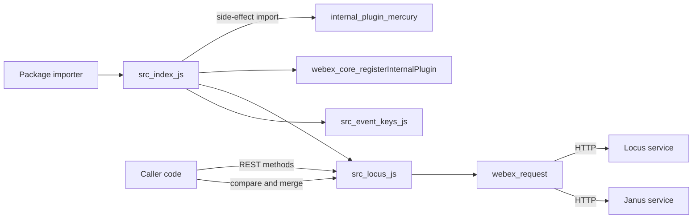
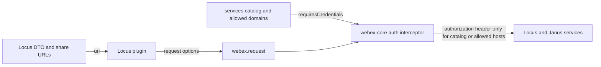

<!-- sdd-generated-metadata
doc_kind: standing-doc
generated_from: architecture@0.3.0
generated_by: claude-cowork
approved_by: akulakum@cisco.com
updated_at: 2026-10-09T06:22:13Z
validation_status: pending
-->

# @webex/internal-plugin-locus architecture

Canonical architecture for this package. Plugin behavior lives in the
[Locus plugin specification](../src/docs/README.md). This page owns package boundaries, the plugin
registration, the contract index, and how the package meets the rest of the SDK.

Related context: [specification registry](specs/README.md) ·
[package agent instructions](../AGENTS.md)

## Applicability

| Condition ID                         | Status     | Evidence or reason | Owned section |
| ------------------------------------ | ---------- | ------------------ | ------------- |
| `repo.owns_datastore`                | N/A        | No database, file store, or migration in `src/` | Repository data and schema |
| `repo.holds_client_state`            | N/A        | The plugin defines no state. Callers hold the Locus working copy. | Client state model |
| `repo.components_interact`           | N/A        | One module. The import graph is shown under Interaction and execution flows. | Dependency and interaction topology |
| `repo.domain_data_across_components` | N/A        | Locus DTOs are passed through to the caller, not owned | Object and data ownership |
| `repo.caches_data`                   | N/A        | No cache. Memoized helpers in `compareSequence` live for one call. | Caching catalog |
| `repo.observability_convention`      | N/A        | `src/` has no logger, metric, or trace call; request logging belongs to webex-core | Observability patterns |
| `repo.deploys_to_infra`              | N/A        | Library published to npm. No service runtime. | Runtime and infrastructure |
| `repo.shared_base_libs`              | Applicable | Inherits `WebexPlugin` and the legacy build, lint, and test stack | Shared and base libraries |
| `repo.is_monorepo`                   | N/A        | This SDD root is one package. The workspace around it is out of scope. | Package map and inter-package dependencies |
| `repo.multi_platform`                | N/A        | No `browser` field in `package.json` and no platform-specific code in `src/` | Platform matrix |
| `repo.published_package`             | Applicable | `package.json` `name` is `@webex/internal-plugin-locus` and `deploy:npm` publishes it | Release and versioning |
| `repo.embedded_in_host`              | N/A        | No host theme or embed API | Host integration and theming |
| `repo.exposes_commands_or_artifacts` | Applicable | `build:src` writes the build output directory | Commands and generated artifacts |
| `repo.cross_repo_deps_material`      | Applicable | Behavior depends on sibling workspace plugins and on the Locus and Janus services | Cross-repository topology |
| `repo.security_arch_warranted`       | Applicable | Requests go to URLs taken from server DTOs, and authorization is attached by webex-core | Security architecture |

## Design overview

`@webex/internal-plugin-locus` is a published library with one module. Importing it imports the
Mercury plugin and registers `Locus` as the internal plugin `locus`, so every webex instance has
`webex.internal.locus`.

The plugin has two halves. REST wrappers call the Locus service for call setup, participant actions,
media updates, DTMF, floor control, and reads, plus one Janus query for call history. Pure functions
compare Locus sequence objects and merge Locus deltas, so a caller can keep its own working copy of a
Locus in step with out-of-order events. The plugin holds no state of its own.

The package serves no routes and persists nothing. It does not receive Locus events: it exports
their names in `eventKeys` for callers that subscribe through Mercury.

## Resource inventory and responsibilities

| Resource | Kind | Responsibility | Owner | Source | Detailed specification |
| -------- | ---- | -------------- | ----- | ------ | ---------------------- |
| Locus plugin | module | REST wrappers, sequence comparison, delta merge, event names | @webex/web-sdk | `src/` | `src/docs/README.md` |
| Published package | package | npm entry points and the registration side effect | @webex/web-sdk | `package.json` | `docs/architecture.md` |

## Interaction and execution flows

| From | To | Interaction or transport | Purpose | Failure or compatibility behavior |
| ---- | -- | ------------------------ | ------- | --------------------------------- |
| Importer | `src/index.js` | package import | Register the plugin | Without the import, `webex.internal.locus` is absent |
| `src/index.js` | internal-plugin-mercury | side-effect import | Register Mercury on the same webex instance; see Dependency topology | Load-time only |
| Caller | `webex.internal.locus` | method calls | REST operations and DTO reconciliation | See the Locus plugin spec failure modes |
| `src/locus.js` | `webex.request` | in-process promise | Send HTTP requests | Rejections propagate, except the Conflict recovery |
| `webex.request` | Locus and Janus services | HTTP | Call state and history | Status errors become `WebexHttpError` subtypes |

## Dependency topology

| Dependency | Type | Used by | Purpose | Version, failure, or fallback policy |
| ---------- | ---- | ------- | ------- | ------------------------------------ |
| `@webex/webex-core` | Internal | `src` | Plugin base, registration, request, HTTP errors | Workspace version |
| `@webex/internal-plugin-mercury` | Internal | `src` | Side-effect import only | Workspace version |
| `@webex/internal-plugin-device` | Internal, undeclared | `src` | `deviceUrl` in request bodies | Reached through the Mercury import, not `package.json` |
| `lodash` | External | `src` | Clone, set difference, memoize | Range in `package.json` |
| `uuid` | External | `src` | DTMF correlation id | Range in `package.json` |

Ordering constraint: the device plugin must be registered before a request that sends the device
URL runs. No dependency cycle exists inside the package. The test helpers listed
under `dependencies` are not imported by `src/`.

## Public and consumer surfaces

| Surface | Type | Owner | Consumers | Compatibility policy | Source |
| ------- | ---- | ----- | --------- | -------------------- | ------ |
| `locus-sdk` (published) | SDK | Locus plugin | Sibling package internal-plugin-lyra (integration spec) and any code reaching `webex.internal.locus` | Internal plugin; see Release and versioning | `package.json` |
| `locus-service-http` (required) | API | Locus service | Locus plugin | External; consumed, not served | Locus service |
| `janus-history-http` (required) | API | Janus service | Locus plugin | External; consumed, not served | Janus service |
| `webex-core-plugin-host` (required) | RPC | sibling package webex-core | Locus plugin | External | `@webex/webex-core` |
| `webex-device-registration` (required) | SDK | sibling package internal-plugin-device | Locus plugin | External; see Dependency topology | `@webex/internal-plugin-device` |
| `mercury-sdk` (required) | SDK | sibling package internal-plugin-mercury | Package barrel | Specified in its SDD module spec, file src/docs/README.md of that package | `@webex/internal-plugin-mercury` |
| `lodash`, `uuid` (required) | SDK | npm | Locus plugin | See Dependency topology | npm |

`locus-sdk` entry points: `main` points at the build output and `devMain` at `src/index.js`. No HTTP
surface is served, so `api-specs/openapi.yaml` is omitted.

## Cross-cutting architecture

### Security

- Trust boundaries and identity flow: see Security architecture.
- Sensitive surfaces and data classes: SDP offers, device URLs, and participant data in Locus DTOs;
  controls and gaps are in Security architecture.
- Encryption and secret boundaries: transport encryption is whatever scheme the catalog or DTO URL
  uses; token handling is described in Security architecture.

### Observability and operations

- Logging and correlation: none in this package (see the `repo.observability_convention` row);
  request logging and tracking ids come from the webex-core request pipeline. `correlationId`
  values in bodies are supplied by callers, except the DTMF id generated here.
- Metrics, traces, and audit signals: N/A — none emitted by this package.
- Ownership and operational entry points: no runtime to deploy or monitor; owners are listed in
  References and maintenance.

### Quality attributes

- Correctness: the sequence comparison must give the fixture result for every case in
  `test/unit/lib`.
- Compatibility: the plugin name, exports, and constant values are relied on by importers.
- Footprint: the runtime dependencies listed under Dependency topology, with no native or
  platform-specific code.

## Shared and base libraries

| Library | Inherited responsibility | Consumers | Version floor | Compatibility rule |
| ------- | ------------------------ | --------- | ------------- | ------------------ |
| `WebexPlugin` from `@webex/webex-core` | `this.webex`, `request()` delegating to `webex.request`, and the plugin lifecycle | `src/locus.js` | workspace | Follow webex-core plugin conventions |
| `@webex/babel-config-legacy`, `@webex/eslint-config-legacy`, `@webex/jest-config-legacy` | Build, lint, and Jest config passthroughs | `babel.config.js`, `.eslintrc.js`, `jest.config.js` | workspace | Change upstream, not in the passthrough files |
| `@webex/legacy-tools` | `webex-legacy-tools` build and test runners | `package.json` scripts | workspace | Scripts call it; do not replace locally |

## Release and versioning

| Artifact | Publish target | Versioning rule | Deprecation window | Changelog or migration obligation |
| -------- | -------------- | --------------- | ------------------ | --------------------------------- |
| `@webex/internal-plugin-locus` | npm, through the `deploy:npm` script, which wraps Yarn's npm publish | Workspace release tooling; README says the internal plugin does not strictly follow semver | None declared in code | No package-local changelog; workspace tooling owns it |

## Commands and generated artifacts

| Command or artifact | Owner | Inputs | Output or side effect | Compatibility boundary |
| ------------------- | ----- | ------ | --------------------- | ---------------------- |
| `yarn install` | workspace | root `package.json` and lockfile | workspace `node_modules` | Run from the workspace root |
| `yarn workspace @webex/internal-plugin-locus build` | package | `src/` | build output through `build:src` | Build output is never edited by hand |
| `yarn workspace @webex/internal-plugin-locus build:src` | package | `src/` (`.js` and `.ts`) | build output with source maps | Markdown under `src/` is not processed |
| `yarn workspace @webex/internal-plugin-locus test:unit` | package | `test/unit/spec/` | Jest result | — |
| `yarn workspace @webex/internal-plugin-locus test:browser` | package | integration specs (none exist) | karma result | Needs a browser |
| `yarn workspace @webex/internal-plugin-locus test:style` | package | files under `src/` | eslint result | Markdown is reported as ignored |
| `yarn workspace @webex/internal-plugin-locus deploy:npm` | package | build output, `package.json` | npm publish | Release pipeline only |

## Cross-repository topology

| Repository or external system | Relationship | Exchanged contract or artifact | Owner | Sequencing constraint |
| ----------------------------- | ------------ | ------------------------------ | ----- | --------------------- |
| Sibling package webex-core | Consumes | `webex-core-plugin-host` | @webex/web-client, @webex/web-sdk | Plugin host must exist before registration |
| Sibling package internal-plugin-mercury | Consumes | `mercury-sdk` | @webex/web-client, @webex/web-sdk | Imported before registration |
| Sibling package internal-plugin-device | Consumes | `webex-device-registration` | @webex/web-client, @webex/web-sdk | Read by the requests listed in the module spec invariant `INV-007` |
| Sibling package internal-plugin-lyra | Provides | `locus-sdk` | @webex/web-sdk (CODEOWNERS default rule) | None |
| Locus service | Coordinates | `locus-service-http` | External Webex service; owner not recorded in this repository | Request bodies and sequence semantics must match the service |
| Janus service | Coordinates | `janus-history-http` | External Webex service; owner not recorded in this repository | None |

These are sibling workspace packages and external services outside this package-scoped SDD root.

## Security architecture

Threat addressed: sending the user's access token to a host taken from a server DTO.

Controls:

- This package never reads or sends a token itself. Authorization is added by the sibling package
  webex-core auth interceptor, which adds the header only when the request URL resolves to a catalog
  service or an allowed domain (sibling package webex-core, file src/interceptors/auth.js).
- Absolute URLs (`locus.url`, `locus.self.url`, `locus.syncUrl`, `share.url`) are taken from DTOs
  without validation in this package; the interceptor above is the only host check.

Known gaps are recorded where the code lives: DTO-shape assumptions in the Locus plugin spec
Pitfalls. The workspace root `SECURITY.md` is the security
policy; this package adds none.

## Domain language

| Term | Repository-specific meaning | Authoritative source |
| ---- | --------------------------- | -------------------- |
| Locus | The Webex service, and its DTO, that holds the state of a call or meeting | `src/locus.js` |
| Sequence | The `entries`, `rangeStart`, `rangeEnd` object that orders Locus versions | `src/locus.js` |
| Delta | A Locus DTO with `baseSequence`, applied with `merge` | `src/locus.js` |
| Working copy | The caller-held Locus that the caller replaces with the result of `merge` after `compare` | `test/unit/lib/SeqCmp.json` |
| Action | `USE_INCOMING`, `USE_CURRENT`, or `FETCH`, returned by `compare` | `src/locus.js` |
| Floor | The right to share an additional media stream, granted or released on a media share | `src/locus.js` |
| Janus | The call history service queried by `getCallHistory` | `src/locus.js` |

## References and maintenance

- Decisions: [adr/](adr/), including [ADR 0001](adr/0001-retain-product-readme.md)
- Instantiated specifications and routing: [specs/README.md](specs/README.md)
- Module spec: `src/docs/README.md`
- Owner: `@webex/web-sdk` through the monorepo `.github/CODEOWNERS` default rule
- Manifest: `.sdd/manifest.json`
- Update this document in the same change that alters package boundaries, contracts, or
  cross-cutting behavior.
