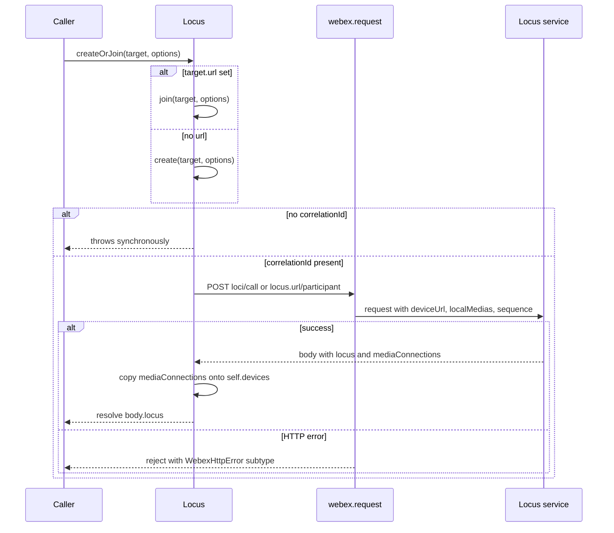
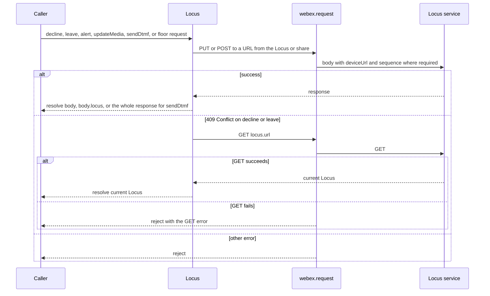
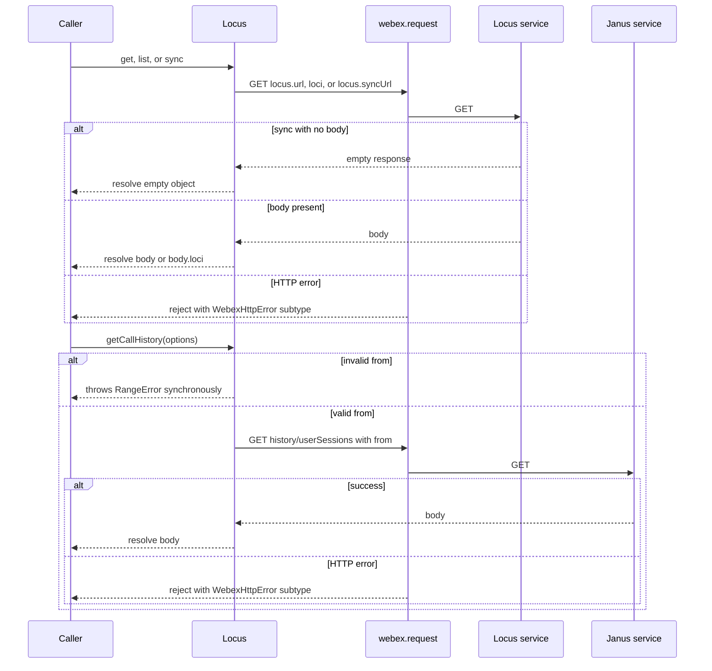
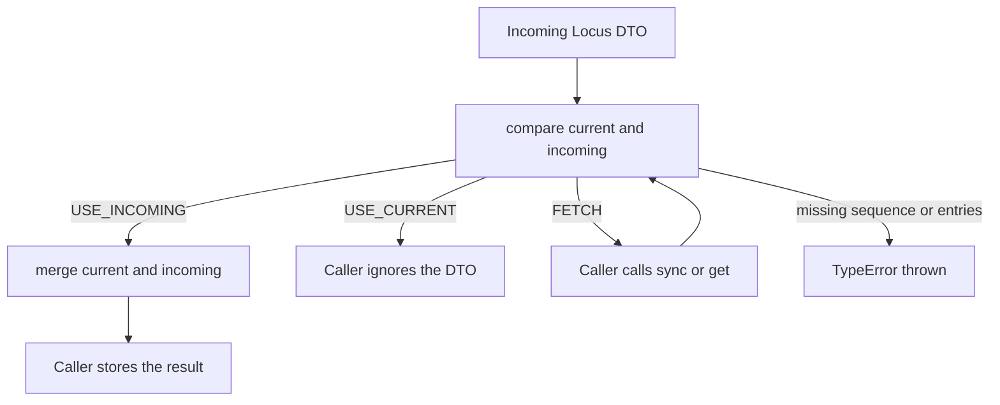
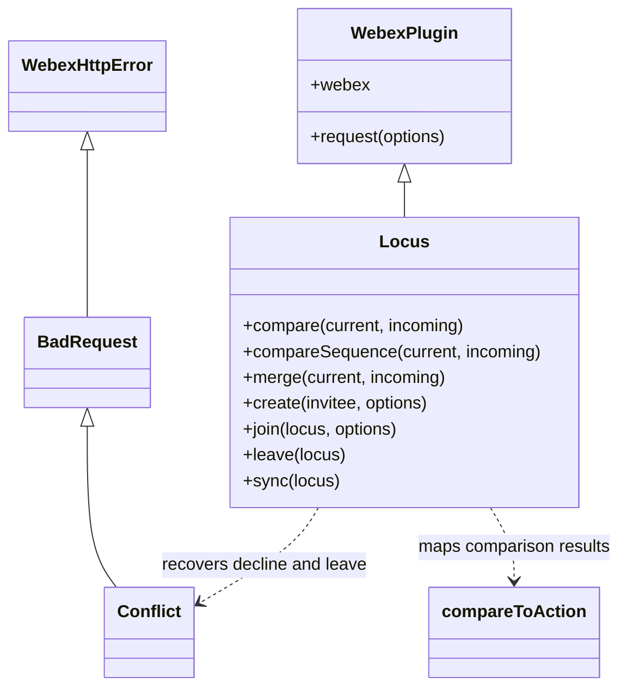

<!-- sdd-generated-metadata
doc_kind: module-spec
generated_from: module-spec@0.3.0
generated_by: claude-cowork
approved_by: akulakum@cisco.com
updated_at: 2026-10-09T07:03:45Z
validation_status: pass-with-warnings
-->

# Locus plugin

This source-local document at `src/docs/README.md` owns the stable specification for **the Locus
plugin**: the `webex.internal.locus` client for the Locus call and meeting state service. Ground
every claim in package evidence and link to the [package architecture](../../docs/architecture.md)
instead of repeating broader facts. No service specification exists because this package is a
library.

Related context: [documentation index](../../docs/index.md) ·
[package agent instructions](../../AGENTS.md)

## Metadata

| Field             | Value |
| ----------------- | ----- |
| Owner             | @webex/web-sdk (CODEOWNERS default rule) |
| Source path       | `src` |
| Resource kind     | package |
| Status            | Draft |
| Last verified     | 2026-10-09 at `e929b6a8bb` |
| Module id         | `internal-plugin-locus` |
| Parent spec       | — |
| Doc kind          | Module spec |
| Coverage score    | 93.3% assessed 2026-10-09 — 14 of 15 mandatory fields PRESENT, critical 8 of 8; test strategy is WEAK (gaps listed under Verification) and no characterization baseline exists |
| Validation status | PASS-WITH-WARNINGS; assessed 2026-10-09 by current-session (0 Blocking, 1 Important) |

## Applicability

| Condition ID                         | Status     | Evidence or reason | Owned section |
| ------------------------------------ | ---------- | ------------------ | ------------- |
| `module.has_tiers`                   | N/A        | No tier policy exists in this package or its `package.json` | Tier |
| `module.has_ui`                      | N/A        | No view or screen. The module issues requests and compares data. | UI use-case flow |
| `module.crosses_service_boundaries`  | Applicable | Every REST method in `src/locus.js` calls the Locus or Janus service through `webex.request` | Cross-boundary use-case flow |
| `module.holds_client_state`          | N/A        | `src/locus.js` defines no props, session, or derived state. Callers hold the Locus working copy. | Client state model |
| `module.enforces_domain_rules`       | Applicable | The Locus sequence comparison and delta merge rules in `src/locus.js` | Business rules and invariants |
| `module.is_concurrent_async`         | Applicable | Promise-returning REST methods, a second request on 409 Conflict, and caller-driven ordering of out-of-order Locus DTOs | Concurrency and reactive flow |
| `module.owns_persistence`            | N/A        | Nothing is stored. Results are returned to the caller. | Data, schema, and migration discipline |
| `module.stateful_transitions`        | N/A        | The module keeps no state between calls; participant and call states belong to the Locus service | State machine |
| `module.exposes_wire_protocol`       | Applicable | Request bodies, the JSON-string `localSdp`, the Locus sequence object, and the delta DTO fields read in `src/locus.js` | Protocol and wire format |
| `module.ui_multi_screen`             | N/A        | No UI | UI flow |
| `module.large_data_model`            | N/A        | The Locus DTO is passed through, not modelled. Only the sequence object and a few fields are read. | Data model |
| `module.returns_caller_errors`       | Applicable | Synchronous throws for missing arguments and promise rejections from `webex.request` | Caller-visible failure modes |
| `module.module_specific_conventions` | Applicable | Device URL and sequence in request bodies per `INV-007`, resolving the response body, and Conflict-to-GET recovery | Module-specific rules |
| `module.published_package`           | Applicable | `package.json` names the package @webex/internal-plugin-locus and `deploy:npm` publishes it | Export stability |
| `module.embedded_in_host`            | N/A        | No host theme or embed API | Host integration and theming |
| `module.has_design_tradeoff`         | Applicable | Stateless compare and merge, Conflict recovery by GET, and per-call memoization | Key design trade-off |
| `module.has_submodules`              | N/A        | Computed false by the Repo Annotation module_tree.py script: the manifest has one module | Sub-modules |

## Evidence register

| Evidence | What it establishes |
| -------- | ------------------- |
| `src/index.js` | Mercury side-effect import, internal plugin registration as `locus`, and the public exports |
| `src/locus.js` | The `Locus` plugin: sequence constants, `compareToAction`, every public method, and the request bodies |
| `src/event-keys.js` | The exported list of Locus event names |
| `package.json` | Name, entry points, dependencies, and scripts |
| `test/unit/spec/locus.js` | Fixture-driven cases for `compareSequence` and `compare` against a `MockWebex` instance |
| `test/unit/lib/BasicSeqCmp.json` | 88 basic `compareSequence` comparisons |
| `test/unit/lib/SeqCmp.json` | 25 `compareSequence` comparisons, 21 `compare` update actions, and the descriptions of the ACCEPT_NEW, KEEP_CURRENT, and DESYNC actions |
| Sibling package webex-core, file src/lib/webex-plugin.js | `WebexPlugin#request` delegates to `webex.request` |
| Sibling package webex-core, file src/interceptors/auth.js | The authorization header is added only for catalog or allowed-domain URLs |
| Sibling package http-core, file src/http-error-subtypes.js | Builds the subtype tree in which `Conflict` (409) extends `BadRequest` |
| Sibling package webex-core, file src/lib/webex-http-error.js | Applies that subtype tree to `WebexHttpError`, giving `WebexHttpError.Conflict` |
| Sibling package internal-plugin-mercury, SDD module spec src/docs/README.md | The Mercury plugin registered by the side-effect import |
| Sibling package internal-plugin-lyra, files package.json and test/integration/spec/space.js | Consumer evidence for Purpose and boundary |
| Product README | Retained product documentation, not the behavioral authority. See ADR 0001. |

## Purpose and boundary

- Responsibility: give SDK code one place to call the Locus REST operations for a call or meeting,
  and to decide how an incoming Locus DTO relates to the copy the caller already holds.
- In scope: the `Locus` plugin in `src/locus.js`, its REST wrappers, the sequence comparison and
  delta merge functions, the seven exported comparison constants, the `eventKeys` list, and the
  registration side effect in `src/index.js`.
- Out of scope: holding or updating a Locus working copy (the caller does this), receiving Locus
  events from Mercury (the package subscribes to none), HTTP transport, authorization, and error
  classes (sibling packages webex-core and http-core), device registration (sibling package
  internal-plugin-device), and the Mercury connection (sibling package internal-plugin-mercury).
- Consumers: code that reaches `webex.internal.locus`, and importers of the package barrel. In this
  workspace only the sibling package internal-plugin-lyra lists the package, and only its
  integration spec imports it.

## Structure and key files

| Path | Responsibility |
| ---- | -------------- |
| `src/index.js` | Imports `@webex/internal-plugin-mercury` for its side effect, calls `registerInternalPlugin('locus', Locus)`, and re-exports `Locus`, `eventKeys`, and the seven constants |
| `src/locus.js` | Constants, the private `compareToAction` mapper, and the `Locus` plugin built with `WebexPlugin.extend` and namespace `Locus` |
| `src/event-keys.js` | `locusEventKeys` array, exported as named and default |
| `test/unit/spec/locus.js` | The only spec. Generates one test case per fixture entry and calls `compareSequence` or `compare` |
| `test/unit/lib/BasicSeqCmp.json` | Basic sequence fixtures |
| `test/unit/lib/SeqCmp.json` | Sequence and update-action fixtures |

## Public surface

Declarations live in `src/index.js` and `src/locus.js`. This section summarises them and does not
restate signatures.

| Surface | Consumer | Compatibility commitment | Source |
| ------- | -------- | ------------------------ | ------ |
| Registration side effect | Every importer | Importing installs `webex.internal.locus` (`MOD-001`) | `src/index.js` |
| Sequence constants | Callers of `compare` and `compareSequence` | String values equal their names (`MOD-002`) | `src/locus.js` |
| `eventKeys` | Callers that subscribe to Locus events themselves | List of event type names (`MOD-018`) | `src/event-keys.js` |
| `compareSequence(current, incoming)` | Callers comparing raw sequence objects | Returns a comparison result (`MOD-003`) | `src/locus.js` |
| `compare(current, incoming)`, `compareDelta(current, incoming)` | Callers applying Locus DTOs | Returns an action (`MOD-004`, `MOD-005`); `compareDelta` is JSDoc-private | `src/locus.js` |
| `merge(current, incoming)` | Callers applying Locus DTOs | Returns the next working copy (`MOD-006`) | `src/locus.js` |
| `create`, `join`, `createOrJoin` | Call setup code | Resolve the Locus with per-device `mediaConnections` (`MOD-007` to `MOD-009`); `createOrJoin` is JSDoc-private | `src/locus.js` |
| `alert`, `decline`, `leave`, `updateMedia`, `sendDtmf` | Call control code | Participant and media operations (`MOD-010` to `MOD-012`, `MOD-015`, `MOD-017`) | `src/locus.js` |
| `get`, `list`, `sync`, `getCallHistory` | Readers | Read operations (`MOD-013`, `MOD-014`) | `src/locus.js` |
| `requestFloorGrant`, `releaseFloorGrant` | Content-share code | Floor operations on a media share (`MOD-016`) | `src/locus.js` |

Contract `locus-sdk` is published with native artifact `package.json`. Required contracts:
`locus-service-http`, `janus-history-http`, `webex-core-plugin-host`, `webex-device-registration`,
`mercury-sdk`, `lodash`, and `uuid`.

## Dependencies

| Dependency | Why it is required | Failure behavior |
| ---------- | ------------------ | ---------------- |
| `@webex/webex-core` (`webex-core-plugin-host`) | `WebexPlugin`, `registerInternalPlugin`, `request`, and `WebexHttpError.Conflict` | HTTP failures reject with the `WebexHttpError` subtype built by the sibling package http-core |
| Locus service (`locus-service-http`) | Every call and participant operation | Rejections propagate, except 409 Conflict on `decline` and `leave` (`INV-006`) |
| Janus service (`janus-history-http`) | `getCallHistory` | Rejections propagate |
| `webex.internal.device` (`webex-device-registration`) | `url` sent as the device URL (`INV-007`) | Not a declared dependency; it is registered transitively because the Mercury index imports the device plugin (sibling package internal-plugin-mercury, file src/index.js). If it is absent, reading `url` throws a TypeError |
| `@webex/internal-plugin-mercury` (`mercury-sdk`) | Side-effect import only; it brings in the device plugin above | Load-time only; Locus calls no Mercury API |
| `lodash` | `cloneDeep`, `difference`, `first`, `last`, `memoize` | — |
| `uuid` | `v4` for the DTMF correlation id | — |
| `@webex/test-helper-chai`, `@webex/test-helper-mock-webex` | Listed under `dependencies` and `devDependencies` but imported only by `test/` | — |

## Requirements

| ID | WHAT | WHY | Source evidence | Test or example evidence | Assumptions or gaps | Confidence |
| -- | ---- | --- | --------------- | ------------------------ | ------------------- | ---------- |
| `MOD-001` | Importing the package imports the Mercury plugin and registers `Locus` as internal plugin `locus` with no config or hooks. | Every webex instance that imports the package gets `webex.internal.locus`. | `src/index.js` | none found; the unit spec mounts `Locus` as a `MockWebex` child instead | — | Present |
| `MOD-002` | The barrel exports `Locus` as default, `eventKeys`, and the constants `USE_INCOMING`, `USE_CURRENT`, `EQUAL`, `FETCH`, `GREATER_THAN`, `LESS_THAN`, `DESYNC`, each equal to its own name. | Callers compare results against the exported names. | `src/index.js`, `src/locus.js` | `test/unit/spec/locus.js` imports `Locus`, `DESYNC`, `USE_INCOMING`, `USE_CURRENT`, `FETCH` from the package; the fixture strings check the values of `EQUAL`, `GREATER_THAN`, `LESS_THAN`, and `DESYNC` | The values of `USE_INCOMING`, `USE_CURRENT`, and `FETCH` are not asserted; the spec compares against the imported constants | Present |
| `MOD-003` | `compareSequence` throws when either argument is missing, and otherwise returns `LESS_THAN`, `GREATER_THAN`, `EQUAL`, or `DESYNC` by the algorithm in `INV-003` and `INV-004`. | Locus sends sequences as ranges plus entries; clients must order DTOs without the server. | `src/locus.js` | `test/unit/spec/locus.js` `basic sequence comparisons` and `sequence comparisons` | No test for the missing-argument throws | Present |
| `MOD-004` | `compare` returns `USE_INCOMING` when either sequence is empty (`INV-002`), delegates to `compareDelta` when `incoming.baseSequence` is set, and otherwise maps the `compareSequence` result by `INV-001`. | Gives the caller one action per incoming DTO. | `src/locus.js` | `test/unit/spec/locus.js` `delta sequence comparisons` (updt5 to updt7 and updt10 to updt15 have no base) | — | Present |
| `MOD-005` | `compareDelta` maps a non-`LESS_THAN` result by `INV-001`. When `incoming.sequence` is newer, it compares the current sequence with `incoming.baseSequence`: `GREATER_THAN` or `EQUAL` gives `USE_INCOMING`; anything else gives `FETCH`. | A delta can only be applied to a working copy at or past its base. | `src/locus.js` | `test/unit/spec/locus.js` `delta sequence comparisons` (updt1 to updt4, updt8, updt9, updt18, updt19, updt21, updt23, updt24) | — | Present |
| `MOD-006` | `merge` returns `incoming` unchanged when it has no `baseSequence`. Otherwise it returns a deep clone of `current` with the delta applied by `INV-005`. | The fixture description of ACCEPT_NEW: merge a delta, replace with a full DTO. | `src/locus.js`, `test/unit/lib/SeqCmp.json` | none found | See Pitfalls for the missing-`participants` throw and falsy values | Present |
| `MOD-007` | `create` throws synchronously without `options.correlationId`, sends the `create` request, sets each `locus.self.devices[i].mediaConnections` to `[mediaConnections[i]]` from the response, and resolves `body.locus`. | `body.mediaConnections` is deprecated per the source comment; callers read it from the device. | `src/locus.js` | none found | — | Present |
| `MOD-008` | `join` takes `correlationId` from the Locus, else from `options`, and throws synchronously without one. It sends the `join` request and resolves like `MOD-007`. | Joins an existing Locus with local media. | `src/locus.js` | none found | — | Present |
| `MOD-009` | `createOrJoin` calls `join` when `target.url` is set, else `create`. | Lets one call path dial a user or join a Locus. The JSDoc says it serves the phone plugin. | `src/locus.js` | none found | — | Present |
| `MOD-010` | `alert` sends the `alert` request and resolves the response body. | Tells Locus the local user has been notified of the Locus's active state, per the JSDoc. | `src/locus.js` | none found | — | Present |
| `MOD-011` | `decline` sends the `decline` request and resolves the body. A Conflict is recovered by `INV-006`; other errors reject. | Declining a call that has already changed state still returns current state. | `src/locus.js` | none found | — | Present |
| `MOD-012` | `leave` sends the `leave` request and resolves `body.locus`. A Conflict is recovered by `INV-006`; other errors reject. | Same as `MOD-011` for leaving. | `src/locus.js` | none found | — | Present |
| `MOD-013` | `get` resolves the body of a GET on `locus.url`; `list` resolves `body.loci` from the `list` request; `sync` resolves the body of a GET on `locus.syncUrl`, or `{}` when the body is empty. | `sync` returns a delta that the caller passes to `compare` and `merge`; it does not merge. | `src/locus.js` | none found | The `{}` case follows the source comment about 204 No Content | Present |
| `MOD-014` | `getCallHistory` sends the `call history` request with `from` as the ISO string of `options.from`, or of now when `options.from` is falsy, and resolves the body. | Lists the user's recent sessions. | `src/locus.js` | none found | — | Present |
| `MOD-015` | `updateMedia` sends the `media update` request and resolves `body.locus`. | Starts or stops sending audio or video, or offers a new SDP. | `src/locus.js` | none found | The JSDoc names `options.localSdp`, but the code reads `sdp` (see Pitfalls) | Present |
| `MOD-016` | `requestFloorGrant` and `releaseFloorGrant` send the `floor` requests to `share.url` and resolve the body. `releaseFloorGrant` does not use its `locus` argument. | Start and stop an additional shared media stream. | `src/locus.js` | none found | — | Present |
| `MOD-017` | `sendDtmf` sends the `DTMF` request with a new `uuid.v4()` correlation id and resolves the whole response, not its body. | Plays tones into the call. | `src/locus.js` | none found | — | Present |
| `MOD-018` | `eventKeys` lists 17 Locus event type names (listed under Protocol and wire format). The package does not subscribe to them. | Callers that listen on Mercury can register every Locus event type from one list. | `src/event-keys.js` | none found | No in-package consumer | Present |

## Design overview

`Locus` is created with `WebexPlugin.extend` and has no props, session, or derived state. Every
public method is either a REST wrapper or a pure function over caller-supplied data.

The REST wrappers share one shape: build a request with either a catalog service plus resource or an
absolute URL taken from the Locus DTO, add `deviceUrl` and the caller's sequence where the operation
needs them (`INV-007`), call `this.request` (which delegates to `webex.request`; the floor methods
call `this.webex.request` directly), and resolve the response body or one field of it. The only
error handling in the module is the Conflict recovery of `INV-006`.

The comparison functions implement Locus sequencing. `compareSequence` orders two sequence objects;
`compare` and `compareDelta` turn that order into one of three actions, and `merge` builds the
next working copy; the caller's loop is the Sequence reconciliation diagram. Keeping these pure
lets a caller, not the plugin, decide where the working copy lives. The JSON fixtures under `test/unit/lib` are the executable reference
for the algorithm.

`src/index.js` imports the Mercury plugin before registering; why that import matters is recorded
under Dependencies.

## Data flow and sequence coverage

Transport: HTTP through `webex.request` to the Locus and Janus services; in-process synchronous calls
for comparison and merge.

| Operation group | Entry and outcome | Diagram or evidence | Failure and recovery coverage |
| --------------- | ----------------- | ------------------- | ----------------------------- |
| Call setup | `create`, `join`, `createOrJoin` → Locus with per-device `mediaConnections` | Call setup diagram below | Synchronous throw without `correlationId`; HTTP rejection |
| Participant and media updates | `alert`, `decline`, `leave`, `updateMedia`, `sendDtmf`, floor requests → body | Participant and media updates diagram below | Conflict recovery for `decline` and `leave`; other rejections |
| Reads | `get`, `list`, `sync`, `getCallHistory` → body | Reads diagram below | Empty `sync` body; invalid `from`; HTTP rejection |
| Sequence reconciliation | `compare` → action → `merge` or fetch | Sequence reconciliation diagram below | `FETCH` path; throws for missing data |

Call setup:

Participant and media updates:

Reads:

Sequence reconciliation, run by the caller for each incoming Locus DTO:

## Class and component relationships

| Component | Relationship |
| --------- | ------------ |
| `Locus` | Plugin holding every public method; extends `WebexPlugin` |
| `compareToAction` | Module-private function in `src/locus.js` used by `compare` and `compareDelta` |
| `WebexHttpError.Conflict` | 409 subtype from the sibling package webex-core, checked with `instanceof` |
| `locusEventKeys` | Plain array in `src/event-keys.js`, unrelated to the plugin at runtime |

## Use cases and flows

| Use case | Actor or caller | Primary steps and outcome | Failure or boundary behavior | Evidence |
| -------- | --------------- | ------------------------- | ---------------------------- | -------- |
| `UC-001` | Call setup code | Calls `createOrJoin` with a user identifier and `{correlationId, localSdp}`; `create` posts the call and resolves the new Locus | See Caller-visible failure modes | `src/locus.js` |
| `UC-002` | Meeting join code | Calls `createOrJoin` with a Locus that has `url`; `join` posts to its participant URL | `correlationId` may come from the Locus | `src/locus.js` |
| `UC-003` | Code applying a Locus event | Runs the loop in the Sequence reconciliation diagram for each incoming DTO and stores the result | `compare` and `merge` throw on malformed data (see Pitfalls) | `src/locus.js`, `test/unit/spec/locus.js`, `test/unit/lib/SeqCmp.json` |
| `UC-004` | Call control code | Calls `leave(locus)` after the call already changed; Locus answers 409 and `INV-006` applies | Any other status rejects | `src/locus.js` |
| `UC-005` | Content-share code | Calls `requestFloorGrant(locus, share)` and later `releaseFloorGrant(locus, share)` | Rejections propagate | `src/locus.js` |
| `UC-006` | Caller of `getCallHistory` | Calls `getCallHistory({from})` and receives the Janus response body | See Caller-visible failure modes | `src/locus.js` |

### Cross-boundary use-case flow

| Boundary | Transport | Ordering | Timeout and retry | Recovery |
| -------- | --------- | -------- | ----------------- | -------- |
| Locus service | HTTP through `webex.request`, catalog service `locus` or DTO URLs | One request per call; one extra GET after a Conflict | No retry here; any retry or timeout is the webex-core request pipeline's | `INV-006` for `decline` and `leave`; others reject |
| Janus service | HTTP through `webex.request`, catalog service `janus` | One request | Same as above | Rejects |
| Device plugin | In-process property read | Read by every request that `INV-007` lists as carrying the device URL | None | None; see Dependencies |
| Caller-held Locus copy | In-process | One DTO at a time, per `UC-003` | None | Per `UC-003` |

## Business rules and invariants

| ID | Invariant | WHY | Enforcement source | Test evidence |
| -- | --------- | --- | ------------------ | ------------- |
| `INV-001` | Result to action: `EQUAL` and `GREATER_THAN` give `USE_CURRENT`, `LESS_THAN` gives `USE_INCOMING`, `DESYNC` gives `FETCH`; any other value throws. | Equal or older data must never replace the working copy; a desync must be resolved by a fetch. | `src/locus.js` `compareToAction` | `test/unit/spec/locus.js` `delta sequence comparisons` |
| `INV-002` | A sequence is empty when its `entries` is missing or empty and both `rangeStart` and `rangeEnd` are 0. If either side is empty, `compare` returns `USE_INCOMING`. | An empty sequence carries no ordering, so the incoming DTO is taken. | `src/locus.js` `compare` | `test/unit/spec/locus.js` `delta sequence comparisons` updt5, updt6, updt6b, updt7 |
| `INV-003` | Bounds: the first value is `rangeStart`, or the first entry when `rangeStart` is 0, or 0; the last value is the last entry, or `rangeEnd` when there are no entries. Current first above incoming last is `GREATER_THAN`; current last below incoming first is `LESS_THAN`. | Disjoint sequences are ordered by their bounds alone. | `src/locus.js` `compareSequence` | `test/unit/spec/locus.js` `basic sequence comparisons`, `sequence comparisons` |
| `INV-004` | Overlap: entries in one sequence and not the other, and outside the other's range, are that side's only-entries. None on both sides compares `rangeEnd` minus first value (longer is greater, equal is `EQUAL`). Only one side having them makes that side greater. Both having them is `DESYNC` when all four range bounds are 0, or when an only-entry lies strictly inside the other side's bounds; otherwise the side with the larger first only-entry is greater. | Matches the Locus sequencing algorithm captured in the fixtures. | `src/locus.js` `compareSequence` | `test/unit/spec/locus.js` `basic sequence comparisons`, `sequence comparisons` |
| `INV-005` | Delta merge: every key of the delta except `baseSequence` and `participants` replaces the clone's value when the delta value is truthy. Participants are keyed by `url`: entries with `removed` set are dropped, others replace or append. | Implements the delta rules written in the `merge` source comments. | `src/locus.js` `merge` | Gap: no test |
| `INV-006` | A `WebexHttpError.Conflict` from `decline` or `leave` resolves with `get(locus)` instead of rejecting. | A 409 means the Locus changed; the caller needs the current state, not an error. | `src/locus.js` `decline`, `leave` | Gap: no test |
| `INV-007` | `create`, `join`, `alert`, `decline`, `leave`, `updateMedia`, and `sendDtmf` send a top-level `deviceUrl` equal to `webex.internal.device.url`; `requestFloorGrant` nests it in the beneficiary devices; `releaseFloorGrant` sends none. `alert`, `decline`, `leave`, and `updateMedia` send `locus.sequence`; `join` sends it or an empty sequence; `create` always sends an empty sequence; `sendDtmf` and the floor requests send no sequence. | Locus identifies the device and rejects stale requests by sequence. | `src/locus.js` | Gap: no test |

## Concurrency and reactive flow

- Execution model: single JavaScript event loop. REST methods return promises from
  `webex.request`; `compare`, `compareSequence`, `compareDelta`, and `merge` are synchronous.
- Ordering guarantees: none across calls. Out-of-order Locus DTOs are ordered by the caller, as
  `UC-003` describes.
- Idempotency and retry: no retry or deduplication in this module. `decline` and `leave` issue one
  follow-up GET after a Conflict (`INV-006`). `sendDtmf` creates a new correlation id per call, so
  repeated calls are distinct requests.
- Shared-state protection: not needed (see Design overview); `merge` never mutates `current`
  (`MOD-006`).
- Blocking restrictions: none beyond the synchronous comparison and merge noted under Execution
  model.

## Protocol and wire format

| Message or frame | Version | Producer or serializer | Consumer or parser | Compatibility and ordering rule |
| ---------------- | ------- | ---------------------- | ------------------ | ------------------------------- |
| Locus sequence | Unversioned | Locus service | `src/locus.js` `compareSequence` | Object with `entries` (numbers; the code assumes ascending order and does not check it), `rangeStart`, and `rangeEnd`. Emptiness is defined by `INV-002`. |
| Locus delta DTO | Unversioned | Locus service | `src/locus.js` `compare`, `merge` | A DTO with `baseSequence` is a delta. Its `participants` items carry `url` and optional `removed`. |
| `create` request | Unversioned | `src/locus.js` | Locus service | POST service `locus` resource loci/call; body `correlationId`, `invitee: {invitee}`, `localMedias: [{localSdp}]`, plus device URL and sequence per `INV-007`. Response `{locus, mediaConnections}`. |
| `join` request | Unversioned | `src/locus.js` | Locus service | POST {locus.url}/participant; body as `create` without `invitee`; sequence per `INV-007`. Same response. |
| `localSdp` field | Unversioned | `src/locus.js` | Locus service | A JSON string, not an object: `{"type":"SDP","sdp":…}` for create and join; `updateMedia` adds `audioMuted` and `videoMuted` and includes `type` and `sdp` only when `sdp` is passed. |
| `alert` and `decline` requests | Unversioned | `src/locus.js` | Locus service | PUT {locus.url}/participant/alert and /participant/decline; body holds only the `INV-007` fields. |
| `leave` request | Unversioned | `src/locus.js` | Locus service | PUT {locus.self.url}/leave; body holds only the `INV-007` fields. |
| `media update` request | Unversioned | `src/locus.js` | Locus service | PUT {locus.self.url}/media; body `localMedias: [{localSdp, mediaId}]` plus the `INV-007` fields. |
| `DTMF` request | Unversioned | `src/locus.js` | Locus service | POST {locus.self.url}/sendDtmf; body `dtmf: {correlationId, tones}` plus the `INV-007` device URL. |
| `floor` requests | Unversioned | `src/locus.js` | Locus service | PUT {share.url}. Request: `floor` with `disposition: 'GRANTED'` and a `beneficiary` whose `url` is `locus.self.url` and whose devices hold the device URL (`INV-007`). Release: `floor: {disposition: 'RELEASED'}`. |
| `list` request | Unversioned | `src/locus.js` | Locus service | GET service `locus` resource loci; response `{loci}`. |
| `call history` request | Unversioned | `src/locus.js` | Janus service | GET service `janus` resource history/userSessions with query `from`. |
| Locus event names | Unversioned | `src/event-keys.js` | Callers subscribing to Mercury | `locus.summary`, `locus.self_changed`, `locus.participant_joined`, `locus.participant_left`, `locus.participant_declined`, `locus.participant_alerted`, `locus.participant_updated`, `locus.participant_roles_updated`, `locus.participant_audio_muted`, `locus.participant_audio_unmuted`, `locus.participant_video_muted`, `locus.participant_video_unmuted`, `locus.floor_granted`, `locus.floor_released`, `locus.space_users_modified`, `locus.controls_updated`, `locus.participant_controls_updated`. Adding is compatible; renaming is breaking. |

## Caller-visible failure modes

| Condition | Signal or result | Caller behavior | Retry or recovery | Evidence |
| --------- | ---------------- | --------------- | ----------------- | -------- |
| `create` without `options.correlationId` | Synchronous `Error('options.correlationId is required')`, not a rejected promise | Pass a correlation id; wrap in try or call inside a promise chain | None | `src/locus.js` |
| `join` with no correlation id on the Locus or options | Synchronous `Error('locus.correlationId or options.correlationId is required')` | Same as above | None | `src/locus.js` |
| `compareSequence` missing an argument | Throws `` `current` is required `` or `` `incoming` is required `` | Pass both sequences | None | `src/locus.js` |
| Any HTTP failure | Promise rejects with the `WebexHttpError` subtype for the status | Inspect the class or status | None here | `src/locus.js` |
| 409 on `decline` or `leave` | Resolves with the current Locus (`INV-006`) | Treat as success with fresh state | A failed follow-up GET rejects with its own error | `src/locus.js` |
| `sync` returns no body | Resolves `{}` | Do not pass `{}` to `compare`; it has no sequence | Call `get` instead | `src/locus.js` |
| `getCallHistory` with an invalid `from` | Synchronous RangeError from `toISOString` | Pass a date or millisecond number | None | `src/locus.js` |

## Pitfalls and constraints

- `merge` tests `incoming.participants || incoming.participants.length`. When a delta has no
  `participants` key the right side runs and throws a TypeError, so every delta must carry a
  `participants` array. The intended test was almost certainly `&&`. Found by code reading; no test.
- `merge` requires `current.participants` to be an array for any delta, because it calls `reduce` on
  it.
- Because of the truthiness test in `INV-005`, a delta cannot set a field to `false`, `0`, or an
  empty string; the old value is kept. The source comment speaks only of non-null values.
- `merge` keys participants by `url`; participants without `url` collapse into one entry.
- `compare` reads `locus.sequence` without a guard; any DTO without a sequence throws a TypeError.
- A non-empty sequence (`INV-002`) without an `entries` array makes `compareSequence` read
  `entries.length` and throw a TypeError.
- `create` and `join` mutate the response's `locus.self.devices` and assume `self.devices` and
  `mediaConnections` exist. A missing `mediaConnections` throws a TypeError; a shorter array gives a
  device `[undefined]`.
- `updateMedia` destructures `sdp`, `audioMuted`, `videoMuted`, and `mediaId`, but its JSDoc
  documents `options.localSdp`. A caller following the JSDoc sends no SDP.
- `decline` resolves `res.body` and `leave` resolves `res.body.locus`, while their Conflict paths
  both resolve the GET body. Unless the decline response is itself a bare Locus, `decline` resolves
  different shapes for success and Conflict. The service response is not in this repository.

## Module-specific rules

- Do: follow `INV-007` for the device URL and sequence in a new or changed request body.
- Do: resolve the response body or the documented field; do not copy the raw-response return of
  `MOD-017`.
- Do: add new sequencing cases to the JSON fixtures in `test/unit/lib`, which the spec expands into
  test cases automatically.
- Do: keep the `localSdp` encoding listed under Protocol and wire format.
- Do not: add state to the plugin; the first Key design trade-off row depends on it.
- Do not: change a comparison branch without rerunning every fixture; a changed result changes which
  DTOs callers apply.

## Export stability

| Export or entry point | Consumer | Stability | Versioning and deprecation rule | Declaration or API report |
| --------------------- | -------- | --------- | ------------------------------- | ------------------------- |
| default `Locus` | Tests and importers | Internal plugin | README states the package does not strictly follow semver | `src/index.js` |
| `eventKeys` | Importers | Internal | Adding a name is compatible; removing or renaming is breaking | `src/index.js` |
| Seven sequence constants | Callers of `compare` and `compareSequence` | Stable values | Values must stay equal to their names | `src/index.js` |
| Registration as `locus` | Code reading `webex.internal.locus` | Stable | Renaming is breaking | `src/index.js` |

No TypeScript declaration or API report exists for this package.

## Key design trade-off

| Chosen trade-off | Preserved invariant or benefit | Cost or limitation | Decision evidence |
| ---------------- | ------------------------------ | ------------------ | ----------------- |
| Stateless plugin with pure `compare` and `merge` | Callers choose where the working copy lives and when to apply DTOs | Every caller must run the reconcile loop itself | `src/locus.js` |
| Conflict on `decline` and `leave` resolves with a GET | Callers get current state instead of an error | A real conflict is hidden as success | `src/locus.js` |
| Memoized bound helpers built per `compareSequence` call and discarded after it | Bound values are computed once per call | No reuse across calls; the source comment notes no measured benefit | `src/locus.js` |
| `mediaConnections` copied onto devices in `create` and `join` (`MOD-007`) | Callers read media connections from the device | The assumptions listed under Pitfalls | `src/locus.js` |

## Verification

| Requirement or invariant | Test level | Positive evidence | Negative or boundary evidence | Gap |
| ------------------------ | ---------- | ----------------- | ----------------------------- | --- |
| `MOD-003`, `INV-003`, `INV-004` | Unit | `test/unit/spec/locus.js` `basic sequence comparisons` (88 cases) and `sequence comparisons` (25 cases) | `DESYNC` cases in both fixtures | Missing-argument throws |
| `MOD-004`, `INV-001`, `INV-002` | Unit | `test/unit/spec/locus.js` `delta sequence comparisons` (21 cases) | DESYNC-to-FETCH cases updt14, updt18, updt19, updt21 | Unrecognized result throw |
| `MOD-005` | Unit | `test/unit/spec/locus.js` `delta sequence comparisons` | Base check failing to FETCH: updt9 and updt24 | — |
| `MOD-002` | Unit | `test/unit/spec/locus.js` imports from the package | none found | `eventKeys` not asserted |
| `MOD-001` | none | `src/index.js` | none found | No registration test |
| `MOD-006`, `INV-005` | none | `src/locus.js` | none found | No `merge` test, including the missing-`participants` throw |
| `MOD-007` to `MOD-017`, `INV-006`, `INV-007` | none | `src/locus.js` | none found | No REST wrapper test, no Conflict test, no request-body test |
| `MOD-018` | none | `src/event-keys.js` | none found | No assertion of the list |

Unit checks run with `yarn workspace @webex/internal-plugin-locus test:unit`. No integration specs
exist; the test tiers and the missing integration script are described in
[Getting started](../../docs/getting-started.md).
