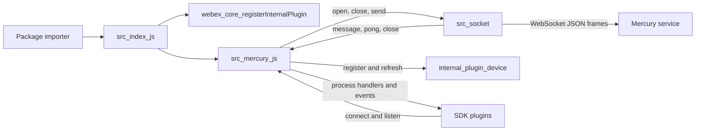
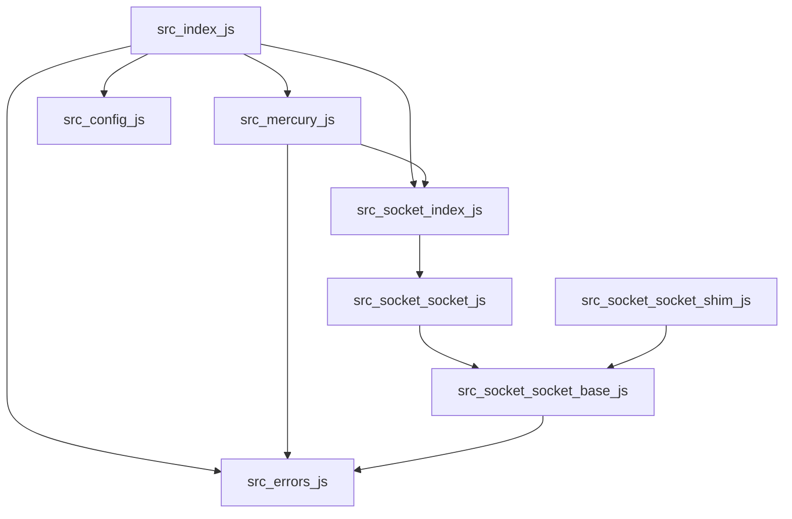
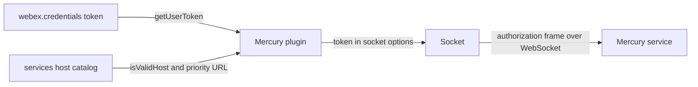

<!-- sdd-generated-metadata
doc_kind: standing-doc
generated_from: architecture@0.3.0
generated_by: claude-cowork
approved_by: akulakum@cisco.com
updated_at: 2026-10-07T00:34:58Z
validation_status: pass-with-warnings
-->

# @webex/internal-plugin-mercury architecture

Canonical architecture for this package. Mercury plugin behavior lives in the
[Mercury plugin specification](../src/docs/README.md) and Socket behavior in the
[Socket specification](../src/socket/docs/README.md). This page owns package boundaries, the plugin
registration, the contract index, and how the package meets the rest of the SDK.

Related context: [specification registry](specs/README.md) ·
[package agent instructions](../AGENTS.md)

## Applicability

| Condition ID                         | Status     | Evidence or reason | Owned section |
| ------------------------------------ | ---------- | ------------------ | ------------- |
| `repo.owns_datastore`                | N/A        | No database, file store, or migration in `src/` | Repository data and schema |
| `repo.holds_client_state`            | Applicable | `Mercury` keeps per-session sockets and connection flags in memory | Client state model |
| `repo.components_interact`           | Applicable | `src/mercury.js` creates and listens to `src/socket` instances | Dependency and interaction topology |
| `repo.domain_data_across_components` | N/A        | No domain record is shared; envelopes are passed through, not owned | Object and data ownership |
| `repo.caches_data`                   | N/A        | No cache. Stored URLs and offsets are connection state. | Caching catalog |
| `repo.observability_convention`      | Applicable | Log prefixes, one client metric, and a call-diagnostics status flag | Observability patterns |
| `repo.deploys_to_infra`              | N/A        | Library published to npm. No service runtime. | Runtime and infrastructure |
| `repo.shared_base_libs`              | Applicable | Inherits `WebexPlugin` and the legacy build, lint, and test stack | Shared and base libraries |
| `repo.is_monorepo`                   | N/A        | This SDD root is one package. The workspace around it is out of scope. | Package map and inter-package dependencies |
| `repo.multi_platform`                | Applicable | `package.json` `browser` swaps the Node `ws` hook for the browser `WebSocket` hook | Platform matrix |
| `repo.published_package`             | Applicable | `package.json` `name` is `@webex/internal-plugin-mercury` and `deploy:npm` publishes it | Release and versioning |
| `repo.embedded_in_host`              | N/A        | No host theme or embed API | Host integration and theming |
| `repo.exposes_commands_or_artifacts` | Applicable | `build:src` writes `dist/` | Commands and generated artifacts |
| `repo.cross_repo_deps_material`      | Applicable | Behavior depends on sibling workspace plugins and on subclasses in sibling packages | Cross-repository topology |
| `repo.security_arch_warranted`       | Applicable | The access token crosses to the Mercury service in the authorization frame | Security architecture |

## Design overview

`@webex/internal-plugin-mercury` is a published library with two modules. Importing it registers
`Mercury` as the internal plugin `mercury`, so every webex instance has `webex.internal.mercury`.
SDK plugins call `connect()` and then listen for `event:<namespace>` or `event:<eventType>`, or
implement `process<Name>Event` and receive envelopes directly.

`src/mercury.js` owns sessions, retries, failure classification, close-code policy, envelope routing,
and shutdown switchover. `src/socket/` owns one WebSocket connection and its frames. The split keeps
platform and protocol details out of the session logic, and lets the browser build replace only the
WebSocket constructor.

The package opens outbound WebSocket connections only. It serves no routes and persists nothing.

## Resource inventory and responsibilities

| Resource | Kind | Responsibility | Owner | Source | Detailed specification |
| -------- | ---- | -------------- | ----- | ------ | ---------------------- |
| Mercury plugin | module | Sessions, reconnect policy, routing, switchover | @webex/web-client, @webex/web-sdk | `src/` | `src/docs/README.md` |
| Socket | module | One WebSocket connection, handshake, keepalive, frames | @webex/web-client, @webex/web-sdk | `src/socket/` | `src/socket/docs/README.md` |
| Published package | package | npm entry points and the registration side effect | @webex/web-client, @webex/web-sdk | `package.json` | `docs/architecture.md` |

## Interaction and execution flows

| From | To | Interaction or transport | Purpose | Failure or compatibility behavior |
| ---- | -- | ------------------------ | ------- | --------------------------------- |
| Importer | `src/index.js` | package import | Register the plugin | Without the import, `webex.internal.mercury` is absent |
| SDK plugins | `webex.internal.mercury` | method calls and event listeners | Connect and receive envelopes | See the Mercury plugin spec failure modes |
| `src/mercury.js` | device plugin | in-process calls | Default URL, registration, refresh | Registration failure rejects `connect()` |
| `src/mercury.js` | `src/socket` | in-process promises and events | One connection per attempt | Open errors are classified by Mercury |
| `src/socket` | Mercury service | WebSocket JSON text frames | Authorization, keepalive, events | Close codes drive reconnect |
| `src/mercury.js` | SDK plugins | autowired calls and events | Deliver envelopes | Handler errors are logged, not rethrown |

## Dependency topology

| Dependency | Type | Used by | Purpose | Version, failure, or fallback policy |
| ---------- | ---- | ------- | ------- | ------------------------------------ |
| `@webex/webex-core` | Internal | `src` | Plugin base, registration, credentials, services | Workspace version |
| `@webex/internal-plugin-device` | Internal | `src` | WebSocket URL and device lifecycle | Imported for its side effect in `src/index.js` |
| `@webex/internal-plugin-feature` | Internal | `src` | Feature toggles | Imported for its side effect |
| `@webex/internal-plugin-metrics` | Internal | `src` | Client metric and connected status | Imported for its side effect |
| `@webex/common` | Internal | `src`, `src/socket` | `Exception`, `checkRequired`, `deprecated` | Workspace version |
| `@webex/common-timers` | Internal | `src/socket` | `safeSetTimeout` | Workspace version |
| `backoff` | External | `src` | Retry scheduling | Range in `package.json` |
| `ws` | External | `src/socket` (Node) | Node WebSocket | Replaced by the browser hook in browser builds |
| `uuid` | External | `src/socket` | Frame ids | Range in `package.json` |
| `lodash` | External | `src`, `src/socket` | Utilities | Range in `package.json` |

Ordering constraint: the device, feature, and metrics plugins must be registered before Mercury
connects, which `src/index.js` guarantees by importing them first. No dependency cycle exists inside
the package.

## Public and consumer surfaces

| Surface | Type | Owner | Consumers | Compatibility policy | Source |
| ------- | ---- | ----- | --------- | -------------------- | ------ |
| `mercury-sdk` (published) | SDK | Mercury plugin | webex, plugin-meetings, internal-plugin-llm, internal-plugin-board, and other workspace packages | Internal plugin; README says semver is not strictly followed | `package.json` |
| `mercury-plugin-events` (published) | Event | Mercury plugin | SDK plugins listening on `webex.internal.mercury` | Adding is compatible; renaming is breaking | `src/mercury.js` |
| `mercury-socket-transport` (internal) | SDK | Socket | Mercury plugin | Changes with both module specs | `src/socket/socket-base.js` |
| `mercury-wire-protocol` (internal) | RPC | Socket | Mercury service | Must match the service frame shapes | `src/socket/socket-base.js` |
| `webex-core-plugin-host` (required) | RPC | sibling package webex-core | Mercury plugin | External | `@webex/webex-core` |
| `webex-device-registration` (required) | SDK | sibling package internal-plugin-device | Mercury plugin | External | `@webex/internal-plugin-device` |
| `webex-feature-toggles` (required) | SDK | sibling package internal-plugin-feature | Mercury plugin | External | `@webex/internal-plugin-feature` |
| `webex-metrics` (required) | SDK | sibling package internal-plugin-metrics | Mercury plugin | External | `@webex/internal-plugin-metrics` |
| `webex-common-sdk` (required) | SDK | sibling package common | Both modules | Specified in packages/@webex/common/src/docs/README.md | `@webex/common` |
| `webex-common-timers` (required) | SDK | sibling package common-timers | Socket | Specified in packages/@webex/common-timers/src/docs/README.md | `@webex/common-timers` |
| `backoff`, `lodash`, `uuid`, `ws` (required) | SDK | npm | Modules listed above | Ranges in `package.json` | npm |

`mercury-sdk` entry points: `main` `dist/index.js`, `devMain` `src/index.js`, and the `browser`
override for the socket hook. No HTTP surface exists, so `api-specs/openapi.yaml` is omitted.

## Client state model

| State or slice | Owner | Transition triggers | Persistence or reset boundary |
| -------------- | ----- | ------------------- | ----------------------------- |
| Session sockets and connection flags | Mercury plugin | connect, close, disconnect, switchover | In memory per webex instance; cleared by `disconnectAll()` |
| Per-connection timers and sequence number | Socket | open, ping, pong, close | In memory per `Socket`; timers cleared on close |

Slice detail is in each module spec.

## Cross-cutting architecture

### Security

- Trust boundaries and identity flow: see Security architecture.
- Sensitive surfaces and data classes: access tokens and envelope content; controls and gaps are in
  Security architecture.
- Encryption and secret boundaries: transport encryption is whatever scheme the device-supplied URL
  uses; this package stores no secrets.

### Observability and operations

- Logging and correlation: conventions are under Observability patterns.
- Metrics, traces, and audit signals: listed under Observability patterns.
- Ownership and operational entry points: no runtime to deploy or monitor; owners are listed in
  References and maintenance.

### Quality attributes

- Availability: sessions reconnect by close code with exponential backoff, and shutdown switchover
  keeps a session online while the server drains a node.
- Compatibility: event names, the session suffix rule, and subclass-visible methods are relied on by
  other packages.
- Platform parity: one `Socket` class serves Node and browsers through the constructor hook.

## Dependency and interaction topology

| From | To | Kind | Purpose | Ordering or failure boundary |
| ---- | -- | ---- | ------- | ---------------------------- |
| `src/mercury.js` | `src/socket/index.js` | Import | Create sockets | Browser builds resolve `socket.js` to `socket.shim.js` |
| `src/socket/socket-base.js` | `src/errors.js` | Import | Raise mapped errors | Error classes are owned by the parent module |
| `src/socket` | `src/mercury.js` | Event | `close`, `message`, `pong`, `sequence-mismatch`, `ping-pong-latency` | Listeners attached before open |
| `src/config.js` | `src/mercury.js` | Call | Reaches the plugin as `this.config` through registration | Not imported by `src/mercury.js` |

## Observability patterns

| Signal | Convention or required fields | Propagation or naming rule | Primary evidence |
| ------ | ----------------------------- | -------------------------- | ---------------- |
| Logs | `Mercury:` prefix with the session id in `src/mercury.js`; `socket,<host>:` prefix in `src/socket/socket-base.js` | Through `webex.logger`; envelope bodies are logged only when `ENABLE_MERCURY_LOGGING` is set | `src/mercury.js`, `src/socket/socket-base.js` |
| Metrics | Client metric `JS_SDK_MERCURY_CLOSE_4000` on 4000 closes; `setMercuryConnectedStatus(true)` after a normal connect when the default session is connected, and `(false)` when an active-socket close leaves the default session not connected | Field and tag names are defined in the Mercury plugin spec | `src/mercury.js` |
| Traces | N/A — no spans; `trackingId` `<webex.sessionId>_<ms>` is sent in the authorization frame for server correlation | — | `src/mercury.js` |
| Audit | N/A — no audited actions | — | `src/mercury.js` |

## Shared and base libraries

| Library | Inherited responsibility | Consumers | Version floor | Compatibility rule |
| ------- | ------------------------ | --------- | ------------- | ------------------ |
| `WebexPlugin` from `@webex/webex-core` | Ampersand session state, `this.config` bound to `config.mercury`, `this.logger`, `trigger`, `on` | `src/mercury.js` | workspace | Follow webex-core plugin conventions |
| `@webex/babel-config-legacy`, `@webex/eslint-config-legacy`, `@webex/jest-config-legacy` | Build, lint, and Jest config passthroughs | `babel.config.js`, `.eslintrc.js`, `jest.config.js` | workspace | Change upstream, not in the passthrough files |
| `@webex/legacy-tools` | `webex-legacy-tools` build and test runners | `package.json` scripts | workspace | Scripts call it; do not replace locally |

## Platform matrix

| Platform | Shared versus platform-specific boundary | Entry or build | Support and compatibility constraints |
| -------- | ---------------------------------------- | -------------- | ------------------------------------- |
| Node | `src/socket/socket.js` returns `ws` | `src/socket/socket.js` | `engines.node` `>=18`; constructor options such as `agent` apply |
| Browser | `src/socket/socket.shim.js` returns the global `WebSocket` or `MozWebSocket` | `package.json` `browser` field | Constructor options are ignored; close codes may be dropped and are fixed from reasons |

Everything else in `src/` is shared.

## Release and versioning

| Artifact | Publish target | Versioning rule | Deprecation window | Changelog or migration obligation |
| -------- | -------------- | --------------- | ------------------ | --------------------------------- |
| `@webex/internal-plugin-mercury` | npm, through the `deploy:npm` script, which wraps Yarn's npm publish | Workspace release tooling; README says the internal plugin does not strictly follow semver | `listen()` and `stopListening()` are deprecated with no removal date in code | No package-local changelog; workspace tooling owns it |

## Commands and generated artifacts

| Command or artifact | Owner | Inputs | Output or side effect | Compatibility boundary |
| ------------------- | ----- | ------ | --------------------- | ---------------------- |
| `yarn install` | workspace | root `package.json` and lockfile | workspace `node_modules` | Run from the workspace root |
| `yarn workspace @webex/internal-plugin-mercury build` | package | `src/` | `dist/` through `build:src` | `dist/` is never edited by hand |
| `yarn workspace @webex/internal-plugin-mercury build:src` | package | `src/` (`.js` and `.ts`) | `dist/` with source maps | Markdown under `src/` is not processed |
| `yarn workspace @webex/internal-plugin-mercury test:unit` | package | `test/unit/spec/` | mocha result | — |
| `yarn workspace @webex/internal-plugin-mercury test:browser` | package | `test/unit/spec/`, `test/integration/spec/` | karma result | Needs a browser and test users |
| `yarn workspace @webex/internal-plugin-mercury test:style` | package | files under `src/` | eslint result | Markdown is reported as ignored |
| `yarn workspace @webex/internal-plugin-mercury deploy:npm` | package | `dist/`, `package.json` | npm publish | Release pipeline only |

## Cross-repository topology

| Repository or external system | Relationship | Exchanged contract or artifact | Owner | Sequencing constraint |
| ----------------------------- | ------------ | ------------------------------ | ----- | --------------------- |
| Sibling package webex-core | Consumes | `webex-core-plugin-host` | @webex/web-client, @webex/web-sdk | Plugin host must exist before registration |
| Sibling package internal-plugin-device | Consumes | `webex-device-registration` | @webex/web-client, @webex/web-sdk | Device registration precedes the first attempt |
| Sibling package internal-plugin-feature | Consumes | `webex-feature-toggles` | @webex/web-sdk (CODEOWNERS default rule) | Toggles read on each attempt |
| Sibling package internal-plugin-metrics | Consumes | `webex-metrics` | @webex/web-client, @webex/web-sdk | None |
| Sibling package internal-plugin-llm | Provides | `mercury-sdk` (`LLMChannel` subclass) | @webex/web-client, @webex/web-sdk | Method changes ship with LLM changes |
| Sibling package internal-plugin-board | Provides | `mercury-sdk` (`RealtimeChannel` subclass) | @webex/web-sdk (CODEOWNERS default rule) | Method changes ship with board changes |
| Mercury service | Coordinates | `mercury-wire-protocol` | External Webex service; owner not recorded in this repository | Frame shapes and close codes must match the service |

These are sibling workspace packages and an external service outside this package-scoped SDD root.

## Security architecture

Threats addressed: access-token exposure, and, under `web-high-availability`, connections to hosts outside the service catalog.

Controls in this package:

- The token is sent over the network only in the authorization frame, never in the URL query
  (`src/socket/socket-base.js`).
- Catalog-host validation of the connection URL, applied only when `web-high-availability` is on and
  the priority-host conversion yields no URL (`src/mercury.js`; Mercury plugin spec `MOD-003`).
  Without that toggle the device-supplied URL is used as given.
- Authorization failures refresh the token or stop retries, per the Mercury plugin spec Caller-visible
  failure modes.

Known gaps are recorded where the code lives: token handling inside `Socket` in the Socket spec
Pitfalls, and option overrides and envelope logging in the Mercury plugin spec (`MOD-004` and
Pitfalls).

The workspace root `SECURITY.md` is the security policy; this package adds none.

## Domain language

| Term | Repository-specific meaning | Authoritative source |
| ---- | --------------------------- | -------------------- |
| Mercury | The Webex real-time event service reached over WebSocket | `src/mercury.js` |
| Session | One logical connection keyed by session id; default `mercury-default-session` | `src/mercury.js` |
| Envelope | The parsed JSON frame `{data: …}` delivered by Socket | `src/socket/socket-base.js` |
| Autowired handler | `process<Name>Event` on `webex[ns]` or `webex.internal[ns]`, called for event type `<ns>.<name>` | `src/mercury.js` |
| Active socket | The socket currently stored for a session; only it emits `offline` and reconnects on close | `src/mercury.js` |
| Switchover | Make-before-break replacement after a `shutdown` envelope | `src/mercury.js` |
| Buffer state | The `mercury.buffer_state` or `mercury.registration_status` message that completes authorization | `src/socket/socket-base.js` |

## References and maintenance

- Decisions: [adr/](adr/), including [ADR 0001](adr/0001-retain-product-readme.md)
- Instantiated specifications and routing: [specs/README.md](specs/README.md)
- Module specs: `src/docs/README.md`, `src/socket/docs/README.md`
- Owner: `@webex/web-client @webex/web-sdk` in the monorepo `.github/CODEOWNERS`
- Manifest: `.sdd/manifest.json`
- Update this document in the same change that alters package boundaries, contracts, or
  cross-cutting behavior.
