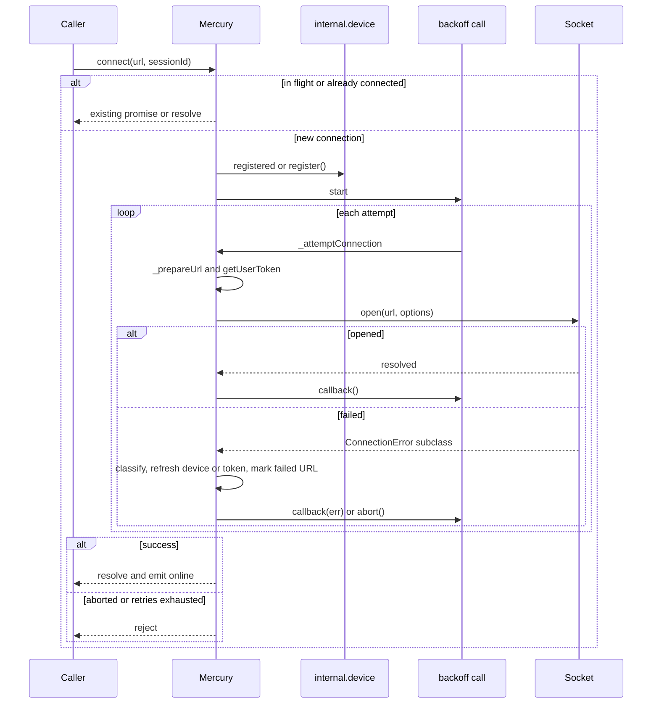
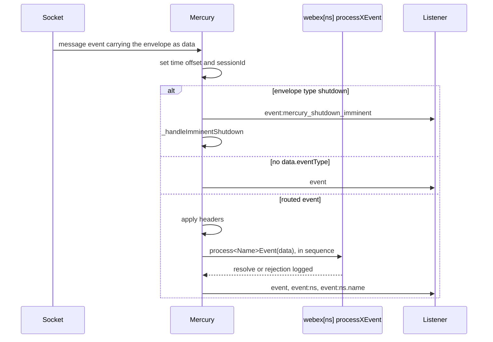
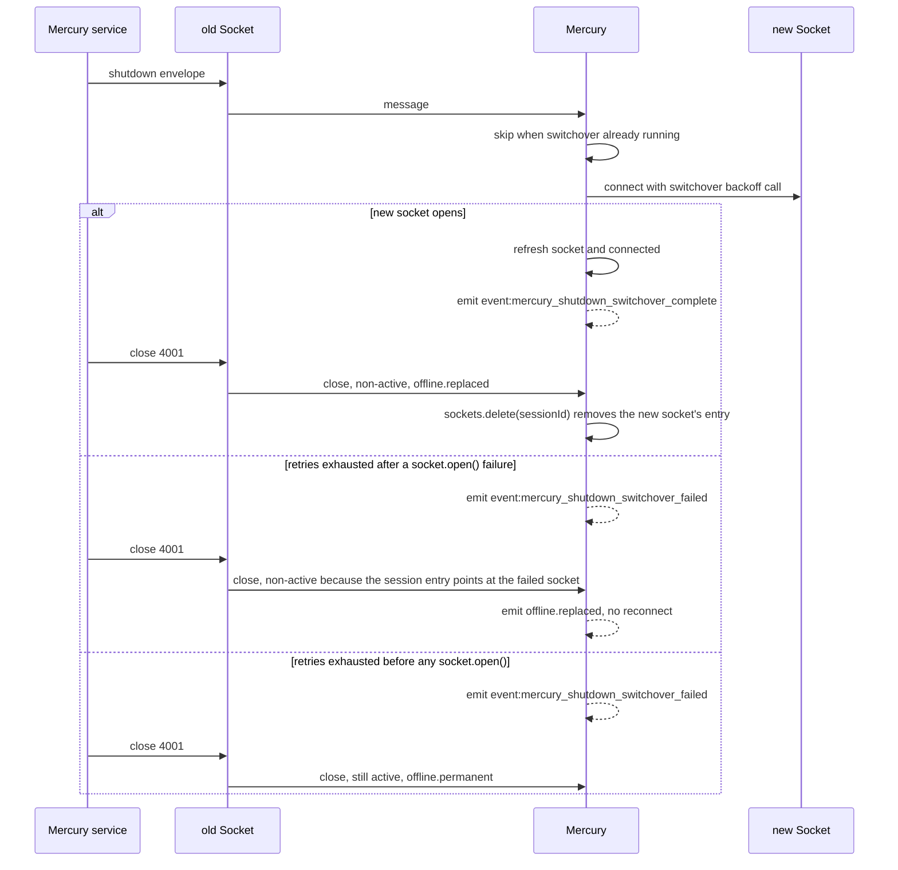
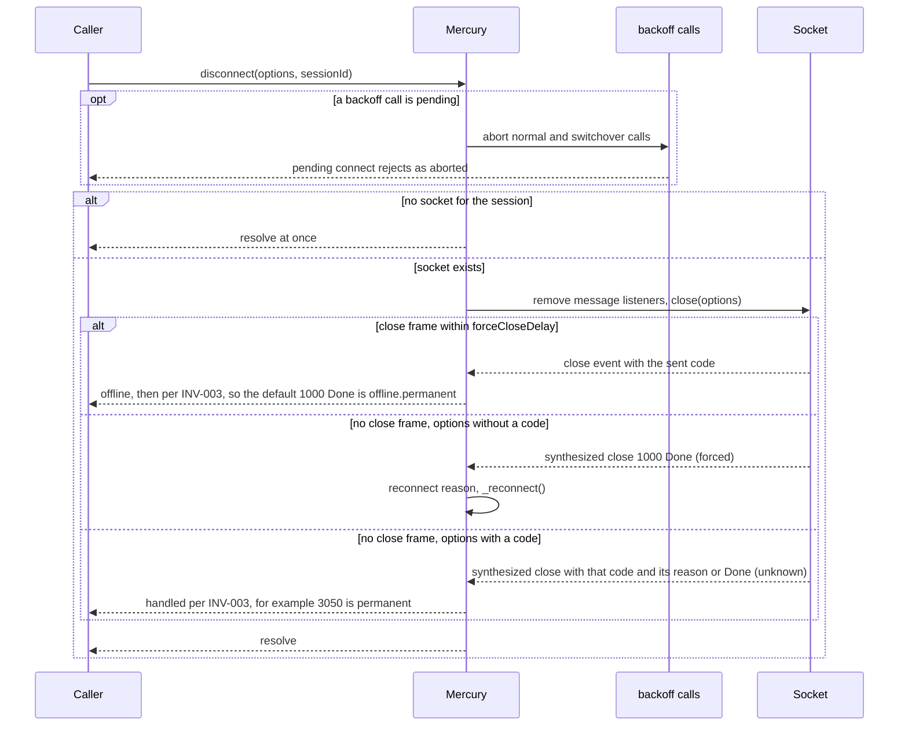
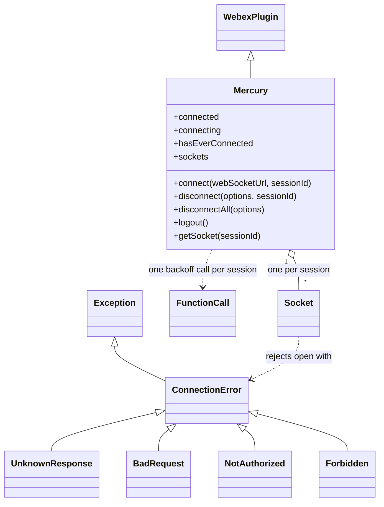
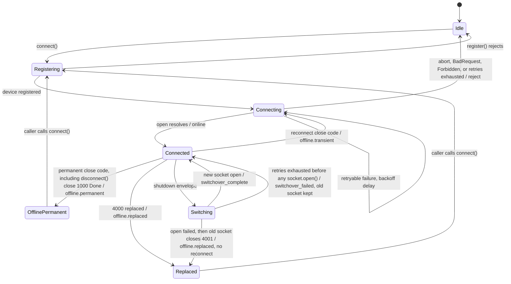

<!-- sdd-generated-metadata
doc_kind: module-spec
generated_from: module-spec@0.3.0
generated_by: claude-cowork
approved_by: akulakum@cisco.com
updated_at: 2026-10-07T00:34:58Z
validation_status: pass-with-warnings
-->

# Mercury plugin

This source-local document at `src/docs/README.md` owns the stable specification for **the Mercury
plugin**: the `webex.internal.mercury` connection manager. Ground every claim in package evidence and
link to the [package architecture](../../docs/architecture.md) instead of repeating broader facts. No
service specification exists because this package is a library.

Related context: [documentation index](../../docs/index.md) ·
[package agent instructions](../../AGENTS.md) ·
[Socket sub-module specification](../socket/docs/README.md)

## Metadata

| Field             | Value |
| ----------------- | ----- |
| Owner             | @webex/web-client, @webex/web-sdk |
| Source path       | `src` |
| Resource kind     | package |
| Status            | Draft |
| Last verified     | 2026-10-06 at `d2e34dabee` |
| Module id         | `internal-plugin-mercury` |
| Parent spec       | — |
| Doc kind          | Module spec |
| Coverage score    | 93.3% assessed 2026-10-06 — 14 of 15 mandatory fields PRESENT, critical 8 of 8; test strategy is WEAK because the forced-close reconnect after disconnect, the real switchover socket bookkeeping, the accessors, the session suffix `INV-001`, the `sockets` deletion by a non-active close, `INV-004`, and `INV-005` are untested and no characterization baseline exists |
| Validation status | pass-with-warnings; 2026-10-07; validator runtime: current-session |

## Applicability

| Condition ID                         | Status     | Evidence or reason | Owned section |
| ------------------------------------ | ---------- | ------------------ | ------------- |
| `module.has_tiers`                   | N/A        | No tier policy exists in this package or its `package.json` | Tier |
| `module.has_ui`                      | N/A        | No view or screen. The module manages sockets and emits events. | UI use-case flow |
| `module.crosses_service_boundaries`  | Applicable | Opens WebSocket connections to the Mercury service and calls device, credentials, services, and metrics plugins from `src/mercury.js` | Cross-boundary use-case flow |
| `module.holds_client_state`          | Applicable | `connected`, `connecting`, `hasEverConnected`, `sockets`, `sessionWebSocketUrls`, `backoffCalls`, and `mercuryTimeOffset` are session properties in `src/mercury.js` | Client state model |
| `module.enforces_domain_rules`       | Applicable | Close-code reconnect policy, reconnect reasons, and retry limits in `src/mercury.js` | Business rules and invariants |
| `module.is_concurrent_async`         | Applicable | Promise-based connect with backoff timers, per-session in-flight deduplication, and event-driven message handling | Concurrency and reactive flow |
| `module.owns_persistence`            | N/A        | Nothing is written to storage. All state is in memory. | Data, schema, and migration discipline |
| `module.stateful_transitions`        | Applicable | Each session moves between connecting, connected, reconnecting, and offline states driven by close codes | State machine |
| `module.exposes_wire_protocol`       | Applicable | The connection URL query parameters and the inbound envelope fields read in `src/mercury.js` | Protocol and wire format |
| `module.ui_multi_screen`             | N/A        | No UI | UI flow |
| `module.large_data_model`            | N/A        | No entity model. Config has eight keys and envelopes are routed, not modelled. | Data model |
| `module.returns_caller_errors`       | Applicable | `connect()` rejects, `lastError` records the failure, and `src/errors.js` exports error classes | Caller-visible failure modes |
| `module.module_specific_conventions` | Applicable | `:<sessionId>` event suffix, `process<Name>Event` autowiring, and the `Mercury:` log prefix | Module-specific rules |
| `module.published_package`           | Applicable | `package.json` names the package @webex/internal-plugin-mercury and `deploy:npm` publishes it | Export stability |
| `module.embedded_in_host`            | N/A        | No host theme or embed API | Host integration and theming |
| `module.has_design_tradeoff`         | Applicable | Make-before-break shutdown switchover, unlimited default retries, and metric suppression for close code 1006 | Key design trade-off |
| `module.has_submodules`              | Applicable | Computed true by the Repo Annotation module_tree.py script: `src/socket` is a child module | Sub-modules |

## Evidence register

| Evidence | What it establishes |
| -------- | ------------------- |
| `src/index.js` | Internal plugin registration, the `onBeforeLogout` hook, side-effect plugin imports, and the public exports |
| `src/mercury.js` | Sessions, connect and retry, URL preparation, failure handling, close-code policy, envelope routing, shutdown switchover, metrics, and accessors |
| `src/config.js` | Default `mercury` config values and their environment-variable overrides |
| `src/errors.js` | `ConnectionError` and its four subclasses |
| `package.json` | Name, entry points, `browser` field, dependencies, and scripts |
| `test/unit/spec/mercury.js` | Unit cases for connect, retries, failure classes, URL preparation, proxy agent options, logout, disconnect, shutdown switchover, close handling, and time offset |
| `test/unit/spec/mercury-events.js` | Unit cases for `online`, `offline`, buffer-state, close-code actions, message routing, and sequence mismatch |
| `test/integration/spec/mercury.js` | Integration connect cases against the real service with a provisioned test user |
| `test/integration/spec/sharable-mercury.js` | Integration connect case with the shared-socket path |
| `test/integration/spec/webex.js` | Integration case for the `onBeforeLogout` hook |
| Sibling package webex-core, file src/lib/webex-plugin.js | `WebexPlugin` base used by `Mercury` |
| Sibling package internal-plugin-llm, file src/llm.ts | Subclass of `Mercury` that calls `connect`, `getSocket`, and `disconnect` with a session id |
| Sibling package internal-plugin-board, file src/realtime-channel.js | `Mercury.extend` subclass that overrides `socket` |
| Sibling package common, SDD module spec src/docs/README.md | Specification of `Exception`, `checkRequired`, and `deprecated` |
| Product README | Retained product documentation, not the behavioral authority. See ADR 0001. |

## Purpose and boundary

- Responsibility: keep the client's Mercury WebSocket connections open for the lifetime of a
  `webex` instance, and turn every inbound Mercury envelope into plugin handler calls and events.
- In scope: the `Mercury` plugin, its session map, connect and reconnect policy, URL preparation,
  failure classification, envelope routing, shutdown switchover, the `JS_SDK_MERCURY_CLOSE_4000`
  metric, `src/config.js`, `src/errors.js`, and the registration side effect in `src/index.js`.
- Out of scope: the frame-level protocol, authorization handshake, ping/pong keepalive, acks, and
  platform WebSocket selection (owned by the child module `src/socket`); device registration,
  credentials, host catalog, feature toggles, and metric transport (owned by sibling plugins).
- Consumers: SDK plugins that listen on `webex.internal.mercury` events, the subclasses `LLMChannel`
  in internal-plugin-llm and `RealtimeChannel` in internal-plugin-board, and the 22 workspace packages
  whose `package.json` lists this package.

## Structure and key files

| Path | Responsibility |
| ---- | -------------- |
| `src/index.js` | Imports device, feature, and metrics plugins for their side effects, calls `registerInternalPlugin('mercury', Mercury, {config, onBeforeLogout})`, and re-exports the public bindings |
| `src/mercury.js` | `Mercury` plugin definition: session state, public methods, and private connection, routing, and close handlers |
| `src/config.js` | Default `mercury` config merged at registration |
| `src/errors.js` | `ConnectionError` (extends `Exception`) and `UnknownResponse`, `BadRequest`, `NotAuthorized`, `Forbidden`; a commented-out `NotFound` |
| `src/socket/` | Child module. See Sub-modules. |
| `test/unit/spec/mercury.js` | Main unit spec |
| `test/unit/spec/mercury-events.js` | Event and close-code unit spec |
| `test/unit/lib/promise-tick.js` | Test helper that yields a number of microtask ticks |
| `test/integration/spec/` | Integration specs, run only through `test:browser` (see Verification) |

## Sub-modules

| Sub-module | Responsibility | Specification |
| ---------- | -------------- | ------------- |
| `src/socket` | One WebSocket connection: open with required options, authorize, ping/pong keepalive, ack, sequence tracking, close-code fixes and mapping, and Node or browser constructor selection | [`src/socket/docs/README.md`](../socket/docs/README.md) |

This module creates one `Socket` per connection attempt and depends on its `mercury-socket-transport`
contract. Socket internals are specified only in the child document.

## Public surface

Declarations live in `src/index.js` and `src/mercury.js`. This section summarises them and does not
restate signatures.

| Surface | Consumer | Compatibility commitment | Source |
| ------- | -------- | ------------------------ | ------ |
| Registration side effect | Every importer | Importing the package installs `webex.internal.mercury` and runs `logout()` before webex logout (`MOD-001`) | `src/index.js` |
| `connect(webSocketUrl, sessionId)` | SDK plugins, `LLMChannel` | Both arguments optional. Resolves when the session is online. See `MOD-002` to `MOD-007`. | `src/mercury.js` |
| `disconnect(options, sessionId)`, `disconnectAll(options)` | SDK plugins, `LLMChannel` | Close one session or every session (`MOD-011`) | `src/mercury.js` |
| `logout()` | `onBeforeLogout` hook | Closes every session so none reconnects (`MOD-012`) | `src/mercury.js` |
| `listen()`, `stopListening()` | Legacy callers | Deprecated aliases of `connect()` and `disconnect()` (`MOD-016`) | `src/mercury.js` |
| `getSockets()`, `getSocket(sessionId)`, `hasConnectedSockets(sessionId)`, `hasConnectingSockets(sessionId)`, `getLastError()` | `LLMChannel`, callers inspecting state | Read-only accessors (`MOD-017`) | `src/mercury.js` |
| `processRegistrationStatusEvent(message)` | Autowired from `mercury.registration_status` | Stores `localClusterServiceUrls` (`MOD-010`) | `src/mercury.js` |
| Properties `connected`, `connecting`, `listening`, `hasEverConnected`, `socket`, `mercuryTimeOffset`, `localClusterServiceUrls` | SDK plugins | See Client state model | `src/mercury.js` |
| Events on `webex.internal.mercury` | SDK plugins | Contract `mercury-plugin-events`; naming rule `INV-001` | `src/mercury.js` |
| `config.mercury` keys | SDK integrators | Defaults in `INV-005`; `maxRetries` and `initialConnectionMaxRetries` have no default | `src/config.js` |
| `webex.config.defaultMercuryOptions` | Node integrators behind a proxy | Spread over the socket options (`MOD-004`) | `src/mercury.js` |
| `BadRequest`, `ConnectionError`, `Forbidden`, `NotAuthorized`, `UnknownResponse` | Callers inspecting `lastError` | Class identity is the contract | `src/errors.js` |

Contract `mercury-sdk` is published with native artifact `package.json`. Contract
`mercury-plugin-events` is published with source `src/mercury.js`. Required contracts:
`mercury-socket-transport`, `webex-core-plugin-host`, `webex-device-registration`,
`webex-feature-toggles`, `webex-metrics`, `webex-common-sdk`, `backoff`, and `lodash`.

## Dependencies

| Dependency | Why it is required | Failure behavior |
| ---------- | ------------------ | ---------------- |
| `src/socket` (`mercury-socket-transport`) | One `Socket` per attempt | Open failures arrive as `ConnectionError` subclasses and are classified per Caller-visible failure modes |
| `@webex/webex-core` (`webex-core-plugin-host`) | `WebexPlugin`, `registerInternalPlugin`, `webex.credentials`, `webex.internal.services` | Services methods are guarded with `typeof … === 'function'` only for the cluster and cache-invalidation handlers |
| `@webex/internal-plugin-device` | Default WebSocket URL, `register()`, `refresh()` | A failed `register()` rejects `connect()` before any socket is created |
| `@webex/internal-plugin-feature` | `getFeature` for `web-high-availability` and `web-shared-mercury`; `updateFeature` | A rejected `getFeature` rejects URL preparation and counts as a failed attempt |
| `@webex/internal-plugin-metrics` | `submitClientMetrics` and `newMetrics.callDiagnosticMetrics.setMercuryConnectedStatus` | `submitClientMetrics` errors are caught and logged; `setMercuryConnectedStatus` is not guarded |
| `@webex/common` | `deprecated` decorator; `Exception` base for errors, as specified in packages/@webex/common/src/docs/README.md | Load-time only; no runtime failure path |
| `backoff` | Exponential retry scheduling, `failAfter`, `abort` | See `MOD-005` |
| `lodash` | `camelCase` for handler names, `get` for config reads, `set` for header overrides | — |
| `@webex/test-helper-*` packages | Listed under `dependencies` and `devDependencies` but imported only by `test/` | — |

## Requirements

| ID | WHAT | WHY | Source evidence | Test or example evidence | Assumptions or gaps | Confidence |
| -- | ---- | --- | --------------- | ------------------------ | ------------------- | ---------- |
| `MOD-001` | Importing the package registers `Mercury` as internal plugin `mercury` with `src/config.js`, and its `onBeforeLogout` hook returns `this.logout()`. | Every webex instance gets one connection manager, and logout closes its sockets first. | `src/index.js` | `test/integration/spec/webex.js` `onBeforeLogout()` | No unit test; the integration case needs a test user | Present |
| `MOD-002` | `connect()` returns the in-flight promise for a session that is already connecting, resolves at once when the session socket is `connected` or `connecting`, and otherwise registers the device when `device.registered` is falsy before starting a backoff call. | Repeated callers must not open duplicate sockets for one session. | `src/mercury.js` | `test/unit/spec/mercury.js` `lazily registers the device`, `resolves immediately`, `can safely be called multiple times`, `when there is a connection attempt inflight` | — | Present |
| `MOD-003` | Each attempt prepares the URL from the argument or `device.webSocketUrl`. With `web-high-availability` the URL is converted to a priority host; if that fails and the host is not a valid catalog host, the prepared URL is empty. The query is then rewritten as listed under Protocol and wire format. | The service needs text frames and buffer-state or registration-status signals, and HA must stay on catalog hosts. | `src/mercury.js` | `test/unit/spec/mercury.js` `#_prepareUrl()` cases | An empty URL is passed to `Socket#open`, which rejects with `` `url` is required `` | Present |
| `MOD-004` | Socket options are `forceCloseDelay`, `pingInterval`, and `pongTimeout` from config, `token` from `credentials.getUserToken()`, `trackingId` `<webex.sessionId>_<Date.now()>`, and `logger`. `webex.config.defaultMercuryOptions`, when set, is spread over them. | Node integrators pass a proxy `agent`; the socket needs a token and timers. | `src/mercury.js` | `test/unit/spec/mercury.js` `Websocket proxy agent`, `should merge custom mercury options when provided` | The spread is applied last, so it can also replace `token`, `logger`, and the timer options | Present |
| `MOD-005` | Retries use an exponential strategy from `backoffTimeReset` to `backoffTimeMax`. Before the first successful connect, `initialConnectionMaxRetries` limits retries; afterwards `maxRetries` does. Unset limits mean unlimited retries. Switchover calls never use `initialConnectionMaxRetries`. | Clients keep trying through outages unless the integrator caps it. | `src/mercury.js` | `test/unit/spec/mercury.js` `backs off exponentially`, `` when `maxRetries` is set ``, `` fails after `initialConnectionMaxRetries` attempts `` | The `initialConnectionMaxRetries` cases are skipped in the browser run | Present |
| `MOD-006` | A failed attempt records `lastError` and is classified as listed under Caller-visible failure modes before the backoff callback runs. | Auth and URL failures need a refresh before the retry, and unrecoverable failures must stop retrying. | `src/mercury.js` | `test/unit/spec/mercury.js` `` with `BadRequest` ``, `` with `UnknownResponse` ``, `` with `NotAuthorized` ``, `` with `Forbidden` ``, `when web-high-availability feature is enabled`, `sets lastError when retrying` | — | Present |
| `MOD-007` | On success the session socket is marked connected, `connecting` and `connected` are recomputed, `hasEverConnected` becomes true, `online` is emitted with the session suffix, `setMercuryConnectedStatus(true)` is called when `connected`, and with `web-high-availability` the device is refreshed. | Listeners and call diagnostics depend on the online signal. | `src/mercury.js` | `test/unit/spec/mercury-events.js` `when connected`, `when reconnected` | Device refresh after HA connect has no direct test | Present |
| `MOD-008` | A socket `close` is handled by the close-code policy `INV-003` and the state machine below. Only the active socket of a session emits `offline` and reconnects. Every close, active or not, deletes the session's entry from `sockets` (see Pitfalls). | A replaced or old socket closing must not take a healthy session offline. | `src/mercury.js` | `test/unit/spec/mercury-events.js` `when a CloseEvent is received`; `test/unit/spec/mercury.js` `#_onclose() with code 4000`, `#_onclose() with code 4001 (shutdown replacement)` | — | Present |
| `MOD-009` | Each inbound envelope gets `sessionId`, has `data.headers` applied over `data` by key path, is passed to every autowired handler in sequence, and is then emitted as `event`, `event:<namespace>`, and, when the event type has a dot, `event:<eventType>`. An envelope without `data.eventType` is emitted only as `event`. | Plugins receive events either by handler name or by listening. | `src/mercury.js` | `test/unit/spec/mercury-events.js` `when a MessageEvent is received`; `test/unit/spec/mercury.js` `#_applyOverrides()`, `#_getEventHandlers()`, `#_onmessage() with missing data or eventType` | — | Present |
| `MOD-010` | The plugin subscribes to its own events: `featureToggle_update` calls `feature.updateFeature`, `ActiveClusterStatusEvent` calls `services.switchActiveClusterIds(activeClusters)`, and `u2c.cache-invalidation` calls `services.invalidateCache(timestamp)`. `mercury.registration_status` reaches `processRegistrationStatusEvent` by autowiring and stores `localClusterServiceUrls`. | Server-pushed toggles, cluster migrations, and catalog invalidations take effect without polling. | `src/mercury.js` | `test/unit/spec/mercury.js` `#connect()` cases for featureToggle_update, ActiveClusterStatusEvent, and u2c.cache-invalidation | No test for `processRegistrationStatusEvent` | Present |
| `MOD-011` | `disconnect()` aborts the session's backoff and switchover calls, drops its in-flight connect promise, removes the socket's `message` listeners, marks it not connecting or connected, and resolves with the socket's `close(options)` result. `disconnectAll()` disconnects every session, then clears `sockets`, `sessionWebSocketUrls`, `backoffCalls`, and connect promises and sets `connected` false. | Callers can stop one session or all of them, including mid-connect. | `src/mercury.js` | `test/unit/spec/mercury.js` `#disconnect()`, `stops the attempt when disconnect called`, `#disconnectAll()`, `#disconnect() with shutdown switchover in progress` | — | Present |
| `MOD-012` | `logout()` calls `disconnectAll({code: 3050, reason})` when `beforeLogoutOptionsCloseReason` is set and is not a normal reconnect reason (`INV-002`), otherwise `disconnectAll()` with no options. | Logout must close sockets with a reason that prevents reconnect. | `src/mercury.js` | `test/unit/spec/mercury.js` `#logout()` cases | See Pitfalls for the forced-close path | Present |
| `MOD-013` | An envelope with `type: 'shutdown'` emits `event:mercury_shutdown_imminent` and starts one switchover per session: a new socket is connected with its own backoff call while the old one stays open, success emits `event:mercury_shutdown_switchover_complete` with `{url}`, and exhausted retries emit `event:mercury_shutdown_switchover_failed` with `{reason}`. | The server can drain a node without the client going offline. | `src/mercury.js` | `test/unit/spec/mercury.js` `shutdown protocol`, `shutdown switchover with retry logic`, `#_attemptConnection() with shutdown switchover`, `#_connectWithBackoff() with shutdown switchover` | Several cases stub `_prepareAndOpenSocket`; see Pitfalls | Weak |
| `MOD-014` | A message or pong whose `data.wsWriteTimestamp` is a positive number sets `mercuryTimeOffset` to `Date.now() - wsWriteTimestamp`. | Callers can correct for clock skew against the server. | `src/mercury.js` | `test/unit/spec/mercury.js` `#_setTimeOffset` | — | Present |
| `MOD-015` | A reconnect reuses the URL stored in `sessionWebSocketUrls` before `socket.open()`, not `socket.url`. | A lower layer can rewrite the native socket URL to a non-catalog host, which `_prepareUrl` would reject. | `src/mercury.js` | `test/unit/spec/mercury.js` `#_onclose() reconnect URL derivation`, `stores the resolved (pre-proxy) URL under the sessionId in sessionWebSocketUrls` | — | Present |
| `MOD-016` | `listen()` and `stopListening()` call `connect()` and `disconnect()` through the `deprecated` decorator. | Old callers keep working with a warning. | `src/mercury.js` | `test/unit/spec/mercury.js` `#listen()`, `#stopListening()` | — | Present |
| `MOD-017` | `getSockets()` returns the session map, `getSocket()` and the two `has…Sockets()` methods read one session (default session when no id), and `getLastError()` returns `lastError`. | Subclasses and diagnostics inspect per-session state. | `src/mercury.js` | `test/unit/spec/mercury.js` `sets lastError when retrying` | No direct test for the other accessors | Weak |
| `MOD-018` | A 4000 close submits client metric `JS_SDK_MERCURY_CLOSE_4000` with fields `action`, `close_code`, `close_reason`, `is_active_socket`, `message_type`, `session_id` and tags `action`, `message_type`. A submit failure is logged and ignored. | Operators can tell replaced sockets from unexpected 4000 closes. | `src/mercury.js` | `test/unit/spec/mercury.js` `#_onclose() with code 4000` | — | Present |

## Design overview

`Mercury` is created with `WebexPlugin.extend`. Its Ampersand session properties hold per-instance
state, and per-session maps keyed by session id hold sockets, resolved URLs, and backoff calls. The
default session id is `mercury-default-session`; the `socket` property mirrors that session's socket
for older callers.

`connect()` is a thin gate: it deduplicates per session, waits for device registration, and hands off
to `_connectWithBackoff()`. That method wraps `_attemptConnection()` in a `backoff` function call. Each
attempt builds a new `Socket`, attaches listeners, prepares the URL and token, opens the socket, and
either completes or classifies the failure and calls back into the backoff call.

Inbound traffic flows `Socket` → `_onmessage()` → autowired handlers → events. Close events flow
`Socket` → `_onclose()` → close-code policy → reconnect through `connect()`. Shutdown messages run
the same connect path with a separate backoff map so the old socket stays up.

The constructor (`initialize`) subscribes the plugin to three of its own events. No timers are kept
in this module; timers live in `src/socket` and in the `backoff` library.

## Data flow and sequence coverage

Transport: in-process promises and events between this module and its `Socket`; JSON over WebSocket
between `Socket` and the Mercury service (child module).

| Operation group | Entry and outcome | Diagram or evidence | Failure and recovery coverage |
| --------------- | ----------------- | ------------------- | ----------------------------- |
| Connect | `connect()` → device registration → backoff attempts → `online` | Connect diagram below | Failure classes, retries, limits, abort |
| Inbound message | `Socket` `message` → handlers → `event…` emits | Message diagram below | Handler rejections logged; routing continues |
| Close and reconnect | `Socket` `close` → `INV-003` → `offline…` and optional reconnect | State machine section | Non-active sockets ignored; 4000 metric |
| Disconnect and logout | `disconnect()`, `disconnectAll()`, `logout()` → abort calls → `Socket#close` | Disconnect diagram below | Abort rejects the pending connect; forced close after `forceCloseDelay` |
| Shutdown switchover | `type: 'shutdown'` envelope → second connect → complete or failed event | Switchover diagram below | Exhausted retries emit the failed event |

Connect:

Inbound message:

Shutdown switchover:

Disconnect:

## Class and component relationships

| Component | Relationship |
| --------- | ------------ |
| `Mercury` | Plugin owning session maps and all public methods |
| `Socket` | Child-module class; Mercury creates one per attempt and stores the open one per session |
| `FunctionCall` | `backoff.call` result stored in `backoffCalls` or `_shutdownSwitchoverBackoffCalls` |
| `ConnectionError` tree | Defined in `src/errors.js`, raised by the child module, classified here |
| `LLMChannel`, `RealtimeChannel` | Subclasses in sibling packages; they inherit every method listed here |

## Use cases and flows

| Use case | Actor or caller | Primary steps and outcome | Failure or boundary behavior | Evidence |
| -------- | --------------- | ------------------------- | ---------------------------- | -------- |
| `UC-001` | SDK plugin | Calls `connect()` with no arguments; the device registers, the default URL is prepared, and `online` fires | Retries forever by default; `connection_failed` from the second failed attempt | `src/mercury.js`, `test/unit/spec/mercury.js` |
| `UC-002` | `LLMChannel` | Calls `connect(url, sessionId)` for a second session and listens to `event:<type>:<sessionId>` | Default-session events are unaffected | `src/mercury.js`, `test/unit/spec/mercury.js` |
| `UC-003` | Token expiry | Socket closes with 4401 during open; credentials refresh with `force: true`; next attempt succeeds | A failed refresh rejects inside the attempt and is logged | `src/mercury.js`, `test/unit/spec/mercury.js` |
| `UC-004` | Server idle close | Close 1000 with reason `idle` emits `offline.transient` and reconnects with the stored URL | Close 1000 with any other reason emits `offline.permanent` | `src/mercury.js`, `test/unit/spec/mercury-events.js` |
| `UC-005` | Server drain | `shutdown` envelope triggers switchover; old socket later closes with 4001 | Exhausted retries emit the failed event | `src/mercury.js`, `test/unit/spec/mercury.js` |
| `UC-006` | Webex logout | `onBeforeLogout` runs `logout()`, which closes every session | See Pitfalls for the forced-close path | `src/index.js`, `test/integration/spec/webex.js` |
| `UC-007` | Node integrator behind a proxy | Sets `defaultMercuryOptions.agent`; the agent reaches the `ws` constructor | Browser builds ignore the options argument | `src/mercury.js`, `test/unit/spec/mercury.js` |

### Cross-boundary use-case flow

| Boundary | Transport | Ordering | Timeout and retry | Recovery |
| -------- | --------- | -------- | ----------------- | -------- |
| Mercury service | WebSocket via `src/socket` | One socket per session at a time, except during switchover | Backoff per `MOD-005`; keepalive timers in the child module | Close-code policy `INV-003` |
| Device registration (WDM) | Device plugin over HTTP | Registration completes before the first attempt | Owned by the device plugin | Per Caller-visible failure modes |
| Credentials | `webex.credentials` | Token read on every attempt | Owned by credentials | Per Caller-visible failure modes |
| Host catalog | `webex.internal.services` | Called during URL preparation and failure handling | None here | Per Caller-visible failure modes |
| Metrics | `internal.metrics`, `internal.newMetrics` | Fire-and-forget | None | Submit errors are caught for the 4000 metric only |

## Client state model

| State or slice | Owner | Initial state | Transition triggers | Reset or persistence boundary |
| -------------- | ----- | ------------- | ------------------- | ----------------------------- |
| `connected` | `Mercury` session | `false` | Recomputed from the default session socket after a normal connect, a close, a disconnect, and inside the switchover success callback | In memory; `disconnectAll()` sets `false` |
| `connecting` | `Mercury` session | `false` | Set `true` by `connect()`; recomputed on success and close | In memory |
| `listening` | derived | `false` | Mirrors `connected` | — |
| `hasEverConnected` | `Mercury` session | `false` | Set `true` on first normal success | Never reset |
| `sockets` | `Mercury` session | empty `Map` | Set before open; deleted on close; cleared by `disconnectAll()` | Per webex instance |
| `socket` | `Mercury` | unset | Mirrors the default session entry; unset on its close | — |
| `sessionWebSocketUrls` | `Mercury` session | empty `Map` | Set before each open | Cleared by `disconnectAll()` |
| `backoffCalls`, `_shutdownSwitchoverBackoffCalls` | `Mercury` session | empty `Map` | Set when a call starts; deleted on completion or disconnect | `disconnectAll()` clears only `backoffCalls` |
| `_connectPromises` | `Mercury` | created lazily | Set by `connect()`; deleted in `finally` or by disconnect | Cleared by `disconnectAll()` |
| `lastError` | `Mercury` | `undefined` | Set on each failed normal attempt | Never reset |
| `mercuryTimeOffset` | `Mercury` session | `undefined` | `MOD-014` | — |
| `localClusterServiceUrls` | `Mercury` session | unset | `MOD-010` | — |

## Business rules and invariants

| ID | Invariant | WHY | Enforcement source | Test evidence |
| -- | --------- | --- | ------------------ | ------------- |
| `INV-001` | The default session id is `mercury-default-session`. Its events have no suffix; every other session's events end in `:<sessionId>`. | Existing listeners keep their event names while new sessions stay separate. | `src/mercury.js` `_emit`, `disconnect` | Gap: no unit test listens for a suffixed event |
| `INV-002` | Normal reconnect reasons, compared lower-cased, are `idle`, `done (forced)`, `pong not received`, and `pong mismatch`. | These closes are expected and must not end the session. | `src/mercury.js` `normalReconnectReasons` | `test/unit/spec/mercury-events.js` `when a CloseEvent is received` |
| `INV-003` | Close policy: 1000 or 3050 with a normal reason, and 1001, 1005, 1006, 1011 reconnect with `offline.transient`. 4000 with reason `replaced` emits `offline.replaced` and does not reconnect; other 4000 reasons reconnect. 1003, other 1000 or 3050 reasons, and unknown codes emit `offline.permanent`. 4001 emits `offline.permanent` on the active socket and `offline.replaced` on a non-active one. Only the active socket reconnects or emits transient and permanent events. | Reconnect only when the server expects the client back. | `src/mercury.js` `_onclose` | `test/unit/spec/mercury-events.js` close-code table (no 3050 row); `test/unit/spec/mercury.js` 4000 and 4001 cases |
| `INV-004` | `connection_failed` is emitted only when the failure code is not 1006 and the backoff call has retried at least once. | Avoid noise for network drops and first attempts. | `src/mercury.js` `_attemptConnection` | Gap: no test asserts the 1006 suppression |
| `INV-005` | Config defaults: `pingInterval` 15000, `pongTimeout` 14000, `backoffTimeMax` 32000, `backoffTimeReset` 1000, `forceCloseDelay` 2000 (ms), `beforeLogoutOptionsCloseReason` `done (forced)`. Each can be overridden by the environment variable named in `src/config.js`. | Stable keepalive and retry timing. | `src/config.js` | Gap: the unit spec loads these values but asserts none of them |
| `INV-006` | Logout with a custom reason closes with code 3050. | 3050 plus a non-normal reason is permanent under `INV-003`. | `src/mercury.js` `logout` | `test/unit/spec/mercury.js` `#logout()` |

## Concurrency and reactive flow

- Execution model: single JavaScript event loop; promises for connect and disconnect; `backoff`
  timers schedule retries; socket events drive message and close handling.
- Ordering guarantees: autowired handlers for one envelope run in sequence and finish before the
  `event…` emits for that envelope. No ordering is guaranteed across envelopes.
- Idempotency and retry: `connect()` is idempotent per session through `_connectPromises`;
  `_handleImminentShutdown()` is idempotent per session through `_shutdownSwitchoverBackoffCalls`.
  Retry ownership is the `backoff` call stored before `start()` so `_attemptConnection()` can find it.
- Shared-state protection: none beyond the per-session maps. An attempt whose backoff call was
  removed (by `disconnect()`) stops before opening the socket.
- Blocking restrictions: handlers run on the event loop; a slow autowired handler delays the events
  for that envelope.

## State machine

Per-session state for the active socket. Close codes are grouped by `INV-003`.

Rejected transitions: a second `connect()` while connecting returns the same promise; a second
shutdown envelope during a switchover is ignored.

## Protocol and wire format

| Message or frame | Version | Producer or serializer | Consumer or parser | Compatibility and ordering rule |
| ---------------- | ------- | ---------------------- | ------------------ | ------------------------------- |
| Connection URL query | Unversioned | `src/mercury.js` `_prepareUrl` | Mercury service | Always adds `outboundWireFormat=text`, `bufferStates=true`, `aliasHttpStatus=true`, and `clientTimestamp=<ms>`. `web-shared-mercury` adds `mercuryRegistrationStatus=true` and `isRegistrationRefreshEnabled=true` and removes `bufferStates`. `config.device.ephemeral` adds `multipleConnections=true`. Existing query keys are kept. |
| Inbound envelope | Unversioned | Mercury service, parsed by `src/socket` | `src/mercury.js` `_onmessage` | Reads `type` (`shutdown`), `data.eventType`, `data.headers`, and `data.wsWriteTimestamp`; adds `sessionId`. |
| Event type to handler | Unversioned | `src/mercury.js` `_getEventHandlers` | Any plugin on `webex` or `webex.internal` | `<ns>.<name>` calls `webex[ns]` or `webex.internal[ns]` method `camelCase('process_<name>_event')` when it exists. Only the first two dot segments are used. |
| Header overrides | Unversioned | Mercury service | `src/mercury.js` `_applyOverrides` | Each `data.headers` key is a lodash path set on `data` with the header value. |

Frames on the socket itself are owned by the child module.

## Caller-visible failure modes

| Condition | Signal or result | Caller behavior | Retry or recovery | Evidence |
| --------- | ---------------- | --------------- | ----------------- | -------- |
| `open()` rejects with `UnknownResponse` | Error kept in `lastError` | Wait | `device.refresh()`, then retry | `src/mercury.js` |
| `open()` rejects with `NotAuthorized` | Error kept in `lastError` | Wait | `credentials.refresh({force: true})`, then retry | `src/mercury.js` |
| `open()` rejects with `BadRequest` or `Forbidden` | Error kept in `lastError`; `connect()` rejects with `Mercury Connection Aborted for <sessionId>` | Stop; credentials are a service account or not entitled | None; the backoff call is aborted | `src/mercury.js`, `test/unit/spec/mercury.js` |
| `open()` rejects with another `ConnectionError` | Error kept in `lastError`; `connection_failed` per `INV-004` | Wait | With `web-high-availability`, `markFailedUrl(url)`, then retry | `src/mercury.js` |
| Retry limit reached | `connect()` rejects with the last attempt error | Decide whether to call `connect()` again | None | `src/mercury.js`, `test/unit/spec/mercury.js` |
| `disconnect()` during connect | `connect()` rejects with `Mercury Connection Aborted for <sessionId>` | Expected | None | `src/mercury.js`, `test/unit/spec/mercury.js` |
| Device registration fails | `connect()` rejects with the device error | Handle device error | None here | `src/mercury.js` |
| Handler or listener throws | Logged by `Mercury`; routing and emits continue | None | — | `src/mercury.js`, `test/unit/spec/mercury.js` `#_emit()` |

## Pitfalls and constraints

- After an explicit `disconnect()` or a default `logout()`, if no close frame arrives within
  `forceCloseDelay`, the child module synthesizes close 1000 with reason `Done (forced)`. That reason
  is in `INV-002`, so the still-attached close listener treats the active socket as a transient close
  and calls `_reconnect()`. Found by code reading; no test covers it.
- `disconnect()` calls `resolve(sessionSocket.close(...))` and then `resolve()`. The earlier
  `this.once('offline…', resolve)` listener can never settle the promise and stays registered when
  no `offline` event follows.
- `connected`, `hasConnectedSockets()`, and `hasConnectingSockets()` read only the default session
  unless a session id is passed. Connecting only a non-default session leaves `connected` false.
- `_prepareAndOpenSocket()` sets `sockets.get(sessionId)` to the new socket for switchover attempts
  too, although `_attemptConnection()` says the switchover socket is not set before opening. If every
  switchover attempt fails in `socket.open()` (not earlier in URL or token preparation), the session
  entry points at a failed socket, and the old socket's later
  4001 close is non-active, so it emits `offline.replaced` and nothing reconnects. The unit cases that
  check this stub `_prepareAndOpenSocket()`. Once a switchover attempt has prepared its
  URL and token, any close of the old socket, including 1006 or 4000, is also non-active
  and does not reconnect.
- `_onclose()` calls `sockets.delete(sessionId)` before it checks whether the closing socket is the
  active one. After a successful switchover, the old socket's 4001 close deletes the new socket's
  entry: `getSocket()` and `hasConnectedSockets()` then return `undefined`, and when the new socket
  later closes it is treated as non-active, so it emits no `offline` and does not reconnect. The 4001
  non-active unit case does not assert the `sockets` map.
- On switchover success, the `onSuccess` callback sets `connected` from the new default-session
  socket before that socket is marked connected, and the switchover completion path does not
  recompute `connected` afterwards. By code reading, `connected` stays falsy after a successful
  default-session switchover until another close or connect recomputes it, although the source
  comment says it should remain connected.
- `disconnectAll()` does not clear `_shutdownSwitchoverBackoffCalls` after per-session disconnects.
- `_onmessage()` writes `envelope.sessionId` before its `envelope &&` check, and `_setTimeOffset()`
  destructures `event.data` without a guard. A `null` envelope throws inside the socket's message
  handler, which only logs it.
- `src/config.js` reads environment variables without number conversion, so an override such as
  `MERCURY_PING_INTERVAL` reaches the socket timers as a string.
- `connect()` sets the plugin-wide `connecting` to `true` for any session, and a rejected or aborted
  connect never recomputes it, so `connecting` stays `true` afterwards.
- `src/errors.js` documents `UnknownResponse` as thrown for close code 4400, but the child module
  raises it for 1005 and raises `BadRequest` for 4400.
- `ENABLE_MERCURY_LOGGING` logs whole envelopes at debug level; envelopes carry user content.

## Module-specific rules

- Do: emit through `_emit(sessionId, eventName, …)` so the session suffix rule `INV-001` holds.
- Do: add server-pushed behavior as a `process<Name>Event` method on the owning plugin rather than
  a new listener here, unless Mercury itself owns the effect.
- Do: start new log lines with `${this.namespace}` and include the session id, as most existing lines do.
- Do: keep the reconnect URL derived from `sessionWebSocketUrls` (`MOD-015`).
- Do not: change a close-code branch without updating `INV-003` and the close-code table in
  `test/unit/spec/mercury-events.js`.
- Do not: rename public or underscore methods used by `LLMChannel` and `RealtimeChannel` without
  changing those subclasses.

## Export stability

| Export or entry point | Consumer | Stability | Versioning and deprecation rule | Declaration or API report |
| --------------------- | -------- | --------- | ------------------------------- | ------------------------- |
| default and named `Mercury` | `LLMChannel`, `RealtimeChannel`, tests | Internal plugin | README states the package does not strictly follow semver; subclass-visible methods change together with subclasses | `src/index.js` |
| `Socket` | Tests and advanced callers | Internal | Change with the child module spec | `src/index.js` |
| `config` | Tests | Internal | Key additions are compatible; renames are breaking | `src/index.js` |
| Five error classes | Callers inspecting `lastError` | Stable names | Removing or renaming is breaking; `NotFound` stays commented out | `src/index.js` |
| Registration as `mercury` | Every webex instance | Stable | Required by plugins reading `webex.internal.mercury` | `src/index.js` |
| Event names (`mercury-plugin-events`) | SDK plugins | Stable | Adding an event is compatible; renaming one is breaking | `src/mercury.js` |

No TypeScript declaration or API report exists for this package.

## Key design trade-off

| Chosen trade-off | Preserved invariant or benefit | Cost or limitation | Decision evidence |
| ---------------- | ------------------------------ | ------------------ | ----------------- |
| Make-before-break shutdown switchover with a separate backoff map | Session stays online while the server drains a node | Two sockets per session during switchover; the bookkeeping gap under Pitfalls | `src/mercury.js` `_handleImminentShutdown` |
| Unlimited retries unless `maxRetries` or `initialConnectionMaxRetries` is set | Clients recover from long outages without app code | `connect()` may never settle during an outage | `src/mercury.js` `_connectWithBackoff` |
| Suppress `connection_failed` for 1006 and first attempts | Less metric noise during outages | Outage failures can go unreported, as the source comment notes | `src/mercury.js` `_attemptConnection` |
| Default session events unsuffixed | Backward-compatible event names | Callers must build suffixed names for other sessions | `src/mercury.js` `_emit` |

## Verification

| Requirement or invariant | Test level | Positive evidence | Negative or boundary evidence | Gap |
| ------------------------ | ---------- | ----------------- | ----------------------------- | --- |
| `MOD-001` | Integration | `test/integration/spec/webex.js` | none found | No unit test; needs a test user |
| `MOD-002`, `MOD-007` | Unit | `test/unit/spec/mercury.js`, `test/unit/spec/mercury-events.js` | `test/unit/spec/mercury.js` in-flight cases | HA device refresh after connect |
| `MOD-003`, `MOD-004` | Unit | `test/unit/spec/mercury.js` | `test/unit/spec/mercury.js` invalid-host case | Empty URL path |
| `MOD-005`, `MOD-006` | Unit | `test/unit/spec/mercury.js` | `test/unit/spec/mercury.js` BadRequest and Forbidden | `INV-004` 1006 suppression |
| `MOD-008`, `INV-002`, `INV-003` | Unit | `test/unit/spec/mercury-events.js` | `test/unit/spec/mercury.js` non-active cases | Forced-close reconnect after disconnect |
| `MOD-009`, `MOD-010` | Unit | `test/unit/spec/mercury-events.js`, `test/unit/spec/mercury.js` | `test/unit/spec/mercury.js` missing-data cases | `processRegistrationStatusEvent`; `null` envelope |
| `MOD-011`, `MOD-012`, `INV-006` | Unit | `test/unit/spec/mercury.js` | `test/unit/spec/mercury.js` switchover-in-progress disconnect | Dead `offline` listener |
| `MOD-013` | Unit | `test/unit/spec/mercury.js` | `test/unit/spec/mercury.js` exhausted-retries case | Real `_prepareAndOpenSocket()` during switchover |
| `MOD-014`, `MOD-015`, `MOD-016`, `MOD-018` | Unit | `test/unit/spec/mercury.js` | `test/unit/spec/mercury.js` invalid timestamp | — |
| `MOD-017` | Unit | `test/unit/spec/mercury.js` | none found | Accessors other than `getLastError()` |
| `INV-001` | none | `src/mercury.js` | none found | No test listens for a `:<sessionId>` event |
| `INV-005` | none | `src/config.js` | none found | No assertion of defaults or string env values |
| End-to-end connect | Integration | `test/integration/spec/mercury.js`, `test/integration/spec/sharable-mercury.js` | none found | Runs only under `test:browser` |

Unit checks run with `yarn workspace @webex/internal-plugin-mercury test:unit`. Integration specs
run only inside `yarn workspace @webex/internal-plugin-mercury test:browser`; the test tiers and the
missing integration script are described in [Getting started](../../docs/getting-started.md).
