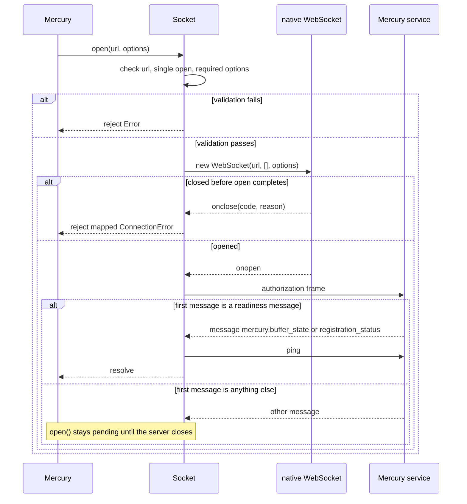
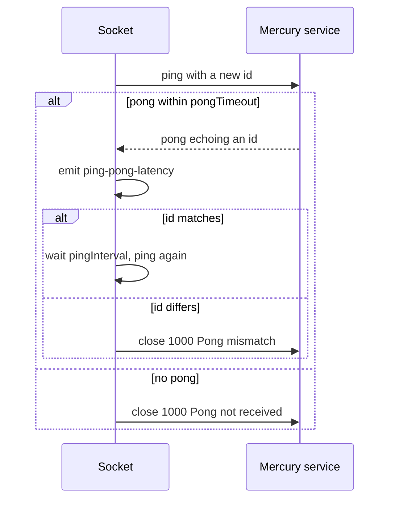
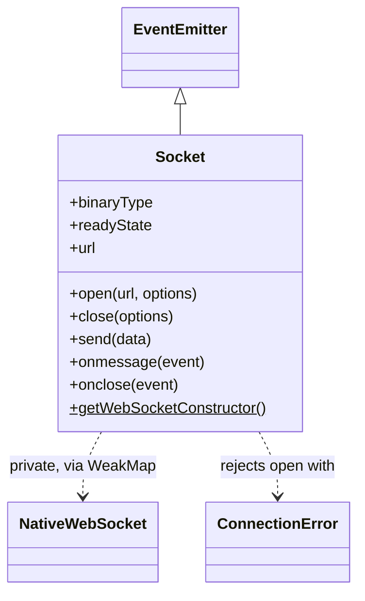
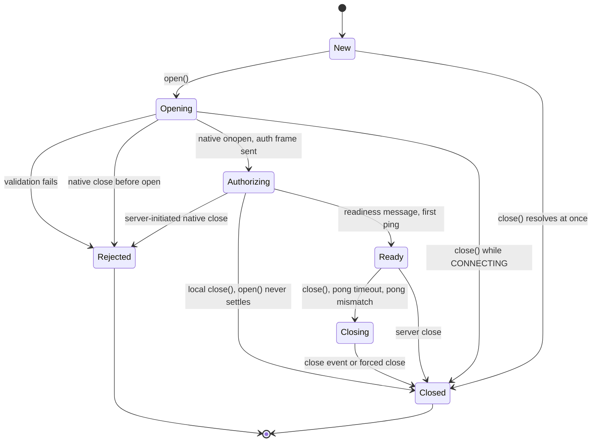

<!-- sdd-generated-metadata
doc_kind: module-spec
generated_from: module-spec@0.3.0
generated_by: claude-cowork
approved_by: akulakum@cisco.com
updated_at: 2026-10-08T09:47:58Z
validation_status: pass-with-warnings
-->

# Mercury Socket

This source-local document at `src/socket/docs/README.md` owns the stable specification for **the
Mercury Socket**: one WebSocket connection to the Mercury service, its handshake, keepalive, and
frame handling. Session management, reconnect policy, and event routing belong to the parent module
and are specified in [`src/docs/README.md`](../../docs/README.md). Link to the
[package architecture](../../../docs/architecture.md) instead of repeating broader facts.

Related context: [documentation index](../../../docs/index.md) ·
[package agent instructions](../../../AGENTS.md) ·
[specification registry](../../../docs/specs/README.md)

## Metadata

| Field             | Value |
| ----------------- | ----- |
| Owner             | @webex/web-client, @webex/web-sdk |
| Source path       | `src/socket` |
| Resource kind     | module |
| Status            | Draft |
| Last verified     | 2026-10-06 at `d2e34dabee` |
| Module id         | `internal-plugin-mercury-socket` |
| Parent spec       | [src/docs/README.md](../../docs/README.md) |
| Doc kind          | Module spec |
| Coverage score    | 93.3% assessed 2026-10-06 — 14 of 15 mandatory fields PRESENT, critical 8 of 8; test strategy is WEAK because neither platform hook, the 1005 to `UnknownResponse` mapping, nor a non-readiness first message is tested and no characterization baseline exists |
| Validation status | pass-with-warnings; 2026-10-08; validator runtime: current-session |

## Applicability

| Condition ID                         | Status     | Evidence or reason | Owned section |
| ------------------------------------ | ---------- | ------------------ | ------------- |
| `module.has_tiers`                   | N/A        | No tier policy exists in this package | Tier |
| `module.has_ui`                      | N/A        | No view or screen | UI use-case flow |
| `module.crosses_service_boundaries`  | Applicable | Opens a WebSocket to the Mercury service in `src/socket/socket-base.js` | Cross-boundary use-case flow |
| `module.holds_client_state`          | Applicable | Private native socket, ping and pong timers, and `expectedSequenceNumber` per instance | Client state model |
| `module.enforces_domain_rules`       | Applicable | Required open options, allowed close codes, and one open per instance | Business rules and invariants |
| `module.is_concurrent_async`         | Applicable | Timer-driven ping/pong and forced close; event-driven message and close handling | Concurrency and reactive flow |
| `module.owns_persistence`            | N/A        | No storage | Data, schema, and migration discipline |
| `module.stateful_transitions`        | Applicable | Opening, authorizing, ready, closing, and closed phases with distinct close handlers | State machine |
| `module.exposes_wire_protocol`       | Applicable | Authorization, ping, pong, and ack frames and close-code handling | Protocol and wire format |
| `module.ui_multi_screen`             | N/A        | No UI | UI flow |
| `module.large_data_model`            | N/A        | Four small frame shapes | Data model |
| `module.returns_caller_errors`       | Applicable | `open()`, `close()`, and `send()` reject with errors the parent classifies | Caller-visible failure modes |
| `module.module_specific_conventions` | Applicable | `socket,<domain>:` log prefix and the `getWebSocketConstructor` platform hook | Module-specific rules |
| `module.published_package`           | N/A        | `Socket` is exported only through the parent barrel `src/index.js`; the parent spec owns its export stability | Export stability |
| `module.embedded_in_host`            | N/A        | No host embed API | Host integration and theming |
| `module.has_design_tradeoff`         | Applicable | Private native socket in a `WeakMap`, manual close for `CONNECTING` sockets, and a forced-close timer | Key design trade-off |
| `module.has_submodules`              | N/A        | Computed false by the Repo Annotation module_tree.py script | Sub-modules |

## Evidence register

| Evidence | What it establishes |
| -------- | ------------------- |
| `src/socket/socket-base.js` | `Socket` class: open, authorize, ping/pong, ack, message parsing, close, close-code fixes, and proxies |
| `src/socket/socket.js` | Node constructor hook returning `ws` |
| `src/socket/socket.shim.js` | Browser constructor hook returning the global `WebSocket` or `MozWebSocket` |
| `src/socket/constants.js` | `SOCKET_READY_STATE` values |
| `src/socket/index.js` | Re-export of the platform `Socket` |
| `src/errors.js` | Error classes raised by `open()` (owned by the parent module) |
| `package.json` | `browser` field that swaps `socket.js` for `socket.shim.js`; `ws` and `uuid` dependencies |
| `test/unit/spec/socket.js` | Unit cases for every public method, proxies, close codes, acks, sequence numbers, and ping/pong |
| Sibling package common, SDD module spec src/docs/README.md | `checkRequired` behavior |
| Sibling package common-timers, SDD module spec src/docs/README.md | `safeSetTimeout` behavior |

## Purpose and boundary

- Responsibility: own one WebSocket connection to the Mercury service from creation to close, and
  present it as an `EventEmitter` with `open`, `close`, and `send` promises.
- In scope: option checks, native socket creation, the authorization handshake, ping/pong keepalive
  and latency, acks, sequence-number tracking, message parsing, close-code correction and mapping,
  forced close, and Node or browser constructor selection.
- Out of scope: which URL to open, tokens and their refresh, retries, reconnects, session ids, and
  event fan-out (all in the parent `src/docs/README.md`); the error class definitions in
  `src/errors.js` (parent).
- Consumers: `Mercury` in `src/mercury.js`; the `Socket` export of the package barrel.

## Structure and key files

| Path | Responsibility |
| ---- | -------------- |
| `src/socket/socket-base.js` | Platform-neutral `Socket` class; its `getWebSocketConstructor()` throws until a platform file replaces it |
| `src/socket/socket.js` | Node entry: sets `getWebSocketConstructor` to return `ws` |
| `src/socket/socket.shim.js` | Browser entry, selected by `package.json` `browser`: returns the first available `WebSocket` or `MozWebSocket` global |
| `src/socket/constants.js` | Frozen `SOCKET_READY_STATE` (`CONNECTING` 0, `OPEN` 1, `CLOSING` 2, `CLOSED` 3) |
| `src/socket/index.js` | Re-exports the platform `Socket` as default |
| `test/unit/spec/socket.js` | Unit spec; stubs `getWebSocketConstructor` with a mock WebSocket |

## Public surface

| Surface | Consumer | Compatibility commitment | Source |
| ------- | -------- | ------------------------ | ------ |
| `new Socket()` | `Mercury` | No arguments; sets max listeners to 10 | `src/socket/socket-base.js` |
| `open(url, options)` | `Mercury` | Resolves after authorization (`MOD-001` to `MOD-004`) | `src/socket/socket-base.js` |
| `close(options)` | `Mercury` | Resolves with the close event or `undefined` (`MOD-009`) | `src/socket/socket-base.js` |
| `send(data)` | `Mercury`, `RealtimeChannel` in internal-plugin-board | Objects are JSON-encoded (`MOD-006`) | `src/socket/socket-base.js` |
| `binaryType`, `bufferedAmount`, `extensions`, `protocol`, `readyState`, `url` | `Mercury` and callers | Read-through proxies to the native socket (`MOD-012`) | `src/socket/socket-base.js` |
| Events `close`, `message`, `pong`, `sequence-mismatch`, `ping-pong-latency` | `Mercury` | Payload shapes in Protocol and wire format | `src/socket/socket-base.js` |
| `Socket.getWebSocketConstructor()` | Platform files and tests | Static hook the platform file must replace | `src/socket/socket.js`, `src/socket/socket.shim.js` |

Contracts provided: `mercury-socket-transport` and `mercury-wire-protocol`, both internal with
source `src/socket/socket-base.js`. Required: `webex-common-sdk`, `webex-common-timers`, `ws`,
`lodash`, and `uuid`.

## Dependencies

| Dependency | Why it is required | Failure behavior |
| ---------- | ------------------ | ---------------- |
| `ws` | Node WebSocket constructor | Construction errors reject `open()` through the promise executor |
| Global `WebSocket` or `MozWebSocket` | Browser constructor | When none exists the hook returns `undefined` and `new` throws inside the executor, rejecting `open()` |
| `@webex/common` `checkRequired` | Required option check | Throws inside the executor, rejecting `open()` |
| `@webex/common-timers` `safeSetTimeout` | Ping, pong, and forced-close timers, as specified in packages/@webex/common-timers/src/docs/README.md | No failure path used here |
| `lodash` | `defaults`, `has`, `isObject` | — |
| `uuid` | `v4` ids for authorization and ping frames | — |
| `src/errors.js` | Error classes for pre-open closes | — |

## Requirements

| ID | WHAT | WHY | Source evidence | Test or example evidence | Assumptions or gaps | Confidence |
| -- | ---- | --- | --------------- | ------------------------ | ------------------- | ---------- |
| `MOD-001` | `open()` rejects without a `url`, rejects a second call on the same instance, and checks the required options `INV-001`. Every option key becomes a non-enumerable property of the instance. | The socket cannot keep alive or authorize without them, and an instance owns one native socket. | `src/socket/socket-base.js` | `test/unit/spec/socket.js` `requires a url`, `requires a … option` cases, `cannot be called more than once` | — | Present |
| `MOD-002` | `open()` creates the native socket with `(url, [], options)`, sets `binaryType` to `arraybuffer`, and uses the URL host name as the log domain. | Node `ws` reads options such as a proxy `agent` from the third argument. | `src/socket/socket-base.js` | `test/unit/spec/socket.js` `sets the underlying socket's binary type` | Browsers ignore the third argument | Present |
| `MOD-003` | A close before authorization completes rejects `open()` with the class mapped under Caller-visible failure modes, after the code fix in `MOD-011`. | The parent needs the class to choose a refresh or to stop. | `src/socket/socket-base.js` | `test/unit/spec/socket.js` `when connection fails because …` cases | 1005 mapping has no direct case here | Present |
| `MOD-004` | On native open the socket sends the authorization frame and resolves `open()` only after a message with no `type` whose `data.eventType` is `mercury.buffer_state` or `mercury.registration_status`. It then starts ping/pong and installs the post-open close handler. | The service accepts traffic only after authorization. | `src/socket/socket-base.js` | `test/unit/spec/socket.js` `sends an auth message up the socket`, `includes the logLevelToken …`, `resolves upon successful authorization`, `resolves upon receiving registration status`, `kicks off ping/ping` | See Pitfalls for the single-message wait | Present |
| `MOD-005` | Each inbound frame is JSON-parsed, checked against `expectedSequenceNumber`, acknowledged, and emitted as `pong` when `type` is `pong`, otherwise as `message`, with payload `{data}`. A frame that fails to parse is logged and dropped. | Lost frames are detectable and the service gets acks. | `src/socket/socket-base.js` | `test/unit/spec/socket.js` `#onmessage()` cases | — | Present |
| `MOD-006` | `send()` rejects with `INVALID_STATE_ERROR` unless `readyState` is `OPEN`, and JSON-encodes objects. | Avoid native send errors on closed sockets. | `src/socket/socket-base.js` | `test/unit/spec/socket.js` `#send()` cases | — | Present |
| `MOD-007` | `_acknowledge()` rejects without an event or `data.id`, resolves without sending when not open, and swallows `INVALID_STATE_ERROR` from `send()`. | Acks must not fail on a socket that is closing. | `src/socket/socket-base.js` | `test/unit/spec/socket.js` `#_acknowledge` | — | Present |
| `MOD-008` | After authorization, each ping waits `pongTimeout` for a pong. A pong clears the timer, schedules the next ping after `pingInterval`, emits `ping-pong-latency` in milliseconds, and closes with 1000 `Pong mismatch` when its id differs. No pong closes with 1000 `Pong not received`. | Detect dead connections the native socket does not report. | `src/socket/socket-base.js` | `test/unit/spec/socket.js` `#_ping()` cases | — | Present |
| `MOD-009` | `close()` resolves at once before `open()` or when already closing or closed, rejects codes outside `INV-002`, defaults to code 1000 and reason `Done`, and resolves on the native close event. A `CONNECTING` socket runs the close handler at once with the requested code. Without a close event within `forceCloseDelay`, the close handler runs with the fallback `INV-003`. | Callers get a settled promise even when the server never answers. | `src/socket/socket-base.js` | `test/unit/spec/socket.js` `#close()` cases | — | Present |
| `MOD-010` | The post-open close handler clears both timers, applies `MOD-011`, emits `close`, and removes every listener. | No late pong handling and no retained listeners. | `src/socket/socket-base.js` | `test/unit/spec/socket.js` `#onclose()` | — | Present |
| `MOD-011` | A 1005 close with reason `replaced` becomes 4000; with reason `authentication failed` or `authentication did not happen within the timeout window of 30000 seconds.` it becomes 1008. Reasons are compared lower-cased. | Some browsers drop close codes but keep reasons. | `src/socket/socket-base.js` | `test/unit/spec/socket.js` `when it receives close code 1005` | — | Present |
| `MOD-012` | The proxy getters read the private native socket; `getWebSocketConstructor()` is replaced by `ws` in Node and by the first global `WebSocket` or `MozWebSocket` in browsers. | One class serves both platforms. | `src/socket/socket-base.js`, `src/socket/socket.js`, `src/socket/socket.shim.js` | `test/unit/spec/socket.js` proxy cases | The unit spec stubs the hook, so neither platform file is unit-tested | Weak |

## Design overview

`Socket` extends Node's `EventEmitter`. The native socket is kept in a module-level `WeakMap` keyed
by the `Socket` instance, so the proxy getters are the only way to read it. `open()` copies its
options onto the instance as non-enumerable properties; `close()`, the timers, and the authorization
frame read them from there.

Two close handlers exist. Before authorization, the native `onclose` rejects `open()` with a mapped
error. After authorization, it points at `Socket#onclose`, which emits `close` and tears down. The
platform split is a static method replaced at import time by `src/socket/socket.js` or
`src/socket/socket.shim.js`.

## Data flow and sequence coverage

Transport: JSON text frames over WebSocket to the Mercury service; events and promises to the parent.

| Operation group | Entry and outcome | Diagram or evidence | Failure and recovery coverage |
| --------------- | ----------------- | ------------------- | ----------------------------- |
| Open and authorize | `open()` → native open → auth frame → readiness message → resolve | Open diagram below | Pre-open close rejects with mapped error |
| Keepalive | ping → pong or timeout | Keepalive diagram below | Timeout and mismatch close with 1000 |
| Inbound frame | parse → sequence check → ack → emit | `MOD-005` | Parse errors logged |
| Send | `send()` → native send | `MOD-006` | `INVALID_STATE_ERROR` |
| Close | `close()` → native close or forced close | State machine section | Forced close after `forceCloseDelay` |

Open and authorize:

Keepalive:

## Class and component relationships

| Component | Relationship |
| --------- | ------------ |
| `Socket` | One instance per connection attempt, created by the parent |
| Native socket | `ws` in Node, global `WebSocket` in browsers; stored in the `sockets` `WeakMap` |
| `src/socket/socket.js`, `src/socket/socket.shim.js` | Replace `getWebSocketConstructor` and re-export `Socket` |
| `ConnectionError` tree | Defined in `src/errors.js` by the parent module |

## Use cases and flows

| Use case | Actor or caller | Primary steps and outcome | Failure or boundary behavior | Evidence |
| -------- | --------------- | ------------------------- | ---------------------------- | -------- |
| `UC-001` | `Mercury` | Opens with token and timers; resolves after buffer state | Rejects with `NotAuthorized` on 4401 | `src/socket/socket-base.js`, `test/unit/spec/socket.js` |
| `UC-002` | Network drop | Pong does not arrive; socket closes with `Pong not received`; parent reconnects | — | `src/socket/socket-base.js`, `test/unit/spec/socket.js` |
| `UC-003` | Server with lost frames | A skipped `sequenceNumber` emits `sequence-mismatch` with actual and expected | Message still delivered | `src/socket/socket-base.js`, `test/unit/spec/socket.js` |
| `UC-004` | `Mercury` disconnect | `close({code: 3050, reason})` sends that code; parent sees it in `close` | Forced close keeps the requested code | `src/socket/socket-base.js`, `test/unit/spec/socket.js` |
| `UC-005` | Board realtime channel | Calls `send(object)` on an open socket | Rejects when not open | `src/socket/socket-base.js`, `test/unit/spec/socket.js` |

### Cross-boundary use-case flow

| Boundary | Transport | Ordering | Timeout and retry | Recovery |
| -------- | --------- | -------- | ----------------- | -------- |
| Mercury service | WebSocket, JSON text frames | Authorization first; pings only after readiness | `pongTimeout`, `pingInterval`, `forceCloseDelay`; no retry here | Close and let the parent apply its policy |

## Client state model

| State or slice | Owner | Initial state | Transition triggers | Reset or persistence boundary |
| -------------- | ----- | ------------- | ------------------- | ----------------------------- |
| Native socket | `sockets` `WeakMap` | absent | Set by `open()` | Never removed; released with the instance |
| `_domain` | `Socket` | `unknown-domain` | Set from the URL by `open()` | — |
| Option properties (`token`, `trackingId`, `logger`, timers, `logLevelToken`, others passed) | `Socket` | absent | Defined by `open()` | Not writable after definition |
| `expectedSequenceNumber` | `Socket` | `undefined` | Inbound frame sequence number plus one | — |
| `pingTimer`, `pongTimer` | `Socket` | `undefined` | `_ping()` and pong handling | Cleared by the post-open close handler |

## Business rules and invariants

| ID | Invariant | WHY | Enforcement source | Test evidence |
| -- | --------- | --- | ------------------ | ------------- |
| `INV-001` | `open()` requires `forceCloseDelay`, `pingInterval`, `pongTimeout`, `token`, `trackingId`, and `logger`. | Timers and authorization depend on them. | `src/socket/socket-base.js` | `test/unit/spec/socket.js` `requires a … option` |
| `INV-002` | A close code, when given, is 1000 or 3000 to 4999 inclusive. | Native WebSocket rejects other application codes. | `src/socket/socket-base.js` | `test/unit/spec/socket.js` `only accepts valid close codes` |
| `INV-003` | Forced close reports the requested code with its reason or `Done (unknown)`, or 1000 with `Done (forced)` when no code was requested. | The parent gets a deterministic close event. | `src/socket/socket-base.js` | `test/unit/spec/socket.js` `signals closure if no close frame …` cases |
| `INV-004` | One native socket per `Socket` instance. | Close and send act on exactly one connection. | `src/socket/socket-base.js` | `test/unit/spec/socket.js` `cannot be called more than once` |

## Concurrency and reactive flow

- Execution model: event loop; native socket callbacks and `safeSetTimeout` timers.
- Ordering guarantees: frames are emitted in arrival order; the ack is sent before the emit.
- Idempotency and retry: `close()` is safe to call repeatedly; there is no retry in this module.
- Shared-state protection: each `_ping()` registers three one-time `pong` listeners; timers are
  cleared on close.
- Blocking restrictions: listeners of `message` run synchronously inside `onmessage`.

## State machine

Rejected transitions: `open()` on an instance that already has a native socket; `close()` with a code
outside `INV-002`; `send()` outside `Ready`.

## Protocol and wire format

| Message or frame | Version | Producer or serializer | Consumer or parser | Compatibility and ordering rule |
| ---------------- | ------- | ---------------------- | ------------------ | ------------------------------- |
| Authorization | Unversioned | `src/socket/socket-base.js` `_authorize` | Mercury service | `{id, type: 'authorization', data: {token}, trackingId, logLevelToken}`; first frame after open |
| Readiness | Unversioned | Mercury service | `src/socket/socket-base.js` `_authorize` | No `type`; `data.eventType` is `mercury.buffer_state` or `mercury.registration_status` |
| Ping | Unversioned | `src/socket/socket-base.js` `_ping` | Mercury service | `{id, type: 'ping'}` |
| Pong | Unversioned | Mercury service | `src/socket/socket-base.js` `_ping` | `type: 'pong'` with the ping `id` |
| Ack | Unversioned | `src/socket/socket-base.js` `_acknowledge` | Mercury service | `{messageId: <inbound id>, type: 'ack'}` for each inbound frame with an `id`, while open |
| Inbound sequence | Unversioned | Mercury service | `src/socket/socket-base.js` `onmessage` | `sequenceNumber` is parsed as an integer; the next expected value is that number plus one |
| Close code fix | — | Browser native socket | `src/socket/socket-base.js` `_fixCloseCode` | See `MOD-011` |

## Caller-visible failure modes

| Condition | Signal or result | Caller behavior | Retry or recovery | Evidence |
| --------- | ---------------- | --------------- | ----------------- | -------- |
| Missing `url`, second `open()`, or missing required option | `open()` rejects with `Error` | Fix the call | None | `src/socket/socket-base.js`, `test/unit/spec/socket.js` |
| Close 1005 before authorization | `UnknownResponse` | Classified by the parent | Owned by the parent | `src/socket/socket-base.js` |
| Close 4400 before authorization | `BadRequest` | Classified by the parent | Owned by the parent | `src/socket/socket-base.js`, `test/unit/spec/socket.js` |
| Close 4401 before authorization | `NotAuthorized` | Classified by the parent | Owned by the parent | `src/socket/socket-base.js`, `test/unit/spec/socket.js` |
| Close 4403 before authorization | `Forbidden` | Classified by the parent | Owned by the parent | `src/socket/socket-base.js`, `test/unit/spec/socket.js` |
| Any other close before authorization | `ConnectionError` with `code` and `reason` | Classified by the parent | Owned by the parent | `src/socket/socket-base.js`, `test/unit/spec/socket.js` |
| `close()` with an invalid code | Rejects with `` `options.code` must be 1000 or between 3000 and 4999 (inclusive) `` | Fix the code | None | `src/socket/socket-base.js`, `test/unit/spec/socket.js` |
| `send()` when not open | Rejects with `INVALID_STATE_ERROR` | Reconnect first | None | `src/socket/socket-base.js`, `test/unit/spec/socket.js` |

## Pitfalls and constraints

- `_authorize()` waits with `once('message', …)`. If the first message after authorization is not a
  readiness message, or has no `data.data`, the listener is consumed and `open()` never resolves.
  Found by code reading; no test sends a different first message.
- `onmessage()` calls `_acknowledge()` without handling its promise, and `_acknowledge()` rejects for
  a frame without `data.id`. That frame produces an unhandled promise rejection.
- The constructor comment says it increases the listener limit, but `setMaxListeners(10)` is Node's
  default.
- `open()` sets `_domain` before checking `url`; with no URL the domain becomes `undefined`.
- Options are passed as the third constructor argument and also stored on the instance, including
  `token`. They are non-enumerable but readable.
- For a `CONNECTING` socket, `close()` resolves before the native close completes.
- `close()` replaces the native `onclose` handler that rejects `open()`. A local `close()` while the
  socket is opening or authorizing therefore leaves the `open()` promise unsettled; only a close the
  server starts rejects it. The parent avoids waiting forever because `disconnect()` aborts its
  backoff call.

## Module-specific rules

- Do: keep the `socket,<domain>:` prefix on every log line.
- Do: change Node and browser constructor hooks together; `package.json` `browser` selects them.
- Do: route new frame types through `onmessage()` so they are acknowledged and sequence-checked.
- Do not: expose the native socket outside the `WeakMap`.
- Do not: log the authorization frame or the `token` property.

## Key design trade-off

| Chosen trade-off | Preserved invariant or benefit | Cost or limitation | Decision evidence |
| ---------------- | ------------------------------ | ------------------ | ----------------- |
| Native socket kept in a `WeakMap` | No caller can bypass `send()` checks or close handlers | Proxy getters throw before `open()` because the map has no entry | `src/socket/socket-base.js` |
| Manual close handler for `CONNECTING` sockets | The requested close code reaches the parent even where browsers drop it | The native close runs after the promise resolves | `src/socket/socket-base.js` |
| Forced-close timer | `close()` always settles | The synthesized reason can trigger a parent reconnect | `src/socket/socket-base.js` |
| Ack every inbound frame with an id, including pongs | Service delivery tracking | An ack per frame | `src/socket/socket-base.js` |

## Verification

| Requirement or invariant | Test level | Positive evidence | Negative or boundary evidence | Gap |
| ------------------------ | ---------- | ----------------- | ----------------------------- | --- |
| `MOD-001`, `INV-001`, `INV-004` | Unit | `test/unit/spec/socket.js` | `test/unit/spec/socket.js` missing-option cases | — |
| `MOD-002`, `MOD-003` | Unit | `test/unit/spec/socket.js` | `test/unit/spec/socket.js` 4400, 4401, 4403, and generic cases | 1005 to `UnknownResponse` |
| `MOD-004` | Unit | `test/unit/spec/socket.js` | none found | Non-readiness first message |
| `MOD-005`, `MOD-007` | Unit | `test/unit/spec/socket.js` | `test/unit/spec/socket.js` missing id case | Unhandled rejection path |
| `MOD-006` | Unit | `test/unit/spec/socket.js` | `test/unit/spec/socket.js` not-open case | — |
| `MOD-008` | Unit | `test/unit/spec/socket.js` | `test/unit/spec/socket.js` timeout and mismatch | — |
| `MOD-009`, `INV-002`, `INV-003` | Unit | `test/unit/spec/socket.js` | `test/unit/spec/socket.js` invalid code and `manually triggers close handler when socket is still connecting` | — |
| `MOD-010`, `MOD-011` | Unit | `test/unit/spec/socket.js` | none found | — |
| `MOD-012` | Unit | `test/unit/spec/socket.js` | none found | Platform hooks in `src/socket/socket.js` and `src/socket/socket.shim.js` |

Run with `yarn workspace @webex/internal-plugin-mercury test:unit`. The browser hook runs only under
`yarn workspace @webex/internal-plugin-mercury test:browser`.
