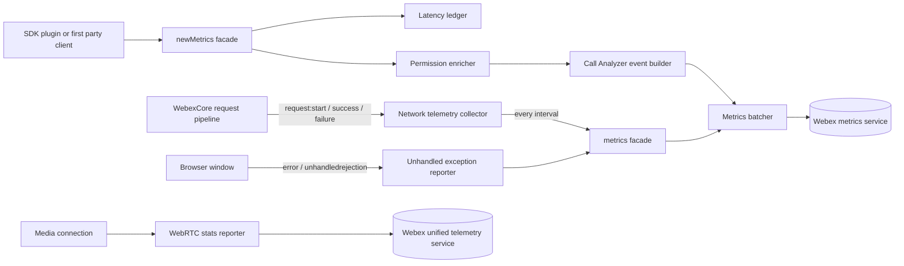
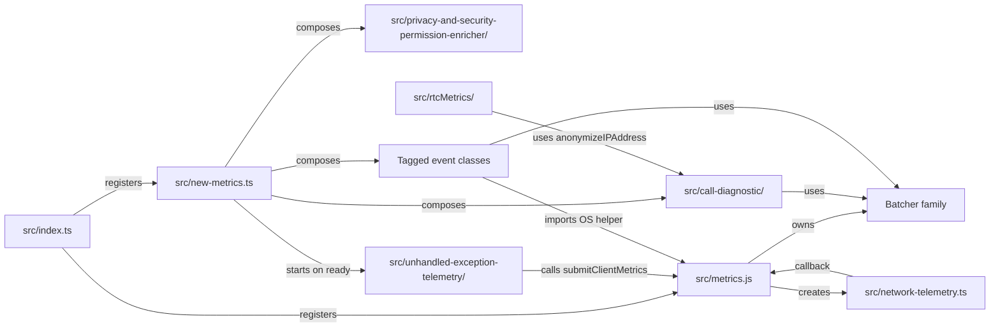
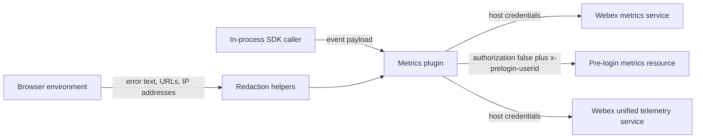

<!-- sdd-generated-metadata
doc_kind: standing-doc
generated_from: architecture@0.3.0
generated_by: claude-code
approved_by: rarajes2@cisco.com
updated_at: 2026-10-07T04:50:31Z
validation_status: pass
-->

# @webex/internal-plugin-metrics architecture

Canonical repository-wide architecture. This document owns facts that span
multiple modules and the package's external boundaries. Link to
the owning module, ADR, or native contract instead of duplicating owner-local
detail.

Related context: [specification registry](specs/README.md) ·
[repository agent instructions](../AGENTS.md)

## Applicability

Sections preceded by an `Include if` comment are conditional. Retain a
conditional section only when repository evidence satisfies its condition.

| Condition ID                         | Status     | Evidence or reason                                                                                                                              | Owned section                       |
| ------------------------------------ | ---------- | ----------------------------------------------------------------------------------------------------------------------------------------------- | ----------------------------------- |
| `repo.owns_datastore`                | N/A        | No schema, migration, ORM or connection configuration exists; every aggregate is in-memory and discarded at the submission boundary              | Repository data and schema          |
| `repo.holds_client_state`            | Applicable | `src/network-telemetry.ts`, `src/call-diagnostic/call-diagnostic-metrics-latencies.ts`, `src/unhandled-exception-telemetry/index.ts`              | Client state model                  |
| `repo.components_interact`           | Applicable | `src/new-metrics.ts` composes the four child modules; `src/metrics.js` subscribes to SDK request events                                          | Dependency and interaction topology |
| `repo.domain_data_across_components` | Applicable | The event envelope declared in `src/metrics.types.ts` is written by `src/call-diagnostic/call-diagnostic-metrics.ts` and `src/privacy-and-security-permission-enricher/index.ts` and transported by `src/prelogin-metrics-batcher.ts` | Object and data ownership |
| `repo.caches_data`                   | Applicable | `src/call-diagnostic/call-diagnostic-metrics.ts` error `WeakMap`, memoized device id in `src/generic-metrics.ts`, memoized verdict in `src/automated-user.ts` | Caching catalog |
| `repo.observability_convention`      | Applicable | Log-identifier prefixes in `src/call-diagnostic/config.ts`, `src/prelogin-metrics-batcher.ts`, `src/unhandled-exception-telemetry/index.ts`       | Observability patterns              |
| `repo.deploys_to_infra`              | N/A        | No Dockerfile, deployment manifest, process entry point or runtime configuration; the package runs inside a host SDK instance                     | Runtime and infrastructure          |
| `repo.shared_base_libs`              | Applicable | `src/metrics.js` and `src/batcher.js` extend base classes from `@webex/webex-core`; shared babel, eslint and jest presets in `package.json`        | Shared and base libraries           |
| `repo.is_monorepo`                   | N/A        | The SDD root is one workspace package with one build and one published artifact; the surrounding monorepo is out of scope                          | Package map and dependencies        |
| `repo.multi_platform`                | Applicable | `src/config.js` selects `appType` from the browser check; `src/metrics.js`, `src/automated-user.ts` and `src/unhandled-exception-telemetry/index.ts` guard on `window` | Platform matrix |
| `repo.published_package`             | Applicable | `package.json` declares `main`, `types` and `deploy:npm`; seven sibling workspace packages depend on it                                            | Release and versioning              |
| `repo.embedded_in_host`              | Applicable | `src/index.ts` mounts two plugins into a host SDK instance and registers an `onBeforeLogout` lifecycle hook                                        | Host integration and theming        |
| `repo.exposes_commands_or_artifacts` | Applicable | `package.json` defines `build`, `build:src`, `test:unit` and `test:style`, producing the `dist/` artifact                                          | Commands and generated artifacts    |
| `repo.cross_repo_deps_material`      | Applicable | The Call Analyzer event schema is owned externally by `@webex/event-dictionary-ts`, pinned in `package.json`                                       | Cross-repository topology           |
| `repo.security_arch_warranted`       | Applicable | IP anonymization in `src/call-diagnostic/call-diagnostic-metrics.util.ts`, URL credential stripping in `src/unhandled-exception-telemetry/utils.ts`, unauthenticated pre-login transport in `src/prelogin-metrics-batcher.ts` | Security architecture |

## Design overview

This package is the Webex JS SDK's single telemetry boundary. Every other SDK plugin and every first
party client that needs to report something — a diagnostic event, a behavioural counter, a WebRTC
stats sample, an uncaught browser error, a request-failure summary — reaches it through one of two
registered internal plugins rather than talking to an ingestion service directly.

The package is shaped by three decisions visible in the code.

**Two façades, one transport layer.** `src/index.ts` registers `metrics` (`src/metrics.js`) and
`newMetrics` (`src/new-metrics.ts`). `metrics` is the older surface: a thin `WebexPlugin` that owns
the three `Batcher` children and the raw `submitClientMetrics` path. `newMetrics` is the current
surface and owns no transport of its own; it composes `src/call-diagnostic/`,
`src/privacy-and-security-permission-enricher/`, the tagged-event classes and
`src/unhandled-exception-telemetry/`, and each of those reaches the network through a `Batcher`
descendant of `src/batcher.js`. New callers use `newMetrics`; `metrics` remains because
`submitClientMetrics` is the only path that accepts a pre-login identifier and is the transport that
network and unhandled-exception telemetry reuse.

**Collection is decoupled from submission by an accumulate-then-flush window.** The two
self-driven collectors — `src/network-telemetry.ts` and `src/unhandled-exception-telemetry/` — do not
submit per event. They accumulate into an in-memory window keyed by an identity (host plus endpoint;
error fingerprint), then submit one aggregate on a timer. Both reset the window before the
asynchronous submission starts, so an event observed while a submission is in flight belongs to the
next window and cannot mutate a payload already being sent.

**Telemetry must never degrade what it observes.** No failure in this package propagates to a
caller's request path. `src/network-telemetry.ts` excludes the `metrics` and `unifiedTelemetry`
services centrally so an upload cannot appear in its own summary; every submission failure is caught
and logged; `src/batcher.js` re-enqueues with exponential backoff on network errors instead of
rejecting; and `src/privacy-and-security-permission-enricher/index.ts` returns the original payload
on any internal error. The same constraint drives the redaction rules: anonymized IP addresses,
stripped URL credentials and query data, and endpoint path segments replaced with a placeholder.

The package owns no HTTP surface and no datastore. Its boundaries are the SDK plugin registration
contract on one side and two upstream ingestion APIs on the other.

## Resource inventory and responsibilities

| Resource                                    | Kind    | Responsibility                                                                                                            | Owner                          | Source                                                | Detailed specification                                        |
| ------------------------------------------- | ------- | ------------------------------------------------------------------------------------------------------------------------- | ------------------------------ | ----------------------------------------------------- | ------------------------------------------------------------- |
| Metrics plugin root                         | Module  | Plugin registration, both façades, the batcher family, tagged-event metrics and SDK network telemetry                      | Cisco Webex JS SDK — telemetry | `src/index.ts`                                        | `src/docs/README.md`                                          |
| Call Analyzer diagnostics                   | Module  | Client, feature and media-quality events, the latency ledger and error-code mapping                                        | Cisco Webex JS SDK — telemetry | `src/call-diagnostic/call-diagnostic-metrics.ts`      | `src/call-diagnostic/docs/README.md`                          |
| Privacy and security permission enrichment  | Module  | Deciding which browser permission changes are attached to which client events                                              | Cisco Webex JS SDK — telemetry | `src/privacy-and-security-permission-enricher/index.ts` | `src/privacy-and-security-permission-enricher/docs/README.md` |
| WebRTC stats telemetry                      | Module  | Queueing and submitting WCME stats batches with anonymized candidate addresses                                             | Cisco Webex JS SDK — telemetry | `src/rtcMetrics/index.ts`                             | `src/rtcMetrics/docs/README.md`                               |
| Unhandled exception telemetry               | Module  | Capturing, deduplicating, sanitizing and submitting browser uncaught errors and rejections                                 | Cisco Webex JS SDK — telemetry | `src/unhandled-exception-telemetry/index.ts`          | `src/unhandled-exception-telemetry/docs/README.md`             |
| Published npm package                       | Package | The `@webex/internal-plugin-metrics` artifact consumed by sibling plugins and first party clients                           | Cisco Webex JS SDK — telemetry | `package.json`                                        | `src/docs/README.md`                                          |

## Interaction and execution flows

The representative end-to-end flow is a Call Analyzer client event, because it crosses the most
boundaries: façade, latency ledger, permission enrichment, event construction, batching, transport.

| From                                   | To                                     | Interaction or transport                        | Purpose                                                            | Failure or compatibility behavior                                                                              |
| -------------------------------------- | -------------------------------------- | ----------------------------------------------- | ------------------------------------------------------------------ | -------------------------------------------------------------------------------------------------------------- |
| SDK plugin or first party client       | `newMetrics` façade                    | In-process method call on the registered plugin  | Submit a diagnostic, behavioural, operational or business event     | Submissions before the SDK `ready` event are logged and resolve without submitting                              |
| `newMetrics` façade                    | Permission enricher                    | In-process call                                 | Attach changed browser permission state to eligible client events   | Any internal error is handed to the injected handler and the original payload is returned unchanged             |
| Call Analyzer event builder            | Metrics batcher                        | Queued HTTP POST to the `metrics` service        | Deliver diagnostic and feature events                              | Network errors re-enqueue with doubling delay up to the configured plateau; other errors reject the item        |
| `WebexCore` request pipeline           | Network telemetry collector            | SDK-wide events `request:start`, `request:success`, `request:failure` | Aggregate request outcomes without wrapping `webex.request()` | Requests to the `metrics` and `unifiedTelemetry` services are excluded so telemetry cannot report on itself     |
| Network telemetry collector            | `metrics` façade                       | In-process callback at the window boundary       | Submit one summary metric per interval                             | The window resets before submission; a failed submission is logged and that window's data is dropped            |
| Browser window                         | Unhandled exception reporter           | Capture-phase `error` and `unhandledrejection` listeners | Report uncaught errors and rejections                      | Matching errors within the one-second window merge into one event with an occurrence count                      |
| Media connection                       | WebRTC stats reporter                  | Direct HTTP POST to the `unifiedTelemetry` service | Deliver WCME stats batches                                      | A failed media connection flushes the queue and starts a new connection identifier                              |

## Dependency topology

| Dependency                      | Type     | Used by                                            | Purpose                                                                 | Version, failure, or fallback policy                                                                 |
| ------------------------------- | -------- | -------------------------------------------------- | ----------------------------------------------------------------------- | ---------------------------------------------------------------------------------------------------- |
| `@webex/webex-core`             | Internal | `src/metrics.js`, `src/batcher.js`, `src/new-metrics.ts`, `src/generic-metrics.ts` | Plugin base classes, the batcher queue and retry machinery, HTTP error types, plugin registration | `workspace:*` in `package.json`; a breaking base-class change breaks registration at import time      |
| `@webex/common`                 | Internal | `src/metrics.js`, `src/config.js`, `src/generic-metrics.ts` | Browser and OS detection, the browser-environment flag                  | `workspace:*`; detection values degrade to `unknown` rather than throwing                             |
| `@webex/common-timers`          | Internal | `src/batcher.js`, `src/network-telemetry.ts`, `src/unhandled-exception-telemetry/index.ts` | Timers that survive the SDK's own clock handling                        | `workspace:*`                                                                                         |
| `@webex/event-dictionary-ts`    | External | `src/metrics.types.ts`                             | The authoritative Call Analyzer event schema                            | Pinned `^1.0.2220` in `package.json`; a schema change surfaces as a TypeScript error at build time    |
| `ip-anonymize`                  | External | `src/call-diagnostic/call-diagnostic-metrics.util.ts` | Truncating IPv4 and IPv6 addresses before submission                    | Pinned in `package.json`; a failure yields `undefined`, which drops the field                         |
| `isbot`                         | External | `src/automated-user.ts`                            | Classifying the user agent as automated                                 | Pinned `5.2.1`; the verdict is memoized once per process                                              |
| `lodash`                        | External | `src/new-metrics.ts`, `src/generic-metrics.ts`, `src/privacy-and-security-permission-enricher/utils.ts`, `src/prelogin-metrics-batcher.ts` | Deep merge, deep equality, clamping and unique identifiers | Pinned in `package.json`                                                              |
| `uuid`                          | External | `src/call-diagnostic/call-diagnostic-metrics.ts`, `src/rtcMetrics/index.ts`, `src/unhandled-exception-telemetry/index.ts` | Event, connection and pre-login identifiers                | Pinned in `package.json`                                                              |

Ordering constraints and single points of failure:

- The package must be imported before a host SDK instance is constructed, or neither plugin is
  registered. `src/index.ts` performs the registration as an import side effect.
- `src/generic-metrics.ts` resolves the device identifier from the device registration URL and
  memoizes it. Until a device is registered, `isReadyToSubmitEvents` is false and the tagged-event
  façades report not-ready rather than submitting an event with an empty device identifier.
- `src/metrics.js` and `src/generic-metrics.ts` form a deliberate one-way import: `generic-metrics`
  imports the OS-name helper from `metrics`. Do not add the reverse edge.
- A circular dependency between this package and the device plugin is avoided by injection:
  `setDeviceInfo` in `src/call-diagnostic/call-diagnostic-metrics.ts` is called by the device plugin
  rather than this package importing it.

## Public and consumer surfaces

This is the repository contract index. Exact definitions remain in their native source.

| Surface                            | Type  | Owner                                             | Consumers                                                                  | Compatibility policy                                                                   | Source                                                 |
| ---------------------------------- | ----- | ------------------------------------------------- | -------------------------------------------------------------------------- | -------------------------------------------------------------------------------------- | ------------------------------------------------------ |
| `metrics-package-entry`            | SDK   | Metrics plugin root                               | Any package importing `@webex/internal-plugin-metrics`                      | Internal plugin; additive. Removing a named export is breaking for workspace siblings   | `src/index.ts`                                         |
| `metrics-internal-plugin-sdk`      | SDK   | Metrics plugin root                               | `plugin-meetings`, `internal-plugin-device`, `internal-plugin-mercury`, this package's own telemetry collectors | Internal; retained for the pre-login transport path                 | `src/metrics.js`                                       |
| `new-metrics-internal-plugin-sdk`  | SDK   | Metrics plugin root                               | `plugin-meetings`, `internal-plugin-scheduler`, `contact-center`, first party clients | Internal; the preferred surface for new callers                      | `src/new-metrics.ts`                                   |
| `metrics-event-types`              | SDK   | Metrics plugin root                               | Consumers typing their own event payloads                                   | Internal; derived from the external event dictionary rather than hand-declared          | `src/metrics.types.ts`                                 |
| `network-request-summary-metric`   | Event | Metrics plugin root                               | Webex metrics ingestion and its dashboards                                  | Internal wire contract; field removal or rename breaks ingestion                        | `src/network-telemetry.ts`                             |
| `call-diagnostic-event`            | Event | Call Analyzer diagnostics                         | Webex Call Analyzer ingestion                                               | Internal wire contract; the payload schema is owned externally                          | `src/call-diagnostic/call-diagnostic-metrics.ts`       |
| `privacy-permission-enricher-sdk`  | SDK   | Privacy and security permission enrichment        | `src/new-metrics.ts` only                                                   | Module-internal; not re-exported from `src/index.ts`                                    | `src/privacy-and-security-permission-enricher/index.ts` |
| `rtc-metrics-payload`              | Event | WebRTC stats telemetry                            | Webex unified telemetry ingestion                                           | Internal wire contract; the payload declares its own `version` field                    | `src/rtcMetrics/index.ts`                              |
| `unhandled-exception-metric`       | Event | Unhandled exception telemetry                     | Webex metrics ingestion                                                     | Internal wire contract; the payload declares `schemaVersion`                            | `src/unhandled-exception-telemetry/index.ts`           |
| `webex-metrics-http`               | API   | Webex metrics service (external)                  | Every batcher in this package                                               | Consumed, not owned; resources `metrics`, `clientmetrics`, `clientmetrics-prelogin`     | `src/config.js`                                        |
| `webex-unified-telemetry-http`     | API   | Webex unified telemetry service (external)        | WebRTC stats telemetry                                                      | Consumed, not owned; resource `metric/v2`                                               | `src/rtcMetrics/index.ts`                              |
| `webex-core-request-events`        | Event | `@webex/webex-core` request pipeline (external)   | Network telemetry                                                           | Consumed, not owned; no shared TypeScript contract, so telemetry declares a local structural type | `src/network-telemetry.ts`                  |
| `call-analyzer-event-schema`       | File  | Webex Call Analyzer (external)                    | `src/metrics.types.ts`                                                      | Consumed, not owned; pinned by version in `package.json`                                | `package.json`                                         |

<!-- Include if: the repository holds client-side or in-memory session state. [condition-id: repo.holds_client_state] -->

## Client state model

Every slice below is in-memory and process-local. Nothing in this package is persisted, and no slice
survives a page reload.

| State or slice                   | Owner                                      | Transition triggers                                                           | Persistence or reset boundary                                                                        |
| -------------------------------- | ------------------------------------------ | ----------------------------------------------------------------------------- | ---------------------------------------------------------------------------------------------------- |
| Network telemetry window         | Metrics plugin root                        | `request:start`, `request:success`, `request:failure`                          | Replaced with an empty window at every interval boundary, manual flush and shutdown                  |
| In-flight submission set         | Metrics plugin root                        | A window submission starts or settles                                         | Awaited and drained by the shutdown path                                                             |
| Batcher queues and backoff state | Metrics plugin root                        | An item is enqueued, accepted, or re-enqueued after a network error            | Per-item delay doubles up to the configured plateau; cleared on acceptance                           |
| Latency timestamp ledger         | Call Analyzer diagnostics                  | Any client, feature or internal event name recorded through the façade         | Cleared by the internal reset event; Locus sync records are pruned by age and capped per meeting     |
| Delayed event queues             | Call Analyzer diagnostics                  | Delay mode enabled, then disabled                                             | Emptied when the delayed events are submitted                                                        |
| Event-limit counters             | Call Analyzer diagnostics                  | A limited event name is submitted for a correlation identifier                 | Cleared wholesale, or per correlation identifier, by the public clear operations                     |
| Error payload cache              | Call Analyzer diagnostics                  | A raw error is converted into an event error payload                           | A `WeakMap` keyed by the error object; also cleared explicitly                                        |
| Per-scope permission history     | Privacy and security permission enrichment | A client event is enriched                                                     | Deleted for that scope when a terminal call event is enriched                                        |
| WebRTC metrics queue             | WebRTC stats telemetry                     | A stats item is added                                                          | Emptied on submission, on connection failure and on close                                            |
| Pending exception events         | Unhandled exception telemetry              | An uncaught error or rejection is captured                                     | Submitted and removed when its one-second window expires; cleared on teardown                        |

## Cross-cutting architecture

### Security

- Trust boundaries and identity flow: the package sits entirely inside the host SDK's trust
  boundary and holds no credentials of its own. Authenticated submissions inherit the host's
  credentials through `webex.request`. One path is deliberately unauthenticated:
  `src/prelogin-metrics-batcher.ts` posts to the pre-login resource with `authorization: false` and
  an `x-prelogin-userid` header, and refuses to submit at all when no pre-login identifier is set.
- Sensitive surfaces and data classes: telemetry payloads are the only sensitive surface. Three
  redaction controls are enforced in code — IP anonymization in
  `src/call-diagnostic/call-diagnostic-metrics.util.ts`, URL credential, query and fragment removal
  plus non-HTTP scheme redaction in `src/unhandled-exception-telemetry/utils.ts`, and endpoint path
  segment replacement in `src/network-telemetry.ts`.
- Encryption and secret boundaries: transport-level only. The package performs no cryptography and
  reads no secret; its sole environment input is the optional pre-discovery service URL override in
  `src/config.js`.

### Observability and operations

- Logging and correlation: every module logs through the host SDK logger with a module-specific
  prefix constant, so telemetry lines can be filtered by family. Call Analyzer additionally emits a
  milestone line per event name from `src/call-diagnostic/call-diagnostic-metrics.util.ts`.
- Metrics, traces, and audit signals: this package is the SDK's metrics producer rather than a
  consumer of one. Its own health is observable through the batch-submission success and failure
  log lines in `src/call-diagnostic/call-diagnostic-metrics-batcher.ts` and
  `src/prelogin-metrics-batcher.ts`, and through the two SDK-emitted summary metrics it owns.
  Correlation across a call uses the Call Analyzer correlation identifier; WebRTC batches carry
  their own connection identifier.
- Ownership and operational entry points: ingestion, dashboards and alerting belong to the Webex
  metrics and Call Analyzer services, not to this repository. There is no runbook here because the
  package has no runtime of its own.

### Quality attributes

Stated as SDK footprint and compatibility boundaries, which is the form that fits a library plugin:

- Bounded memory per window. Tracking identifiers per error aggregate are capped at ten in
  `src/network-telemetry.ts`; Locus sync records are capped per meeting and dataset and pruned by a
  time-to-live in `src/call-diagnostic/call-diagnostic-metrics-latencies.ts`; the deduplication map
  in `src/unhandled-exception-telemetry/index.ts` holds at most one event per distinct fingerprint
  per window.
- Bounded cardinality. Endpoint normalization in `src/network-telemetry.ts` replaces
  dynamic-looking path segments so the per-endpoint aggregate cannot grow with the number of
  resource identifiers observed.
- Non-blocking by construction. No collection path awaits a submission; no submission failure
  reaches a caller.
- Additive public surface. Both plugin façades are consumed by sibling workspace packages, so an
  export or payload-field removal is a breaking change for the monorepo.

<!-- Include if: repository resources call, import, or exchange events with one another. [condition-id: repo.components_interact] -->

## Dependency and interaction topology

| From                                       | To                                         | Kind   | Purpose                                                                     | Ordering or failure boundary                                                                   |
| ------------------------------------------ | ------------------------------------------ | ------ | --------------------------------------------------------------------------- | ---------------------------------------------------------------------------------------------- |
| `src/index.ts`                             | Metrics plugin root                        | Import | Register both plugins and define the export surface                         | Must run before the host SDK instance is constructed                                            |
| `src/new-metrics.ts`                       | Call Analyzer diagnostics                  | Call   | Build and submit client, feature and media-quality events                   | Constructed eagerly in the façade constructor                                                   |
| `src/new-metrics.ts`                       | Privacy and security permission enrichment | Call   | Enrich eligible client events before they are built                         | Synchronous; enrichment-body errors go to the injected handler, while a throwing policy resolver or handler propagates |
| `src/new-metrics.ts`                       | Unhandled exception telemetry              | Call   | Start the browser reporter                                                  | Deferred until the SDK emits `ready`; a later start supersedes and flushes the previous reporter |
| `src/new-metrics.ts`                       | Tagged event classes                       | Call   | Submit behavioural, operational and business events                         | Built lazily on first use, and only after the SDK is ready                                      |
| Unhandled exception telemetry              | Metrics plugin root                        | Call   | Reuse `submitClientMetrics` as the transport                                | Missing transport is logged and the event is dropped                                            |
| Network telemetry                          | Metrics plugin root                        | Call   | Submit the completed window                                                 | Window reset precedes submission so the two cannot interleave                                   |
| WebRTC stats telemetry                     | Call Analyzer diagnostics                  | Import | Reuse the IP anonymization helper                                           | Pure utility import; no instance dependency                                                     |
| Tagged event classes                       | Metrics plugin root                        | Import | Reuse the OS-name helper                                                    | One-way only; the reverse edge would be circular                                                |

<!-- Include if: repository-owned domain data spans multiple resources. [condition-id: repo.domain_data_across_components] -->

## Object and data ownership

| Object or state                 | System of record                           | May write                                                                 | May read                                            | Movement or lifecycle                                                                                      |
| ------------------------------- | ------------------------------------------ | ------------------------------------------------------------------------- | --------------------------------------------------- | ---------------------------------------------------------------------------------------------------------- |
| Call Analyzer event envelope    | Call Analyzer diagnostics                  | Call Analyzer diagnostics; the permission enricher adds one payload field   | The batchers, which stamp origin and send time       | Built per submission, enriched, batched, posted, then discarded                                            |
| Client metric payload           | Metrics plugin root                        | Metrics plugin root                                                        | The client-metrics batchers                          | Built per submission from host configuration and browser detection, then posted                            |
| Latency timestamp ledger        | Call Analyzer diagnostics                  | Call Analyzer diagnostics only                                             | The batcher preparation step, which derives join times | Accumulated across a call, read at submission time, reset by the internal reset event                   |
| Browser permission snapshot     | Privacy and security permission enrichment | The façade, through the public setter                                      | The enricher only                                    | Supplied by the client, projected to the three known resources, diffed per scope, cleared on call end      |
| Device identifier               | `@webex/webex-core` device registration    | Not writable here                                                          | Tagged event classes, via a memoized read            | Read once from the device registration URL and cached for the process lifetime                             |
| Pre-login identifier            | The caller                                 | The pre-login batchers, through their save operation                       | The pre-login batchers                               | Set before the first pre-login submission; a submission with none set is rejected                          |

<!-- Include if: the repository caches data. [condition-id: repo.caches_data] -->

## Caching catalog

| Cache                        | Owner                     | Backend                 | Contents                                               | TTL or bound                                | Invalidation trigger                                   | Failure behavior                                              |
| ---------------------------- | ------------------------- | ----------------------- | ------------------------------------------------------ | ------------------------------------------- | ------------------------------------------------------ | ------------------------------------------------------------- |
| Event error payload cache    | Call Analyzer diagnostics | `WeakMap` keyed by error | The generated error payload for a raw error object      | Bounded by garbage collection of the key     | The explicit clear operation                            | A miss regenerates the payload; the cached flag is reported    |
| Device identifier memo       | Tagged event classes      | Instance field          | The identifier parsed from the device registration URL  | Process lifetime of the instance             | None; recomputed only while still empty                 | An empty value keeps the readiness probe false                |
| Automated-user verdict memo  | Metrics plugin root       | Module-level variable   | Whether the current user agent is automated             | Process lifetime                             | None                                                    | Absent browser globals resolve the verdict to false           |
| Browser-serial log guard     | Call Analyzer diagnostics | Instance flag           | Whether browser data has already been logged            | Instance lifetime                            | None                                                    | None; the guard only suppresses repeat logging                |

<!-- Include if: the repository has logging, metrics, tracing, or audit conventions worth standardizing. [condition-id: repo.observability_convention] -->

## Observability patterns

| Signal  | Convention or required fields                                                                                                   | Propagation or naming rule                                                                                           | Primary evidence                                      |
| ------- | ------------------------------------------------------------------------------------------------------------------------------- | -------------------------------------------------------------------------------------------------------------------- | ----------------------------------------------------- |
| Logs    | Host SDK logger only. Every family prefixes its lines with a module constant, and errors are serialized through one shared helper | Prefix constants are declared once per module and reused; error objects are stringified to message, name and stack     | `src/call-diagnostic/config.ts`                       |
| Metrics | Submitted metrics carry a metric name, a type tag list, a timestamp and a context block with application, locale and OS details   | Metric names are screaming-snake-case constants declared beside their producer; tagged events compose a dotted name    | `src/generic-metrics.ts`                              |
| Traces  | No tracing instrumentation. Correlation is carried by event identifiers instead                                                  | Call Analyzer uses the correlation identifier; WebRTC batches carry a connection identifier; requests carry a tracking identifier | `src/network-telemetry.ts`                  |
| Audit   | No audit log. Submission attempts are observable through per-batch success and failure log lines carrying a generated batch identifier | Each batch logs once on success and once on failure, with the batch identifier in both lines                     | `src/prelogin-metrics-batcher.ts`                     |

<!-- Include if: modules inherit a shared or base library stack. [condition-id: repo.shared_base_libs] -->

## Shared and base libraries

| Library                      | Inherited responsibility                                                               | Consumers                                                   | Version floor      | Compatibility rule                                                                 |
| ---------------------------- | -------------------------------------------------------------------------------------- | ----------------------------------------------------------- | ------------------ | ---------------------------------------------------------------------------------- |
| `@webex/webex-core`          | `WebexPlugin`, `StatelessWebexPlugin`, `Batcher`, `WebexHttpError`, plugin registration  | `src/metrics.js`, `src/batcher.js`, `src/new-metrics.ts`, `src/generic-metrics.ts` | `workspace:*` | Base-class and registration changes are breaking at import time |
| `@webex/common`              | Browser and OS detection, the browser-environment flag                                  | `src/metrics.js`, `src/config.js`, `src/generic-metrics.ts`  | `workspace:*`      | Detection results degrade to `unknown` rather than throwing                         |
| `@webex/common-timers`       | Timers resilient to the SDK's clock handling                                            | `src/batcher.js`, `src/network-telemetry.ts`, `src/unhandled-exception-telemetry/index.ts` | `workspace:*` | Used wherever a timer must outlive throttling              |
| `@webex/eslint-config-legacy` | The repository lint and style ruleset                                                   | All of `src/`, via `.eslintrc.js`                            | `workspace:*`      | Markdown is not linted, so generated docs do not affect `test:style`                |
| `@webex/babel-config-legacy` | Transpilation preset                                                                    | The build, via `babel.config.js`                             | `workspace:*`      | Shared monorepo preset; not overridden here                                         |
| `@webex/legacy-tools`        | The build and unit-test runners invoked by `package.json` scripts                        | `build:src` and `test:unit`                                  | `workspace:*`      | Runner flags such as `--targets` come from this package                              |

<!-- Include if: the repository targets multiple runtime or host platforms. [condition-id: repo.multi_platform] -->

## Platform matrix

| Platform | Shared versus platform-specific boundary                                                                                                                  | Entry or build                                        | Support and compatibility constraints                                                                   |
| -------- | --------------------------------------------------------------------------------------------------------------------------------------------------------- | ----------------------------------------------------- | ------------------------------------------------------------------------------------------------------- |
| Browser  | All collection and submission paths are available. `src/config.js` reports the browser application type, and the browser-only reporter and WebRTC collector run here | `dist/index.js` from `src/index.ts`                   | Browser globals are read defensively; the package must not assume a document is present at import time    |
| Node.js  | Submission paths are available; browser-only collection is not. The unhandled-exception reporter does not install listeners and browser-derived payload fields fall back to non-browser placeholders | `dist/index.js` from `src/index.ts`     | `engines` requires `>=18`; WebRTC stats telemetry uses a browser interval and is not a Node.js surface    |

<!-- Include if: the repository publishes a package or consumer artifact. [condition-id: repo.published_package] -->

## Release and versioning

| Artifact                            | Publish target | Versioning rule                                                                   | Deprecation window                                                      | Changelog or migration obligation                                      |
| ----------------------------------- | -------------- | --------------------------------------------------------------------------------- | ----------------------------------------------------------------------- | ---------------------------------------------------------------------- |
| `@webex/internal-plugin-metrics`    | npm            | Released with the monorepo; as an internal plugin it does not strictly follow semantic versioning | None promised. Removing an export or payload field requires coordinating the seven dependent workspace packages first | Changelogs are produced centrally by the monorepo release tooling; this package owns none |
| `dist/` and `dist/types/`           | npm tarball    | Regenerated by `build:src` from `src/`; never edited by hand                        | Not applicable                                                          | `main` and `types` in `package.json` are the contract for consumers     |

<!-- Include if: the repository is embedded in a host application. [condition-id: repo.embedded_in_host] -->

## Host integration and theming

| Host or integration | Mount or entry contract                                                                                                                                       | Required providers or peers                                                             | Theming and accessibility constraints                                      |
| ------------------- | ------------------------------------------------------------------------------------------------------------------------------------------------------------- | --------------------------------------------------------------------------------------- | -------------------------------------------------------------------------- |
| `WebexCore` SDK     | `src/index.ts` registers `metrics` and `newMetrics` as internal plugins, each with the shared config, and attaches an `onBeforeLogout` hook that stops network telemetry | `@webex/webex-core`; a registered device for tagged events; host configuration under the `metrics` namespace | Not applicable — the package renders nothing and owns no user interface     |

<!-- Include if: the repository exposes commands, generators, or stable file outputs. [condition-id: repo.exposes_commands_or_artifacts] -->

## Commands and generated artifacts

| Command or artifact | Owner                | Inputs                                       | Output or side effect                                              | Compatibility boundary                                                                 |
| ------------------- | -------------------- | -------------------------------------------- | ------------------------------------------------------------------ | -------------------------------------------------------------------------------------- |
| `build:src`         | `package.json`       | `src/`, `tsconfig.json`, `babel.config.js`   | `dist/` JavaScript with source maps, then `dist/types` declarations | Produces the published artifact; `main` and `types` must keep resolving                 |
| `build`             | `package.json`       | `src/`, `tsconfig.json`                      | `dist/types` declarations only                                     | Declaration output is the typed consumer contract                                       |
| `test:unit`         | `package.json`       | `test/unit/spec/`                            | Mocha results; accepts `--targets` relative to the spec directory   | No coverage threshold is enforced                                                       |
| `test:style`        | `package.json`       | `src/`, `.eslintrc.js`                       | ESLint findings over `src/` only                                   | Does not lint `test/` or Markdown                                                       |
| `deploy:npm`        | `package.json`       | `dist/`                                      | Publishes the package to npm                                       | Release is coordinated by the monorepo, not invoked per package by contributors          |
| `dist/`             | The build            | `src/`                                       | The published build output; git-ignored                            | Never edit by hand; regenerate with `build:src`                                         |

<!-- Include if: cross-repository dependencies materially affect behavior or delivery. [condition-id: repo.cross_repo_deps_material] -->

## Cross-repository topology

| Repository or external system     | Relationship | Exchanged contract or artifact                                                     | Owner                          | Sequencing constraint                                                                              |
| --------------------------------- | ------------ | ---------------------------------------------------------------------------------- | ------------------------------ | -------------------------------------------------------------------------------------------------- |
| Webex Call Analyzer event schema  | Consumes     | `@webex/event-dictionary-ts`, the authoritative event-name and payload definition   | Webex Call Analyzer            | A new event name is usable here only after the dictionary version in `package.json` is bumped       |
| Webex metrics service             | Consumes     | HTTP ingestion for the `metrics`, `clientmetrics` and `clientmetrics-prelogin` resources | Webex metrics service      | Ingestion must accept a payload field before this package emits it                                  |
| Webex unified telemetry service   | Consumes     | HTTP ingestion for the `metric/v2` resource with the `webrtcMedia` type             | Webex unified telemetry service | The application identifier header is a fixed registered value in `src/rtcMetrics/constants.ts`      |
| Webex JS SDK sibling packages     | Provides     | Both plugin façades, consumed in-process after registration                         | Cisco Webex JS SDK             | A breaking surface change must land with its consumers in the same monorepo change                  |

<!-- Include if: trust boundaries or identity flows warrant a dedicated architectural view. [condition-id: repo.security_arch_warranted] -->

## Security architecture

The package has one inbound trust boundary and two outbound ones. Inbound, it accepts payloads from
in-process SDK callers inside the host's trust boundary; it does not validate them as untrusted
input, but it does sanitize everything derived from the environment — error text, resource paths,
URLs and IP addresses — before those values leave the process. Outbound, authenticated submissions
inherit the host's credentials, and one path is intentionally unauthenticated so that telemetry can
be attributed to a user before sign-in.

Architectural controls, each enforced in code rather than by convention:

- Pre-login submission refuses to send when no pre-login identifier has been set, so an
  unauthenticated request is never made without its attribution header.
- Non-HTTP and HTTP(S) URLs are treated differently on purpose: non-HTTP schemes, which can embed
  inline payloads, are replaced wholesale, while HTTP(S) URLs keep only scheme, host and path.
- Endpoint normalization is heuristic, which is a deliberate accepted limitation: requests do not
  supply route templates, so a short lowercase segment can survive as if it were a static route.
  Callers must therefore not place sensitive values in resource paths or thrown error messages.
- The telemetry self-exclusion rule is centralized in the collector rather than delegated to call
  sites, so a new telemetry transport cannot forget to opt out.

The authoritative Webex security policy lives at the `webex-js-sdk` repository root rather than in
this package.

## Domain language

| Term                          | Repository-specific meaning                                                                                                             | Authoritative source                                     |
| ----------------------------- | --------------------------------------------------------------------------------------------------------------------------------------- | -------------------------------------------------------- |
| Client event                  | A Call Analyzer diagnostic event describing a client-side milestone or failure in a call                                                | `src/metrics.types.ts`                                   |
| Feature event                 | A Call Analyzer event describing feature usage, submitted as a business-typed envelope rather than a diagnostic one                     | `src/call-diagnostic/call-diagnostic-metrics.ts`         |
| Media quality event            | A periodic Call Analyzer event carrying media interval statistics, exempt from the empty-key sanitization applied to other events        | `src/call-diagnostic/call-diagnostic-metrics.ts`         |
| Tagged event                   | A behavioural, operational or business metric built as a metric name plus tag map, rather than as a Call Analyzer envelope              | `src/generic-metrics.ts`                                 |
| Client metric                  | The lower-level payload posted to the client-metrics resource, carrying tags, fields, context and an optional event payload              | `src/metrics.js`                                         |
| Pre-login identifier           | A caller-supplied identifier that lets telemetry be attributed before sign-in, sent as a header on the unauthenticated resource          | `src/prelogin-metrics-batcher.ts`                        |
| Correlation identifier         | The Call Analyzer identity for one call, used to scope latency records, event limits and permission history                             | `src/call-diagnostic/call-diagnostic-metrics.ts`         |
| Reporting window               | The accumulation period after which a collector submits one aggregate and starts a fresh accumulator                                     | `src/network-telemetry.ts`                               |
| Fingerprint                    | The stable hash of an error's identifying fields, used only to deduplicate exception reports within a window                             | `src/unhandled-exception-telemetry/utils.ts`             |
| Endpoint                       | A request's resource path after query data removal and identifier-segment replacement, used as an aggregation key                        | `src/network-telemetry.ts`                               |
| Delayed submission             | Holding built client or feature events in memory until the caller disables delay mode, preserving each event's original trigger time     | `src/new-metrics.ts`                                     |

## References and maintenance

- Decisions: [adr/](adr/)
- Instantiated specifications and routing: [specs/README.md](specs/README.md)
- Repository rules and patterns: [repository agent instructions](../AGENTS.md); lint rules in
  `.eslintrc.js`; the published package overview in [README.md](../README.md)
- Update this document in the same change that alters repository boundaries,
  resource ownership, cross-resource interaction, or cross-cutting
  architecture.
