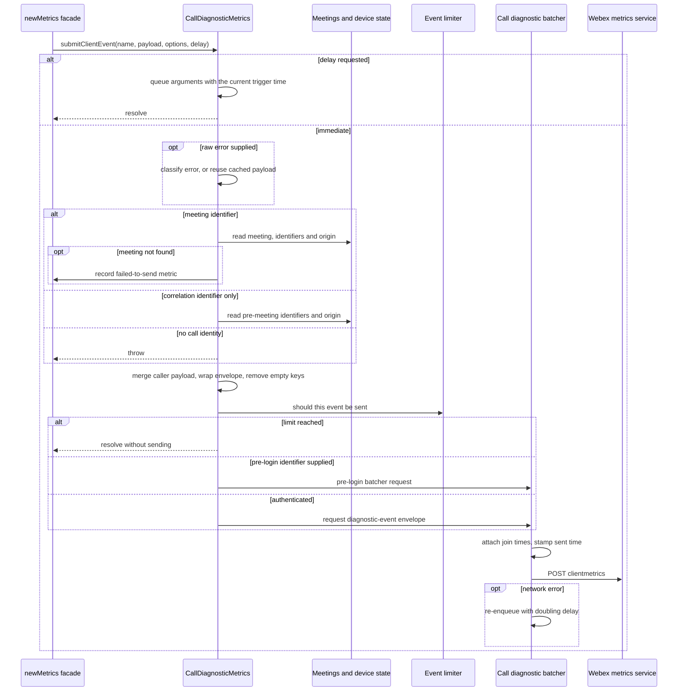
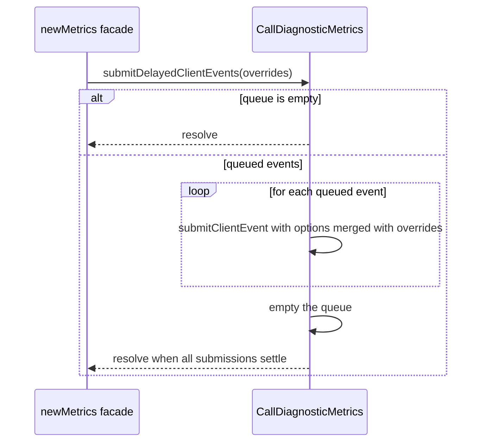
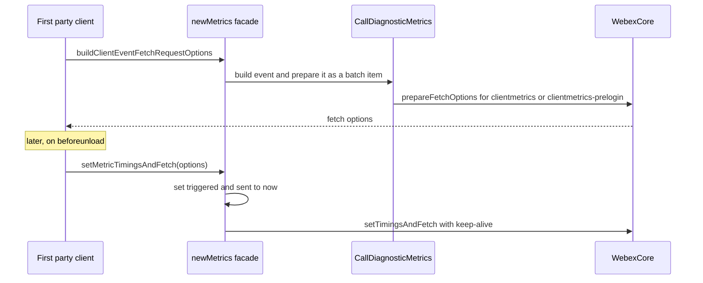
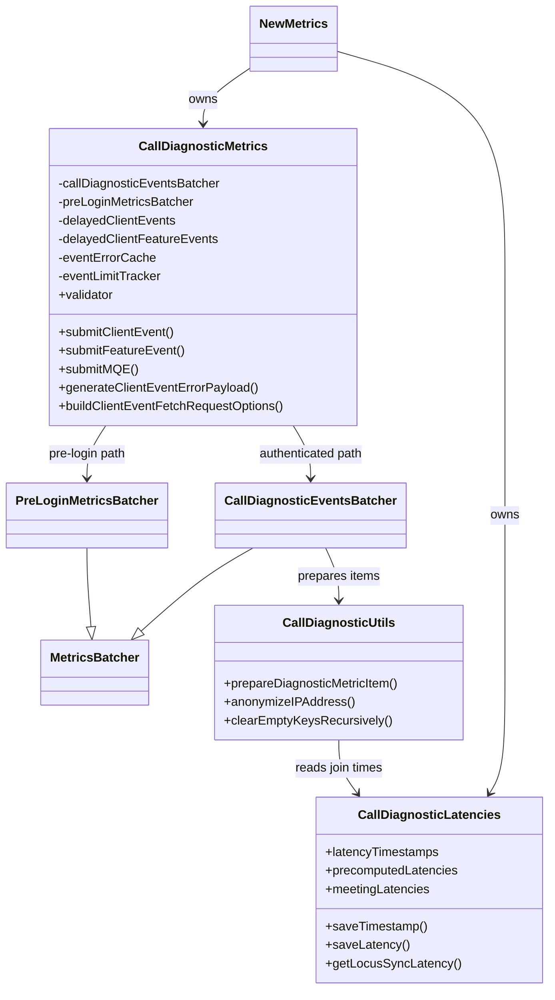
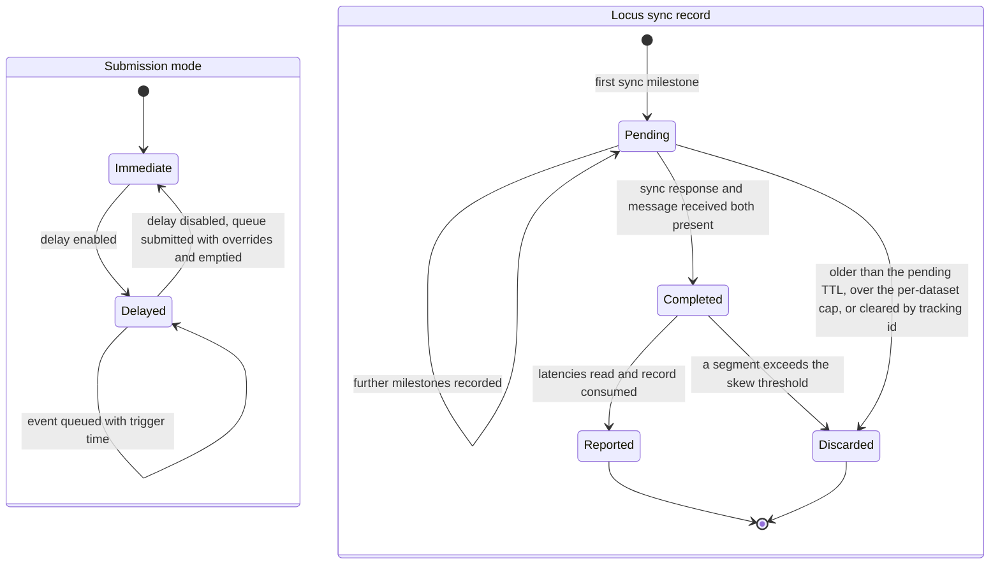

<!-- sdd-generated-metadata
doc_kind: module-spec
generated_from: module-spec@0.3.0
generated_by: claude-code
approved_by: rarajes2@cisco.com
updated_at: 2026-10-07T04:50:31Z
validation_status: pass
-->

# Call Analyzer diagnostics

This source-local document at `src/call-diagnostic/docs/README.md` owns the stable specification for
**the Call Analyzer diagnostics module**. Ground every claim in repository evidence and link to the
[repository architecture](../../../docs/architecture.md) instead of repeating broader facts.

Related context: [documentation index](../../../docs/index.md) ·
[documentation agent instructions](../../../AGENTS.md)

## Metadata

| Field         | Value                                        |
| ------------- | -------------------------------------------- |
| Owner         | Cisco Webex JS SDK — telemetry               |
| Source path   | `src/call-diagnostic/`                       |
| Resource kind | module                                       |
| Status        | Active                                       |
| Last verified | 2026-10-06 at `d6202dd73d`                   |
| Module id     | `call-diagnostic`                            |
| Parent spec   | [`src/docs/README.md`](../../docs/README.md)  |
| Doc kind      | Module spec                                  |
| Coverage score | Pending coverage assessment                 |
| Validation status | pass (2026-10-07; validator runtime 01a1147a-c744-7083-9b15-95e91170c79a; 0 blocking, 0 important, 0 medium, 0 minor; conformance and source-fidelity gates pass, no code/spec mismatches found) |

## Applicability

Sections preceded by an `Include if` comment are conditional. Retain a
conditional section only when source evidence or a confirmed developer answer
satisfies its condition.

| Condition ID                         | Status     | Evidence or reason                                                                                                         | Owned section                 |
| ------------------------------------ | ---------- | -------------------------------------------------------------------------------------------------------------------------- | ----------------------------- |
| `module.has_tiers`                   | N/A        | The repository defines no operational or review tier policy for modules                                                    | Tier                          |
| `module.has_ui`                      | N/A        | The module renders nothing                                                                                                 | UI use-case flow              |
| `module.crosses_service_boundaries`  | Applicable | `src/call-diagnostic/call-diagnostic-metrics-batcher.ts` posts to the Webex metrics service                                 | Cross-boundary use-case flow  |
| `module.holds_client_state`          | Applicable | Latency ledger in `src/call-diagnostic/call-diagnostic-metrics-latencies.ts`; delayed queues and limits in `src/call-diagnostic/call-diagnostic-metrics.ts` | Client state model |
| `module.enforces_domain_rules`       | Applicable | Error-code mapping in `src/call-diagnostic/config.ts`; event limits and sanitization in `src/call-diagnostic/call-diagnostic-metrics.ts` | Business rules and invariants |
| `module.is_concurrent_async`         | Applicable | Batched asynchronous submission and the deferred delayed-event flush                                                       | Concurrency and reactive flow |
| `module.owns_persistence`            | N/A        | No store, schema or migration; every structure is in-memory                                                                | Data, schema, and migration   |
| `module.stateful_transitions`        | Applicable | Delayed and immediate submission modes, and the Locus sync record lifecycle in `src/call-diagnostic/call-diagnostic-metrics-latencies.ts` | State machine |
| `module.exposes_wire_protocol`       | Applicable | The diagnostic event envelope built in `src/call-diagnostic/call-diagnostic-metrics.ts`                                     | Protocol and wire format      |
| `module.ui_multi_screen`             | N/A        | No user interface                                                                                                          | UI flow                       |
| `module.large_data_model`            | N/A        | The event model is owned externally by the Call Analyzer schema and only derived here                                      | Data model                    |
| `module.returns_caller_errors`       | Applicable | Event preparation throws when no call identity is supplied or when client type is unresolved                                | Caller-visible failure modes  |
| `module.module_specific_conventions` | Applicable | Error-classification order and the empty-key sanitization exemption for media quality events                               | Module-specific rules         |
| `module.published_package`           | Applicable | The metrics class, latency class, utilities and config are re-exported from `src/index.ts`                                  | Export stability              |
| `module.embedded_in_host`            | N/A        | Not registered as a plugin; constructed by `src/new-metrics.ts`                                                             | Host integration and theming  |
| `module.has_design_tradeoff`         | Applicable | Delayed submission with preserved trigger time, and a fixed-priority error classification chain                            | Key design trade-off          |
| `module.has_submodules`              | N/A        | Derived from the manifest module tree: this module has no child modules                                                    | Sub-modules                   |

## Evidence register

| Evidence                                                              | What it establishes                                                                                                     |
| --------------------------------------------------------------------- | ----------------------------------------------------------------------------------------------------------------------- |
| `src/call-diagnostic/call-diagnostic-metrics.ts`                      | Event construction, origin and identifier resolution, error-payload generation, event limits, delayed submission and the fetch path |
| `src/call-diagnostic/call-diagnostic-metrics-latencies.ts`            | The latency timestamp ledger, precomputed latencies and the Locus sync latency record lifecycle                           |
| `src/call-diagnostic/call-diagnostic-metrics.util.ts`                  | IP anonymization, empty-key sanitization, error classifiers, build-type detection and the batch preparation step          |
| `src/call-diagnostic/call-diagnostic-metrics-batcher.ts`              | The transport to the client-metrics resource, the send-time stamp and the batch log lines                                  |
| `src/call-diagnostic/config.ts`                                       | Client error codes, the service-to-client error map, the client error payload catalog and the log prefixes                |
| `src/prelogin-metrics-batcher.ts`                                     | The unauthenticated pre-login transport this module uses when a pre-login identifier is supplied                          |
| `src/new-metrics.ts`                                                  | How the façade constructs this module, records timestamps and forwards delay state                                       |
| `test/unit/spec/call-diagnostic/call-diagnostic-metrics.ts`           | Behavioral verification of origin, identifiers, submission routing, event limits, error payloads, delayed events and the fetch path |
| `test/unit/spec/call-diagnostic/call-diagnostic-metrics-latencies.ts`  | Verification of timestamp rules, clamping and Locus sync skew, TTL and cap behavior                                       |
| `test/unit/spec/call-diagnostic/call-diagnostic-metrics.util.ts`       | Verification of sanitization, classifiers, build type and the join-time attachment in batch preparation                   |
| `test/unit/spec/call-diagnostic/call-diagnostic-metrics-batcher.ts`    | Verification of the batcher's request, success and failure paths                                                          |

## Purpose and boundary

- Responsibility: building, enriching and submitting Call Analyzer events — client events, feature
  events and media quality events — and maintaining the latency ledger from which join-time metrics
  are derived.
- In scope: origin and identifier resolution; converting raw errors into Call Analyzer error
  payloads; per-call limits on repetitive events; delayed submission; join-time and media setup
  latency calculation; Locus sync latency records; the authenticated and pre-login submission paths;
  and pre-built fetch options for submission during page unload.
- Out of scope: the event names and payload fields themselves, which the external Call Analyzer
  schema owns; deciding when an event happens, which belongs to the meetings and calling layers;
  and permission enrichment, which the sibling enricher module applies before events reach here.
- Consumers: `src/new-metrics.ts`, which owns the single instance of each class. The meetings plugin
  and the device plugin reach the same instance through the façade, the latter to inject device
  details. The classes, utilities and config are also exported from `src/index.ts`.

## Structure and key files

| Path                                                         | Responsibility                                                                                                                   |
| ------------------------------------------------------------ | -------------------------------------------------------------------------------------------------------------------------------- |
| `src/call-diagnostic/call-diagnostic-metrics.ts`             | The event builder and submitter; authoritative for envelope shape, routing, limits, error payloads and delay handling              |
| `src/call-diagnostic/call-diagnostic-metrics-latencies.ts`   | The latency ledger and every derived join-time calculation; authoritative for which timestamps are kept and how latencies clamp     |
| `src/call-diagnostic/call-diagnostic-metrics.util.ts`         | Stateless helpers and the batch preparation step that attaches join times and origin defaults                                     |
| `src/call-diagnostic/call-diagnostic-metrics-batcher.ts`     | The batcher bound to the client-metrics resource                                                                                  |
| `src/call-diagnostic/config.ts`                              | Error code constants, the service-to-client map and the client error payload catalog                                              |

## Public surface

| Surface                                   | Consumer                                     | Compatibility commitment                                                                                     | Source                                                     |
| ----------------------------------------- | -------------------------------------------- | ------------------------------------------------------------------------------------------------------------ | ---------------------------------------------------------- |
| `submitClientEvent`                       | `src/new-metrics.ts`                         | Queues when delay is requested; otherwise builds, limits and submits. Throws when no call identity is given   | `src/call-diagnostic/call-diagnostic-metrics.ts`           |
| `submitFeatureEvent`                      | `src/new-metrics.ts`                         | In-meeting only; submitted as a business-typed envelope                                                      | `src/call-diagnostic/call-diagnostic-metrics.ts`           |
| `submitMQE`                               | `src/new-metrics.ts`                         | In-meeting only; exempt from empty-key sanitization                                                          | `src/call-diagnostic/call-diagnostic-metrics.ts`           |
| `submitDelayedClientEvents`, `submitDelayedClientFeatureEvents` | `src/new-metrics.ts`     | Submit every queued event with optional overrides, then empty the queue                                      | `src/call-diagnostic/call-diagnostic-metrics.ts`           |
| `buildClientEventFetchRequestOptions`     | `src/new-metrics.ts`                         | Returns fetch options for the client-metrics or pre-login resource without submitting                        | `src/call-diagnostic/call-diagnostic-metrics.ts`           |
| `getErrorPayloadForClientErrorCode`, `generateClientEventErrorPayload`, `isServiceErrorExpected` | Meetings plugin, through the façade | Map raw errors and codes to catalog payloads; the second caches by error object | `src/call-diagnostic/call-diagnostic-metrics.ts` |
| Event-limit, opt-out, Mercury status and device setters | Meetings and device plugins, through the façade | Mutate per-instance state consulted at build time                                                | `src/call-diagnostic/call-diagnostic-metrics.ts`           |
| `validator`                               | Overridable by callers                        | Called with each built event before submission; the default accepts everything                               | `src/call-diagnostic/call-diagnostic-metrics.ts`           |
| `CallDiagnosticLatencies`                 | `src/new-metrics.ts`, meetings plugin         | Timestamp, latency and Locus sync operations plus the derived join-time getters                              | `src/call-diagnostic/call-diagnostic-metrics-latencies.ts` |
| `CALL_DIAGNOSTIC_CONFIG`, `CallDiagnosticUtils` | Meetings plugin                          | Re-exported constants and helpers; codes and catalog entries are a wire-level contract                       | `src/index.ts`                                             |

Event names and payload fields are not restated here; they are derived from the external Call
Analyzer schema through `src/metrics.types.ts`.

## Dependencies

| Dependency                                  | Why it is required                                                                 | Failure behavior                                                                                         |
| ------------------------------------------- | ---------------------------------------------------------------------------------- | -------------------------------------------------------------------------------------------------------- |
| `@webex/webex-core` `StatelessWebexPlugin`, `WebexPlugin`, `Batcher` | Base classes and the batched transport                      | Network errors re-enqueue with backoff in the parent batcher; other errors reject the queued item          |
| Meetings plugin, through the SDK instance   | Basic meeting information, geo hint, configuration and stats analyzer                | A missing meeting records a failed-to-send client metric and the event is not built                       |
| Device plugin, injected via `setDeviceInfo` | Device URL, organization, user and installation identifiers                          | Absent device falls back to the credentials user identifier, then to the pre-login identifier              |
| `src/prelogin-metrics-batcher.ts`           | The unauthenticated pre-login transport                                             | Rejects when no pre-login identifier was saved                                                            |
| `src/metrics.js` `submitClientMetrics`      | Records the failed-to-send metric when a meeting cannot be found                    | Fire-and-forget; its result is not observed                                                               |
| `@webex/event-dictionary-ts`, through `src/metrics.types.ts` | The authoritative event schema                                   | A schema change surfaces at build time                                                                    |
| `ip-anonymize`, `lodash`, `uuid`            | Address truncation, deep merge and empty-key checks, event identifiers               | A failed anonymization yields undefined and the field is dropped                                          |

## Requirements

| ID        | WHAT                                                                                                                                         | WHY                                                                                                                                                          | Source evidence                                              | Test or example evidence                                              | Assumptions or gaps | Confidence |
| --------- | -------------------------------------------------------------------------------------------------------------------------------------------- | ------------------------------------------------------------------------------------------------------------------------------------------------------------ | ------------------------------------------------------------ | --------------------------------------------------------------------- | ------------------- | ---------- |
| `MOD-001` | A client event is built in-meeting when a meeting identifier is supplied, pre-meeting when only a correlation identifier is supplied, and otherwise preparation throws | Call Analyzer correlates every event to one call; an event with no call identity cannot be attributed                                     | `src/call-diagnostic/call-diagnostic-metrics.ts`             | `test/unit/spec/call-diagnostic/call-diagnostic-metrics.ts`           | none                | Present    |
| `MOD-002` | When a meeting identifier is supplied but the meeting cannot be found, a failed-to-send client metric is recorded instead of the event            | The lost event must remain visible as a count rather than disappearing silently                                                                              | `src/call-diagnostic/call-diagnostic-metrics.ts`             | `test/unit/spec/call-diagnostic/call-diagnostic-metrics.ts`           | none                | Present    |
| `MOD-003` | Origin requires a client type and sub-client type, from options or from meetings configuration, and throws when neither supplies both           | Call Analyzer segments every event by client; an unclassified event is unusable                                                                              | `src/call-diagnostic/call-diagnostic-metrics.ts`             | `test/unit/spec/call-diagnostic/call-diagnostic-metrics.ts`           | none                | Present    |
| `MOD-004` | Public and local network prefixes are anonymized before they enter the origin                                                                  | Raw IP addresses are personal data                                                                                                                           | `src/call-diagnostic/call-diagnostic-metrics.util.ts`         | `test/unit/spec/call-diagnostic/call-diagnostic-metrics.ts`           | none                | Present    |
| `MOD-005` | The user identifier resolves from the device, then from credentials, then from the pre-login identifier                                         | An event must carry the most authoritative identity available at the time it fires, including before device registration                                    | `src/call-diagnostic/call-diagnostic-metrics.ts`             | `test/unit/spec/call-diagnostic/call-diagnostic-metrics.ts`           | none                | Present    |
| `MOD-006` | Empty keys are removed from client and feature events but not from media quality events                                                         | Call Analyzer rejects empty properties, while media quality intervals legitimately carry zeros and empty arrays that must be preserved                        | `src/call-diagnostic/call-diagnostic-metrics.ts`             | `test/unit/spec/call-diagnostic/call-diagnostic-metrics.ts`           | none                | Present    |
| `MOD-007` | Media render, receive and transmit start/stop events are sent at most once per correlation identifier and media type, or per share instance for share media | These events can fire repeatedly during one call and would otherwise flood Call Analyzer with duplicates                                             | `src/call-diagnostic/call-diagnostic-metrics.ts`             | `test/unit/spec/call-diagnostic/call-diagnostic-metrics.ts`           | none                | Present    |
| `MOD-008` | ROAP message sent/received events are sent at most once per correlation identifier and ROAP message type                                       | Repeated renegotiation would otherwise produce duplicate events of no extra diagnostic value                                                                 | `src/call-diagnostic/call-diagnostic-metrics.ts`             | `test/unit/spec/call-diagnostic/call-diagnostic-metrics.ts`           | none                | Present    |
| `MOD-009` | Event limits can be cleared for all calls or for one correlation identifier only                                                               | A rejoin must reset its own limits without unblocking another concurrent call's limited events                                                               | `src/call-diagnostic/call-diagnostic-metrics.ts`             | `test/unit/spec/call-diagnostic/call-diagnostic-metrics.ts`           | none                | Present    |
| `MOD-010` | A raw error is classified in fixed priority order — browser media error, SDP offer failure, mapped service code, Locus 429/503, Locus service code, meeting info, network, unauthorized, then unknown | The first matching classifier wins, so the most specific diagnosis must be tried first                                    | `src/call-diagnostic/call-diagnostic-metrics.ts`             | `test/unit/spec/call-diagnostic/call-diagnostic-metrics.ts`           | none                | Present    |
| `MOD-011` | A Locus HTTP 429 or 503 maps to the rate-limited or unavailable client code only when no earlier classifier matched and the raw error's request `uri` or `url` contains the literal substring `locus` | The same HTTP status from another service has a different meaning and must not be reported as a Locus condition; the check is a substring match, not a parsed host comparison | `src/call-diagnostic/call-diagnostic-metrics.ts` | `test/unit/spec/call-diagnostic/call-diagnostic-metrics.ts` | Any URL containing `locus` anywhere, including in a path or query, also matches | Present |
| `MOD-012` | A generated error payload is cached per raw error object                                                                                       | The same error is often reported by several events in one failure; reclassifying it each time is wasted work and the cache flag is logged for diagnosis      | `src/call-diagnostic/call-diagnostic-metrics.ts`             | `test/unit/spec/call-diagnostic/call-diagnostic-metrics.ts`           | none                | Present    |
| `MOD-013` | With delay enabled, client and feature events are queued with their original trigger time and submitted later with optional overrides             | Events raised before the call's identity is known can be submitted once it is, without losing when they actually happened                                    | `src/call-diagnostic/call-diagnostic-metrics.ts`             | `test/unit/spec/call-diagnostic/call-diagnostic-metrics.ts`           | none                | Present    |
| `MOD-014` | A client event with a pre-login identifier is submitted through the unauthenticated pre-login transport                                         | Join flows that start before sign-in must still be diagnosable                                                                                               | `src/call-diagnostic/call-diagnostic-metrics.ts`             | `test/unit/spec/call-diagnostic/call-diagnostic-metrics.ts`           | none                | Present    |
| `MOD-015` | Client events are typed as diagnostic events and feature events as business events in the submitted envelope                                   | Ingestion routes the two families to different stores                                                                                                       | `src/call-diagnostic/call-diagnostic-metrics.ts`             | `test/unit/spec/call-diagnostic/call-diagnostic-metrics.ts`           | none                | Present    |
| `MOD-016` | Batch preparation attaches the join-time and media setup latencies that belong to each milestone event                                          | Join-time metrics are only meaningful on the milestone that ends the measured span                                                                           | `src/call-diagnostic/call-diagnostic-metrics.util.ts`         | `test/unit/spec/call-diagnostic/call-diagnostic-metrics.util.ts`      | none                | Present    |
| `MOD-017` | Repeating milestones keep only their first timestamp, and a new local SDP resets the remote SDP timestamp                                       | Retries and renegotiation would otherwise overwrite the start of the span being measured                                                                     | `src/call-diagnostic/call-diagnostic-metrics-latencies.ts`   | `test/unit/spec/call-diagnostic/call-diagnostic-metrics-latencies.ts` | none                | Present    |
| `MOD-018` | Derived latencies are clamped to a non-negative 32-bit range                                                                                    | Clock jumps and missing timestamps must not produce negative or overflowing values in ingestion                                                              | `src/call-diagnostic/call-diagnostic-metrics-latencies.ts`   | `test/unit/spec/call-diagnostic/call-diagnostic-metrics-latencies.ts` | none                | Present    |
| `MOD-019` | A Locus sync record with any segment beyond the skew threshold is discarded; incomplete records expire after their TTL and are capped per dataset | Sleep and wake clock jumps corrupt sync timings, and churn must not grow memory without bound                                                               | `src/call-diagnostic/call-diagnostic-metrics-latencies.ts`   | `test/unit/spec/call-diagnostic/call-diagnostic-metrics-latencies.ts` | none                | Present    |
| `MOD-020` | Fetch options can be pre-built for a client event and later re-timed so triggered and sent times equal the moment of submission                  | During page unload the normal asynchronous path cannot complete; a keep-alive fetch must fire immediately with correct times                                 | `src/call-diagnostic/call-diagnostic-metrics.util.ts`         | `test/unit/spec/call-diagnostic/call-diagnostic-metrics.ts`           | none                | Present    |
| `MOD-021` | A service error code is reported as expected only when its mapped catalog payload is in the expected category                                   | Callers use this to keep expected failures out of error dashboards                                                                                           | `src/call-diagnostic/call-diagnostic-metrics.ts`             | `test/unit/spec/call-diagnostic/call-diagnostic-metrics.ts`           | none                | Present    |

## Design overview

The module is three cooperating pieces owned by the façade: an event builder, a latency ledger, and
a batcher.

**The event builder** (`src/call-diagnostic/call-diagnostic-metrics.ts`) turns a name, a partial
payload and options into a complete Call Analyzer event. Every event family goes through the same
two stages: a family-specific object is built — in-meeting, pre-meeting or media-quality — and is
then wrapped by `prepareDiagnosticEvent`, which adds the event identifier, version, origin, trigger
time and sender country, and sanitizes empty keys for every family except media quality. Caller
payloads are deep-merged last, so a caller can override any computed field.

Origin and identifiers are resolved from the host on every event rather than cached, because they
change during a call: the meeting gains a Locus URL and conference identifiers, the device registers,
the user signs in. The identifier chain prefers the most authoritative source available and falls
back gracefully down to a pre-login identifier.

Errors are classified once and cached. `generateClientEventErrorPayload` walks a fixed-priority chain
of classifiers and stops at the first match; each match resolves a client error code that indexes the
payload catalog in `src/call-diagnostic/config.ts`. The order is the design: the most specific
diagnosis is tried first and the unknown code is only the last resort.

Submission is gated twice. Delay mode queues the call arguments, not a built event, together with
the original trigger time, so the event is built later with the identity known by then. The event
limiter then suppresses repeats of a small set of high-frequency media and ROAP events per call.

**The latency ledger** (`src/call-diagnostic/call-diagnostic-metrics-latencies.ts`) records a
timestamp for every event name the façade sees, plus precomputed latencies measured elsewhere. Join
time metrics are differences between pairs of timestamps, clamped, and are attached to the milestone
events during batch preparation rather than at build time. Locus sync latencies are a separate,
record-per-sync lifecycle keyed by meeting, dataset and tracking identifier, with skew rejection, a
pending TTL and a per-dataset cap.

**The batcher** (`src/call-diagnostic/call-diagnostic-metrics-batcher.ts`) inherits queueing and
backoff from `src/batcher.js`, runs the shared preparation step, stamps the send time on each item and
posts to the client-metrics resource.

## Data flow and sequence coverage

Collection is an in-process method call; submission is a batched HTTP POST through the host request
pipeline. There are four operation groups, diagrammed separately where actor order or outcome differs.

| Operation group                  | Entry and outcome                                                                                                   | Diagram or evidence                                                     | Failure and recovery coverage                                                                                   |
| -------------------------------- | ------------------------------------------------------------------------------------------------------------------- | ----------------------------------------------------------------------- | --------------------------------------------------------------------------------------------------------------- |
| Submit a client or feature event | The façade forwards an event; it is queued when delayed, otherwise built, limited and batched                        | First sequence diagram below                                            | Missing call identity throws; missing meeting records a failed-to-send metric; a limited event resolves unsent   |
| Flush delayed events             | Delay is disabled; every queued event is re-submitted with overrides and the queue empties                           | Second sequence diagram below                                           | Each re-submission follows the first group's failure paths independently                                        |
| Submit a media quality event     | The façade forwards interval statistics for a meeting; the event is built unsanitized and batched                    | `src/call-diagnostic/call-diagnostic-metrics.ts`                        | No meeting identifier throws; a missing meeting records a failed-to-send metric                                  |
| Unload-time fetch                | Options are pre-built, then re-timed and fired with a keep-alive fetch                                               | Third sequence diagram below                                            | Not retried; the page is unloading                                                                               |

## Class and component relationships

## Use cases and flows

| Use case | Actor or caller        | Primary steps and outcome                                                                                                               | Failure or boundary behavior                                                                      | Evidence                                                                                                                      |
| -------- | ---------------------- | --------------------------------------------------------------------------------------------------------------------------------------- | ------------------------------------------------------------------------------------------------- | ----------------------------------------------------------------------------------------------------------------------------- |
| `UC-001` | Meetings plugin        | A join milestone event is submitted in-meeting; identifiers and origin are resolved, the event is batched and join times are attached      | A missing meeting records a failed-to-send metric instead                                          | `src/call-diagnostic/call-diagnostic-metrics.ts`, `test/unit/spec/call-diagnostic/call-diagnostic-metrics.ts`                 |
| `UC-002` | Meetings plugin        | A join fails with a raw error; the error is classified into a catalog payload and attached to the event                                   | An unrecognized error falls back to the unknown code, carrying the service code and name            | `src/call-diagnostic/call-diagnostic-metrics.ts`, `test/unit/spec/call-diagnostic/call-diagnostic-metrics.ts`                 |
| `UC-003` | Media layer            | Media transmit start fires repeatedly for one call and media type; only the first is sent                                                | Clearing limits for the correlation identifier allows the next one through                          | `src/call-diagnostic/call-diagnostic-metrics.ts`, `test/unit/spec/call-diagnostic/call-diagnostic-metrics.ts`                 |
| `UC-004` | First party client     | Events fire before the call identity is known with delay enabled; disabling delay submits them with overrides and original trigger times   | An empty queue submits nothing                                                                      | `src/call-diagnostic/call-diagnostic-metrics.ts`, `test/unit/spec/call-diagnostic/call-diagnostic-metrics.ts`                 |
| `UC-005` | Guest before sign-in   | A pre-join event carries a pre-login identifier and is posted to the unauthenticated resource                                            | The pre-login batcher rejects when no identifier is saved                                           | `src/call-diagnostic/call-diagnostic-metrics.ts`, `test/unit/spec/call-diagnostic/call-diagnostic-metrics.ts`                 |
| `UC-006` | First party client     | The tab is closing; pre-built fetch options are re-timed and fired with keep-alive                                                       | No retry; the page is unloading                                                                     | `src/call-diagnostic/call-diagnostic-metrics.util.ts`, `test/unit/spec/call-diagnostic/call-diagnostic-metrics.util.ts`       |
| `UC-007` | Meetings plugin        | Locus sync milestones are recorded; a complete record yields sync latencies                                                              | A skewed record is discarded; an incomplete one expires after its TTL                               | `src/call-diagnostic/call-diagnostic-metrics-latencies.ts`, `test/unit/spec/call-diagnostic/call-diagnostic-metrics-latencies.ts` |

<!-- Include if: the module calls another service or crosses an event or network boundary. [condition-id: module.crosses_service_boundaries] -->

### Cross-boundary use-case flow

- Boundary and transport: HTTPS POST to the `metrics` service, resource `clientmetrics`, or
  `clientmetrics-prelogin` with authorization disabled and the pre-login header. The unload path uses
  a keep-alive fetch prepared by the host.
- Ordering: items are batched in arrival order; no cross-batch ordering is promised. Each event
  carries its own trigger time, and delayed events keep the time they were first raised.
- Compatibility: event names and fields are owned by the external Call Analyzer schema; error codes
  and catalog entries in `src/call-diagnostic/config.ts` are a wire-level contract with Call Analyzer.
- Timeout and retry: network errors re-enqueue with doubling delay up to the configured plateau in the
  parent batcher; other HTTP errors reject the item and are logged with a batch identifier.
- Recovery: none beyond batcher backoff. A rejected item is lost.

<!-- Include if: the module holds client-side state. [condition-id: module.holds_client_state] -->

## Client state model

| State or slice              | Owner                      | Initial state | Transition triggers                                                         | Reset or persistence boundary                                              |
| --------------------------- | -------------------------- | ------------- | --------------------------------------------------------------------------- | -------------------------------------------------------------------------- |
| Latency timestamps          | `CallDiagnosticLatencies`  | Empty map     | Every event name recorded through the façade                                | Cleared by the internal join-latency reset event                           |
| Precomputed latencies       | `CallDiagnosticLatencies`  | Empty map     | Latencies measured elsewhere and saved, optionally accumulated               | Cleared with the timestamps                                                |
| Locus sync records          | `CallDiagnosticLatencies`  | Empty map     | Sync milestones per meeting, dataset and tracking identifier                 | Consumed on completion; discarded on skew; pruned by TTL; capped per dataset |
| Delayed client and feature events | `CallDiagnosticMetrics` | Empty arrays | Submissions while delay is enabled                                          | Emptied when delayed events are submitted                                  |
| Event-limit counters        | `CallDiagnosticMetrics`    | Empty map     | A limited event is sent                                                     | Cleared wholesale or per correlation identifier                            |
| Error payload cache         | `CallDiagnosticMetrics`    | Empty `WeakMap` | A raw error is classified                                                  | Garbage-collected with the error, or cleared explicitly                    |
| Device, opt-out and Mercury status | `CallDiagnosticMetrics` | Unset or false | Setters called by the device and meetings plugins                       | Instance lifetime                                                          |

<!-- Include if: the module enforces domain rules or entity invariants. [condition-id: module.enforces_domain_rules] -->

## Business rules and invariants

| ID        | Invariant                                                                                          | WHY                                                                                       | Enforcement source                                          | Test evidence                                                         |
| --------- | -------------------------------------------------------------------------------------------------- | ----------------------------------------------------------------------------------------- | ----------------------------------------------------------- | --------------------------------------------------------------------- |
| `INV-001` | No event is built without a call identity and a classified client                                   | Call Analyzer cannot attribute or segment such an event                                    | `src/call-diagnostic/call-diagnostic-metrics.ts`            | `test/unit/spec/call-diagnostic/call-diagnostic-metrics.ts`           |
| `INV-002` | No raw IP address reaches the origin                                                               | IP addresses are personal data                                                             | `src/call-diagnostic/call-diagnostic-metrics.util.ts`        | `test/unit/spec/call-diagnostic/call-diagnostic-metrics.ts`           |
| `INV-003` | Every classified error resolves to a catalog payload, ending in the unknown code                    | An error event without an error code is undiagnosable                                      | `src/call-diagnostic/config.ts`                             | `test/unit/spec/call-diagnostic/call-diagnostic-metrics.ts`           |
| `INV-004` | Limited events are sent at most once per limit key                                                  | Prevents duplicate high-frequency events per call                                          | `src/call-diagnostic/call-diagnostic-metrics.ts`            | `test/unit/spec/call-diagnostic/call-diagnostic-metrics.ts`           |
| `INV-005` | Media quality events are never empty-key sanitized                                                  | Zero and empty interval values are meaningful                                              | `src/call-diagnostic/call-diagnostic-metrics.ts`            | `test/unit/spec/call-diagnostic/call-diagnostic-metrics.ts`           |
| `INV-006` | Derived latencies are clamped to a non-negative 32-bit integer range                                 | Ingestion must not receive negative or overflowing durations                               | `src/call-diagnostic/call-diagnostic-metrics-latencies.ts`  | `test/unit/spec/call-diagnostic/call-diagnostic-metrics-latencies.ts` |
| `INV-007` | Locus sync records per meeting and dataset never exceed the cap                                     | Bounds memory under sync churn                                                             | `src/call-diagnostic/call-diagnostic-metrics-latencies.ts`  | `test/unit/spec/call-diagnostic/call-diagnostic-metrics-latencies.ts` |

<!-- Include if: the module is concurrent, asynchronous, reactive, or event-driven. [condition-id: module.is_concurrent_async] -->

## Concurrency and reactive flow

- Execution model: synchronous event building on the caller's turn, then asynchronous batched
  submission through the `Batcher` queue inherited from `src/batcher.js`.
- Ordering guarantees: none across batches. Within a batch items keep arrival order. Delayed events
  are re-submitted in queue order but settle independently.
- Idempotency and retry: each event has a fresh identifier, so a re-enqueued item is the same event,
  not a duplicate. The event limiter is the only deduplication, and it is per limit key.
- Shared-state protection: single-threaded. All maps are mutated synchronously on the caller's turn.
- Blocking restrictions: event building must stay synchronous so the unload path can prepare options
  in time; only the transport is asynchronous.

<!-- Include if: the module has non-trivial state transitions. [condition-id: module.stateful_transitions] -->

## State machine

Two lifecycles matter: the façade-controlled submission mode, and one Locus sync latency record.

Rejected transitions: delayed events are never submitted while the façade is not ready; a sync record
missing a required milestone is never reported, it returns undefined and is cleared.

<!-- Include if: callers depend on a wire protocol or serialized format. [condition-id: module.exposes_wire_protocol] -->

## Protocol and wire format

| Message or frame             | Version | Producer or serializer                                    | Consumer or parser        | Compatibility and ordering rule                                                                 |
| ---------------------------- | ------- | --------------------------------------------------------- | ------------------------- | ----------------------------------------------------------------------------------------------- |
| Diagnostic event envelope    | `1`     | `src/call-diagnostic/call-diagnostic-metrics.ts`          | Webex Call Analyzer       | Fields are owned by the external schema; the envelope type tag is `diagnostic-event`            |
| Feature event envelope       | `1`     | `src/call-diagnostic/call-diagnostic-metrics.ts`          | Webex business metrics    | Same envelope with the `business` type tag                                                      |
| Client error payload         | n/a     | `src/call-diagnostic/config.ts`                           | Webex Call Analyzer       | Codes and categories are a shared vocabulary; changing a mapping changes dashboards             |
| Batch body                   | n/a     | `src/call-diagnostic/call-diagnostic-metrics-batcher.ts`   | Webex metrics service     | A `metrics` array; the send time is stamped per item immediately before posting                 |

The envelope is declared through `src/metrics.types.ts`; it is not restated here.

<!-- Include if: the module returns or raises errors callers must handle. [condition-id: module.returns_caller_errors] -->

## Caller-visible failure modes

| Condition                                             | Signal or result                                  | Caller behavior                                     | Retry or recovery                            | Evidence                                                    |
| ----------------------------------------------------- | ------------------------------------------------- | --------------------------------------------------- | -------------------------------------------- | ----------------------------------------------------------- |
| Neither meeting nor correlation identifier supplied    | Synchronous `Error` from event preparation          | Supply call identity before submitting               | None; caller bug                             | `src/call-diagnostic/call-diagnostic-metrics.ts`            |
| Client type or sub-client type unresolved              | Synchronous `Error` from origin resolution          | Configure the meetings metrics client types           | None; configuration bug                      | `src/call-diagnostic/call-diagnostic-metrics.ts`            |
| Correlation identifier resolves to nothing             | Synchronous `Error` from identifier resolution      | Supply a correlation identifier                       | None                                         | `src/call-diagnostic/call-diagnostic-metrics.ts`            |
| Media quality or feature event without meeting identifier | Synchronous `Error`                              | Only submit these in-meeting                          | None                                         | `src/call-diagnostic/call-diagnostic-metrics.ts`            |
| Meeting identifier supplied but meeting missing        | No throw; failed-to-send client metric recorded     | None required                                         | The event is dropped                          | `src/call-diagnostic/call-diagnostic-metrics.ts`            |
| Batch transport rejects                                | Rejected promise from the returned submission       | Callers through the façade normally ignore it         | Network errors re-enqueue with backoff first  | `src/call-diagnostic/call-diagnostic-metrics-batcher.ts`    |

## Pitfalls and constraints

- The error classifier order is the behavior. Inserting a classifier changes which code wins for
  errors matching more than one; add a test for the overlap.
- The Locus 429/503 mapping checks that the raw error's request `uri` (or `url`) contains the literal
  substring `locus`. It does not parse or validate the host, so any URL with `locus` in its path or
  query also matches. Status codes alone are not enough, and a 429 whose URL lacks the substring stays
  unmapped.
- Event-limit keys are colon-joined with the correlation identifier as the second token;
  `clearEventLimitsForCorrelationId` depends on that layout.
- Delay mode stores call arguments, not built events, so identity and origin are resolved at flush
  time. Only the trigger time is captured at queue time.
- `getIdentifiers` defaults the correlation identifier to the string `unknown`, which Call Analyzer's
  UUID validation rejects; the limiter treats `unknown` as unlimited for the same reason.
- Device details are injected by the device plugin to avoid a circular import; do not import the
  device plugin here.

<!-- Include if: the module has conventions beyond repository-wide rules. [condition-id: module.module_specific_conventions] -->

## Module-specific rules

- Do: add new error mappings to `src/call-diagnostic/config.ts` as code-to-payload entries rather than
  as branches in the classifier.
- Do: log through the module prefix constants in `src/call-diagnostic/config.ts`.
- Do: keep media quality events out of empty-key sanitization.
- Do not: hand-declare event names or payload fields; derive them from `src/metrics.types.ts`.
- Do not: make event building asynchronous; the unload fetch path depends on it being synchronous.

<!-- Include if: the module is published or consumed as a package. [condition-id: module.published_package] -->

## Export stability

| Export or entry point     | Consumer                           | Stability                         | Versioning and deprecation rule                                                       | Declaration or API report |
| ------------------------- | ---------------------------------- | --------------------------------- | ------------------------------------------------------------------------------------- | ------------------------- |
| `CallDiagnosticMetrics`   | Meetings plugin, via the façade    | Internal plugin export; additive   | Public method names are consumed across the monorepo; change with consumers together   | `src/index.ts`            |
| `CallDiagnosticLatencies` | Meetings plugin                    | Internal plugin export; additive   | Getter names feed join-time fields; renames are breaking                                | `src/index.ts`            |
| `CallDiagnosticUtils`     | Meetings plugin                    | Internal plugin export             | Helpers re-exported as a namespace                                                      | `src/index.ts`            |
| `CALL_DIAGNOSTIC_CONFIG`  | Meetings plugin                    | Internal plugin export             | Codes are a wire contract with Call Analyzer                                            | `src/index.ts`            |

<!-- Include if: the module has a non-obvious design trade-off consumers or maintainers must preserve. [condition-id: module.has_design_tradeoff] -->

## Key design trade-off

| Chosen trade-off                                                                      | Preserved invariant or benefit                                                              | Cost or limitation                                                                                   | Decision evidence                                          |
| ------------------------------------------------------------------------------------- | ------------------------------------------------------------------------------------------- | ---------------------------------------------------------------------------------------------------- | ---------------------------------------------------------- |
| Queue call arguments in delay mode and build at flush time, preserving trigger time     | Events raised before identity is known are attributed correctly and keep their real timing    | Origin and host state reflect flush time, not trigger time                                            | `src/call-diagnostic/call-diagnostic-metrics.ts`           |
| A fixed-priority error classifier chain ending in an unknown code                      | Every error yields exactly one deterministic code                                            | Overlapping classifiers silently prefer the earlier one                                              | `src/call-diagnostic/call-diagnostic-metrics.ts`           |
| Attach join times during batch preparation rather than at build time                   | Latencies use the most complete ledger available at send time                                 | Unload-path events built early may carry incomplete join times                                       | `src/call-diagnostic/call-diagnostic-metrics.util.ts`       |
| Discard skewed Locus sync records instead of reporting them                            | Sleep and wake clock jumps never pollute sync latency data                                    | Some genuine long syncs are lost                                                                     | `src/call-diagnostic/call-diagnostic-metrics-latencies.ts` |

## Verification

| Requirement or invariant      | Test level | Positive evidence                                                      | Negative or boundary evidence                                          | Gap  |
| ----------------------------- | ---------- | ---------------------------------------------------------------------- | ---------------------------------------------------------------------- | ---- |
| `MOD-001` / `INV-001`         | Unit       | `test/unit/spec/call-diagnostic/call-diagnostic-metrics.ts`            | `test/unit/spec/call-diagnostic/call-diagnostic-metrics.ts`            | none |
| `MOD-002`                     | Unit       | `test/unit/spec/call-diagnostic/call-diagnostic-metrics.ts`            | `test/unit/spec/call-diagnostic/call-diagnostic-metrics.ts`            | none |
| `MOD-003`                     | Unit       | `test/unit/spec/call-diagnostic/call-diagnostic-metrics.ts`            | `test/unit/spec/call-diagnostic/call-diagnostic-metrics.ts`            | none |
| `MOD-004` / `INV-002`         | Unit       | `test/unit/spec/call-diagnostic/call-diagnostic-metrics.ts`            | none found                                                             | No case asserts an unanonymizable address is dropped |
| `MOD-005`                     | Unit       | `test/unit/spec/call-diagnostic/call-diagnostic-metrics.ts`            | `test/unit/spec/call-diagnostic/call-diagnostic-metrics.ts`            | none |
| `MOD-006` / `INV-005`         | Unit       | `test/unit/spec/call-diagnostic/call-diagnostic-metrics.ts`            | `test/unit/spec/call-diagnostic/call-diagnostic-metrics.util.ts`       | none |
| `MOD-007`, `MOD-008` / `INV-004` | Unit    | `test/unit/spec/call-diagnostic/call-diagnostic-metrics.ts`            | `test/unit/spec/call-diagnostic/call-diagnostic-metrics.ts`            | none |
| `MOD-009`                     | Unit       | `test/unit/spec/call-diagnostic/call-diagnostic-metrics.ts`            | `test/unit/spec/call-diagnostic/call-diagnostic-metrics.ts`            | none |
| `MOD-010` / `INV-003`         | Unit       | `test/unit/spec/call-diagnostic/call-diagnostic-metrics.ts`            | `test/unit/spec/call-diagnostic/call-diagnostic-metrics.ts`            | none |
| `MOD-011`                     | Unit       | `test/unit/spec/call-diagnostic/call-diagnostic-metrics.ts`            | `test/unit/spec/call-diagnostic/call-diagnostic-metrics.ts`            | none |
| `MOD-012`                     | Unit       | `test/unit/spec/call-diagnostic/call-diagnostic-metrics.ts`            | none found                                                             | none |
| `MOD-013`                     | Unit       | `test/unit/spec/call-diagnostic/call-diagnostic-metrics.ts`            | `test/unit/spec/call-diagnostic/call-diagnostic-metrics.ts`            | none |
| `MOD-014`                     | Unit       | `test/unit/spec/call-diagnostic/call-diagnostic-metrics.ts`            | `test/unit/spec/prelogin-metrics-batcher.ts`                           | none |
| `MOD-015`                     | Unit       | `test/unit/spec/call-diagnostic/call-diagnostic-metrics.ts`            | none found                                                             | none |
| `MOD-016`                     | Unit       | `test/unit/spec/call-diagnostic/call-diagnostic-metrics.util.ts`       | `test/unit/spec/call-diagnostic/call-diagnostic-metrics.util.ts`       | none |
| `MOD-017`                     | Unit       | `test/unit/spec/call-diagnostic/call-diagnostic-metrics-latencies.ts`  | `test/unit/spec/call-diagnostic/call-diagnostic-metrics-latencies.ts`  | none |
| `MOD-018` / `INV-006`         | Unit       | `test/unit/spec/call-diagnostic/call-diagnostic-metrics-latencies.ts`  | `test/unit/spec/call-diagnostic/call-diagnostic-metrics-latencies.ts`  | none |
| `MOD-019` / `INV-007`         | Unit       | `test/unit/spec/call-diagnostic/call-diagnostic-metrics-latencies.ts`  | `test/unit/spec/call-diagnostic/call-diagnostic-metrics-latencies.ts`  | none |
| `MOD-020`                     | Unit       | `test/unit/spec/call-diagnostic/call-diagnostic-metrics.ts`            | `test/unit/spec/call-diagnostic/call-diagnostic-metrics.util.ts`       | none |
| `MOD-021`                     | Unit       | `test/unit/spec/call-diagnostic/call-diagnostic-metrics.ts`            | none found                                                             | No case asserts a non-expected code returns false |
| Batcher success and failure   | Unit       | `test/unit/spec/call-diagnostic/call-diagnostic-metrics-batcher.ts`    | `test/unit/spec/call-diagnostic/call-diagnostic-metrics-batcher.ts`    | none |

Record coverage gaps explicitly and link follow-up work. A module specification
is complete only when its public surface, invariants, failure modes, and test
evidence agree with the implementation.
