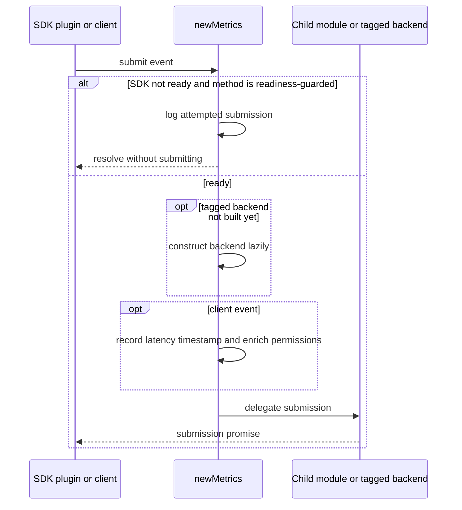
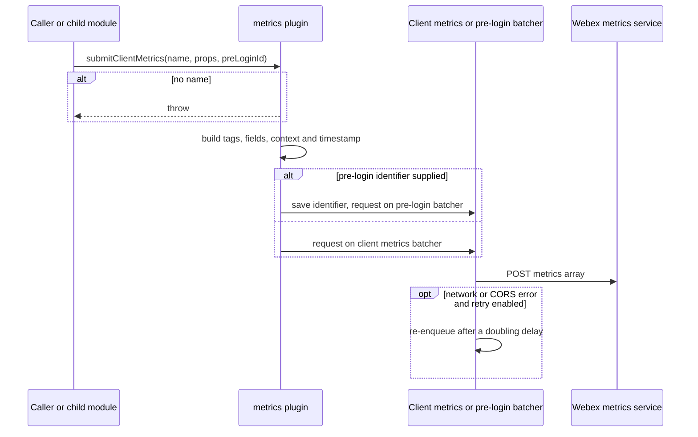
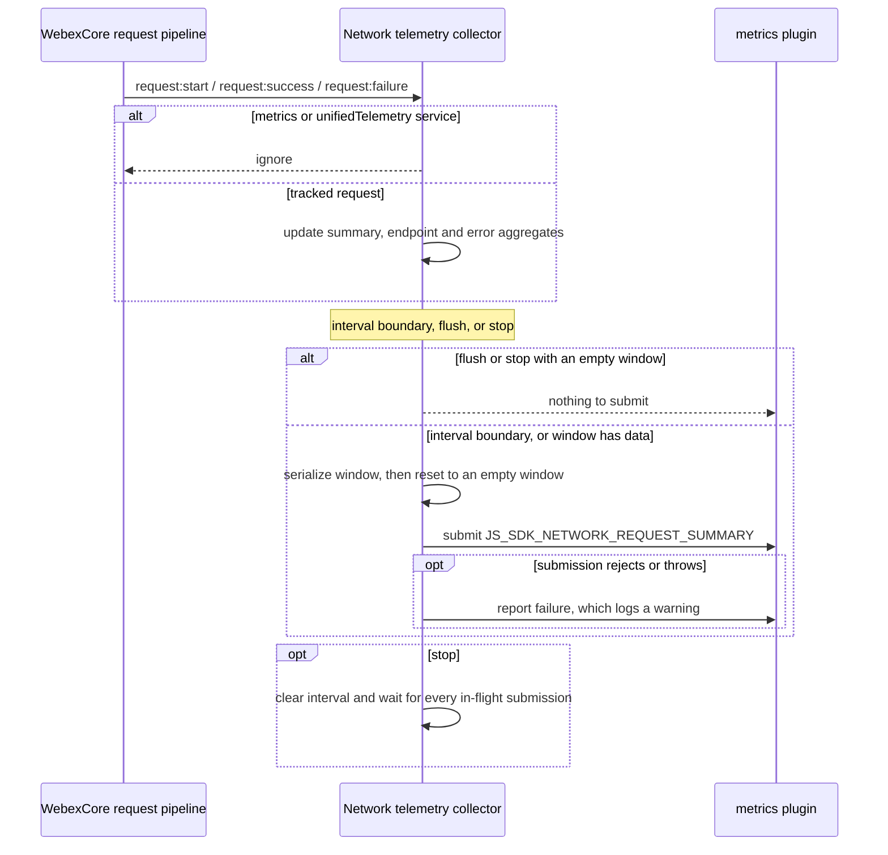
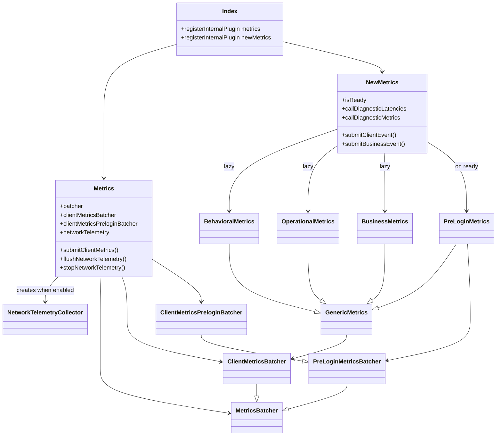

<!-- sdd-generated-metadata
doc_kind: module-spec
generated_from: module-spec@0.3.0
generated_by: claude-code
approved_by: rarajes2@cisco.com
updated_at: 2026-10-07T04:50:31Z
validation_status: pass
-->

# Metrics plugin root

This source-local document at `src/docs/README.md` owns the stable specification for **the metrics
plugin root module**: plugin registration, the legacy `metrics` and current `newMetrics` façades, the
batcher family, tagged-event metrics and SDK network telemetry. Ground every claim in repository
evidence and link to the [repository architecture](../../docs/architecture.md) instead of repeating
broader facts.

Related context: [documentation index](../../docs/index.md) ·
[documentation agent instructions](../../AGENTS.md)

## Metadata

| Field         | Value                                                        |
| ------------- | ------------------------------------------------------------ |
| Owner         | Cisco Webex JS SDK — telemetry                               |
| Source path   | `src/`                                                       |
| Resource kind | package                                                      |
| Status        | Active                                                       |
| Last verified | 2026-10-06 at `d6202dd73d`                                   |
| Module id     | `metrics-root`                                               |
| Parent spec   | —                                                            |
| Doc kind      | Module spec                                                  |
| Coverage score | Pending coverage assessment                                 |
| Validation status | pass (2026-10-07; validator runtime 01a1147a-c744-7083-9b15-95e91170c79a; 0 blocking, 0 important, 0 medium, 0 minor; conformance and source-fidelity gates pass, no code/spec mismatches found) |

## Applicability

Sections preceded by an `Include if` comment are conditional. Retain a
conditional section only when source evidence or a confirmed developer answer
satisfies its condition.

| Condition ID                         | Status     | Evidence or reason                                                                                                   | Owned section                 |
| ------------------------------------ | ---------- | -------------------------------------------------------------------------------------------------------------------- | ----------------------------- |
| `module.has_tiers`                   | N/A        | The repository defines no operational or review tier policy for modules                                              | Tier                          |
| `module.has_ui`                      | N/A        | The package renders nothing                                                                                          | UI use-case flow              |
| `module.crosses_service_boundaries`  | Applicable | `src/batcher.js` and `src/client-metrics-batcher.js` post to the metrics service; `src/metrics.js` subscribes to SDK request events | Cross-boundary use-case flow |
| `module.holds_client_state`          | Applicable | The network telemetry window in `src/network-telemetry.ts` and the readiness and delay flags in `src/new-metrics.ts`   | Client state model            |
| `module.enforces_domain_rules`       | Applicable | Counter mapping, failure classification, self-exclusion and endpoint normalization in `src/network-telemetry.ts`      | Business rules and invariants |
| `module.is_concurrent_async`         | Applicable | The telemetry interval, in-flight submission tracking and batcher backoff in `src/network-telemetry.ts` and `src/batcher.js` | Concurrency and reactive flow |
| `module.owns_persistence`            | N/A        | Nothing is persisted; every aggregate and queue is in-memory                                                          | Data, schema, and migration   |
| `module.stateful_transitions`        | Applicable | Façade readiness in `src/new-metrics.ts` and the collector lifecycle in `src/metrics.js`                               | State machine                 |
| `module.exposes_wire_protocol`       | Applicable | The client metric payload in `src/metrics.js` and the summary metric in `src/network-telemetry.ts`                     | Protocol and wire format      |
| `module.ui_multi_screen`             | N/A        | No user interface                                                                                                    | UI flow                       |
| `module.large_data_model`            | N/A        | Event types are derived from the external schema in `src/metrics.types.ts` rather than modeled here                    | Data model                    |
| `module.returns_caller_errors`       | Applicable | `src/metrics.js` throws when a client metric has no name; pre-login submission rejects without an identifier           | Caller-visible failure modes  |
| `module.module_specific_conventions` | Applicable | Ampersand-based JavaScript plugins coexist with TypeScript classes, and telemetry must never fail a caller             | Module-specific rules         |
| `module.published_package`           | Applicable | `package.json` declares the published entry points and `src/index.ts` the export surface                               | Export stability              |
| `module.embedded_in_host`            | Applicable | `src/index.ts` mounts both plugins into a host SDK instance with a before-logout lifecycle hook                         | Host integration and theming  |
| `module.has_design_tradeoff`         | Applicable | Reset-before-submit telemetry windows and the two-façade layout                                                       | Key design trade-off          |
| `module.has_submodules`              | Applicable | Derived from the manifest module tree: four child modules                                                             | Sub-modules                   |

## Evidence register

| Evidence                                  | What it establishes                                                                                                         |
| ----------------------------------------- | --------------------------------------------------------------------------------------------------------------------------- |
| `src/index.ts`                            | Plugin registration, the logout hook and the full export surface                                                             |
| `src/metrics.js`                          | The legacy façade, its batcher children, client metric payload construction and the network telemetry wiring                 |
| `src/new-metrics.ts`                      | The current façade, readiness gating, lazy backends, delay control and composition of the child modules                      |
| `src/network-telemetry.ts`                | The request-outcome collector, its classification and normalization rules and the summary payload                             |
| `src/batcher.js`                          | Item defaults, the metrics resource transport and network-error backoff                                                      |
| `src/client-metrics-batcher.js`           | The client-metrics resource transport                                                                                        |
| `src/prelogin-metrics-batcher.ts`         | The unauthenticated pre-login transport and its identifier requirement                                                        |
| `src/client-metrics-prelogin-batcher.ts`  | The pre-login transport used by the legacy façade                                                                             |
| `src/generic-metrics.ts`                  | The shared tagged-event base: context, browser details, device identifier and readiness                                       |
| `src/behavioral-metrics.ts`               | Behavioral event naming and submission                                                                                        |
| `src/operational-metrics.ts`              | Operational event submission                                                                                                  |
| `src/business-metrics.ts`                 | Business event table routing                                                                                                  |
| `src/prelogin-metrics.ts`                 | Pre-login business event construction                                                                                         |
| `src/config.js`                           | Plugin defaults, including both telemetry features disabled and the ten-minute interval                                      |
| `src/automated-user.ts`                   | Automated user classification and its memoization                                                                             |
| `src/metrics.types.ts`                    | The exported type surface derived from the external Call Analyzer schema                                                      |
| `test/unit/spec/network-telemetry.ts`     | End-to-end verification of the collector against SDK request events                                                          |
| `test/unit/spec/metrics.js`               | Verification of the legacy façade payload, routing and alias request                                                          |
| `test/unit/spec/new-metrics.ts`           | Verification of readiness, lazy backends, enrichment wiring and the unhandled-exception start                                 |
| `test/unit/spec/batcher.js`               | Verification of queue clearing, network-error re-enqueue and the retry opt-out                                                |
| Reconciled owner documentation            | Owner-authored network telemetry design and package purpose, reconciled by meaning into this spec; one stale initialization code block corrected against `src/metrics.js` |

## Purpose and boundary

- Responsibility: the plugin for the Webex Metrics service — the package's registration and transport
  layer — mounting the `metrics` and
  `newMetrics` internal plugins, owning every batcher, building client metric and tagged-event
  payloads, and summarizing SDK request outcomes.
- In scope: plugin registration and the logout hook; the legacy client-metrics path, including
  pre-login submission and user aliasing; the current façade's readiness gate, lazy backends and
  delay control; behavioral, operational, business and pre-login tagged events; the batcher family;
  and network request telemetry.
- Network telemetry scope, confirmed by `src/network-telemetry.ts`: the collector counts request and
  response outcomes that pass through `webex.request()` and its interceptors. For failures, it also
  records aggregated error details covering:
  - HTTP responses rejected by the SDK, such as `4xx` and `5xx` responses.
  - Network or CORS failures where no HTTP response is available.
  - Aborted and timed-out SDK requests when the error exposes that information.
  - Request preparation failures that emit `request:failure`.
- Out of scope: network telemetry does not monitor arbitrary application `fetch()`,
  `XMLHttpRequest`, WebSocket, or other traffic outside the SDK request pipeline. It also does not use
  `PerformanceObserver` or browser-wide request interception. The Call Analyzer event model,
  permission enrichment, WebRTC stats and browser exception capture are each owned by a child module.
- Consumers: sibling SDK plugins and first party clients, through `webex.internal.metrics` and
  `webex.internal.newMetrics`. This is an internal Cisco Webex plugin. As such, it does not strictly
  adhere to semantic versioning; use it at your own risk. Anyone not working on one of the first party
  clients should use the public developer API and stick to the public plugins.

## Structure and key files

| Path                                      | Responsibility                                                                                                 |
| ----------------------------------------- | -------------------------------------------------------------------------------------------------------------- |
| `src/index.ts`                            | Registration of both plugins and the export surface; authoritative for what the package publishes               |
| `src/metrics.js`                          | The legacy `metrics` plugin; authoritative for the client metric payload and the network telemetry lifecycle    |
| `src/new-metrics.ts`                      | The `newMetrics` plugin; authoritative for readiness gating and composition of the child modules               |
| `src/network-telemetry.ts`                | The request-outcome collector; authoritative for counters, classification, normalization and the summary shape  |
| `src/batcher.js`                          | Base batcher for this package; authoritative for item defaults and network-error backoff                       |
| `src/client-metrics-batcher.js`           | Batcher bound to the client-metrics resource                                                                    |
| `src/prelogin-metrics-batcher.ts`         | Batcher bound to the unauthenticated pre-login resource                                                         |
| `src/client-metrics-prelogin-batcher.ts`  | Pre-login batcher variant without diagnostic preparation, used by the legacy façade                             |
| `src/generic-metrics.ts`                  | Abstract base for tagged events                                                                                 |
| `src/behavioral-metrics.ts`               | Behavioral events                                                                                               |
| `src/operational-metrics.ts`              | Operational events                                                                                              |
| `src/business-metrics.ts`                 | Business events and table routing                                                                               |
| `src/prelogin-metrics.ts`                 | Pre-login business events                                                                                       |
| `src/config.js`                           | Plugin configuration defaults and OS name mapping                                                               |
| `src/utils.ts`                            | Shared error serialization for log lines                                                                        |
| `src/automated-user.ts`                   | Automated user classification                                                                                   |
| `src/metrics.types.ts`                    | The exported type surface                                                                                        |

<!-- Include if: this module contains child modules that own their own specifications. [condition-id: module.has_submodules] -->

## Sub-modules

| Sub-module                                        | Responsibility                                                                 | Specification                                                                                         |
| ------------------------------------------------- | ------------------------------------------------------------------------------ | ----------------------------------------------------------------------------------------------------- |
| `src/call-diagnostic/`                            | Call Analyzer events, the latency ledger and error-code mapping                 | [`src/call-diagnostic/docs/README.md`](../call-diagnostic/docs/README.md)                              |
| `src/privacy-and-security-permission-enricher/`   | Permission-change enrichment of client events                                   | [`src/privacy-and-security-permission-enricher/docs/README.md`](../privacy-and-security-permission-enricher/docs/README.md) |
| `src/rtcMetrics/`                                 | WebRTC stats telemetry to the unified telemetry service                         | [`src/rtcMetrics/docs/README.md`](../rtcMetrics/docs/README.md)                                        |
| `src/unhandled-exception-telemetry/`              | Browser uncaught error and rejection reporting                                  | [`src/unhandled-exception-telemetry/docs/README.md`](../unhandled-exception-telemetry/docs/README.md)  |

This module references child behavior by contract identifier only: `call-diagnostic-event`,
`privacy-permission-enricher-sdk`, `rtc-metrics-payload` and `unhandled-exception-metric` in
`.sdd/manifest.json`.

## Public surface

| Surface                                    | Consumer                                      | Compatibility commitment                                                                                     | Source                     |
| ------------------------------------------ | --------------------------------------------- | ------------------------------------------------------------------------------------------------------------ | -------------------------- |
| Package import side effect                 | Any host that imports the package              | Importing registers `metrics` and `newMetrics` before the host SDK instance is constructed                    | `src/index.ts`             |
| `webex.internal.metrics` — `submit`, `submitClientMetrics`, `getClientMetricsPayload`, `aliasUser` | Sibling plugins and the child modules | Additive; `submitClientMetrics` is the only path accepting a pre-login identifier | `src/metrics.js`           |
| `webex.internal.metrics` — `flushNetworkTelemetry`, `stopNetworkTelemetry` | Callers needing an immediate summary; the logout hook | Both resolve immediately when telemetry is disabled                                          | `src/metrics.js`           |
| `webex.internal.newMetrics` — client, feature, MQE, behavioral, operational, business, pre-login and internal submissions | Sibling plugins and first party clients | Client, feature, behavioral, operational, business and pre-login submissions before SDK readiness are logged and resolve without submitting; `submitMQE` and `submitInternalEvent` are not readiness-guarded | `src/new-metrics.ts`       |
| `webex.internal.newMetrics` — readiness probes, delay control, permission setter, alias, fetch helpers, expected-error check | Sibling plugins and first party clients | Additive                                                         | `src/new-metrics.ts`       |
| Named exports — classes, utilities, config and types | Workspace siblings                    | Removing a named export is breaking for the monorepo                                                         | `src/index.ts`             |
| Network telemetry configuration            | First party clients                            | `enabled` defaults to false; `intervalMs` defaults to ten minutes and falls back to it when not a positive finite number | `src/config.js`     |

Network request telemetry is disabled by default. Enable it with
`metrics.networkTelemetry.enabled: true`. When enabled, the metrics plugin summarizes requests made
through the Webex SDK request pipeline. The reporting interval is configurable with
`metrics.networkTelemetry.intervalMs` and defaults to ten minutes. It listens to the SDK-wide
`request:start`, `request:success`, and `request:failure` events, so individual plugins do not need
to wrap or replace `webex.request()`. For example, to collect one-minute windows, set
`metrics.networkTelemetry: {enabled: true, intervalMs: 60 * 1_000}`.

Initialization, current in `src/metrics.js`: the listeners and the accumulator are registered during
metrics plugin initialization. `initialize(...args)` calls `WebexPlugin.prototype.initialize`, then
returns early when the plugin is constructed standalone with no parent or collection. Otherwise an
idempotent initializer, guarded on an existing collector and on the enable flag being exactly `true`,
calls `createNetworkTelemetryCollector` with the interval, a submit callback and a failure callback,
and uses `listenTo` to subscribe to `request:start`, `request:success` and `request:failure`. Because
the SDK initializes child plugins before `webex.config` is populated, that initializer runs once
immediately and once more on the first `change:config` event. The listeners are installed once for
each Webex instance when `webex.internal.metrics` is constructed and the feature is enabled. The
metrics package must be imported before constructing the Webex instance; standard Webex SDK bundles
already import and register the metrics plugin. A caller that needs the current window submitted
immediately uses `await webex.internal.metrics.flushNetworkTelemetry()`.

## Dependencies

| Dependency                                        | Why it is required                                                           | Failure behavior                                                                                       |
| ------------------------------------------------- | ---------------------------------------------------------------------------- | ------------------------------------------------------------------------------------------------------ |
| `@webex/webex-core`                               | Plugin base classes, `Batcher`, HTTP error types and plugin registration       | A breaking change fails registration at import time                                                     |
| `@webex/webex-core` request events                | Source of network telemetry                                                    | Absent events produce empty windows: each interval still submits a zeroed summary, while flush and stop skip an empty window |
| `@webex/common`                                   | Browser and OS detection, the browser-environment flag                         | Detection degrades to undefined values rather than throwing                                             |
| `@webex/common-timers`                            | Telemetry interval and batcher backoff timers                                  | None                                                                                                   |
| Device plugin                                     | Device URL for tagged-event readiness and context                             | No device means tagged events report not ready                                                          |
| Child modules                                     | Call Analyzer events, enrichment, WebRTC stats, exception capture              | Each child's failures are contained inside it                                                           |
| `@webex/event-dictionary-ts`                      | The authoritative event schema behind `src/metrics.types.ts`                   | A schema change surfaces at build time                                                                  |
| `isbot`, `lodash`, `uuid`                          | Automated user detection, merging, identifiers                                  | None                                                                                                   |

## Requirements

| ID        | WHAT                                                                                                                                | WHY                                                                                                                                                  | Source evidence                         | Test or example evidence                     | Assumptions or gaps | Confidence |
| --------- | ----------------------------------------------------------------------------------------------------------------------------------- | ---------------------------------------------------------------------------------------------------------------------------------------------------- | --------------------------------------- | -------------------------------------------- | ------------------- | ---------- |
| `MOD-001` | Importing the package registers `metrics` and `newMetrics`, and logout stops network telemetry first                                 | Every SDK consumer relies on these mounts existing, and the final telemetry window must be submitted while credentials are still valid               | `src/index.ts`                          | `test/unit/spec/network-telemetry.ts`        | The logout hook wiring itself has no case; `stopNetworkTelemetry` is tested directly | Weak |
| `MOD-002` | `newMetrics` client, feature, behavioral, operational, business and pre-login submissions before the SDK emits ready are logged and resolve without submitting; `submitMQE` and `submitInternalEvent` have no readiness guard and delegate immediately | Before readiness the device and configuration needed to build events are not available                                                               | `src/new-metrics.ts`                    | `test/unit/spec/new-metrics.ts`              | none                | Present    |
| `MOD-003` | Behavioral, operational and business backends are created lazily, and only after readiness                                          | Their constructors read the device and logger from the SDK instance, which are not usable earlier                                                    | `src/new-metrics.ts`                    | `test/unit/spec/new-metrics.ts`              | none                | Present    |
| `MOD-004` | Tagged events report ready only once a device identifier can be parsed from the device URL                                          | Tagged events are keyed by device identifier downstream; submitting with an empty one would be unattributable                                        | `src/generic-metrics.ts`                | `test/unit/spec/behavioral/behavioral-metrics.ts` | none           | Present    |
| `MOD-005` | Client event payloads are enriched with permission changes before reaching Call Analyzer, scoped by correlation identifier            | Permission history must follow the call, including across identifier transitions                                                                     | `src/new-metrics.ts`                    | `test/unit/spec/new-metrics.ts`              | none                | Present    |
| `MOD-006` | Unhandled exception telemetry is started when the SDK emits ready                                                                   | It submits through this module's transport, which is only usable after readiness                                                                     | `src/new-metrics.ts`                    | `test/unit/spec/new-metrics.ts`              | none                | Present    |
| `MOD-007` | A client metric carries application name, version and URL, browser and OS details, SDK version and the client identifier            | Ingestion segments every client metric by application and platform                                                                                   | `src/metrics.js`                        | `test/unit/spec/metrics.js`                  | none                | Present    |
| `MOD-008` | A client metric without a name throws                                                                                               | A nameless metric cannot be routed by ingestion                                                                                                      | `src/metrics.js`                        | `test/unit/spec/metrics.js`                  | none                | Present    |
| `MOD-009` | A client metric with a pre-login identifier is submitted through the unauthenticated pre-login transport                             | Telemetry before sign-in must still be attributable to one session                                                                                   | `src/metrics.js`                        | `test/unit/spec/metrics.js`                  | none                | Present    |
| `MOD-010` | Pre-login submission rejects when no pre-login identifier has been saved                                                            | An unauthenticated request without its attribution header would be unusable and must never be sent                                                    | `src/prelogin-metrics-batcher.ts`       | `test/unit/spec/prelogin-metrics-batcher.ts` | none                | Present    |
| `MOD-011` | Batched items that fail with a network or CORS error are re-enqueued with a delay that doubles up to the configured plateau, unless retry is disabled | Transient connectivity loss must not lose telemetry, but retry pressure must stay bounded                                         | `src/batcher.js`                        | `test/unit/spec/batcher.js`                  | none                | Present    |
| `MOD-012` | Network telemetry is disabled by default and listens only when the enable flag is exactly `true`                                    | Request telemetry adds a submission per window to every SDK instance, so it must be opt-in                                                           | `src/config.js`                         | `test/unit/spec/network-telemetry.ts`        | none                | Present    |
| `MOD-013` | Telemetry initialization runs immediately and again on the first configuration change, at most once, and never for a standalone plugin | The SDK initializes children before configuration is populated, and a standalone plugin has no request events to observe                           | `src/metrics.js`                        | none found                                   | The deferred and standalone paths have no dedicated case | Weak |
| `MOD-014` | Request outcomes are counted per summary and per host-and-endpoint, using the counter mapping in Business rules                     | Separating send, failed-request, received and failed-response counts distinguishes network failure from server failure                               | `src/network-telemetry.ts`              | `test/unit/spec/network-telemetry.ts`        | none                | Present    |
| `MOD-015` | Each failure is classified into exactly one error type in a fixed order                                                             | Aggregation needs a bounded vocabulary, and the order makes overlapping signals deterministic                                                         | `src/network-telemetry.ts`              | `test/unit/spec/network-telemetry.ts`        | The `request_error` fallback has no case | Present |
| `MOD-016` | Identical failures are aggregated with a count and at most ten unique tracking identifiers                                          | Keeps payload size bounded during a failure storm while retaining enough identifiers to trace examples                                               | `src/network-telemetry.ts`              | `test/unit/spec/network-telemetry.ts`        | none                | Present    |
| `MOD-017` | Requests to the metrics and unified telemetry services, including the legacy metrics API option, are excluded from collection         | A telemetry upload must not appear in its own summary                                                                                               | `src/network-telemetry.ts`              | `test/unit/spec/network-telemetry.ts`        | none                | Present    |
| `MOD-018` | Endpoints drop query data and fragments, and replace numeric, encoded, mixed-case and otherwise non-route-looking segments with `:id`  | Keeps aggregate cardinality bounded and keeps identifiers out of telemetry                                                                          | `src/network-telemetry.ts`              | `test/unit/spec/network-telemetry.ts`        | none                | Present    |
| `MOD-019` | Direct-URI requests use the sanitized URI host and path; service requests use the logical service name as host                      | The start event can fire before the service URL is resolved, so the logical name is the stable identity                                               | `src/network-telemetry.ts`              | `test/unit/spec/network-telemetry.ts`        | none                | Present    |
| `MOD-020` | Each endpoint reports average, nearest-rank p90 and p99 network duration computed only from samples whose `networkStart` and `networkEnd` timings are finite numbers with end not before start; an endpoint with no valid sample reports zero for all three | Tail latency is the useful signal for SDK request health, and a missing or inverted timing pair would corrupt it rather than describe it | `src/network-telemetry.ts` | `test/unit/spec/network-telemetry.ts` | Requests with no timing metadata are covered and report zero; non-finite or inverted timing pairs have no case | Present |
| `MOD-021` | Every interval submits the current window, including an empty one as a zeroed summary; the window resets before submission | Requests during an in-flight submission must belong to the next window. The periodic path has no emptiness check, so an idle instance keeps a fixed reporting cadence | `src/network-telemetry.ts` | `test/unit/spec/network-telemetry.ts` | The zeroed second-interval payload is asserted directly; no documented rationale for reporting empty windows was found | Present |
| `MOD-022` | Flush submits the current window immediately only when it is non-empty and keeps collecting; stop clears the interval, submits any non-empty partial window once and waits for every in-flight submission | Callers need an immediate summary after early call failures, and shutdown must not lose or race the last window | `src/network-telemetry.ts` | `test/unit/spec/network-telemetry.ts` | No case flushes or stops with an empty window | Present |
| `MOD-023` | A summary submission failure is caught and logged without affecting SDK requests                                                    | Telemetry must never degrade the requests it observes                                                                                               | `src/metrics.js`                        | `test/unit/spec/network-telemetry.ts`        | none                | Present    |
| `MOD-024` | Business events route by table, defaulting the table and the application type                                                       | Each ingestion table has a different schema, and the shim keeps callers unaware of it                                                                | `src/business-metrics.ts`               | `test/unit/spec/business/business-metrics.ts` | none               | Present    |
| `MOD-025` | The automated user verdict is computed once per process                                                                             | User agent parsing is relatively expensive and the verdict cannot change within a page                                                               | `src/automated-user.ts`                 | `test/unit/spec/automated-user.ts`           | none                | Present    |

## Design overview

The root module is the package's registration and transport layer. Its design is a deliberate split
between two façades that share one family of batchers.

`metrics` (`src/metrics.js`) is an Ampersand `WebexPlugin` with three `Batcher` children: one for the
`metrics` resource, one for `clientmetrics` and one for `clientmetrics-prelogin`. It builds the client
metric payload from host configuration and browser detection, and routes to the pre-login batcher
whenever a pre-login identifier is supplied. It also owns the network telemetry collector, because the
collector needs the SDK request events and a transport, and this plugin has both.

`newMetrics` (`src/new-metrics.ts`) owns no transport. It eagerly constructs the latency ledger, the
Call Analyzer builder and the permission enricher, and on the SDK `ready` event constructs the
pre-login backend, marks itself ready, replays the current delay setting and starts unhandled
exception telemetry. Behavioral, operational and business backends are created on first use after
readiness. The client, feature, behavioral, operational, business and pre-login submission methods
check readiness first, so a caller that fires too early gets a logged no-op rather than a malformed
event. `submitMQE` and `submitInternalEvent` are the exceptions: they record the latency timestamp and,
for `submitMQE`, delegate straight to the eagerly constructed Call Analyzer builder without a
readiness check.

The tagged-event classes share `src/generic-metrics.ts`, which builds a context block and browser
details and derives the device identifier from the device URL. Each class composes the metric name
its own way — behavioral events join product, agent, target and verb — and posts through its own
client-metrics batcher.

Network telemetry (`src/network-telemetry.ts`) is a closure-based collector with no class. Its state
is one window of counters plus a set of in-flight submissions. At each interval boundary it
serializes the window, replaces it with an empty one, and only then calls the submit callback. Event
flow:

```text
webex.request()
  -> SDK request interceptors
  -> request:start(options)
  -> request:success(options, response) or request:failure(options, reason)
  -> metrics request outcome listeners
  -> aggregate host, endpoint, response, and error counts
  -> every configured interval, submit JS_SDK_NETWORK_REQUEST_SUMMARY
```

## Data flow and sequence coverage

Collection is in-process method calls and SDK events; submission is a batched HTTP POST through the
host request pipeline. Four operation groups have distinct actors or outcomes and are diagrammed
separately. Child-module flows are owned by their specs.

| Operation group               | Entry and outcome                                                                                         | Diagram or evidence                  | Failure and recovery coverage                                                                         |
| ----------------------------- | --------------------------------------------------------------------------------------------------------- | ------------------------------------ | ----------------------------------------------------------------------------------------------------- |
| Façade submission             | A caller submits through `newMetrics`; guarded events are gated on readiness, then delegated (`submitMQE` is not gated) | First sequence diagram below         | Not ready: logged no-op for guarded methods. Child failures are contained in the child                 |
| Client metric submission      | A caller or child submits through `metrics`; the payload is built and batched                              | Second sequence diagram below        | Missing name throws; missing pre-login identifier rejects; network errors re-enqueue with backoff     |
| Network telemetry window      | Request events accumulate; the interval, a flush or a stop submits the window                              | Third sequence diagram below         | The interval submits even an empty window; flush and stop skip an empty window; submission failure logged and the window dropped |
| Plugin lifecycle              | Construction, configuration change and logout                                                              | State machine section                | Standalone construction skips telemetry; logout waits for in-flight submissions                       |







## Class and component relationships



## Use cases and flows

| Use case | Actor or caller            | Primary steps and outcome                                                                                                   | Failure or boundary behavior                                                              | Evidence                                                                        |
| -------- | -------------------------- | --------------------------------------------------------------------------------------------------------------------------- | ----------------------------------------------------------------------------------------- | ------------------------------------------------------------------------------- |
| `UC-001` | First party client         | Enables network telemetry; SDK requests accumulate and one summary is submitted per interval                                  | Telemetry uploads are excluded; an interval with no tracked request still submits a zeroed summary | `src/network-telemetry.ts`, `test/unit/spec/network-telemetry.ts`               |
| `UC-002` | Meetings plugin            | An early call failure occurs; it flushes network telemetry for an immediate summary                                          | Disabled telemetry resolves immediately                                                    | `src/metrics.js`, `test/unit/spec/network-telemetry.ts`                         |
| `UC-003` | Host SDK                   | Logout stops network telemetry; the partial window is submitted once and in-flight submissions are awaited                    | Disabled telemetry resolves immediately                                                    | `src/index.ts`, `test/unit/spec/network-telemetry.ts`                           |
| `UC-004` | First party client         | Submits a behavioral event after readiness; the backend is built lazily and the tagged event is batched                      | Before readiness the call is logged and resolves                                           | `src/new-metrics.ts`, `test/unit/spec/new-metrics.ts`                           |
| `UC-005` | Guest before sign-in       | Submits a client metric with a pre-login identifier; it is sent unauthenticated with the identifier header, then aliased after sign-in | No saved identifier rejects the batch                                       | `src/metrics.js`, `test/unit/spec/metrics.js`                                   |
| `UC-006` | Web client                 | Submits a business event to a specific table; the payload is shaped for that table's schema                                  | Unknown or missing table falls back to the default shape                                   | `src/business-metrics.ts`, `test/unit/spec/business/business-metrics.ts`        |

<!-- Include if: the module calls another service or crosses an event or network boundary. [condition-id: module.crosses_service_boundaries] -->

### Cross-boundary use-case flow

- Boundary and transport: inbound, the SDK-wide request lifecycle events; outbound, HTTPS POST to the
  `metrics` service resources `metrics`, `clientmetrics` and `clientmetrics-prelogin`, plus the
  `clientmetrics` alias request with the pre-login header.
- Ordering: batch items keep arrival order; no cross-batch ordering is promised. Network telemetry
  windows are disjoint by construction because the window resets before submission.
- Compatibility: the summary metric and the client metric payload are wire contracts with ingestion;
  additions are compatible, removals and renames are not.
- Timeout and retry: the batchers wait up to the configured service-discovery timeout, and re-enqueue
  network failures with doubling delay up to the plateau. Network telemetry never retries a window.
- Recovery: a lost telemetry window is not replayed; the next window starts empty.

<!-- Include if: the module holds client-side state. [condition-id: module.holds_client_state] -->

## Client state model

| State or slice              | Owner            | Initial state       | Transition triggers                                                  | Reset or persistence boundary                                       |
| --------------------------- | ---------------- | ------------------- | -------------------------------------------------------------------- | ------------------------------------------------------------------- |
| Network telemetry window    | Collector closure | Empty aggregate     | Tracked request events                                               | Replaced at every interval, flush and stop                          |
| In-flight submissions       | Collector closure | Empty set           | A window submission starts or settles                                | Drained by stop                                                     |
| Collector reference         | `metrics`        | Undefined           | Created once when enabled                                            | Stopped on logout; not recreated                                    |
| Readiness flag              | `newMetrics`     | False               | SDK `ready` event                                                    | Instance lifetime                                                   |
| Delay flags and overrides   | `newMetrics`     | False, empty        | The two delay setters                                                | Disabling delay flushes the child's queue                           |
| Lazy tagged backends        | `newMetrics`     | Undefined           | First use after readiness                                            | Instance lifetime                                                   |
| Batcher queues and backoff  | Each batcher     | Empty               | Enqueue, accept, re-enqueue                                          | Per-item delay cleared on acceptance                                |
| Saved pre-login identifier  | Pre-login batchers | Undefined         | Saved on each pre-login submission                                   | Overwritten by the next submission                                  |
| Device identifier memo      | `GenericMetrics` | Empty string        | First successful parse of the device URL                             | Instance lifetime                                                   |

<!-- Include if: the module enforces domain rules or entity invariants. [condition-id: module.enforces_domain_rules] -->

## Business rules and invariants

Counter mapping, current in `src/network-telemetry.ts`:

| Event or outcome                                    | Summary and endpoint counters                                               |
| --------------------------------------------------- | --------------------------------------------------------------------------- |
| `request:start`                                     | `totalSendRequest`, `countSendRequest`                                      |
| `request:success`                                   | `totalRecvdResponse`, `countRecvdResponse`                                  |
| `request:failure` without an HTTP response          | `totalFailedRequest`, `countFailedRequest`                                  |
| `request:failure` with an HTTP status (`4xx`/`5xx`) | Received-response counters plus `totalFailedResponse`/`countFailedResponse` |

Failure classification, evaluated in this order:

| Condition                                                                                                 | `errorType`     |
| --------------------------------------------------------------------------------------------------------- | --------------- |
| Error name is `AbortError`                                                                                | `aborted`       |
| Status is `408` or `504`, timeout appears in the error details, or the configured request timeout elapsed | `timeout`       |
| Status is `429`                                                                                           | `rate_limited`  |
| Status is `5xx`                                                                                           | `server_error`  |
| Status is `4xx`                                                                                           | `client_error`  |
| No response status is available, or the error name contains `network`                                     | `network_error` |
| Any other SDK request failure                                                                             | `request_error` |

Telemetry request exclusion: requests to the `metrics` and `unifiedTelemetry` services are excluded
from both success and failure collection. The exclusion also covers the legacy `api: 'metrics'`
request option. This prevents a telemetry upload from affecting its own summary. The exclusion is
centralized in the collector; telemetry request call sites do not require special flags.

Endpoint normalization: the `endPoint` value is derived from `options.resource`, or from the URI path
for a direct-URI request:

- Query parameters and fragments are removed.
- Numeric, percent-encoded, uppercase, and otherwise non-route-looking segments are replaced with `:id`.

For example, `rooms/Y2lzY29zcGFyazovL3VzL1JPT00/messages?personId=secret` becomes
`rooms/:id/messages`.

| ID        | Invariant                                                                                        | WHY                                                                                         | Enforcement source           | Test evidence                         |
| --------- | ------------------------------------------------------------------------------------------------ | ------------------------------------------------------------------------------------------- | ---------------------------- | ------------------------------------- |
| `INV-001` | Requests to the `metrics` and `unifiedTelemetry` services never enter a telemetry window          | Without it every window would count the SDK's own summary and client-metric uploads           | `src/network-telemetry.ts`   | `test/unit/spec/network-telemetry.ts` |
| `INV-002` | A status of zero means no HTTP response; only statuses 100 to 599 count as responses              | Separates transport failure from server failure in every counter                             | `src/network-telemetry.ts`   | `test/unit/spec/network-telemetry.ts` |
| `INV-003` | Every failure has exactly one error type                                                         | Bounded aggregation vocabulary                                                              | `src/network-telemetry.ts`   | `test/unit/spec/network-telemetry.ts` |
| `INV-004` | An error aggregate holds at most ten unique tracking identifiers                                  | Bounds payload size during failure storms                                                   | `src/network-telemetry.ts`   | `test/unit/spec/network-telemetry.ts` |
| `INV-005` | Endpoints contain no query data, fragment or non-route-looking segment                           | Bounds cardinality and keeps identifiers out of telemetry                                   | `src/network-telemetry.ts`   | `test/unit/spec/network-telemetry.ts` |
| `INV-006` | Flush and stop never submit an empty window; the periodic interval is the only path that does   | Flush serves early-failure and shutdown delivery of collected data, so an empty flush would carry nothing | `src/network-telemetry.ts`   | none found                            |
| `INV-007` | Non-production builds tag metrics with a test environment                                        | Keeps non-production data out of production metrics                                        | `src/batcher.js`             | `test/unit/spec/batcher.js`           |

<!-- Include if: the module is concurrent, asynchronous, reactive, or event-driven. [condition-id: module.is_concurrent_async] -->

## Concurrency and reactive flow

- Execution model: SDK event listeners, one `safeSetInterval` per collector, and the `Batcher` queue
  with `safeSetTimeout` backoff.
- Ordering guarantees: the window reset happens synchronously before the submit callback, so an event
  arriving while a submission is pending always lands in the next window.
- Idempotency and retry: windows are never retried. Batch items are re-enqueued on network errors with
  per-item delay starting at one second and doubling below the plateau.
- Shared-state protection: single-threaded; every mutation is synchronous. The in-flight set lets stop
  wait for submissions whose window was already reset.
- Flush and shutdown: the metrics plugin exposes `flushNetworkTelemetry()` for callers that need to
  submit the current non-empty window immediately, such as after an early call failure. When the
  metrics plugin is stopped, any non-empty partial window is submitted once before the collector is
  disposed. Empty windows are not submitted during shutdown, and the shutdown hook waits for the
  submission attempt to settle.
- Blocking restrictions: no request listener awaits anything, and summary submission failures are
  caught inside the collector, so telemetry cannot slow or fail an SDK request.

<!-- Include if: the module has non-trivial state transitions. [condition-id: module.stateful_transitions] -->

## State machine

```mermaid
stateDiagram-v2
  state "newMetrics" as NM {
    [*] --> NotReady
    NotReady --> NotReady: guarded submission logged and resolved; MQE delegated
    NotReady --> Ready: SDK ready, pre-login backend built, delay replayed, exception telemetry started
    Ready --> Ready: submissions delegated, tagged backends built lazily
  }
  state "network telemetry" as NT {
    [*] --> Disabled: standalone, or enable flag not true
    Disabled --> Collecting: enable flag true at construction or first config change
    Collecting --> Collecting: interval submits and resets the window, even when empty; flush does so only when non-empty
    Collecting --> Stopped: logout stops, submits partial window, waits for in-flight
    Stopped --> [*]
  }
```

Rejected transitions: a collector is never created twice; `Stopped` does not return to `Collecting`.

<!-- Include if: callers depend on a wire protocol or serialized format. [condition-id: module.exposes_wire_protocol] -->

## Protocol and wire format

| Message or frame                    | Version | Producer or serializer        | Consumer or parser        | Compatibility and ordering rule                                                             |
| ----------------------------------- | ------- | ----------------------------- | ------------------------- | ------------------------------------------------------------------------------------------- |
| Client metric payload               | n/a     | `src/metrics.js`              | Webex metrics ingestion   | Additive only; tags and fields are indexed by ingestion                                     |
| `JS_SDK_NETWORK_REQUEST_SUMMARY`    | n/a     | `src/network-telemetry.ts`    | Webex metrics ingestion   | Operational type; the summary is duplicated in `fields` for indexing                         |
| Tagged event                        | n/a     | `src/generic-metrics.ts`      | Webex metrics ingestion   | Metric name, type list, tags, context and timestamp                                         |
| Business event                      | n/a     | `src/business-metrics.ts`     | Webex business tables     | Shape depends on the table; the business-metrics table merges context into the value        |
| Metrics batch body                  | n/a     | `src/batcher.js`              | Webex metrics service     | A `metrics` array; each item gets app type, environment, time, version and post time         |

One operational client metric named `JS_SDK_NETWORK_REQUEST_SUMMARY` is submitted at the configured
interval. Its `eventPayload` shape is declared by the `NetworkTelemetry` type in
[`src/network-telemetry.ts`](../network-telemetry.ts), which is linked here rather than reproduced: a four-counter
`metricsSummary`, per host-and-endpoint `metrics`, grouped `errorMetrics`, and an
`errorMetricsSummary`. The outer client metric carries `metricName`
`JS_SDK_NETWORK_REQUEST_SUMMARY`, `type: 'operational'`, `fields` duplicating `metricsSummary` for
indexing, and that `eventPayload`.

The `metrics` array is grouped by `host` and `endPoint`. For service-based SDK requests, `host` is the
normalized logical service name. Direct-URI requests use the URI host. `endPoint` is a sanitized
resource or URI path. `averageNetworkDurationMs` is the average measured network duration of the
group's requests that carry valid timing, while `maxNetworkDurationP90Ms` and
`maxNetworkDurationP99Ms` are the maximum durations at the nearest-rank 90th and 99th percentiles of
those samples; a group with no valid timing sample reports zero for all three. All values are in
milliseconds.

The `errorMetrics` array groups identical failures by host, endpoint, status code, error code,
method, error type, and error message. `countError` records the number of occurrences, while
`trackingIds` retains at most ten unique identifiers. `errorMetricsSummary` counts errors by status
code; status `0` means no HTTP response was available.

The SDK adds application metadata to the outer client metric when it wraps this `eventPayload`, as it
does for every client metric built in `src/metrics.js`:

| Property             | Source                                                                      |
| -------------------- | --------------------------------------------------------------------------- |
| `tags.app_name`      | webex.config.appName, or unknown                                            |
| `tags.app_version`   | webex.config.appVersion, or unknown                                         |
| `tags.app_url`       | Browser origin without path/query data, hostname fallback, or non-browser   |
| `fields.sdk_version` | webex.version                                                               |

<!-- Include if: the module returns or raises errors callers must handle. [condition-id: module.returns_caller_errors] -->

## Caller-visible failure modes

| Condition                                   | Signal or result                                     | Caller behavior                              | Retry or recovery                              | Evidence                            |
| ------------------------------------------- | ---------------------------------------------------- | -------------------------------------------- | ---------------------------------------------- | ----------------------------------- |
| Client metric submitted without a name       | Synchronous `Error`                                   | Supply a metric name                          | None                                           | `src/metrics.js`                    |
| Pre-login submission with no saved identifier | Rejected promise                                     | Pass a pre-login identifier                   | None                                           | `src/prelogin-metrics-batcher.ts`   |
| Alias request fails                          | Rejected promise, logged                              | Caller decides whether to retry               | None built in                                  | `src/new-metrics.ts`                |
| Batch transport fails with a network error    | Item re-enqueued; the promise stays pending           | None required                                 | Doubling delay up to the plateau               | `src/batcher.js`                    |
| Batch transport fails otherwise               | Rejected promise                                      | Callers normally ignore it                    | None                                           | `src/batcher.js`                    |
| Guarded `newMetrics` submission used before ready | Logged; resolved promise with nothing submitted (`submitMQE` is not guarded and delegates immediately) | Submit after the SDK is ready                 | Use delay mode to defer instead                | `src/new-metrics.ts`                |

## Pitfalls and constraints

- Endpoint normalization is heuristic. A short lowercase alphabetic identifier can look like a static
  route segment and survive. Do not place sensitive values directly in a resource path; use normal SDK
  resource identifiers and avoid embedding credentials or personal data in route names. Error messages are
  included because they are part of the error aggregate schema, so callers must not put credentials or
  personal data in thrown error messages.
- An enabled collector submits a summary every interval even when no tracked request occurred, so an
  idle SDK instance emits one zeroed `JS_SDK_NETWORK_REQUEST_SUMMARY` per interval. Only flush and stop
  skip an empty window.
- The host of a service request is the logical service name, not the resolved URL host, because the
  start event can fire before the service interceptor resolves a URL.
- Do not collapse the deferred `change:config` initialization in `src/metrics.js` into a direct call:
  the SDK populates configuration after initializing children.
- `src/generic-metrics.ts` imports the OS-name helper from `src/metrics.js`; do not add the reverse
  import.
- The `test` script in `package.json` is broken because it chains scripts this package does not
  define; use `test:unit` and `test:style`.

<!-- Include if: the module has conventions beyond repository-wide rules. [condition-id: module.module_specific_conventions] -->

## Module-specific rules

- Do: keep Ampersand-based plugins and batchers (`src/metrics.js`, `src/batcher.js`,
  `src/client-metrics-batcher.js`, `src/config.js`) in JavaScript and in-style; write new code in
  TypeScript.
- Do: add new telemetry transports to the self-exclusion rule in `src/network-telemetry.ts`, not at
  the call site.
- Do: catch and log every telemetry submission failure.
- Do not: gate a `newMetrics` submission on anything other than the readiness flag at the top of the
  method; the early-return log line is how premature callers are diagnosed.
- Do not: submit a network telemetry window without resetting it first.

<!-- Include if: the module is published or consumed as a package. [condition-id: module.published_package] -->

## Export stability

| Export or entry point                         | Consumer                          | Stability                        | Versioning and deprecation rule                                                                    | Declaration or API report |
| --------------------------------------------- | --------------------------------- | -------------------------------- | -------------------------------------------------------------------------------------------------- | ------------------------- |
| Default export, `getOSNameInternal`           | Workspace siblings                | Internal plugin; additive         | Internal plugin: not strictly semver; coordinate removals with every dependent workspace package   | `src/index.ts`            |
| `NewMetrics`, `BehavioralMetrics`, `OperationalMetrics`, `BusinessMetrics`, `PreLoginMetrics` | Workspace siblings | Internal; additive | Same                                                                                     | `src/index.ts`            |
| `config`, `Utils`, `AutomatedUserUtils`, `isAutomatedUser`, `isAutomatedUserAgent` | Workspace siblings | Internal; additive  | Same                                                                                               | `src/index.ts`            |
| Exported types                                | Workspace siblings                | Internal; derived from the event dictionary | Type changes follow the pinned event dictionary version                                 | `src/metrics.types.ts`    |
| `main` and `types` entry points               | npm consumers                     | Published                        | Must keep resolving to `dist/index.js` and `dist/types/index.d.ts`                                  | `package.json`            |

<!-- Include if: the module is embedded in a host application. [condition-id: module.embedded_in_host] -->

## Host integration and theming

- Mount or entry contract: importing `src/index.ts` registers `metrics` with the shared config and an
  `onBeforeLogout` hook that stops network telemetry, and registers `newMetrics` with the same config.
- Required providers, peers, or host versions: a `WebexCore` instance from `@webex/webex-core`; a
  registered device for tagged events; host configuration under the `metrics` namespace; and, for
  Call Analyzer origin, meetings configuration supplying client types.
- Theme and design-token contract: not applicable — the package renders nothing.
- Accessibility and lifecycle obligations: the host must import the package before constructing the
  SDK instance; logout awaits the final telemetry submission.

<!-- Include if: the module has a non-obvious design trade-off consumers or maintainers must preserve. [condition-id: module.has_design_tradeoff] -->

## Key design trade-off

| Chosen trade-off                                                                         | Preserved invariant or benefit                                                                                  | Cost or limitation                                                                                     | Decision evidence          |
| ---------------------------------------------------------------------------------------- | --------------------------------------------------------------------------------------------------------------- | ------------------------------------------------------------------------------------------------------ | -------------------------- |
| Reset the telemetry window at the reporting boundary before the asynchronous submission    | Requests received while a summary is being sent belong to the next window, and the transport's own requests cannot mutate a completed window | A telemetry submission failure is caught and logged, and that window is dropped; nothing is retried | `src/network-telemetry.ts` |
| Reuse `submitClientMetrics` batching and transport for summaries                           | Summaries inherit batching and network-error backoff with no new transport; they never pass a pre-login identifier, so they always use the client-metrics batcher | Summaries are subject to the same batcher delays as all client metrics                                 | `src/metrics.js`           |
| Listen to SDK-wide request events instead of wrapping `webex.request()`                    | Individual plugins need no changes, and every request through the pipeline is observed                           | Traffic outside the SDK pipeline is invisible, and the events have no shared typed contract            | `src/network-telemetry.ts` |
| Keep two façades rather than merging them                                                  | Existing consumers of `metrics` keep working while new families land on `newMetrics`                             | Two entry points with overlapping responsibility, and the pre-login path lives only on the older one   | `src/new-metrics.ts`       |

## Verification

| Requirement or invariant | Test level | Positive evidence                                    | Negative or boundary evidence                        | Gap                                                                              |
| ------------------------ | ---------- | ---------------------------------------------------- | ---------------------------------------------------- | -------------------------------------------------------------------------------- |
| `MOD-001`                | Unit       | `test/unit/spec/network-telemetry.ts`                | none found                                           | The `onBeforeLogout` registration is not exercised                               |
| `MOD-002`                | Unit       | `test/unit/spec/new-metrics.ts`                      | `test/unit/spec/new-metrics.ts`                      | none                                                                             |
| `MOD-003`                | Unit       | `test/unit/spec/new-metrics.ts`                      | none found                                           | none                                                                             |
| `MOD-004`                | Unit       | `test/unit/spec/behavioral/behavioral-metrics.ts`    | `test/unit/spec/behavioral/behavioral-metrics.ts`    | none                                                                             |
| `MOD-005`                | Unit       | `test/unit/spec/new-metrics.ts`                      | `test/unit/spec/new-metrics.ts`                      | none                                                                             |
| `MOD-006`                | Unit       | `test/unit/spec/new-metrics.ts`                      | none found                                           | none                                                                             |
| `MOD-007`                | Unit       | `test/unit/spec/metrics.js`                          | `test/unit/spec/metrics.js`                          | none                                                                             |
| `MOD-008`                | Unit       | `test/unit/spec/metrics.js`                          | `test/unit/spec/metrics.js`                          | none                                                                             |
| `MOD-009`                | Unit       | `test/unit/spec/metrics.js`                          | `test/unit/spec/client-metrics-prelogin-batcher.ts`  | none                                                                             |
| `MOD-010`                | Unit       | `test/unit/spec/prelogin-metrics-batcher.ts`         | `test/unit/spec/prelogin-metrics-batcher.ts`         | none                                                                             |
| `MOD-011` / `INV-007`    | Unit       | `test/unit/spec/batcher.js`                          | `test/unit/spec/batcher.js`                          | none                                                                             |
| `MOD-012`                | Unit       | `test/unit/spec/network-telemetry.ts`                | `test/unit/spec/network-telemetry.ts`                | none                                                                             |
| `MOD-013`                | Unit       | none found                                           | none found                                           | Deferred `change:config` initialization and the standalone early return are untested |
| `MOD-014` / `INV-002`    | Unit       | `test/unit/spec/network-telemetry.ts`                | `test/unit/spec/network-telemetry.ts`                | none                                                                             |
| `MOD-015` / `INV-003`    | Unit       | `test/unit/spec/network-telemetry.ts`                | `test/unit/spec/network-telemetry.ts`                | The `request_error` fallback has no case                                         |
| `MOD-016` / `INV-004`    | Unit       | `test/unit/spec/network-telemetry.ts`                | `test/unit/spec/network-telemetry.ts`                | none                                                                             |
| `MOD-017` / `INV-001`    | Unit       | `test/unit/spec/network-telemetry.ts`                | `test/unit/spec/network-telemetry.ts`                | none                                                                             |
| `MOD-018` / `INV-005`    | Unit       | `test/unit/spec/network-telemetry.ts`                | `test/unit/spec/network-telemetry.ts`                | none                                                                             |
| `MOD-019`                | Unit       | `test/unit/spec/network-telemetry.ts`                | none found                                           | none                                                                             |
| `MOD-020`                | Unit       | `test/unit/spec/network-telemetry.ts`                | `test/unit/spec/network-telemetry.ts`                | Requests without timing metadata report zero; no case feeds non-finite or inverted timing pairs |
| `MOD-021`                | Unit       | `test/unit/spec/network-telemetry.ts`                | `test/unit/spec/network-telemetry.ts`                | none                                                                             |
| `INV-006`                | Unit       | none found                                           | none found                                           | No case flushes or stops an empty window; the skip in `flush()` is unverified    |
| `MOD-022`                | Unit       | `test/unit/spec/network-telemetry.ts`                | `test/unit/spec/network-telemetry.ts`                | No case flushes or stops with an empty window                                    |
| `MOD-023`                | Unit       | `test/unit/spec/network-telemetry.ts`                | `test/unit/spec/network-telemetry.ts`                | none                                                                             |
| `MOD-024`                | Unit       | `test/unit/spec/business/business-metrics.ts`        | `test/unit/spec/business/business-metrics.ts`        | none                                                                             |
| `MOD-025`                | Unit       | `test/unit/spec/automated-user.ts`                   | `test/unit/spec/automated-user.ts`                   | none                                                                             |

Record coverage gaps explicitly and link follow-up work. A module specification
is complete only when its public surface, invariants, failure modes, and test
evidence agree with the implementation.
