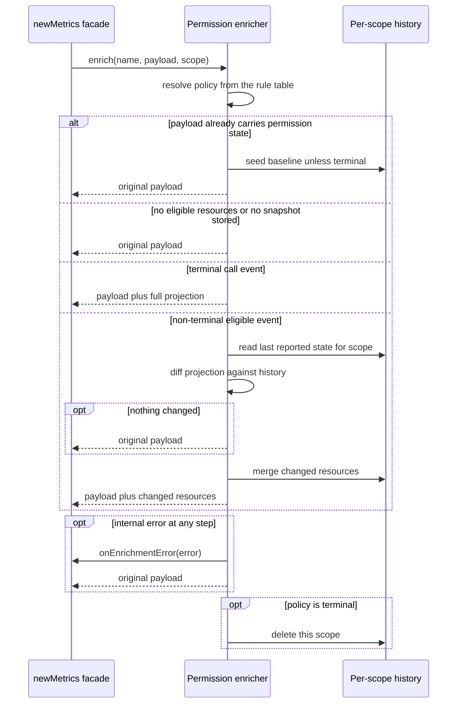
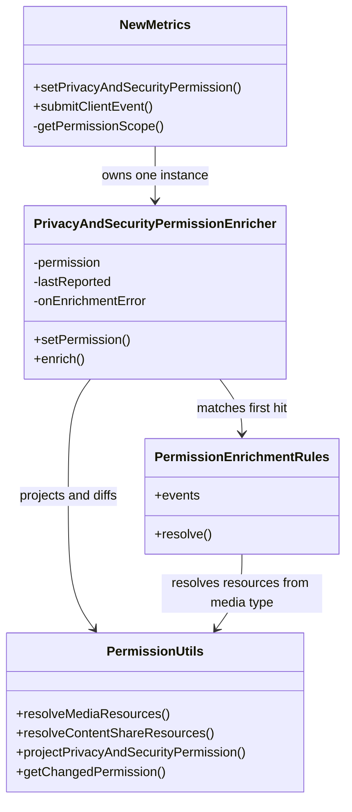
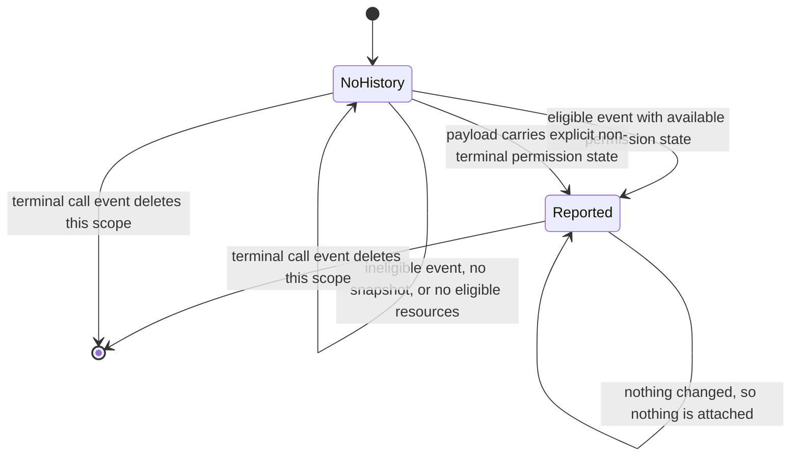

<!-- sdd-generated-metadata
doc_kind: module-spec
generated_from: module-spec@0.3.0
generated_by: claude-code
approved_by: rarajes2@cisco.com
updated_at: 2026-10-07T04:50:31Z
validation_status: pass
-->

# Privacy and security permission enricher

This source-local document at `src/privacy-and-security-permission-enricher/docs/README.md` owns the
stable specification for **the privacy and security permission enricher**. Ground every claim in
repository evidence and link to the
[repository architecture](../../../docs/architecture.md) instead of repeating broader facts.

Related context: [documentation index](../../../docs/index.md) ·
[documentation agent instructions](../../../AGENTS.md)

## Metadata

| Field         | Value                                                        |
| ------------- | ------------------------------------------------------------ |
| Owner         | Cisco Webex JS SDK — telemetry                               |
| Source path   | `src/privacy-and-security-permission-enricher/`              |
| Resource kind | module                                                       |
| Status        | Active                                                       |
| Last verified | 2026-10-05 at `d6202dd73d`                                   |
| Module id     | `privacy-and-security-permission-enricher`                   |
| Parent spec   | [`src/docs/README.md`](../../docs/README.md)                  |
| Doc kind      | Module spec                                                  |
| Coverage score | Pending coverage assessment                                 |
| Validation status | pass (2026-10-07; validator runtime 01a1147a-c744-7083-9b15-95e91170c79a; 0 blocking, 0 important, 0 medium, 0 minor; conformance and source-fidelity gates pass, no code/spec mismatches found) |

## Applicability

Sections preceded by an `Include if` comment are conditional. Retain a
conditional section only when source evidence or a confirmed developer answer
satisfies its condition.

| Condition ID                         | Status     | Evidence or reason                                                                                                     | Owned section                 |
| ------------------------------------ | ---------- | ---------------------------------------------------------------------------------------------------------------------- | ----------------------------- |
| `module.has_tiers`                   | N/A        | The repository defines no operational or review tier policy for modules                                                | Tier                          |
| `module.has_ui`                      | N/A        | The module renders nothing; it transforms an event payload object                                                       | UI use-case flow              |
| `module.crosses_service_boundaries`  | N/A        | No network, event or process boundary is crossed; every operation is a synchronous in-process call                      | Cross-boundary use-case flow  |
| `module.holds_client_state`          | Applicable | `src/privacy-and-security-permission-enricher/index.ts` holds the latest snapshot and a per-scope history map            | Client state model            |
| `module.enforces_domain_rules`       | Applicable | `src/privacy-and-security-permission-enricher/constants.ts` and `src/privacy-and-security-permission-enricher/index.ts`   | Business rules and invariants |
| `module.is_concurrent_async`         | N/A        | No promise, timer, subscription or worker; the enrichment call returns synchronously                                    | Concurrency and reactive flow |
| `module.owns_persistence`            | N/A        | No store, schema or migration; all state is in-memory and per-instance                                                  | Data, schema, and migration   |
| `module.stateful_transitions`        | Applicable | Per-scope history is seeded, updated on change and deleted on a terminal event in `src/privacy-and-security-permission-enricher/index.ts` | State machine |
| `module.exposes_wire_protocol`        | N/A        | The module adds one field to a payload owned and serialized elsewhere; it performs no serialization                      | Protocol and wire format      |
| `module.ui_multi_screen`             | N/A        | No user interface                                                                                                       | UI flow                       |
| `module.large_data_model`            | Applicable only to larger models; N/A here — the model is three permission resources, declared in `src/privacy-and-security-permission-enricher/types.ts` | Data model |
| `module.returns_caller_errors`       | N/A        | Body failures are routed to the injected handler and the original payload is returned; only a throwing handler or policy resolution could escape, and the façade's logging handler does not throw | Caller-visible failure modes  |
| `module.module_specific_conventions` | Applicable | The rule table and the projection helpers impose conventions beyond repository-wide rules                               | Module-specific rules         |
| `module.published_package`           | N/A        | Not re-exported from `src/index.ts`; reachable only through `src/new-metrics.ts`                                        | Export stability              |
| `module.embedded_in_host`            | N/A        | The module is not mounted into a host; its parent module owns the plugin registration contract                          | Host integration and theming  |
| `module.has_design_tradeoff`         | Applicable | Change-only reporting with per-scope history, versus reporting the full snapshot on every event                          | Key design trade-off          |
| `module.has_submodules`              | N/A        | Derived from the manifest module tree: this module has no child modules                                                  | Sub-modules                   |

## Evidence register

| Evidence                                                                 | What it establishes                                                                                                   |
| ------------------------------------------------------------------------ | --------------------------------------------------------------------------------------------------------------------- |
| `src/privacy-and-security-permission-enricher/index.ts`                   | The public surface, the rule table, the enrichment decision order and the per-scope history lifecycle                  |
| `src/privacy-and-security-permission-enricher/constants.ts`               | The four event groups that are eligible for enrichment and the empty policy used for every other event                |
| `src/privacy-and-security-permission-enricher/types.ts`                   | The policy, rule and context shapes the module is built around                                                        |
| `src/privacy-and-security-permission-enricher/utils.ts`                   | Resource resolution from media type, defensive projection and the change diff                                          |
| `src/new-metrics.ts`                                                      | The sole call site: construction with the error handler, the public permission setter and the scope resolution rule    |
| `src/metrics.types.ts`                                                    | The externally derived permission and client-event payload types this module operates on                              |
| `test/unit/spec/privacy-and-security-permission-enricher.ts`              | Behavioral verification of every rule, the change-only reporting rule, scope isolation and the error path              |

## Purpose and boundary

- Responsibility: deciding which browser permission state is attached to which Call Analyzer client
  event, and attaching only what has changed since the last report within the same call.
- In scope: the eligible-event rule table; resolving which permission resources a given event cares
  about; projecting the stored snapshot down to those resources; diffing against per-scope history;
  returning either the original payload or an enriched copy; clearing history at the end of a call.
- Out of scope: obtaining permission state from the browser (the client supplies it through the
  façade), building or submitting the event, and the meaning of the permission fields themselves,
  which is owned by the external Call Analyzer schema.
- Consumers: `src/new-metrics.ts` only. The class is not re-exported from `src/index.ts`.

## Structure and key files

| Path                                                        | Responsibility                                                                                                                                  |
| ----------------------------------------------------------- | ----------------------------------------------------------------------------------------------------------------------------------------------- |
| `src/privacy-and-security-permission-enricher/index.ts`     | The enricher class, the exported rule table and the policy resolver; authoritative for the enrichment decision order                            |
| `src/privacy-and-security-permission-enricher/constants.ts` | The four event-name sets and the no-enrichment policy; authoritative for which events are eligible                                              |
| `src/privacy-and-security-permission-enricher/types.ts`     | The policy, rule and enrichment-context types; authoritative for the rule contract                                                              |
| `src/privacy-and-security-permission-enricher/utils.ts`     | Media-type to resource resolution, defensive projection and the change diff; authoritative for what counts as a change                           |

## Public surface

| Surface                      | Consumer               | Compatibility commitment                                                                                       | Source                                                      |
| ---------------------------- | ---------------------- | -------------------------------------------------------------------------------------------------------------- | ----------------------------------------------------------- |
| `PrivacyAndSecurityPermissionEnricher` constructor | `src/new-metrics.ts` | Takes exactly one argument, the enrichment-error handler. Module-internal; not covered by any published guarantee | `src/privacy-and-security-permission-enricher/index.ts`     |
| `setPermission`              | `src/new-metrics.ts`   | Stores a defensive projection of the supplied snapshot. Module-internal                                        | `src/privacy-and-security-permission-enricher/index.ts`     |
| `enrich`                     | `src/new-metrics.ts`   | Never mutates its input, and returns the original payload reference when nothing is attached. Errors inside the enrichment body go to the injected handler and the original payload is returned; an error from policy resolution, which runs before the `try`, or from the handler itself propagates to the caller | `src/privacy-and-security-permission-enricher/index.ts`     |
| `PERMISSION_ENRICHMENT_RULES` | Tests, and future rules | Exported for inspection and verification; the array order is the match order                                   | `src/privacy-and-security-permission-enricher/index.ts`     |

Exact permission field definitions are not restated here. They are derived from the external Call
Analyzer schema through the types in `src/metrics.types.ts`.

## Dependencies

| Dependency                     | Why it is required                                                                  | Failure behavior                                                                            |
| ------------------------------ | ----------------------------------------------------------------------------------- | ------------------------------------------------------------------------------------------- |
| `src/metrics.types.ts`         | Supplies the permission, resource and client-event payload types                     | A type mismatch is a build-time failure, not a runtime one                                  |
| `lodash` deep equality         | Decides whether a projected resource differs from what was last reported             | Any thrown error is caught by the enrichment handler and the original payload is returned    |
| Enrichment-error handler       | Supplied by the caller so the module never has to know how to log                     | The handler is invoked and the original payload is returned; an exception from the handler itself propagates to the caller |

## Requirements

| ID        | WHAT                                                                                                                             | WHY                                                                                                                                                | Source evidence                                                 | Test or example evidence                                      | Assumptions or gaps | Confidence |
| --------- | -------------------------------------------------------------------------------------------------------------------------------- | -------------------------------------------------------------------------------------------------------------------------------------------------- | --------------------------------------------------------------- | ------------------------------------------------------------- | ------------------- | ---------- |
| `MOD-001` | Only events listed in one of the four event sets are enriched; every other event name returns its payload unchanged               | Permission state is only meaningful around capture, transmission, share and call-end milestones. Attaching it everywhere would inflate every event  | `src/privacy-and-security-permission-enricher/constants.ts`     | `test/unit/spec/privacy-and-security-permission-enricher.ts`  | none                | Present    |
| `MOD-002` | Each production event name appears in exactly one rule                                                                           | Rules are matched by first hit, so an event in two sets would silently take the earlier policy and the later one would be unreachable                | `src/privacy-and-security-permission-enricher/index.ts`         | `test/unit/spec/privacy-and-security-permission-enricher.ts`  | none                | Present    |
| `MOD-003` | Media transmission and content-share events are scoped to the resource implied by the payload's media type, not to all resources   | A microphone-only event must not carry camera state, which would misattribute a permission change to an unrelated action                            | `src/privacy-and-security-permission-enricher/utils.ts`         | `test/unit/spec/privacy-and-security-permission-enricher.ts`  | none                | Present    |
| `MOD-004` | A non-terminal event carries only the resources whose state changed since the last report for the same scope                      | Repeating unchanged state on every event would make it impossible to tell when a permission actually changed                                        | `src/privacy-and-security-permission-enricher/index.ts`         | `test/unit/spec/privacy-and-security-permission-enricher.ts`  | none                | Present    |
| `MOD-005` | A terminal call event carries the full projection of all three resources and does not consult or update history                   | The end-of-call event is the single record of final permission state, so it must be complete regardless of what was reported earlier                 | `src/privacy-and-security-permission-enricher/index.ts`         | `test/unit/spec/privacy-and-security-permission-enricher.ts`  | none                | Present    |
| `MOD-006` | History is tracked per scope, and a terminal event deletes only its own scope                                                     | Concurrent calls must not leak permission history into one another, and one call ending must not reset another call's baseline                       | `src/privacy-and-security-permission-enricher/index.ts`         | `test/unit/spec/privacy-and-security-permission-enricher.ts`  | none                | Present    |
| `MOD-007` | A payload that already carries explicit permission state is returned unchanged; on a non-terminal event that explicit state is merged into the scope's baseline, while on a terminal event it seeds nothing and the scope's history is deleted | An explicitly supplied value is authoritative for that event; adopting it as the baseline prevents the next event from re-reporting the same state, but a terminal event ends the scope, so nothing is kept for it | `src/privacy-and-security-permission-enricher/index.ts` | `test/unit/spec/privacy-and-security-permission-enricher.ts` | none | Present |
| `MOD-008` | Enrichment never mutates the input payload or the stored snapshot; it returns a new object when it attaches anything               | The caller reuses the payload it passed in, and the stored snapshot must stay the client-supplied truth                                             | `src/privacy-and-security-permission-enricher/utils.ts`         | `test/unit/spec/privacy-and-security-permission-enricher.ts`  | none                | Present    |
| `MOD-009` | No permission is attached before the client has supplied a snapshot, and an unavailable resource is omitted rather than reported empty | Absent state and denied state are different facts; emitting an empty object would be read as a real permission reading            | `src/privacy-and-security-permission-enricher/utils.ts`         | `test/unit/spec/privacy-and-security-permission-enricher.ts`  | none                | Present    |
| `MOD-010` | A failure inside the enrichment body is handed to the injected handler and the original payload is returned. Two paths are outside that guarantee: policy resolution runs before the try block, and an exception thrown by the injected handler itself propagates to the caller | Telemetry enrichment must not fail a client event submission; from `newMetrics` an escape needs a throwing logger in the façade's handler, or a payload whose fields read by the current resolvers have throwing getters | `src/privacy-and-security-permission-enricher/index.ts`, `src/new-metrics.ts` | `test/unit/spec/privacy-and-security-permission-enricher.ts` | No case covers a throwing handler or a throwing policy resolution | Present |

## Design overview

The module is one class plus a declarative rule table, and its whole design is the separation of
those two things.

The rule table in `src/privacy-and-security-permission-enricher/index.ts` pairs each event-name set
from `src/privacy-and-security-permission-enricher/constants.ts` with a resolver that returns a
policy: which permission resources this event cares about, and whether the event is terminal. Adding
or retargeting an event is therefore a change to the sets or the table, not to the enrichment
algorithm. Rules are matched by first hit, which is why the one-rule-per-event invariant matters and
why a test asserts it directly.

The class owns two pieces of state. `permission` is the latest snapshot the client supplied,
defensively projected to the three known resources on the way in so an unexpected field cannot reach
a payload. `lastReported` is a map from scope to the permission state most recently reported for that
scope; the scope comes from the caller and is the call's correlation identity, which is what makes
two concurrent calls independent.

`enrich` resolves the policy first, outside the try block, because the terminal flag drives the
`finally` cleanup and must be known even if the body throws. It then applies five decisions in order:
an explicitly supplied payload wins and, on a non-terminal event, seeds the baseline; an empty resource list means nothing to
do; a missing snapshot means nothing to report; a terminal event reports the full projection without
touching history; and otherwise the projection is diffed against history and only the changed
resources are attached. Because `getChangedPermission` compares whole resource objects by deep
equality, a change in any field of a resource — not only its status — counts as a change.

## Data flow and sequence coverage

The call style is a synchronous in-process method call. There is one operation group — enrich one
client event — because every public operation shares the same actor, ordering and absence of
transport or failure propagation. The error branch is shown as an `opt` on the same sequence rather
than as a separate diagram, since the actor order and the returned value are identical.

| Operation group                  | Entry and outcome                                                                                                             | Diagram or evidence                                                     | Failure and recovery coverage                                                                    |
| -------------------------------- | ----------------------------------------------------------------------------------------------------------------------------- | ----------------------------------------------------------------------- | ------------------------------------------------------------------------------------------------ |
| Store the latest snapshot        | The client calls the façade setter; the projected snapshot replaces the previous one                                           | `src/privacy-and-security-permission-enricher/index.ts`                 | No failure path; projection drops unknown resources rather than rejecting the snapshot            |
| Enrich one client event          | The façade passes name, payload and scope; the original payload or an enriched copy is returned, and history is updated or cleared | Sequence diagram below                                                  | Internal error routed to the handler, original payload returned; terminal cleanup still runs; a throwing handler propagates |

## Class and component relationships

## Use cases and flows

| Use case | Actor or caller                | Primary steps and outcome                                                                                                                              | Failure or boundary behavior                                                                                   | Evidence                                                                                                                   |
| -------- | ------------------------------ | ------------------------------------------------------------------------------------------------------------------------------------------------------ | -------------------------------------------------------------------------------------------------------------- | -------------------------------------------------------------------------------------------------------------------------- |
| `UC-001` | First party client             | Client supplies a permission snapshot, then a call-initiated event is submitted; camera and microphone state is attached once                            | A second call-initiated event with unchanged state attaches nothing                                            | `src/privacy-and-security-permission-enricher/index.ts`, `test/unit/spec/privacy-and-security-permission-enricher.ts`      |
| `UC-002` | Media layer, through the façade | An audio transmission event is submitted; only microphone state is attached, and only if it changed                                                     | A share media type on a camera-and-microphone event resolves to no resources and attaches nothing              | `src/privacy-and-security-permission-enricher/utils.ts`, `test/unit/spec/privacy-and-security-permission-enricher.ts`      |
| `UC-003` | Meetings layer                 | A call-leave event is submitted; the full three-resource projection is attached and the scope's history is deleted                                       | History for other scopes is untouched, so a concurrent call keeps its baseline                                 | `src/privacy-and-security-permission-enricher/index.ts`, `test/unit/spec/privacy-and-security-permission-enricher.ts`      |
| `UC-004` | Caller with its own state      | A payload already containing permission state is submitted; it is returned unchanged and recorded as the new baseline                                   | A terminal event with explicit state clears the scope instead of seeding it                                    | `src/privacy-and-security-permission-enricher/index.ts`, `test/unit/spec/privacy-and-security-permission-enricher.ts`      |
| `UC-005` | Any caller, degraded case      | An internal comparison throws; the handler receives the error and the submission proceeds with the original payload                                     | The event is still submitted; only the enrichment is lost                                                      | `src/privacy-and-security-permission-enricher/index.ts`, `test/unit/spec/privacy-and-security-permission-enricher.ts`      |

<!-- Include if: the module holds client-side state. [condition-id: module.holds_client_state] -->

## Client state model

| State or slice              | Owner                | Initial state      | Transition triggers                                                                 | Reset or persistence boundary                                                      |
| --------------------------- | -------------------- | ------------------ | ----------------------------------------------------------------------------------- | ---------------------------------------------------------------------------------- |
| Latest permission snapshot  | The enricher instance | Undefined          | The façade's public permission setter; stored as a projection of the three resources | Replaced wholesale on every set; never cleared, and never persisted                |
| Per-scope reported history  | The enricher instance | Empty map          | Merged on every non-terminal enrichment that attaches something, and on an explicit payload | The scope's entry is deleted when a terminal call event is enriched for that scope |

<!-- Include if: the module enforces domain rules or entity invariants. [condition-id: module.enforces_domain_rules] -->

## Business rules and invariants

| ID        | Invariant                                                                                                   | WHY                                                                                                            | Enforcement source                                             | Test evidence                                                 |
| --------- | ----------------------------------------------------------------------------------------------------------- | -------------------------------------------------------------------------------------------------------------- | -------------------------------------------------------------- | ------------------------------------------------------------- |
| `INV-001` | An event name belongs to at most one rule set                                                               | First-hit matching makes a duplicate silently unreachable                                                      | `src/privacy-and-security-permission-enricher/constants.ts`    | `test/unit/spec/privacy-and-security-permission-enricher.ts`  |
| `INV-002` | A projection contains only the requested resources, and is undefined rather than empty when none are present | An empty object in the payload would be read as a real, complete permission reading                            | `src/privacy-and-security-permission-enricher/utils.ts`        | `test/unit/spec/privacy-and-security-permission-enricher.ts`  |
| `INV-003` | Neither the input payload nor the stored snapshot is mutated                                                | The caller reuses the payload, and the snapshot must remain the client-supplied truth for later diffs           | `src/privacy-and-security-permission-enricher/utils.ts`        | `test/unit/spec/privacy-and-security-permission-enricher.ts`  |
| `INV-004` | A terminal event neither reads nor writes history, and always deletes its scope                             | The final record must be complete and must not depend on, or leave behind, intermediate state                   | `src/privacy-and-security-permission-enricher/index.ts`        | `test/unit/spec/privacy-and-security-permission-enricher.ts`  |
| `INV-005` | The enrichment body never throws to the caller; failures go to the injected handler, which is expected not to throw | A telemetry enrichment failure must not fail the client event it was decorating | `src/privacy-and-security-permission-enricher/index.ts` | `test/unit/spec/privacy-and-security-permission-enricher.ts` |

<!-- Include if: the module has non-trivial state transitions. [condition-id: module.stateful_transitions] -->

## State machine

The state is the per-scope history entry. There is one entry per scope, created on first report and
destroyed by the terminal event for that scope.

Guards and rejected transitions:

- A terminal event never enters the `Reported` write path; it reports the full projection and leaves.
- An event whose resolved resource list is empty cannot create or advance history, which is what
  keeps a share media type on a camera-and-microphone event from recording a baseline.
- Deleting a scope affects only that key, so another scope in `Reported` stays there.

## Pitfalls and constraints

- Rule order is significant. The rule table is matched by first hit, so moving an event name into an
  earlier set silently changes its policy. The one-rule-per-event test is the guard; keep it passing
  rather than relying on review.
- The policy must be resolved before the try block. The terminal flag drives the `finally` cleanup,
  so resolving it inside the body would leave a scope uncleaned when the body throws. The cost is that
  a throw during policy resolution is not caught, and neither is a throw from the injected error
  handler: the containment guarantee holds only while that handler does not throw.
- An explicitly supplied permission payload is authoritative but not free: on a non-terminal event it
  is merged into the baseline, so a caller that supplies state once and then stops will see the next
  automatic report diffed against what it supplied.
- Change detection is whole-resource, not field-level. Any difference inside a resource object makes
  the whole resource count as changed and be re-reported.
- The three permission resource names are hard-coded in the setter's projection and in the terminal
  rule. Adding a fourth resource means updating both, not only the type.

<!-- Include if: the module has conventions beyond repository-wide rules. [condition-id: module.module_specific_conventions] -->

## Module-specific rules

- Do: add or retarget an event by editing the event sets in
  `src/privacy-and-security-permission-enricher/constants.ts` or the rule table in
  `src/privacy-and-security-permission-enricher/index.ts`, and extend the one-rule-per-event test.
- Do: keep every resolver pure. A resolver receives the payload and returns a policy; it must not
  read or write enricher state.
- Do not: add a branch to `enrich` for a specific event name. Event-specific behavior belongs in the
  rule table, which is what keeps the algorithm testable.
- Do not: let an error escape `enrich`. The handler exists so the module never needs to know how the
  host logs, and so a client event is not lost to an enrichment bug. Policy resolution and the handler
  call sit outside the guard today, so a new resolver must not throw and a handler must not throw.
- Do not: return the stored snapshot object, or any part of it, without projecting first. The
  projection is what prevents a caller from mutating the enricher's state through a payload it holds.

<!-- Include if: the module has a non-obvious design trade-off consumers or maintainers must preserve. [condition-id: module.has_design_tradeoff] -->

## Key design trade-off

| Chosen trade-off                                                                                              | Preserved invariant or benefit                                                                                                              | Cost or limitation                                                                                                                                                 | Decision evidence                                                |
| ------------------------------------------------------------------------------------------------------------- | ------------------------------------------------------------------------------------------------------------------------------------------- | ------------------------------------------------------------------------------------------------------------------------------------------------------------------ | ---------------------------------------------------------------- |
| Report only what changed, keeping per-scope history, instead of attaching the full snapshot to every event      | A permission change is visible as an event in the telemetry stream, and payload size stays proportional to real changes rather than to event volume | The enricher must hold mutable per-call state, and a consumer reading a single event in isolation cannot see unchanged resources                                | `src/privacy-and-security-permission-enricher/index.ts`          |
| Exempt terminal call events from change-only reporting                                                          | One event per call always carries the complete final permission state, so a call can be interpreted without replaying every earlier event     | That event is larger, and it duplicates state already reported earlier in the same call                                                                          | `src/privacy-and-security-permission-enricher/index.ts`          |
| Route enrichment-body errors into an injected handler rather than propagating                                   | A client event is not lost because the enrichment body failed, provided the resolver and the handler do not throw                           | An enrichment bug is silent in the data: the event still arrives, just without permission state, so the handler's log line is the only signal                     | `src/new-metrics.ts`                                             |

## Verification

| Requirement or invariant | Test level | Positive evidence                                             | Negative or boundary evidence                                 | Gap                                                                                               |
| ------------------------ | ---------- | ------------------------------------------------------------- | ------------------------------------------------------------- | ------------------------------------------------------------------------------------------------- |
| `MOD-001`                | Unit       | `test/unit/spec/privacy-and-security-permission-enricher.ts`  | `test/unit/spec/privacy-and-security-permission-enricher.ts`  | none                                                                                              |
| `MOD-002` / `INV-001`    | Unit       | `test/unit/spec/privacy-and-security-permission-enricher.ts`  | none found — the invariant is asserted directly over the rule table rather than by a failing case | none                                   |
| `MOD-003`                | Unit       | `test/unit/spec/privacy-and-security-permission-enricher.ts`  | `test/unit/spec/privacy-and-security-permission-enricher.ts`  | none                                                                                              |
| `MOD-004`                | Unit       | `test/unit/spec/privacy-and-security-permission-enricher.ts`  | `test/unit/spec/privacy-and-security-permission-enricher.ts`  | none                                                                                              |
| `MOD-005`                | Unit       | `test/unit/spec/privacy-and-security-permission-enricher.ts`  | `test/unit/spec/privacy-and-security-permission-enricher.ts`  | none                                                                                              |
| `MOD-006` / `INV-004`    | Unit       | `test/unit/spec/privacy-and-security-permission-enricher.ts`  | `test/unit/spec/privacy-and-security-permission-enricher.ts`  | none                                                                                              |
| `MOD-007`                | Unit       | `test/unit/spec/privacy-and-security-permission-enricher.ts`  | `test/unit/spec/privacy-and-security-permission-enricher.ts`  | none                                                                                              |
| `MOD-008` / `INV-003`    | Unit       | `test/unit/spec/privacy-and-security-permission-enricher.ts`  | none found — mutation is asserted absent rather than provoked | none                                                                                              |
| `MOD-009` / `INV-002`    | Unit       | `test/unit/spec/privacy-and-security-permission-enricher.ts`  | `test/unit/spec/privacy-and-security-permission-enricher.ts`  | none                                                                                              |
| `MOD-010` / `INV-005`    | Unit       | `test/unit/spec/privacy-and-security-permission-enricher.ts`  | `test/unit/spec/privacy-and-security-permission-enricher.ts`  | none                                                                                              |
| Scope resolution from event options | Unit | `test/unit/spec/new-metrics.ts`                       | none found                                                    | The fallback chain from correlation identifier to meeting correlation identifier to the default scope is exercised through the façade, not by a dedicated case |

Record coverage gaps explicitly and link follow-up work. A module specification
is complete only when its public surface, invariants, failure modes, and test
evidence agree with the implementation.
