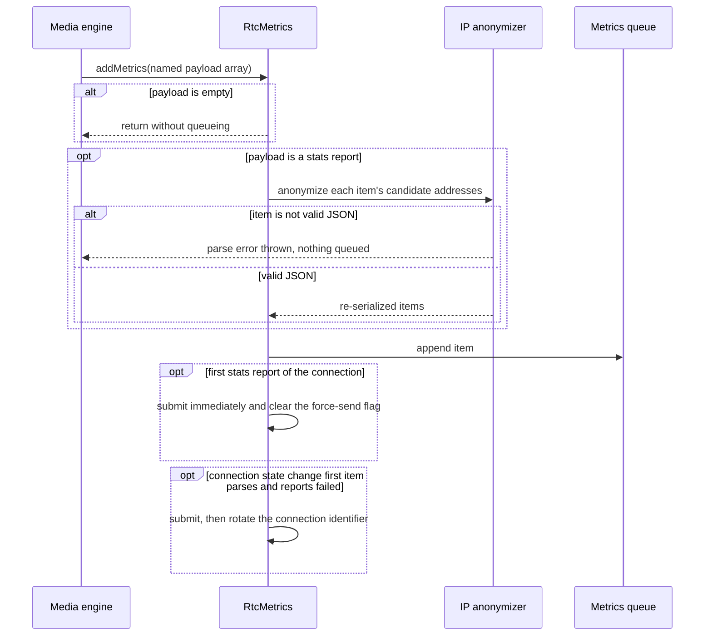
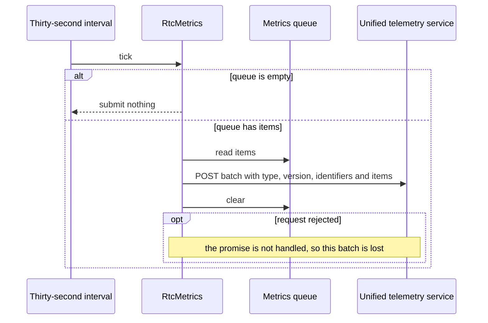
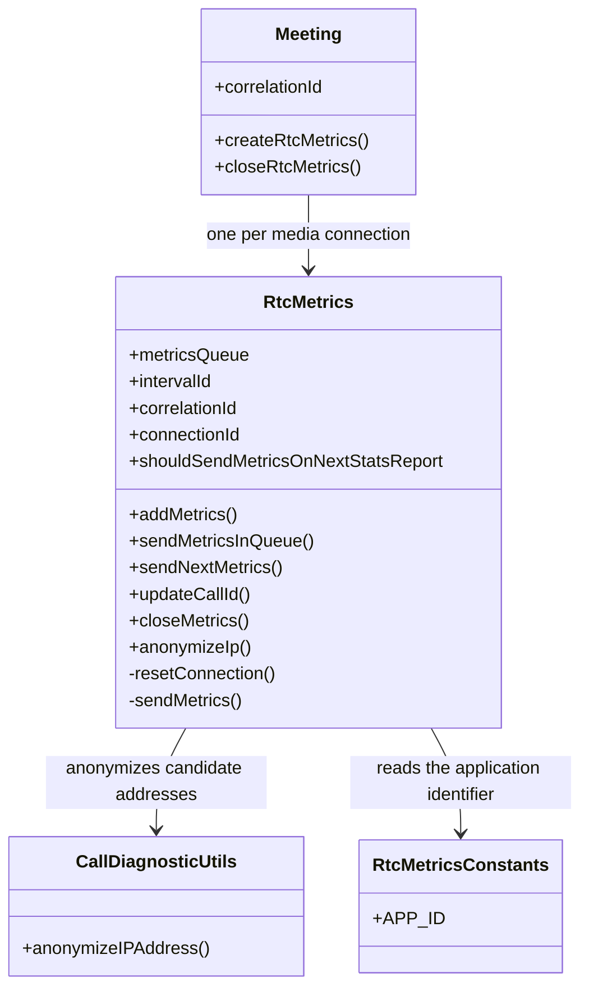
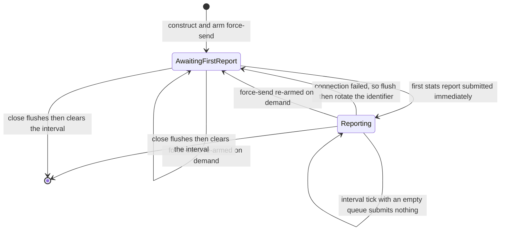

<!-- sdd-generated-metadata
doc_kind: module-spec
generated_from: module-spec@0.3.0
generated_by: claude-code
approved_by: rarajes2@cisco.com
updated_at: 2026-10-07T04:50:31Z
validation_status: pass
-->

# WebRTC stats telemetry

This source-local document at `src/rtcMetrics/docs/README.md` owns the stable specification for
**the WebRTC stats telemetry reporter**. Ground every claim in repository evidence and link to the
[repository architecture](../../../docs/architecture.md) instead of repeating broader facts.

Related context: [documentation index](../../../docs/index.md) ·
[documentation agent instructions](../../../AGENTS.md)

## Metadata

| Field         | Value                                        |
| ------------- | -------------------------------------------- |
| Owner         | Cisco Webex JS SDK — telemetry               |
| Source path   | `src/rtcMetrics/`                            |
| Resource kind | module                                       |
| Status        | Active                                       |
| Last verified | 2026-10-05 at `d6202dd73d`                   |
| Module id     | `rtc-metrics`                                |
| Parent spec   | [`src/docs/README.md`](../../docs/README.md)  |
| Doc kind      | Module spec                                  |
| Coverage score | Pending coverage assessment                 |
| Validation status | pass (2026-10-07; validator runtime 01a1147a-c744-7083-9b15-95e91170c79a; 0 blocking, 0 important, 0 medium, 0 minor; conformance and source-fidelity gates pass, no code/spec mismatches found) |

## Applicability

Sections preceded by an `Include if` comment are conditional. Retain a
conditional section only when source evidence or a confirmed developer answer
satisfies its condition.

| Condition ID                         | Status     | Evidence or reason                                                                                                   | Owned section                 |
| ------------------------------------ | ---------- | -------------------------------------------------------------------------------------------------------------------- | ----------------------------- |
| `module.has_tiers`                   | N/A        | The repository defines no operational or review tier policy for modules                                              | Tier                          |
| `module.has_ui`                      | N/A        | The module renders nothing                                                                                           | UI use-case flow              |
| `module.crosses_service_boundaries`  | Applicable | `src/rtcMetrics/index.ts` posts directly to the unified telemetry service                                            | Cross-boundary use-case flow  |
| `module.holds_client_state`          | Applicable | `src/rtcMetrics/index.ts` holds the metrics queue, the connection identifier and the force-send flag                  | Client state model            |
| `module.enforces_domain_rules`       | Applicable | Candidate address anonymization and connection-identifier rotation in `src/rtcMetrics/index.ts`                      | Business rules and invariants |
| `module.is_concurrent_async`         | Applicable | A repeating browser interval drives submission in `src/rtcMetrics/index.ts`                                          | Concurrency and reactive flow |
| `module.owns_persistence`            | N/A        | No store, schema or migration; the queue is in-memory and emptied on submission                                      | Data, schema, and migration   |
| `module.stateful_transitions`        | Applicable | The connection lifecycle rotates the identifier and re-arms the force-send flag in `src/rtcMetrics/index.ts`          | State machine                 |
| `module.exposes_wire_protocol`       | Applicable | The submitted batch shape is declared in `src/metrics.types.ts` and assembled in `src/rtcMetrics/index.ts`            | Protocol and wire format      |
| `module.ui_multi_screen`             | N/A        | No user interface                                                                                                    | UI flow                       |
| `module.large_data_model`            | N/A        | One attribute object plus an opaque array of serialized stats items                                                  | Data model                    |
| `module.returns_caller_errors`       | N/A        | Every operation returns void and the submission promise is not returned to a caller                                  | Caller-visible failure modes  |
| `module.module_specific_conventions` | Applicable | Stats items are handled as JSON strings rather than objects throughout `src/rtcMetrics/index.ts`                      | Module-specific rules         |
| `module.published_package`           | Applicable | Re-exported from `src/index.ts`, which is the file that crosses the package boundary to the meetings plugin           | Export stability              |
| `module.embedded_in_host`            | N/A        | A plain class, not a registered plugin; the parent module owns the registration contract                             | Host integration and theming  |
| `module.has_design_tradeoff`         | Applicable | Immediate submission of the first useful stats report, versus waiting for the normal interval                         | Key design trade-off          |
| `module.has_submodules`              | N/A        | Derived from the manifest module tree: this module has no child modules                                               | Sub-modules                   |

## Evidence register

| Evidence                                                   | What it establishes                                                                                             |
| ---------------------------------------------------------- | --------------------------------------------------------------------------------------------------------------- |
| `src/rtcMetrics/index.ts`                                  | The public surface, the queue and interval behavior, anonymization, connection rotation and the submitted batch  |
| `src/rtcMetrics/constants.ts`                              | The fixed application identifier sent as a request header                                                       |
| `src/metrics.types.ts`                                     | The identifier-pair input type and the submitted attribute shape                                                |
| `src/call-diagnostic/call-diagnostic-metrics.util.ts`       | The IP anonymization helper this module reuses                                                                  |
| `src/index.ts`                                             | That the class is part of the published export surface                                                          |
| `test/unit/spec/rtcMetrics/index.ts`                       | Behavioral verification of queueing, the interval, anonymization, connection rotation and the force-send path    |

## Purpose and boundary

- Responsibility: collecting WebRTC media statistics items produced by the media engine, anonymizing
  candidate addresses, and submitting them in batches to the Webex unified telemetry service.
- In scope: the metrics queue; the repeating submission interval; anonymization of local and remote
  candidate addresses; rotating the connection identifier when a media connection fails; forcing an
  immediate submission on the next stats report; assembling the submitted attribute object.
- Out of scope: producing the statistics themselves, which come from the media engine through the
  meetings layer; the meaning of individual stats fields, which this module never parses beyond
  candidate addresses; and the upstream ingestion contract, which the telemetry service owns.
- Consumers: `packages/@webex/plugin-meetings/src/meeting/index.ts` and
  `packages/@webex/plugin-meetings/src/media/index.ts`, which construct one instance per media
  connection. Exported publicly from `src/index.ts`.

## Structure and key files

| Path                            | Responsibility                                                                                                                            |
| ------------------------------- | ----------------------------------------------------------------------------------------------------------------------------------------- |
| `src/rtcMetrics/index.ts`       | The reporter class: queue, interval, anonymization, connection lifecycle and submission; authoritative for all module behavior             |
| `src/rtcMetrics/constants.ts`   | The registered application identifier; authoritative for the value sent in the request header                                              |

## Public surface

| Surface                | Consumer                                                     | Compatibility commitment                                                                              | Source                        |
| ---------------------- | ------------------------------------------------------------ | ----------------------------------------------------------------------------------------------------- | ----------------------------- |
| `RtcMetrics` constructor | `packages/@webex/plugin-meetings/src/meeting/index.ts`      | Takes the SDK instance, a meeting or call identifier pair, and a correlation identifier. Starts the interval immediately | `src/rtcMetrics/index.ts`     |
| `addMetrics`           | `packages/@webex/plugin-meetings/src/media/index.ts`         | Accepts a named payload array of serialized stats items; ignores an empty payload                     | `src/rtcMetrics/index.ts`     |
| `sendMetricsInQueue`   | `packages/@webex/plugin-meetings/src/meeting/index.ts`       | Submits and clears the queue only when it is non-empty                                                | `src/rtcMetrics/index.ts`     |
| `sendNextMetrics`      | `packages/@webex/plugin-meetings/src/meeting/index.ts`       | Arms immediate submission on the next stats report                                                    | `src/rtcMetrics/index.ts`     |
| `updateCallId`         | `packages/@webex/plugin-meetings/src/meeting/index.ts`       | Replaces the call identifier used by later submissions                                                | `src/rtcMetrics/index.ts`     |
| `closeMetrics`         | `packages/@webex/plugin-meetings/src/meeting/index.ts`       | Flushes the queue, then clears the interval. Must be called or the interval leaks                     | `src/rtcMetrics/index.ts`     |
| `anonymizeIp`          | Tests, and internally per stats item                         | Anonymizes candidate addresses in one serialized stats item and returns it re-serialized              | `src/rtcMetrics/index.ts`     |

The submitted batch shape is declared in `src/metrics.types.ts`; it is not restated here.

## Dependencies

| Dependency                                             | Why it is required                                                               | Failure behavior                                                                                      |
| ------------------------------------------------------ | -------------------------------------------------------------------------------- | ----------------------------------------------------------------------------------------------------- |
| `src/call-diagnostic/call-diagnostic-metrics.util.ts`   | Supplies the IP anonymization helper applied to candidate addresses              | An unanonymizable value becomes undefined, which drops the field rather than emitting the raw address  |
| The host SDK request pipeline                           | Performs the HTTP POST to the unified telemetry service                          | The returned promise is not awaited or handled, so a failed submission is silently lost                |
| The host SDK device registration                        | Supplies the user identifier included in every batch                             | A missing device makes the field undefined; submission still proceeds                                 |
| `uuid`                                                  | Generates each connection identifier                                             | No failure path                                                                                       |
| Browser `setInterval`                                   | Drives periodic submission; used explicitly so the handle is typed as a browser timer | Not available outside a browser, so the class is a browser-only surface                            |

## Requirements

| ID        | WHAT                                                                                                                   | WHY                                                                                                                                                       | Source evidence                 | Test or example evidence             | Assumptions or gaps                                                                 | Confidence |
| --------- | ---------------------------------------------------------------------------------------------------------------------- | --------------------------------------------------------------------------------------------------------------------------------------------------------- | ------------------------------- | ------------------------------------ | ----------------------------------------------------------------------------------- | ---------- |
| `MOD-001` | Queued stats items are submitted every thirty seconds and the queue is emptied after each submission                    | Per-item submission would multiply request volume during a call; a fixed window bounds it without losing data                                             | `src/rtcMetrics/index.ts`       | `test/unit/spec/rtcMetrics/index.ts` | none                                                                                | Present    |
| `MOD-002` | An interval tick with an empty queue submits nothing                                                                    | An idle media connection must not generate empty telemetry requests for the whole duration of a call                                                      | `src/rtcMetrics/index.ts`       | `test/unit/spec/rtcMetrics/index.ts` | none                                                                                | Present    |
| `MOD-003` | Local and remote candidate addresses are anonymized before a stats report is queued                                     | Candidate addresses are personally identifying network data and must not leave the client intact                                                          | `src/rtcMetrics/index.ts`       | `test/unit/spec/rtcMetrics/index.ts` | none                                                                                | Present    |
| `MOD-004` | The first stats report of a connection is submitted immediately rather than waiting for the interval                    | The media engine produces the first useful data a few seconds in; submitting at once means a user who abandons the call early is still represented          | `src/rtcMetrics/index.ts`       | `test/unit/spec/rtcMetrics/index.ts` | none                                                                                | Present    |
| `MOD-005` | A failed connection state change flushes the queue and rotates to a new connection identifier                           | Statistics from a dead connection must not be attributed to its replacement, so the identifier is the boundary between attempts                           | `src/rtcMetrics/index.ts`       | `test/unit/spec/rtcMetrics/index.ts` | none                                                                                | Present    |
| `MOD-006` | A successful connection keeps the same connection identifier across submissions                                        | Consumers correlate all batches from one media connection by that identifier                                                                              | `src/rtcMetrics/index.ts`       | `test/unit/spec/rtcMetrics/index.ts` | none                                                                                | Present    |
| `MOD-007` | Each batch carries either a meeting identifier or a call identifier, never both, with the meeting identifier preferred   | The two identify different products, and ingestion routes on exactly one of them                                                                          | `src/rtcMetrics/index.ts`       | `test/unit/spec/rtcMetrics/index.ts` | none                                                                                | Present    |
| `MOD-008` | The call identifier can be replaced after construction                                                                  | A calling session learns its call identifier after the media connection is already reporting                                                              | `src/rtcMetrics/index.ts`       | `test/unit/spec/rtcMetrics/index.ts` | none                                                                                | Present    |
| `MOD-009` | Closing the reporter flushes the queue and then clears the interval                                                     | A call ending must not discard the last window, and the interval must not outlive the connection                                                          | `src/rtcMetrics/index.ts`       | `test/unit/spec/rtcMetrics/index.ts` | none                                                                                | Present    |
| `MOD-010` | Stats-report items must be valid JSON: anonymization parses each item and a malformed one throws from the add operation before the item is queued. The connection-failure detector parses only the first item of the payload, treats an unparseable or absent first item as "not failed" without throwing, and still queues the original item | Anonymization has to reach candidate address fields, so it cannot pass an unparseable stats report through; the failure detector is a best-effort trigger and must not drop data it cannot read | `src/rtcMetrics/index.ts` | none found | No case feeds a malformed stats-report item or an unparseable connection-state payload; both parse paths are unverified | Weak |
| `MOD-011` | Submission failures are not surfaced to the caller: the telemetry request promise is neither returned nor caught | Telemetry must never affect a call. Every operation returns void; a rejected request is left unhandled and that batch is lost | `src/rtcMetrics/index.ts` | none found | No case rejects the request and asserts the call is unaffected | Weak |

## Design overview

The reporter is a plain class, not an SDK plugin, because one instance exists per media connection
rather than per SDK instance. The meetings layer constructs it when a media connection is created
and closes it when the connection ends.

Its internal shape is a queue plus two timers' worth of policy. `metricsQueue` accumulates whatever
the media engine hands over; the thirty-second browser interval submits and empties it. Everything
else in the class exists to handle the two cases where the plain interval is the wrong answer.

The first is the start of a connection. The media engine produces its first useful statistics report
a few seconds after the connection comes up, and a user who is unhappy with media quality often
closes the browser within the first window. `shouldSendMetricsOnNextStatsReport` is therefore armed
on construction and after every connection rotation, and the first stats report that arrives
triggers an immediate submission before the flag is cleared. `sendNextMetrics` re-arms it so the
meetings layer can force the same behavior after a significant media event, such as moving from the
lobby into the meeting.

The second is connection failure. When a connection-state-change item reports a failed connection,
the queue is flushed and `resetConnection` generates a new connection identifier, which is the field
consumers use to group batches from one connection. Flushing before rotating is what keeps the
failed connection's statistics attributed to the failed connection.

Stats items are handled as JSON strings end to end. `addMetrics` receives them serialized, the
anonymization step parses one item, rewrites candidate addresses and re-serializes it, and the
submitted batch carries the array of strings unchanged. Anonymization parses without a guard, so a
malformed stats-report item throws out of `addMetrics` before anything is queued; the
connection-failure check uses a guarded parse of the first item and falls back to "not failed". The module never builds an object model of a
statistics report, which is why a schema change in the media engine does not require a change here.

## Data flow and sequence coverage

The call style is an in-process method call for collection and a direct HTTP POST for submission.
There are two operation groups, and they are diagrammed separately because their actor order and
state outcome differ: collection is driven by the media engine, while submission is driven by a timer
or by a connection event.

| Operation group        | Entry and outcome                                                                                              | Diagram or evidence                  | Failure and recovery coverage                                                                                     |
| ---------------------- | -------------------------------------------------------------------------------------------------------------- | ------------------------------------ | ----------------------------------------------------------------------------------------------------------------- |
| Collect a stats item   | The media engine calls the add operation; the item is anonymized if it is a stats report and appended           | First sequence diagram below         | An empty payload is ignored; a malformed stats-report item throws from `addMetrics` and is not queued; an unparseable connection-state payload is queued but never triggers rotation |
| Submit a batch         | An interval tick, a forced first report, a connection failure or a close flushes the queue to the service       | Second sequence diagram below        | An empty queue submits nothing; a rejected request is not handled, so that batch is lost                          |

## Class and component relationships

## Use cases and flows

| Use case | Actor or caller       | Primary steps and outcome                                                                                                             | Failure or boundary behavior                                                                   | Evidence                                                                     |
| -------- | --------------------- | ------------------------------------------------------------------------------------------------------------------------------------- | ---------------------------------------------------------------------------------------------- | ---------------------------------------------------------------------------- |
| `UC-001` | Media engine          | A stats report arrives during a healthy call; candidate addresses are anonymized and the item is queued until the next interval tick    | An empty payload is ignored entirely                                                           | `src/rtcMetrics/index.ts`, `test/unit/spec/rtcMetrics/index.ts`               |
| `UC-002` | Media engine          | The first stats report of a connection arrives; it is submitted immediately instead of waiting up to thirty seconds                     | The flag is cleared, so the second report waits for the interval                               | `src/rtcMetrics/index.ts`, `test/unit/spec/rtcMetrics/index.ts`               |
| `UC-003` | Media engine          | A connection-state item reports a failed connection; the queue is flushed and a new connection identifier is generated and re-armed     | Items queued afterwards are attributed to the new connection identifier                        | `src/rtcMetrics/index.ts`, `test/unit/spec/rtcMetrics/index.ts`               |
| `UC-004` | Calling session       | The call identifier becomes known after construction; it is set and appears in later batches                                            | A meeting identifier, if present, still takes precedence over the call identifier              | `src/rtcMetrics/index.ts`, `test/unit/spec/rtcMetrics/index.ts`               |
| `UC-005` | Meetings layer        | The call ends; closing flushes the final window and clears the interval                                                                 | Closing with an empty queue clears the interval without submitting                             | `src/rtcMetrics/index.ts`, `test/unit/spec/rtcMetrics/index.ts`               |

<!-- Include if: the module calls another service or crosses an event or network boundary. [condition-id: module.crosses_service_boundaries] -->

### Cross-boundary use-case flow

All five use cases converge on one outbound boundary: a POST to the unified telemetry service's
versioned metric resource, through the host SDK request pipeline.

- Boundary and transport: HTTPS POST to the `unifiedTelemetry` service, resource `metric/v2`, with a
  media type header and the registered application identifier from `src/rtcMetrics/constants.ts`.
- Ordering: batches are submitted in queue order and one submission is started per flush. Nothing
  serializes concurrent flushes, so a forced submission and an interval tick in the same turn can
  produce two in-flight requests; because the queue is cleared between them, they carry disjoint data.
- Compatibility: the batch declares its own version field, so ingestion can distinguish payload
  generations. The statistics items themselves are opaque strings and pass through unchanged.
- Timeout and retry: none. This module does not use the batcher family, so there is no queueing,
  backoff or re-enqueue. A failed request loses that batch.
- Recovery: the next window submits new data. There is no replay of a lost batch, which is an
  accepted limitation for sampled media statistics.

<!-- Include if: the module holds client-side state. [condition-id: module.holds_client_state] -->

## Client state model

| State or slice                       | Owner                  | Initial state                      | Transition triggers                                                                  | Reset or persistence boundary                                      |
| ------------------------------------ | ---------------------- | ---------------------------------- | ------------------------------------------------------------------------------------ | ------------------------------------------------------------------ |
| Metrics queue                        | The reporter instance  | Empty array                        | An item is appended by the add operation                                             | Emptied on every submission; never persisted                       |
| Connection identifier                | The reporter instance  | Generated at construction          | Regenerated when a connection-state item reports a failed connection                 | Lives for one media connection attempt                             |
| Force-send flag                      | The reporter instance  | Armed at construction              | Cleared after the first stats report is submitted; re-armed on rotation or on demand  | Per connection attempt                                             |
| Interval handle                      | The reporter instance  | Started at construction            | None                                                                                 | Cleared only by closing the reporter                               |
| Meeting and call identifiers          | The reporter instance  | Supplied at construction           | The call identifier can be replaced through the public setter                         | Lives for the reporter's lifetime                                  |

<!-- Include if: the module enforces domain rules or entity invariants. [condition-id: module.enforces_domain_rules] -->

## Business rules and invariants

| ID        | Invariant                                                                                                 | WHY                                                                                                     | Enforcement source         | Test evidence                        |
| --------- | --------------------------------------------------------------------------------------------------------- | ------------------------------------------------------------------------------------------------------- | -------------------------- | ------------------------------------ |
| `INV-001` | No candidate address leaves the client un-anonymized                                                      | Candidate addresses are personally identifying network data                                             | `src/rtcMetrics/index.ts`  | `test/unit/spec/rtcMetrics/index.ts` |
| `INV-002` | Anonymization is applied only to stats reports, and only to local and remote candidate entries            | Other item kinds carry no address fields, so parsing and rewriting them would be wasted work and risk   | `src/rtcMetrics/index.ts`  | `test/unit/spec/rtcMetrics/index.ts` |
| `INV-003` | A submitted batch is never empty                                                                          | Empty requests would add call-duration-proportional noise to ingestion                                  | `src/rtcMetrics/index.ts`  | `test/unit/spec/rtcMetrics/index.ts` |
| `INV-004` | The queue is flushed before the connection identifier rotates                                             | Otherwise a failed connection's statistics would be attributed to its replacement                       | `src/rtcMetrics/index.ts`  | `test/unit/spec/rtcMetrics/index.ts` |
| `INV-005` | A batch carries at most one of the meeting and call identifiers                                           | Ingestion routes on exactly one; both would be ambiguous                                                | `src/rtcMetrics/index.ts`  | `test/unit/spec/rtcMetrics/index.ts` |

<!-- Include if: the module is concurrent, asynchronous, reactive, or event-driven. [condition-id: module.is_concurrent_async] -->

## Concurrency and reactive flow

- Execution model: a single repeating browser interval, started in the constructor, plus synchronous
  calls from the media engine and the meetings layer. The browser `setInterval` is used explicitly so
  the handle is typed as a browser timer rather than a Node.js one.
- Ordering guarantees: items are appended and submitted in arrival order. Within one submission the
  queue is read, sent and cleared without yielding, so an item appended during the request belongs to
  the next batch.
- Idempotency and retry: none. There is no deduplication key and no retry; each batch is submitted at
  most once and a rejected request is not re-sent.
- Shared-state protection: single-threaded by construction. Nothing locks the queue, and nothing
  needs to, because every mutation happens in a synchronous block.
- Blocking restrictions: no operation awaits the submission. Collection, forced submission and close
  all return void, so a slow telemetry request can never delay the media path.

<!-- Include if: the module has non-trivial state transitions. [condition-id: module.stateful_transitions] -->

## State machine

The state is the connection's reporting lifecycle, keyed by the connection identifier.

Guards and rejected transitions:

- Only a stats report can leave `AwaitingFirstReport`; queueing any other item kind keeps the flag
  armed.
- Only a connection-state item whose parsed value reports a failed connection triggers rotation. An
  unparseable connection-state payload is still queued, but the guarded parse returns nothing and no
  rotation occurs.
- A malformed stats-report item is rejected before queueing: the unguarded anonymization parse throws
  out of `addMetrics`, so neither the queue nor the force-send flag changes.
- There is no terminal state other than close. A failed connection returns to the start of the
  lifecycle rather than ending it.

<!-- Include if: callers depend on a wire protocol or serialized format. [condition-id: module.exposes_wire_protocol] -->

## Protocol and wire format

| Message or frame               | Version | Producer or serializer      | Consumer or parser                    | Compatibility and ordering rule                                                                                      |
| ------------------------------ | ------- | --------------------------- | ------------------------------------- | -------------------------------------------------------------------------------------------------------------------- |
| WebRTC media metrics batch     | `1.1.0` | `src/rtcMetrics/index.ts`   | Webex unified telemetry ingestion     | The version is carried in the payload. Field removal or rename is breaking for ingestion; additions are compatible    |
| Serialized stats item          | n/a     | The media engine            | Webex unified telemetry ingestion     | Opaque to this module except for candidate address fields. Items are submitted in arrival order within a batch        |

The batch is posted as the single element of a metrics array, with the media type and the registered
application identifier carried as request headers rather than in the body. The attribute shape is
declared in `src/metrics.types.ts` and the identifier value in `src/rtcMetrics/constants.ts`; neither
is restated here.

## Pitfalls and constraints

- `sendMetrics` neither returns nor catches the telemetry request, so a failed POST becomes an
  unhandled promise rejection in the host page rather than a logged failure. With unhandled exception
  telemetry enabled, that rejection is itself captured and reported as an application failure.
- Only a connection-state value of exactly `failed` rotates the connection identifier. `disconnected`
  and `closed` states are queued like any other item and keep the current identifier.
- When both a meeting identifier and a call identifier are present, only the meeting identifier is
  sent; `updateCallId` therefore has no visible effect on a meeting-scoped instance.
- The 30-second interval starts in the constructor and is cleared only by `closeMetrics`. An instance
  that is dropped without being closed keeps its timer and its queue alive.
- Callers must pass stats-report items as serialized JSON. A malformed item throws out of
  `addMetrics` into the media-engine callback that delivered it.

<!-- Include if: the module has conventions beyond repository-wide rules. [condition-id: module.module_specific_conventions] -->

## Module-specific rules

- Do: keep stats items as JSON strings. Parse one item, rewrite only what must change, and
  re-serialize. Building an object model of a statistics report would couple this module to a schema
  the media engine owns.
- Do: flush before rotating the connection identifier, and flush before clearing the interval. Both
  orderings are load-bearing, not incidental.
- Do: use the browser interval explicitly, as the current code does, so the handle keeps its browser
  timer type.
- Do not: add a field to the batch without confirming the unified telemetry service accepts it. The
  payload declares its own version for exactly this reason.
- Do not: return or await the submission promise from any public operation. Every operation returns
  void so that telemetry cannot delay or fail the media path.
- Do not: rely on this class outside a browser. It calls the browser interval API directly at
  construction time.

<!-- Include if: the module is published or consumed as a package. [condition-id: module.published_package] -->

## Export stability

| Export or entry point | Consumer                                                   | Stability                                                    | Versioning and deprecation rule                                                                                  | Declaration or API report     |
| --------------------- | ---------------------------------------------------------- | ------------------------------------------------------------ | ---------------------------------------------------------------------------------------------------------------- | ----------------------------- |
| `RtcMetrics`          | `packages/@webex/plugin-meetings/src/media/index.ts`       | Internal plugin export; additive                              | Constructor arity and the public operation names are depended on by the meetings layer; change them together in one monorepo change | `src/index.ts`                |
| `IdType`              | `packages/@webex/plugin-meetings/src/meeting/index.ts`     | Internal type export                                          | Declared in `src/metrics.types.ts` and re-exported from the package entry                                         | `src/metrics.types.ts`        |

<!-- Include if: the module has a non-obvious design trade-off consumers or maintainers must preserve. [condition-id: module.has_design_tradeoff] -->

## Key design trade-off

| Chosen trade-off                                                                                            | Preserved invariant or benefit                                                                                                 | Cost or limitation                                                                                                                 | Decision evidence             |
| ----------------------------------------------------------------------------------------------------------- | ------------------------------------------------------------------------------------------------------------------------------ | ---------------------------------------------------------------------------------------------------------------------------------- | ----------------------------- |
| Submit the first stats report immediately instead of waiting for the first interval                          | A user who abandons a call in the first thirty seconds — often because media quality is bad — is still represented in the data   | One extra request per connection, and the first batch is smaller than a full window                                                | `src/rtcMetrics/index.ts`     |
| Post directly rather than through the batcher family used by the rest of the package                         | No queueing, retry or prepare step stands between the media engine and a sampled statistics batch                               | No retry and no backoff: a failed request loses that batch permanently, where a batcher would have re-enqueued it                   | `src/rtcMetrics/index.ts`     |
| Rotate the connection identifier on failure rather than keeping one identifier per call                      | Consumers can tell one media connection attempt from the next, which is what makes a reconnect analyzable                       | Correlating a whole call requires joining batches on the correlation identifier instead of the connection identifier                | `src/rtcMetrics/index.ts`     |
| Treat stats items as opaque strings                                                                          | A schema change in the media engine needs no change here                                                                        | The module cannot validate or reduce what it forwards, and candidate anonymization has to parse and re-serialize to reach the fields | `src/rtcMetrics/index.ts`     |

## Verification

| Requirement or invariant | Test level | Positive evidence                    | Negative or boundary evidence         | Gap                                                                                           |
| ------------------------ | ---------- | ------------------------------------ | ------------------------------------- | --------------------------------------------------------------------------------------------- |
| `MOD-001`                | Unit       | `test/unit/spec/rtcMetrics/index.ts` | `test/unit/spec/rtcMetrics/index.ts`  | none                                                                                          |
| `MOD-002` / `INV-003`    | Unit       | `test/unit/spec/rtcMetrics/index.ts` | `test/unit/spec/rtcMetrics/index.ts`  | none                                                                                          |
| `MOD-003` / `INV-001`    | Unit       | `test/unit/spec/rtcMetrics/index.ts` | none found                            | No case asserts that a non-candidate stats item is left untouched, so `INV-002` is partly unverified |
| `MOD-004`                | Unit       | `test/unit/spec/rtcMetrics/index.ts` | `test/unit/spec/rtcMetrics/index.ts`  | none                                                                                          |
| `MOD-005` / `INV-004`    | Unit       | `test/unit/spec/rtcMetrics/index.ts` | `test/unit/spec/rtcMetrics/index.ts`  | none                                                                                          |
| `MOD-006`                | Unit       | `test/unit/spec/rtcMetrics/index.ts` | `test/unit/spec/rtcMetrics/index.ts`  | none                                                                                          |
| `MOD-007` / `INV-005`    | Unit       | `test/unit/spec/rtcMetrics/index.ts` | `test/unit/spec/rtcMetrics/index.ts`  | none                                                                                          |
| `MOD-008`                | Unit       | `test/unit/spec/rtcMetrics/index.ts` | none found                            | No case asserts the meeting identifier still wins after the call identifier is replaced       |
| `MOD-009`                | Unit       | `test/unit/spec/rtcMetrics/index.ts` | `test/unit/spec/rtcMetrics/index.ts`  | none                                                                                          |
| `MOD-010`                | Unit       | none found                           | none found                            | Neither the throwing stats-report parse nor the guarded connection-state parse has a case       |
| `MOD-011`                | Unit       | none found                           | none found                            | No case rejects the telemetry request and asserts the caller is unaffected                    |

Record coverage gaps explicitly and link follow-up work. A module specification
is complete only when its public surface, invariants, failure modes, and test
evidence agree with the implementation.
