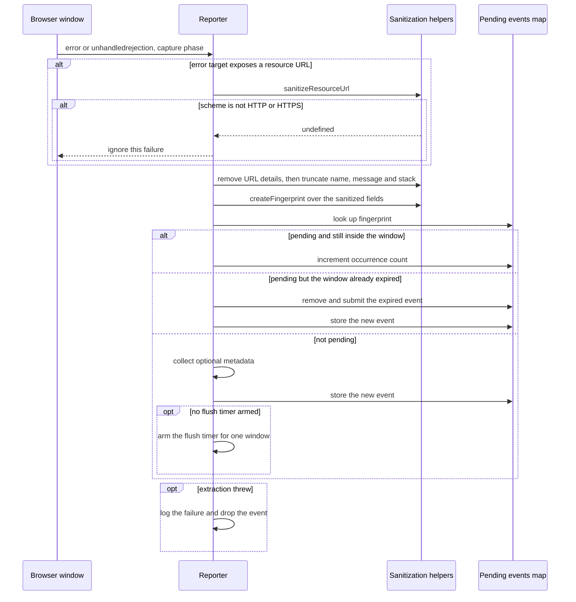
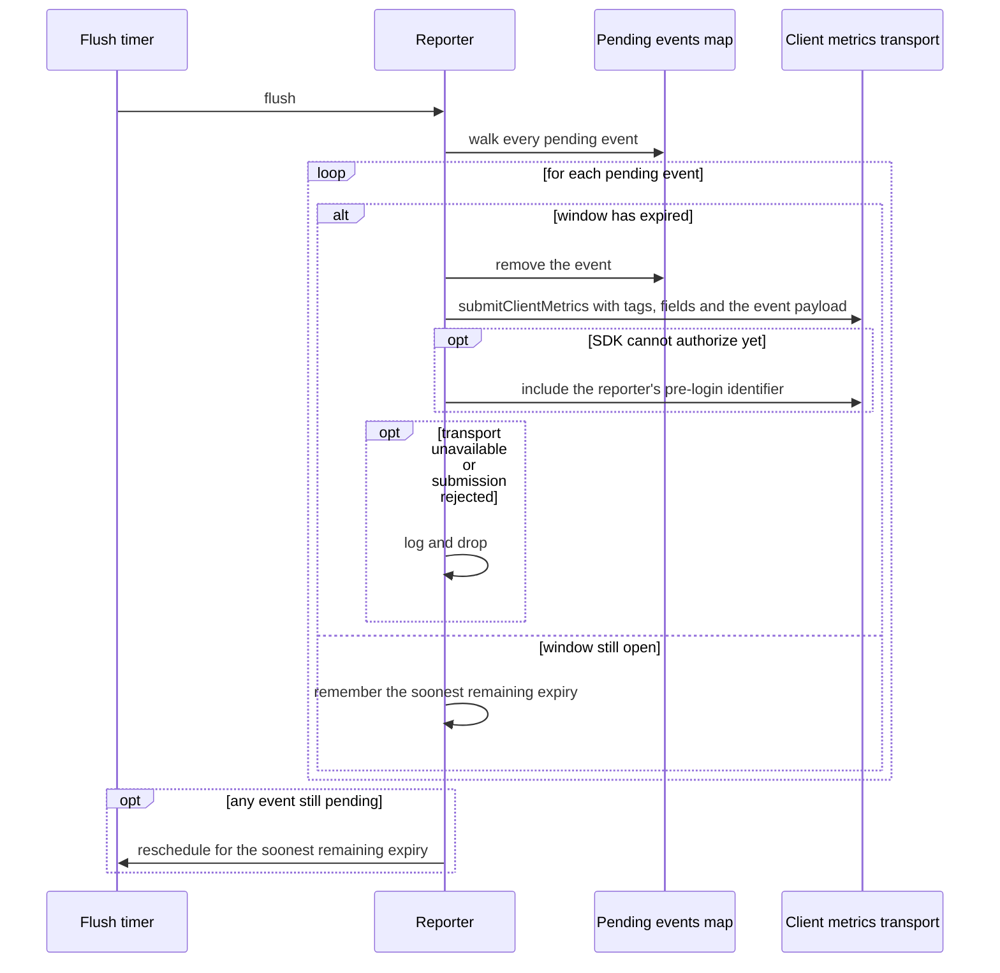
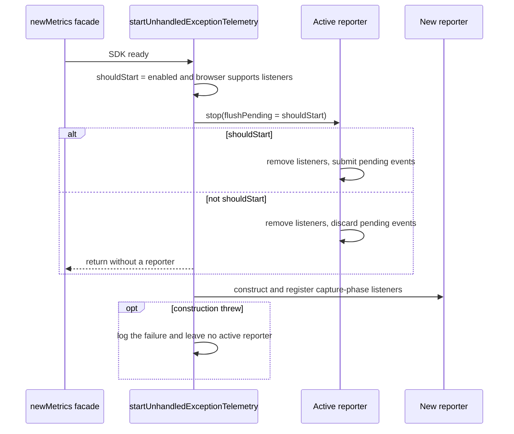
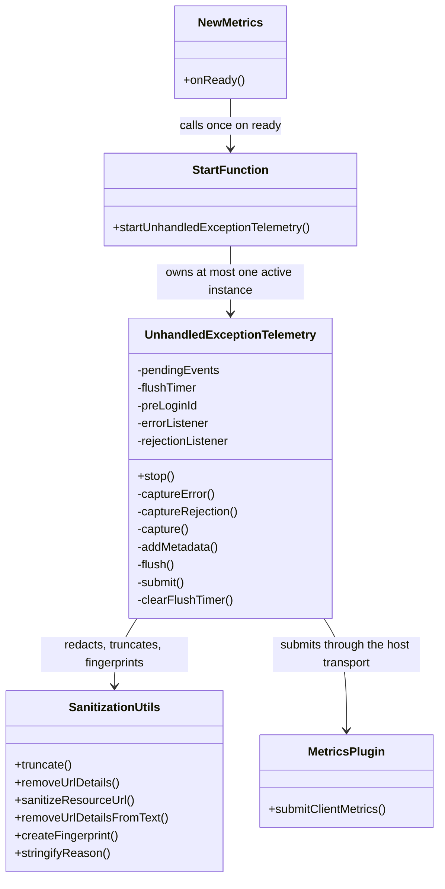
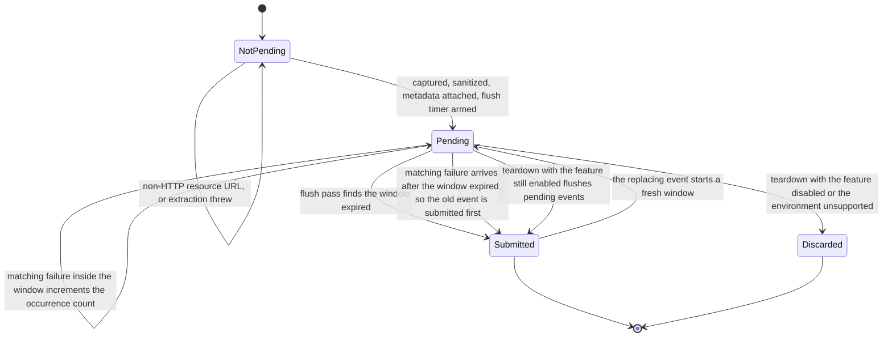

<!-- sdd-generated-metadata
doc_kind: module-spec
generated_from: module-spec@0.3.0
generated_by: claude-code
approved_by: rarajes2@cisco.com
updated_at: 2026-10-07T04:50:31Z
validation_status: pass
-->

# Unhandled exception telemetry

This source-local document at `src/unhandled-exception-telemetry/docs/README.md` owns the stable
specification for **the browser unhandled exception reporter**. Ground every claim in repository
evidence and link to the
[repository architecture](../../../docs/architecture.md) instead of repeating broader facts.

Related context: [documentation index](../../../docs/index.md) ·
[documentation agent instructions](../../../AGENTS.md)

## Metadata

| Field         | Value                                             |
| ------------- | ------------------------------------------------- |
| Owner         | Cisco Webex JS SDK — telemetry                    |
| Source path   | `src/unhandled-exception-telemetry/`              |
| Resource kind | module                                            |
| Status        | Active                                            |
| Last verified | 2026-10-05 at `d6202dd73d`                        |
| Module id     | `unhandled-exception-telemetry`                   |
| Parent spec   | [`src/docs/README.md`](../../docs/README.md)       |
| Doc kind      | Module spec                                       |
| Coverage score | Pending coverage assessment                      |
| Validation status | pass (2026-10-07; validator runtime 01a1147a-c744-7083-9b15-95e91170c79a; 0 blocking, 0 important, 0 medium, 0 minor; conformance and source-fidelity gates pass, no code/spec mismatches found) |

## Applicability

Sections preceded by an `Include if` comment are conditional. Retain a
conditional section only when source evidence or a confirmed developer answer
satisfies its condition.

| Condition ID                         | Status     | Evidence or reason                                                                                                            | Owned section                 |
| ------------------------------------ | ---------- | ----------------------------------------------------------------------------------------------------------------------------- | ----------------------------- |
| `module.has_tiers`                   | N/A        | The repository defines no operational or review tier policy for modules                                                       | Tier                          |
| `module.has_ui`                      | N/A        | The module renders nothing; it listens to window events                                                                       | UI use-case flow              |
| `module.crosses_service_boundaries`  | Applicable | `src/unhandled-exception-telemetry/index.ts` submits through the host plugin's client-metrics transport                        | Cross-boundary use-case flow  |
| `module.holds_client_state`          | Applicable | `src/unhandled-exception-telemetry/index.ts` holds the pending-event map, the flush timer and the module-level active reporter  | Client state model            |
| `module.enforces_domain_rules`       | Applicable | Redaction, truncation and metadata validation in `src/unhandled-exception-telemetry/utils.ts`                                   | Business rules and invariants |
| `module.is_concurrent_async`         | Applicable | A self-rescheduling flush timer and capture-phase window listeners in `src/unhandled-exception-telemetry/index.ts`              | Concurrency and reactive flow |
| `module.owns_persistence`            | N/A        | Events are never persisted; the pending map is in-memory and discarded on teardown                                             | Data, schema, and migration   |
| `module.stateful_transitions`        | Applicable | An event is pending, merged, submitted or discarded depending on its deduplication window                                      | State machine                 |
| `module.exposes_wire_protocol`       | Applicable | The submitted event shape is declared in `src/unhandled-exception-telemetry/index.ts`                                           | Protocol and wire format      |
| `module.ui_multi_screen`             | N/A        | No user interface                                                                                                             | UI flow                       |
| `module.large_data_model`            | N/A        | One event type with a flat error detail object                                                                                 | Data model                    |
| `module.returns_caller_errors`       | N/A        | The start function returns void and every internal failure is logged; nothing is thrown or rejected to a caller                 | Caller-visible failure modes  |
| `module.module_specific_conventions` | Applicable | Every capture and submit path is individually wrapped so telemetry can never raise                                            | Module-specific rules         |
| `module.published_package`           | N/A        | Not re-exported from `src/index.ts`; started only by `src/new-metrics.ts`                                                       | Export stability              |
| `module.embedded_in_host`            | N/A        | Not a registered plugin; the parent module owns the registration contract                                                      | Host integration and theming  |
| `module.has_design_tradeoff`         | Applicable | A single in-memory deduplication window with no persistence or retry, versus a durable reporter                                 | Key design trade-off          |
| `module.has_submodules`              | N/A        | Derived from the manifest module tree: this module has no child modules                                                         | Sub-modules                   |

## Evidence register

| Evidence                                                      | What it establishes                                                                                                                      |
| ------------------------------------------------------------- | ---------------------------------------------------------------------------------------------------------------------------------------- |
| `src/unhandled-exception-telemetry/index.ts`                  | The start function, the reporter class, the capture paths, deduplication, metadata handling, submission and teardown                      |
| `src/unhandled-exception-telemetry/utils.ts`                  | Truncation, URL redaction, resource-URL sanitization, the fingerprint hash and rejection-reason stringification                           |
| `src/config.js`                                               | That the feature is disabled by default                                                                                                  |
| `src/new-metrics.ts`                                          | The single call site and that it runs only after the SDK emits its ready event                                                            |
| `src/metrics.js`                                              | The client-metrics transport this module reuses, including its pre-login parameter                                                        |
| `test/unit/spec/unhandled-exception-telemetry.ts`             | Behavioral verification of deduplication, redaction, truncation, metadata, the pre-login route, teardown and the disabled default          |
| `test/unit/spec/unhandled-exception-telemetry/utils.ts`       | Unit verification of the redaction and sanitization helpers in isolation                                                                  |
| Reconciled owner documentation                                | Owner-authored scope, configuration and privacy guidance for this feature, reconciled by meaning into this spec; its configuration code block is replaced by a native-declaration link |

## Purpose and boundary

- Responsibility: reporting browser-level failures the application did not handle — uncaught errors,
  unhandled promise rejections and resource load failures — as a sanitized, deduplicated telemetry
  event.
- In scope: installing and removing capture-phase window listeners; extracting details from each
  event kind; redacting and truncating everything derived from the environment; deduplicating
  matching failures inside a one-second window into a single event with an occurrence count;
  collecting optional application metadata; submitting through the host plugin's client-metrics
  transport, pre-login when the SDK cannot yet authorize.
- Capture and sanitization summary: the reporter captures uncaught errors, unhandled promise
  rejections, and resource load failures. Matching failures captured in the same one-second in-memory
  window are submitted once with an `occurrenceCount`. Non-HTTP(S) URLs are redacted; URL
  credentials, query parameters, and fragments are stripped; and error names, messages, and stacks
  are truncated before submission.
- Out of scope, by design: unhandled exception telemetry is currently supported only in browser
  environments. It starts after the Webex SDK emits `ready`. It does not install a standalone
  collector, capture errors before SDK initialization, persist events, or retry failed telemetry
  submissions; pending events live only in memory.
- Consumers: `src/new-metrics.ts` only, which starts the reporter once the SDK emits its ready
  event. The module is not re-exported from `src/index.ts`.

## Structure and key files

| Path                                             | Responsibility                                                                                                                                 |
| ------------------------------------------------ | ---------------------------------------------------------------------------------------------------------------------------------------------- |
| `src/unhandled-exception-telemetry/index.ts`     | The start function, the reporter class, the metric name constant and every bound: the deduplication window and the four truncation caps          |
| `src/unhandled-exception-telemetry/utils.ts`     | Pure sanitization helpers: truncation, URL detail removal, resource-URL scheme filtering, the deduplication hash and reason stringification       |

## Public surface

| Surface                               | Consumer                | Compatibility commitment                                                                                                   | Source                                        |
| ------------------------------------- | ----------------------- | -------------------------------------------------------------------------------------------------------------------------- | --------------------------------------------- |
| `startUnhandledExceptionTelemetry`    | `src/new-metrics.ts`    | Idempotent per SDK instance: a later call supersedes the previous reporter. Returns void and never throws                   | `src/unhandled-exception-telemetry/index.ts`  |
| `UNHANDLED_EXCEPTION_METRIC_NAME`     | Tests                   | The submitted metric name. Changing it is breaking for ingestion and dashboards                                            | `src/unhandled-exception-telemetry/index.ts`  |
| `UnhandledExceptionEvent` type        | Tests, and ingestion consumers | The submitted event shape, versioned by its own schema-version field                                                | `src/unhandled-exception-telemetry/index.ts`  |
| Configuration under the metrics namespace | First party clients | Two keys: an enable flag and an optional synchronous metadata provider. Disabled by default                               | `src/config.js`                               |

Telemetry is disabled by default. Enable it with `metrics.unhandledExceptionTelemetry.enabled: true`.
Applications may provide a synchronous `getMetadata` callback in the same configuration object. It
must return an object whose fields can include application context such as `orgId` and
`dataCenter`. Metadata must not contain personally identifiable information or credentials. A
typical configuration is `metrics.unhandledExceptionTelemetry.enabled: true` together with a
synchronous `getMetadata: () => ({orgId, dataCenter})` provider.

The enable flag and the metadata provider are declared, with their exact names and types, in the
structural configuration type in `src/unhandled-exception-telemetry/index.ts`, and their defaults in
`src/config.js`. The provider is called with no arguments and must return an object synchronously;
a return value of `undefined` attaches nothing, while a non-object, oversized or throwing provider is
recorded as a metadata capture status rather than submitted. These declarations are the only contract
surface for the configuration; no separate code block restates them.

## Dependencies

| Dependency                                             | Why it is required                                                                      | Failure behavior                                                                                                   |
| ------------------------------------------------------ | --------------------------------------------------------------------------------------- | ------------------------------------------------------------------------------------------------------------------ |
| `src/metrics.js` client-metrics transport               | The only submission path; it also accepts the pre-login identifier                      | An unavailable transport is logged once per event and the event is dropped                                          |
| `src/unhandled-exception-telemetry/utils.ts`            | All redaction, truncation and fingerprinting                                            | Pure functions; an unexpected input returns undefined rather than throwing                                          |
| `@webex/common-timers`                                  | Schedules the deduplication flush so the timer survives SDK clock handling              | None                                                                                                               |
| `uuid`                                                  | Generates the per-event identifier and the per-reporter pre-login identifier            | None                                                                                                               |
| Browser window                                          | Supplies the error and rejection events                                                 | Absent in Node.js, so the reporter is not started and any active reporter is stopped and its pending events discarded |
| Host SDK logger                                         | Reports telemetry failures without raising them                                         | A throwing logger is itself caught, so logging cannot turn a telemetry failure into an application failure           |

## Requirements

| ID        | WHAT                                                                                                                                      | WHY                                                                                                                                                             | Source evidence                                        | Test or example evidence                                   | Assumptions or gaps | Confidence |
| --------- | ----------------------------------------------------------------------------------------------------------------------------------------- | --------------------------------------------------------------------------------------------------------------------------------------------------------------- | ------------------------------------------------------ | ---------------------------------------------------------- | ------------------- | ---------- |
| `MOD-001` | The feature is disabled by default and installs no listeners unless the enable flag is set to exactly `true`                                | Capturing every uncaught error in a host application is intrusive, so it must be an explicit opt-in rather than a default                                        | `src/config.js`                                        | `test/unit/spec/unhandled-exception-telemetry.ts`          | none                | Present    |
| `MOD-002` | Listeners are installed only in a browser that exposes an event-listener API, and only after the SDK emits its ready event                  | Before readiness there is no transport to submit through, and outside a browser there are no window events to capture                                            | `src/new-metrics.ts`                                   | `test/unit/spec/unhandled-exception-telemetry.ts`          | none                | Present    |
| `MOD-003` | Uncaught errors, unhandled promise rejections and resource load failures are all captured, each with its own failure kind                   | The three arrive as different browser events with different shapes, and a consumer needs to tell them apart                                                      | `src/unhandled-exception-telemetry/index.ts`           | `test/unit/spec/unhandled-exception-telemetry.ts`          | none                | Present    |
| `MOD-004` | Listeners are registered in the capture phase                                                                                              | Resource load failures do not bubble, so a bubble-phase listener would miss them entirely                                                                        | `src/unhandled-exception-telemetry/index.ts`           | `test/unit/spec/unhandled-exception-telemetry.ts`          | none                | Present    |
| `MOD-005` | Failures that match on kind, name, message, stack, source coordinates and resource URL within one second are submitted once with an occurrence count | A loop or a repeated failing request can raise the same error hundreds of times per second; one event with a count preserves the signal without the volume | `src/unhandled-exception-telemetry/index.ts`           | `test/unit/spec/unhandled-exception-telemetry.ts`          | none                | Present    |
| `MOD-006` | Each distinct failure gets its own full deduplication window rather than sharing one global window                                          | Otherwise an error arriving late in another error's window would be submitted immediately and its own repeats would not be merged                                 | `src/unhandled-exception-telemetry/index.ts`           | `test/unit/spec/unhandled-exception-telemetry.ts`          | none                | Present    |
| `MOD-007` | When a throttled timer leaves an expired event pending, that event is submitted before its fingerprint is reused for a new window            | Otherwise a background tab's throttling would silently merge two separate bursts, or discard the earlier one                                                      | `src/unhandled-exception-telemetry/index.ts`           | `test/unit/spec/unhandled-exception-telemetry.ts`          | none                | Present    |
| `MOD-008` | URL credentials, query parameters and fragments are stripped from filenames, messages, stacks and resource URLs                             | Those positions routinely carry tokens and personal identifiers that must not reach telemetry                                                                    | `src/unhandled-exception-telemetry/utils.ts`           | `test/unit/spec/unhandled-exception-telemetry/utils.ts`    | none                | Present    |
| `MOD-009` | Non-HTTP and non-HTTPS URLs are replaced wholesale in text, and a resource failure from such a URL is not reported at all                    | Schemes such as data and blob embed their payload in the URL, so partial redaction cannot make them safe                                                        | `src/unhandled-exception-telemetry/utils.ts`           | `test/unit/spec/unhandled-exception-telemetry.ts`          | none                | Present    |
| `MOD-010` | Error names, messages, stacks and resource URLs are truncated to fixed caps before submission                                               | An unbounded message or stack would let one failure dominate a telemetry payload                                                                                 | `src/unhandled-exception-telemetry/index.ts`           | `test/unit/spec/unhandled-exception-telemetry.ts`          | none                | Present    |
| `MOD-011` | The selected resource candidate is preferred over the fallback source when a resource reports both                                          | For a responsive image the browser's chosen candidate is the URL that actually failed; the fallback would misreport which asset is broken                         | `src/unhandled-exception-telemetry/index.ts`           | `test/unit/spec/unhandled-exception-telemetry.ts`          | none                | Present    |
| `MOD-012` | Application metadata is collected only from a configured synchronous provider, and is submitted only when it serializes to a plain object within the size cap | Metadata is caller-controlled, so a wrong type, an oversized value or a throwing provider must degrade to a recorded status rather than a dropped event | `src/unhandled-exception-telemetry/index.ts`           | `test/unit/spec/unhandled-exception-telemetry.ts`          | none                | Present    |
| `MOD-013` | Metadata must not contain personally identifiable information or credentials                                                                | The provider's output is submitted verbatim; the module validates its shape and size but cannot inspect its meaning                                              | `src/unhandled-exception-telemetry/index.ts`           | none found                                                 | Not machine-enforceable; it is a caller obligation on the configured provider, whose validated output is submitted verbatim | Approved unknown |
| `MOD-014` | A submission is routed through the pre-login path whenever the SDK cannot yet authorize, using one identifier per reporter                   | An error during sign-in is exactly the kind of failure worth reporting, and it must still be attributable to one browser session                                 | `src/unhandled-exception-telemetry/index.ts`           | `test/unit/spec/unhandled-exception-telemetry.ts`          | none                | Present    |
| `MOD-015` | Starting a reporter supersedes any active one: listeners are removed, and pending events are flushed when the new configuration still enables telemetry or discarded when it does not | A second SDK instance must not leave duplicate listeners behind, and disabling the feature must not then submit what was captured while it was on | `src/unhandled-exception-telemetry/index.ts` | `test/unit/spec/unhandled-exception-telemetry.ts` | none                | Present    |
| `MOD-016` | No capture, metadata, submission or logging failure escapes the module                                                                      | The listeners run inside the application's own error path; an exception here would turn one failure into two                                                      | `src/unhandled-exception-telemetry/index.ts`           | `test/unit/spec/unhandled-exception-telemetry.ts`          | none                | Present    |
| `MOD-017` | A rejection reason whose `message`, `name` or `stack` property access throws is contained: the failure is logged, nothing is submitted and nothing propagates. A reason that only fails JSON serialization is still reported, falling back to `String(reason)` and then to a fixed unserializable-reason message | A rejection can carry a proxy or a throwing getter; the reporter runs inside the application's error path, so it must never throw there, and it cannot build a trustworthy report from a reason it cannot read | `src/unhandled-exception-telemetry/index.ts`, `src/unhandled-exception-telemetry/utils.ts` | `test/unit/spec/unhandled-exception-telemetry.ts` | The serialization fallbacks in `stringifyReason` have no dedicated case | Present |
| `MOD-018` | Events are never persisted and a failed submission is never retried                                                                         | Persisting browser error state across loads would create its own privacy surface, and retrying during a failing page risks amplifying the failure                 | `src/unhandled-exception-telemetry/index.ts`           | none found                                                 | The absence of persistence and retry is structural rather than asserted by a case | Present |

## Design overview

The module is one exported function and one class. The function,
`startUnhandledExceptionTelemetry`, is the whole lifecycle: it decides whether telemetry should be
running at all, tears down whatever reporter was active, and constructs a new one. A module-level
variable holds the single active reporter, which is what makes a second SDK instance supersede the
first rather than double-report. The teardown's flush decision is deliberately driven by the *new*
configuration: if telemetry is still enabled, pending events are submitted; if it has just been
turned off or the environment no longer supports it, they are discarded.

The class is a capture pipeline with a deduplication window in the middle.

Capture is per event kind. A browser `error` event is first inspected for a resource target: if the
target exposes a current source, source or href, the failure is a resource load failure and is
reported with the sanitized URL and the uppercase tag name — and dropped entirely if the URL's scheme
is not HTTP or HTTPS. Otherwise it is an ordinary uncaught error, and name, message, stack, filename,
line and column are taken from the event. A rejection event takes its name, message and stack from
the reason, falling back to a stringified reason. If reading those properties throws, as with a
proxy or a throwing getter, the extraction failure is logged and the event is dropped; nothing is
submitted and nothing propagates to the application.

Sanitization happens once, in `capture`, before anything else: name, message and stack are passed
through URL-detail removal and then truncated. This ordering matters — the fingerprint is computed
from the sanitized values, so two failures that differ only in a stripped query parameter
deduplicate together rather than producing two events.

Deduplication is a map from fingerprint to pending event plus a single self-rescheduling timer. When
a fingerprint is already pending, the event either increments its occurrence count (inside the
window) or is submitted and replaced (outside it — the case a throttled timer produces). The flush
pass walks every pending event, submits the expired ones, and reschedules itself for the soonest
remaining expiry, which is what gives each distinct failure its own full window from one timer.

Submission reuses the parent module's client-metrics transport rather than owning one, and chooses
the pre-login route when the SDK cannot yet authorize. Every stage — capture, metadata collection,
submission and even logging — is individually wrapped, because these listeners run inside the
application's own error path.

## Data flow and sequence coverage

The call style is browser event listeners inbound and an in-process call to the parent plugin's
transport outbound. There are three operation groups. Capture-and-deduplicate and flush-and-submit
are diagrammed separately because their actors and state outcomes differ; start-and-supersede is
diagrammed separately again because it is the only group that can discard data.

| Operation group            | Entry and outcome                                                                                                       | Diagram or evidence                                   | Failure and recovery coverage                                                                                                    |
| -------------------------- | ----------------------------------------------------------------------------------------------------------------------- | ----------------------------------------------------- | -------------------------------------------------------------------------------------------------------------------------------- |
| Start and supersede        | The SDK becomes ready, or a new instance starts; the active reporter is replaced and its pending events flushed or discarded | Third sequence diagram below                          | A failing constructor is logged and leaves no active reporter; an unsupported environment stops and discards                      |
| Capture and deduplicate    | A window error or rejection arrives; a sanitized event becomes pending, or merges into a pending one                     | First sequence diagram below                          | Extraction failure logged and the event dropped; a non-HTTP resource URL is ignored; an expired pending event is submitted first  |
| Flush and submit           | The deduplication window expires; the event is submitted and the timer reschedules for the next expiry                   | Second sequence diagram below                         | Missing transport logged and the event dropped; a rejected submission logged; a throwing submit call caught                       |

## Class and component relationships

## Use cases and flows

| Use case | Actor or caller                | Primary steps and outcome                                                                                                                  | Failure or boundary behavior                                                                               | Evidence                                                                                                            |
| -------- | ------------------------------ | ------------------------------------------------------------------------------------------------------------------------------------------ | ---------------------------------------------------------------------------------------------------------- | ------------------------------------------------------------------------------------------------------------------- |
| `UC-001` | Host application, enabled      | The same uncaught error is raised several times in a second; one sanitized event is submitted with the occurrence count                      | The next identical error after the window starts a new event rather than reopening the old one              | `src/unhandled-exception-telemetry/index.ts`, `test/unit/spec/unhandled-exception-telemetry.ts`                      |
| `UC-002` | Host application, enabled      | A promise rejects with no handler; the reason's name, message and stack are captured, or a stringified reason when they are absent           | A reason whose property getters throw is logged as an extraction failure and dropped without submitting; an unserializable reason is reported with a `String(reason)` or fixed fallback message | `src/unhandled-exception-telemetry/index.ts`, `test/unit/spec/unhandled-exception-telemetry.ts` |
| `UC-003` | Host application, enabled      | A script or image fails to load; the sanitized URL and the uppercase tag name are reported as a resource failure                            | A non-HTTP scheme is ignored entirely; a responsive image reports the selected candidate, not the fallback  | `src/unhandled-exception-telemetry/index.ts`, `test/unit/spec/unhandled-exception-telemetry.ts`                      |
| `UC-004` | First party client             | A metadata provider is configured; its returned object is attached to each event                                                           | A wrong type, an oversized value or a throwing provider records a capture status and the event still goes   | `src/unhandled-exception-telemetry/index.ts`, `test/unit/spec/unhandled-exception-telemetry.ts`                      |
| `UC-005` | Host application, pre sign-in  | An error occurs before the SDK can authorize; the event is submitted on the pre-login route with the reporter's identifier                   | The identifier is stable for the reporter's lifetime, so pre-login events from one session group together   | `src/unhandled-exception-telemetry/index.ts`, `test/unit/spec/unhandled-exception-telemetry.ts`                      |
| `UC-006` | Host application, reconfigured | A second SDK instance is created with telemetry disabled; the active reporter is stopped and its pending events discarded                    | With telemetry still enabled instead, the pending events are flushed before the new reporter starts         | `src/unhandled-exception-telemetry/index.ts`, `test/unit/spec/unhandled-exception-telemetry.ts`                      |
| `UC-007` | Node.js host                   | The SDK becomes ready outside a browser; no listeners are installed and any active reporter is stopped with its events discarded             | The start function returns without constructing a reporter                                                  | `src/unhandled-exception-telemetry/index.ts`, `test/unit/spec/unhandled-exception-telemetry.ts`                      |

<!-- Include if: the module calls another service or crosses an event or network boundary. [condition-id: module.crosses_service_boundaries] -->

### Cross-boundary use-case flow

Every use case that submits crosses one boundary: an in-process call into the parent module's
client-metrics transport, which then performs the HTTP POST.

- Boundary and transport: the host plugin's client-metrics operation, reached through the SDK
  instance rather than by importing the plugin. The module reads the operation off the instance at
  submission time and treats its absence as a recoverable condition.
- Ordering: events are submitted in pending-map iteration order as their windows expire. No ordering
  is promised to the consumer, and none is needed: each event carries its own capture timestamp.
- Compatibility: the submitted payload carries an explicit schema version, so ingestion can
  distinguish generations. Tags and fields are a flat projection of the event for indexing, with the
  full event in the payload.
- Timeout and retry: none here. Retry and backoff belong to the batcher the transport uses; this
  module neither awaits nor retries, and a rejected submission is logged and dropped.
- Recovery: none for a lost event. The module does not persist or replay, both explicit non-goals of
  the feature.

<!-- Include if: the module holds client-side state. [condition-id: module.holds_client_state] -->

## Client state model

| State or slice           | Owner                     | Initial state                       | Transition triggers                                                                         | Reset or persistence boundary                                                                   |
| ------------------------ | ------------------------- | ----------------------------------- | ------------------------------------------------------------------------------------------- | ----------------------------------------------------------------------------------------------- |
| Active reporter          | Module-level variable     | Undefined                           | Set by a successful start; cleared by a start that should not run or whose construction threw | At most one reporter exists per process; never persisted                                        |
| Pending events map       | The reporter instance     | Empty map                           | An event is stored, merged into, submitted or replaced                                       | Cleared on teardown, after the optional flush                                                   |
| Flush timer handle       | The reporter instance     | Undefined                           | Armed when the map goes from empty to non-empty; rescheduled by each flush pass              | Cleared on teardown and whenever no event remains pending                                       |
| Pre-login identifier     | The reporter instance     | Generated at construction           | None                                                                                        | Stable for the reporter's lifetime, so one browser session groups together                      |
| Bound listener references | The reporter instance     | Created at construction             | None                                                                                        | Held so teardown can remove exactly the listeners that were added                               |

<!-- Include if: the module enforces domain rules or entity invariants. [condition-id: module.enforces_domain_rules] -->

## Business rules and invariants

| ID        | Invariant                                                                                                     | WHY                                                                                                             | Enforcement source                                    | Test evidence                                              |
| --------- | ------------------------------------------------------------------------------------------------------------- | --------------------------------------------------------------------------------------------------------------- | ----------------------------------------------------- | ---------------------------------------------------------- |
| `INV-001` | No submitted string retains URL credentials, query parameters or a fragment                                   | Those positions carry tokens and personal identifiers                                                           | `src/unhandled-exception-telemetry/utils.ts`          | `test/unit/spec/unhandled-exception-telemetry/utils.ts`    |
| `INV-002` | A URL whose scheme is neither HTTP nor HTTPS is replaced in text and rejected as a resource URL                | Such schemes can embed the payload itself, so partial redaction is not sufficient                                | `src/unhandled-exception-telemetry/utils.ts`          | `test/unit/spec/unhandled-exception-telemetry.ts`          |
| `INV-003` | Name, message, stack and resource URL never exceed their caps                                                 | One failure must not be able to dominate a telemetry payload                                                     | `src/unhandled-exception-telemetry/index.ts`          | `test/unit/spec/unhandled-exception-telemetry.ts`          |
| `INV-004` | The fingerprint is computed from sanitized values, never raw ones                                             | Otherwise two reports of the same failure differing only in a stripped query parameter would not deduplicate      | `src/unhandled-exception-telemetry/index.ts`          | `test/unit/spec/unhandled-exception-telemetry.ts`          |
| `INV-005` | At most one event is pending per fingerprint at any time                                                      | The occurrence count is the merge mechanism; two pending events for one fingerprint would double-report           | `src/unhandled-exception-telemetry/index.ts`          | `test/unit/spec/unhandled-exception-telemetry.ts`          |
| `INV-006` | Submitted metadata is a plain object within the size cap, or absent with a recorded capture status             | Caller-controlled input must not be able to produce an unparseable or unbounded payload                           | `src/unhandled-exception-telemetry/index.ts`          | `test/unit/spec/unhandled-exception-telemetry.ts`          |
| `INV-007` | At most one reporter is active per process                                                                    | Two reporters would register duplicate listeners and double-report every failure                                  | `src/unhandled-exception-telemetry/index.ts`          | `test/unit/spec/unhandled-exception-telemetry.ts`          |
| `INV-008` | No code path in this module throws or rejects to its caller                                                   | The listeners run inside the application's own error path                                                        | `src/unhandled-exception-telemetry/index.ts`          | `test/unit/spec/unhandled-exception-telemetry.ts`          |

<!-- Include if: the module is concurrent, asynchronous, reactive, or event-driven. [condition-id: module.is_concurrent_async] -->

## Concurrency and reactive flow

- Execution model: two capture-phase window listeners plus a single self-rescheduling timeout. There
  is no interval: each flush pass arms the next one only if an event is still pending, so an idle
  reporter holds no timer.
- Ordering guarantees: capture is synchronous on the browser event, so an event is pending before the
  next one is handled. Submission order within a flush pass follows map iteration order and is not
  promised to consumers; each event carries its own capture timestamp instead.
- Idempotency and retry: the fingerprint is the deduplication key within a window, not across
  windows, so the same failure in two windows is two events — distinguishable by their event
  identifiers. Nothing is retried.
- Shared-state protection: single-threaded by construction. The pending map is mutated only from the
  listeners and the flush pass, both on the main task queue.
- Blocking restrictions: no capture or teardown path awaits a submission. The submission promise is
  created, given a rejection handler and dropped, so a slow telemetry request cannot delay the page.

<!-- Include if: the module has non-trivial state transitions. [condition-id: module.stateful_transitions] -->

## State machine

The state belongs to one fingerprint's pending event.

Guards and rejected transitions:

- A resource failure whose URL scheme is not HTTP or HTTPS never reaches `Pending`.
- The occurrence-count merge is guarded on the elapsed time since capture, not on the timer firing,
  which is what makes the expired-but-pending transition reachable under tab throttling.
- `Discarded` is reachable only through teardown, and only when the new configuration would not start
  telemetry.

<!-- Include if: callers depend on a wire protocol or serialized format. [condition-id: module.exposes_wire_protocol] -->

## Protocol and wire format

| Message or frame                  | Version | Producer or serializer                        | Consumer or parser               | Compatibility and ordering rule                                                                                                  |
| --------------------------------- | ------- | --------------------------------------------- | -------------------------------- | -------------------------------------------------------------------------------------------------------------------------------- |
| Unhandled exception client metric | `1`     | `src/unhandled-exception-telemetry/index.ts`  | Webex metrics ingestion          | The payload declares its own schema version. Field removal or rename is breaking; additions are compatible. No ordering is promised |
| Indexing tags and fields          | n/a     | `src/unhandled-exception-telemetry/index.ts`  | Webex metrics ingestion          | A flat projection of the event for querying. It duplicates payload values by design and must stay consistent with them            |

The event type is declared in `src/unhandled-exception-telemetry/index.ts` and the metric name is a
constant exported from the same file; neither is restated here. The payload carries the sanitized
error details plus the deduplication fingerprint, the occurrence count, the capture timestamp, a
per-event identifier, the application and runtime identity, and either the validated metadata or a
metadata capture status explaining its absence.

## Pitfalls and constraints

- The active reporter is a module-level singleton. When two SDK instances in one page both start
  telemetry, the later start supersedes the earlier reporter, so only one instance's configuration and
  transport are used.
- Start is a silent no-op outside a browser: it requires the enable flag to be exactly `true` and a
  global `window` with `addEventListener`. Nothing is logged when either check fails.
- Rejections are not filtered by origin. An unhandled rejection raised by other SDK code, such as a
  telemetry request elsewhere in the package that nobody awaits, is reported exactly like an
  application failure.
- A rejection reason whose `message`, `name` or `stack` getter throws produces no event at all, only a
  log line. Exotic reasons such as revoked proxies are therefore invisible in telemetry.
- The metadata provider runs synchronously inside the capture path, once for each new event (merged
  occurrences do not call it again), so a slow provider delays the application's own error handling.

<!-- Include if: the module has conventions beyond repository-wide rules. [condition-id: module.module_specific_conventions] -->

## Module-specific rules

- Do: wrap every new code path in its own guard. Capture, metadata collection, submission and the
  failure logger are each wrapped individually, on purpose, because this code runs inside the
  application's error path.
- Do: sanitize before fingerprinting. Reversing the order silently breaks deduplication for any
  failure whose text contains a varying URL.
- Do: compare elapsed time against the window rather than trusting the timer to fire on schedule.
  Background tabs throttle timers, and the expired-but-pending branch exists for that case.
- Do: keep the helpers in `src/unhandled-exception-telemetry/utils.ts` pure and individually
  testable; they carry the privacy guarantees and have their own spec file.
- Do not: add a field to the submitted event without checking what it can contain in the worst case.
  Everything derived from the environment goes through redaction and a cap first.
- Do not: put personally identifiable information or credentials in the metadata provider's return
  value. The module validates shape and size, not meaning, and submits the object verbatim.
- Do not: add persistence or retry. Both are stated non-goals: persisting browser error state would
  create a new privacy surface, and retrying during a failing page risks amplifying the failure.
- Do not: construct the reporter directly. Go through the start function so the supersede-and-flush
  rule is applied.

<!-- Include if: the module has a non-obvious design trade-off consumers or maintainers must preserve. [condition-id: module.has_design_tradeoff] -->

## Key design trade-off

| Chosen trade-off                                                                                                       | Preserved invariant or benefit                                                                                                                  | Cost or limitation                                                                                                                                      | Decision evidence                                      |
| ---------------------------------------------------------------------------------------------------------------------- | ----------------------------------------------------------------------------------------------------------------------------------------------- | ------------------------------------------------------------------------------------------------------------------------------------------------------- | ------------------------------------------------------ |
| One in-memory deduplication window, with no persistence and no retry                                                   | A failure storm costs one event per distinct failure per second, and the reporter adds no privacy surface or storage of its own                  | Events captured during a page that then unloads, or whose submission fails, are lost                                                                     | `src/unhandled-exception-telemetry/index.ts`           |
| Start only after the SDK is ready, rather than installing a standalone collector at import time                        | There is always a transport available, and the reporter never outlives or precedes the SDK it reports for                                       | Errors raised before SDK initialization are not captured at all, an explicit non-goal of the feature                                        | `src/new-metrics.ts`                                   |
| Reuse the parent module's client-metrics transport instead of owning a batcher                                         | Exception events inherit the existing batching, retry and pre-login behavior without this module knowing about any of it                        | The module depends on a plugin surface it reads off the SDK instance at submission time, and must treat its absence as a normal condition                | `src/unhandled-exception-telemetry/index.ts`           |
| Compare elapsed time per event instead of trusting one timer                                                           | Each distinct failure gets a full window even when the tab is throttled, and no burst is silently merged with another                            | The flush pass walks every pending event and reschedules itself, which is more work than a fixed interval                                                | `src/unhandled-exception-telemetry/index.ts`           |
| Drive the teardown flush from the new configuration rather than the old one                                            | Turning telemetry off does not then submit what was captured while it was on                                                                    | The flush decision is non-obvious at the call site: the same teardown call either submits or discards depending on an argument computed by the caller     | `src/unhandled-exception-telemetry/index.ts`           |

## Verification

| Requirement or invariant | Test level | Positive evidence                                            | Negative or boundary evidence                                | Gap                                                                                                     |
| ------------------------ | ---------- | ------------------------------------------------------------ | ------------------------------------------------------------ | ------------------------------------------------------------------------------------------------------- |
| `MOD-001`                | Unit       | `test/unit/spec/unhandled-exception-telemetry.ts`            | `test/unit/spec/unhandled-exception-telemetry.ts`            | none                                                                                                    |
| `MOD-002` / `INV-007`    | Unit       | `test/unit/spec/unhandled-exception-telemetry.ts`            | `test/unit/spec/unhandled-exception-telemetry.ts`            | none                                                                                                    |
| `MOD-003`                | Unit       | `test/unit/spec/unhandled-exception-telemetry.ts`            | `test/unit/spec/unhandled-exception-telemetry.ts`            | none                                                                                                    |
| `MOD-004`                | Unit       | `test/unit/spec/unhandled-exception-telemetry.ts`            | none found                                                   | Registration and removal are asserted; no case proves a bubble-phase listener would have missed a resource failure |
| `MOD-005` / `INV-005`    | Unit       | `test/unit/spec/unhandled-exception-telemetry.ts`            | `test/unit/spec/unhandled-exception-telemetry.ts`            | none                                                                                                    |
| `MOD-006`                | Unit       | `test/unit/spec/unhandled-exception-telemetry.ts`            | `test/unit/spec/unhandled-exception-telemetry.ts`            | none                                                                                                    |
| `MOD-007`                | Unit       | `test/unit/spec/unhandled-exception-telemetry.ts`            | `test/unit/spec/unhandled-exception-telemetry.ts`            | none                                                                                                    |
| `MOD-008` / `INV-001`    | Unit       | `test/unit/spec/unhandled-exception-telemetry/utils.ts`      | `test/unit/spec/unhandled-exception-telemetry.ts`            | none                                                                                                    |
| `MOD-009` / `INV-002`    | Unit       | `test/unit/spec/unhandled-exception-telemetry.ts`            | `test/unit/spec/unhandled-exception-telemetry.ts`            | none                                                                                                    |
| `MOD-010` / `INV-003`    | Unit       | `test/unit/spec/unhandled-exception-telemetry.ts`            | `test/unit/spec/unhandled-exception-telemetry.ts`            | none                                                                                                    |
| `MOD-011`                | Unit       | `test/unit/spec/unhandled-exception-telemetry.ts`            | `test/unit/spec/unhandled-exception-telemetry.ts`            | none                                                                                                    |
| `MOD-012` / `INV-006`    | Unit       | `test/unit/spec/unhandled-exception-telemetry.ts`            | `test/unit/spec/unhandled-exception-telemetry.ts`            | none                                                                                                    |
| `MOD-013`                | —          | none found                                                  | none found                                                   | Not machine-enforceable. It is a caller obligation; the module validates shape and size only             |
| `MOD-014`                | Unit       | `test/unit/spec/unhandled-exception-telemetry.ts`            | none found                                                   | The pre-login route is covered; no case asserts the identifier is stable across two events from one reporter |
| `MOD-015`                | Unit       | `test/unit/spec/unhandled-exception-telemetry.ts`            | `test/unit/spec/unhandled-exception-telemetry.ts`            | none                                                                                                    |
| `MOD-016` / `INV-008`    | Unit       | `test/unit/spec/unhandled-exception-telemetry.ts`            | `test/unit/spec/unhandled-exception-telemetry.ts`            | none                                                                                                    |
| `MOD-017`                | Unit       | `test/unit/spec/unhandled-exception-telemetry.ts`            | `test/unit/spec/unhandled-exception-telemetry.ts`            | The test asserts the throwing-getter reason is logged and not submitted; the JSON-serialization fallbacks are untested |
| `MOD-018`                | —          | none found                                                   | none found                                                   | Structural absence of persistence and retry; no case asserts it, and none can without inspecting the module's shape |
| `INV-004`                | Unit       | `test/unit/spec/unhandled-exception-telemetry.ts`            | `test/unit/spec/unhandled-exception-telemetry.ts`            | none                                                                                                    |

Record coverage gaps explicitly and link follow-up work. A module specification
is complete only when its public surface, invariants, failure modes, and test
evidence agree with the implementation.
