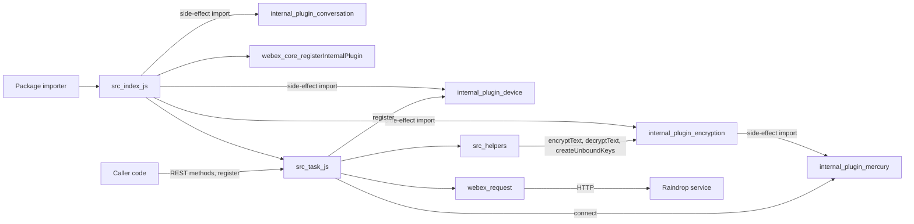
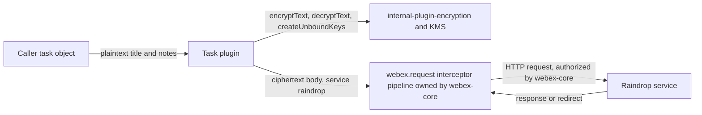

<!-- sdd-generated-metadata
doc_kind: standing-doc
generated_from: architecture@0.3.0
generated_by: claude-cowork
approved_by: akulakum@cisco.com
updated_at: 2026-10-09T14:40:25Z
validation_status: pending
-->

# @webex/internal-plugin-task architecture

Canonical architecture for this package. Plugin behavior lives in the
[Task plugin specification](../src/docs/README.md). This page owns package boundaries, the plugin
registration, the contract index, and how the package meets the rest of the SDK.

Related context: [specification registry](specs/README.md) ·
[package agent instructions](../AGENTS.md)

## Applicability

| Condition ID                         | Status     | Evidence or reason | Owned section |
| ------------------------------------ | ---------- | ------------------ | ------------- |
| `repo.owns_datastore`                | N/A        | No database, file store, or migration in `src/` | Repository data and schema |
| `repo.holds_client_state`            | N/A        | The only state is the module's `registered` flag, specified in the module State machine | Client state model |
| `repo.components_interact`           | N/A        | One module. The import graph is shown under Interaction and execution flows. | Dependency and interaction topology |
| `repo.domain_data_across_components` | N/A        | Task DTOs are passed through to the caller, not owned | Object and data ownership |
| `repo.caches_data`                   | N/A        | No cache in `src/`; KMS key caching belongs to internal-plugin-encryption | Caching catalog |
| `repo.observability_convention`      | Applicable | `src/task.js` logs through `this.logger` with a fixed message prefix | Observability patterns |
| `repo.deploys_to_infra`              | N/A        | Library published to npm. No service runtime. | Runtime and infrastructure |
| `repo.shared_base_libs`              | Applicable | Inherits `WebexPlugin` and the legacy build, lint, and test stack | Shared and base libraries |
| `repo.is_monorepo`                   | N/A        | This SDD root is one package. The workspace around it is out of scope. | Package map and dependencies |
| `repo.multi_platform`                | N/A        | No platform-specific code in `src/`; the `package.json` `browserify` field lists only build transforms | Platform matrix |
| `repo.published_package`             | Applicable | `package.json` `name` is `@webex/internal-plugin-task` and `deploy:npm` publishes it | Release and versioning |
| `repo.embedded_in_host`              | N/A        | No host theme or embed API | Host integration and theming |
| `repo.exposes_commands_or_artifacts` | Applicable | `build:src` writes the build output directory | Commands and generated artifacts |
| `repo.cross_repo_deps_material`      | Applicable | Behavior depends on sibling workspace plugins and on the Raindrop service | Cross-repository topology |
| `repo.security_arch_warranted`       | Applicable | Task text is encrypted with KMS keys before it leaves the client, and authorization is attached by webex-core | Security architecture |

## Design overview

`@webex/internal-plugin-task` is a published library with one module. Importing it imports the
device, encryption, and conversation plugins and registers `Task` as the internal plugin `task`, so
webex instances constructed after the import have `webex.internal.task`.

The plugin wraps the Raindrop task REST operations and encrypts the free-text task fields with the
encryption plugin before they leave the client, decrypting them in responses. A `register` call
registers the device and connects Mercury, and the plugin emits its own registered and unregistered
events, but it does not yet subscribe to any task event.

The package serves no routes and persists nothing.

## Resource inventory and responsibilities

| Resource | Kind | Responsibility | Owner | Source | Detailed specification |
| -------- | ---- | -------------- | ----- | ------ | ---------------------- |
| Task plugin | module | REST wrappers, field encryption and decryption, registration state | @webex/web-sdk | `src/` | `src/docs/README.md` |
| Published package | package | npm entry points and the registration side effect | @webex/web-sdk | `package.json` | N/A (this document) |

## Interaction and execution flows

| From | To | Interaction or transport | Purpose | Failure or compatibility behavior |
| ---- | -- | ------------------------ | ------- | --------------------------------- |
| Importer | `src/index.js` | package import | Register the plugin | Without the import, `webex.internal.task` is absent |
| `src/index.js` | device, encryption, conversation plugins | side-effect imports | Register those plugins with webex-core so webex instances constructed afterwards include them; see Dependency topology for Mercury | Load-time only |
| Caller | `webex.internal.task` | method calls | Task REST operations and registration | See the Task plugin spec failure modes |
| `src/helpers/` | `webex.internal.encryption` | in-process promise | Encrypt and decrypt `title` and `notes`; create a key | Rejections propagate |
| `src/task.js` | `webex.request` | in-process promise | Send HTTP requests | Rejections propagate |
| `webex.request` | Raindrop service | HTTP | Task storage and assignment | Error behavior is recorded in the Task plugin spec Dependencies and Caller-visible failure modes |

## Dependency topology

| Dependency | Type | Used by | Purpose | Version, failure, or fallback policy |
| ---------- | ---- | ------- | ------- | ------------------------------------ |
| `@webex/webex-core` | Internal | `src` | Plugin base, registration, request, logger | Workspace version |
| `@webex/internal-plugin-encryption` | Internal | `src` | Field encryption, decryption, key creation | Workspace version |
| `@webex/internal-plugin-device` | Internal | `src` | Device registration in `register` | Workspace version |
| `@webex/internal-plugin-mercury` | Internal, undeclared | `src` | `connect` in `register` | Reached through the encryption import, not `package.json` |
| `@webex/internal-plugin-conversation` | Internal | `src` | Side-effect import only | Workspace version |
| `lodash` | External | `src` | `isArray` | Range in `package.json` |
| `uuid` | External | none | Declared but not imported | Range in `package.json` |

Ordering: `register` calls `device.register()` before `mercury.connect()`; Mercury's `connect()` also
registers the device itself when it is not yet registered. No dependency cycle exists inside the
package.

## Public and consumer surfaces

| Surface | Type | Owner | Consumers | Compatibility policy | Source |
| ------- | ---- | ----- | --------- | -------------------- | ------ |
| `task-sdk` (published) | SDK | Task plugin | Sibling package webex, whose file src/webex.js requires this package, and any code reaching `webex.internal.task` | Internal plugin; see Release and versioning | `package.json` |
| `raindrop-tasks-http` (required) | API | Raindrop service | Task plugin | External; consumed, not served | Raindrop service |
| `webex-core-plugin-host` (required) | RPC | sibling package webex-core | Task plugin | External | `@webex/webex-core` |
| `encryption-sdk` (required) | SDK | sibling package internal-plugin-encryption | Task helpers | External | `@webex/internal-plugin-encryption` |
| `webex-device-registration` (required) | SDK | sibling package internal-plugin-device | Task plugin | Specified in its SDD module spec, file src/docs/README.md of that package | `@webex/internal-plugin-device` |
| `mercury-sdk` (required) | SDK | sibling package internal-plugin-mercury | Task plugin | Specified in its SDD module spec, file src/docs/README.md of that package | `@webex/internal-plugin-mercury` |
| `conversation-sdk` (required) | SDK | sibling package internal-plugin-conversation | Package barrel | Side-effect import only | `@webex/internal-plugin-conversation` |
| `lodash` (required) | SDK | npm | Task helpers | See Dependency topology | npm |

`task-sdk` entry points: `main` points at the build output and `devMain` at `src/index.js`. No HTTP
surface is served, so `api-specs/openapi.yaml` is omitted.

## Cross-cutting architecture

### Security

- Trust boundaries and identity flow: see Security architecture.
- Sensitive surfaces and data classes: see Security architecture; field rules are the module spec
  `INV-001` to `INV-003`.
- Encryption and secret boundaries: see Security architecture.

### Observability and operations

- Logging and correlation: see Observability patterns.
- Metrics, traces, and audit signals: see Observability patterns.
- Ownership and operational entry points: no runtime to deploy or monitor; owners are listed in
  References and maintenance.

### Quality attributes

- Confidentiality: see Security architecture.
- Compatibility: the plugin name, the default export, and the event names are relied on by
  importers.
- Footprint: the runtime dependencies listed under Dependency topology, with no native or
  platform-specific code.

## Observability patterns

| Signal  | Convention or required fields | Propagation or naming rule | Primary evidence |
| ------- | ----------------------------- | -------------------------- | ---------------- |
| Logs    | `this.logger` (`webex.logger`, or `console` when absent) at `info` and `error`; messages carry no task content | Prefix `Task->method#LEVEL,` followed by the reason; `register` failures append the error message. Request and response logging is added by webex-core only when `ENABLE_NETWORK_LOGGING` or `ENABLE_VERBOSE_NETWORK_LOGGING` is set | `src/task.js` |
| Metrics | N/A — none emitted | — | `src/task.js` |
| Traces  | N/A — none in this package; tracking ids come from webex-core's `WebexTrackingIdInterceptor` | — | `src/task.js` |
| Audit   | N/A — none | — | `src/task.js` |

## Shared and base libraries

| Library | Inherited responsibility | Consumers | Version floor | Compatibility rule |
| ------- | ------------------------ | --------- | ------------- | ------------------ |
| `WebexPlugin` from `@webex/webex-core` | `this.webex`, `this.logger`, events, and `request()` delegating to `webex.request` | `src/task.js` | workspace | Follow webex-core plugin conventions |
| `@webex/babel-config-legacy`, `@webex/eslint-config-legacy`, `@webex/jest-config-legacy` | Build, lint, and Jest config passthroughs | `babel.config.js`, `.eslintrc.js`, `jest.config.js` | workspace | Change upstream, not in the passthrough files |
| `@webex/legacy-tools` | `webex-legacy-tools` build and test runners | `package.json` scripts | workspace | Scripts call it; do not replace locally |

## Release and versioning

| Artifact | Publish target | Versioning rule | Deprecation window | Changelog or migration obligation |
| -------- | -------------- | --------------- | ------------------ | --------------------------------- |
| `@webex/internal-plugin-task` | npm, through the `deploy:npm` script (manifest `commands.deploy`) | Workspace release tooling; README says the internal plugin does not strictly follow semver | None declared in code | No package-local changelog; workspace tooling owns it |

## Commands and generated artifacts

| Command or artifact | Owner | Inputs | Output or side effect | Compatibility boundary |
| ------------------- | ----- | ------ | --------------------- | ---------------------- |
| `yarn install` | workspace | root `package.json` and lockfile | workspace `node_modules` | Run from the workspace root |
| `yarn workspace @webex/internal-plugin-task build` | package | `src/` | build output through `build:src` | Build output is never edited by hand |
| `yarn workspace @webex/internal-plugin-task build:src` | package | `src/` (`.js` and `.ts`) | build output with source maps | Markdown under `src/` is not processed |
| `yarn workspace @webex/internal-plugin-task test:unit` | package | `test/unit/spec/` | Jest result | Imports this package by name, so it needs the build output |
| `yarn workspace @webex/internal-plugin-task test:integration` | package | `test/integration/spec/` | mocha result | — |
| `yarn workspace @webex/internal-plugin-task test:browser` | package | unit and integration specs | karma result | Needs a browser |
| `yarn workspace @webex/internal-plugin-task test:style` | package | files under `src/` | eslint result | Markdown is reported as ignored |
| `yarn workspace @webex/internal-plugin-task deploy:npm` | package | build output, `package.json` | Publishes the package to the npm registry | Release pipeline only |

## Cross-repository topology

| Repository or external system | Relationship | Exchanged contract or artifact | Owner | Sequencing constraint |
| ----------------------------- | ------------ | ------------------------------ | ----- | --------------------- |
| Sibling package webex-core | Consumes | `webex-core-plugin-host` | @webex/web-client and @webex/web-sdk (explicit CODEOWNERS entry) | Plugin host must exist before registration |
| Sibling package internal-plugin-encryption | Consumes | `encryption-sdk` | @webex/web-sdk (CODEOWNERS default rule) | Imported before registration |
| Sibling package internal-plugin-device | Consumes | `webex-device-registration` | @webex/web-client and @webex/web-sdk (explicit CODEOWNERS entry) | Called first by `register` |
| Sibling package internal-plugin-mercury | Consumes | `mercury-sdk` | @webex/web-client and @webex/web-sdk (explicit CODEOWNERS entry) | Connected by `register` |
| Sibling package internal-plugin-conversation | Consumes | `conversation-sdk` | @webex/web-client and @webex/web-sdk (explicit CODEOWNERS entry) | Imported before registration |
| Sibling package webex | Provides | `task-sdk` | @webex/web-sdk (CODEOWNERS default rule) | None |
| Raindrop service | Coordinates | `raindrop-tasks-http` | External Webex service; owner not recorded in this repository | Request shapes and encrypted fields must match the service |

These are sibling workspace packages and external services outside this package-scoped SDD root.

## Security architecture

Threats addressed: task title and notes readable by the task service, and the user's access token
reaching an unintended host.

Controls and boundaries:

- Field encryption: the module spec `INV-001` to `INV-003` define which fields are encrypted, which
  key is used, and when responses are decrypted. Key material, key caching, and the KMS exchange
  belong to the sibling package internal-plugin-encryption (files src/encryption.js and src/kms.js).
- This package never reads, stores, or sends a token itself. Every request names catalog service
  `raindrop`; the service URL is resolved by the webex-core service interceptor (file
  src/lib/interceptors/service.js).
- Authorization, host validation, and redirect handling belong to the sibling package webex-core
  request pipeline (files src/webex-core.js and src/config.js, and the interceptors under
  src/interceptors/). With webex-core's default interceptor set:
  - The auth interceptor adds the authorization header when its credentials check resolves the
    request to a catalog service or an allowed domain (file src/interceptors/auth.js).
  - When `config.services.validateCatalogUrls` is `true` (default `false`, files src/config.js and
    src/webex-core.js), `CatalogUrlInterceptor` rejects a request whose `uri` is outside the
    catalog and allowed domains (file src/interceptors/catalog-url.js). A request that carries
    `service` and no `uri`, as this package's requests do when first sent, is not checked; a
    re-issued redirect is.
  - Known gap, redirects: the redirect interceptor re-issues a request on a `cisco-location`
    header, a Locus body with `errorCode` 2000002 and `location`, or an App API body with `code`
    404100 and `data.siteFullUrl`, reusing options that already carry the authorization header, and
    the auth interceptor keeps an existing header, so the token can reach the redirect host. The
    header is cleared only for `webex-appapi-service` `preJoin` requests, which this package never
    makes. An active `CatalogUrlInterceptor` also checks the re-issued request (file
    src/interceptors/redirect.js).
- These controls assume webex-core's default interceptor set; the Task plugin spec Dependencies row
  for webex-core records what changes when a host supplies its own set.

Known gaps owned by this package are recorded where the code lives: the caller-object mutation and
key handling in the Task plugin spec Pitfalls. Neither this package nor the workspace root has a
`SECURITY.md`, and this package adds none.

## Domain language

| Term | Repository-specific meaning | Authoritative source |
| ---- | --------------------------- | -------------------- |
| Task | A Raindrop item with a title, notes, and fields such as a due date, that an assignee can accept or reject | `src/task.js`, `README.md` |
| Raindrop | The catalog service name for the task service | `src/task.js` |
| Encryption key URL | `encryptionKeyUrl`, the KMS key URI that encrypts a task's `title` and `notes` | `src/helpers/encrypt.helper.js` |
| Unbound key | A KMS key created with `createUnboundKeys` and not yet bound to a resource | `src/helpers/encrypt.helper.js` |
| Accept, reject | An assignee's response to a task, sent to `tasks/{id}/accept` or `/reject` | `src/task.js` |
| Registered | The plugin state after `register` succeeded | `src/task.js` |

## References and maintenance

- Decisions: [adr/](adr/), including [ADR 0001](adr/0001-retain-product-readme.md)
- Repository rules and patterns: [package agent instructions](../AGENTS.md)
- Instantiated specifications and routing: [specs/README.md](specs/README.md)
- Module spec: `src/docs/README.md`
- Owner: `@webex/web-sdk` through the monorepo `.github/CODEOWNERS` default rule
- Manifest: `.sdd/manifest.json`
- Update this document in the same change that alters package boundaries, contracts, or
  cross-cutting behavior.
