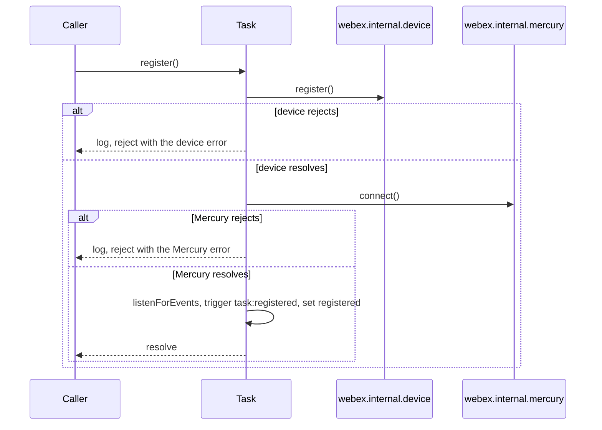
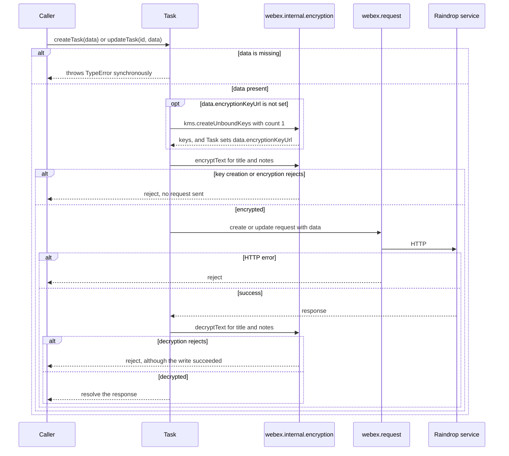
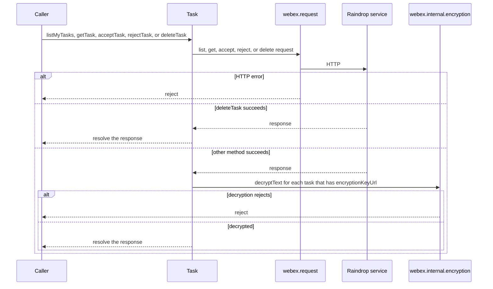
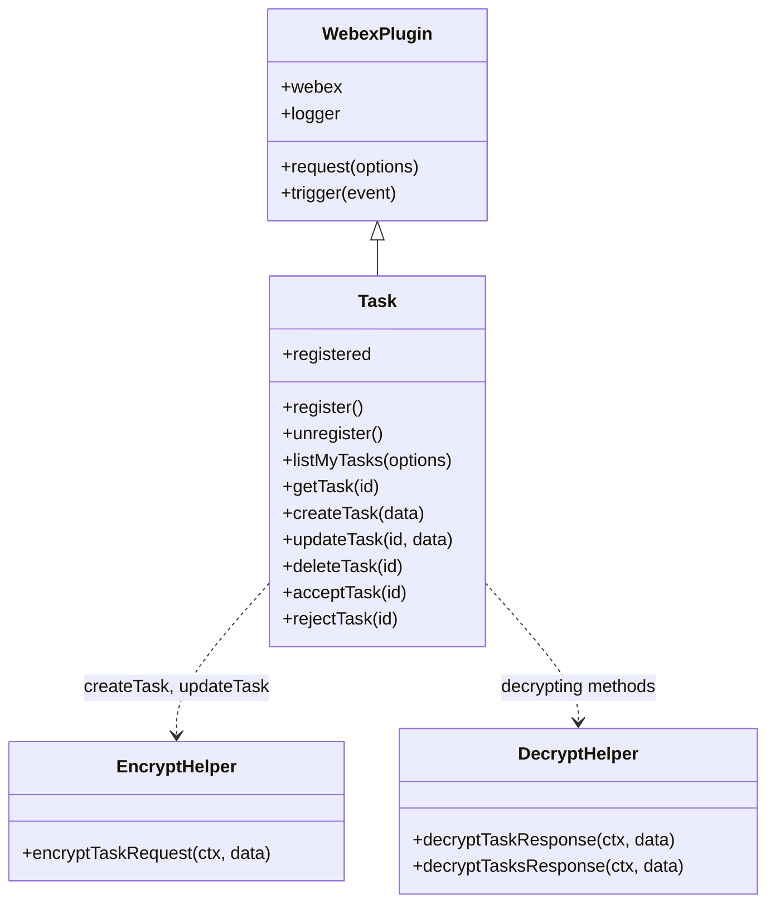
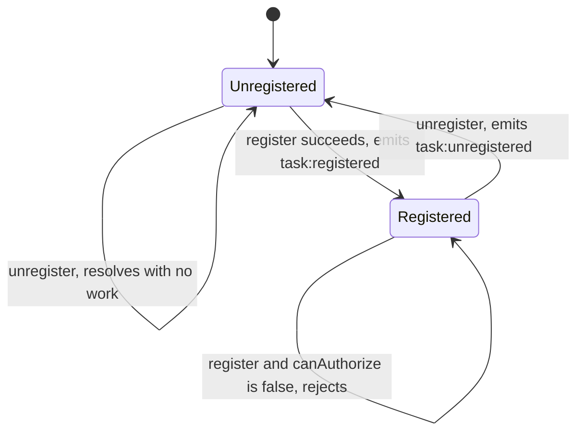

<!-- sdd-generated-metadata
doc_kind: module-spec
generated_from: module-spec@0.3.0
generated_by: claude-cowork
approved_by: akulakum@cisco.com
updated_at: 2026-10-09T14:40:25Z
validation_status: pending
-->

# Task plugin

This source-local document at `src/docs/README.md` owns the stable specification for **the Task
plugin**: the `webex.internal.task` client for the Raindrop task service. Ground every claim in
package evidence and link to the [package architecture](../../docs/architecture.md) instead of
repeating broader facts. No service specification exists because this package is a library.

Related context: [documentation index](../../docs/index.md) ·
[package agent instructions](../../AGENTS.md)

## Metadata

| Field             | Value |
| ----------------- | ----- |
| Owner             | @webex/web-sdk (CODEOWNERS default rule) |
| Source path       | `src` |
| Resource kind     | package |
| Status            | Draft |
| Last verified     | 2026-10-09 at `5e9a2555af` |
| Module id         | `internal-plugin-task` |
| Parent spec       | — |
| Doc kind          | Module spec |
| Coverage score    | 93.3% assessed 2026-10-09 — 14 of 15 mandatory fields PRESENT, critical 8 of 8; test strategy is WEAK (gaps listed under Verification) and no characterization baseline exists. Independent validation: see the Validation status row |
| Validation status | pending; independent spec-validator run not yet recorded |

## Applicability

| Condition ID                         | Status     | Evidence or reason | Owned section |
| ------------------------------------ | ---------- | ------------------ | ------------- |
| `module.has_tiers`                   | N/A        | No tier policy exists in this package or its `package.json` | Tier |
| `module.has_ui`                      | N/A        | No view or screen. The module issues requests and transforms their payloads. | UI use-case flow |
| `module.crosses_service_boundaries`  | Applicable | Every task method calls the Raindrop service through webex.request; register calls the device and Mercury plugins; the helpers call the encryption plugin | Cross-boundary use-case flow |
| `module.holds_client_state`          | N/A        | The only state is the registered flag, which State machine specifies. Task DTOs are returned to the caller, not kept. | Client state model |
| `module.enforces_domain_rules`       | Applicable | Which task fields are encrypted, how the key is chosen, and which responses are decrypted, in `src/helpers/encrypt.helper.js` and `src/helpers/decrypt.helper.js` | Business rules and invariants |
| `module.is_concurrent_async`         | Applicable | Every public method returns a promise; field encryption and decryption run in parallel | Concurrency and reactive flow |
| `module.owns_persistence`            | N/A        | Nothing is stored by this package | Data, schema, and migration |
| `module.stateful_transitions`        | Applicable | register and unregister move the plugin between unregistered and registered and emit events | State machine |
| `module.exposes_wire_protocol`       | Applicable | Raindrop request shapes, the encrypted title and notes fields, encryptionKeyUrl, and the plugin event names | Protocol and wire format |
| `module.ui_multi_screen`             | N/A        | No UI | UI flow |
| `module.large_data_model`            | N/A        | The task DTO is passed through. Only items, title, notes, and encryptionKeyUrl are read or written. | Data model |
| `module.returns_caller_errors`       | Applicable | register rejects with its own error; other failures propagate from the encryption plugin and webex.request; createTask and updateTask can throw synchronously | Caller-visible failure modes |
| `module.module_specific_conventions` | Applicable | Resolving the whole response, decrypting every task-bearing response, and the Task->method#LEVEL log prefix | Module-specific rules |
| `module.published_package`           | Applicable | `package.json` names the package @webex/internal-plugin-task and deploy:npm publishes it | Export stability |
| `module.embedded_in_host`            | N/A        | No host theme or embed API | Host integration and theming |
| `module.has_design_tradeoff`         | Applicable | Field encryption in helpers instead of payload transformers, and stub event hooks | Key design trade-off |
| `module.has_submodules`              | N/A        | Computed false by the Repo Annotation module_tree.py script: the manifest has one module | Sub-modules |

## Evidence register

| Evidence | What it establishes |
| -------- | ------------------- |
| `src/index.js` | Side-effect imports of the device, encryption, and conversation plugins; registration as internal plugin `task` with config and empty payload-transformer lists; the default export |
| `src/task.js` | The `Task` plugin: the `registered` flag, `register`, `unregister`, the empty event hooks, and the seven REST methods |
| `src/helpers/encrypt.helper.js` | Title and notes encryption and the unbound-key fallback |
| `src/helpers/decrypt.helper.js` | Title and notes decryption for one task and for a list body |
| `src/constants.js` | The `task:registered` and `task:unregistered` event names |
| `src/config.js` | The plugin config `{task: {}}` |
| `package.json` | Name, entry points, dependencies, and scripts |
| `test/unit/spec/task.js` | Unit cases for `register`, `unregister`, and every REST method except `acceptTask` and `rejectTask`, against a hand-built webex object |
| `test/unit/spec/helpers/encrypt.helper.js` | One case: both fields set, encrypted with a newly created key |
| `test/unit/spec/helpers/decrypt.helper.js` | Seven cases for empty inputs, a missing key URL, and decryption of one task and a list |
| `test/integration/spec/task.js` | A mocha spec that builds its own `MockTask` and never imports this package |
| `README.md` | Retained product documentation, not the behavioral authority. See ADR 0001. |
| Sibling package webex-core, file src/lib/webex-plugin.js | `WebexPlugin#request` delegates to `webex.request`; `logger` is `webex.logger` or `console`; `this.config` is `webex.config` under the plugin namespace |
| Sibling package webex-core, file src/lib/webex-internal-core-plugin-mixin.js | How `registerInternalPlugin` merges `config` and concatenates payload-transformer predicates and transforms |
| Sibling package webex-core, file src/lib/credentials/credentials.js | `canAuthorize` is true with an authorizing supertoken or when the credentials can refresh |
| Sibling package webex-core, files src/webex-core.js, src/config.js, src/lib/interceptors/service.js, and src/interceptors/ | The default interceptor set, its replacement by `config.interceptors`, service URL resolution, auth, the catalog check, and redirects |
| Sibling package internal-plugin-encryption, files src/index.js, src/encryption.js, and src/kms.js | `encryptText`, `decryptText`, `kms.createUnboundKeys`, and the Mercury import that registers Mercury |
| Sibling package internal-plugin-device, SDD module spec src/docs/README.md | `register()` behavior, including the shared in-flight registration |
| Sibling package internal-plugin-mercury, SDD module spec src/docs/README.md | `connect()` behavior, including in-flight deduplication |
| Sibling package legacy-tools, file src/models/package/package.ts | Which spec directories each runner collects |

## Purpose and boundary

- Responsibility: give SDK code one client for the Raindrop task service that hides the encryption
  of task `title` and `notes`, and a register call that brings up the device and Mercury connection
  the task service will need for events.
- In scope: the `Task` plugin in `src/task.js`, the two helpers in `src/helpers/`, the event names in
  `src/constants.js`, the empty config in `src/config.js`, and the registration side effect in
  `src/index.js`.
- Out of scope: HTTP transport, service URL resolution, authorization, and error classes (sibling
  packages webex-core and http-core); KMS key management and JWE encryption (sibling package
  internal-plugin-encryption); device registration (sibling package internal-plugin-device); the
  Mercury connection (sibling package internal-plugin-mercury); conversation behavior (sibling
  package internal-plugin-conversation, imported for its side effect only). Task event delivery is
  not implemented (see Key design trade-off).
- Consumers: code that reaches `webex.internal.task`. In this workspace the sibling package webex
  lists this package as a dependency and requires it in its file src/webex.js.

## Structure and key files

| Path | Responsibility |
| ---- | -------------- |
| `src/index.js` | Imports the device, encryption, and conversation plugins for their side effects, calls `registerInternalPlugin('task', Task, …)`, and re-exports `Task` as default |
| `src/task.js` | The `Task` plugin built with `WebexPlugin.extend` and namespace `Task` |
| `src/helpers/encrypt.helper.js` | `EncryptHelper.encryptTaskRequest` and the private `_encryptTextProp` |
| `src/helpers/decrypt.helper.js` | `DecryptHelper.decryptTaskResponse`, `DecryptHelper.decryptTasksResponse`, and the private `_decryptTextProp` and `_decryptTaskFields` |
| `src/constants.js` | `TASK_REGISTERED` and `TASK_UNREGISTERED` |
| `src/config.js` | Default export `{task: {}}` |
| `test/unit/spec/task.js`, `test/unit/spec/helpers/encrypt.helper.js`, `test/unit/spec/helpers/decrypt.helper.js` | Jest specs for the plugin and the two helpers |
| `test/integration/spec/task.js` | Mocha spec over an in-file mock |
| `process` | Stray tracked file (see Pitfalls) |

## Public surface

Declarations live in `src/index.js` and `src/task.js`; the rows name each surface and route its
behavior to a requirement.

| Surface | Consumer | Compatibility commitment | Source |
| ------- | -------- | ------------------------ | ------ |
| Registration side effect | Every importer | Importing installs `webex.internal.task` (`MOD-001`) | `src/index.js` |
| Default export `Task` | Importers and the unit spec | The plugin constructor (`MOD-002`) | `src/index.js` |
| `register`, `unregister` | Code that wants the plugin registered | Promise; state per State machine (`MOD-003`, `MOD-004`) | `src/task.js` |
| `registered` | Readers of the plugin | Boolean, see State machine | `src/task.js` |
| `task:registered`, `task:unregistered` events | Listeners on `webex.internal.task` | Event names (`MOD-011`) | `src/constants.js` |
| `listMyTasks`, `getTask` | Readers | Resolve the response with decrypted fields (`MOD-005`, `MOD-006`) | `src/task.js` |
| `createTask`, `updateTask` | Writers | Encrypt, send, and decrypt (`MOD-007`, `MOD-008`) | `src/task.js` |
| `deleteTask` | Writers | Resolve the response (`MOD-009`) | `src/task.js` |
| `acceptTask`, `rejectTask` | Assignees | Resolve the response with decrypted fields (`MOD-010`) | `src/task.js` |
| `listenForEvents`, `stopListeningForEvents` | None; JSDoc-private | Empty (`MOD-003`, `MOD-004`) | `src/task.js` |

Contract `task-sdk` is published with native artifact `package.json`. Required contracts:
`raindrop-tasks-http`, `webex-core-plugin-host`, `encryption-sdk`, `webex-device-registration`,
`mercury-sdk`, `conversation-sdk`, and `lodash`.

## Dependencies

| Dependency | Why it is required | Failure behavior |
| ---------- | ------------------ | ---------------- |
| `@webex/webex-core` (`webex-core-plugin-host`) | `WebexPlugin`, `registerInternalPlugin`, `request`, `logger`, and `canAuthorize` | Error classes (`WebexHttpError` subtypes through `HttpStatusInterceptor`), service URL resolution, host checks, auth, and redirects assume webex-core's default interceptor set. A host-supplied `config.interceptors` set replaces it, and then the HTTP rows under Caller-visible failure modes depend on the interceptors that host lists. Pipeline security is described in the architecture Security architecture |
| Raindrop service (`raindrop-tasks-http`) | Every REST method | Rejections from `webex.request` propagate; this package does not catch them |
| `webex.internal.encryption` (`encryption-sdk`) | `encryptText`, `decryptText`, and `kms.createUnboundKeys` in the helpers | Propagates; see Caller-visible failure modes |
| `webex.internal.device` (`webex-device-registration`) | `register()` calls `device.register()` first | Propagates; see Caller-visible failure modes |
| `webex.internal.mercury` (`mercury-sdk`) | `register()` calls `mercury.connect()` after the device | Not a declared dependency; it is registered transitively because the encryption index imports `@webex/internal-plugin-mercury` (sibling package internal-plugin-encryption, file src/index.js). Rejections propagate; see Caller-visible failure modes |
| `@webex/internal-plugin-conversation` (`conversation-sdk`) | Side-effect import only | Load-time only; Task calls no conversation API |
| `lodash` | `isArray` in the encrypt helper | — |
| `uuid` | Listed under `dependencies` | Not imported by `src/` |

## Requirements

| ID | WHAT | WHY | Source evidence | Test or example evidence | Assumptions or gaps | Confidence |
| -- | ---- | --- | --------------- | ------------------------ | ------------------- | ---------- |
| `MOD-001` | Importing the package imports the device, encryption, and conversation plugins and registers `Task` as internal plugin `task` with config `{task: {}}` and empty payload-transformer `predicates` and `transforms`. | Webex instances built after the import get `webex.internal.task` with its dependencies registered. | `src/index.js`, `src/config.js` | none found; the unit spec builds Task as a child of a plain object instead | The config adds an empty `webex.config.task` object (the plugin's `this.config`), and `src/` reads no key from it | Present |
| `MOD-002` | The barrel exports only `Task` as default. The event-name constants are not re-exported. | Callers reach the plugin through `webex.internal.task`; the class export exists for tests and extension. | `src/index.js` | `test/unit/spec/task.js` imports Task from the package | Listeners must use the literal event names or import `src/constants.js` by path | Present |
| `MOD-003` | `register()` checks `INV-005`, then registers the device, connects Mercury, calls `listenForEvents`, emits `task:registered`, and sets `registered`. A failure in that chain is logged and rejects with the same error. | Task events would arrive over Mercury, which needs a registered device and an authorized user. | `src/task.js` | `test/unit/spec/task.js` #register() cases (device called once, registered true, event fired) | No test for the authorization gate, the already-registered path, or a failure | Present |
| `MOD-004` | `unregister()` resolves at once when not registered; otherwise it calls `stopListeningForEvents`, emits `task:unregistered`, clears `registered`, and resolves. It does not disconnect Mercury or unregister the device. | Other plugins share the device and Mercury connection. | `src/task.js` | `test/unit/spec/task.js` #unregister() cases (event fired; mercury.off not called) | No test for the not-registered path | Present |
| `MOD-005` | `listMyTasks(options)` sends the list request with the caller's options as the query, or an empty query when `options` is falsy, decrypts the list body by `INV-003`, and resolves the response (`INV-004`). | Lists the user's tasks with readable titles and notes. | `src/task.js`, `src/helpers/decrypt.helper.js` | `test/unit/spec/task.js` #listMyTasks() (request shape with an empty query) | The option names in the JSDoc (orderBy, offset, limit) are passed through and not checked | Present |
| `MOD-006` | `getTask(id)` sends the get request, decrypts the body by `INV-003`, and resolves the response. | Reads one task. | `src/task.js` | `test/unit/spec/task.js` #getTask() (request shape and decrypted title) | The JSDoc says it resolves an array; it resolves one response | Present |
| `MOD-007` | `createTask(data)` encrypts `data` by `INV-001` and `INV-002`, then sends the create request with `data` as the body, decrypts the response body by `INV-003`, and resolves the response. | `title` and `notes`, when set, are sent only as ciphertext. | `src/task.js`, `src/helpers/encrypt.helper.js` | `test/unit/spec/task.js` #createTask() (request shape); `test/unit/spec/helpers/encrypt.helper.js` (new key path) | The test asserts against the same object the helper changed, so it does not check the encrypted values | Present |
| `MOD-008` | `updateTask(id, data)` does the same as `MOD-007` with the update request. | Same as `MOD-007` for edits. | `src/task.js` | `test/unit/spec/task.js` #updateTask() (request shape) | Key choice per `INV-002`; see Pitfalls | Present |
| `MOD-009` | `deleteTask(id)` sends the delete request and resolves the response without decryption. | Deletes a task. | `src/task.js` | `test/unit/spec/task.js` #deleteTask() (request shape) | Whether Raindrop returns a task body on delete is not in this repository | Present |
| `MOD-010` | `acceptTask(id)` and `rejectTask(id)` send the accept and reject requests, decrypt the response body by `INV-003`, and resolve the response. | An assignee accepts or declines a task assigned to them. | `src/task.js` | none found | No unit test | Present |
| `MOD-011` | The plugin emits `task:registered` and `task:unregistered` on itself, with no payload. | Callers can wait for registration without polling `registered`. | `src/constants.js`, `src/task.js` | `test/unit/spec/task.js` should-trigger cases assert that each event fires once | The tests do not assert the absence of a payload | Present |

## Design overview

`Task` is created with `WebexPlugin.extend`. Its only state is the plain `registered` property,
specified under State machine.

Every REST method follows one shape: optionally run the encrypt helper over the caller's object,
send one request through `this.request`, run the matching decrypt helper over the body, and resolve
the response (`INV-004`). `listMyTasks` calls `this.webex.request`, the function that `this.request`
delegates to, so the behavior is the same. The helpers change the objects they receive, and Task
ignores their resolved values: arrays from `Promise.all` when fields are encrypted or decrypted, or
`undefined` when decryption is skipped.

Field encryption is done by the helpers rather than by payload transformers; the cost of that choice
is under Key design trade-off.

## Data flow and sequence coverage

Transport: HTTP through `webex.request` to the Raindrop service; in-process promise calls to the
encryption, device, and Mercury plugins.

| Operation group | Entry and outcome | Diagram or evidence | Failure and recovery coverage |
| --------------- | ----------------- | ------------------- | ----------------------------- |
| Registration | `register`, `unregister` → device, Mercury, event, flag | Registration diagram below for call order; guards and transitions in State machine | Device or Mercury rejection; guard outcomes in State machine |
| Encrypted writes | `createTask`, `updateTask` → encrypt, send, decrypt | Encrypted writes diagram below | Missing `data`, key creation or encryption failure, HTTP rejection, decryption failure after success |
| Reads and actions | `listMyTasks`, `getTask`, `acceptTask`, `rejectTask`, `deleteTask` → response | Reads and actions diagram below | HTTP rejection, decryption failure after success, delete without decryption |

Registration, when the guards in `INV-005` pass:

Encrypted writes:

Reads and actions:

## Class and component relationships

| Component | Relationship |
| --------- | ------------ |
| `Task` | Plugin holding every public method; extends `WebexPlugin` |
| `EncryptHelper` | Plain object; receives the plugin as `ctx` and reaches `ctx.webex.internal.encryption` |
| `DecryptHelper` | Plain object; same `ctx` pattern |
| `TASK_REGISTERED`, `TASK_UNREGISTERED` | String constants imported by `src/task.js` |

## Use cases and flows

| Use case | Actor or caller | Primary steps and outcome | Failure or boundary behavior | Evidence |
| -------- | --------------- | ------------------------- | ---------------------------- | -------- |
| `UC-001` | Client creating a task | Calls `createTask({title, notes, dueDate})`; a key is created, the text is encrypted, the task is posted, and the response arrives with readable text | See Caller-visible failure modes and Pitfalls | `src/task.js`, `src/helpers/encrypt.helper.js` |
| `UC-002` | Client editing a task | Calls `updateTask(id, {title, encryptionKeyUrl})` with the task's existing key URL so the same key is reused | See Pitfalls | `src/task.js`, `src/helpers/encrypt.helper.js` |
| `UC-003` | Task list view | Calls `listMyTasks({orderBy: 'createdAt:desc'})` and reads `response.body.items` | A task without `encryptionKeyUrl` is returned as received | `src/task.js`, `src/helpers/decrypt.helper.js`, `README.md` |
| `UC-004` | Assignee | Calls `acceptTask(id)` or `rejectTask(id)` and reads the updated task from the response | HTTP rejection propagates | `src/task.js` |
| `UC-005` | Client that wants task events | Calls `register()` after authentication and listens for `task:registered` | No task event is delivered afterwards (see Key design trade-off) | `src/task.js` |

### Cross-boundary use-case flow

| Boundary | Transport | Ordering | Timeout and retry | Recovery |
| -------- | --------- | -------- | ----------------- | -------- |
| Raindrop service | HTTP through `webex.request`, catalog service `raindrop` | One request per call, after encryption for writes | No retry here; any retry or timeout belongs to the webex-core request pipeline | None here |
| Encryption plugin and KMS | In-process promises; the KMS exchange is owned by internal-plugin-encryption | Key creation, then encryption, before the request; decryption after the response | None here | None here |
| Device plugin | In-process promise | First step of `register` | None here | See Caller-visible failure modes |
| Mercury plugin | In-process promise | After the device | None here | See Caller-visible failure modes |

## Business rules and invariants

| ID | Invariant | WHY | Enforcement source | Test evidence |
| -- | --------- | --- | ------------------ | ------------- |
| `INV-001` | Only `title` and `notes` are encrypted, and each only when its value is truthy; every other field is sent as given. | These are the free-text fields; other task fields are sent in the clear. | `src/helpers/encrypt.helper.js` | `test/unit/spec/helpers/encrypt.helper.js` (both fields set only) |
| `INV-002` | When `data.encryptionKeyUrl` is set, it is the encryption key. Otherwise one unbound key is created with `kms.createUnboundKeys({count: 1})`, its `uri` is written to `data.encryptionKeyUrl`, and that key is used. | The server needs the key URL to let recipients decrypt. | `src/helpers/encrypt.helper.js` | `test/unit/spec/helpers/encrypt.helper.js` (new key only) |
| `INV-003` | A task is decrypted only when it has a truthy `encryptionKeyUrl`; then its truthy `title` and `notes` are replaced with plaintext using that key. A list body is decrypted item by item from `items`; a missing body or empty `items` is left alone. | Tasks without a key are plaintext and must not be passed to the decrypter. | `src/helpers/decrypt.helper.js` | `test/unit/spec/helpers/decrypt.helper.js` |
| `INV-004` | Every REST method resolves the whole response object; for the decrypting methods, the decrypted values are written into `response.body`. | Callers read `body` and can also read status and headers. | `src/task.js` | `test/unit/spec/task.js` (reads of res.body) |
| `INV-005` | `register` checks first that `webex.canAuthorize` is true and rejects with `Error('SDK cannot authorize')` when it is false, even when already registered; it then resolves with no work when `registered` is true, and proceeds otherwise. | Device registration needs credentials, and a second registration is not needed. | `src/task.js` | Gap: no test |
| `INV-006` | Every request uses service `raindrop`, and its resource is `tasks` or `tasks/{id}` with an optional `/accept` or `/reject`. `{id}` is the caller's value, inserted without encoding. | Raindrop is the task service in the catalog. | `src/task.js` | `test/unit/spec/task.js` (request shapes for five methods) |

## Concurrency and reactive flow

- Execution model: single JavaScript event loop. Every public method returns a promise, except the
  synchronous throw listed under Caller-visible failure modes.
- Ordering guarantees: `title` and `notes` are encrypted, and decrypted, in parallel with
  `Promise.all`; a list body is decrypted for all items in parallel. No ordering across calls.
- Idempotency and retry: no retry or deduplication in this module; see Pitfalls for concurrent
  `register` calls and for retrying a write.
- Shared-state protection: none; `registered` is written only at the end of the register chain and
  in `unregister`.
- Blocking restrictions: none in this module.

## State machine

The plugin has two states, held in the `registered` property (initially `false`). Events are
emitted on the plugin.

- Guards: `INV-005` for `register`; `unregister` acts only when `registered` is true.
- Terminal state: none; the plugin can be registered again.
- Event timing: `task:registered` is triggered before `registered` becomes true, and
  `task:unregistered` before it becomes false, so a listener that reads `registered` sees the old
  value.

## Protocol and wire format

| Message or frame | Version | Producer or serializer | Consumer or parser | Compatibility and ordering rule |
| ---------------- | ------- | ---------------------- | ------------------ | ------------------------------- |
| List request | Unversioned | `src/task.js` | Raindrop service | GET resource `tasks`; `qs` is the caller's options or `{}`. Response body `{items: [task]}`; the decrypt helper fixture also carries `offset`, `limit`, and `hasMore`. |
| Get request | Unversioned | `src/task.js` | Raindrop service | GET `tasks/{id}`; response body is one task. |
| Create request | Unversioned | `src/task.js` | Raindrop service | POST `tasks`; body is the caller's object after `INV-001` and `INV-002`. Response body is one task. |
| Update request | Unversioned | `src/task.js` | Raindrop service | PATCH `tasks/{id}`; body as create. |
| Delete request | Unversioned | `src/task.js` | Raindrop service | DELETE `tasks/{id}`; no body. |
| Accept and reject requests | Unversioned | `src/task.js` | Raindrop service | POST `tasks/{id}/accept` and `tasks/{id}/reject`; no body. Response body is one task. |
| Task fields | Unversioned | Caller and Raindrop service | `src/helpers/encrypt.helper.js`, `src/helpers/decrypt.helper.js` | `title` and `notes` travel as the ciphertext strings returned by `encryptText`; `encryptionKeyUrl` is the KMS key URI. Other fields (for example `dueDate` in the README) are not read here. |
| Plugin events | Unversioned | `src/task.js` | Listeners on the plugin | `task:registered`, `task:unregistered`, no payload. |

## Caller-visible failure modes

| Condition | Signal or result | Caller behavior | Retry or recovery | Evidence |
| --------- | ---------------- | --------------- | ----------------- | -------- |
| `register` while the SDK cannot authorize | Rejects per `INV-005`; logged at error level | Authenticate first | Call again after authorization | `src/task.js` |
| `register` when the device or Mercury rejects | Rejects with the same error; logged with its message | Inspect the dependency error | Call again; `registered` is still false | `src/task.js` |
| `createTask` or `updateTask` without `data` | Synchronous TypeError reading `encryptionKeyUrl`, not a rejected promise | Pass an object | None | `src/helpers/encrypt.helper.js` |
| Key creation or encryption fails | Rejects with the encryption plugin's error; no request is sent | Inspect the error | Retry with a fresh object (see Pitfalls) | `src/helpers/encrypt.helper.js` |
| HTTP failure status (default interceptor set; see Dependencies) | Rejects with the `WebexHttpError` subtype for the final status (`NetworkOrCORSError` for a network failure), after any 401 refresh-and-replay or redirect that webex-core performs | Inspect the class or status | None here | `src/task.js`; sibling package http-core, file src/interceptors/http-status.js |
| webex-core retry or redirect limit reached (default interceptor set) | Rejects with a plain `Error`, not a `WebexHttpError`: `Failed after N replay attempts` when 401 replays exceed `maxAuthenticationReplays`, or `Maximum redirects exceeded` when redirects exceed their limit | Treat as an authentication or routing problem | None here | Sibling package webex-core, files src/interceptors/auth.js and src/interceptors/redirect.js |
| The catalog has no `raindrop` service (default set) | Rejects with a plain `Error` whose message is `service-interceptor: 'raindrop' is not a known service` | Treat as an environment problem | None here | Sibling package webex-core, file src/lib/interceptors/service.js |
| Decryption of a response fails | Rejects with the encryption plugin's error, even though the server already applied the request | Do not assume the write failed | Read the task again | `src/helpers/decrypt.helper.js` |

## Pitfalls and constraints

- `createTask` and `updateTask` change the caller's object: `title` and `notes` become ciphertext and
  `encryptionKeyUrl` is added. Retrying with the same object encrypts the ciphertext again, because
  the fields are still truthy. Found by code reading; no test.
- `updateTask` without `encryptionKeyUrl` creates a new unbound key for every call and encrypts the
  update with it. Callers that want the task's existing key must pass its key URL.
- The created key is unbound: this package never binds it to a resource. Whether the Raindrop
  service does so is not visible in this repository.
- `register` has no in-flight guard. Two calls made before the first completes both run the chain;
  the device and Mercury plugins deduplicate the in-flight registration and connection, but Task
  calls `listenForEvents` twice and emits `task:registered` twice.
- The JSDoc of `listenForEvents` and `stopListeningForEvents` says they register and unregister task
  events through Mercury; both bodies are empty.
- The unit test named "should call mercury.unregister and device.unregister" asserts that
  `mercury.off` is called zero times; the name does not match the behavior.
- No method validates `id`; an undefined id sends `tasks/undefined` (`INV-006`).
- The tracked `process` file contains `module.exports = {browser: true};` and is read by nothing in
  this package. It is left as found.

## Module-specific rules

- Do: resolve the whole response from a new REST method (`INV-004`) and run the matching decrypt
  helper on any task-bearing body.
- Do: run `EncryptHelper.encryptTaskRequest` before sending any task body that can carry `title` or
  `notes`.
- Do: keep the `Task->method#LEVEL` log prefix (see the architecture Observability patterns).
- Do not: log task `title` or `notes`; they are the encrypted fields.
- Do not: add a request outside service `raindrop` without updating `INV-006` and the
  `raindrop-tasks-http` contract.

## Export stability

| Export or entry point | Consumer | Stability | Versioning and deprecation rule | Declaration or API report |
| --------------------- | -------- | --------- | ------------------------------- | ------------------------- |
| default Task | Tests and importers | Internal plugin | README states the package does not strictly follow semver | `src/index.js` |
| Registration as task | Code reading webex.internal.task | Stable | Renaming is breaking | `src/index.js` |
| Event names | Listeners on the plugin | Stable | Renaming is breaking | `src/constants.js` |

No TypeScript declaration or API report exists for this package.

## Key design trade-off

| Chosen trade-off | Preserved invariant or benefit | Cost or limitation | Decision evidence |
| ---------------- | ------------------------------ | ------------------ | ----------------- |
| Field encryption in helpers called by each method, with empty payload-transformer lists at registration | Encryption logic stays inside this package and is simple to test | Each method must call the matching helper itself; the helper comments call this a backup solution and say interceptors are the better place, pending a migration | `src/helpers/encrypt.helper.js`, `src/helpers/decrypt.helper.js`, `src/index.js` |
| `register` connects Mercury while `listenForEvents` and `stopListeningForEvents` are empty | The registration contract exists for future task events | No task event reaches callers after `register`, yet they pay for device registration and a socket | `src/task.js` |

## Verification

| Requirement or invariant | Test level | Positive evidence | Negative or boundary evidence | Gap |
| ------------------------ | ---------- | ----------------- | ----------------------------- | --- |
| `MOD-003`, `MOD-011` | Unit | `test/unit/spec/task.js` #register() cases | none found | Authorization gate, already registered, failures, concurrent calls |
| `MOD-004`, `MOD-011` | Unit | `test/unit/spec/task.js` #unregister() cases | none found | Not-registered path |
| `MOD-005` to `MOD-009`, `INV-006` | Unit | `test/unit/spec/task.js` request-shape cases | none found | HTTP rejection; caller-object change |
| `MOD-010` | none | none found | none found | No test for accept or reject |
| `INV-001`, `INV-002` | Unit | `test/unit/spec/helpers/encrypt.helper.js` | none found | Existing-key path, falsy fields, key-creation failure |
| `INV-003` | Unit | `test/unit/spec/helpers/decrypt.helper.js` | Missing data, missing key URL, missing or empty items | Decryption failure |
| `INV-004` | Unit | `test/unit/spec/task.js` | none found | — |
| `INV-005` | none | none found | none found | No test |
| `MOD-001`, `MOD-002` | none | none found | none found | No registration test |
| Integration tier | Integration | `test/integration/spec/task.js` passes | none found | The spec tests its own mock and never imports this package |

Unit checks run with `yarn workspace @webex/internal-plugin-task build:src` followed by
`yarn workspace @webex/internal-plugin-task test:unit`. The reason for building first, the test tiers,
and the first-run build are described in [Getting started](../../docs/getting-started.md).
