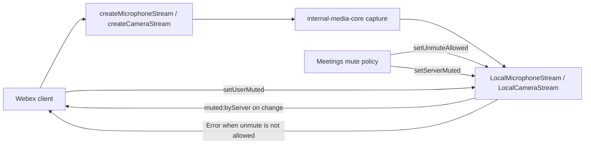
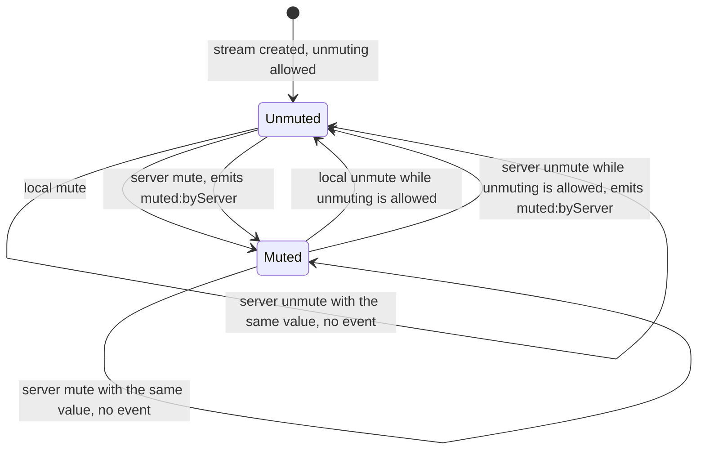

<!-- sdd-generated-metadata
doc_kind: module-spec
generated_from: module-spec@0.3.0
generated_by: claude-code
approved_by: rarajes2@cisco.com
updated_at: 2026-09-30T05:28:59Z
validation_status: pass
-->

# @webex/media-helpers

This source-local document owns the stable specification for
**`@webex/media-helpers`**. Ground every claim in repository evidence and link to the
[repository architecture](architecture.md) instead of repeating broader facts. This package is not
a deployable service, so no service specification applies.

Related context: [documentation index](index.md) ·
[repository agent instructions](../AGENTS.md)

## Metadata

| Field         | Value                                                        |
| ------------- | ------------------------------------------------------------ |
| Owner         | @webex/web-client, @webex/web-sdk                            |
| Source path   | src/                                                         |
| Resource kind | package                                                      |
| Status        | Active                                                       |
| Last verified | 2026-09-29 at 2d71fd7479                                     |
| Module id     | src/                                                         |
| Parent spec   | —                                                            |
| Doc kind      | Module spec                                                  |
| Coverage score | 100% assessed 2026-09-29; 15 of 15 mandatory fields present, zero critical gaps, zero measured drift |
| Validation status | pass — 2026-09-30; runtime 01a0f0b1-d33c-7342-b65e-bbf7ec027c99; 0 Blocking, 0 Important |

## Applicability

Sections preceded by an `Include if` comment are conditional. Retain a
conditional section only when source evidence or a confirmed developer answer
satisfies its condition. Record `Unresolved` instead of guessing.

| Condition ID                         | Status     | Evidence or reason | Owned section                 |
| ------------------------------------ | ---------- | ------------------ | ----------------------------- |
| module.has_tiers                     | N/A        | The monorepo CODEOWNERS entry carries no tier annotation, and no per-module SLO configuration exists | Tier                          |
| module.has_ui                        | N/A        | No component, template, or stylesheet files exist under the source tree | UI use-case flow              |
| module.crosses_service_boundaries    | N/A        | No HTTP, gRPC, or queue client in the source tree; media capture is browser-local | Cross-boundary use-case flow  |
| module.holds_client_state            | Applicable | `src/webrtc-core.ts` hold per-instance unmute permission | Client state model            |
| module.enforces_domain_rules         | Applicable | `src/webrtc-core.ts` guard unmuting | Business rules and invariants |
| module.is_concurrent_async           | Applicable | Typed event declarations in `src/webrtc-core.ts`; awaited mute calls in `test/unit/spec/webrtc-core.js` | Concurrency and reactive flow |
| module.owns_persistence              | N/A        | No store, data-access class, schema, or migration in the source tree | Data, schema, and migration   |
| module.stateful_transitions          | Applicable | Change-guarded mute transitions in `src/webrtc-core.ts` | State machine                 |
| module.exposes_wire_protocol         | N/A        | No protocol definition, binary format, or custom serialization | Protocol and wire format      |
| module.ui_multi_screen               | N/A        | Gated off because the module has no user interface | UI flow                       |
| module.large_data_model              | N/A        | Gated off because the module owns no persistence | Data model                    |
| module.returns_caller_errors         | Applicable | A thrown unmute error in `src/webrtc-core.ts` | Caller-visible failure modes  |
| module.module_specific_conventions   | Applicable | Internal-visibility markers in `src/webrtc-core.ts` combined with the monorepo compiler option that strips them, plus the non-semver policy stated in `README.md` | Module-specific rules         |
| module.published_package             | Applicable | `package.json` declares a main entry and a publish script, with no private flag | Export stability              |
| module.embedded_in_host              | N/A        | No host mount contract, plugin manifest, or web-component export | Host integration and theming  |
| module.has_design_tradeoff           | Applicable | Duplicated stream classes in `src/webrtc-core.ts`, with explanatory source comments in the same file | Key design trade-off          |
| module.has_submodules                | N/A        | The manifest records one module; no child module paths exist | Sub-modules                   |

## Evidence register

List the code, tests, schemas, configuration, and prior decisions used to
verify this specification. Mark unresolved statements as `[NEEDS HUMAN INPUT]`;
do not infer missing behavior.

| Evidence                        | What it establishes |
| ------------------------------- | ------------------- |
| `src/index.ts`                  | The exact published export list, and that the effects surface is re-exported from `@webex/web-media-effects` rather than implemented here |
| `src/webrtc-core.ts`            | The two stream subclasses, the unmute gate, the server-mute event, and the six factory wrappers |
| `src/constants.ts`              | The facing-mode and display-surface enumerations and the seven camera constraint presets |
| `test/unit/spec/webrtc-core.js` | 31 passing tests pinning the mute state machine and the argument shape every factory forwards |
| `package.json`                  | Publication intent, command roles, and the exact pinned upstream versions |
| `README.md`                     | Owner-authored usage guidance for effects and stream creation; reconciled into this spec, with one statement recorded as stale |
| `tsconfig.json`                 | Extends the monorepo compiler configuration that emits declarations only and strips internal members |

Evidence outside this package, verified during onboarding and cited in prose rather than in the
table above because it lives elsewhere in the monorepo:

- The meetings mute-state module in `@webex/plugin-meetings` is the only in-repo consumer of the
  internal mute API, and it applies unmute permission and server mute through two separate methods.
- The calling package consumes only the published surface.
- The monorepo CODEOWNERS file assigns this package to `@webex/web-client` and `@webex/web-sdk`.
- The monorepo root TypeScript configuration sets declaration-only emit and strips internal members.

## Purpose and boundary

- Responsibility: adapt the `@webex/internal-media-core` local stream classes so a Webex server can
  mute a participant and forbid them from unmuting, and present one entry point for the media and
  effects surface the Webex first-party clients need.
- In scope: the unmute gate and its error, the server-mute event and its change-guard, the stream
  factory wrappers that inject this package's constructors, and the camera constraint presets.
- Out of scope: media capture itself, stream lifecycle, and effect implementation. Those belong to
  `@webex/internal-media-core` and `@webex/web-media-effects`, which this package delegates to and
  re-exports. Meeting-level mute policy belongs to `@webex/plugin-meetings`.
- Consumers: npm consumers of `@webex/media-helpers`; in-repo, `@webex/plugin-meetings` and the
  calling package.
- Configuration and rollout: none owned here. The module reads no environment variable, config
  loader, or feature flag; all behavior is driven by constructor arguments and method calls, and
  every capability ships unconditionally. Behavior is therefore varied by the caller, not by
  deployment configuration.

## Structure and key files

| Path                            | Responsibility                                                                 |
| ------------------------------- | ------------------------------------------------------------------------------ |
| `src/index.ts`                  | The published barrel. Authoritative for what is and is not exported            |
| `src/webrtc-core.ts`            | The substantive module: stream subclasses, the unmute gate, the server-mute event, and the factory wrappers |
| `src/constants.ts`              | Value presets for facing mode, display surface, and camera resolution          |
| `test/unit/spec/webrtc-core.js` | The characterization baseline recorded in the SDD manifest                     |

## Public surface

Describe exported APIs, events, commands, files, or UI boundaries. Link exact
schemas or declarations instead of copying them.

| Surface                                                        | Consumer                                          | Compatibility commitment                                                            | Source               |
| -------------------------------------------------------------- | -------------------------------------------------- | ------------------------------------------------------------------------------------ | -------------------- |
| The published package export list                               | npm consumers, the meetings plugin, the calling package | Published; the package README states it does not strictly adhere to semantic versioning | `package.json`       |
| Server-mute control: set-unmute-allowed and set-server-muted    | The meetings plugin only                           | Internal; the monorepo strip-internal compiler option removes it from published declarations, so it carries no external promise | `src/webrtc-core.ts` |
| Re-exported media effects                                       | npm consumers, the calling package                 | Tracks the exact pinned upstream effects release; this package adds nothing           | `src/index.ts`       |

Exact declarations stay in those sources. The SDD manifest contract catalog is the machine-readable
registry, and `src/index.ts` is authoritative for the exact export list.

The re-exported effects surface covers two effect families:

- **Virtual background** (e.g., blur, image replacement, video replacement). The virtual background
  effect provides a virtual background for video calling. The virtual background may be an image, an
  mp4 video, or the user's background with blur applied.
- **Noise reduction** (e.g., background noise removal). The noise reduction effect removes background
  noise from an audio stream to provide clear audio for calling.

Both are implemented in `@webex/web-media-effects` and re-exported unchanged, so their behavior and
versioning stay owned upstream. `README.md` holds the consumer usage examples for applying them.

## Dependencies

| Dependency                   | Why it is required                                              | Failure behavior                                                                 |
| ---------------------------- | ---------------------------------------------------------------- | --------------------------------------------------------------------------------- |
| `@webex/internal-media-core` | Supplies the stream base classes and the capture factories this module subclasses and delegates to | Capture rejection propagates to the caller unchanged; this module adds no retry or fallback |
| `@webex/web-media-effects`   | Supplies the effects surface re-exported through the barrel       | Re-export only; failures surface directly from the upstream effect                |
| `@webex/ts-events`           | Supplies the typed-event primitives used to attach the server-mute event | A signature change breaks compilation of both stream classes                      |

## Requirements

Separate source evidence, test/example evidence, assumptions, and gaps so a
future contributor can distinguish verified behavior from approved unknowns.

| ID        | WHAT                                           | WHY                            | Source evidence | Test or example evidence            | Assumptions or gaps | Confidence                        |
| --------- | ---------------------------------------------- | ------------------------------ | --------------- | ----------------------------------- | ------------------- | --------------------------------- |
| `MOD-001` | A new local microphone or camera stream permits unmuting | A stream must be usable before any server policy arrives, otherwise a normal call could never start unmuted | `src/webrtc-core.ts` | `test/unit/spec/webrtc-core.js` | none | Present |
| `MOD-002` | Unmuting throws "Unmute is not allowed" while unmuting is forbidden | The server's restriction must be enforced at the stream itself, so no caller can bypass it by forgetting to check | `src/webrtc-core.ts` | `test/unit/spec/webrtc-core.js` | none | Present |
| `MOD-003` | Muting always succeeds regardless of the unmute restriction | A participant must always be able to stop transmitting; the restriction governs unmuting only | `src/webrtc-core.ts` | `test/unit/spec/webrtc-core.js` | none | Present |
| `MOD-004` | A server mute update applies the new value and emits its event only when the value actually changes | Repeated server updates carrying the same state must not produce duplicate consumer notifications | `src/webrtc-core.ts` | `test/unit/spec/webrtc-core.js` | none | Present |
| `MOD-005` | The server-mute event carries the new mute value and a reason of remotely-muted, client-request-failed, or local-unmute-required | Consumers must distinguish a remote mute from a failed client request or a forced unmute to show the right user feedback | `src/webrtc-core.ts` | `test/unit/spec/webrtc-core.js`, covering the remotely-muted reason only | The other two reason values have no test coverage | Present |
| `MOD-006` | Each stream factory forwards this package's stream constructors plus the caller's constraints, unchanged, to the matching upstream factory | Consumers must receive the subclassed streams that carry the mute behavior, not the upstream base classes | `src/webrtc-core.ts` | `test/unit/spec/webrtc-core.js` | none | Present |
| `MOD-007` | Display-media capture defaults to video-only, always injects the display stream constructor, and includes the audio branch only when the caller passes an audio object | Screen sharing must not silently capture system audio that the caller did not request | `src/webrtc-core.ts` | `test/unit/spec/webrtc-core.js` | none | Present |
| `MOD-008` | The media effects surface is re-exported unchanged from the upstream effects package | Consumers get one import site for media, while effect behavior and versioning stay owned upstream | `src/index.ts` | none found | The package README describes these effects as included in this package; current code only re-exports them | Present |
| `MOD-009` | Seven named camera resolution presets are offered from 1080p to 120p, each at 30 frames per second | Callers pick a named quality tier instead of hand-writing constraint objects that drift between clients | `src/constants.ts` | none found | No test pins these values | Weak |

## Design overview

The module is deliberately thin. Two subclasses in `src/webrtc-core.ts` extend the
upstream local stream classes and add exactly one piece of state, the unmute permission flag, plus
one typed event. Each is then wrapped by the typed-event helper so the event is
visible in the exported type, and the resulting constructors are what the six factory wrappers hand
to the upstream capture functions. Five of them forward the caller's constraints positionally to the
matching upstream factory; `createDisplayMedia` instead composes an options object, which is why it
carries its own requirement.

State ownership splits cleanly. The user-muted flag is owned by the upstream base class; this module
only reads it to decide whether a server update is a real change. The unmute permission flag is
owned here and exists only in memory for the stream's lifetime.

The most important structural fact is that the two subclasses are duplicated rather than sharing a
base. The source comments on both classes attribute this to webrtc-core event type inheritance
not yet supporting the pattern. The duplication is therefore intentional and temporary, not an
oversight — but it means audio and video mute behavior can silently diverge if only one class is
edited.

## Data flow and sequence coverage

Name the exact transport or call style. Inventory the major operation groups
before adding diagrams, and include failure, timeout, retry, rejection,
rollback, or recovery behavior where it exists.

All interaction is in-process synchronous or promise-returning method calls plus typed event
emission. There is no network transport in this module.

| Operation group        | Entry and outcome                                                                     | Diagram or evidence                                    | Failure and recovery coverage                                                        |
| ---------------------- | -------------------------------------------------------------------------------------- | ------------------------------------------------------- | -------------------------------------------------------------------------------------- |
| Stream creation        | A factory call returns a subclassed local stream carrying the mute behavior              | `src/webrtc-core.ts`                      | Upstream capture rejection propagates unchanged; no test covers a rejected capture      |
| Local mute change      | A mute call applies the value, or throws when unmuting is forbidden                      | `src/webrtc-core.ts`                        | The throw path is covered by the unit suite                                             |
| Server mute change     | A server update applies the value and emits the event only on a real change              | `src/webrtc-core.ts`                       | Both the change and no-change branches are covered by the unit suite                    |
| Server-forced unmute   | A server update that unmutes delegates to the local unmute path and throws when unmuting is forbidden | `src/webrtc-core.ts`                                     | Not covered by any test; see Caller-visible failure modes                               |



## Class and component relationships

```mermaid
classDiagram
  WcmeLocalMicrophoneStream <|-- _LocalMicrophoneStream
  WcmeLocalCameraStream <|-- _LocalCameraStream
  _LocalMicrophoneStream --> TypedEvent : muted:byServer
  _LocalCameraStream --> TypedEvent : muted:byServer
  AddEvents --> LocalMicrophoneStream : wraps _LocalMicrophoneStream
  AddEvents --> LocalCameraStream : wraps _LocalCameraStream
  createMicrophoneStream --> LocalMicrophoneStream
  createCameraStream --> LocalCameraStream
  createCameraAndMicrophoneStreams --> LocalCameraStream
  createCameraAndMicrophoneStreams --> LocalMicrophoneStream
```

The display stream and system audio stream classes are re-exported from
`@webex/internal-media-core` without subclassing; the display factories pass them through unchanged.

## Use cases and flows

| Use case | Actor or caller        | Primary steps and outcome                                                                              | Failure or boundary behavior                                                        | Evidence                                                          |
| -------- | ---------------------- | -------------------------------------------------------------------------------------------------------- | ------------------------------------------------------------------------------------ | ------------------------------------------------------------------ |
| `UC-001` | Webex client           | Create a new camera stream instance by using the createCameraStream() method, or a new microphone stream instance by using the createMicrophoneStream() method, optionally passing constraints, and receive a subclassed local stream | Upstream capture rejection propagates; nothing is retried here                        | `src/webrtc-core.ts`; `test/unit/spec/webrtc-core.js` |
| `UC-002` | Webex client           | Mute or unmute the stream locally                                                                          | Unmuting throws while the server restriction is active                                | `src/webrtc-core.ts`; `test/unit/spec/webrtc-core.js`  |
| `UC-003` | Meetings mute policy   | Apply a server mute change; the consumer receives the event                                                | No event when the value is unchanged; throws on a forced unmute while restricted      | `src/webrtc-core.ts`; `test/unit/spec/webrtc-core.js` |
| `UC-004` | Meetings mute policy   | Apply or lift the server's unmute restriction                                                              | No event is emitted; the change is observable only by querying the permission          | `src/webrtc-core.ts`; `test/unit/spec/webrtc-core.js`  |
| `UC-005` | Webex client           | Start screen sharing, optionally including system audio                                                     | Audio is captured only when an audio object is supplied                               | `src/webrtc-core.ts`; `test/unit/spec/webrtc-core.js` |
| `UC-006` | Webex client           | Apply a virtual background or noise reduction effect to a stream                                            | Owned upstream; this package only re-exports the effect classes                       | `src/index.ts`; `README.md` usage examples                   |

<!-- Include if: the module holds client-side state. [condition-id: module.holds_client_state] -->

## Client state model

| State or slice        | Owner                                     | Initial state    | Transition triggers                                            | Reset or persistence boundary                        |
| --------------------- | ----------------------------------------- | ---------------- | --------------------------------------------------------------- | ------------------------------------------------------ |
| Unmute permission     | The microphone and camera subclasses      | `true`           | A set-unmute-allowed call from the meetings layer                | In-memory for the stream's lifetime; never persisted   |
| User mute state       | The upstream stream base class            | Upstream default | A local mute call, or a server update when the value changes     | In-memory for the stream's lifetime; never persisted   |

Server-owned mute policy is not client state. The server decision arrives through the two internal
control methods; only its locally held effect is modelled here.

<!-- Include if: the module enforces domain rules or entity invariants. [condition-id: module.enforces_domain_rules] -->

## Business rules and invariants

| ID        | Invariant                                                                                   | WHY                                                                                      | Enforcement source              | Test evidence                          |
| --------- | --------------------------------------------------------------------------------------------- | ------------------------------------------------------------------------------------------ | -------------------------------- | --------------------------------------- |
| `INV-001` | While unmuting is forbidden, no call path may move the stream from muted to unmuted without throwing | The server's restriction is the whole reason this package exists; a silent bypass would let a restricted participant transmit audio | `src/webrtc-core.ts` | `test/unit/spec/webrtc-core.js`   |
| `INV-002` | Muting is never blocked                                                                      | A participant must always be able to stop transmitting, regardless of server policy         | `src/webrtc-core.ts` | `test/unit/spec/webrtc-core.js` |
| `INV-003` | The server-mute event fires at most once per real state change                               | Consumers drive user-visible indicators from this event; duplicates would flicker or double-count | `src/webrtc-core.ts` | `test/unit/spec/webrtc-core.js` |
| `INV-004` | The microphone and camera classes enforce identical mute semantics                           | Divergence would make audio and video behave differently under the same server policy       | `src/webrtc-core.ts` | `test/unit/spec/webrtc-core.js`, which parameterizes both classes over the same cases |

<!-- Include if: the module is concurrent, asynchronous, reactive, or event-driven. [condition-id: module.is_concurrent_async] -->

## Concurrency and reactive flow

- Execution model: browser event loop. Mute operations are method calls whose upstream
  implementation may return a promise; the unit suite awaits them. Consumer notification is
  synchronous emission through the typed-event primitive.
- Ordering guarantees: a server mute update applies the mute before emitting its event
  (`src/webrtc-core.ts`), so a handler observing the event always sees the new mute
  value. No ordering guarantee exists between applying the unmute restriction and applying a server
  mute; the caller owns that sequencing.
- Idempotency and retry: a server mute update is idempotent by design — a repeat call with the same
  value changes nothing and emits nothing. This module performs no retries.
- Shared-state protection: none, and none is needed. Both state fields are per-instance and are
  only mutated from the owning stream's methods.
- Blocking restrictions: event handlers run inline on the emitting call, so a slow handler delays
  the caller applying the server mute.

<!-- Include if: the module has non-trivial state transitions. [condition-id: module.stateful_transitions] -->

## State machine

The mute state of a local stream is the pair (user mute state, unmute permission). The permission
flag gates which transitions of the mute state are legal.



Rejected transitions: unmuting while the restriction is active throws rather than transitioning.
There is no terminal state; a stream's mute state remains mutable for its lifetime.

<!-- Include if: the module returns or raises errors callers must handle. [condition-id: module.returns_caller_errors] -->

## Caller-visible failure modes

| Condition                                                        | Signal or result                          | Caller behavior                                                        | Retry or recovery                                                  | Evidence                                              |
| ----------------------------------------------------------------- | ------------------------------------------- | ------------------------------------------------------------------------ | -------------------------------------------------------------------- | ------------------------------------------------------ |
| A local unmute while the restriction is active                    | Throws an error reading "Unmute is not allowed" | Query the unmute permission before offering an unmute action             | No automatic recovery; the caller waits for the server to lift the restriction | `src/webrtc-core.ts`; `test/unit/spec/webrtc-core.js` |
| A server-forced unmute while the restriction is still active      | Throws the same error, from the delegated local unmute call | Lift the restriction before applying a server-forced unmute              | No automatic recovery; the server update is lost if the throw is unhandled | `src/webrtc-core.ts`; no test covers this path |
| Upstream capture failure inside any factory                        | The upstream rejection propagates unchanged | Handle the rejection as documented by the upstream media package         | This module adds no retry, timeout, or fallback                      | `src/webrtc-core.ts`                          |

The second row is a genuine ordering hazard rather than a theoretical one. In the meetings plugin's
mute-state module, unmute permission and server mute are applied through two separate methods, so a
server update that forces an unmute must be preceded by lifting the restriction.

## Pitfalls and constraints

- Never edit one stream subclass without the other. The duplication is deliberate and its rationale
  is in Key design trade-off; the discipline it demands is `INV-004`.
- Never change a server-mute control signature on the assumption that a published type break would
  catch it. Key design trade-off explains why no such break occurs.
- Never treat a server-forced unmute as restriction-safe. Caller-visible failure modes records the
  exact throw and the ordering it demands.
- `@webex/internal-media-core` and `@webex/web-media-effects` are pinned to exact versions, so
  moving either pin changes this package's public surface without any change to its own source.
- The style script runs ESLint with automatic fixing and therefore rewrites sources; it is not a
  read-only check.
- The `test:broken` and `test:browser` scripts reference an integration suite that does not exist in
  this package; neither is a working gate.

<!-- Include if: the module has conventions beyond repository-wide rules. [condition-id: module.module_specific_conventions] -->

## Module-specific rules

- Do: mark any control method intended only for the meetings plugin as internal, matching the
  existing markers in `src/webrtc-core.ts`, so the monorepo strip-internal option keeps it out of
  the published declarations.
- Do: apply every behavioral change to both stream subclasses, and extend the parameterized test
  list in `test/unit/spec/webrtc-core.js` so both are covered.
- Do not: assume semantic versioning. This is an internal Cisco Webex plugin; as such, it does not
  strictly adhere to semantic versioning, so use at your own risk. If you are not working on one of
  our first party clients, please look at our developer api at https://developer.webex.com/ and
  stick to our public plugins.
- Do not: add media processing logic here. The package is an adapter; capture belongs to
  `@webex/internal-media-core` and effects to `@webex/web-media-effects`.

<!-- Include if: the module is published or consumed as a package. [condition-id: module.published_package] -->

## Export stability

| Export or entry point                        | Consumer                                           | Stability | Versioning and deprecation rule                                                | Declaration or API report |
| -------------------------------------------- | ---------------------------------------------------- | --------- | -------------------------------------------------------------------------------- | -------------------------- |
| Package entry point                           | npm consumers, the meetings plugin, the calling package | Published | Not strict semver, per the package README; no deprecation window is stated in the repository | `package.json`             |
| Server-mute control methods                   | The meetings plugin only                             | Internal  | No external promise; removed from declarations by the strip-internal option      | `src/webrtc-core.ts`       |
| Symbols re-exported from the upstream media and effects packages | npm consumers                     | Published, but upstream-owned | Moves with the exact pinned upstream version                                   | `src/index.ts`             |

<!-- Include if: the module has a non-obvious design trade-off consumers or maintainers must preserve. [condition-id: module.has_design_tradeoff] -->

## Key design trade-off

| Chosen trade-off                                                                 | Preserved invariant or benefit                                                          | Cost or limitation                                                                                   | Decision evidence                                    |
| ---------------------------------------------------------------------------------- | ----------------------------------------------------------------------------------------- | ------------------------------------------------------------------------------------------------------ | ------------------------------------------------------ |
| Duplicate the mute logic across the microphone and camera subclasses instead of sharing a base class | Each class keeps a correctly typed server-mute event under the current typed-event wrapper pattern | Two copies must be edited together, or audio and video mute behavior diverges; `INV-004` depends on this discipline | `src/webrtc-core.ts`             |
| Enforce the unmute restriction inside the stream object rather than at the call sites | No caller can bypass the server's restriction by forgetting to check the permission first   | Unmuting becomes a throwing operation, and a server-forced unmute inherits the throw                    | `src/webrtc-core.ts`; `test/unit/spec/webrtc-core.js` |
| Mark the server-mute control pair internal while an in-repo package depends on it   | The published surface stays small and consumers cannot drive server mute state directly      | The published type declarations cannot warn about a break in the meetings-plugin contract               | `src/webrtc-core.ts`; `tsconfig.json`      |
| Re-export the upstream effects surface rather than wrapping it                      | One import site for consumers, with no adapter to keep in sync                              | Upstream changes reach consumers as soon as the version pin moves, with no shim to absorb them          | `src/index.ts`                             |

## Verification

| Requirement or invariant | Test level | Positive evidence                            | Negative or boundary evidence                | Gap                                                                 |
| ------------------------ | ---------- | --------------------------------------------- | --------------------------------------------- | --------------------------------------------------------------------- |
| `MOD-001`                | Unit       | `test/unit/spec/webrtc-core.js`   | none needed                                   | none                                                                  |
| `MOD-002` / `INV-001`    | Unit       | `test/unit/spec/webrtc-core.js`   | `test/unit/spec/webrtc-core.js`   | none                                                                  |
| `MOD-003` / `INV-002`    | Unit       | `test/unit/spec/webrtc-core.js` | none found                                    | No test mutes while the restriction is active                         |
| `MOD-004` / `INV-003`    | Unit       | `test/unit/spec/webrtc-core.js` | `test/unit/spec/webrtc-core.js` | none                                                                  |
| `MOD-005`                | Unit       | `test/unit/spec/webrtc-core.js`       | none found                                    | Only the remotely-muted reason is exercised; the other two are untested |
| `MOD-006`                | Unit       | `test/unit/spec/webrtc-core.js` | none found                                    | No test covers a rejected upstream capture                            |
| `MOD-007`                | Unit       | `test/unit/spec/webrtc-core.js` | `test/unit/spec/webrtc-core.js` | none                                                                  |
| `MOD-008`                | —          | none found                                    | none found                                    | No test asserts the effects re-export list                            |
| `MOD-009`                | —          | none found                                    | none found                                    | No test pins the constraint preset values                             |
| `INV-004`                | Unit       | `test/unit/spec/webrtc-core.js`   | none found                                    | none                                                                  |
| Server-forced unmute while restricted | — | none found                       | none found                                    | The throw path through a server-forced unmute is entirely untested    |

The suite also pins a serialization bound: stringifying a stream stays under 200 characters
(`test/unit/spec/webrtc-core.js`). That behavior originates in the upstream base class,
so it is recorded here as inherited coverage rather than a requirement this module owns.

Record coverage gaps explicitly and link follow-up work. A module specification
is complete only when its public surface, invariants, failure modes, and test
evidence agree with the implementation.

Generator-side field measurement for this spec is complete as of 2026-09-29. Independent
semantic validation and the pull-request-churn half of the promotion rule remain pending, which
is why the manifest still records this module as `Partial` rather than `Specced`. The test
coverage gaps listed above are real and are tracked here, not deferred silently.
