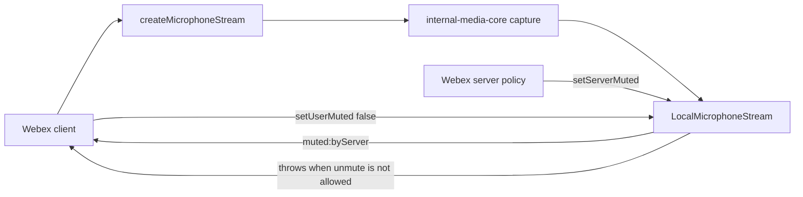

<!-- sdd-generated-metadata
doc_kind: standing-doc
generated_from: architecture@0.3.0
generated_by: claude-code
approved_by: rarajes2@cisco.com
updated_at: 2026-09-30T05:28:59Z
validation_status: pass
-->

# @webex/media-helpers architecture

Canonical repository-wide architecture. This document owns facts that span
multiple services, packages, modules, applications, or repositories. Link to
the owning service, module, feature, ADR, or native contract instead of
duplicating owner-local detail.

Related context: [specification registry](specs/README.md) ·
[repository agent instructions](../AGENTS.md)

## Applicability

Sections preceded by an `Include if` comment are conditional. Retain a
conditional section only when repository evidence satisfies its condition.
Record `Unresolved` while the evidence or developer answer is still missing;
do not infer an answer from the repository type alone.

| Condition ID                         | Status     | Evidence or reason | Owned section                       |
| ------------------------------------ | ---------- | ------------------ | ----------------------------------- |
| `repo.owns_datastore`                | N/A        | No migrations, ORM configuration, schema files, or connection strings exist under the package source tree | Repository data and schema          |
| `repo.holds_client_state`            | Applicable | `src/webrtc-core.ts` holds per-stream unmute permission and inherited user-mute state | Client state model                  |
| `repo.components_interact`           | N/A        | The package contains one module; there are no inter-resource calls or events inside it | Dependency and interaction topology |
| `repo.domain_data_across_components` | N/A        | One module, so no domain data spans resources | Object and data ownership           |
| `repo.caches_data`                   | N/A        | No cache client or in-memory cache structure in the package source tree | Caching catalog                     |
| `repo.observability_convention`      | N/A        | No logger, metrics, tracing, or audit imports in the package source tree | Observability patterns              |
| `repo.deploys_to_infra`              | N/A        | No Dockerfile, orchestration manifest, or cloud configuration; the package ships to npm | Runtime and infrastructure          |
| `repo.shared_base_libs`              | Applicable | `package.json` devDependencies resolve the shared babel, eslint, and jest legacy configs at workspace scope | Shared and base libraries           |
| `repo.is_monorepo`                   | N/A        | The onboarded scope is one package with a single `package.json`; the containing webex-js-sdk repository is the monorepo | Package map and dependencies        |
| `repo.multi_platform`                | N/A        | One build with no platform-specific source trees or cross-compile targets | Platform matrix                     |
| `repo.published_package`             | Applicable | `package.json` declares a main entry and a publish script, with no private flag | Release and versioning              |
| `repo.embedded_in_host`              | N/A        | No web-component export, plugin manifest, or host mount contract | Host integration and theming        |
| `repo.exposes_commands_or_artifacts` | Applicable | `package.json` commits the source-build and unit-test scripts that produce the stable dist artifact | Commands and generated artifacts    |
| `repo.cross_repo_deps_material`      | Applicable | `package.json` pins the upstream media-core and media-effects releases exactly; both originate outside this repository and define most of the public surface | Cross-repository topology           |
| `repo.security_arch_warranted`       | N/A        | No authentication, token, mTLS, or encryption handling in the package source tree; the server-mute rule is a behavioral invariant documented in the module spec | Security architecture               |

## Design overview

`@webex/media-helpers` is a thin adaptation layer between `@webex/internal-media-core` and the Webex
first-party clients. It exists because Webex calling and meetings need two behaviors that the
upstream media library deliberately does not provide:

1. **Server mute authority.** A Webex server can mute a participant and can forbid them from
   unmuting. The package subclasses the upstream local microphone and camera stream classes to add
   an `unmuteAllowed` gate and a `muted:byServer` event, so the client-side stream object itself
   refuses an unpermitted unmute rather than relying on every caller to check first.
2. **One media entry point.** Consumers import streams, capture factories, constraint presets, and
   media effects from a single package instead of assembling them from `@webex/internal-media-core`
   and `@webex/web-media-effects` separately.

The shape follows from those two goals. `src/webrtc-core.ts` holds the subclasses and thin factory
wrappers; `src/constants.ts` holds value presets; `src/index.ts` is a barrel that combines them with
the upstream effects surface. There is no service, store, transport, or process of its own.

Two consequences are worth stating because they are not obvious from the file layout. First, the
microphone and camera subclasses carry byte-for-byte equivalent logic rather than sharing a base
class, which the source comments in `src/webrtc-core.ts` attribute to unresolved event
typing in webrtc-core. Second, the server-mute control methods are marked `@internal` and the
monorepo root `tsconfig.json` sets `stripInternal: true`, so the package's in-repo contract is
strictly larger than its published one.

## Resource inventory and responsibilities

| Resource              | Kind    | Responsibility                                                                 | Owner                              | Source   | Detailed specification |
| --------------------- | ------- | ------------------------------------------------------------------------------ | ---------------------------------- | -------- | ---------------------- |
| `@webex/media-helpers` | package | Adapt upstream local media streams with Webex server-mute authority and expose one media entry point | `@webex/web-client`, `@webex/web-sdk` | `src/index.ts` | [`docs/README.md`](README.md) |

## Interaction and execution flows

The representative flow is a client creating a camera or microphone stream, the server later muting
it, and the client attempting to unmute.

| From                     | To                       | Interaction or transport | Purpose                                                   | Failure or compatibility behavior                                                |
| ------------------------ | ------------------------ | ------------------------ | --------------------------------------------------------- | -------------------------------------------------------------------------------- |
| Webex client             | `@webex/media-helpers`   | Package import and call  | Create streams and apply effects                           | Capture rejection propagates from the upstream factory unchanged                 |
| `@webex/media-helpers`   | `@webex/internal-media-core` | Import and delegation | Reuse capture and stream base behavior                     | Exact version pin; an upstream signature change is a compile-time break          |
| `@webex/plugin-meetings` | `@webex/media-helpers`   | Import of `@internal` API | Apply server mute state to the active stream               | Not covered by published declarations; breakage surfaces only in the monorepo build |
| `@webex/media-helpers`   | Webex client             | Typed event              | Notify the consumer that the server changed the mute state | Emitted only when the value actually changes                                     |

## Dependency topology

| Dependency                     | Type     | Used by                | Purpose                                                    | Version, failure, or fallback policy |
| ------------------------------ | -------- | ---------------------- | ----------------------------------------------------------- | ------------------------------------ |
| `@webex/internal-media-core`   | External | `src/webrtc-core.ts`   | Local and remote stream base classes and capture factories   | Pinned exactly to `2.30.1`; no fallback |
| `@webex/web-media-effects`     | External | `src/index.ts`         | Virtual background and noise reduction, re-exported unchanged | Pinned exactly to `2.37.0`; no fallback |
| `@webex/ts-events`             | External | `src/webrtc-core.ts`   | Typed event primitives used to add `muted:byServer`          | Range `^1.1.0`                        |

There are no cycles and no ordering constraints inside the package: `index.ts` depends on
`webrtc-core.ts` and `constants.ts`, and neither of those depends on the other. The single point of
failure is upstream version movement — because the package re-exports upstream symbols directly, an
upstream change to `@webex/internal-media-core` or `@webex/web-media-effects` moves this package's
public surface without any change to its own source. Exact versions live in `package.json`.

## Public and consumer surfaces

| Surface                              | Type | Owner                  | Consumers                                          | Compatibility policy                                                                 | Source              |
| ------------------------------------ | ---- | ---------------------- | -------------------------------------------------- | ------------------------------------------------------------------------------------ | ------------------- |
| `media-helpers-sdk`                  | SDK  | `@webex/media-helpers` | npm consumers, `@webex/plugin-meetings`, `packages/calling` | Published; the package README states it does not strictly follow semantic versioning | `package.json`; exact export list in `src/index.ts` |
| `media-helpers-server-mute-internal` | SDK  | `@webex/media-helpers` | `@webex/plugin-meetings` only                       | Internal; removed from published declarations by `stripInternal`, so it carries no external compatibility promise | `src/webrtc-core.ts` |

Exact definitions stay in those native sources. `.sdd/manifest.json` `contract_catalog` is the
machine-readable registry for both IDs and for the three required upstream contracts.

<!-- Include if: the repository holds client-side or in-memory session state. [condition-id: repo.holds_client_state] -->

## Client state model

| State or slice | Owner                                        | Transition triggers                              | Persistence or reset boundary                                        |
| -------------- | -------------------------------------------- | ------------------------------------------------ | -------------------------------------------------------------------- |
| `unmuteAllowed` | `_LocalMicrophoneStream`, `_LocalCameraStream` | `setUnmuteAllowed(boolean)` from the meetings layer | In-memory for the stream's lifetime; defaults to `true` and is never persisted |
| `userMuted`     | Upstream `internal-media-core` base class     | `setUserMuted(boolean)`, or `setServerMuted` when the value changes | In-memory for the stream's lifetime; not persisted |

Server-owned mute policy is not client state. The server decision arrives through `setServerMuted`
and `setUnmuteAllowed`; only its locally held effect is modelled here.

## Cross-cutting architecture

### Security

- Trust boundaries and identity flow: the package holds no credentials and performs no
  authentication. Its one policy-bearing boundary is the server-mute gate in `src/webrtc-core.ts`,
  which enforces a decision made by the Webex server rather than making one itself.
- Sensitive surfaces and data classes: live camera and microphone media. The package never buffers,
  stores, or transmits media; it passes upstream stream objects through.
- Encryption and secret boundaries: none owned here. Media transport encryption belongs to the
  calling and meetings stack.

### Observability and operations

- Logging and correlation: none. The package emits no logs or metrics, so consumer-side logging is
  the only signal.
- Metrics, traces, and audit signals: none owned here.
- Ownership and operational entry points: `@webex/web-client` and `@webex/web-sdk`, per
  `.github/CODEOWNERS` in the monorepo.

### Quality attributes

- Published footprint: the package adds two subclasses, six factory wrappers, and a constants table
  over its upstream dependencies; it should stay a thin adapter rather than accumulating media logic.
- Compatibility: the in-repo `@internal` surface must stay in step with `@webex/plugin-meetings`,
  which the published type declarations cannot enforce.
- Verification: the unit suite is the only automated gate, and it is expected to remain at full pass.

<!-- Include if: modules inherit a shared or base library stack. [condition-id: repo.shared_base_libs] -->

## Shared and base libraries

| Library                        | Inherited responsibility                       | Consumers            | Version floor | Compatibility rule                                    |
| ------------------------------ | ---------------------------------------------- | -------------------- | ------------- | ------------------------------------------------------ |
| `@webex/babel-config-legacy`   | Babel transform configuration                  | `babel.config.js`    | `workspace:*` | Tracks the monorepo; the package re-exports it verbatim |
| `@webex/eslint-config-legacy`  | Lint rules applied by `test:style`             | `package.json`       | `workspace:*` | Tracks the monorepo                                     |
| `@webex/jest-config-legacy`    | Jest environment, transform, and test matching | `jest.config.js`     | `workspace:*` | Tracks the monorepo; sets `collectCoverage: false`      |
| `@webex/legacy-tools`          | `webex-legacy-tools` build and test runner     | `package.json`       | `workspace:*` | Tracks the monorepo                                     |
| Monorepo root `tsconfig.json`  | Compiler options, including `emitDeclarationOnly` and `stripInternal` | `tsconfig.json` | — | Extended directly; `stripInternal` shapes the published surface |

<!-- Include if: the repository publishes a package or consumer artifact. [condition-id: repo.published_package] -->

## Release and versioning

| Artifact               | Publish target | Versioning rule                                                                 | Deprecation window          | Changelog or migration obligation                       |
| ---------------------- | -------------- | -------------------------------------------------------------------------------- | --------------------------- | -------------------------------------------------------- |
| `@webex/media-helpers` | npm, via `deploy:npm` in `package.json` | The package README states this is an internal Cisco Webex plugin that does not strictly adhere to semantic versioning | None stated in the repository | Release notes are produced at the monorepo root, not per package |

Because the versioning promise is explicitly weaker than semver, consumers outside the Webex
first-party clients are directed by the README to the public Webex developer APIs instead.

<!-- Include if: the repository exposes commands, generators, or stable file outputs. [condition-id: repo.exposes_commands_or_artifacts] -->

## Commands and generated artifacts

| Command or artifact | Owner                  | Inputs        | Output or side effect                                               | Compatibility boundary                                  |
| ------------------- | ---------------------- | ------------- | -------------------------------------------------------------------- | -------------------------------------------------------- |
| `build:src`         | `@webex/media-helpers` | `src/**/*.ts` | `dist/` JavaScript, source maps, and `.d.ts` declarations             | `dist/` is the published artifact and the consumer contract |
| `build`             | `@webex/media-helpers` | `src/**/*.ts` | `.d.ts` declarations only, because the root config sets `emitDeclarationOnly` | Type-only; does not produce a runnable artifact           |
| `test:unit`         | `@webex/media-helpers` | `test/unit/**` | Jest run; no artifact                                                | The behavioral gate for the module spec                   |
| `test:style`        | `@webex/media-helpers` | `src/**/*.ts` | ESLint with `--fix`, which rewrites sources in place                  | Mutates the working tree; not a read-only check           |

`dist/` is ignored by the monorepo `.gitignore` and is produced per build rather than committed.

<!-- Include if: cross-repository dependencies materially affect behavior or delivery. [condition-id: repo.cross_repo_deps_material] -->

## Cross-repository topology

| Repository or external system | Relationship | Exchanged contract or artifact                                          | Owner        | Sequencing constraint                                                        |
| ----------------------------- | ------------ | ------------------------------------------------------------------------ | ------------ | ----------------------------------------------------------------------------- |
| `@webex/internal-media-core`  | Consumes     | Stream base classes and capture factories, pinned at `2.30.1`            | Webex media  | An upstream release must be adopted here before consumers see new stream behavior |
| `@webex/web-media-effects`    | Consumes     | `NoiseReductionEffect`, `VirtualBackgroundEffect`, and their option types, pinned at `2.37.0` | Webex media | Re-exported unchanged, so an upstream change reaches consumers as soon as the pin moves |
| `@webex/ts-events`            | Consumes     | `AddEvents`, `TypedEvent`, `WithEventsDummyType`                         | Webex        | None                                                                          |

Both media dependencies are pinned to exact versions rather than ranges, so adopting an upstream
change is always a deliberate edit to `package.json` in this package.

## Domain language

| Term                | Repository-specific meaning                                                                                       | Authoritative source                       |
| ------------------- | ------------------------------------------------------------------------------------------------------------------ | ------------------------------------------ |
| Server mute         | A mute state imposed by the Webex server rather than by the local user, applied through `setServerMuted`             | `src/webrtc-core.ts`                       |
| Unmute allowed      | Whether the server currently permits the local user to unmute; when false, `setUserMuted(false)` throws              | `src/webrtc-core.ts`                       |
| `ServerMuteReason`  | Why a server mute change occurred: `remotelyMuted`, `clientRequestFailed`, or `localUnmuteRequired`                  | `src/webrtc-core.ts`                       |
| Local stream        | A capture-side stream object wrapping a browser `MediaStream`, subclassed here to add server-mute behavior           | `src/webrtc-core.ts`                       |
| Effect              | A transform applied to a stream, such as virtual background or noise reduction; re-exported, not implemented here    | `src/index.ts`                             |

## References and maintenance

- Decisions: [adr/](adr/)
- Instantiated specifications and routing: [specs/README.md](specs/README.md)
- Repository rules and patterns: [repository agent instructions](../AGENTS.md)
- Update this document in the same change that alters repository boundaries,
  resource ownership, cross-resource interaction, or cross-cutting
  architecture.
