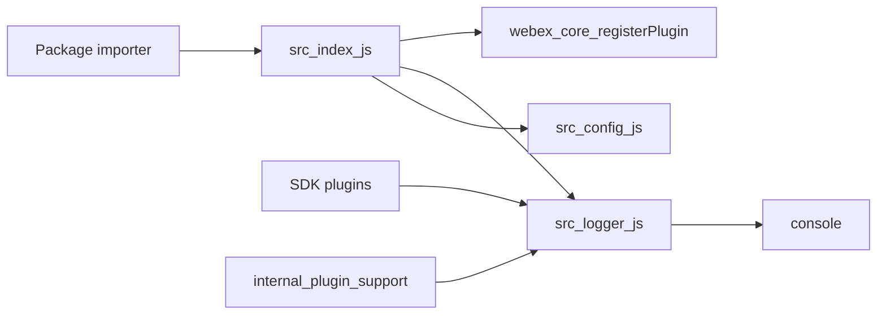
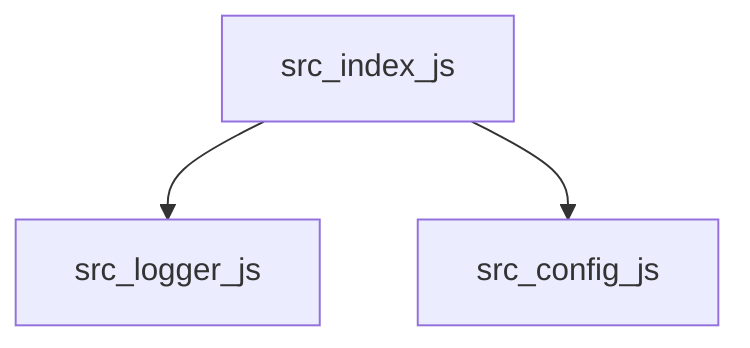

<!-- sdd-generated-metadata
doc_kind: standing-doc
generated_from: architecture@0.3.0
generated_by: claude-cowork
approved_by: akulakum@cisco.com
updated_at: 2026-10-06T09:40:00Z
validation_status: pending
-->

# @webex/plugin-logger architecture

Canonical architecture for this package. Logger behavior lives in the [module specification](../src/docs/README.md). This page owns package boundaries, the plugin registration, the published contract, and how logs leave the package.

Related context: [specification registry](specs/README.md) · [package agent instructions](../AGENTS.md)

## Applicability

| Condition ID | Status | Evidence or reason | Owned section |
| ------------ | ------ | ------------------ | ------------- |
| `repo.owns_datastore` | N/A | No database, file store, or migration in `src/` | Repository data and schema |
| `repo.holds_client_state` | Applicable | `Logger` keeps three in-memory buffers and a group counter as session state | Client state model |
| `repo.components_interact` | Applicable | `src/index.js` registers `src/logger.js` with `src/config.js` through `@webex/webex-core` | Dependency and interaction topology |
| `repo.domain_data_across_components` | N/A | One plugin owns the buffers. No shared domain record. | Object and data ownership |
| `repo.caches_data` | N/A | Buffers are bounded history, not a cache of fetched data | Caching catalog |
| `repo.observability_convention` | Applicable | This package is the SDK logging convention: levels, names, redaction, and buffered upload | Observability patterns |
| `repo.deploys_to_infra` | N/A | Library published to npm. No service runtime. | Runtime and infrastructure |
| `repo.shared_base_libs` | Applicable | `@webex/webex-core`, `@webex/common`, and `lodash` are runtime dependencies | Shared and base libraries |
| `repo.is_monorepo` | N/A | This SDD root is one package. The workspace around it is out of scope. | Package map and inter-package dependencies |
| `repo.multi_platform` | Applicable | `inBrowser` switches console output; tests run under jest (Node) and karma (browser) | Platform matrix |
| `repo.published_package` | Applicable | `package.json` `name` is `@webex/plugin-logger` and `deploy:npm` publishes it | Release and versioning |
| `repo.embedded_in_host` | N/A | No host theme or embed API | Host integration and theming |
| `repo.exposes_commands_or_artifacts` | Applicable | `build:src` writes `dist/`; `formatLogs` produces the upload text | Commands and generated artifacts |
| `repo.cross_repo_deps_material` | Applicable | Behavior depends on sibling workspace packages outside this SDD root | Cross-repository topology |
| `repo.security_arch_warranted` | Applicable | Redaction keeps tokens and personal data out of console and uploaded logs | Security architecture |

## Design overview

`@webex/plugin-logger` is a published library with one module. Importing it registers `Logger` as the `logger` child of every webex instance, replacing the minimal logger that `@webex/webex-core` registers in `src/plugins/logger.js`. Callers use `webex.logger.<level>()` for SDK logs and `webex.logger.client_<level>()` for client logs.

Each call decides printing and buffering separately, redacts a deep clone of the arguments, prints through `console`, and appends to a bounded buffer. `@webex/internal-plugin-support` later reads the buffer through `formatLogs` and uploads it.

The package does not start a server, open a network connection, or persist data.

## Resource inventory and responsibilities

| Resource | Kind | Responsibility | Owner | Source | Detailed specification |
| -------- | ---- | -------------- | ----- | ------ | ---------------------- |
| Logger plugin module | module | Levels, redaction, buffers, formatting | @webex/web-client, @webex/web-sdk | `src/` | `src/docs/README.md` |
| Published package | package | npm entry points and registration side effect | @webex/web-client, @webex/web-sdk | `package.json` | `docs/architecture.md` |

## Interaction and execution flows

| From | To | Interaction or transport | Purpose | Failure or compatibility behavior |
| ---- | -- | ------------------------ | ------- | --------------------------------- |
| Importer | `src/index.js` | package import | Side-effect registration | Without the import, `webex.logger` stays the webex-core fallback |
| `src/index.js` | `@webex/webex-core` `registerPlugin` | in-process call with `replace: true` and `config` | Install `Logger` and merge defaults | Without `replace`, registration is skipped |
| SDK plugins | `webex.logger` | synchronous method call | Write logs | Methods never throw |
| `webex.logger` | `console` | synchronous call with fallbacks | Developer output | Missing console methods fall back |
| `@webex/internal-plugin-support` | `webex.logger` | `formatLogs`, `updateLastSubmittedIndex`, `resetBufferToLastSuccessfulUpload` | Upload logs | A failed diff upload rewinds `nextIndex` when retry is configured |

## Dependency topology

Runtime dependencies declared in `package.json` and imported from `src/`:

| Dependency | Role |
| ---------- | ---- |
| `@webex/webex-core` | `WebexPlugin` base class and `registerPlugin` |
| `@webex/common` | `inBrowser` and `patterns` |
| `lodash@^4.17.21` | `cloneDeep`, `has`, `isArray`, `isObject`, `isString` |

`@webex/test-helper-chai`, `@webex/test-helper-mocha`, and `@webex/test-helper-mock-webex` are also listed under `dependencies`, but only `test/` imports them.

## Public and consumer surfaces

| Contract id | Publication | Kind | Canonical source | Owning spec |
| ----------- | ----------- | ---- | ---------------- | ----------- |
| `plugin-logger-sdk` | published | sdk | `package.json` | `src/docs/README.md` |
| `log-buffer-format` | internal | file | `src/logger.js` | `src/docs/README.md` |
| `webex-core-plugin-host` | internal | rpc | `@webex/webex-core` | external |
| `webex-common-js-api` | published | sdk | `@webex/common` | `packages/@webex/common/src/docs/README.md` |
| `lodash` | published | sdk | npm package `lodash` | external |

`plugin-logger-sdk` entry points:

- `main`: `dist/index.js`
- `devMain`: `src/index.js`
- exports: default `Logger` and named `levels`

No HTTP surface exists, so `api-specs/openapi.yaml` is omitted.

Known in-repo consumers: `packages/@webex/internal-plugin-support/src/support.js` uses `formatLogs` and both cursor methods. `packages/webex/src/webex.js`, `packages/webex-node/src/webex-node.js`, and `packages/@webex/contact-center/src/webex.js` import the package for registration.

## Client state model

| State or slice | Owner | Transition triggers | Persistence or reset boundary |
| -------------- | ----- | ------------------- | ----------------------------- |
| Log buffers (`buffer`, `sdkBuffer`, `clientBuffer`) | `Logger` | Buffered log calls; trimming at history length | In memory per webex instance. Lost on reload. |
| Upload cursors (`nextIndex`, `lastSubmitted`) | `Logger`, driven by `@webex/internal-plugin-support` | `formatLogs({diff: true})`, `updateLastSubmittedIndex`, `resetBufferToLastSuccessfulUpload` | In memory. Clamped at `0` when entries are trimmed. |
| `groupLevel` | `Logger` | Buffered `group` and `groupEnd` | In memory |

Details are in the module spec.

## Cross-cutting architecture

### Security

Redaction runs before any output. It removes keys matching `/[Aa]uthorization/`, replaces email addresses with `[REDACTED]`, and replaces MTID values. `Error` arguments are not redacted here; the source relies on `WebexHttpError` for token removal. Known redaction gaps are listed in the module spec under Pitfalls and constraints.

The package does not authenticate users, store secrets, or verify certificates.

### Observability and operations

This package is the SDK's logging layer. It emits no metrics or traces. Its own failures are reported through `console.warn` with `failed to execute Logger#<level>`.

### Quality attributes

- Compatibility: level method names, `formatLogs`, the cursor methods, and the `config.logger` keys are relied on by workspace packages.
- Bounded memory: each buffer is trimmed to its history length on write.
- Non-throwing: log methods catch internal errors.

## Dependency and interaction topology

One module. Files inside it:

`src/config.js` is not imported by `src/logger.js`. It reaches the logger as `this.config` after `registerPlugin` merges it.

## Observability patterns

| Signal | Convention or required fields | Propagation or naming rule | Primary evidence |
| ------ | ----------------------------- | -------------------------- | ---------------- |
| Logs | Buffer entry `[indent, isoTimestamp, name, ...values]`, redacted before output | SDK name `wx-js-sdk`; client name from `config.logger.clientName`, default `client` | `src/logger.js` |
| Metrics | N/A — none emitted | — | `src/logger.js` |
| Traces | N/A — `trace` is a log level, not a span | — | `src/logger.js` |
| Audit | N/A — no audited actions | — | `src/logger.js` |

## Shared and base libraries

| Library | Used for | Source |
| ------- | -------- | ------ |
| `@webex/webex-core` | `WebexPlugin`, `registerPlugin` | `package.json` dependencies |
| `@webex/common` | `inBrowser`, `patterns` | `package.json` dependencies |
| `lodash` | object helpers | `package.json` dependencies |

## Platform matrix

| Platform | Console output | Test runner |
| -------- | -------------- | ----------- |
| Node | Filtered arguments, objects as objects | jest via `test:unit` |
| Browser | Stringified arguments, objects as JSON strings | karma via `test:browser` |

`inBrowser` comes from `@webex/common` and is resolved by the bundler through that package's `browser` field.

## Release and versioning

The package is published with `yarn workspace @webex/plugin-logger deploy:npm`, which runs `yarn npm publish`. The license field is `MIT`. There is no package-local changelog; workspace release tooling owns changelog generation.

Export stability is described in the module spec.

## Commands and generated artifacts

| Command | Produces |
| ------- | -------- |
| `yarn workspace @webex/plugin-logger build` | `dist/` from `src/` via `build:src` |
| `yarn workspace @webex/plugin-logger build:src` | `dist/` with source maps |
| `yarn workspace @webex/plugin-logger test:unit` | jest result; no committed artifact |
| `yarn workspace @webex/plugin-logger test:browser` | karma result; no committed artifact |
| `yarn workspace @webex/plugin-logger test:style` | eslint result; no committed artifact |
| `yarn install` | workspace `node_modules` |
| `yarn workspace @webex/plugin-logger deploy:npm` | npm publish |

At runtime, `formatLogs()` produces the log text described under Protocol and wire format in the module spec. `dist/` is generated. Do not edit it by hand.

## Cross-repository topology

| Repository or external system | Relationship | Exchanged contract or artifact | Owner | Sequencing constraint |
| ----------------------------- | ------------ | ------------------------------ | ----- | --------------------- |
| `packages/@webex/webex-core` | Consumes | `webex-core-plugin-host` | @webex/web-client, @webex/web-sdk | webex-core must register its fallback logger first so `replace: true` can override it |
| `packages/@webex/common` | Consumes | `webex-common-js-api` | @webex/web-client, @webex/web-sdk | Changes to `patterns.containsEmails` or `containsMTID` change redaction here |
| `packages/@webex/internal-plugin-support` | Provides | `log-buffer-format` and cursor methods | @webex/web-client, @webex/web-sdk | Buffer or format changes must ship with support changes |

These are sibling workspace packages outside this package-scoped SDD root.

## Security architecture

Threat addressed: tokens and personal data written to the console or included in uploaded logs.

Controls in `src/logger.js`:

- Deep clone before redaction, so caller objects are not mutated.
- Removal of keys matching `/[Aa]uthorization/` at any depth.
- Replacement of email addresses with `[REDACTED]`.
- Replacement of `MTID=<value>` with `MTID=[REDACTED]`.
- Circular-reference guard during redaction and stringify.

Controls that are absent:

- `Error` arguments are passed through without redaction.
- Uppercase `AUTHORIZATION` keys are not removed.
- Repeated identical strings within one call are redacted only at their first occurrence.

## Domain language

| Term | Meaning |
| ---- | ------- |
| SDK log | Entry written by `<level>()`; named `wx-js-sdk` |
| Client log | Entry written by `client_<level>()`; named by `config.logger.clientName` or `client` |
| Buffer | In-memory array of entries kept for upload |
| Diff | Entries added since the last `formatLogs({diff: true})` |
| `nextIndex` | Position where the next diff starts |
| `lastSubmitted` | `nextIndex` at the last successful upload |
| Redaction | Removing or masking sensitive values before output |

## References and maintenance

- Module spec: `src/docs/README.md`
- Product readme decision: `docs/adr/0001-retain-product-readme.md`
- Owner: `@webex/web-client @webex/web-sdk` in the monorepo `.github/CODEOWNERS`
- Manifest: `.sdd/manifest.json`
