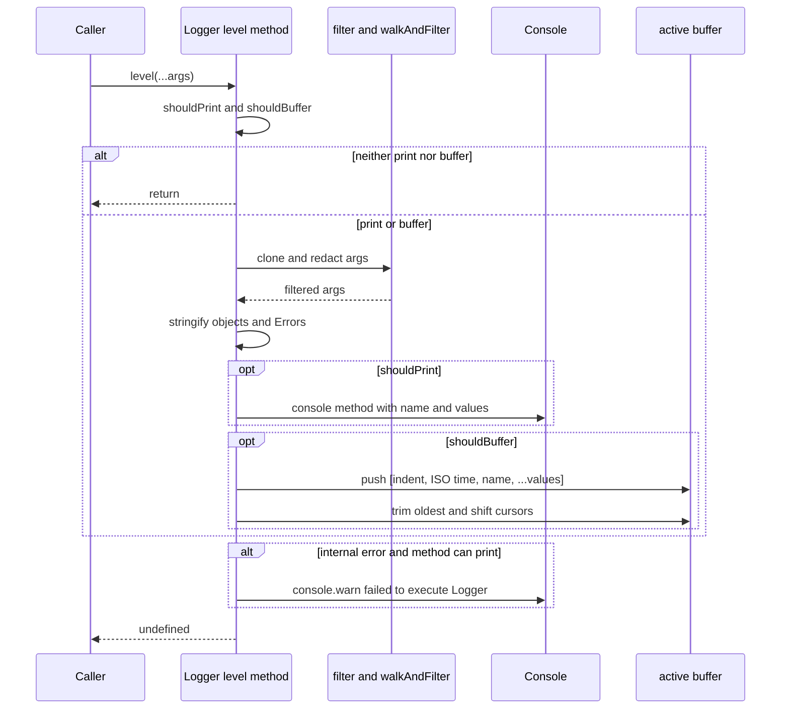
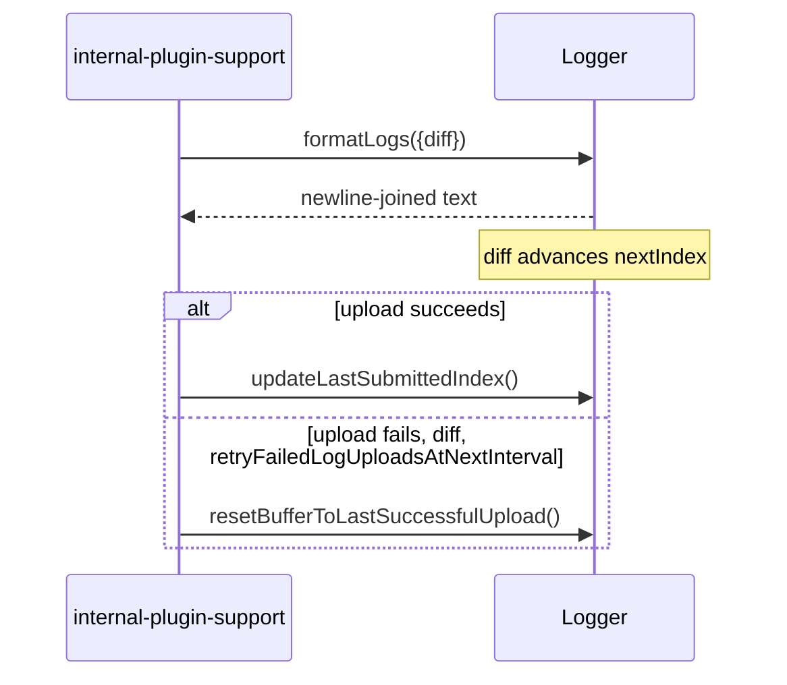
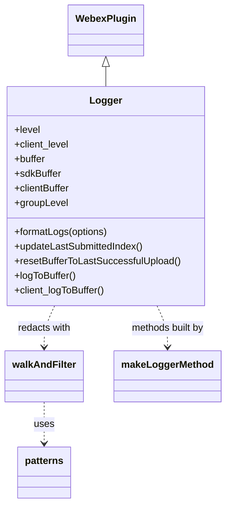

<!-- sdd-generated-metadata
doc_kind: module-spec
generated_from: module-spec@0.3.0
generated_by: claude-cowork
approved_by: akulakum@cisco.com
updated_at: 2026-10-06T09:40:00Z
validation_status: pending
-->

# Logger plugin

This source-local document at `src/docs/README.md` owns the stable specification for **the logger plugin**. Ground every claim in package evidence and link to the [package architecture](../../docs/architecture.md) instead of repeating broader facts.

Related context: [documentation index](../../docs/index.md) · [package agent instructions](../../AGENTS.md)

## Metadata

| Field             | Value |
| ----------------- | ----- |
| Owner             | @webex/web-client, @webex/web-sdk |
| Source path       | `src` |
| Resource kind     | package |
| Status            | Draft |
| Last verified     | 2026-10-06 at `94dd92abed` |
| Module id         | `plugin-logger` |
| Parent spec       | — |
| Doc kind          | Module spec |
| Coverage score    | 93.8% assessed 2026-10-06 — 15 of 16 mandatory fields PRESENT, critical 8 of 8; test strategy is WEAK because registration, the catch branch, group indentation, and known redaction gaps are untested |
| Validation status | pending |

## Applicability

| Condition ID                         | Status     | Evidence or reason | Owned section |
| ------------------------------------ | ---------- | ------------------ | ------------- |
| `module.has_tiers`                   | N/A        | No tier policy in this package | Tier |
| `module.has_ui`                      | N/A        | No view or screen. Output goes to `console` and an in-memory buffer. | UI use-case flow |
| `module.crosses_service_boundaries`  | N/A        | `src/` makes no network call. Upload is done by the sibling package internal-plugin-support. | Cross-boundary use-case flow |
| `module.holds_client_state`          | Applicable | `buffer`, `sdkBuffer`, `clientBuffer`, and `groupLevel` are session properties in `src/logger.js` | Client state model |
| `module.enforces_domain_rules`       | Applicable | Level precedence, buffer threshold, and redaction rules in `src/logger.js` | Business rules and invariants |
| `module.is_concurrent_async`         | N/A        | Every method is synchronous. No promise, timer, or event subscription in `src/`. | Concurrency and reactive flow |
| `module.owns_persistence`            | N/A        | Buffers live in memory only. Nothing is written to storage. | Data, schema, and migration discipline |
| `module.stateful_transitions`        | N/A        | Buffer cursors are covered under Client state model. There is no named state machine. | State machine |
| `module.exposes_wire_protocol`       | Applicable | `formatLogs()` output is the log text that the sibling package internal-plugin-support uploads | Protocol and wire format |
| `module.ui_multi_screen`             | N/A        | No UI | UI flow |
| `module.large_data_model`            | N/A        | One buffer record shape and seven config keys | Data model |
| `module.returns_caller_errors`       | N/A        | Log methods catch every internal error and return `undefined`. No method throws to the caller. | Caller-visible failure modes |
| `module.module_specific_conventions` | Applicable | `client_` method prefix, `wx-js-sdk` name, and redaction-before-output rules | Module-specific rules |
| `module.published_package`           | Applicable | `package.json` names the package and `deploy:npm` publishes it | Export stability |
| `module.embedded_in_host`            | N/A        | No host theme or embed API | Host integration and theming |
| `module.has_design_tradeoff`         | Applicable | `debug` and `trace` are excluded from the buffer by default; browsers print stringified values | Key design trade-off |
| `module.has_submodules`              | N/A        | Computed false by the Repo Annotation module_tree.py script. `src/config.js` is a helper file, not a child module. | Sub-modules |

## Evidence register

| Evidence | What it establishes |
| -------- | ------------------- |
| `src/index.js` | Plugin registration with `replace: true` and the public re-exports |
| `src/logger.js` | Level precedence, console fallbacks, redaction, buffering, formatting, and buffer cursors |
| `src/config.js` | Default `logger.level` and `logger.historyLength` |
| `package.json` | Name, entry points, dependencies, and scripts |
| `test/unit/spec/logger.js` | Unit cases for printing, buffering, redaction, level resolution, formatting, and cursors |
| Sibling package webex-core, file src/plugins/logger.js | Fallback logger that this plugin replaces |
| Sibling package webex-core, file src/lib/webex-core-plugin-mixin.js | `replace` and `config` handling inside `registerPlugin` |
| Sibling package common, SDD module spec src/docs/README.md | Specification of the consumed `inBrowser` and `patterns` exports |
| Sibling package internal-plugin-support, file src/support.js | Consumer of `formatLogs`, `updateLastSubmittedIndex`, and `resetBufferToLastSuccessfulUpload` |
| Product README | Retained as product documentation. Not the behavioral authority. See ADR 0001. |

## Purpose and boundary

- Responsibility: give every Webex SDK plugin a `webex.logger` with leveled console output, redaction of sensitive values, and bounded in-memory buffers that can be formatted for upload.
- Ownership: this package owns level resolution, redaction, buffering, buffer trimming, and the formatted log text. It does not own upload, transport, or log retention on a server.
- In scope: the `Logger` plugin, the `levels` export, the default config in `src/config.js`, and the registration side effect in `src/index.js`.
- Out of scope: sending logs (owned by `@webex/internal-plugin-support`), the `WebexHttpError` redaction that this module relies on for errors (owned by `@webex/webex-core`), and the regular expressions themselves (owned by `@webex/common`).
- Consumers: every package that reads `webex.logger`. Fourteen workspace packages list `@webex/plugin-logger` in `package.json`, including `webex`, `webex-node`, `@webex/webex-core` (tests), and `@webex/contact-center`.

## Structure and key files

| Path | Responsibility |
| ---- | -------------- |
| `src/index.js` | Calls `registerPlugin('logger', Logger, {config, replace: true})` and re-exports `default` and `levels` from `./logger` |
| `src/logger.js` | `Logger` plugin definition, `levels`, private `walkAndFilter`, private `makeLoggerMethod`, and generated level methods |
| `src/config.js` | Default `logger` config merged into webex config at registration |
| `test/unit/spec/logger.js` | Single unit spec, run by jest (`test:unit`) and karma (`test:browser`) |

## Public surface

Declarations live in `src/index.js` and `src/logger.js`. This section summarises them and does not restate signatures.

| Surface | Consumer | Compatibility commitment | Source |
| ------- | -------- | ------------------------ | ------ |
| default export `Logger` | `webex`, `webex-node`, and tests that build a `MockWebex` with `children: {logger: Logger}` | Constructor registered as the `logger` child plugin | `src/logger.js` |
| `levels` | tests and callers that iterate levels | `['group', 'groupEnd', 'error', 'warn', 'log', 'info', 'debug', 'trace']`. `silent` is not included. | `src/logger.js` |
| `webex.logger.<level>(...args)` for each entry in `levels` | all SDK plugins | Prints and buffers as SDK type with name `wx-js-sdk` | `src/logger.js` |
| `webex.logger.client_<level>(...args)` for each entry in `levels` | client applications | Prints and buffers as client type with name `config.clientName`, or `client` when unset | `src/logger.js` |
| `logToBuffer(...args)`, `client_logToBuffer(...args)` | callers that must buffer without printing | Never print. Always buffer. | `src/logger.js` |
| `formatLogs({diff})` | `@webex/internal-plugin-support` | Returns buffered entries joined by newlines. See Protocol and wire format. | `src/logger.js` |
| `updateLastSubmittedIndex()` | `@webex/internal-plugin-support` after a successful upload | Copies `nextIndex` to `lastSubmitted` on every active buffer | `src/logger.js` |
| `resetBufferToLastSuccessfulUpload()` | `@webex/internal-plugin-support` after a failed diff upload | Copies `lastSubmitted` back to `nextIndex` | `src/logger.js` |
| `level`, `client_level` | readers of the effective level | Derived, uncached, equal to `getCurrentLevel()` and `getCurrentClientLevel()` | `src/logger.js` |
| `config.logger` keys | SDK integrators | `level`, `clientLevel`, `bufferLogLevel`, `historyLength`, `clientHistoryLength`, `separateLogBuffers`, `clientName` | `src/logger.js`, `src/config.js` |

`filter`, `shouldPrint`, `shouldBuffer`, `getCurrentLevel`, and `getCurrentClientLevel` are prototype methods marked `@private` in JSDoc. Tests call them directly, so they are reachable but carry no compatibility promise.

Contract `plugin-logger-sdk` is published and its native artifact is `package.json`. Contract `log-buffer-format` is internal and its source is `src/logger.js`. Required contracts are `webex-core-plugin-host`, `webex-common-js-api`, and `lodash`.

## Dependencies

| Dependency | Why |
| ---------- | --- |
| `@webex/webex-core` | `WebexPlugin.extend` base, `registerPlugin`, and the optional `webex.internal.device.features.developer` toggle |
| `@webex/common` | `inBrowser` selects stringified console output; `patterns.containsEmails` and `patterns.containsMTID` drive string redaction. Specified in `packages/@webex/common/src/docs/README.md`. |
| `lodash` | `cloneDeep` before redaction; `has`, `isArray`, `isObject`, and `isString` checks |
| `console` | Output target. Missing methods fall back through `fallbacks` in `src/logger.js`. |
| `@webex/test-helper-chai`, `@webex/test-helper-mocha`, `@webex/test-helper-mock-webex` | Listed under `dependencies` and `devDependencies`, but imported only by `test/` |

## Requirements

| ID | What | Why | Evidence | Verification | Confidence |
| -- | ---- | --- | -------- | ------------ | ---------- |
| MOD-001 | Importing the package registers `Logger` as the `logger` plugin with `replace: true` and merges `src/config.js` into webex config. | `@webex/webex-core` registers a fallback logger first. Without `replace`, `registerPlugin` returns early and the fallback stays. | `src/index.js`; webex-core src/lib/webex-core-plugin-mixin.js | No direct test. Unit spec builds the plugin through `MockWebex` instead. | High |
| MOD-002 | The SDK level resolves in this order: truthy `config.level`; `WEBEX_LOG_LEVEL` when it is in `levels`; `trace` when `NODE_ENV` is `test`; the developer feature `log-level` when it is in `levels`; otherwise `error`. | Integrators and server toggles can raise verbosity without code changes. | `src/logger.js` `getCurrentLevel` | `#shouldPrint()` cases: `prefers the config specified logger.level`, `uses the WEBEX_LOG_LEVEL environment varable`, `logs at TRACE in test environments`, `checks the developer feature toggle`, `defaults to "error"` | High |
| MOD-003 | The client level is `config.clientLevel` when truthy, otherwise the SDK level. | Client apps can log at a different level from the SDK. | `src/logger.js` `getCurrentClientLevel` | `factors in log type when passed in as client` | High |
| MOD-004 | A message prints when `precedence[level] <= precedence[current level]` for its type. | One ordered scale controls output. | `src/logger.js` `shouldPrint` | `indicates whether or not the desired log should be printed` | High |
| MOD-005 | A message is buffered when `precedence[level] <= precedence[config.bufferLogLevel || 'info']`, independent of the print level. | Uploaded logs keep useful context while excluding high-volume `debug` and `trace` by default. | `src/logger.js` `shouldBuffer` | `#shouldBuffer()` cases | High |
| MOD-006 | Before output, every non-`Error` argument is deep-cloned, keys matching `/[Aa]uthorization/` are deleted, email addresses are replaced with `[REDACTED]`, and MTID values become `MTID=[REDACTED]`. | Tokens and personal data must not reach the console or the uploaded buffer. | `src/logger.js` `filter` and `walkAndFilter` | `#filter`, `removes authorization data`, `#walkAndFilter` cases | High |
| MOD-007 | `Error` arguments bypass redaction. In the buffer they become `toString()`. | The source comment states `WebexHttpError` already removes tokens. | `src/logger.js` `filter` and `makeLoggerMethod` | `buffers custom errors in a readable fashion`, `formats Errors correctly` | Medium |
| MOD-008 | Object arguments are `JSON.stringify`-ed with repeated object references dropped. A stringify failure yields `Failed to stringify: <value>`. | Buffers and browser output hold a snapshot, not a live reference. | `src/logger.js` `makeLoggerMethod` | `formats objects as strings`, `w/ circular reference`, `handle circular references` | High |
| MOD-009 | When a buffer exceeds its history length, the oldest entries are removed and `nextIndex` and `lastSubmitted` are reduced by the removed count, clamped at 0. | Memory stays bounded and diff uploads keep pointing at the same entries. | `src/logger.js` `makeLoggerMethod` | `prevents the buffer from overflowing`, `adjusts lastSubmitted when buffer overflows`, `clamps lastSubmitted to 0`, `limit` cases | High |
| MOD-010 | With `separateLogBuffers`, SDK methods write to `sdkBuffer` and `client_` methods write to `clientBuffer`. Otherwise both write to `buffer`. | Client and SDK logs can be capped separately. | `src/logger.js` `makeLoggerMethod` | `stores the specified message in the client and sdk log buffer`, `prevents the client and sdk buffer from overflowing` | High |
| MOD-011 | `formatLogs({diff: true})` returns only entries from `nextIndex` onward and advances `nextIndex`. With separate buffers, entries are merged in timestamp order and an SDK entry wins a tie. | Support uploads send only new logs per interval in time order. | `src/logger.js` `formatLogs` | `#formatLogs()` and `diff vs full logs` cases | High |
| MOD-012 | `updateLastSubmittedIndex()` sets `lastSubmitted = nextIndex`. `resetBufferToLastSuccessfulUpload()` sets `nextIndex = lastSubmitted`. Both act on the active buffer set. | A failed upload can be retried at the next interval without losing logs. | `src/logger.js`; internal-plugin-support src/support.js | `#updateLastSubmittedIndex()` and `#resetBufferToLastSuccessfulUpload()` cases | High |
| MOD-013 | `logToBuffer` and `client_logToBuffer` never print and always buffer. | Callers can record context for upload without console noise. | `src/logger.js` | `#logToBuffer()` cases | High |
| MOD-014 | A log method never throws. An internal error prints `failed to execute Logger#<level>` through `console.warn` unless the method is a never-print method. | Logging must not break the caller. | `src/logger.js` `makeLoggerMethod` | Gap: no test forces the catch branch | Medium |
| MOD-015 | When a console method is absent, the method is chosen by popping the `fallbacks` list from its end: `error` uses `log`; `warn` tries `log`, then `error`; `info` uses `log`; `debug` tries `log`, then `info`; `trace` tries `log`, `info`, then `debug`. `group` and `groupEnd` have no fallback. | Older or partial consoles still receive output. | `src/logger.js` `fallbacks` | Unit spec computes the same table to pick spies | Medium |

## Design overview

`Logger` is an Ampersand-style `WebexPlugin` with three buffer objects and a `groupLevel` counter as session state. At module load, `src/logger.js` loops over `levels` and installs two methods per level on the prototype, `<level>` and `client_<level>`, each built by `makeLoggerMethod`. Two more, `logToBuffer` and `client_logToBuffer`, are built with `neverPrint` and `alwaysBuffer` set.

Every generated method follows the same pipeline: pick the buffer and history length from config, decide print and buffer independently, redact, stringify, print, then append and trim. Config is read on each call rather than captured at construction. The source comment explains that Ampersand config is not fully initialized when the methods are bound.

The plugin keeps no timers and does no I/O. Upload, scheduling, and retries belong to `@webex/internal-plugin-support`.

## Data flow and sequence coverage

Transport is a synchronous in-process method call. There are two operation groups: writing a log entry, and reading the buffer for upload.

Write a log entry:

Read the buffer for upload (caller is `@webex/internal-plugin-support`):

## Class and component relationships

| Component | Relationship |
| --------- | ------------ |
| `Logger` | Extends `WebexPlugin` from `@webex/webex-core` |
| `makeLoggerMethod` | Module-private factory. Creates every level method and closes over `level`, `impl`, `type`, `neverPrint`, and `alwaysBuffer`. |
| `walkAndFilter` | Module-private recursive redactor used by `Logger#filter` |
| `patterns`, `inBrowser` | Imported from `@webex/common` |
| `src/config.js` | Supplied to `registerPlugin` as `options.config` |

## Use cases and flows

1. An SDK plugin calls `this.logger.info('...')`. With the default `error` level the call does not print, but the entry is buffered because `info` is within the default buffer threshold.
2. A developer sets `WEBEX_LOG_LEVEL=debug` before load or `config.logger.level = 'debug'`. `debug` now prints. It is still not buffered unless `bufferLogLevel` is `debug` or `trace`.
3. A client app sets `separateLogBuffers: true` and `clientName: 'someclient'`, then calls `client_log`. The entry goes to `clientBuffer` with name `someclient`.
4. `@webex/internal-plugin-support` calls `formatLogs({diff: true})`, uploads, and on success calls `updateLastSubmittedIndex()`. On a failed diff upload with `retryFailedLogUploadsAtNextInterval`, it calls `resetBufferToLastSuccessfulUpload()` so the next diff includes the failed span.
5. A caller logs an object with `headers.authorization`. The printed and buffered values omit that key; the caller's original object is not mutated because the logger redacts a deep clone.
6. A caller writes `logToBuffer('context')`. Nothing prints; the entry is buffered.

## Client state model

| State or slice | Owner | Initial state | Transition triggers | Reset or persistence boundary |
| -------------- | ----- | ------------- | ------------------- | ----------------------------- |
| `buffer` | `Logger` session | `{buffer: [], nextIndex: 0, lastSubmitted: 0}` | Any buffered call when `separateLogBuffers` is falsy | In memory for the plugin instance. Trimmed to `historyLength`. |
| `sdkBuffer` | `Logger` session | Same shape | Buffered SDK-type call when `separateLogBuffers` is truthy | Trimmed to `clientHistoryLength` or `historyLength` |
| `clientBuffer` | `Logger` session | Same shape | Buffered `client_` call when `separateLogBuffers` is truthy | Trimmed to `clientHistoryLength` or `historyLength` |
| `nextIndex` per buffer | `Logger` | `0` | Advanced by `formatLogs({diff: true})`; set back by `resetBufferToLastSuccessfulUpload()`; reduced by trimming | Clamped at `0` after trimming |
| `lastSubmitted` per buffer | `Logger` | `0` | Set by `updateLastSubmittedIndex()`; reduced by trimming | Clamped at `0` after trimming |
| `groupLevel` | `Logger` session | `0` | `+1` after a buffered `group`; `-1` after a buffered `groupEnd` when above `0` | Only changes when the call was buffered |

## Business rules and invariants

| ID | Invariant | WHY | Enforcement source | Test evidence |
| -- | --------- | --- | ------------------ | ------------- |
| `INV-001` | Precedence is `silent 0`, `group 1`, `groupEnd 2`, `error 3`, `warn 4`, `log 5`, `info 6`, `debug 7`, `trace 8`. | Single ordered scale for print and buffer decisions | `src/logger.js` `precedence` | `#shouldPrint()` table |
| `INV-002` | Default buffer threshold is `info`. | Keep uploaded logs focused | `src/logger.js` `shouldBuffer` | `logs info level to buffer by default`, `does not log debug level to buffer by default` |
| `INV-003` | Default fallback SDK level is `error`. | Quiet console for end users | `src/logger.js` `getCurrentLevel` | `defaults to "error" for all other users` |
| `INV-004` | Keys matching `/[Aa]uthorization/` are removed from cloned arguments at any depth. | Never emit bearer tokens | `src/logger.js` `authTokenKeyPattern` | `strips auth headers from log output`, `redact Authorization` |
| `INV-005` | SDK-type entries use the name `wx-js-sdk`. | Uploaded logs can separate SDK and client lines | `src/logger.js` `SDK_LOG_TYPE_NAME` | `removes authorization data` asserts `wx-js-sdk` |
| `INV-006` | Buffer length never exceeds the history length after a write. | Bounded memory | `src/logger.js` `makeLoggerMethod` | `prevents the buffer from overflowing` |
| `INV-007` | Default `historyLength` is `10000`. | Default retention size | `src/config.js` | Gap: the unit spec sets `historyLength` explicitly |

## Protocol and wire format

| Message or frame | Version | Producer or serializer | Consumer or parser | Compatibility and ordering rule |
| ---------------- | ------- | ---------------------- | ------------------ | ------------------------------- |
| Buffer entry | Unversioned | `src/logger.js` `makeLoggerMethod` | `src/logger.js` `formatLogs` | Array `[indent, isoTimestamp, name, ...values]`. `indent` is `'|  '` repeated `groupLevel` times. Objects are JSON strings, `Error` values are `toString()`, and other values are kept as-is. `formatLogs` reads the timestamp at index 1. |
| Formatted log text | Unversioned | `src/logger.js` `formatLogs` | internal-plugin-support src/support.js (sibling package) | Entries joined with `\n`. Each entry is converted by `Array#toString`, so fields are comma-joined. Ascending by timestamp when buffers are merged. |

Changing the entry order or the timestamp index breaks `formatLogs` merging and the unit spec, which splits lines on `,` and reads index 3.

## Module-specific rules

- Route every new log level through `levels` and `makeLoggerMethod` so the `client_` twin and redaction come with it.
- Keep `wx-js-sdk` as the SDK name. Uploaded logs and tests depend on it.
- Redact before printing and before buffering. Do not add an output path that skips `filter`.
- Read config inside the generated methods, not at construction time.
- Keep `formatLogs`, `updateLastSubmittedIndex`, and `resetBufferToLastSuccessfulUpload` in step with `@webex/internal-plugin-support`.

## Export stability

The published bindings are the default `Logger` and the named `levels` from `src/index.js`. Importing the package also has the registration side effect. Removing `replace: true` would leave the webex-core fallback logger in place, which has no buffers or `formatLogs`.

Level method names, `formatLogs`, the two cursor methods, and the seven `config.logger` keys are the behavior consumers rely on. Adding a level or config key is backward compatible. Renaming or removing one breaks callers such as `@webex/internal-plugin-support`.

## Key design trade-off

Buffering excludes `debug` and `trace` by default. The source comment says those logs are numerous and push useful information out of uploaded logs. The cost is that a support upload lacks debug detail unless the integrator sets `bufferLogLevel`.

In browsers the logger prints the stringified values instead of live objects. The source comment says a logged browser object is a live reference, so it can show later state. The cost is that browser consoles show JSON strings rather than expandable objects. Node prints the filtered objects.

## Pitfalls and constraints

- `walkAndFilter` stores primitives in its `visited` list. A string value identical to one already visited in the same call is returned without email or MTID redaction. Executing a copy of `walkAndFilter` with the `@webex/common` patterns gives `{a: '[REDACTED]', b: 'x@y.com'}` for `{a: 'x@y.com', b: 'x@y.com'}`. No unit test covers repeated strings.
- A string that contains an email has only its emails redacted. Its MTID is left in place, because the MTID branch is an `else`.
- `/[Aa]uthorization/` does not match `AUTHORIZATION`.
- `Error` arguments are not redacted. A non-`WebexHttpError` error that carries a token in its message reaches the output unchanged.
- `logToBuffer` and `client_logToBuffer` pass `levels.info`, which is `undefined` because `levels` is an array. They work because the never-print and always-buffer flags skip the level checks.
- With `separateLogBuffers`, `clientHistoryLength` caps the SDK buffer as well as the client buffer.
- `config.level` is not validated against `levels`. An unknown value makes `precedence[...]` `undefined`, so nothing prints.
- `src/config.js` reads `process.env.WEBEX_LOG_LEVEL` once at module load. Its JSDoc says `historyLength` defaults to `1000`, but the value is `10000`.
- A shorter `historyLength` takes effect on the next buffered write, not immediately.
- `test:style` runs `eslint ./src/**/*.*`. Keep this spec under `src/docs/` as Markdown only.

## Verification

| Behavior | Check | Evidence | Gap |
| -------- | ----- | -------- | --- |
| MOD-002 to MOD-005, INV-001 to INV-003 | `yarn workspace @webex/plugin-logger test:unit` | `#shouldPrint()`, `#shouldBuffer()` | Node-only cases do not run under karma |
| MOD-006, INV-004 | same | `#filter`, `#walkAndFilter`, per-level `removes authorization data` | Repeated strings, uppercase `AUTHORIZATION`, and email with MTID are untested |
| MOD-007, MOD-008 | same | `#log()` error and object formatting cases | Stringify failure branch untested |
| MOD-009, MOD-010, INV-006 | same | overflow and `limit` cases | SDK buffer capped by `clientHistoryLength` untested |
| MOD-011, MOD-012 | same | `#formatLogs()`, `#updateLastSubmittedIndex()`, `#resetBufferToLastSuccessfulUpload()` | — |
| MOD-013 | same | `#logToBuffer()` | — |
| MOD-001, MOD-014, INV-007, `group` and `groupEnd` | none | Source inspection only | No test for registration, the catch branch, default history, or group indentation |
| Browser output | `yarn workspace @webex/plugin-logger test:browser` | `browserOnly` cases | Requires a karma browser |
| Lint | `yarn workspace @webex/plugin-logger test:style` | `src/` | — |

Do not use `yarn workspace @webex/plugin-logger test`. It chains `test:integration`, which `package.json` does not define.
