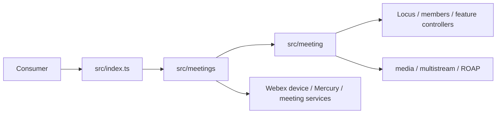

<!-- sdd-generated-metadata
doc_kind: agent-entry
generated_from: agents@0.2.2
generator_plugin: repo-annotation@1.0.5+codex.20260818094939
generated_by: codex
approved_by: repository user
updated_at: 2026-08-18T15:33:39Z
validation_status: not-run
-->
# AGENTS.md — @webex/plugin-meetings

> Read first. Next: [`ai-docs/SPEC_INDEX.md`](ai-docs/SPEC_INDEX.md) for routing and [`ai-docs/ARCHITECTURE.md`](ai-docs/ARCHITECTURE.md) for system design. Load only the affected module specifications.

## Repo Overview

`@webex/plugin-meetings` is the Webex JavaScript SDK plugin for meeting discovery, registration, lifecycle, realtime Locus state, participants, WebRTC media, and in-meeting capabilities.

**What it is:**
- A published library package registered as `webex.meetings` inside the Webex SDK host.
- A client-side coordinator over Webex device, Mercury, Locus, meeting-info, media, and feature services.

**What it is NOT:**
- It is not a UI application or a server-side datastore owner.
- It does not own remote Webex service state; its collections and models are client-side projections.

## Tech Stack

- TypeScript and JavaScript, Node.js 22.14 for this repository, Yarn workspaces, and legacy Webex build tooling.
- Mocha, Sinon, and `@webex/test-helper-chai` for unit tests; Karma for browser/integration tests; ESLint for style checks.

## Architecture



→ Full architecture: [`ai-docs/ARCHITECTURE.md`](ai-docs/ARCHITECTURE.md)

## Module / Package Structure

```text
src/meetings/              — registered plugin, discovery, registration, and meeting collection
src/meeting/               — one meeting lifecycle, media, controls, and events
src/meeting-info/          — destination resolution and meeting metadata
src/locus-info/, hashTree/ — realtime Locus normalization and incremental synchronization
src/member/, members/      — participant models, roster, mutations, and events
src/media/, multistream/, roap/, reachability/ — WebRTC setup, negotiation, routing, and probes
src/reconnection-manager/  — bounded recovery and rejoin orchestration
src/breakouts/, interpretation/, annotation/, aiEnableRequest/, webinar/ — in-meeting features
src/recording-controller/, controls-options-manager/, personal-meeting-room/, reactions/ — controls
src/interceptors/, metrics/ — request middleware and behavioral telemetry
```

→ Canonical module routing: [`ai-docs/SPEC_INDEX.md`](ai-docs/SPEC_INDEX.md)

## Critical Rules

1. Code and mirrored unit tests are the behavioral source of truth; retained legacy docs are migration inputs, not authority when they conflict.
2. Ask before coding. Present the affected contracts, plan, and test scope, then wait for approval.
3. Load the owning module spec and `ai-docs/RULES.md`; do not load every module document.
4. Preserve the `webex.meetings` registration and package exports in `src/index.ts`; public changes are semver-sensitive.
5. Route Webex HTTP calls through existing request/plugin abstractions and preserve interceptor behavior.
6. Preserve event scope, ordering, listener cleanup, and correlation identifiers across async flows.
7. Treat tokens, identities, participant data, media, transcripts, and meeting URLs as sensitive; never add them to logs.
8. Match `src/{area}/` changes with `test/unit/spec/{area}/` tests, using Sinon and `@webex/test-helper-chai` conventions.
9. Update the canonical spec in the same merge as behavior or contract changes.
10. Never commit secrets, disable quality gates, overwrite protected specs, publish, or deploy without explicit approval.

## Essential Commands

| Role | Command |
|---|---|
| Install | `yarn install` |
| Build | `yarn workspace @webex/plugin-meetings build:src` |
| Unit test | `yarn workspace @webex/plugin-meetings test:unit` |
| Targeted unit test | `yarn workspace @webex/plugin-meetings test:unit --targets meeting/brbState.ts` |
| Browser test | `yarn workspace @webex/plugin-meetings test:browser` |
| Lint | `yarn workspace @webex/plugin-meetings test:style` |

→ Toolchain and setup: [`ai-docs/GETTING_STARTED.md`](ai-docs/GETTING_STARTED.md) · test routing: [`ai-docs/TEST_INDEX.md`](ai-docs/TEST_INDEX.md)

## Common Gotchas

1. `--targets` is relative to `test/unit/spec/`; a filename alone or a repository-relative path selects the wrong target.
2. Plugin-meetings unit tests are slow. For a narrowly selected test set, temporarily add Mocha `.only`, run it, and remove every `.only` before finishing.
3. Locus full state, deltas, and hash-tree updates are alternate inputs to the same client projection; do not apply them as unrelated state.
4. Meeting media setup spans permission, local streams, ROAP, remote streams, and reconnection; cleanup is part of the contract.
5. Event constants and raw wire values coexist in this legacy package. Search both before changing a state/event condition.
6. Retained `README.md`, `UPGRADING.md`, and feature READMEs may lag current behavior; verify claims against current source and tests.

The pre-SDD package rule is retained exactly: plugin-meetings unit tests are slow, so always run only the tests you care about. To isolate a single case temporarily:

```javascript
it.only('should do something', () => {
  // test code
});
```

Always remove `.only` once you finish running the tests.

## Pre-Commit Checklist

- [ ] Node 22.14 is active and the affected package builds.
- [ ] Focused positive and negative tests pass; broader tests are run in proportion to risk.
- [ ] No `.only` remains in any test.
- [ ] Public exports, events, Locus/media behavior, cleanup, and error propagation are preserved or explicitly specified.
- [ ] The affected canonical module spec and contract indexes are updated in the same change.
- [ ] No token, credential, participant PII, raw transcript, or sensitive URL is logged.

## Prompt Overrides (`/adhoc`, `/quick`)

- `/adhoc` skips workflow scaffolding and `/quick` reduces it; neither bypasses correctness, security, test, or spec-currency rules.

## External Source Access

| Provider class | Source / host pattern | Preferred access | If unavailable |
|---|---|---|---|
| source host | `github.com/webex/webex-js-sdk` | connector, CLI, or repository checkout | Stop before relying on unavailable remote-only evidence |
| developer/API docs | `developer.webex.com`, generated SDK API site | authenticated/public browser or supplied source | Use current local code for behavior; never guess remote contracts |
| Webex services | device, Mercury, Locus, meeting and media services | configured integration/test environment | Keep unit work mocked; ask before integration claims |

Commit and PR history are excluded from this bootstrap by repository-owner decision.

## Strict Compliance Mode (automation)

Load the routed specs required by the task, apply `.sdd/manifest.json` trust state, and stop on the first unresolved protected-spec, conformance, coverage, or independent-validation gate.

---
**SDD coverage:** Per-module trust lives in `.sdd/manifest.json` and is mirrored in `ai-docs/SPEC_INDEX.md`. `Partial` specs are hints and `Untracked` modules require code cross-checking until promoted.
