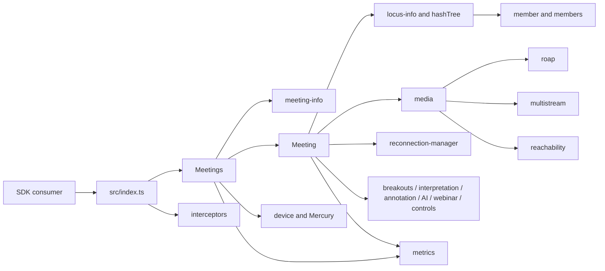
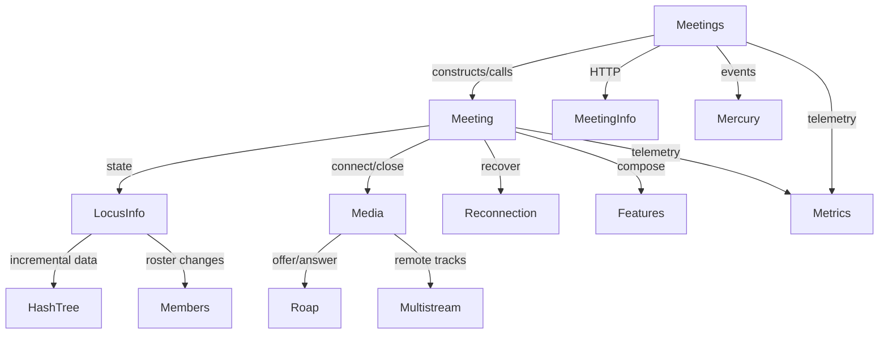

<!-- sdd-generated-metadata
doc_kind: standing-doc
generated_from: architecture@0.2.2
generator_plugin: repo-annotation@1.0.5+codex.20260818094939
generated_by: codex
approved_by: repository user
updated_at: 2026-08-18T15:33:39Z
validation_status: not-run
-->
# ARCHITECTURE — @webex/plugin-meetings

> Start here → root [`AGENTS.md`](../AGENTS.md) · router [`SPEC_INDEX.md`](SPEC_INDEX.md). This document describes package-level ownership; source-local module specs hold detailed behavior.

## Design Overview

The package is a browser-oriented library embedded in a Webex SDK instance. `src/index.ts` registers `Meetings` as `webex.meetings`, installs request interceptors, and exports the selected public types, helpers, stream factories, and errors. The registered `Meetings` plugin owns discovery, device/Mercury registration, the meeting collection, and construction of `Meeting` objects.

A `Meeting` is the central per-call coordinator. It combines normalized Locus state, members, feature controllers, local and remote media, ROAP negotiation, reachability, reconnection, requests, events, and telemetry. Capability modules remain separate so their state and server contracts can be tested independently, but they are composed by the meeting object and consume the same Webex host and Locus identity.

The package persists no datastore. It maintains in-memory client projections and caches that are refreshed by Webex HTTP responses, Mercury events, Locus full/delta/hash-tree updates, and media callbacks. This split keeps remote services authoritative while making the SDK responsive to realtime change.

## Component Inventory & Responsibilities

| Component | Responsibility | Docs |
|---|---|---|
| `src/meetings/` | Plugin registration lifecycle, discovery, and meeting collection | `src/meetings/ai-docs/meetings-spec.md` |
| `src/meeting/` | One meeting's lifecycle, controls, media, state, and events | `src/meeting/ai-docs/meeting-spec.md` |
| `src/meeting-info/` | Resolve destinations and normalize meeting metadata | `src/meeting-info/ai-docs/meeting-info-spec.md` |
| `src/locus-info/` | Convert Locus inputs into scoped client-state callbacks | `src/locus-info/ai-docs/locus-info-spec.md` |
| `src/hashTree/` | Reconcile incremental Locus datasets | `src/hashTree/ai-docs/hash-tree-spec.md` |
| `src/member/`, `src/members/` | Represent one participant and manage the roster | `src/member/ai-docs/member-spec.md`, `src/members/ai-docs/members-spec.md` |
| `src/media/`, `src/multistream/`, `src/roap/` | Construct connections, allocate streams, and negotiate SDP | `src/media/ai-docs/media-spec.md`, `src/multistream/ai-docs/multistream-spec.md`, `src/roap/ai-docs/roap-spec.md` |
| `src/reachability/`, `src/reconnection-manager/` | Probe routes and recover failed media/meetings | `src/reachability/ai-docs/reachability-spec.md`, `src/reconnection-manager/ai-docs/reconnection-manager-spec.md` |
| `src/breakouts/`, `src/interpretation/`, `src/annotation/`, `src/aiEnableRequest/`, `src/webinar/` | Feature-specific meeting workflows | owning source-local specs |
| `src/recording-controller/`, `src/controls-options-manager/`, `src/personal-meeting-room/`, `src/reactions/` | Focused meeting controls and data catalogs | owning source-local specs |
| `src/interceptors/`, `src/metrics/` | Request middleware and behavioral telemetry | owning source-local specs |

## Component Interaction

Consumers enter through the registered `webex.meetings` plugin or package exports. `Meetings` resolves a destination, creates or finds a `Meeting`, and coordinates registration and Mercury delivery. The meeting applies Locus updates, updates roster and feature projections, negotiates media through ROAP/internal-media-core, emits scoped events, and records behavioral metrics.

## Execution & Flow

1. Importing `src/index.ts` registers the plugin and three request interceptors with `@webex/webex-core`.
2. The SDK initializes `Meetings`, which builds collections/request helpers and registers device and Mercury listeners.
3. A consumer creates or receives a meeting; meeting-info resolution supplies Locus/meeting identity and a `Meeting` enters the collection.
4. Join and media operations call Webex services, apply the returned Locus state, negotiate ROAP/SDP, and publish local/remote stream readiness.
5. Mercury/Locus updates flow through `locus-info` and feature controllers; teardown removes listeners, timers, media connections, and collection entries.

Evidence: `src/index.ts`, `src/meetings/index.ts`, `src/meeting/index.ts`, `src/locus-info/index.ts`, `src/media/index.ts`.

## Dependencies

| Dependency | Type | How used | Failure / version handling |
|---|---|---|---|
| `@webex/webex-core` | workspace peer/internal | Plugin host, requests, services, interceptors, base classes | Request failures propagate through typed errors/interceptors |
| Device and Mercury plugins | workspace internal | Device identity and realtime event delivery | Registration is staged and failure-aware; teardown unregisters listeners |
| `@webex/internal-media-core` | pinned external | WebRTC media connections and multistream primitives | Media errors/timeouts are surfaced and reconnection is bounded |
| `@webex/media-helpers` | workspace internal | Public local/remote stream factories and types | Public re-exports are semver-sensitive |
| Locus/meeting/webinar/AI services | external Webex services | Meeting state and mutations | HTTP errors are not converted into success; retry only where explicitly implemented |
| `jose`, `jwt-decode` | external libraries | Data-channel token inspection/authentication | Expiry is checked; refresh retries are bounded |

### State Model

- `Meetings` owns registration state and maps meeting keys/identifiers to `Meeting` instances.
- Each `Meeting` owns its Locus projection, members, feature controllers, media connections/streams, mute/BRB/control state, and timers.
- Locus full state, delta events, and hash-tree datasets converge into the same projection; the remote Locus service remains authoritative.
- Feature modules derive state from meeting/Locus data and clear listeners and collections when the meeting is destroyed.

## Cross-Cutting Concerns

- **Security:** Webex credentials and data-channel tokens enter through the host/request layer; identity, participant data, meeting URLs, media, and transcripts are sensitive. Authorization remains enforced by remote services and capability/policy fields.
- **Observability:** modules use the shared logger proxy and metrics helpers with correlation identifiers. Behavioral and call-analyzer telemetry should describe outcomes without logging tokens or raw sensitive payloads.

## Non-Functional Posture

This is a published client library used in browsers and SDK hosts. Preserve package exports, event names/payloads, async semantics, and browser compatibility. Avoid new runtime dependencies and unbounded timers/listeners; measure performance-critical media or event-path changes rather than inventing targets.

## Dependency / Interaction Topology

| From | To | Kind | Purpose |
|---|---|---|---|
| SDK consumer | `Meetings`/`Meeting` | call/event | Create, join, control, observe, and leave meetings |
| `Meetings` | device/Mercury/meeting-info | call/event | Register and discover meetings and realtime updates |
| `Meeting` | Locus/member/feature modules | call/event | Apply remote state and expose scoped capability state |
| `Meeting` | media/ROAP/multistream | async call/event | Establish and update WebRTC media |
| media callbacks | reconnection manager | event/call | Start bounded recovery or rejoin |
| core modules | metrics | call | Submit outcome and diagnostic telemetry |

## Object / Data Ownership

| Domain object | System-of-record / owning component | Read by |
|---|---|---|
| Remote meeting/Locus state | Webex Locus service; projected by `locus-info` | `Meeting`, members, features, consumer events |
| Meeting collection and registration state | `meetings` in memory | SDK consumers and event routing |
| Per-meeting client state | `meeting` in memory | feature/media controllers and consumers |
| Participant projection | `member`/`members` from Locus | meeting, breakouts, interpretation, Voicea/transcription helpers |
| Media connection and slots | `media`/`multistream` | meeting and stream consumers |
| Feature projection | owning feature module | meeting and SDK consumer |

## Caching Catalog

| Cache | Backend | What it holds | TTL | Invalidation trigger |
|---|---|---|---|---|
| Meeting collection | in-memory collection | active `Meeting` instances by meeting identifiers | meeting lifetime | leave/destroy/unregister and collection removal |
| Meeting-info collection | in-memory collection | resolved metadata | process lifetime/explicit replacement | a refreshed response or collection lifecycle |
| Locus route token map | interceptor memory | route tokens keyed by Locus id | process lifetime | response update or interceptor lifecycle |
| Feature collections | in-memory collections | breakout, interpretation, webinar, and roster projections | meeting lifetime | Locus update or feature cleanup |

## Observability Patterns

- **Logging:** use `src/common/logs/logger-proxy.ts` and correlation-aware context; do not use console logging or record credentials, tokens, participant PII, raw transcript/media, or full sensitive URLs.
- **Metrics:** use `src/metrics/index.ts` and existing call-analyzer helpers/constants; retain established names and flatten fields predictably.
- **Audit:** privileged actions are represented by remote Locus/service mutations and their outcome metrics; the package owns no durable audit store.

## Infrastructure Matrix

| Category | In use | Notes |
|---|---|---|
| Datastores | none owned | Client projections are in memory; Webex services own persistence |
| Messaging / streaming | Mercury events, data channels, WebRTC media | Host plugins and internal-media-core provide transport |
| Cloud / platform services | Webex device, Locus, meeting-info, webinar, reachability, metrics | Accessed through Webex core request/service abstractions |

## Shared / Base Libraries

| Library | What modules inherit/use | Version floor |
|---|---|---|
| `@webex/webex-core` | plugin registration, request and service access, base plugin/interceptor classes | workspace version |
| package `src/common/` | collections, events, logging, queue, errors, browser/config helpers | package-local |
| `lodash` | guarded collection/object utilities | package manifest range |
| `@webex/internal-media-core` | WebRTC/media primitives | `2.28.2` |

## Package Map & Inter-Package Dependencies

- Workspace packages live under repository package globs; this package is the published meetings capability.
- It consumes internal device, Mercury, metrics, user, support, conversation, Voicea/LLM, people/rooms, media-helper, common, and core packages listed in `package.json`.
- Workspace dependencies use `workspace:*`; external pinned/ranged dependencies follow the root release process. The package must not introduce cycles through reverse imports.

## Release & Versioning

- `@webex/plugin-meetings` builds to `dist/index.js` with declarations under `dist/types` and publishes through the repository npm release workflow.
- Treat exports in `src/index.ts`, consumer-visible class methods, events, types, and error shapes as semver-sensitive. Deprecate before removal and update consumer docs/specs and changelog material in the same release change.

## Host Integration & Theming

- The host imports the package, after which `registerPlugin('meetings', Meetings, ...)` mounts `webex.meetings` and request interceptors.
- The host must provide initialized core/device/Mercury/request services and browser media capabilities. This package has no theming or UI-provider contract.

## Cross-Repo Dependency Graph

- **Internal:** Webex SDK workspace packages provide core hosting, identity/device, Mercury, metrics, media helpers, people/rooms, support, Voicea, and LLM integration.
- **Cross-project:** published `@webex/*` and media packages exchange TypeScript/JavaScript APIs and event/request payloads.
- **External read-only:** developer/API documentation and sample application are consumer references, not behavior truth for this bootstrap.
- **External services:** Webex Locus, meeting-info, device, webinar, AI approval, reachability, and telemetry services.

## Security Architecture

The application/SDK host owns authentication and supplies credentialed request access. Interceptors attach or refresh route/data-channel tokens at request boundaries; modules use remote capability and policy fields before privileged actions. TLS/WebRTC transports are supplied by the browser and Webex infrastructure. The package keeps only in-memory projections and must redact identity, tokens, participant data, transcript/media content, and sensitive meeting URLs from diagnostics.

## Architecture Reference Links

| Reference | Location | When to read |
|---|---|---|
| Migration decision | `adr/0001-migrate-existing-docs-into-sdd.md` | Why legacy docs are retained while canonical specs are generated |
| Repo patterns | `patterns/` | Before adding requests, event emitters, constants, or tests |
| Enforceable rules | `RULES.md` and `rules/` | Before any code or contract change |

## WS6 References

No repository-local WS6/platform architecture artifact was found or supplied. Current local code and tests remain the package-level evidence source.
