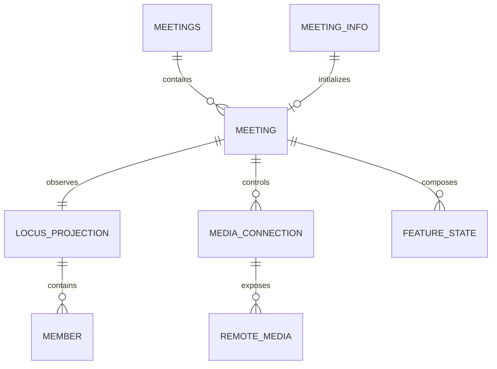

<!-- sdd-generated-metadata
doc_kind: standing-doc
generated_from: data-model@0.2.2
generator_plugin: repo-annotation@1.0.5+codex.20260818094939
generated_by: codex
approved_by: repository user
updated_at: 2026-08-18T15:33:39Z
validation_status: not-run
-->
# DATA MODEL — @webex/plugin-meetings

> The package owns client-side projections only. Remote Webex services remain authoritative.

## Entity Catalog

| Entity | Client owner | Source / lifecycle |
|---|---|---|
| meeting collection | `src/meetings/` | created from discovery/incoming events; removed on teardown |
| meeting | `src/meeting/` | one active/planned call; identity and state derive from meeting-info/Locus |
| meeting info | `src/meeting-info/` | normalized destination lookup response |
| Locus projection | `src/locus-info/`, `src/hashTree/` | full/delta/dataset updates from Locus |
| participant/member roster | `src/member/`, `src/members/` | normalized Locus participants and controls |
| media connection/streams/slots | `src/media/`, `src/multistream/`, `src/roap/` | browser and media-core lifecycle |
| feature state | owning feature controller | derived from Locus/service/data-channel updates |
| route/data-channel token cache | `src/interceptors/` | in-memory request middleware state |

## Relationships

## Ownership & Access Rules

- `Meetings` is the only package component that adds/removes top-level meeting instances.
- `LocusInfo`/hash-tree parsing updates the shared remote-state projection; feature controllers consume derived values rather than inventing server state.
- `Members` owns roster collection mutation and constructs `Member` projections.
- Media modules own media-core connection and stream/slot objects; consumers observe them through meeting/public media surfaces.
- Remote mutations always go through existing request/controller methods so identity, routing, interceptors, and errors remain consistent.

## Caching

All caches are process-local and bounded by SDK, plugin, or meeting lifetime. Meeting and feature teardown invalidates associated collections, listeners, timers, tokens, and media references. No durable cache or migration mechanism exists in this package.

## Migration Discipline

There is no database schema. Changes to public TypeScript shapes, event payloads, constants/wire values, and normalized Locus/member/media projections are contract migrations: make additive changes when possible, update parsers and tests together, and document consumer transitions before removals.

## Sensitive Data

- Treat credentials, route/data-channel tokens, meeting URLs/passwords, device identity, participant identity, transcripts, captions, media, and diagnostic payloads as sensitive.
- Do not restore participant email as a convenience field; consumer documentation directs identity lookup through the People API.
- Keep sensitive projections in memory only for their operational lifetime and exclude them from logs/metric tags.

## Maintenance

Update this document when entity ownership, cache lifetime, or sensitive-data handling changes. Field-level details belong in source types and owning module specs.
