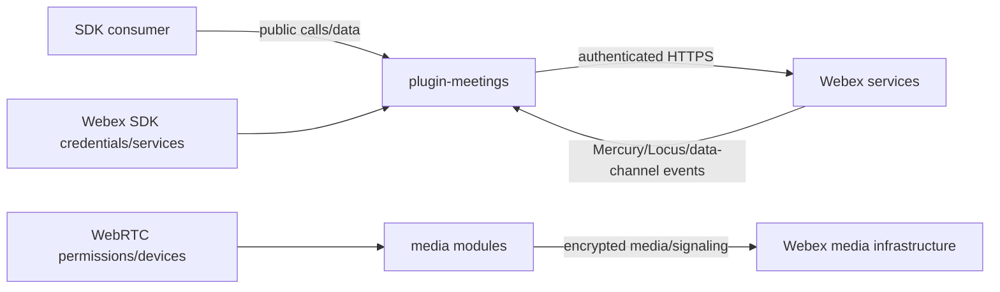

<!-- sdd-generated-metadata
doc_kind: standing-doc
generated_from: security@0.2.2
generator_plugin: repo-annotation@1.0.5+codex.20260818094939
generated_by: codex
approved_by: repository user
updated_at: 2026-08-18T15:33:39Z
validation_status: not-run
-->
# SECURITY — @webex/plugin-meetings

## Trust Boundaries

Consumer input, remote service/event payloads, browser media, and host credentials cross distinct trust boundaries. Validate and normalize at existing request/parser/controller boundaries.

## Authentication & Authorization Model

- The Webex SDK host owns user credentials and authenticated request access; this package must not mint or persist primary credentials.
- Device and participant identity, Locus route tokens, and data-channel auth tokens are attached/refreshed through existing host and interceptor paths.
- Privileged actions such as host controls, breakout management, recording, interpretation, webinar, and AI approval depend on current capability/role/policy state plus server enforcement.

## Secret & Credential Handling

- Never commit `.env` values, test-user credentials, access/refresh tokens, JWTs, route tokens, data-channel tokens, meeting passwords, or Sauce Labs secrets.
- Do not log raw authorization headers or token bodies. Token-expiry inspection is limited to middleware behavior in `src/interceptors/`.
- Use synthetic fixtures in tests and managed configuration for browser/integration runs.

## Data Classification & Handling

| Data | Classification | Handling |
|---|---|---|
| credentials/tokens/passwords | secret | memory only; redact from logs, errors, metrics, and docs |
| participant/device identity and meeting URLs | sensitive | minimum needed lifetime; do not expand public exposure |
| transcript/captions, reactions, annotation, media | sensitive content | process only for enabled feature; never emit raw content as telemetry |
| state/capability/quality metrics | operational | use bounded fields/tags; exclude content and identifiers unless existing policy permits |

Participant email removal documented in `README.md` is a privacy constraint; use participant identity and the People API rather than reintroducing email into roster projections.

## Input Validation & Output Encoding Posture

- Locus/full/delta/hash-tree, service responses, data-channel messages, SDP, and consumer options are external input. Reuse current parsers, typed constants, guards, and error paths.
- Preserve URL/request construction helpers and do not interpolate untrusted values into logs or markup.
- This package renders no UI/HTML; host applications remain responsible for encoding displayed names, transcript, chat, annotation, and error content.

## Transport & Headers

- Webex core performs authenticated HTTPS requests; browser/media-core handles WebRTC signaling/media transport.
- `LocusRouteTokenInterceptor` and `DataChannelAuthTokenInterceptor` own their headers. Do not attach those tokens outside the intended request hosts/routes.
- Retry middleware must remain bounded and honor terminal authentication/authorization failures.

## Session & Cookie Posture

The package owns no browser cookie or server session store. Its operational session is the in-memory SDK/meeting lifecycle. Teardown must remove listeners, timers, token references, media objects, and feature state.

## Known Sensitive Areas & Accepted Risks

- Realtime diagnostic payloads can contain participant/meeting details; log summaries, not payloads.
- Captions/transcripts and AI/interpretation workflows handle user content and require feature/policy gates.
- Media permissions and device access are browser-user decisions; do not bypass prompts or retain streams after teardown.
- No additional package-specific accepted security risk was supplied during bootstrap.

## Reporting & Review

Security-sensitive changes require explicit approval, focused negative tests, and review of `src/interceptors/`, request boundaries, capability gates, logs/metrics, and cleanup. Follow the repository security-reporting process; do not publish findings automatically.
