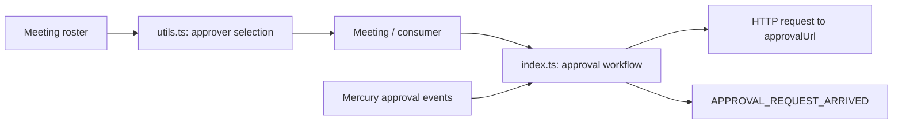
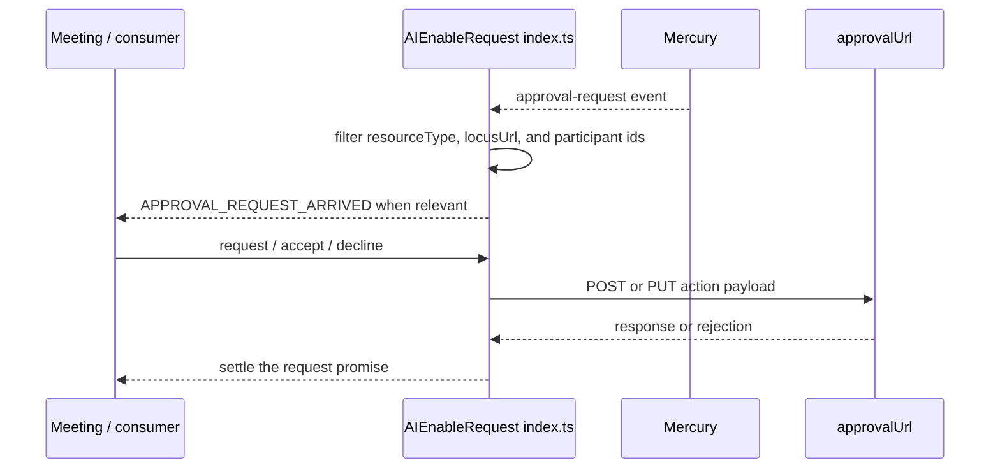
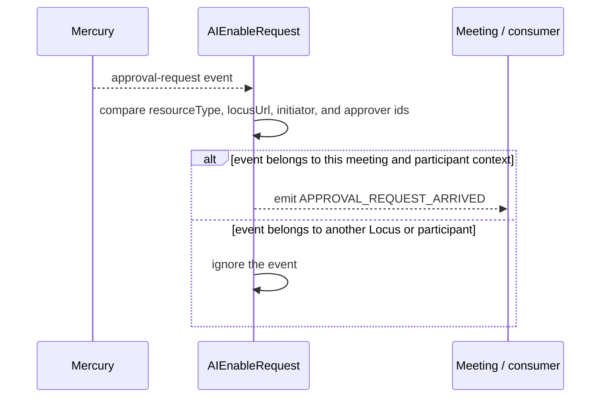
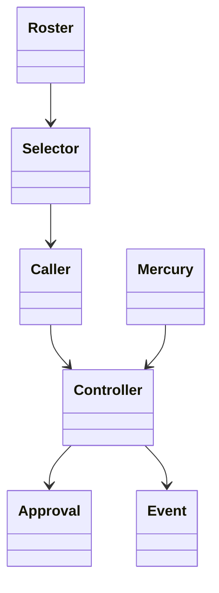

<!-- sdd-generated-metadata
doc_kind: module-spec
generated_from: module-spec@0.2.2
generator_plugin: repo-annotation@1.0.5+codex.20260818094939
generated_by: codex
approved_by: repository user
updated_at: 2026-08-22T15:21:29Z
validation_status: pass-with-warnings
-->
# AI ENABLE REQUEST — SPEC

> Start here → root [`AGENTS.md`](../../../AGENTS.md) · router [`SPEC_INDEX.md`](../../../ai-docs/SPEC_INDEX.md) · system [`ARCHITECTURE.md`](../../../ai-docs/ARCHITECTURE.md). This is the canonical source-local spec for `src/aiEnableRequest/`.

## Metadata

| Field | Value |
|---|---|
| Module id | `aiEnableRequest` |
| Source path(s) | `src/aiEnableRequest/` |
| Parent spec | — |
| Doc kind | Module spec |
| Coverage score | 93% assessed 2026-08-22; 13/14 mandatory fields present; all critical and Important fields present; one noncritical polish gap remains; pending independent validation of the participant-role repair |
| Generated from | `module-spec` @ SDLC template library `0.2.2` |
| generated_by / approved_by / updated_at | codex / repository user / 2026-08-22T15:21:29Z |
| Validation status | pass-with-warnings |

## Evidence Rules

Requirements cite current source and mirrored tests. Current code wins over retained prose when they conflict; commit and PR history are excluded. Missing evidence stays a gap.

## Source Material Register

| Source material | Scope | Decision | Detail location or disposition |
|---|---|---|---|
| Retained AI Assistant enable-request guide | overview / API / behavior / tests | used and verified; event catalog, initiator/approver operations, and example workflow were moved into requirements, sequence, state, and use cases |
| Current source and mirrored tests | implementation / tests | verified | requirements, flows, failures, and test strategy below |

## Overview

`src/aiEnableRequest/` contains 3 direct source/reference file(s) and has 2 mirrored unit-test file(s). This spec separates its public operations, runtime data movement, component ownership, state applicability, and verification boundary.

## Purpose / Responsibility

Owns the meeting-scoped approval workflow used when a participant requests host approval to enable AI Assistant.

## Stack

TypeScript/JavaScript in the Node 22.14 Yarn workspace; Webex core/plugin abstractions and Mocha/Sinon/`@webex/test-helper-chai` tests.

## Folder / Package Structure

```text
src/aiEnableRequest/
├── README.md — retained legacy reference input
├── index.ts — module facade/controller or primary exports
├── utils.ts — normalization/helper functions
└── ai-docs/ai-enable-request-spec.md — canonical module specification
```

## Key Files (source of truth)

| File | Holds |
|---|---|
| `src/aiEnableRequest/README.md` | retained legacy reference input |
| `src/aiEnableRequest/index.ts` | module facade/controller or primary exports |
| `src/aiEnableRequest/utils.ts` | normalization/helper functions |
| `test/unit/spec/aiEnableRequest/index.ts` and 1 sibling test file(s) | mirrored characterization/unit coverage |

## Public Surface

| Contract ID | Type | Surface | Purpose | Compatibility / deprecation | Schema / detail link | Root index |
|---|---|---|---|---|---|---|
| `aiEnableRequest.1` | SDK / in-process | `approvalUrlUpdate()`, `locusUrlUpdate()`, and `selfParticipantIdUpdate()` | Keep the listener and outgoing approval actions scoped to the current meeting participant and URLs. | Preserve setter names and the one-listener side effect of `selfParticipantIdUpdate()`. | `src/aiEnableRequest/index.ts` | [CONTRACTS](../../../ai-docs/CONTRACTS.md) |
| `aiEnableRequest.2` | SDK / event | `listenToApprovalRequests()` and `APPROVAL_REQUEST_ARRIVED` | Filter Mercury approval events by resource, Locus, and participant role before exposing them to Meeting. | Preserve the once-only registration guard and `DECLINED_ALL` observer behavior. | `src/aiEnableRequest/index.ts` | [CONTRACTS](../../../ai-docs/CONTRACTS.md) |
| `aiEnableRequest.3` | SDK / remote | `requestEnableAIAssistant()` and `sendApprovalRequest()` | POST a `REQUESTED` action using the current approval URL and self participant as initiator. | Preserve HTTP verb, body roles, action value, and returned request promise. | `src/aiEnableRequest/index.ts` | [CONTRACTS](../../../ai-docs/CONTRACTS.md) |
| `aiEnableRequest.4` | SDK / remote | `acceptEnableAIAssistantRequest()`, `declineEnableAIAssistantRequest()`, and `declineAllEnableAIAssistantRequests()` | PUT the approver decision to the URL supplied by the incoming approval event. | Preserve all three action values and participant-id placement in the request body. | `src/aiEnableRequest/index.ts` | [CONTRACTS](../../../ai-docs/CONTRACTS.md) |
| `aiEnableRequest.5` | exported utility | `getAIEnablementApprover()` | Select the capable moderator, otherwise the lexicographically first capable cohost, or `null`. | The current utility does not exclude the requesting/self participant. | `src/aiEnableRequest/utils.ts` | [CONTRACTS](../../../ai-docs/CONTRACTS.md) |

Compatibility notes:
- Prefer additive fields/options and preserve current rejection/event/cleanup semantics. Internal helpers are not public merely because they are exported within the source directory.

## Requires (dependencies)

Meeting self/host/cohost identity and policy, Locus/approval URLs, request access, Mercury/approval events, and scoped event utilities.

## Requirements

| ID | WHAT | WHY | Source Evidence | Test / Example Evidence | Assumptions / Gaps | Confidence |
|---|---|---|---|---|---|---|
| `AI-ENABLE-REQUEST-R-001` | select the eligible AI-enablement approver. | Owns the meeting-scoped approval workflow used when a participant requests host approval to enable AI Assistant. | `src/aiEnableRequest/utils.ts` | `test/unit/spec/aiEnableRequest/utils.ts` | none | PRESENT |
| `AI-ENABLE-REQUEST-R-002` | request AI Assistant enablement approval. | The exact initiator/approver roles and action value determine which participant can respond to the enablement request. | `src/aiEnableRequest/index.ts`, `src/aiEnableRequest/utils.ts` | `test/unit/spec/aiEnableRequest/index.ts` | requester/self exclusion is not implemented by `getAIEnablementApprover`; retain as an explicit product-policy gap | PRESENT |
| `AI-ENABLE-REQUEST-R-003` | HTTP rejections propagate through the returned promise, while unrelated Mercury approval events are ignored and the single listener is installed only once. | The listener must not emit another meeting’s approval or multiply registrations, while callers still need the original HTTP failure. | `src/aiEnableRequest/` | `test/unit/spec/aiEnableRequest/index.ts` | none | PRESENT |

## Design Overview

AIEnableRequest owns one Mercury approval listener and the HTTP writes to the current Locus approval URL. `utils.ts` only selects an eligible approver from roster data; it is not a transport.

## Data Flow



## Sequence Diagram(s)

Sequence coverage:

| Operation group | Diagram | Failure coverage |
|---|---|---|
| UC-1…UC-4 — AI approval operation groups | AI approval primary sequence | Mercury filtering, missing context, and HTTP action rejection |
| UC-1…UC-4 — AI approval alternate/failure paths | AI approval alternate/failure sequence | missing approval URL/participant context, HTTP rejection, or a Mercury event for another Locus |

### AI approval primary sequence



### AI approval alternate/failure sequence



## Class / Component Relationships



The arrows identify ownership and delegation inside `src/aiEnableRequest/`; files that only declare types or constants are not presented as transports.

## Use Cases

- **UC-1:** Select a capable moderator or the lexicographically first capable cohost with `getAIEnablementApprover`; return `null` when neither exists. Evidence: `src/aiEnableRequest/utils.ts`.
- **UC-2:** On the first `selfParticipantIdUpdate()`, call `listenToApprovalRequests()` and retain the one-listener guard for later identity updates. Evidence: `src/aiEnableRequest/index.ts`.
- **UC-3:** Filter Mercury approval events to the current Locus and expose only requests relevant to the self initiator, self approver, or all observers of `DECLINED_ALL`. Evidence: `src/aiEnableRequest/index.ts`.
- **UC-4:** POST an enablement request, then PUT accept, decline, or decline-all decisions using the exact initiator/approver ids required by each action. Evidence: `src/aiEnableRequest/index.ts`.

## State Model

Approval and Locus URLs, self participant id, listener registrations, and active request context are meeting scoped.

## Business Rules & Invariants

- The selector prefers a capable moderator and otherwise the lexicographically first capable cohost; it does not exclude self/requester. Initiator and approver ids are preserved, and decision actions target the supplied approval request URL. Enforced under `src/aiEnableRequest/`.

## Concurrency & Reactive Flow

- Mercury approval events are filtered against the controller's current Locus, self participant, initiator, and approver ids before emission. `selfParticipantIdUpdate()` calls `listenToApprovalRequests()` only while `hasSubscribedToEvents` is false, so later participant updates refresh matching context without registering a duplicate listener.

## Error Handling & Failure Modes

| Condition | Signal | Caller recovery |
|---|---|---|
| An approval action request rejects | The promise returned by `request`, `accept`, `decline`, or `declineAll` rejects with the HTTP failure. | Correct the request context or retry under the caller's policy. |
| A Mercury approval event targets another Locus or participant context | The listener ignores it and emits no `APPROVAL_REQUEST_ARRIVED` event. | No caller action; wait for a matching event. |
| An eligible approver is found | `getAIEnablementApprover` returns a capable moderator or the sorted-first capable cohost; it does not exclude self/requester. | Apply any requester-exclusion policy outside this utility if the product requires it. |

## Pitfalls

- The approver is derived from current meeting roster/roles. Caching it across host/cohost changes can send a request to an ineligible participant.
- Verify both typed constants/enums and raw wire values before changing a logical condition in this legacy package.

## Module Do's / Don'ts

- DO preserve this boundary: select a capable moderator or sorted-first capable cohost with `getAIEnablementApprover`; do not document requester exclusion unless code adds it.
- DON'T move remote I/O or lifecycle ownership into a passive type, constant, catalog, or normalization file.

## Test-Case Strategy (module)

Use the current mirrored suites: `test/unit/spec/aiEnableRequest/index.ts`, `test/unit/spec/aiEnableRequest/utils.ts`. Characterize the aiEnableRequest-specific use cases above and each listed failure condition; add cleanup or transition cases only for resources and state this module actually owns.

| Behavior / Requirement | Existing test evidence | Gap |
|---|---|---|
| `AI-ENABLE-REQUEST-R-001` | `test/unit/spec/aiEnableRequest/utils.ts` | cover moderator, sorted cohost, no candidate, and self/requester candidate selection |
| `AI-ENABLE-REQUEST-R-002` | `test/unit/spec/aiEnableRequest/index.ts` | add an explicit assertion that each decision method preserves its PUT action and participant roles on request rejection |
| `AI-ENABLE-REQUEST-R-003` | `test/unit/spec/aiEnableRequest/index.ts` | cover a second `selfParticipantIdUpdate()` and prove it does not install another Mercury listener |

## Traceability

- Repo architecture: [`ARCHITECTURE.md`](../../../ai-docs/ARCHITECTURE.md) · Registry: [`SPEC_INDEX.md`](../../../ai-docs/SPEC_INDEX.md)
- Coverage state and contracts baseline: `../../../.sdd/manifest.json`
