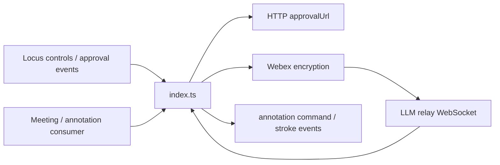
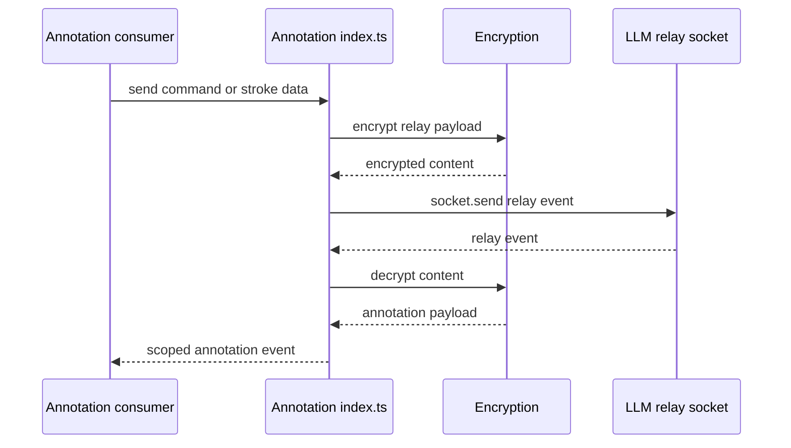
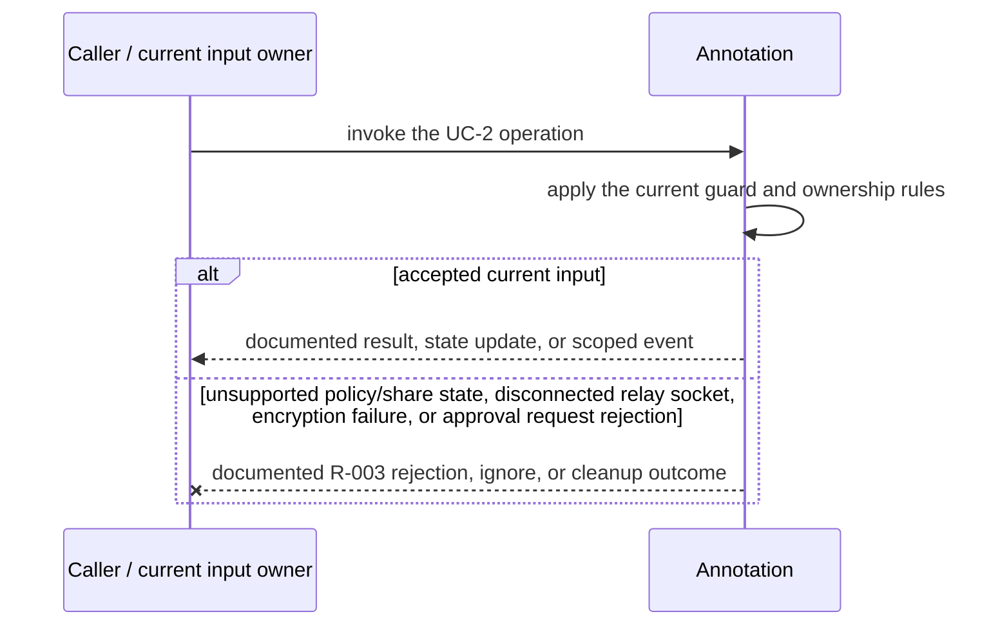
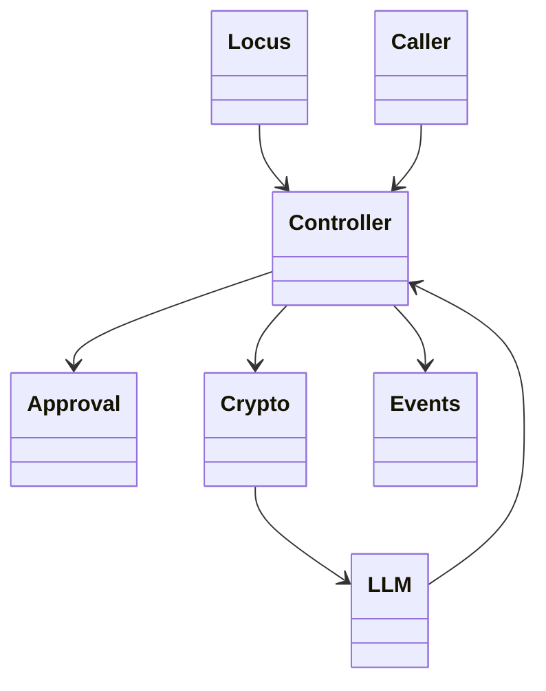
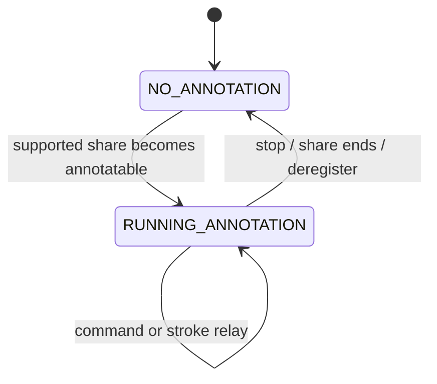

<!-- sdd-generated-metadata
doc_kind: module-spec
generated_from: module-spec@0.2.2
generator_plugin: repo-annotation@1.0.5+codex.20260818094939
generated_by: codex
approved_by: repository user
updated_at: 2026-08-21T06:10:05Z
validation_status: not-run
-->
# ANNOTATION — SPEC

> Start here → root [`AGENTS.md`](../../../AGENTS.md) · router [`SPEC_INDEX.md`](../../../ai-docs/SPEC_INDEX.md) · system [`ARCHITECTURE.md`](../../../ai-docs/ARCHITECTURE.md). This is the canonical source-local spec for `src/annotation/`.

## Metadata

| Field | Value |
|---|---|
| Module id | `annotation` |
| Source path(s) | `src/annotation/` |
| Parent spec | — |
| Doc kind | Module spec |
| Coverage score | 86% assessed 2026-08-21; 12/14 mandatory fields present; all critical fields present; one Important outcome-detail gap and one polish gap remain |
| Generated from | `module-spec` @ SDLC template library `0.2.2` |
| generated_by / approved_by / updated_at | codex / repository user / 2026-08-21T06:10:05Z |
| Validation status | not-run |

## Evidence Rules

Requirements cite current source and mirrored tests. Current code wins over retained prose when they conflict; commit and PR history are excluded. Missing evidence stays a gap.

## Source Material Register

| Source material | Scope | Decision | Detail location or disposition |
|---|---|---|---|
| No routed legacy module spec | overview / API / behavior / tests | none; generated from current annotation controller/types/constants and tests |
| Current source and mirrored tests | implementation / tests | verified | requirements, flows, failures, and test strategy below |

## Overview

`src/annotation/` contains 3 direct source/reference file(s) and has 1 mirrored unit-test file(s). This spec separates its public operations, runtime data movement, component ownership, state applicability, and verification boundary.

## Purpose / Responsibility

Owns annotation capability state and the meeting data-channel commands/events used to start, stop, clear, and relay shared-content annotations.

## Stack

TypeScript/JavaScript in the Node 22.14 Yarn workspace; Webex core/plugin abstractions and Mocha/Sinon/`@webex/test-helper-chai` tests.

## Folder / Package Structure

```text
src/annotation/
├── annotation.types.ts — module type declarations
├── constants.ts — module constants and wire values
├── index.ts — module facade/controller or primary exports
└── ai-docs/annotation-spec.md — canonical module specification
```

## Key Files (source of truth)

| File | Holds |
|---|---|
| `src/annotation/annotation.types.ts` | module type declarations |
| `src/annotation/constants.ts` | module constants and wire values |
| `src/annotation/index.ts` | module facade/controller or primary exports |
| `test/unit/spec/annotation/index.ts` | mirrored characterization/unit coverage |

## Public Surface

| Contract ID | Type | Surface | Purpose | Compatibility / deprecation | Schema / detail link | Root index |
|---|---|---|---|---|---|---|
| `annotation.1` | SDK / in-process / remote | derive annotation availability and role policy | Focused operation group owned by this module | Preserve methods/events/wire values reachable from package objects | `src/annotation/index.ts` | [CONTRACTS](../../../ai-docs/CONTRACTS.md) |
| `annotation.2` | SDK / in-process / remote | send typed annotation commands over the meeting channel | Focused operation group owned by this module | Preserve methods/events/wire values reachable from package objects | `src/annotation/index.ts` | [CONTRACTS](../../../ai-docs/CONTRACTS.md) |
| `annotation.3` | SDK / in-process / remote | receive and normalize annotation relay events | Focused operation group owned by this module | Preserve methods/events/wire values reachable from package objects | `src/annotation/index.ts` | [CONTRACTS](../../../ai-docs/CONTRACTS.md) |

Compatibility notes:
- Prefer additive fields/options and preserve current rejection/event/cleanup semantics. Internal helpers are not public merely because they are exported within the source directory.

## Requires (dependencies)

Meeting/Locus policy and sharing state, data channel, annotation constants/types, event scope, and participant identity.

## Requirements

| ID | WHAT | WHY | Source Evidence | Test / Example Evidence | Assumptions / Gaps | Confidence |
|---|---|---|---|---|---|---|
| `ANNOTATION-R-001` | derive annotation availability and role policy. | Owns annotation capability state and the meeting data-channel commands/events used to start, stop, clear, and relay shared-content annotations. | `src/annotation/index.ts` | `test/unit/spec/annotation/index.ts` | none | PRESENT |
| `ANNOTATION-R-002` | send typed annotation commands over the meeting channel. | Consumers need deterministic behavior across meeting and remote updates. | `src/annotation/index.ts`, `src/annotation/annotation.types.ts` | `test/unit/spec/annotation/index.ts` | inspect sibling tests for operation-specific cases | PRESENT |
| `ANNOTATION-R-003` | Approval and encryption failures reject their promises; disconnected LLM sends are skipped, and deregistration removes the Mercury and LLM callbacks installed by the controller. | Callers must receive the actual module failure outcome without false cleanup or event guarantees. | `src/annotation/` | `test/unit/spec/annotation/index.ts` | none | PRESENT |

## Design Overview

The controller derives annotation policy from Locus, subscribes directly to Mercury and LLM relay events, performs approval HTTP operations, and encrypts/decrypts relay content before exposing typed annotation events.

## Data Flow



## Sequence Diagram(s)

Sequence coverage:

| Operation group | Diagram | Failure coverage |
|---|---|---|
| UC-1 — primary operation | Primary operation sequence | accepted and rejected dependency outcomes |
| UC-2 — secondary/change operation | Secondary operation and failure sequence | unsupported policy/share state, disconnected relay socket, encryption failure, or approval request rejection |

### Primary operation sequence



### Secondary operation and failure sequence



## Class / Component Relationships



The arrows identify ownership and delegation inside `src/annotation/`; files that only declare types or constants are not presented as transports.

## Use Cases

- **UC-1:** Register Mercury and LLM relay listeners when annotation becomes active, and remove those exact listeners when deregistered. Evidence: `src/annotation/`.
- **UC-2:** Send approval actions to `approvalUrl` and relay encrypted commands/strokes only while the LLM channel is connected. Evidence: `src/annotation/`.

## State Model

Current annotation status, channel/listener state, sharing resource context, policy, and active participant information are meeting scoped.

## Business Rules & Invariants

- Annotation actions require an active supported share, allowed policy/role, and valid channel; command and relay types use declared wire constants. Enforced under `src/annotation/`.

## Concurrency & Reactive Flow

- Async work owned by `Annotation` may complete after a newer caller or remote input. Preserve the identity, sequence, and resource-owner guards in `src/annotation/`; a late completion must not replay UC-2 for superseded state.

## State Machine



The diagram uses `NO_ANNOTATION` and `RUNNING_ANNOTATION` from `src/annotation/constants.ts`.

## Protocol / Wire Format

- Existing request/event/channel types and constants under `src/annotation/` own serialization and parsing. Preserve field names, enum/raw values, identity/routing fields, and compatibility; normalized client properties are not a replacement wire schema.

## Error Handling & Failure Modes

| Condition | Signal | Caller recovery |
|---|---|---|
| unsupported policy/share state, disconnected relay socket, encryption failure, or approval request rejection | Follow the concrete rejection, ignore, state, or cleanup behavior in the module's R-003 requirement. | Resolve the named condition; retry only when another requirement defines a bound. |
| UC-1 succeeds | Return, update, callback, or scoped event identified by the Public Surface and primary sequence. | Continue from the owning module's accepted state. |

## Pitfalls

- Annotation availability depends on both share resource state and policy. Enabling from only one signal exposes controls that the server will reject.
- Verify both typed constants/enums and raw wire values before changing a logical condition in this legacy package.

## Test-Case Strategy (module)

Use the current mirrored suites: `test/unit/spec/annotation/index.ts`. Characterize the two code-grounded use cases above and the listed failure condition; add cleanup or transition cases only for resources and state this module actually owns.

| Behavior / Requirement | Existing test evidence | Gap |
|---|---|---|
| `ANNOTATION-R-001` | `test/unit/spec/annotation/index.ts` | inspect sibling tests for full operation matrix |
| `ANNOTATION-R-002` | `test/unit/spec/annotation/index.ts` | verify the operation-specific invalid-input and rejection branches |
| `ANNOTATION-R-003` | `test/unit/spec/annotation/index.ts` | verify the concrete R-003 rejection, ignore, or cleanup outcome |

## Traceability

- Repo architecture: [`ARCHITECTURE.md`](../../../ai-docs/ARCHITECTURE.md) · Registry: [`SPEC_INDEX.md`](../../../ai-docs/SPEC_INDEX.md)
- Coverage state and contracts baseline: `../../../.sdd/manifest.json`
