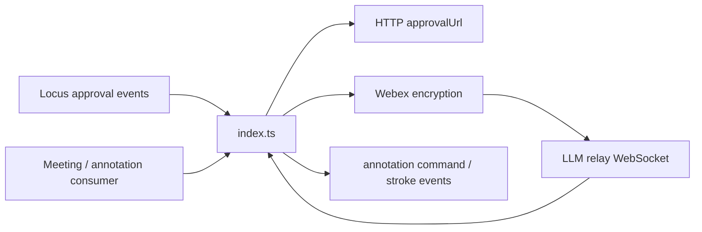
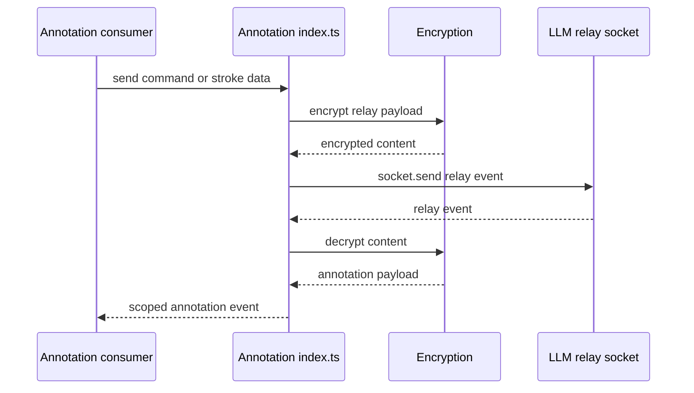
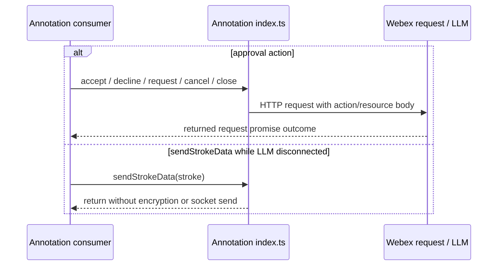
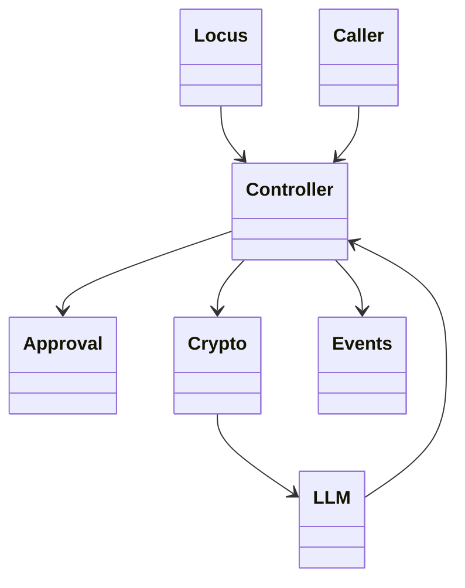

<!-- sdd-generated-metadata
doc_kind: module-spec
generated_from: module-spec@0.2.2
generator_plugin: repo-annotation@1.0.5+codex.20260818094939
generated_by: codex
approved_by: repository user
updated_at: 2026-08-22T15:21:29Z
validation_status: pass-with-warnings
-->
# ANNOTATION — SPEC

> Start here → root [`AGENTS.md`](../../../AGENTS.md) · router [`SPEC_INDEX.md`](../../../ai-docs/SPEC_INDEX.md) · system [`ARCHITECTURE.md`](../../../ai-docs/ARCHITECTURE.md). This is the canonical source-local spec for `src/annotation/`.

## Metadata

| Field | Value |
|---|---|
| Module id | `annotation` |
| Source path(s) | `src/annotation/` |
| Parent spec | — |
| Doc kind | Module spec |
| Coverage score | 93% assessed 2026-08-22; 13/14 mandatory fields present; all critical and Important fields present; one noncritical polish gap remains; pending independent validation of the participant-role repair |
| Generated from | `module-spec` @ SDLC template library `0.2.2` |
| generated_by / approved_by / updated_at | codex / repository user / 2026-08-22T15:21:29Z |
| Validation status | pass-with-warnings |

## Evidence Rules

Requirements cite current source and mirrored tests. Current code wins over retained prose when they conflict; commit and PR history are excluded. Missing evidence stays a gap.

## Source Material Register

| Source material | Scope | Decision | Detail location or disposition |
|---|---|---|---|
| No routed legacy module spec | overview / API / behavior / tests | none; generated from current annotation controller/types/constants and tests |
| Current source and mirrored tests | implementation / tests | verified | requirements, flows, failures, and test strategy below |

## Overview

`src/annotation/` contains 3 direct source/reference file(s) and has 1 mirrored unit-test file(s). This spec separates its public operations, runtime data movement, component ownership, state applicability, and verification boundary.

## Purpose / Responsibility

Owns annotation approval requests, Mercury/LLM listener registration, encrypted stroke relay, and the emitted annotation command/stroke events.

## Stack

TypeScript/JavaScript in the Node 22.14 Yarn workspace; Webex core/plugin abstractions and Mocha/Sinon/`@webex/test-helper-chai` tests.

## Folder / Package Structure

```text
src/annotation/
├── annotation.types.ts — module type declarations
├── constants.ts — module constants and wire values
├── index.ts — module facade/controller or primary exports
└── ai-docs/annotation-spec.md — canonical module specification
```

## Key Files (source of truth)

| File | Holds |
|---|---|
| `src/annotation/annotation.types.ts` | module type declarations |
| `src/annotation/constants.ts` | module constants and wire values |
| `src/annotation/index.ts` | module facade/controller or primary exports |
| `test/unit/spec/annotation/index.ts` | mirrored characterization/unit coverage |

## Public Surface

| Contract ID | Type | Surface | Purpose | Compatibility / deprecation | Schema / detail link | Root index |
|---|---|---|---|---|---|---|
| `annotation.1` | SDK / lifecycle | `locusUrlUpdate()`, `approvalUrlUpdate()`, and `deregisterEvents()` | Store Locus/approval URLs, install listeners from `locusUrlUpdate()`, and remove the exact Mercury/LLM listeners on teardown. | `approvalUrlUpdate()` only assigns `approvalUrl`; preserve the once-only listener guard owned by `locusUrlUpdate()` and the three event topics. | `src/annotation/index.ts` | [CONTRACTS](../../../ai-docs/CONTRACTS.md) |
| `annotation.2` | SDK / remote | `approveAnnotation()`, `cancelApproveAnnotation()`, and `closeAnnotation()` | POST requested/closed share-annotation actions or PUT cancellation using the current approval context. | Preserve action/resource values, share instance id, and optional receiver routing. | `src/annotation/index.ts` | [CONTRACTS](../../../ai-docs/CONTRACTS.md) |
| `annotation.3` | SDK / remote | `acceptRequest()` and `declineRequest()` | PUT a presenter decision to the URL carried by an incoming approval. | Preserve the accepted/declined action values and direct request-promise result. | `src/annotation/index.ts` | [CONTRACTS](../../../ai-docs/CONTRACTS.md) |
| `annotation.4` | SDK / relay | `sendStrokeData()` and `ANNOTATION_STROKE_DATA` | Encrypt outbound stroke content, publish it on the selected LLM socket, decrypt inbound content, and emit the scoped stroke event. | Preserve sequence increments, relay/message fields, and the initial disconnected no-op. | `src/annotation/index.ts`, `src/annotation/constants.ts` | [CONTRACTS](../../../ai-docs/CONTRACTS.md) |
| `annotation.5` | exported constants/types | `EVENT_TRIGGERS`, `ANNOTATION_RESOURCE_TYPE`, `ANNOTATION_RELAY_TYPES`, `ANNOTATION_STATUS`, `ANNOTATION_POLICY`, `ANNOTATION_REQUEST_TYPE`, `ANNOTATION_ACTION_TYPE`, `ANNOTATION`, `StrokeData`, `RequestData`, `CommandRequestBody`, `IAnnotationChannel`, and `AnnotationInfo` | Share the exact approval and relay vocabulary used by Meeting, Webinar, and consumers. | Add fields compatibly; existing raw action, relay, resource, and event values are wire-sensitive. | `src/annotation/constants.ts`, `src/annotation/annotation.types.ts` | [CONTRACTS](../../../ai-docs/CONTRACTS.md) |

### Emitted events

Current source emits or forwards these observable literals for this operation boundary. Preserve literal values, scope, payload shape, and emission timing; a constant name alone is not a substitute for the consumer-visible value.

| Event literal | Constant / expression | Emission evidence |
|---|---|---|
| `annotation:command` | `EVENT_TRIGGERS.ANNOTATION_COMMAND` | `src/annotation/index.ts` |
| `annotation:strokeData` | `EVENT_TRIGGERS.ANNOTATION_STROKE_DATA` | `src/annotation/index.ts` |
| `meeting:updateAnnotationInfo` | `EVENT_TRIGGERS.MEETING_UPDATE_ANNOTATION_INFO` | `src/meeting/index.ts` |

Compatibility notes:
- Prefer additive fields/options and preserve current rejection/event/cleanup semantics. Internal helpers are not public merely because they are exported within the source directory.

## Requires (dependencies)

Approval and Locus URLs, Mercury, LLM sockets/bindings, Webex encryption, annotation constants/types, and participant/device/share identity supplied by callers.

## Requirements

| ID | WHAT | WHY | Source Evidence | Test / Example Evidence | Assumptions / Gaps | Confidence |
|---|---|---|---|---|---|---|
| `ANNOTATION-R-001` | `locusUrlUpdate()` assigns `locusUrl` and registers the Mercury approval listener plus default/practice-session LLM relay listeners once; `approvalUrlUpdate()` only assigns `approvalUrl`; `deregisterEvents()` removes the callbacks and clears the subscription flag. | Duplicate subscriptions would emit the same annotation event more than once, while attributing registration to the approval URL setter invents a side effect. | `src/annotation/index.ts` | `test/unit/spec/annotation/index.ts` | none | PRESENT |
| `ANNOTATION-R-002` | Approval methods send the declared action/resource body to the supplied approval URL; stroke sends encrypt content, choose the connected practice-session socket or default socket, and increment `seqNum` after publication. | Approval routing and relay sequence fields are service-visible protocol values and must remain stable. | `src/annotation/index.ts`, `src/annotation/annotation.types.ts` | `test/unit/spec/annotation/index.ts` | late socket selection after encryption and rejected encryption/decryption promises need explicit race/error coverage | PRESENT |
| `ANNOTATION-R-003` | Approval methods return their request promises; disconnected stroke sends return without work; stroke encryption/decryption uses asynchronous callbacks without a returned caller promise or module retry; deregistration removes the installed Mercury/LLM callbacks. | Callers must not assume encryption failures are converted into approval-style promise rejections or that disconnected strokes are queued. | `src/annotation/` | `test/unit/spec/annotation/index.ts` | none | PRESENT |

## Design Overview

The controller subscribes directly to Mercury approval and LLM relay events, performs approval HTTP operations, and encrypts/decrypts relay content before exposing annotation command/stroke events.

## Data Flow



## Sequence Diagram(s)

Sequence coverage:

| Operation group | Diagram | Failure coverage |
|---|---|---|
| UC-1…UC-4 — annotation approval and relay operation groups | Annotation approval and relay primary sequence | approval HTTP rejection, disconnected relay skip, and asynchronous encryption/decryption failure |
| UC-2 — approval and disconnected-send behavior | Annotation approval and relay alternate/failure sequence | request rejection or initial LLM connectivity false |

### Annotation approval and relay primary sequence



### Annotation approval and relay alternate/failure sequence



## Class / Component Relationships



The arrows identify ownership and delegation inside `src/annotation/`; files that only declare types or constants are not presented as transports.

## Use Cases

- **UC-1:** Register the approval and default/practice-session relay listeners once when `locusUrlUpdate()` establishes context; update `approvalUrl` independently without registering listeners, then remove installed listeners with `deregisterEvents()`. Evidence: `src/annotation/index.ts`.
- **UC-2:** Request, cancel, or close annotation for a share instance, optionally routing the request to a specific participant/device. Evidence: `src/annotation/index.ts`.
- **UC-3:** Accept or decline a presenter approval request by PUTting the exact action to the event-provided URL. Evidence: `src/annotation/index.ts`.
- **UC-4:** Skip a stroke while LLM is disconnected; otherwise encrypt, select the current practice/default socket after encryption, publish with the next sequence, then decrypt and emit received stroke data. Evidence: `src/annotation/index.ts`.

## State Model

The controller stores `seqNum`, `hasSubscribedToEvents`, `approvalUrl`, `locusUrl`, and `deviceUrl`. `seqNum` starts at 1 and increments after each published stroke; `hasSubscribedToEvents` only records whether this controller installed its Mercury/LLM callbacks. The module does not transition between `NO_ANNOTATION` and `RUNNING_ANNOTATION`; those constants are not consumed by current source or tests.

## Business Rules & Invariants

- Approval calls use their supplied approval URL and declared action/resource values. Stroke publication is skipped only when the initial LLM connectivity check is false; relay types and sequence fields use the declared wire values. Enforced under `src/annotation/`.

## Concurrency & Reactive Flow

- Stroke encryption completes asynchronously. `sendStrokeData` checks LLM connectivity before encryption, while `publishEncrypted` selects the current practice-session/default socket when encryption resolves; the controller has no cancellation or supersession guard.

## Protocol / Wire Format

- `index.ts` constructs approval bodies and LLM `publishRequest` envelopes from the request/event/channel types and constants under `src/annotation/`. Preserve action/resource/relay values, receiver and route fields, sequence fields, and encryption metadata.

## Error Handling & Failure Modes

| Condition | Signal | Caller recovery |
|---|---|---|
| Approval request rejects | The approval method's returned promise rejects with the request failure. | Correct the URL/body or retry under the caller's policy. |
| LLM is disconnected at the initial stroke-send check | `sendStrokeData` returns `undefined` without encryption or socket send. | Reinvoke only after connectivity is restored. |
| Stroke encrypt/decrypt rejects | The controller installs no catch and `sendStrokeData` returns no promise, so the failure is not converted into a caller-facing annotation result. | Observe the owning encryption/runtime failure path; do not assume a module retry. |

## Pitfalls

- `ANNOTATION_STATUS.NO_ANNOTATION` and `RUNNING_ANNOTATION` are declarations only; do not treat them as a live controller lifecycle without a consuming transition path.
- Verify both typed constants/enums and raw wire values before changing a logical condition in this legacy package.

## Test-Case Strategy (module)

Use the current mirrored suites: `test/unit/spec/annotation/index.ts`. Characterize the annotation-specific use cases above and each listed failure condition; add cleanup or transition cases only for resources and state this module actually owns.

| Behavior / Requirement | Existing test evidence | Gap |
|---|---|---|
| `ANNOTATION-R-001` | `test/unit/spec/annotation/index.ts` | cover every owned Mercury/LLM topic and action/event payload |
| `ANNOTATION-R-002` | `test/unit/spec/annotation/index.ts` | cover receiver-present and receiver-absent bodies for requested/canceled/closed actions |
| `ANNOTATION-R-003` | `test/unit/spec/annotation/index.ts` | assert deregistration removes all three owned listeners and a disconnected stroke performs no encryption or send |

## Traceability

- Repo architecture: [`ARCHITECTURE.md`](../../../ai-docs/ARCHITECTURE.md) · Registry: [`SPEC_INDEX.md`](../../../ai-docs/SPEC_INDEX.md)
- Coverage state and contracts baseline: `../../../.sdd/manifest.json`
