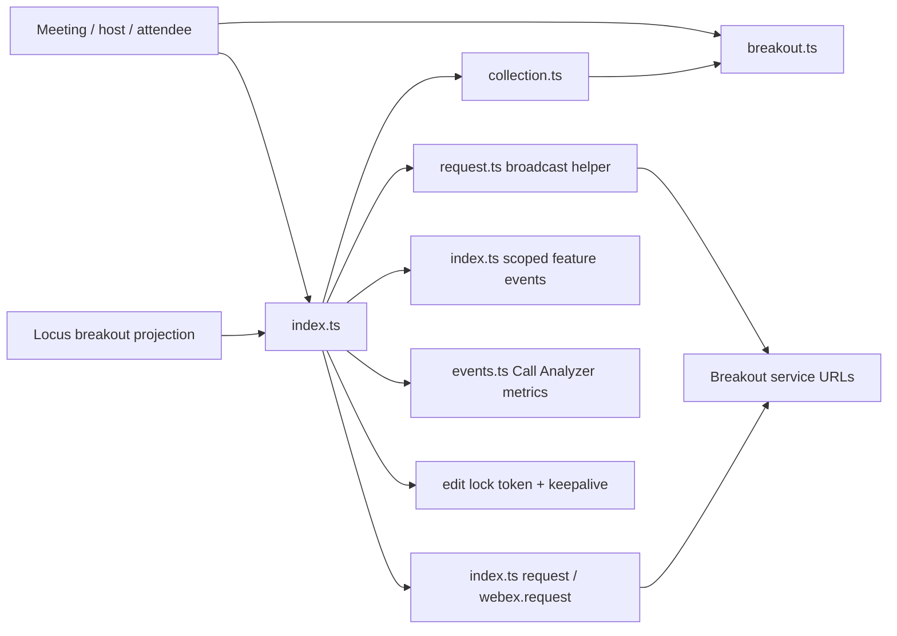
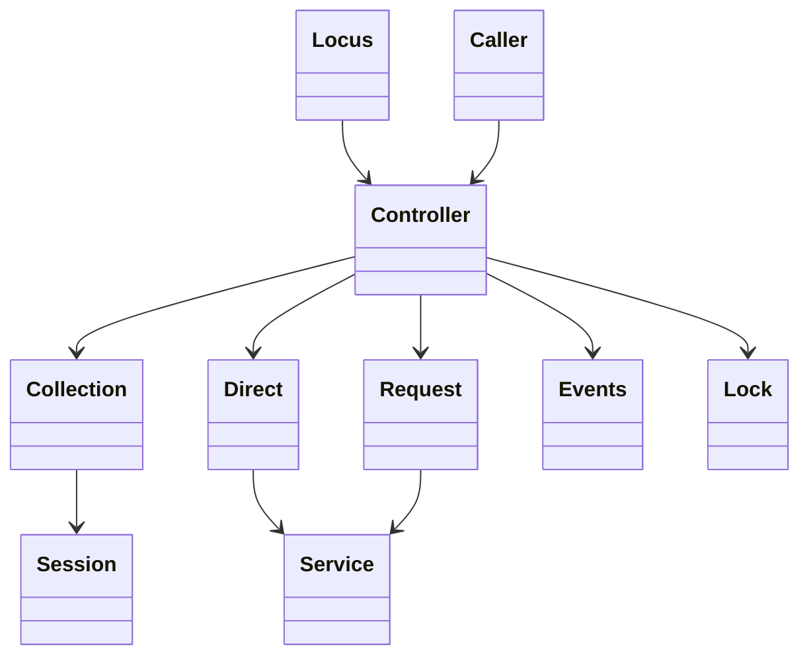
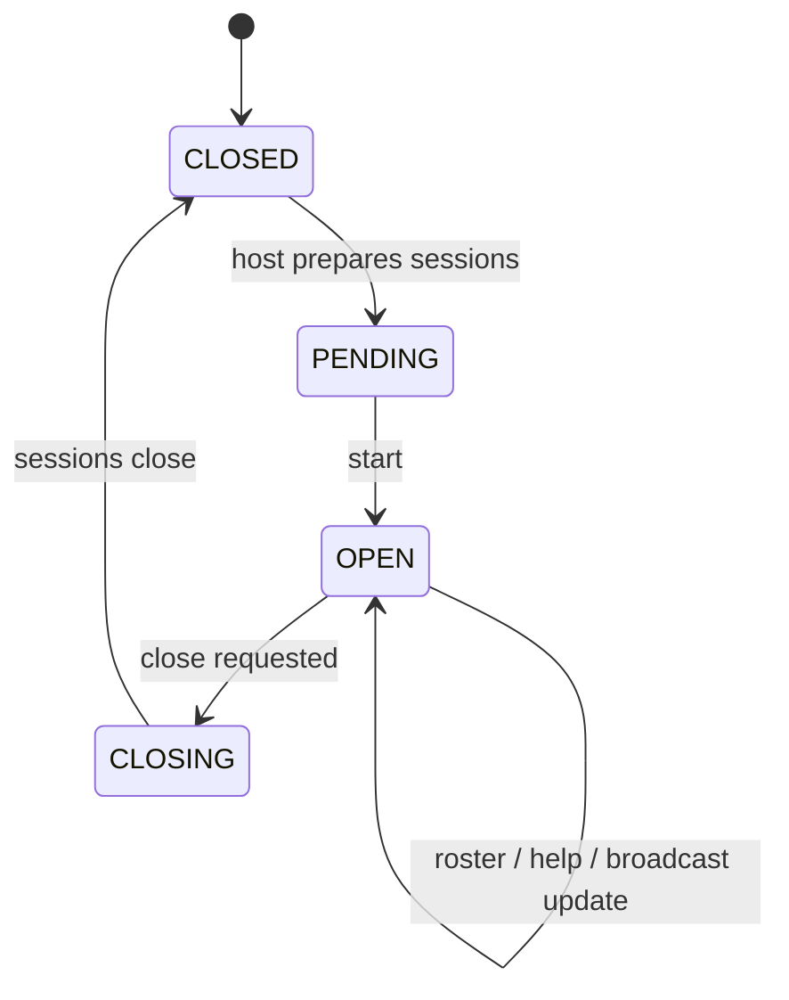

<!-- sdd-generated-metadata
doc_kind: module-spec
generated_from: module-spec@0.2.2
generator_plugin: repo-annotation@1.0.5+codex.20260818094939
generated_by: codex
approved_by: repository user
updated_at: 2026-08-22T15:21:29Z
validation_status: pass-with-warnings
-->
# BREAKOUTS — SPEC

> Start here → root [`AGENTS.md`](../../../AGENTS.md) · router [`SPEC_INDEX.md`](../../../ai-docs/SPEC_INDEX.md) · system [`ARCHITECTURE.md`](../../../ai-docs/ARCHITECTURE.md). This is the canonical source-local spec for `src/breakouts/`.

## Metadata

| Field | Value |
|---|---|
| Module id | `breakouts` |
| Source path(s) | `src/breakouts/` |
| Parent spec | — |
| Doc kind | Module spec |
| Coverage score | 93% assessed 2026-08-22; 13/14 mandatory fields present; all critical and Important fields present; one noncritical polish gap remains; pending independent validation of the participant-role repair |
| Generated from | `module-spec` @ SDLC template library `0.2.2` |
| generated_by / approved_by / updated_at | codex / repository user / 2026-08-22T15:21:29Z |
| Validation status | not-run |

## Evidence Rules

Requirements cite current source and mirrored tests. Current code wins over retained prose when they conflict; commit and PR history are excluded. Missing evidence stays a gap.

## Source Material Register

| Source material | Scope | Decision | Detail location or disposition |
|---|---|---|---|
| Retained breakout feature guide | overview / API / behavior / tests | used and corrected; attendee/events structure was preserved, while stale host-API claims were replaced with current implemented operations and evidence |
| Current source and mirrored tests | implementation / tests | verified | requirements, flows, failures, and test strategy below |

## Overview

`src/breakouts/` contains 8 direct source/reference file(s) and has 7 mirrored unit-test file(s). This spec separates its public operations, runtime data movement, component ownership, state applicability, and verification boundary.

## Purpose / Responsibility

Owns breakout-session projections, participant and host workflows, roster/broadcast/help events, edit-lock lifecycle, and server mutations.

## Stack

TypeScript/JavaScript in the Node 22.14 Yarn workspace; Webex core/plugin abstractions and Mocha/Sinon/`@webex/test-helper-chai` tests.

## Folder / Package Structure

```text
src/breakouts/
├── README.md — retained legacy reference input
├── breakout.ts — breakout implementation responsibility
├── collection.ts — module-owned collection
├── edit-lock-error.ts — module-specific error type
├── events.ts — breakout Call Analyzer metric helper
├── index.ts — module facade/controller or primary exports
├── request.ts — broadcast-specific request helper
├── utils.ts — normalization/helper functions
└── ai-docs/breakouts-spec.md — canonical module specification
```

## Key Files (source of truth)

| File | Holds |
|---|---|
| `src/breakouts/README.md` | retained legacy reference input |
| `src/breakouts/breakout.ts` | breakout implementation responsibility |
| `src/breakouts/collection.ts` | module-owned collection |
| `src/breakouts/edit-lock-error.ts` | module-specific error type |
| `src/breakouts/events.ts` | `breakoutEvent` Call Analyzer metric construction/submission helper; feature events are emitted by `index.ts` |
| `src/breakouts/index.ts` | module facade/controller or primary exports |
| `src/breakouts/request.ts` | broadcast-specific request helper |
| `src/breakouts/utils.ts` | normalization/helper functions |
| `test/unit/spec/breakouts/breakout.ts` and 6 sibling test file(s) | mirrored characterization/unit coverage |

## Public Surface

| Contract ID | Type | Surface | Purpose | Compatibility / deprecation | Schema / detail link | Root index |
|---|---|---|---|---|---|---|
| `breakouts.1` | SDK / lifecycle | `initialize()`, `cleanUp()`, `locusUrlUpdate()`, `updateCanManageBreakouts()`, `breakoutServiceUrlUpdate()`, `handleRosterUpdate()`, `listenToCurrentSessionTypeChange()`, `listenToBroadcastMessages()`, `listenToBreakoutRosters()`, `listenToBreakoutHelp()`, `handleLLMBreakoutJoinResponseMetric()`, `submitLLMBreakoutJoinResponseMetric()`, `updateBreakoutSessions()`, and `clearBreakouts()` | Reconcile meeting-scoped breakout state and owned event subscriptions/metrics from Locus/service updates. | Preserve session/member ids, listener topics, metric fields, and scoped emitted events. | `src/breakouts/index.ts` | [CONTRACTS](../../../ai-docs/CONTRACTS.md) |
| `breakouts.2` | SDK / query | `queryRosters()`, `isBreakoutInProgress()`, `isBreakoutIClosing()`, `getMainSession()`, `getBreakout()`, and collection/session update helpers | Query and project current breakout sessions, main-session identity, roster, and close state. | Preserve collection identity and current enum/value semantics. | `src/breakouts/index.ts`, `src/breakouts/collection.ts` | [CONTRACTS](../../../ai-docs/CONTRACTS.md) |
| `breakouts.3` | attendee session object | `Breakout.initialize()`, `join()`, `leave()`, `askForHelp()`, `initMembers()`, `isNeedHandleRoster()`, `parseRoster()`, and `broadcast()` | Let an attendee act on one breakout and maintain its session-local roster. | These methods are owned by `breakout.ts`, not delegated through the controller index. | `src/breakouts/breakout.ts` | [CONTRACTS](../../../ai-docs/CONTRACTS.md) |
| `breakouts.4` | SDK / remote | controller `askAllToReturn()`, `broadcast()`, and `triggerReturnToMainEvent()` | Send host return/broadcast actions and expose the corresponding scoped meeting event. | Preserve broadcast roles/content and return-to-main event payload. | `src/breakouts/index.ts`, `src/breakouts/request.ts` | [CONTRACTS](../../../ai-docs/CONTRACTS.md) |
| `breakouts.5` | SDK / host remote | `enableBreakouts()`, `toggleBreakout()`, `doToggleBreakout()`, `create()`, `clearSessions()`, `start()`, `end()`, and `update()` | Create and transition the remote breakout configuration and sessions. | Preserve request sequencing, state values, and service rejection mapping. | `src/breakouts/index.ts`, `src/breakouts/request.ts` | [CONTRACTS](../../../ai-docs/CONTRACTS.md) |
| `breakouts.6` | SDK / assignment remote | `assign()`, `queryPreAssignments()`, `dynamicAssign()`, `moveToLobby()`, and `removeFromBreakout()` | Manage pre/dynamic participant assignment and movement between lobby/session contexts. | Preserve participant/session ids and per-operation request bodies. | `src/breakouts/index.ts`, `src/breakouts/request.ts` | [CONTRACTS](../../../ai-docs/CONTRACTS.md) |
| `breakouts.7` | SDK / edit lock | `enableAndLockBreakout()`, `hasBreakoutLocked()`, `lockBreakout()`, `keepEditLockAlive()`, and `unLockEditBreakout()` | Acquire, refresh, inspect, and release the edit token used by protected host mutations. | Service lock conflicts map to `BreakoutEditLockedError`, while a locally held lock rejects with a plain `Error`; keepalive ownership is explicit. | `src/breakouts/index.ts`, `src/breakouts/edit-lock-error.ts` | [CONTRACTS](../../../ai-docs/CONTRACTS.md) |
| `breakouts.8` | exported adapter/helpers | `BreakoutRequest.broadcast()`, `BreakoutEditLockedError`, `getBroadcastRoles()`, `boServiceErrorHandler()`, and `isSessionTypeChangedFromSessionToMain()` | Provide the direct broadcast adapter, lock error, role selection, service-error mapping, and session-transition predicate. | Preserve error identity, role ordering, and transition logic. | `src/breakouts/request.ts`, `src/breakouts/edit-lock-error.ts`, `src/breakouts/utils.ts` | [CONTRACTS](../../../ai-docs/CONTRACTS.md) |

### Emitted events

Current source emits or forwards these observable literals for this operation boundary. Preserve literal values, scope, payload shape, and emission timing; a constant name alone is not a substitute for the consumer-visible value.

| Event literal | Constant / expression | Emission evidence |
|---|---|---|
| `ASK_FOR_HELP` | `BREAKOUTS.EVENTS.ASK_FOR_HELP` | `src/breakouts/index.ts` |
| `ASK_RETURN_TO_MAIN` | `BREAKOUTS.EVENTS.ASK_RETURN_TO_MAIN` | `src/breakouts/index.ts` |
| `BREAKOUTS_CLOSING` | `BREAKOUTS.EVENTS.BREAKOUTS_CLOSING` | `src/breakouts/index.ts` |
| `LEAVE_BREAKOUT` | `BREAKOUTS.EVENTS.LEAVE_BREAKOUT` | `src/breakouts/index.ts` |
| `meeting:breakouts:askForHelp` | `EVENT_TRIGGERS.MEETING_BREAKOUTS_ASK_FOR_HELP` | `src/meeting/index.ts` |
| `meeting:breakouts:askReturnToMain` | `EVENT_TRIGGERS.MEETING_BREAKOUTS_ASK_RETURN_TO_MAIN` | `src/meeting/index.ts` |
| `meeting:breakouts:closing` | `EVENT_TRIGGERS.MEETING_BREAKOUTS_CLOSING` | `src/meeting/index.ts` |
| `meeting:breakouts:leave` | `EVENT_TRIGGERS.MEETING_BREAKOUTS_LEAVE` | `src/meeting/index.ts` |
| `meeting:breakouts:message` | `EVENT_TRIGGERS.MEETING_BREAKOUTS_MESSAGE` | `src/meeting/index.ts` |
| `meeting:breakouts:preAssignmentsUpdate` | `EVENT_TRIGGERS.MEETING_BREAKOUTS_PRE_ASSIGNMENTS_UPDATE` | `src/meeting/index.ts` |
| `meeting:breakouts:update` | `EVENT_TRIGGERS.MEETING_BREAKOUTS_UPDATE` | `src/meeting/index.ts` |
| `MEMBERS_UPDATE` | `BREAKOUTS.EVENTS.MEMBERS_UPDATE` | `src/breakouts/index.ts` |
| `MESSAGE` | `BREAKOUTS.EVENTS.MESSAGE` | `src/breakouts/index.ts` |
| `PRE_ASSIGNMENTS_UPDATE` | `BREAKOUTS.EVENTS.PRE_ASSIGNMENTS_UPDATE` | `src/breakouts/index.ts` |

Compatibility notes:
- Prefer additive fields/options and preserve current rejection/event/cleanup semantics. Internal helpers are not public merely because they are exported within the source directory.

## Requires (dependencies)

Parent Meeting/Locus state, breakout service URL, request helper, breakout/member collections, event utilities, timers, role/capability fields, and metrics.

## Requirements

| ID | WHAT | WHY | Source Evidence | Test / Example Evidence | Assumptions / Gaps | Confidence |
|---|---|---|---|---|---|---|
| `BREAKOUTS-R-001` | initialize/query breakout session and roster state. | Owns breakout-session projections, participant and host workflows, roster/broadcast/help events, edit-lock lifecycle, and server mutations. | `src/breakouts/index.ts` | `test/unit/spec/breakouts/index.ts` | none | PRESENT |
| `BREAKOUTS-R-002` | Attendee `join()`, `leave()`, and `askForHelp()` execute on the per-session object in `breakout.ts`; controller broadcasts delegate to `BreakoutRequest.broadcast()`. | The session object and controller have distinct request ownership, so attributing every attendee operation to `index.ts` hides the actual call boundary. | `src/breakouts/breakout.ts`, `src/breakouts/index.ts`, `src/breakouts/request.ts` | `test/unit/spec/breakouts/breakout.ts`, `test/unit/spec/breakouts/index.ts`, `test/unit/spec/breakouts/request.ts` | none | PRESENT |
| `BREAKOUTS-R-003` | Request failures remain caller-visible and edit-lock conflicts are mapped explicitly. `unLockEditBreakout()` clears the keepalive, but `cleanUp()` only stops listeners/resets message subscription and does not clear the edit-lock timer. | The timer ownership gap must remain visible so cleanup is not relied on to release an editor that current code leaves active. | `src/breakouts/index.ts`, `src/breakouts/edit-lock-error.ts` | `test/unit/spec/breakouts/index.ts`, `test/unit/spec/breakouts/edit-lock-error.ts` | cleanup does not clear the edit-lock keepalive timer | PRESENT |
| `BREAKOUTS-R-004` | Roster, session type, broadcasts, help requests, and return-to-main updates reconcile into meeting-scoped breakout/session/member projections and events. | Attendees need current session membership and host messages without consuming raw Locus/service payloads. | `src/breakouts/index.ts`, `src/breakouts/breakout.ts`, `src/breakouts/collection.ts` | `test/unit/spec/breakouts/index.ts`, `test/unit/spec/breakouts/breakout.ts`, `test/unit/spec/breakouts/collection.ts` | none | PRESENT |
| `BREAKOUTS-R-005` | Host create/start/end/update/assign/move/remove operations use current session ids/URLs and direct request calls owned by `index.ts`; `canManageBreakouts` is stored but does not gate these methods. | These operations mutate shared server state, and the current absence of a local capability guard must not be replaced with an invented authorization guarantee. | `src/breakouts/index.ts` | `test/unit/spec/breakouts/index.ts` | stored management capability is not enforced by host mutation methods | PRESENT |
| `BREAKOUTS-R-006` | Edit-lock acquire/keepalive/unlock is coordinated around host configuration and maps lock conflicts to `BreakoutEditLockedError`; explicit unlock clears the timer. | Multiple hosts can edit breakout configuration, so conflict identity and explicit unlock behavior must remain stable even though general cleanup has a timer gap. | `src/breakouts/index.ts`, `src/breakouts/edit-lock-error.ts`, `src/breakouts/utils.ts` | `test/unit/spec/breakouts/edit-lock-error.ts`, `test/unit/spec/breakouts/utils.js` | general cleanup does not clear the timer | PRESENT |

## Design Overview

Breakouts projects Locus breakout state into `Breakout` objects and a collection, performs most server mutations directly from `index.ts`, delegates only broadcast delivery to `BreakoutRequest`, emits feature events from `index.ts`, uses `events.ts` for breakout Call Analyzer metrics, and owns the edit-lock keepalive timer.

## Data Flow



## Sequence Diagram(s)

Sequence coverage:

| Operation group | Diagram | Failure coverage |
|---|---|---|
| UC-1…UC-5 — breakout session and edit-lock operation groups | Breakout session and edit-lock primary sequence | invalid session context, edit-lock conflict, request rejection, and listener/session cleanup |
| UC-1…UC-5 — breakout session and edit-lock alternate/failure paths | Breakout session and edit-lock alternate/failure sequence | invalid session/lock context, edit-lock conflict, breakout service rejection, or absent local capability enforcement |

### Breakout session and edit-lock primary sequence

```mermaid
sequenceDiagram
  participant C as Host or attendee
  participant B as Breakouts index.ts
  participant O as Breakout breakout.ts
  participant R as index.ts request boundary
  participant BR as BreakoutRequest
  participant S as Breakout service
  C->>B: host mutation or controller broadcast
  C->>O: attendee join / leave / help
  B->>B: resolve session/URL and edit lock where required; no canManageBreakouts guard
  alt attendee session operation
    O->>S: direct session request
    S-->>O: response or error
    O-->>C: response, rejection, or synchronous leave guard throw
  else broadcast
    B->>BR: broadcast(current URL, group, roles)
    BR->>S: POST message
    S-->>BR: accepted response or error
    BR-->>B: response
  else host operation
    B->>R: direct request with current URL and ids
    R->>S: HTTP request
    S-->>R: accepted state or error
    R-->>B: response
  end
  B->>B: reconcile collection and lock timer when applicable
  B-->>C: result and scoped breakout event
```

### Breakout session and edit-lock alternate/failure sequence

```mermaid
sequenceDiagram
  participant H as Host / attendee
  participant B as Breakouts
  participant O as Breakout breakout.ts
  participant S as Breakout service
  alt attendee join, leave, or help operation
    H->>O: perform attendee session operation
    opt leave operation
      O->>O: reject main-session leave or a missing main session
    end
    O->>S: direct session request
    S-->>O: response or rejection
    O-->>H: response or returned rejection; leave guard may throw synchronously
  else valid host operation
    H->>B: acquire lock or perform host operation
    B->>B: validate session URL, ids, and edit-lock state where required; do not check canManageBreakouts
    B->>S: direct request or broadcast helper request
    S-->>B: response
    B-->>H: request result and reconciled breakout projection
  else local edit lock is already held
    B--xH: lockBreakout() returned rejection carrying a plain Error, not BreakoutEditLockedError
  else breakout service conflict or request rejection
    S--xB: BreakoutEditLockedError or service rejection through the returned promise
    B--xH: returned rejection
  end
```

## Class / Component Relationships



The arrows identify ownership and delegation inside `src/breakouts/`; files that only declare types or constants are not presented as transports.

## Use Cases

- **UC-1:** Reconcile session, roster, help, broadcast, and return-to-main changes into the meeting-scoped controller collection. Evidence: `src/breakouts/index.ts`, `src/breakouts/collection.ts`.
- **UC-2:** Join, leave, request help, or receive broadcast on an individual `Breakout` object and maintain that session's member roster. Evidence: `src/breakouts/breakout.ts`.
- **UC-3:** Create, clear, start, end, or update breakout sessions through the host controller request path. Evidence: `src/breakouts/index.ts`, `src/breakouts/request.ts`.
- **UC-4:** Query preassignments, dynamically assign participants, move them to lobby, or remove them from a breakout. Evidence: `src/breakouts/index.ts`, `src/breakouts/request.ts`.
- **UC-5:** Acquire and refresh an edit lock before protected host mutations, mapping service conflicts to `BreakoutEditLockedError`. Evidence: `src/breakouts/index.ts`, `src/breakouts/edit-lock-error.ts`.

## State Model

Breakout collection, current/main session ids, management capability, edit-lock token/timer, roster state, subscriptions, and pending metric context are meeting scoped.

## Business Rules & Invariants

- Host mutations use current session/service context and a valid edit lock where applicable; current code stores `canManageBreakouts` but does not enforce it. Collection/session ids remain consistent; `cleanUp()` releases subscriptions but not the edit-lock keepalive. Enforced under `src/breakouts/`.

## Concurrency & Reactive Flow

- The active edit-lock token and its keepalive timer belong to one host edit session. `unLockEditBreakout()` clears that timer, while `cleanUp()` does not; roster and session updates reconcile by their current session/member ids before scoped breakout events are emitted.

## State Machine



The diagram uses the breakout `CLOSED`, `PENDING`, `OPEN`, and `CLOSING` values declared in `src/constants.ts`.

## Error Handling & Failure Modes

| Condition | Signal | Caller recovery |
|---|---|---|
| Required session/main-session context is absent | Guards such as `Breakout.leave()`, controller `getMainSession()`, and controller broadcast throw synchronously; other async methods return rejected promises for their own missing URL/id checks. Stored management capability is not a local guard. | Distinguish a direct throw from an async rejection and refresh current breakout state before retrying. |
| Another editor owns the breakout lock | A service lock conflict is mapped to `BreakoutEditLockedError` by `boServiceErrorHandler()`; a lock already held locally instead rejects with a plain `Error('Breakout already locked')` from the `async` `lockBreakout()`. | Wait for the lock owner to release it before retrying, and do not assume every lock failure is a `BreakoutEditLockedError`. |
| A breakout request rejects or the controller is cleaned up | The returned request promise remains rejected; cleanup removes owned listeners but does not cancel the edit-lock keepalive timer. | Handle the asynchronous rejection and explicitly unlock before discarding an edit session. |

## Pitfalls

- The retained README says host operations were not implemented, but current code implements create/start/end/update/assignment and edit locking. Do not preserve that stale limitation.
- Verify both typed constants/enums and raw wire values before changing a logical condition in this legacy package.

## Module Do's / Don'ts

- DO preserve this boundary: Reconcile session, roster, help, broadcast, and return-to-main changes into the meeting-scoped collection.
- DON'T move remote I/O or lifecycle ownership into a passive type, constant, catalog, or normalization file.

## Key Design Trade-off

- Edit locking prevents concurrent host configuration conflicts, but requires keepalive, unlock, and failure cleanup around mutations.

## Test-Case Strategy (module)

Use the current mirrored suites: `test/unit/spec/breakouts/breakout.ts`, `test/unit/spec/breakouts/collection.ts`, `test/unit/spec/breakouts/edit-lock-error.ts`, `test/unit/spec/breakouts/events.ts`, `test/unit/spec/breakouts/index.ts`, `test/unit/spec/breakouts/request.ts`, `test/unit/spec/breakouts/utils.js`. Characterize the breakouts-specific use cases above and each listed failure condition; add cleanup or transition cases only for resources and state this module actually owns.

| Behavior / Requirement | Existing test evidence | Gap |
|---|---|---|
| `BREAKOUTS-R-001` | `test/unit/spec/breakouts/index.ts` | cover controller reconciliation separately from per-session `Breakout` operations |
| `BREAKOUTS-R-002` | `test/unit/spec/breakouts/index.ts` | cover each create/start/end/update/assignment body and its required URL/session context |
| `BREAKOUTS-R-003` | `test/unit/spec/breakouts/index.ts`, `test/unit/spec/breakouts/breakout.ts` | characterize lock conflict, session-object join/leave/help failures, and listener cleanup as separate outcomes |
| `BREAKOUTS-R-004` | `test/unit/spec/breakouts/index.ts`, `test/unit/spec/breakouts/breakout.ts` | verify duplicate/out-of-order roster updates |
| `BREAKOUTS-R-005` | `test/unit/spec/breakouts/index.ts` | characterize that host mutations proceed without a local `canManageBreakouts` rejection and leave authorization to the service |
| `BREAKOUTS-R-006` | `test/unit/spec/breakouts/edit-lock-error.ts`, `test/unit/spec/breakouts/utils.js` | verify keepalive/unlock cleanup on failure |

## Traceability

- Repo architecture: [`ARCHITECTURE.md`](../../../ai-docs/ARCHITECTURE.md) · Registry: [`SPEC_INDEX.md`](../../../ai-docs/SPEC_INDEX.md)
- Coverage state and contracts baseline: `../../../.sdd/manifest.json`
