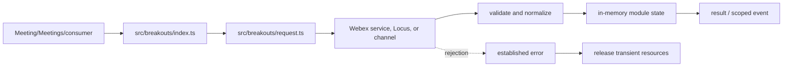
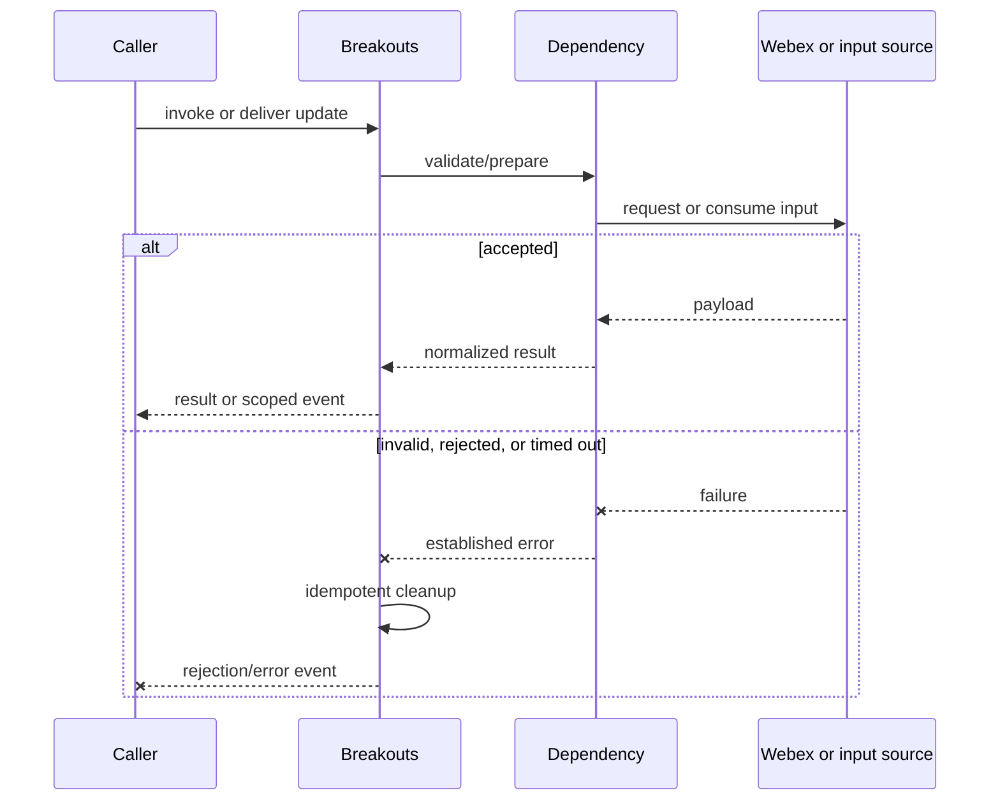
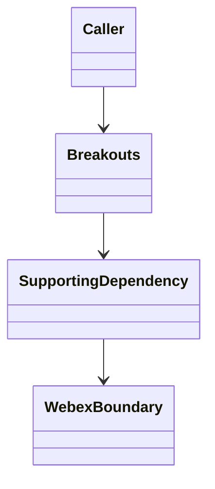
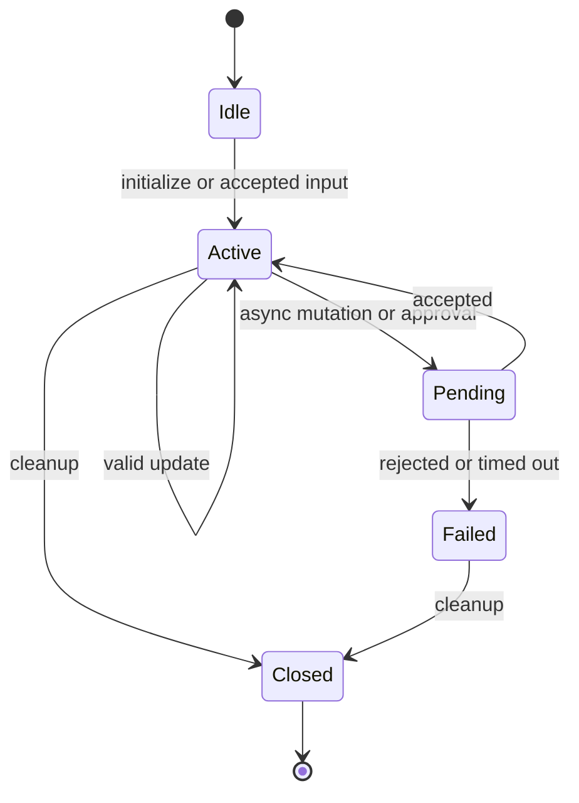

<!-- sdd-generated-metadata
doc_kind: module-spec
generated_from: module-spec@0.2.2
generator_plugin: repo-annotation@1.0.5+codex.20260818094939
generated_by: codex
approved_by: repository user
updated_at: 2026-08-18T15:33:39Z
validation_status: not-run
-->
# BREAKOUTS — SPEC

> Start here → root [`AGENTS.md`](../../../AGENTS.md) · router [`SPEC_INDEX.md`](../../../ai-docs/SPEC_INDEX.md) · system [`ARCHITECTURE.md`](../../../ai-docs/ARCHITECTURE.md). This is the canonical source-local spec for `src/breakouts/`.

## Metadata

| Field | Value |
|---|---|
| Module id | `breakouts` |
| Source path(s) | `src/breakouts/` |
| Parent spec | — |
| Doc kind | Module spec |
| Coverage score | 93% assessed 2026-08-18; 13/14 mandatory fields present; all critical fields present, one noncritical detail gap remains |
| Generated from | `module-spec` @ SDLC template library `0.2.2` |
| generated_by / approved_by / updated_at | codex / repository user / 2026-08-18T15:33:39Z |
| Validation status | not-run |

## Evidence Rules

Requirements cite current source and mirrored tests. Current code wins over retained prose when they conflict; commit and PR history are excluded. Missing evidence stays a gap.

## Source Material Register

| Source material | Scope | Decision | Detail location or disposition |
|---|---|---|---|
| Retained breakout feature guide | overview / API / behavior / tests | used and corrected; attendee/events structure was preserved, while stale host-API claims were replaced with current implemented operations and evidence |
| Current source and mirrored tests | implementation / tests | verified | requirements, flows, failures, and test strategy below |

## Overview

For orientation, start at `src/breakouts/index.ts`; supporting files under `src/breakouts/` separate request, parsing, collection, type, or utility concerns from parent orchestration. The module is composed by `Meeting`, `Meetings`, or the package entry as applicable. Remote Webex services/Locus remain authoritative, and all local state is scoped to the SDK, plugin, meeting, or operation lifetime.

## Purpose / Responsibility

Owns breakout-session projections, participant and host workflows, roster/broadcast/help events, edit-lock lifecycle, and server mutations.

## Stack

TypeScript/JavaScript in the Node 22.14 Yarn workspace; Webex core/plugin abstractions and Mocha/Sinon/`@webex/test-helper-chai` tests.

## Folder / Package Structure

```text
src/breakouts/
├── index.ts — primary behavior/entry point
├── request.ts — supporting request, type, utility, or constant behavior
└── ai-docs/breakouts-spec.md — canonical module specification
```

## Key Files (source of truth)

| File | Holds |
|---|---|
| `src/breakouts/index.ts` | Primary lifecycle and module surface |
| `src/breakouts/request.ts` | Supporting transport, types, constants, or normalization |
| `test/unit/spec/breakouts/index.ts` | Mirrored behavioral tests |

## Public Surface

| Contract ID | Type | Surface | Purpose | Compatibility / deprecation | Schema / detail link | Root index |
|---|---|---|---|---|---|---|
| `breakouts.1` | SDK / in-process / remote | initialize/query breakout session and roster state | Focused operation group owned by this module | Preserve methods/events/wire values reachable from package objects | `src/breakouts/index.ts` | [CONTRACTS](../../../ai-docs/CONTRACTS.md) |
| `breakouts.2` | SDK / in-process / remote | attendee join, leave, help, broadcast, and return-to-main flows | Focused operation group owned by this module | Preserve methods/events/wire values reachable from package objects | `src/breakouts/index.ts` | [CONTRACTS](../../../ai-docs/CONTRACTS.md) |
| `breakouts.3` | SDK / in-process / remote | host create, start, end, update, assign, lock, and roster operations | Focused operation group owned by this module | Preserve methods/events/wire values reachable from package objects | `src/breakouts/index.ts` | [CONTRACTS](../../../ai-docs/CONTRACTS.md) |

Compatibility notes:
- Prefer additive fields/options and preserve current rejection/event/cleanup semantics. Internal helpers are not public merely because they are exported within the source directory.

## Requires (dependencies)

Parent Meeting/Locus state, breakout service URL, request helper, breakout/member collections, event utilities, timers, role/capability fields, and metrics.

## Requirements

| ID | WHAT | WHY | Source Evidence | Test / Example Evidence | Assumptions / Gaps | Confidence |
|---|---|---|---|---|---|---|
| `BREAKOUTS-R-001` | initialize/query breakout session and roster state. | Owns breakout-session projections, participant and host workflows, roster/broadcast/help events, edit-lock lifecycle, and server mutations. | `src/breakouts/index.ts` | `test/unit/spec/breakouts/index.ts` | none | PRESENT |
| `BREAKOUTS-R-002` | attendee join, leave, help, broadcast, and return-to-main flows. | Consumers need deterministic behavior across meeting and remote updates. | `src/breakouts/index.ts`, `src/breakouts/request.ts` | `test/unit/spec/breakouts/index.ts` | inspect sibling tests for operation-specific cases | PRESENT |
| `BREAKOUTS-R-003` | Invalid, rejected, or terminal operations preserve the established failure signal and release module-owned transient resources. | Hidden failure or leaked state corrupts later meeting behavior. | `src/breakouts/index.ts` | `test/unit/spec/breakouts/index.ts` | verify every early exit during focused changes | PRESENT |
| `BREAKOUTS-R-004` | Roster, session type, broadcasts, help requests, and return-to-main updates reconcile into meeting-scoped breakout/session/member projections and events. | Attendees need current session membership and host messages without consuming raw Locus/service payloads. | `src/breakouts/index.ts`, `src/breakouts/breakout.ts`, `src/breakouts/collection.ts` | `test/unit/spec/breakouts/index.ts`, `test/unit/spec/breakouts/breakout.ts`, `test/unit/spec/breakouts/collection.ts` | none | PRESENT |
| `BREAKOUTS-R-005` | Host create/start/end/update/assign/move/remove operations use current management capability, session ids, and request contracts. | These operations mutate shared server state and must not be exposed as optimistic local collection edits. | `src/breakouts/index.ts`, `src/breakouts/request.ts` | `test/unit/spec/breakouts/index.ts`, `test/unit/spec/breakouts/request.ts` | none | PRESENT |
| `BREAKOUTS-R-006` | Edit-lock acquire/keepalive/unlock is coordinated around host configuration and maps lock conflicts to `BreakoutEditLockedError`. | Multiple hosts can edit breakout configuration; a stale lock must fail explicitly and release its timer. | `src/breakouts/index.ts`, `src/breakouts/edit-lock-error.ts`, `src/breakouts/utils.ts` | `test/unit/spec/breakouts/edit-lock-error.ts`, `test/unit/spec/breakouts/utils.js` | none | PRESENT |

## Design Overview

The primary controller/data module owns normalization and observable state while supporting files isolate request, type, constant, collection, or utility concerns. Capability and remote response data are checked before state changes. Async completion emits/returns one established outcome; cleanup handles listeners, timers, locks, channels, or transient requests owned by the module.

## Data Flow



## Sequence Diagram(s)

Sequence coverage:

The operation groups below share the same caller → module → supporting dependency → Webex/input ordering and the same rejection/cleanup contract, so one combined diagram covers their common sequence; operation-specific state and guards are stated in the requirements and use cases.

| Operation group | Diagram | Failure / recovery coverage |
|---|---|---|
| initialize/query breakout session and roster state | Read/derive or initialize | invalid/capability rejection |
| attendee join, leave, help, broadcast, and return-to-main flows | Mutate or react | remote rejection/timeout and cleanup |



## Class / Component Relationships



The module owns its projection/controller and composes supporting requests, types, constants, collections, or utilities. The Webex boundary remains authoritative.

## Use Cases

- **UC-1 Primary:** the parent/consumer requests initialize/query breakout session and roster state; the module validates or derives data and returns/emits the normalized outcome. Evidence: `src/breakouts/index.ts`, `test/unit/spec/breakouts/index.ts`.
- **UC-2 Change:** the parent/consumer triggers attendee join, leave, help, broadcast, and return-to-main flows; capability/current state is checked, the dependency is invoked, and accepted state is exposed once. Evidence: `src/breakouts/index.ts`, `src/breakouts/request.ts`.

## State Model

Breakout collection, current/main session ids, management capability, edit-lock token/timer, roster state, subscriptions, and pending metric context are meeting scoped.

## Business Rules & Invariants

- Host mutations require management capability and a valid edit lock where applicable; collection/session ids remain consistent; cleanup releases subscriptions and lock keepalive. Enforced under `src/breakouts/`.

## Concurrency & Reactive Flow

- Remote/event/promise/timer callbacks may interleave. Preserve current identity/sequence guards, allow only the intended in-flight operation, and make listener/timer/channel cleanup idempotent.

## State Machine



Exact state values/guards remain in `src/breakouts/index.ts`; this diagram groups the externally meaningful lifecycle.

## Error Handling & Failure Modes

| Condition | Signal | Caller recovery |
|---|---|---|
| missing capability, identity, URL, or invalid options | validation/established rejection | refresh state or correct input; do not retry unchanged |
| service/channel/request rejection | propagated request or module error | branch on error; retry only through existing bounded policy |
| timeout, role change, or teardown race | rejected/ignored stale result with cleanup | re-read current meeting state and invoke again only if still eligible |

## Pitfalls

- The retained README says host operations were not implemented, but current code implements create/start/end/update/assignment and edit locking. Do not preserve that stale limitation.
- Verify both typed constants/enums and raw wire values before changing a logical condition in this legacy package.

## Module Do's / Don'ts

- DO preserve the module's current role/capability/state gate and mirrored tests.
- DON'T bypass the owning request, collection, event scope, lock, or cleanup helper.

## Key Design Trade-off

- Edit locking prevents concurrent host configuration conflicts, but requires keepalive, unlock, and failure cleanup around mutations.

## Test-Case Strategy (module)

Start with the mirrored suite and sibling files in the same test directory. Cover successful derivation/mutation plus invalid capability/input, remote rejection, stale event, and cleanup. Use Sinon, `calledOnceWithExactly`, and fake timers for retry/lock/token/channel timing.

| Behavior / Requirement | Existing test evidence | Gap |
|---|---|---|
| `BREAKOUTS-R-001` | `test/unit/spec/breakouts/index.ts` | inspect sibling tests for full operation matrix |
| `BREAKOUTS-R-002` | `test/unit/spec/breakouts/index.ts` | verify rejected and role/capability-change branches |
| `BREAKOUTS-R-003` | `test/unit/spec/breakouts/index.ts` | verify cleanup on all early exits |
| `BREAKOUTS-R-004` | `test/unit/spec/breakouts/index.ts`, `test/unit/spec/breakouts/breakout.ts` | verify duplicate/out-of-order roster updates |
| `BREAKOUTS-R-005` | `test/unit/spec/breakouts/request.ts` | verify management-capability rejection |
| `BREAKOUTS-R-006` | `test/unit/spec/breakouts/edit-lock-error.ts`, `test/unit/spec/breakouts/utils.js` | verify keepalive/unlock cleanup on failure |

## Traceability

- Repo architecture: [`ARCHITECTURE.md`](../../../ai-docs/ARCHITECTURE.md) · Registry: [`SPEC_INDEX.md`](../../../ai-docs/SPEC_INDEX.md)
- Coverage state and contracts baseline: `../../../.sdd/manifest.json`
