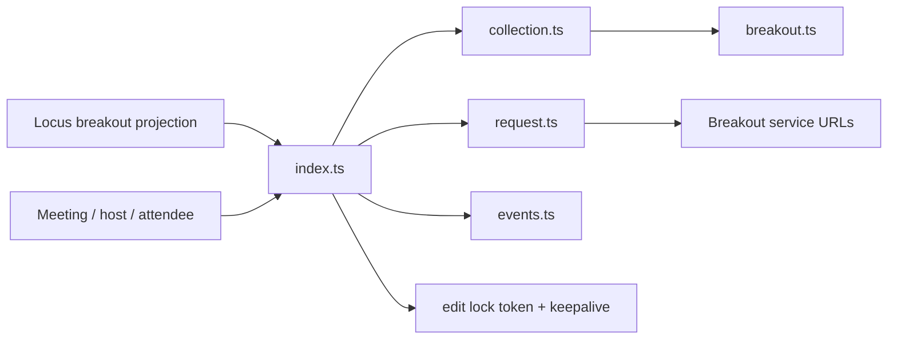
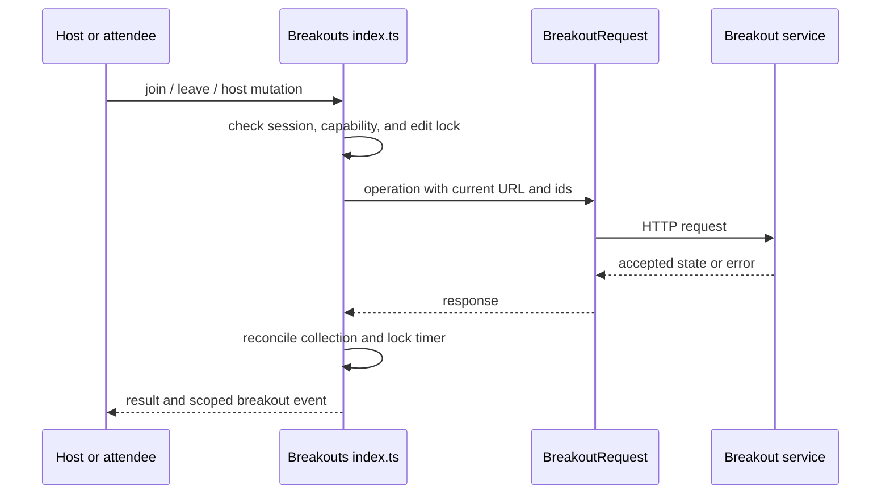
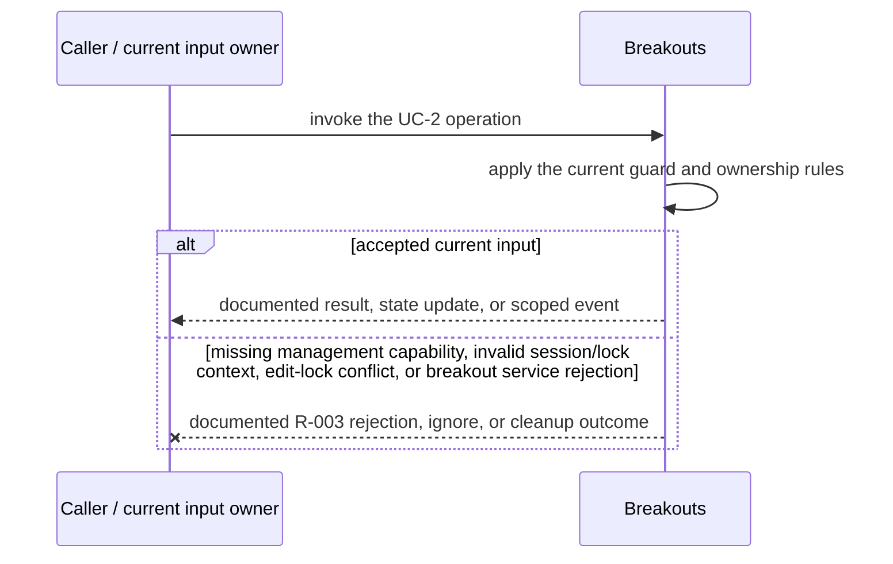
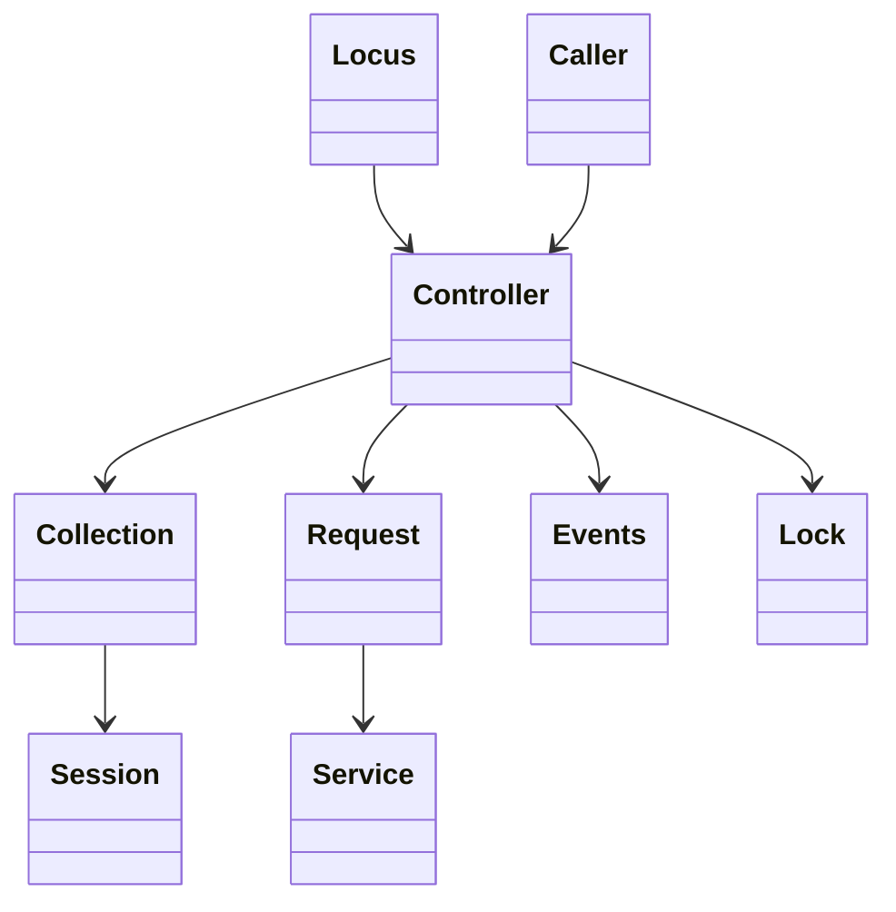
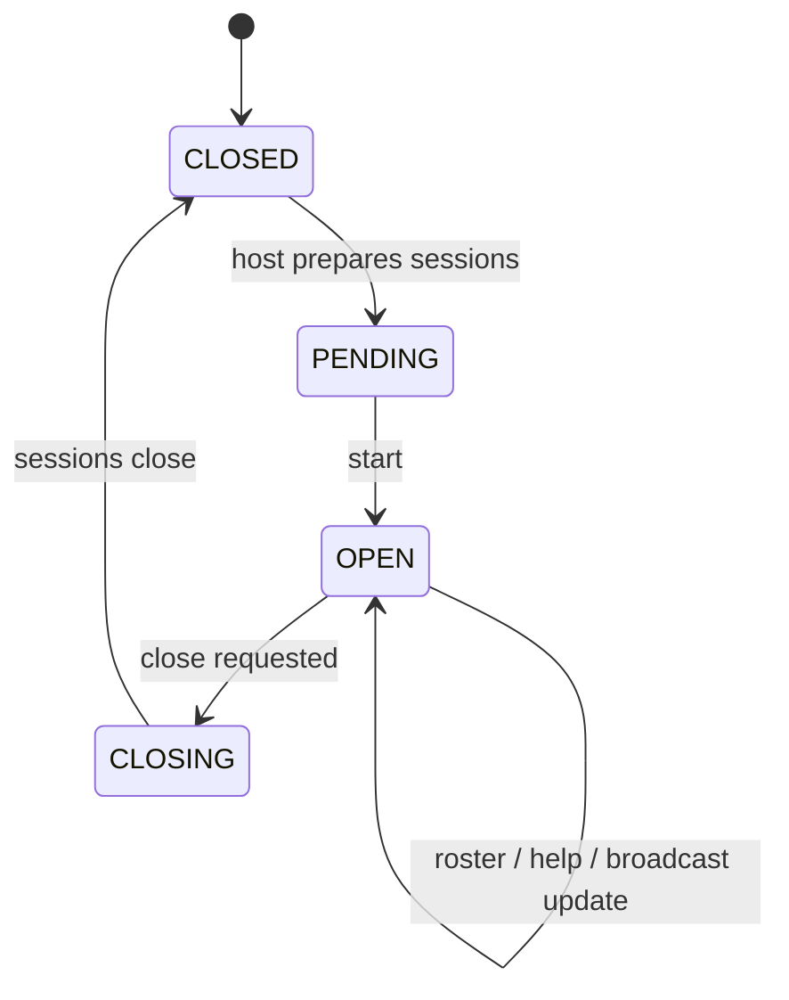

<!-- sdd-generated-metadata
doc_kind: module-spec
generated_from: module-spec@0.2.2
generator_plugin: repo-annotation@1.0.5+codex.20260818094939
generated_by: codex
approved_by: repository user
updated_at: 2026-08-21T06:10:05Z
validation_status: not-run
-->
# BREAKOUTS — SPEC

> Start here → root [`AGENTS.md`](../../../AGENTS.md) · router [`SPEC_INDEX.md`](../../../ai-docs/SPEC_INDEX.md) · system [`ARCHITECTURE.md`](../../../ai-docs/ARCHITECTURE.md). This is the canonical source-local spec for `src/breakouts/`.

## Metadata

| Field | Value |
|---|---|
| Module id | `breakouts` |
| Source path(s) | `src/breakouts/` |
| Parent spec | — |
| Doc kind | Module spec |
| Coverage score | 93% assessed 2026-08-21; 13/14 mandatory fields present; all critical and Important fields present; one noncritical polish gap remains |
| Generated from | `module-spec` @ SDLC template library `0.2.2` |
| generated_by / approved_by / updated_at | codex / repository user / 2026-08-21T06:10:05Z |
| Validation status | not-run |

## Evidence Rules

Requirements cite current source and mirrored tests. Current code wins over retained prose when they conflict; commit and PR history are excluded. Missing evidence stays a gap.

## Source Material Register

| Source material | Scope | Decision | Detail location or disposition |
|---|---|---|---|
| Retained breakout feature guide | overview / API / behavior / tests | used and corrected; attendee/events structure was preserved, while stale host-API claims were replaced with current implemented operations and evidence |
| Current source and mirrored tests | implementation / tests | verified | requirements, flows, failures, and test strategy below |

## Overview

`src/breakouts/` contains 8 direct source/reference file(s) and has 7 mirrored unit-test file(s). This spec separates its public operations, runtime data movement, component ownership, state applicability, and verification boundary.

## Purpose / Responsibility

Owns breakout-session projections, participant and host workflows, roster/broadcast/help events, edit-lock lifecycle, and server mutations.

## Stack

TypeScript/JavaScript in the Node 22.14 Yarn workspace; Webex core/plugin abstractions and Mocha/Sinon/`@webex/test-helper-chai` tests.

## Folder / Package Structure

```text
src/breakouts/
├── README.md — retained legacy reference input
├── breakout.ts — breakout implementation responsibility
├── collection.ts — module-owned collection
├── edit-lock-error.ts — module-specific error type
├── events.ts — event names and emission helpers
├── index.ts — module facade/controller or primary exports
├── request.ts — HTTP request boundary
├── utils.ts — normalization/helper functions
└── ai-docs/breakouts-spec.md — canonical module specification
```

## Key Files (source of truth)

| File | Holds |
|---|---|
| `src/breakouts/README.md` | retained legacy reference input |
| `src/breakouts/breakout.ts` | breakout implementation responsibility |
| `src/breakouts/collection.ts` | module-owned collection |
| `src/breakouts/edit-lock-error.ts` | module-specific error type |
| `src/breakouts/events.ts` | event names and emission helpers |
| `src/breakouts/index.ts` | module facade/controller or primary exports |
| `src/breakouts/request.ts` | HTTP request boundary |
| `src/breakouts/utils.ts` | normalization/helper functions |
| `test/unit/spec/breakouts/breakout.ts` and 6 sibling test file(s) | mirrored characterization/unit coverage |

## Public Surface

| Contract ID | Type | Surface | Purpose | Compatibility / deprecation | Schema / detail link | Root index |
|---|---|---|---|---|---|---|
| `breakouts.1` | SDK / in-process / remote | initialize/query breakout session and roster state | Focused operation group owned by this module | Preserve methods/events/wire values reachable from package objects | `src/breakouts/index.ts` | [CONTRACTS](../../../ai-docs/CONTRACTS.md) |
| `breakouts.2` | SDK / in-process / remote | attendee join, leave, help, broadcast, and return-to-main flows | Focused operation group owned by this module | Preserve methods/events/wire values reachable from package objects | `src/breakouts/index.ts` | [CONTRACTS](../../../ai-docs/CONTRACTS.md) |
| `breakouts.3` | SDK / in-process / remote | host create, start, end, update, assign, lock, and roster operations | Focused operation group owned by this module | Preserve methods/events/wire values reachable from package objects | `src/breakouts/index.ts` | [CONTRACTS](../../../ai-docs/CONTRACTS.md) |

Compatibility notes:
- Prefer additive fields/options and preserve current rejection/event/cleanup semantics. Internal helpers are not public merely because they are exported within the source directory.

## Requires (dependencies)

Parent Meeting/Locus state, breakout service URL, request helper, breakout/member collections, event utilities, timers, role/capability fields, and metrics.

## Requirements

| ID | WHAT | WHY | Source Evidence | Test / Example Evidence | Assumptions / Gaps | Confidence |
|---|---|---|---|---|---|---|
| `BREAKOUTS-R-001` | initialize/query breakout session and roster state. | Owns breakout-session projections, participant and host workflows, roster/broadcast/help events, edit-lock lifecycle, and server mutations. | `src/breakouts/index.ts` | `test/unit/spec/breakouts/index.ts` | none | PRESENT |
| `BREAKOUTS-R-002` | attendee join, leave, help, broadcast, and return-to-main flows. | Consumers need deterministic behavior across meeting and remote updates. | `src/breakouts/index.ts`, `src/breakouts/request.ts` | `test/unit/spec/breakouts/index.ts` | inspect sibling tests for operation-specific cases | PRESENT |
| `BREAKOUTS-R-003` | Request failures remain caller-visible; edit-lock conflicts are mapped explicitly, and lock/listener cleanup cancels the keepalive rather than leaving a stale editor. | Callers must receive the actual module failure outcome without false cleanup or event guarantees. | `src/breakouts/` | `test/unit/spec/breakouts/index.ts` | none | PRESENT |
| `BREAKOUTS-R-004` | Roster, session type, broadcasts, help requests, and return-to-main updates reconcile into meeting-scoped breakout/session/member projections and events. | Attendees need current session membership and host messages without consuming raw Locus/service payloads. | `src/breakouts/index.ts`, `src/breakouts/breakout.ts`, `src/breakouts/collection.ts` | `test/unit/spec/breakouts/index.ts`, `test/unit/spec/breakouts/breakout.ts`, `test/unit/spec/breakouts/collection.ts` | none | PRESENT |
| `BREAKOUTS-R-005` | Host create/start/end/update/assign/move/remove operations use current management capability, session ids, and request contracts. | These operations mutate shared server state and must not be exposed as optimistic local collection edits. | `src/breakouts/index.ts`, `src/breakouts/request.ts` | `test/unit/spec/breakouts/index.ts`, `test/unit/spec/breakouts/request.ts` | none | PRESENT |
| `BREAKOUTS-R-006` | Edit-lock acquire/keepalive/unlock is coordinated around host configuration and maps lock conflicts to `BreakoutEditLockedError`. | Multiple hosts can edit breakout configuration; a stale lock must fail explicitly and release its timer. | `src/breakouts/index.ts`, `src/breakouts/edit-lock-error.ts`, `src/breakouts/utils.ts` | `test/unit/spec/breakouts/edit-lock-error.ts`, `test/unit/spec/breakouts/utils.js` | none | PRESENT |

## Design Overview

Breakouts projects Locus breakout state into `Breakout` objects and a collection, delegates server mutations to `BreakoutRequest`, emits feature events from `events.ts`, and owns the edit-lock keepalive timer.

## Data Flow



## Sequence Diagram(s)

Sequence coverage:

| Operation group | Diagram | Failure coverage |
|---|---|---|
| UC-1 — primary operation | Primary operation sequence | accepted and rejected dependency outcomes |
| UC-2 — secondary/change operation | Secondary operation and failure sequence | missing management capability, invalid session/lock context, edit-lock conflict, or breakout service rejection |

### Primary operation sequence



### Secondary operation and failure sequence



## Class / Component Relationships



The arrows identify ownership and delegation inside `src/breakouts/`; files that only declare types or constants are not presented as transports.

## Use Cases

- **UC-1:** Reconcile session, roster, help, broadcast, and return-to-main changes into the meeting-scoped collection. Evidence: `src/breakouts/`.
- **UC-2:** Acquire and refresh an edit lock before protected host configuration mutations, mapping lock conflicts to `BreakoutEditLockedError`. Evidence: `src/breakouts/`.

## State Model

Breakout collection, current/main session ids, management capability, edit-lock token/timer, roster state, subscriptions, and pending metric context are meeting scoped.

## Business Rules & Invariants

- Host mutations require management capability and a valid edit lock where applicable; collection/session ids remain consistent; cleanup releases subscriptions and lock keepalive. Enforced under `src/breakouts/`.

## Concurrency & Reactive Flow

- Async work owned by `Breakouts` may complete after a newer caller or remote input. Preserve the identity, sequence, and resource-owner guards in `src/breakouts/`; a late completion must not replay UC-2 for superseded state.

## State Machine



The diagram uses the breakout `CLOSED`, `PENDING`, `OPEN`, and `CLOSING` values declared in `src/constants.ts`.

## Error Handling & Failure Modes

| Condition | Signal | Caller recovery |
|---|---|---|
| missing management capability, invalid session/lock context, edit-lock conflict, or breakout service rejection | Follow the concrete rejection, ignore, state, or cleanup behavior in the module's R-003 requirement. | Resolve the named condition; retry only when another requirement defines a bound. |
| UC-1 succeeds | Return, update, callback, or scoped event identified by the Public Surface and primary sequence. | Continue from the owning module's accepted state. |

## Pitfalls

- The retained README says host operations were not implemented, but current code implements create/start/end/update/assignment and edit locking. Do not preserve that stale limitation.
- Verify both typed constants/enums and raw wire values before changing a logical condition in this legacy package.

## Module Do's / Don'ts

- DO preserve this boundary: Reconcile session, roster, help, broadcast, and return-to-main changes into the meeting-scoped collection.
- DON'T move remote I/O or lifecycle ownership into a passive type, constant, catalog, or normalization file.

## Key Design Trade-off

- Edit locking prevents concurrent host configuration conflicts, but requires keepalive, unlock, and failure cleanup around mutations.

## Test-Case Strategy (module)

Use the current mirrored suites: `test/unit/spec/breakouts/breakout.ts`, `test/unit/spec/breakouts/collection.ts`, `test/unit/spec/breakouts/edit-lock-error.ts`, `test/unit/spec/breakouts/events.ts`, `test/unit/spec/breakouts/index.ts`, `test/unit/spec/breakouts/request.ts`, `test/unit/spec/breakouts/utils.js`. Characterize the two code-grounded use cases above and the listed failure condition; add cleanup or transition cases only for resources and state this module actually owns.

| Behavior / Requirement | Existing test evidence | Gap |
|---|---|---|
| `BREAKOUTS-R-001` | `test/unit/spec/breakouts/index.ts` | inspect sibling tests for full operation matrix |
| `BREAKOUTS-R-002` | `test/unit/spec/breakouts/index.ts` | verify the operation-specific invalid-input and rejection branches |
| `BREAKOUTS-R-003` | `test/unit/spec/breakouts/index.ts` | verify the concrete R-003 rejection, ignore, or cleanup outcome |
| `BREAKOUTS-R-004` | `test/unit/spec/breakouts/index.ts`, `test/unit/spec/breakouts/breakout.ts` | verify duplicate/out-of-order roster updates |
| `BREAKOUTS-R-005` | `test/unit/spec/breakouts/request.ts` | verify management-capability rejection |
| `BREAKOUTS-R-006` | `test/unit/spec/breakouts/edit-lock-error.ts`, `test/unit/spec/breakouts/utils.js` | verify keepalive/unlock cleanup on failure |

## Traceability

- Repo architecture: [`ARCHITECTURE.md`](../../../ai-docs/ARCHITECTURE.md) · Registry: [`SPEC_INDEX.md`](../../../ai-docs/SPEC_INDEX.md)
- Coverage state and contracts baseline: `../../../.sdd/manifest.json`
