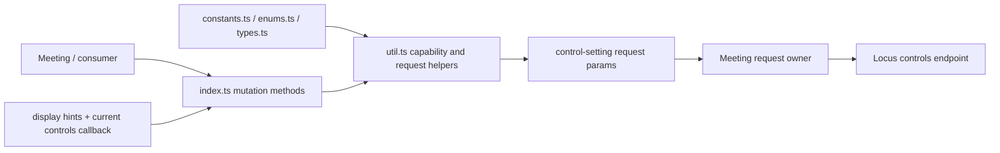
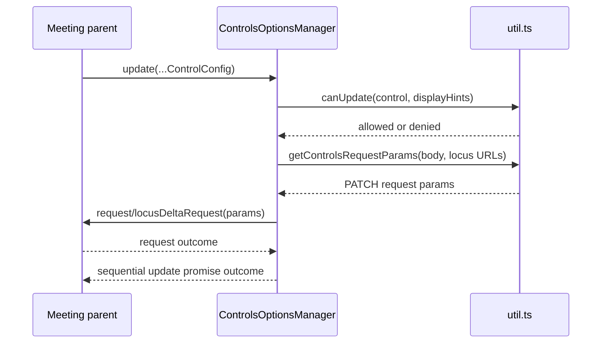
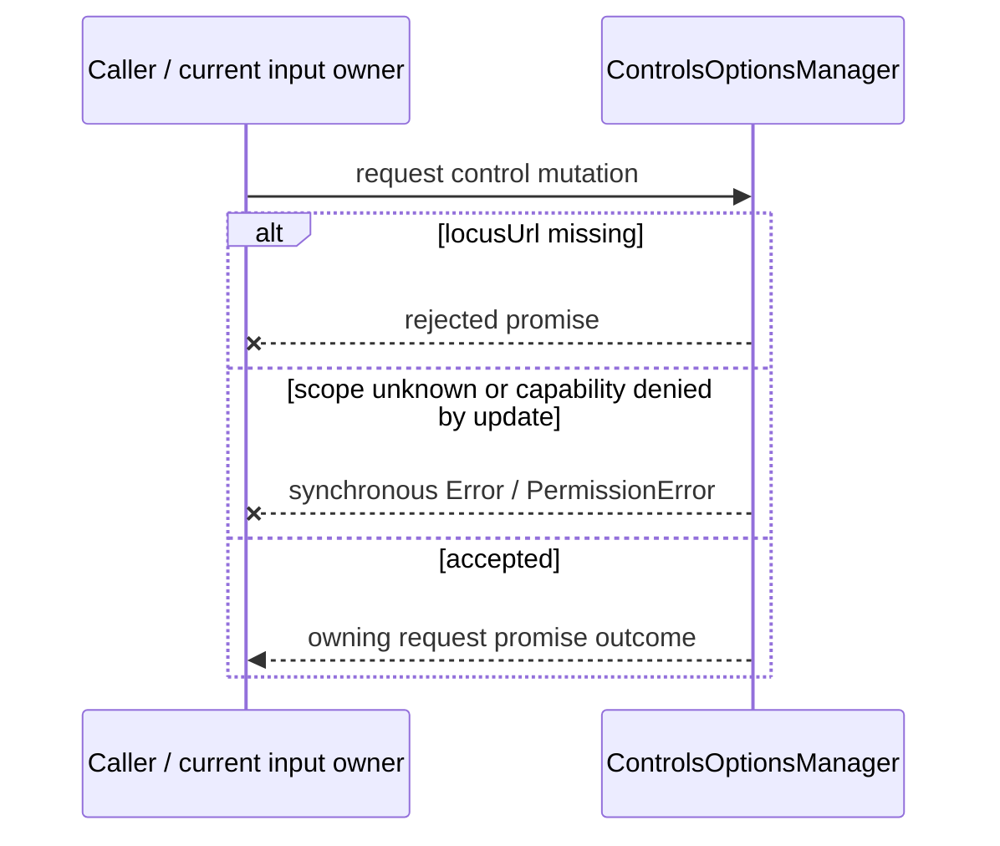
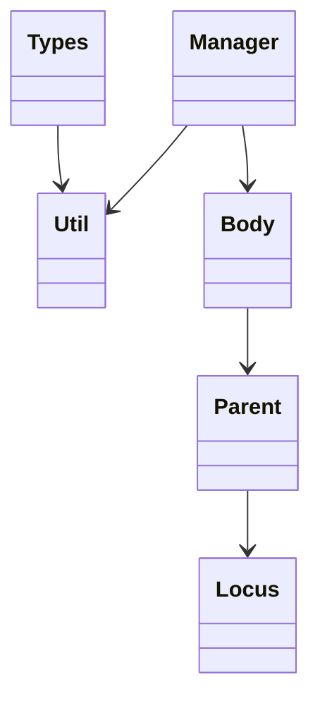

<!-- sdd-generated-metadata
doc_kind: module-spec
generated_from: module-spec@0.2.2
generator_plugin: repo-annotation@1.0.5+codex.20260818094939
generated_by: codex
approved_by: repository user
updated_at: 2026-08-22T15:21:29Z
validation_status: pass-with-warnings
-->
# CONTROLS OPTIONS MANAGER — SPEC

> Start here → root [`AGENTS.md`](../../../AGENTS.md) · router [`SPEC_INDEX.md`](../../../ai-docs/SPEC_INDEX.md) · system [`ARCHITECTURE.md`](../../../ai-docs/ARCHITECTURE.md). This is the canonical source-local spec for `src/controls-options-manager/`.

## Metadata

| Field | Value |
|---|---|
| Module id | `controls-options-manager` |
| Source path(s) | `src/controls-options-manager/` |
| Parent spec | — |
| Doc kind | Module spec |
| Coverage score | 93% assessed 2026-08-22; 13/14 mandatory fields present; all critical and Important fields present; one noncritical polish gap remains; pending independent validation of the participant-role repair |
| Generated from | `module-spec` @ SDLC template library `0.2.2` |
| generated_by / approved_by / updated_at | codex / repository user / 2026-08-22T15:21:29Z |
| Validation status | pass-with-warnings |

## Evidence Rules

Requirements cite current source and mirrored tests. Current code wins over retained prose when they conflict; commit and PR history are excluded. Missing evidence stays a gap.

## Source Material Register

| Source material | Scope | Decision | Detail location or disposition |
|---|---|---|---|
| No routed legacy module spec | overview / API / behavior / tests | none; generated from current manager/types/enums/constants/utilities and tests |
| Current source and mirrored tests | implementation / tests | verified | requirements, flows, failures, and test strategy below |

## Overview

`src/controls-options-manager/` contains 5 direct source/reference file(s) and has 2 mirrored unit-test file(s). This spec separates its public operations, runtime data movement, component ownership, state applicability, and verification boundary.

## Purpose / Responsibility

Validates requested meeting-control mutations against display hints, builds the declared control bodies, and sends them through the owning Meeting request object.

## Stack

TypeScript/JavaScript in the Node 22.14 Yarn workspace; Webex core/plugin abstractions and Mocha/Sinon/`@webex/test-helper-chai` tests.

## Folder / Package Structure

```text
src/controls-options-manager/
├── constants.ts — module constants and wire values
├── enums.ts — declared action/control enum values
├── index.ts — module facade/controller or primary exports
├── types.ts — module type declarations
├── util.ts — normalization/helper functions
└── ai-docs/controls-options-manager-spec.md — canonical module specification
```

## Key Files (source of truth)

| File | Holds |
|---|---|
| `src/controls-options-manager/constants.ts` | module constants and wire values |
| `src/controls-options-manager/enums.ts` | declared action/control enum values |
| `src/controls-options-manager/index.ts` | module facade/controller or primary exports |
| `src/controls-options-manager/types.ts` | module type declarations |
| `src/controls-options-manager/util.ts` | normalization/helper functions |
| `test/unit/spec/controls-options-manager/index.js` and 1 sibling test file(s) | mirrored characterization/unit coverage |

## Public Surface

| Contract ID | Type | Surface | Purpose | Compatibility / deprecation | Schema / detail link | Root index |
|---|---|---|---|---|---|---|
| `controls-options-manager.1` | SDK / configuration | `set()`, `setLocusUrl()`, `setDisplayHints()`, `getLocusUrl()`, and `getDisplayHints()` | Hold current/main Locus URLs and display hints used to authorize later control mutations. | Preserve current setter/getter semantics; no normalized query projection is exposed. | `src/controls-options-manager/index.ts` | [CONTRACTS](../../../ai-docs/CONTRACTS.md) |
| `controls-options-manager.2` | SDK / remote | `update(ControlConfig[])` | Validate each scoped mutation with `Utils.canUpdate()` and send the generated requests sequentially. | Unknown scopes and denied capabilities both throw synchronously while the batch is mapped; preserve request ordering and the returned request promise. | `src/controls-options-manager/index.ts`, `src/controls-options-manager/util.ts` | [CONTRACTS](../../../ai-docs/CONTRACTS.md) |
| `controls-options-manager.3` | SDK / remote | `setMuteOnEntry()`, `setDisallowUnmute()`, and `setMuteAll()` | Build the audio-control bodies permitted by current display hints and route them to main/breakout Locus context. | Preserve body keys, capability checks, and breakout authorization selection. | `src/controls-options-manager/index.ts` | [CONTRACTS](../../../ai-docs/CONTRACTS.md) |
| `controls-options-manager.4` | exported predicates | `Utils.canSetMuteOnEntry()`, `canUnsetMuteOnEntry()`, `canSetDisallowUnmute()`, `canUnsetDisallowUnmute()`, `canSetMuted()`, `canUnsetMuted()`, `hasHints()`, `hasPolicies()`, `canUpdateAudio()`, `canUpdateRaiseHand()`, `canUpdateReactions()`, `canUpdateShareControl()`, `canUpdateViewTheParticipantsList()`, `canUpdateVideo()`, `canUpdateAnnotation()`, `canUpdateRemoteDesktopControl()`, and `canUpdatePollingQA()` | Centralize capability interpretation for every supported control family. | These are static utilities, not manager instance query APIs. | `src/controls-options-manager/util.ts` | [CONTRACTS](../../../ai-docs/CONTRACTS.md) |
| `controls-options-manager.5` | exported routing utilities | `Utils.canUpdate()`, `isAudioControl()`, `isBreakoutLocusUrl()`, and `getControlsRequestParams()` | Select the permitted control family, request URL, and request body for each mutation. | Preserve scope matching and main-versus-breakout routing rules. | `src/controls-options-manager/util.ts` | [CONTRACTS](../../../ai-docs/CONTRACTS.md) |
| `controls-options-manager.6` | exported class/constants/types | `ControlsOptionsManager`, `ENABLED`, `CAN_SET`, `CAN_UNSET`, `AUDIO_CONTROL_BODY_KEYS`, `Control`, `Setting`, `ControlProperties`, `AudioProperties`, `RaiseHandProperties`, `ReactionsProperties`, `ShareControlProperties`, `VideoProperties`, `ViewTheParticipantListProperties`, `AnnotationProperties`, `RemoteDesktopControlProperties`, `PollingQAProperties`, `Properties`, and `ControlConfig` | Share the exact configuration vocabulary accepted by `update()`. | Raw control/setting/body-key values and discriminated property shapes are compatibility-sensitive. | `src/controls-options-manager/index.ts`, `src/controls-options-manager/constants.ts`, `src/controls-options-manager/enums.ts`, `src/controls-options-manager/types.ts` | [CONTRACTS](../../../ai-docs/CONTRACTS.md) |

### Emitted events

Current source emits or forwards these observable literals for this operation boundary. Preserve literal values, scope, payload shape, and emission timing; a constant name alone is not a substitute for the consumer-visible value.

| Event literal | Constant / expression | Emission evidence |
|---|---|---|
| `meeting:actionsUpdate` | `EVENT_TRIGGERS.MEETING_ACTIONS_UPDATE` | `src/meeting/index.ts` |
| `meeting:controls:ai-summary-notification:updated` | `EVENT_TRIGGERS.MEETING_CONTROLS_AI_SUMMARY_NOTIFICATION_UPDATED` | `src/meeting/index.ts` |
| `meeting:controls:annotation:updated` | `EVENT_TRIGGERS.MEETING_CONTROLS_ANNOTATION_UPDATED` | `src/meeting/index.ts` |
| `meeting:controls:auto-end-meeting-warning:updated` | `EVENT_TRIGGERS.MEETING_CONTROLS_AUTO_END_MEETING_WARNING_UPDATED` | `src/meeting/index.ts` |
| `meeting:controls:disallow-unmute:updated` | `EVENT_TRIGGERS.MEETING_CONTROLS_DISALLOW_UNMUTE_UPDATED` | `src/meeting/index.ts` |
| `meeting:controls:meeting-full:updated` | `EVENT_TRIGGERS.MEETING_CONTROLS_MEETING_FULL_UPDATED` | `src/meeting/index.ts` |
| `meeting:controls:mute-on-entry:updated` | `EVENT_TRIGGERS.MEETING_CONTROLS_MUTE_ON_ENTRY_UPDATED` | `src/meeting/index.ts` |
| `meeting:controls:polling-qa:updated` | `EVENT_TRIGGERS.MEETING_CONTROLS_POLLING_QA_UPDATED` | `src/meeting/index.ts` |
| `meeting:controls:practice-session-status:updated` | `EVENT_TRIGGERS.MEETING_CONTROLS_PRACTICE_SESSION_STATUS_UPDATED` | `src/meeting/index.ts` |
| `meeting:controls:raise-hand:updated` | `EVENT_TRIGGERS.MEETING_CONTROLS_RAISE_HAND_UPDATED` | `src/meeting/index.ts` |
| `meeting:controls:reactions:updated` | `EVENT_TRIGGERS.MEETING_CONTROLS_REACTIONS_UPDATED` | `src/meeting/index.ts` |
| `meeting:controls:remote-desktop-control:updated` | `EVENT_TRIGGERS.MEETING_CONTROLS_REMOTE_DESKTOP_CONTROL_UPDATED` | `src/meeting/index.ts` |
| `meeting:controls:share-control:updated` | `EVENT_TRIGGERS.MEETING_CONTROLS_SHARE_CONTROL_UPDATED` | `src/meeting/index.ts` |
| `meeting:controls:stage-view:updated` | `EVENT_TRIGGERS.MEETING_CONTROLS_STAGE_VIEW_UPDATED` | `src/meeting/index.ts` |
| `meeting:controls:video:updated` | `EVENT_TRIGGERS.MEETING_CONTROLS_VIDEO_UPDATED` | `src/meeting/index.ts` |
| `meeting:controls:view-the-participants-list:updated` | `EVENT_TRIGGERS.MEETING_CONTROLS_VIEW_THE_PARTICIPANTS_LIST_UPDATED` | `src/meeting/index.ts` |
| `meeting:controls:webcast:updated` | `EVENT_TRIGGERS.MEETING_CONTROLS_WEBCAST_UPDATED` | `src/meeting/index.ts` |
| `meeting:layout:update` | `EVENT_TRIGGERS.MEETING_CONTROLS_LAYOUT_UPDATE` | `src/meeting/index.ts` |

Compatibility notes:
- Prefer additive fields/options and preserve current return and rejection semantics. Internal helpers are not public merely because they are exported within the source directory.

## Requires (dependencies)

Locus controls, control/setting enums, constants, utility normalization, parent meeting request access, and role/capability state.

## Requirements

| ID | WHAT | WHY | Source Evidence | Test / Example Evidence | Assumptions / Gaps | Confidence |
|---|---|---|---|---|---|---|
| `CONTROLS-OPTIONS-MANAGER-R-001` | `update` validates each `ControlConfig` scope and display-hint capability, builds one request body per control, and sends them sequentially. | Invalid or unauthorized shared-control mutations must fail before they reach Locus, and accepted mutations must preserve caller order. | `src/controls-options-manager/index.ts`, `src/controls-options-manager/util.ts` | `test/unit/spec/controls-options-manager/index.js` | none | PRESENT |
| `CONTROLS-OPTIONS-MANAGER-R-002` | `ControlsOptionsManager` exposes URL/hint accessors and mutation methods; `canSet*`, `canUnset*`, and `canUpdate*` predicates are static methods on `util.ts`, not instance query APIs or normalized properties. | Consumers must not depend on an availability/current-value surface the manager does not implement. | `src/controls-options-manager/index.ts`, `src/controls-options-manager/util.ts` | `test/unit/spec/controls-options-manager/index.js`, `test/unit/spec/controls-options-manager/util.js` | none | PRESENT |
| `CONTROLS-OPTIONS-MANAGER-R-003` | Missing `locusUrl` returns a rejected promise, an unknown scope or failed `canUpdate` check throws synchronously in `update`, and legacy audio setters reject unauthorized values; the module allocates no listener or timer. | Callers must distinguish validation throws from returned request rejections and must not expect cleanup behavior the module does not own. | `src/controls-options-manager/` | `test/unit/spec/controls-options-manager/index.js` | none | PRESENT |

## Design Overview

`index.ts` stores request context, validates mutations using static predicates from `util.ts`, builds control request bodies, and sends them through `request` or `locusDeltaRequest`. It exposes no normalized-control property or enabled-state query surface and owns no listeners or timers.

## Data Flow



## Sequence Diagram(s)

Sequence coverage:

| Operation group | Diagram | Failure coverage |
|---|---|---|
| UC-1…UC-4 — control mutation operation groups | Control mutation primary sequence | unknown scope, denied display hint, missing Locus URL, and request rejection |
| UC-1…UC-4 — control mutation alternate/failure paths | Control mutation alternate/failure sequence | unknown control/setting, absent capability, or malformed Locus control data |

### Control mutation primary sequence



### Control mutation alternate/failure sequence



## Class / Component Relationships



The arrows identify ownership and delegation inside `src/controls-options-manager/`; files that only declare types or constants are not presented as transports.

## Use Cases

- **UC-1:** Refresh current/main Locus URLs and display hints, then read those raw values without expecting a normalized control projection. Evidence: `src/controls-options-manager/index.ts`.
- **UC-2:** Validate and sequentially send a batch of scoped `ControlConfig` mutations using `Utils.canUpdate()` and `getControlsRequestParams()`. Evidence: `src/controls-options-manager/index.ts`, `src/controls-options-manager/util.ts`.
- **UC-3:** Build mute-on-entry and disallow-unmute bodies only when the matching set/unset display hints permit the requested value. Evidence: `src/controls-options-manager/index.ts`, `src/controls-options-manager/util.ts`.
- **UC-4:** Route mute-all to the appropriate main or breakout Locus authorization context and preserve permission/request failures. Evidence: `src/controls-options-manager/index.ts`, `src/controls-options-manager/util.ts`.

## State Model

The manager stores current/main Locus URLs, display hints, and callbacks for current controls/webinar status. It does not maintain a normalized control projection.

## Business Rules & Invariants

- A setting can be changed only when its control advertises the matching capability; request body keys use the declared control/setting map. Enforced under `src/controls-options-manager/`.

## Error Handling & Failure Modes

| Condition | Signal | Caller recovery |
|---|---|---|
| `locusUrl` is absent | Rejected `ParameterError` promise. | Set the current Locus URL before retrying. |
| Scope is unknown or `Util.canUpdate` denies it | Synchronous `Error` or `PermissionError` from `update`. | Correct the scope/properties or wait for matching display hints. |
| Request dependency rejects | Returned update/audio-control promise rejects. | Preserve the dependency error; retry only under caller policy. |

## Pitfalls

- The static `Util.canSet*`/`canUnset*`/`canUpdate*` predicates are implementation helpers, not instance query methods on `ControlsOptionsManager`.
- Verify both typed constants/enums and raw wire values before changing a logical condition in this legacy package.

## Test-Case Strategy (module)

Use the current mirrored suites: `test/unit/spec/controls-options-manager/index.js`, `test/unit/spec/controls-options-manager/util.js`. Characterize the controls-options-manager-specific use cases above and each listed failure condition; add cleanup or transition cases only for resources and state this module actually owns.

| Behavior / Requirement | Existing test evidence | Gap |
|---|---|---|
| `CONTROLS-OPTIONS-MANAGER-R-001` | `test/unit/spec/controls-options-manager/index.js` | cover every `Control`/`Setting` capability predicate and route |
| `CONTROLS-OPTIONS-MANAGER-R-002` | `test/unit/spec/controls-options-manager/index.js` | cover mixed-control batches and prove request order plus main/breakout URL selection |
| `CONTROLS-OPTIONS-MANAGER-R-003` | `test/unit/spec/controls-options-manager/index.js` | distinguish synchronous unknown-scope and permission errors from missing-URL and dependency promise rejections |

## Traceability

- Repo architecture: [`ARCHITECTURE.md`](../../../ai-docs/ARCHITECTURE.md) · Registry: [`SPEC_INDEX.md`](../../../ai-docs/SPEC_INDEX.md)
- Coverage state and contracts baseline: `../../../.sdd/manifest.json`
